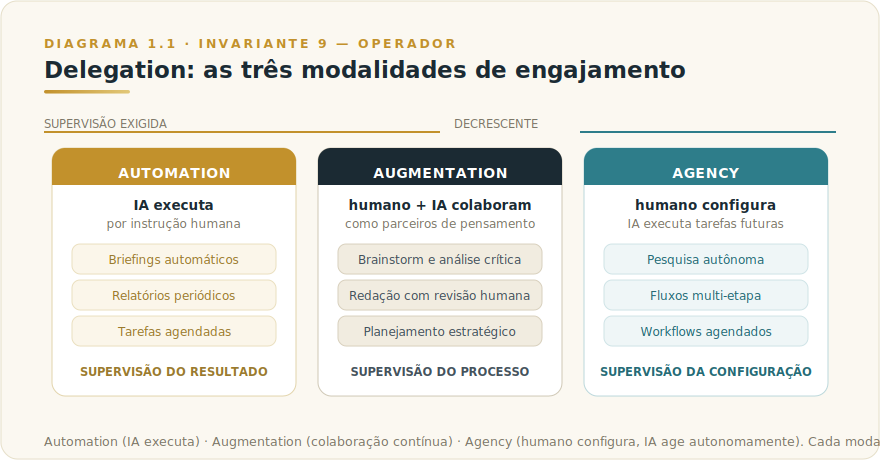
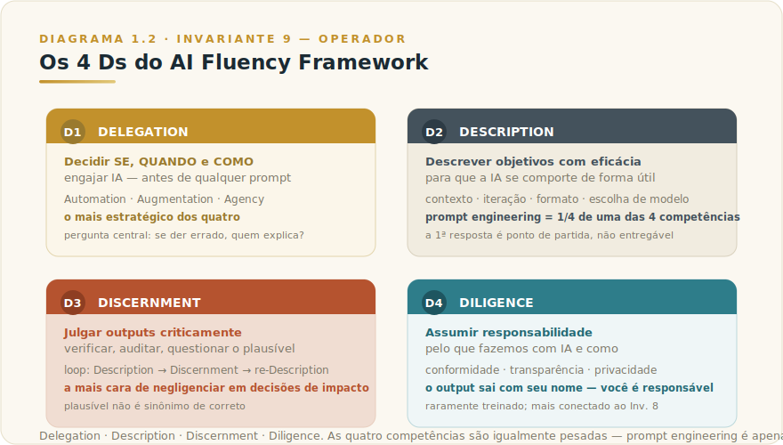
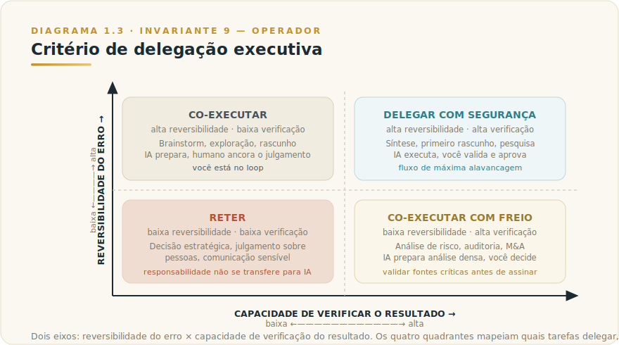

# CAPÍTULO 1
## AI FLUENCY EXECUTIVA

---

> *"A IA multiplica competência e incompetência pelo mesmo fator. AI Fluency é a disciplina que decide qual dos dois você está multiplicando."*

---

> 🧭 **Por que este capítulo é a aplicação do Invariante 9 — Operador**
>
> O Invariante 9 afirma: *"A IA multiplica competência e incompetência pelo mesmo fator."* A mecânica é direta — o modelo responde à instrução recebida com a mesma fluência, seja ela precisa ou vaga. O operador competente fornece instrução precisa, critério de aceitação explícito e capacidade de rejeitar saída inadequada. O operador sem critério fornece instrução vaga, aceita qualquer saída plausível, e recebe decepção que costuma ser atribuída à ferramenta. O ativo não é o modelo: é a inteligência humana que o opera.
>
> AI Fluency é a disciplina que torna essa diferença sistemática. Não é "aprender a usar prompts" — é desenvolver quatro competências que separam operador maduro de usuário medíocre: saber **quando e o que delegar** (Delegation), **como descrever bem** (Description), **como julgar o que recebe** (Discernment), e **como responder pelo que usa** (Diligence). Este capítulo entrega esse framework com profundidade executiva e mostra como a rotina semanal, os cinco usos principais e o critério de delegação são aplicações concretas dele.

---

## 1.1 — O CONCEITO INTUITIVO

Existe uma confusão que persiste em todas as organizações que adotam IA generativa: o problema é técnico. Equipes compram licenças, fazem workshops de prompt engineering, criam políticas de uso — e seis meses depois o impacto real é difuso. Algumas pessoas usam Claude com maestria e ganham horas por semana. A maioria usa de forma esporádica, obtém resultados mediocres, e conclui que "a IA não é tão boa assim".

A conclusão está errada. O problema não é a IA. É a ausência de fluência.

A Anthropic, em parceria com Prof. Joseph Feller (University College Cork) e Prof. Rick Dakan (Ringling College of Art and Design), publicou o AI Fluency Framework — um modelo de quatro competências que define o que significa interagir com IA de forma *eficaz, eficiente, ética e segura*. O insight central contradiz o foco de mercado: **prompt engineering é apenas um quarto de uma das quatro competências**. O restante — a escolha do que delegar, o julgamento sobre a saída, a responsabilidade sobre o uso — é o que determina se a IA vira vantagem ou ruído.

Para executivos, isso muda a pergunta. Não é "como escrevo um prompt melhor?". É "qual das quatro competências estou negligenciando — e o que isso está me custando?"

---

## 1.2 — OS QUATRO DS: O FRAMEWORK DE AI FLUENCY

O AI Fluency Framework da Anthropic define quatro competências interconectadas. Cada uma representa uma camada do que significa operar IA com proficiência. Nenhuma é secundária.

### 1.2.1 — Delegation: decidir se, quando e como engajar IA

Delegation é a primeira e mais estratégica das quatro competências. Antes de qualquer prompt ser escrito, o operador fluente faz a pergunta que a maioria pula: *esta tarefa se beneficia genuinamente de envolvimento da IA — e se sim, quanto, e com que supervisão?*

Delegation não é sobre a ferramenta. É sobre o trabalho. Um executivo fluente reconhece que algumas partes de um projeto pertencem a um humano (julgamento com consequências, decisões que exigem contexto relacional, comunicação em que o tom humano é o ponto), outras pertencem à IA (volume, primeiro rascunho, transformação de formato, síntese de informação densa), e outras são genuinamente colaborativas. Essa tríade — Automation, Augmentation, Agency, nos termos do framework — é o mapa de como engajar.

**Como Delegation falha em contexto executivo.** A falha clássica não é recusar a IA: é delegar o que não deveria ser delegado. Decisões sobre pessoas — promoção, demissão, feedback consequente —, julgamento estratégico irreversível, comunicação em crise onde o tom humano é o próprio conteúdo. O operador que delega essas tarefas não está sendo eficiente; está terceirizando responsabilidade que a ferramenta não pode carregar.

A falha inversa existe e também é cara: recusar delegar o que a IA executa com qualidade superior em fração do tempo — síntese de documentos longos, pesquisa de contexto, primeiro rascunho de comunicações escritas. Quem escreve todos os emails do zero "porque IA é imprecisa" está desperdiçando horas por semana em trabalho que um operador fluente processa em minutos.

**O critério prático.** A pergunta que separa os dois erros é esta: *se esse output der errado, quem explica ao board, ao cliente, à imprensa?* Se a resposta é você, a decisão final é sua. A IA pode preparar, estruturar, rascunhar — mas não pode decidir no seu lugar. A linha entre "IA prepara" e "humano decide" é o coração da Delegation executiva.

---

### 1.2.2 — Description: descrever objetivos para que a IA se comporte de forma útil

Description é onde o prompt engineering mora — mas é muito maior do que ele. Uma vez decidido que a IA deve participar (Delegation), o operador precisa descrever o que "bom" parece para essa tarefa. Isso inclui o design de input estruturado (quando dar template, quando dar exemplos), a provisão de contexto (que informação incluir, o que deixar de fora), a iteração e refinamento (o que ajustar quando o primeiro output está errado) e a escolha consciente do modelo para cada trabalho.

**Como Description falha em contexto executivo.** O erro mais comum não é prompt ruim; é contexto ausente. O executivo manda "me dê uma análise disso" sem especificar o que "isso" é, para quem a análise serve, que decisão ela vai informar, o que "boa análise" significa naquele contexto. O modelo responde com o plausível para a instrução recebida — e o plausível genérico raramente é o que o executivo precisava.

A outra falha frequente é não iterar. Executivos com agenda apertada tendem a pegar o primeiro output que parece razoável. Operadores fluentes sabem que a conversa — descrever, receber, discernir, re-descrever — é onde a qualidade real emerge. A primeira resposta é ponto de partida, não entregável.

**O ponto contraintuitivo.** Saber escrever prompts é habilidade real e vale desenvolver — o Capítulo 3 trata isso em profundidade. O que a maioria não percebe: Description, mesmo sendo a única competência coberta pela maioria dos treinamentos de "prompt engineering", representa uma fração do que determina o resultado real. Os outros três Ds respondem pelo resto.

---

### 1.2.3 — Discernment: julgar outputs de IA de forma crítica e eficaz

Discernment é a camada de avaliação que transforma saída de IA em valor — ou que impede que saída ruim cause dano. O output chegou. Está correto? Está enviesado? Está alucinado? Resolve o problema que foi descrito, ou apenas parece que resolve?

O framework da Anthropic identifica um ciclo central: Description → Discernment → re-Description. Você descreve, a IA responde, você discerne, você re-descreve, a IA melhora. Esse loop iterativo é o trabalho real de usar IA com qualidade. A maioria dos treinamentos de prompt pula essa parte porque é mais difícil de ensinar em workshop do que "aqui estão dez templates". Mas é onde a competência vive.

**Como Discernment falha em contexto executivo.** Claude alucina — e o faz com a mesma fluência com que acerta (Invariante 1 — Plausibilidade). Em apresentações ao board, análises de mercado ou sínteses jurídicas, a saída plausível que contém fato errado é mais perigosa do que a saída claramente errada: a claramente errada você rejeita; a plausível você usa, e o dano aparece depois.

O anti-padrão executivo mais caro é o de aprovar saídas que você não consegue verificar porque não domina o domínio o suficiente para auditar. Isso não é alavancagem — é terceirizar o julgamento ao modelo, que é exatamente o erro que o Invariante 9 descreve: a IA amplifica a incompetência do operador sem critério pelo mesmo fator que amplifica a competência do operador com critério.

**A régua de Discernment.** Pergunte-se: *se eu precisasse defender este output para alguém que sabe mais do que eu sobre o tema, conseguiria?* Se não, você ainda está no loop de validação — não chegou na aprovação. Para decisões consequentes, o executivo fluente valida as fontes críticas, não só o argumento. Confere números. Questiona o que parece "bom demais para ser simples".

---

### 1.2.4 — Diligence: assumir responsabilidade pelo que fazemos com IA e como

Diligence é a competência mais raramente treinada e a mais diretamente conectada ao Invariante 8 (Responsabilidade Indelegável). O trabalho não termina quando o output está bom. Diligence cobre o que você faz com a saída e como. Você é transparente sobre o papel da IA? Está em conformidade com as regras do seu setor? É responsável pelas decisões tomadas a partir da contribuição da IA? Está tratando dados pessoais com cuidado? Considerou viés e equidade?

**Como Diligence falha em contexto executivo.** A falha mais comum é invisível: usar Claude em plano pessoal para processar informação que deveria estar em plano corporativo com DPA (Data Processing Agreement) formal. Ou compartilhar dados de clientes sem verificar as políticas de privacidade do plano em uso. Ou apresentar ao board uma análise "sua" inteiramente gerada pela IA sem validação — e depois não conseguir defender os números porque nunca os leu de fato.

Diligence não é sobre recusa — é sobre consciência e responsabilidade. O executivo que usa Claude com Diligence sabe o que está delegando, sabe o que validou, sabe o que assinou com o nome. Não usa a IA como escudo para decisões que precisam de dono.

---

## 1.3 — A ROTINA EXECUTIVA: DELEGATION E DILIGENCE EM AÇÃO

Os 4 Ds não são conceitos abstratos. A semana do executivo é onde eles se materializam — ou onde ficam apenas teoria. Uma semana bem desenhada mostra Delegation e Diligence em funcionamento contínuo: Claude aparece em pontos específicos da rotina, não em todos os momentos, e aparece com propósito definido, não de forma improvisada.

**Segunda-feira de manhã** — Delegation decidiu que briefing automatizado tem mais valor do que reler emails às pressas. Uma scheduled task entrega, antes de chegar ao escritório, a agenda consolidada, os emails críticos destacados e as notícias do setor relevantes. Em paralelo, uma sessão estruturada de planejamento em Project executivo dedicado prioriza as três a cinco decisões verdadeiramente importantes da semana. Diligence aparece aqui na forma de um hábito: o executivo lê o briefing, não apenas abre.

**Ao longo da semana** — Briefings personalizados chegam via scheduled task duas horas antes de reuniões importantes, com último contato com participantes, pontos em aberto e contexto recente. No trânsito, voz mobile vira escritório para brainstorm pré-reunião e reflexão pós-reunião. Para decisões complexas, Research profundo entrega em horas o que antes consumia dias, com fontes auditáveis para defender no board.

**Sexta-feira** — Relatório semanal consolidado entregue automaticamente. Uma hora de reflexão estratégica profunda com Claude sobre direção de médio prazo — conversas que executivos com agendas cheias raramente conseguiam reservar antes.

### As três ferramentas que aparecem na rotina

Três capacidades aparecem na semana executiva e merecem ser apresentadas antes de entrar nos cinco usos:

**Briefing automatizado (via Scheduled Tasks + Projects)** é uma tarefa que roda em horário fixo e produz documento estruturado de contexto antes de um evento. A mecânica: você configura uma instrução que diz "toda segunda às 6h45, puxe minha agenda do dia, destaque emails com prazo, adicione notícias do setor X, entregue em formato de um parágrafo por bloco". O resultado é informação processada chegando antes de você precisar pedir. Detalhes de configuração em [Scheduled Tasks (Cap. 19)](L2-C19-scheduled-tasks.md) e [Projects (Cap. 13)](L2-C13-projects.md).

**Research profundo** é uma sessão estruturada em que Claude usa Web Search para cruzar múltiplas fontes sobre um tema específico e produz síntese com citações verificáveis. Diferença em relação a uma busca simples: em vez de você ler dez artigos e sintetizar, Claude lê, compara perspectivas, aponta contradições, e entrega argumento com fontes para você defender. O executivo ainda valida as fontes críticas — o trabalho de garimpagem caiu para uma fração. Detalhes em [Research (Cap. 16)](L2-C16-research.md).

**Voz mobile** é Claude acessado via interface de voz no celular, que permite conversar como se fosse com um colaborador — no trânsito, entre reuniões, caminhando. A mecânica real: você fala "quero estruturar o argumento para a reunião de amanhã sobre o projeto X, me ajuda a pensar em objeções", e mantém diálogo de voz por 10 minutos enquanto dirige. O que antes exigiria parar, abrir o notebook, digitar, agora acontece em tempo que estava sendo desperdiçado. Detalhes em [Voice (Cap. 18)](L2-C18-voice.md).

---

## 1.4 — CINCO USOS QUE FAZEM DIFERENÇA EXECUTIVA

Os usos a seguir aparecem repetidamente em executivos maduros usando Claude com competência. Cada um é aplicação direta dos 4 Ds.

**Preparação cuidadosa antes de reuniões críticas** — Delegation decide que esta reunião merece preparação estruturada. Description especifica o que o briefing precisa conter (participantes, histórico de contato, decisões em aberto, abordagem sugerida). Discernment valida se o briefing está factualmente correto antes de entrar na sala. Diligence garante que você chegou preparado de forma consistente, não apenas nas reuniões que lembrou de preparar.

**Processamento de informação em volume** — Relatórios extensos, conversas longas, documentos densos. Delegation resolve que ler quarenta páginas de relatório para extrair três parágrafos relevantes é tarefa que a IA executa melhor. Description instrui o que extrair e em que formato. Discernment valida que os parágrafos extraídos capturam o que importa. O trabalho cognitivo de digerir grandes volumes cai dramaticamente.

**Brainstorm e exploração antes de comprometer** — Antes de decidir, antes de comunicar, antes de gastar capital político, explorar com Claude alternativas, considerações e ângulos não vistos. O custo do brainstorm cai. Mas Diligence exige que o executivo entenda que brainstorm é exploração — as ideias geradas pertencem ao processo de pensar, não à decisão. Quem usa brainstorm de IA como substituto de julgamento confunde Description com Delegation.

**Escrita executiva refinada** — Comunicações ao board, mensagens delicadas à equipe, posts públicos que constroem autoridade. Description informa o contexto, o tom, o que não dizer. Claude estrutura primeiro corte. Discernment garante que o texto está correto no conteúdo e adequado no tom. Diligence lembra que o texto sai com o seu nome — você é responsável por cada frase, inclusive as que Claude redigiu.

**Aprendizado contínuo dirigido** — Em vez de livros e cursos genéricos, sessões focadas em temas específicos relevantes à função, com Claude adaptando profundidade ao seu nível e fazendo conexões com seu contexto. Description especifica o que você já sabe e o que quer aprender. Discernment valida as afirmações do Claude contra fontes confiáveis quando o tema é novo para você. Atualização de capacidade fica acessível mesmo com agenda apertada.

---

## 1.5 — DISCERNMENT OPERACIONAL: O CRITÉRIO DE DELEGAÇÃO

Esta é a seção em que Discernment e Diligence se tornam governança cotidiana. O **Invariante 8 (Responsabilidade Indelegável)** opera aqui não como slogan, mas como fricção real — toda saída que vai em seu nome tem dono: você. Claude amplifica a produção; não transfere quem responde pelo resultado.

A questão prática não é "posso usar Claude para isso?". É "se isso der errado, quem explica ao board, ao cliente, à imprensa?". Se a resposta é você, a decisão final é sua. Claude pode preparar, estruturar, rascunhar — não pode decidir no seu lugar.

**Delegar com segurança — a IA executa, você valida:**

- Primeiro rascunho de qualquer comunicação escrita
- Síntese de documentos longos e reuniões
- Pesquisa de contexto antes de decisão (mercado, concorrente, precedentes)
- Estruturação de opções e trade-offs antes de você decidir
- Automações de rotina com resultado verificável (briefings, relatórios periódicos)
- Brainstorm de argumentos e contra-argumentos antes de comprometer posição

**Não delegar — responsabilidade não se transfere para a IA:**

- Julgamento sobre pessoas: promoção, demissão, feedback consequente
- Decisão estratégica irreversível (aquisição, pivot, encerramento de linha)
- Comunicação sensível em que o tom humano é o ponto — condolências, demissão, conflito grave
- Qualquer output que vá para fora sem revisão sua em tema de alto risco
- Avaliação de risco político interno — Claude não conhece sua organização real

**A régua prática de Discernment:** se você conseguiria explicar e defender o resultado sem ter lido o processo, a tarefa pode ser delegada. Se você precisaria ter feito o raciocínio para validar o resultado, você precisa estar no loop — Claude prepara, você decide.

---

## 1.6 — O QUE EVITAR: ANTI-PADRÕES DE AI FLUENCY EXECUTIVA

Conhecer os anti-padrões é tão importante quanto conhecer os usos corretos. Cada um mapeia diretamente a um D negligenciado.

**Confiar em afirmações factuais sem validar** — falha de Discernment. Claude alucina, mesmo com Web Search ativo. Em decisões importantes, fontes precisam ser validadas antes de citação ou uso.

**Delegar julgamento estratégico ao modelo** — falha de Delegation. Claude pode ajudar a estruturar pensamento, mas o julgamento sobre o que importa na sua organização, no seu setor, no seu momento, é seu. Confundir capacidade analítica com sabedoria estratégica produz decisões ruins com aparência de decisões bem fundamentadas.

**Compartilhar informação sensível em planos inadequados** — falha de Diligence. Conversa em plano pessoal tem políticas diferentes de plano Team com DPA formal. Para informação verdadeiramente sensível, use o plano apropriado. Detalhes sobre configurações corporativas em [Team (Cap. 20)](L2-C20-team.md).

**Ficar dependente sem desenvolver capacidade própria** — falha cruzada de Delegation e Diligence. Se você usa Claude sempre que precisa estruturar pensamento, pode atrofiar a capacidade de estruturar sozinho. O loop de aprendizado exige que às vezes você faça sem, para manter o padrão de referência do que "bom" é.

**Usar como muleta de tomada de decisão** — falha combinada de todos os Ds. Decisões que você precisa tomar sozinho não devem ser delegadas a "o que Claude acha". Use para gerar opções e considerações; decida com sua responsabilidade.

---

## 1.7 — EXEMPLO MEMORÁVEL: O CEO QUE GANHOU UMA HORA POR DIA

*Cenário ilustrativo brasileiro.*

Um CEO de empresa de tecnologia média (cerca de 600 funcionários) viveu transformação notável entre 2024 e 2026. No início, usava Claude de forma improvisada para perguntas pontuais, sem rotina estruturada. Em outubro de 2025, após um workshop intensivo sobre uso executivo, redesenhou sua relação com a ferramenta — desta vez a partir dos 4 Ds, não apenas de "como escrever prompts melhores".

A nova rotina aplicava Delegation como primeira pergunta de cada manhã: *o que desta agenda merece a IA, e com que nível de supervisão?* Briefing automatizado às 6h45 (Automation). Sessão de planejamento da semana como co-criação (Augmentation). Relatórios executivos periódicos configurados para chegar sem intervenção (Agency). Cada modalidade de engajamento com nível de supervisão correspondente.

Description melhorou com a prática: as instruções dos briefings ficaram progressivamente mais específicas sobre o que incluir e o que excluir. Os Projects executivos acumularam contexto sobre prioridades, estilo de comunicação e critérios de decisão da empresa — o Claude do décimo mês era mais preciso do que o do primeiro, não porque o modelo mudou, mas porque a Description ficou mais rica.

Discernment virou ritual: antes de usar qualquer saída do Claude em comunicação consequente, uma leitura crítica. Não para reescrever tudo — para verificar o que importava. Números checados. Afirmações sobre mercado validadas. Não todo parágrafo de cada email, mas todo fato que ia para o board ou para comunicação externa.

Diligence apareceu na configuração: empresa migrou para plano Team com DPA, separando processamento de informação sensível de uso pessoal. Equipe foi treinada na mesma distinção.

O ganho mensurável em três meses foi cerca de **uma hora por dia de tempo recuperado**, em média — processamento de informação que antes consumia mais tempo, preparação que antes era apressada, trabalho mecânico que antes ocupava espaço cognitivo. Esse tempo, em vez de virar mais reuniões, foi deliberadamente alocado para conversas estratégicas profundas com a equipe sobre direção da empresa.

Em seis meses, a empresa lançou três iniciativas estratégicas que estavam paradas há mais de um ano, simplesmente porque o CEO finalmente tinha tempo e clareza mental para conduzir conversas que destrancavam decisões em aberto. A receita cresceu 22% no ano seguinte, em mercado relativamente estável.

A lição estrutural vai além da produtividade: **o que era restrição absoluta para esse CEO não era falta de inteligência — era falta de método para operar a IA com fluência. Os 4 Ds forneceram o método. A rotina forneceu a disciplina. O tempo redistribuído para pensamento estratégico mudou a trajetória da empresa.** Para executivos com agenda apertada, esse tipo de redistribuição é provavelmente a alavanca de impacto mais alto disponível em 2026.

---

## 1.8 — NA PRÁTICA: TRÊS APLICAÇÕES REPLICÁVEIS

O exemplo anterior conta uma história; esta seção entrega o roteiro. Três aplicações que você pode rodar esta semana. Cada uma segue a mesma forma — *situação → o que fazer → o ponto de julgamento* — porque o passo a passo é replicável, mas é o ponto de julgamento que separa uso profissional de uso ingênuo.

**Aplicação 1 — Briefing de reunião crítica com critério de Discernment.**
*Situação:* você tem uma reunião de alto impacto em 24 horas com partes externas (cliente, investidor, regulador) e não tem tempo de preparar do zero. *O que fazer:* instrua o Claude com o objetivo da reunião, os participantes e as decisões em aberto; peça um briefing com pontos de abertura, possíveis objeções e o que você precisa não dizer; itere uma vez para ajustar tom e escopo. *O ponto de julgamento:* antes de entrar na sala, confirme que cada afirmação factual no briefing é rastreável — um dado errado apresentado com confiança em reunião de alto impacto é exatamente o erro que o Invariante 9 descreve quando competência de Discernment está ausente.

**Aplicação 2 — Síntese de documento denso com extração cirúrgica.**
*Situação:* chegou um relatório extenso (regulação, análise de mercado, due diligence) que você precisa digerir antes de uma decisão. *O que fazer:* envie o documento com uma instrução precisa — não "resuma", mas "extraia os três riscos principais para a decisão X e o que cada um implica para o prazo"; use o critério de Delegation para confirmar que a síntese pode ser delegada (você consegue verificar os pontos extraídos) antes de agir sobre ela. *O ponto de julgamento:* verifique ao menos dois pontos extraídos na fonte original. Se a síntese estiver certa nesses dois, você calibrou sua confiança. Se estiver errada em algum, você identificou onde Discernment é obrigatório naquele tipo de documento — e isso é informação operacional.

**Aplicação 3 — Rotina semanal com um componente automatizado.**
*Situação:* há uma tarefa recorrente na sua semana — briefing de segunda, resumo de pautas, atualização de equipe — que você refaz do zero toda vez. *O que fazer:* construa uma instrução de sistema completa para essa tarefa (quem é o destinatário, o que incluir, o que excluir, o formato, o limite de extensão); use pelo menos três vezes consecutivas; ajuste a instrução onde a saída desviar do que você precisava. *O ponto de julgamento:* após três ciclos, avalie: a tarefa automática está liberando tempo cognitivo real, ou você está reescrevendo mais do que deveria? Se a reescrita é maior que 30% da saída, a instrução ainda está vaga — e o problema é de Description, não do modelo.

---

## 1.9 — CAMADA VIVA

Números voláteis — planos disponíveis, preços, capacidades em research preview, configurações de DPA — ficam no [Apêndice J — Apêndice Vivo](../04-apendices/L2-APX-J-apendice-vivo.md), não no corpo deste capítulo. O que está aqui é o padrão: os 4 Ds, o critério de delegação, a estrutura da rotina. O padrão dura; os números consultam-se quando a decisão exigir.

---

## 1.10 — LIMITAÇÕES E CUIDADOS

Três limitações merecem registro explícito para uso executivo.

**AI Fluency não é estado permanente — é prática.** O framework descreve competências que se atrofiam sem uso deliberado. Um executivo que desenvolve Discernment excelente e depois para de praticar a verificação crítica volta a aceitar saídas plausíveis. A fluência exige manutenção.

**Os 4 Ds não substituem julgamento de domínio.** Um executivo sem experiência em M&A que usa Claude para analisar um contrato de aquisição pode desenvolver Discernment excelente sobre se a análise *parece bem fundamentada* — e ainda assim não ter o domínio para identificar o que a análise omitiu. Fluência em IA não substitui conhecimento substantivo do tema.

**Velocidade de mudança do produto.** Capacidades específicas — modelos disponíveis, features em research preview, configurações de plano corporativo — mudam em cadência rápida. Este capítulo ancora o que é estrutural; o Apêndice J atualiza o que é volátil.

---

## 1.11 — CONEXÕES

🔗 **O Invariante que rege este capítulo** → Invariante 9 — Operador: *"A IA multiplica competência e incompetência pelo mesmo fator."* (Manifesto dos Invariantes — Livro 1)

🔗 **Framework de delegação aprofundado** → [F1 — DECID-IA](../../Livro-1-Os-Invariantes/03-frameworks/L1-F1-decid-ia.md) · [F6 — Governança Indelegável](../../Livro-1-Os-Invariantes/03-frameworks/L1-F6-gov-indelegavel.md)

🔗 **Capítulos de produto mencionados neste capítulo:**
- [Capítulo 2 — Entendendo Claude](L2-C02-entendendo-claude.md)
- [Capítulo 13 — Projects](L2-C13-projects.md)
- [Capítulo 16 — Research](L2-C16-research.md)
- [Capítulo 18 — Voice](L2-C18-voice.md)
- [Capítulo 19 — Scheduled Tasks](L2-C19-scheduled-tasks.md)
- [Capítulo 20 — Team](L2-C20-team.md)

---

## 1.12 — RESUMO EXECUTIVO

| Conceito | Síntese |
|----------|---------|
| **AI Fluency** | Quatro competências para interagir com IA de forma eficaz, eficiente, ética e segura |
| **Delegation** | Decidir se, quando e como engajar IA — antes de qualquer prompt |
| **Description** | Descrever objetivos com eficácia; prompting é uma fração desta competência |
| **Discernment** | Julgar outputs criticamente; loop Description–Discernment é onde a qualidade emerge |
| **Diligence** | Assumir responsabilidade pelo que se faz com IA e como |
| **Invariante 9** | IA multiplica competência e incompetência pelo mesmo fator — fluência decide qual |
| **Critério de delegação** | Se der errado, quem explica? Quem explica é quem decide |
| **Alavanca executiva** | Redistribuição de tempo de trabalho mecânico para pensamento estratégico |

---

## 1.12.1 — PERGUNTAS DE REVISÃO

1. Por que prompt engineering representa apenas uma fração de AI Fluency, segundo o framework da Anthropic?
2. Um executivo recebe uma análise de mercado gerada pelo Claude e a apresenta ao board sem revisão. Qual dos 4 Ds foi negligenciado — e como o Invariante 9 descreve o risco?
3. Qual a diferença entre usar Claude para brainstorm de uma decisão e delegar a decisão ao Claude?
4. Como a régua prática de Discernment ("conseguiria defender o resultado sem ter lido o processo?") protege contra o anti-padrão mais caro do uso executivo?
5. Por que desenvolver AI Fluency exige manutenção ativa, e não apenas aprendizado inicial?

---

## 1.12.2 — EXERCÍCIOS PRÁTICOS

### Exercício 1 — Auditoria de Delegation
Pegue as últimas dez decisões ou comunicações relevantes que você produziu na última semana. Para cada uma, aplique o critério: "poderia ter delegado a preparação, ou precisava estar no raciocínio?". Identifique quantas poderiam ter sido preparadas pelo Claude com você apenas na revisão final. **Entregável:** proporção e o padrão que você identifica no seu trabalho.

### Exercício 2 — Teste de Discernment
Escolha uma análise recente que o Claude produziu para você (ou produza uma nova). Faça uma revisão crítica deliberada: verifique três afirmações factuais nas fontes originais. Avalie se a análise responde de fato à pergunta que você fez, ou a uma pergunta adjacente. **Entregável:** nota de confiança (0–10) no output, com justificativa de dois parágrafos.

### Exercício 3 — Rotina de uma semana
Implemente a rotina executiva descrita na seção 1.3 por sete dias corridos. Configure pelo menos um briefing automatizado, use voz mobile pelo menos duas vezes, e termine com o relatório semanal. **Entregável:** avaliação de quais componentes geraram valor real e quais pareceram excessivos para o seu contexto específico.

### Exercício 4 — Mapeie sua Diligence atual
Responda: Em que plano você usa Claude para trabalho corporativo? Você tem DPA com a Anthropic? Quando foi a última vez que apresentou output da IA como seu sem revisar? Você treinaria alguém da sua equipe a fazer o mesmo? **Entregável:** diagnóstico honesto de onde sua Diligence tem lacunas e um passo concreto para fechar cada uma.

---

## 1.12.3 — PROJETO DO CAPÍTULO

**Construa seu sistema de AI Fluency executiva pessoal.**

Em no máximo duas páginas, documente: (1) seu mapa de Delegation — o que você sempre delega, o que nunca delega, o que depende de contexto, com critério explícito para cada categoria; (2) seus três pontos de rotina semanal onde Claude aparece de forma estruturada, com horário e mecanismo definidos; (3) seu ritual de Discernment — como você valida antes de usar output em decisão ou comunicação consequente; (4) como você vai avaliar em 30 dias se o sistema está funcionando. Revisitar e ajustar em 30 dias é parte do exercício.

---

## 1.13 — VALIDAÇÃO UAU

| # | Critério | ☐ |
|---|----------|---|
| 1 | Explicar os 4 Ds em 90 segundos, com exemplo de cada um em contexto executivo | ☐ |
| 2 | Identificar, para uma tarefa concreta da sua semana, em qual dos 4 Ds você costuma falhar | ☐ |
| 3 | Aplicar a régua de Delegation ("se der errado, quem explica?") a três decisões reais | ☐ |
| 4 | Articular por que Discernment é a competência mais cara de negligenciar em decisões de alto impacto | ☐ |
| 5 | Implementar pelo menos dois componentes da rotina executiva por uma semana completa | ☐ |

🔗 **Próximo capítulo:** [Capítulo 2 — Entendendo Claude](L2-C02-entendendo-claude.md)

---

> *"AI Fluency não é sobre o modelo. É sobre o operador. A IA multiplica o que você traz para a conversa — método ou ausência de método, critério ou ausência de critério. Os 4 Ds são o método. A disciplina de aplicá-los todos os dias é o que separa vantagem durável de decepção repetida."*
