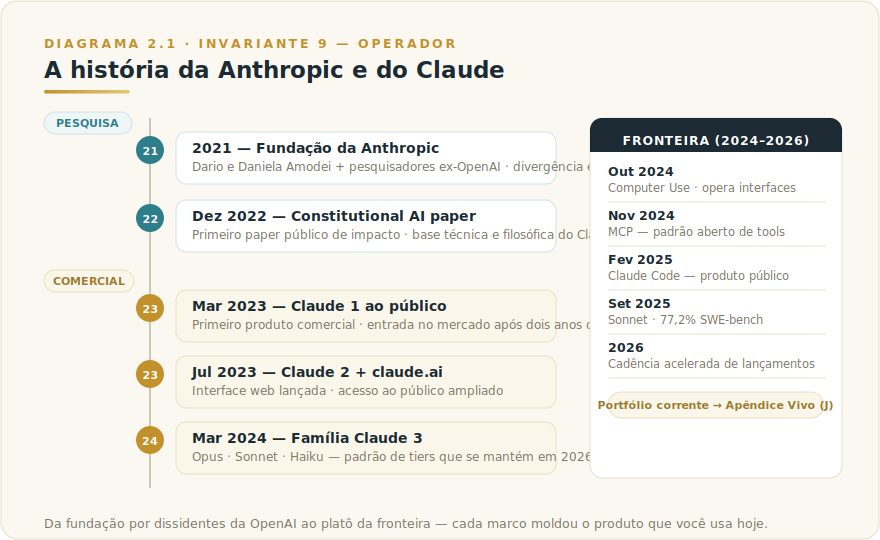
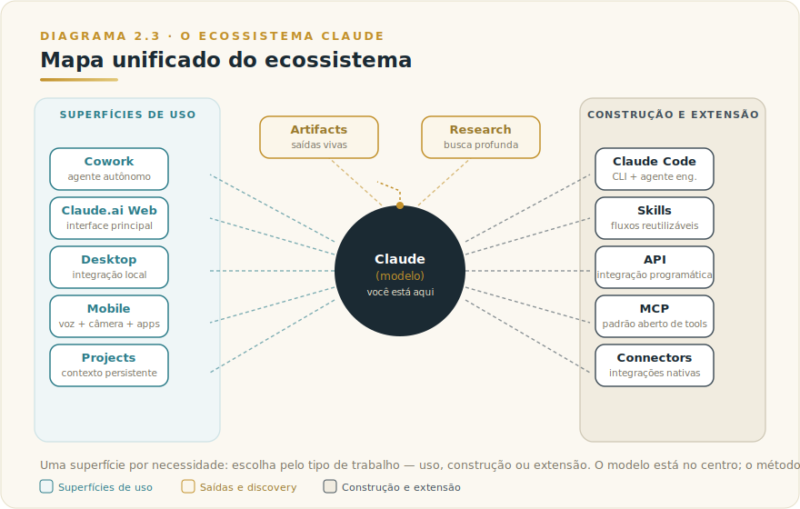
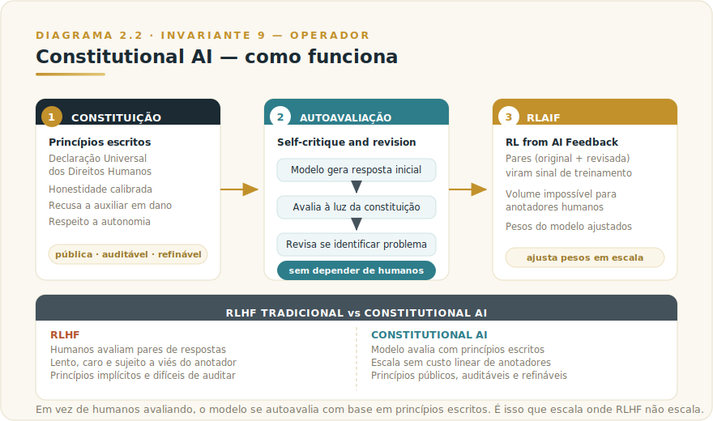

# CAPÍTULO 2
## ENTENDENDO O CLAUDE

---

> *"Toda tecnologia carrega a alma da empresa que a construiu. Para entender o Claude, você precisa entender a Anthropic e o que ela está tentando fazer no mundo."*

---

> 🧭 **Por que Claude é o laboratório vivo dos 9 Invariantes**
>
> Claude é o ecossistema mais maduro em 2026 para aplicar o conjunto inteiro de fundamentos da obra. Cada capítulo desta Parte mostra uma capacidade que instancia um ou mais Invariantes do Livro 1: Modelos (Inv. 4), Projects (Inv. 2+3), Skills (Inv. 3+9), Code (Inv. 6+9), Subagents (Inv. 6), Enterprise (Inv. 8). Este capítulo é a porta de entrada — a partir daqui, o Volume Vivo opera os Invariantes em forma executável.
> *Apêndice Vivo (J): versões correntes, preços, benchmarks. [Acesse](../04-apendices/L2-APX-J-apendice-vivo.md).*

---

## 2.1 — O CONCEITO INTUITIVO

A partir daqui mergulhamos no ecossistema Claude, laboratório vivo de todos os conceitos vistos até agora. Antes de entrar nos produtos específicos — Web, Code, Projects, Skills, Subagents — faz sentido começar pela empresa por trás de tudo. Sem essa compreensão, você usa Claude como ferramenta genérica. Com ela, usa com clareza estratégica sobre o que esperar e o que evitar.

A história fundacional, a filosofia técnica e o posicionamento público da Anthropic moldaram o Claude de formas que valem ser compreendidas. Quando você sabe que Claude foi construído sobre Constitutional AI, entende por que ele recusa pedidos que outros modelos atendem. Quando entende que a Anthropic foi fundada por pessoas que saíram da OpenAI por divergência em segurança, percebe por que o tom do produto é diferente.

Este capítulo é o pré-requisito para extrair o máximo dos próximos dezesseis capítulos sobre o ecossistema.

---

## 2.2 — ANALOGIA: A DIFERENÇA ENTRE BANCOS E COOPERATIVAS

Pense na diferença entre um banco comercial e uma cooperativa de crédito. Os produtos básicos são parecidos: conta corrente, empréstimo, cartão, investimento. Mas a estrutura de propriedade e as prioridades estratégicas diferem em pontos que importam. O banco existe para maximizar retorno aos acionistas. A cooperativa existe para servir aos cooperados. DNA diferente nas decisões cotidianas.

O setor de IA tem dinâmica análoga em 2026. OpenAI tem missão declarada de "garantir que AGI beneficie toda a humanidade", mas com estrutura comercial agressiva e ritmo de lançamentos que prioriza capacidade. Google opera Gemini dentro de uma empresa imensa, em que IA é uma entre várias frentes. Cada empresa tem DNA que se manifesta nos produtos.

A Anthropic se diferencia por ser, desde 2021, uma Public Benefit Corporation cuja missão explícita é "construir IA confiável, interpretável e direcionável". A missão declarada está acima do retorno financeiro como métrica primária. Isso muda o tom dos produtos, as decisões técnicas, a forma como problemas são tratados. Conhecer essa diferença não é trivia — é vantagem operacional quando você escolhe Claude para casos específicos.

---

## 2.3 — EXPLICAÇÃO TÉCNICA

### 2.3.1 — A história em linha do tempo

A Anthropic foi fundada em 2021 por Dario Amodei e sua irmã Daniela Amodei, junto com outros pesquisadores que saíram da OpenAI naquele ano. Dario era VP de Pesquisa da OpenAI antes da saída, e participou de marcos como GPT-2 e GPT-3. O motivo da saída, declarado publicamente em entrevistas posteriores, foi divergência sobre prioridade de segurança no desenvolvimento de modelos avançados. A percepção dos fundadores era de que o ritmo de lançamento estava avançando mais rápido que a maturidade dos métodos de garantia de segurança, e que valeria a pena criar uma empresa que invertesse essa prioridade.

A empresa passou os primeiros dois anos sem produto comercial, dedicando-se a pesquisa fundamental em alinhamento, interpretabilidade e segurança de modelos. O primeiro paper público de impacto foi sobre Constitutional AI, em dezembro de 2022, que vamos detalhar adiante. Em março de 2023, lançaram Claude 1 ao público, marcando entrada comercial. Em julho de 2023, Claude 2 saiu junto com a interface claude.ai. Em março de 2024, a família Claude 3 foi anunciada, organizada nos três tiers nomeados Opus, Sonnet e Haiku, padrão que se mantém em 2026. Em outubro de 2024 anunciaram Computer Use, capacidade de o modelo operar interface gráfica de computador. Em novembro de 2024, anunciaram MCP, padrão aberto para conectar modelos a ferramentas. Em fevereiro de 2025, Claude Code virou produto público. Setembro de 2025 trouxe Sonnet 4.5 com 77,2% no SWE-bench. A partir daí, a cadência de lançamentos acelerou — portfólio corrente de modelos e capacidades no [Apêndice Vivo (J)](../04-apendices/L2-APX-J-apendice-vivo.md).

> 📊 **Diagrama 2.1 — A História da Anthropic e do Claude**
>
> 
>
> *Da fundação por dissidentes da OpenAI ao platô da fronteira em 2026.*

A trajetória tem padrão consistente: cada produto vem acompanhado de publicação técnica explicando os princípios por trás, e decisões controversas são justificadas publicamente. Esse padrão de transparência técnica tem impacto direto na qualidade da comunidade em volta dos produtos.

### 2.3.2 — Constitutional AI, a peça filosófica central

Constitutional AI é a abordagem técnica da Anthropic para alinhar modelos com valores humanos — e é o que diferencia o Claude na prática.

Modelos grandes precisam de alinhamento pós-treinamento porque o modelo cru não tem mecanismo intrínseco de honestidade, recusa a dano, ou utilidade ao usuário. A indústria desenvolveu, a partir de 2022, o RLHF (Reinforcement Learning from Human Feedback): humanos comparam pares de respostas, indicam preferências, e esse sinal alimenta fine-tuning. O ChatGPT original usa essa técnica.

RLHF tem limitações sérias: depende de anotadores humanos em escala, é lenta e cara, carrega vieses dos anotadores específicos, e os princípios por trás das preferências ficam implícitos e difíceis de auditar.

A Anthropic propôs o CAI (Constitutional AI), que inverte parte dessa lógica. Em vez de humanos avaliando respostas, o próprio modelo as avalia à luz de uma constituição escrita — um documento explícito de princípios. Funciona em três passos.

O primeiro passo é definir a constituição: um conjunto de princípios escritos cobrindo Declaração Universal dos Direitos Humanos, honestidade, recusa a auxiliar em dano, respeito à autonomia do usuário. Essa constituição é pública, auditável e refinável.

O segundo passo é fazer o modelo gerar respostas e autoavaliá-las à luz da constituição, revisando quando identifica problemas. Esse processo é chamado "self-critique and revision".

O terceiro passo é usar os pares de resposta original e revisada como sinal de treinamento (RLAIF — Reinforcement Learning from AI Feedback). O modelo gera milhões de exemplos avaliados por ele mesmo, volume que seria proibitivo com humanos.

> 📊 **Diagrama 2.2 — Constitutional AI**
>
> 
>
> *Em vez de só humanos avaliando, o modelo se autoavalia com base em princípios escritos.*

As virtudes de CAI: escala alinhamento sem depender exclusivamente de anotadores, torna princípios explícitos e auditáveis, reduz vieses de subgrupos pequenos, e permite refinar a constituição de forma documentada.

A crítica honesta: CAI não elimina vieses — transfere parte deles para a redação da constituição e para o próprio modelo que faz a autoavaliação. Há debate técnico sobre quanto do processo produz comportamento alinhado real versus alinhamento aparente que falha em casos adversariais.

Independente da crítica, CAI é a base da personalidade observável do Claude. Quando você nota que Claude é mais explícito sobre limitações, mais cuidadoso em recusas e mais transparente sobre raciocínio que outros modelos, está vendo a diferença de CAI na prática. Não é coincidência — é design técnico declarado.

### 2.3.3 — A personalidade observável

O Claude tem voz própria, com padrões linguísticos identificáveis e postura conversacional consistente. Em testes cegos sobre escrita, Claude é consistentemente preferido por sua clareza (proporções atualizadas no [Apêndice Vivo (J)](../04-apendices/L2-APX-J-apendice-vivo.md)).

Características dessa voz: admite limitações com mais facilidade que outros modelos ("não tenho certeza", "vale verificar"); estrutura raciocínio visível antes de afirmar conclusões; recusa pedidos sensíveis com explicação clara em vez de evasão; tem tom conversacional natural mesmo em respostas profundas.

Para uso profissional, essa personalidade é vantagem em escrita executiva, análise crítica e raciocínio articulado. Em tarefas que pedem respostas curtas e diretas, às vezes adiciona contexto desnecessário — instrua explicitamente para ser mais conciso.

### 2.3.4 — A posição no mercado

A Anthropic em 2026 ocupa posição peculiar. Em receita, é menor que OpenAI e Google (estimativas no [Apêndice Vivo (J)](../04-apendices/L2-APX-J-apendice-vivo.md)). Em capacidade técnica, está no topo da fronteira, especialmente em código, escrita e raciocínio complexo. Em adoção corporativa, cresceu rapidamente como escolha preferida de empresas com requisitos altos de segurança e qualidade.

A Amazon investiu na Anthropic, e Claude virou modelo padrão em AWS via Amazon Bedrock — opção relevante para empresas brasileiras que precisam de VPC isolado em região São Paulo para soberania de dados. Google também é investidor; a Anthropic mantém independência estratégica entre os parceiros.

A estrutura de Public Benefit Corporation americana obriga a empresa a balancear retorno aos acionistas com missão pública declarada. Para clientes corporativos, isso reduz o risco de mudança súbita de posicionamento por pressão financeira.

---

## 2.4 — EXEMPLO MEMORÁVEL: A RECUSA QUE FOI VANTAGEM COMPETITIVA

Uma empresa brasileira de seguros avaliava provedores de IA para sistema de subscrição automatizada em 2024. Os três finalistas — Claude, GPT-4 e Gemini — rodaram o mesmo workflow nos mesmos casos de teste.

Um conjunto de testes incluiu casos deliberadamente problemáticos: informações que poderiam levar a discriminação protegida por lei (idade, gênero, religião, condição médica preexistente) misturadas com dados legítimos. A intenção era ver como cada modelo lidava com a tentação de usar essas variáveis.

GPT-4 e Gemini incorporaram as variáveis sensíveis na recomendação sem alertar, produzindo decisões tecnicamente úteis mas potencialmente discriminatórias. Claude, em quase todos os casos similares, parou para sinalizar o problema, sugeriu alternativas e em alguns casos recusou completar a análise sem supervisão humana.

O impacto foi paradoxal. Inicialmente os engenheiros ficaram frustrados — Claude "não fazia o que pedimos". Quando o jurídico revisou junto com compliance, a perspectiva se inverteu. As recusas de Claude evitaram exatamente os erros que teriam exposto a seguradora a processos por discriminação. **O que parecia limitação virou camada de segurança automática.**

A empresa escolheu Claude. O custo por chamada era ligeiramente maior, mas o custo evitado em risco regulatório foi calculado como ordem de grandeza superior. Em três anos de operação, nenhum incidente de discriminação reportado.

A lição estrutural: **alinhamento explícito vira camada de segurança automática em domínios sensíveis, e essa camada às vezes vale mais que velocidade ou custo unitário**. O **Invariante 8 (Responsabilidade Indelegável)** opera aqui em tensão real: a seguradora não podia delegar ao modelo a responsabilidade de não discriminar. O que Claude fez foi tornar essa tensão visível antes de entrar em produção — tornando mais fácil assumir a responsabilidade, não eliminando-a.

> 🎯 **PARA EXECUTIVOS**
> Em domínios regulados (financeiro, saúde, jurídico, seguros, RH), o critério "modelo recusa pedidos problemáticos" deveria ter peso explícito na avaliação. Não como limitação a ser contornada, mas como camada de proteção. Modelos que aceitam tudo sem questionar transferem para você o custo de implementar guards externos.

---

## 2.5 — NA PRÁTICA: TRÊS APLICAÇÕES REPLICÁVEIS

Três aplicações que qualquer profissional pode rodar esta semana. Cada uma segue a forma *situação → o que fazer → o ponto de julgamento* — o passo a passo é replicável, mas é o ponto de julgamento que ancora o Invariante 9 no uso real.

**Aplicação 1 — Avaliação de encaixe do Claude para um caso de uso regulado da organização.**
*Situação:* sua organização está considerando usar Claude em um processo que toca dados sensíveis (RH, clientes, compliance). *O que fazer:* mapeie três variáveis: (a) que tipo de variável sensível pode aparecer no input; (b) o que acontece se o modelo usar essa variável de forma inadequada na saída; (c) qual plano e contrato de dados você usaria (Team com DPA, Bedrock com VPC). Rode o mesmo caso de teste crítico em dois modelos e documente o que cada um fez. *O ponto de julgamento:* não é "qual modelo respondeu melhor" em abstrato — é "qual modelo expõe a organização a menos risco no caso de falha". A escolha final é sua, não do modelo. O Invariante 9 aqui: sua competência de avaliação determina se a ferramenta protege ou expõe.

**Aplicação 2 — Leitura da Constituição do Claude e mapeamento de implicações.**
*Situação:* você usa Claude em trabalho profissional mas nunca leu os princípios que governam seu comportamento. *O que fazer:* localize e leia a Constituição do Claude publicada pela Anthropic (link no Apêndice J); identifique três princípios que se manifestam em comportamentos que você já observou; identifique um princípio que poderia criar fricção em algum caso de uso da sua organização. *O ponto de julgamento:* para cada princípio que cria fricção, decida se a fricção é a ferramenta protegendo você de um erro que você não havia mapeado, ou se é uma limitação genuína que exige outra abordagem. A distinção não é óbvia — e a resposta muda o que você faz a seguir.

**Aplicação 3 — Argumentação estratégica para adoção em domínio específico.**
*Situação:* você precisa defender internamente a escolha do Claude para um caso de uso, e enfrenta ceticismo sobre custo ou sobre "mais um projeto de IA". *O que fazer:* construa o argumento em três camadas: capacidade técnica (o que o Claude faz bem no caso específico), alinhamento de DNA (como o posicionamento da Anthropic reduz risco regulatório ou reputacional), e critério de custo completo (custo por chamada versus custo de guards externos que você não precisará implementar). *O ponto de julgamento:* se você não consegue articular por que o alinhamento do Claude reduz custo real de compliance no seu caso específico, o argumento de "é melhor" não vai funcionar com quem gerencia risco. Esse ponto de julgamento é o que separa advocacy de ferramenta de argumento estratégico.

---

## 2.6 — A FILOSOFIA EM TRÊS PRINCÍPIOS PÚBLICOS

O primeiro é **AI safety como prioridade técnica concreta**, não marketing. Investimento em interpretabilidade, alinhamento e robustez contra ataques adversariais. A empresa publica pesquisas nessas áreas regularmente e mantém Frontier Red Team que tenta ativamente quebrar os próprios modelos.

O segundo é **scaling responsável**: ritmo que prioriza capacidade adquirida com confiança em vez de pressa. A Responsible Scaling Policy (2023) define níveis crescentes de capacidade com correspondentes camadas de testes antes de lançar.

O terceiro é **transparência operacional**: publicação regular de relatórios técnicos, capacidades, limitações e incidentes. Constitutional AI foi paper aberto; MCP foi padrão aberto; várias técnicas internas foram compartilhadas com a comunidade — contraste com a norma de tratar tudo como segredo comercial.

Esses três princípios não significam perfeição. Significam que há corpo público de doutrina técnica que torna as decisões da empresa previsíveis e debatíveis — fator de decisão real para clientes que valorizam essa característica.

---

## 2.6.1 — QUANDO USAR CLAUDE — E QUANDO NÃO USAR

**A escolha do modelo é decisão sua, não do modelo** (Inv. 8). Delegar essa escolha a "use o mais popular" é abdicar de critério que tem impacto real em qualidade, risco e custo.

O framework abaixo usa critérios duráveis — não menciona preço nem versão porque esses dados mudam; o critério de encaixe não muda.

### Use Claude quando

**Domínio regulado ou sensível.** Quando o sistema pode incorporar variáveis protegidas por lei em recomendações, a camada de CAI vira proteção automática. Modelos que aceitam tudo transferem para você o custo de implementar guards externos. Em saúde, financeiro, jurídico e RH, Claude sinaliza problemas em vez de executar silenciosamente.

**Escrita e raciocínio articulado.** Quando o entregável é lido por humanos e a qualidade da prosa importa — comunicação executiva, análise estratégica, documentação — Claude tem vantagem observável em voz e clareza. Não é diferença de versão; é diferença de design.

**Transparência de raciocínio como requisito.** Quando você precisa auditar como o modelo chegou à conclusão, Claude tende a expor o raciocínio de forma mais completa — essencial onde explicabilidade é parte do produto.

**Integração AWS ou soberania de dados.** Claude via Amazon Bedrock com VPC em São Paulo é opção concreta para empresas brasileiras com restrições regulatórias sobre onde dados processam.

### Use outro modelo quando

**Ecosistema já estabelecido.** Se sua organização está profundamente integrada em Azure/Microsoft, GPT-4 com integração nativa pode custar menos em atrito operacional do que migrar para Claude mesmo que Claude entregue resultado ligeiramente melhor. Custo de integração é custo real.

**Tarefa com benchmark público claro que favorece outro modelo.** Para domínios muito específicos (visão computacional, determinadas tarefas científicas especializadas, certas línguas além do inglês e português), vale verificar benchmarks atuais. A fronteira muda rápido; consulte o Apêndice Vivo para o estado corrente.

**Velocidade de iteração é mais crítica que alinhamento.** Para prototipagem rápida em contexto interno sem risco regulatório, a ferramenta que a equipe já sabe usar bem frequentemente supera qualquer ganho marginal de trocar de provedor.

### O critério durável

A questão não é "qual modelo é melhor". É: **qual modelo tem o DNA mais alinhado com o risco específico da minha aplicação?** A Anthropic foi fundada por pessoas que achavam que segurança deveria vir antes de velocidade. Esse DNA aparece nos produtos de formas que importam. Onde não é diferencial — tarefa interna de baixo risco, ecossistema já estabelecido, time que já conhece outra ferramenta — o custo de troca pode não se justificar. Onde importa, pode valer substancialmente.

---

## 2.7 — CONEXÕES COM OUTROS CAPÍTULOS

- 🔗 **História da IA e Anthropic no contexto** → [Capítulo 1](../../Livro-1-Os-Invariantes/02-capitulos/L1-C01-o-que-e-ia.md)
- 🔗 **RLHF e Constitutional AI no treinamento** → [Capítulo 2](../../Livro-1-Os-Invariantes/02-capitulos/L1-C02-como-modelos-funcionam.md)
- 🔗 **Comparação dos modelos frontier** → [Capítulo 15](../../Livro-1-Os-Invariantes/02-capitulos/L1-C15-comparacao-modelos.md)
- 🔗 **MCP, padrão aberto criado pela Anthropic** → [Capítulo 13](../../Livro-1-Os-Invariantes/02-capitulos/L1-C13-mcp.md)
- 🔗 **Todos os modelos Claude e como escolher** → [Capítulo 4](L2-C04-modelos-claude.md)
- 🔗 **Claude para executivos** → [Capítulo 1](L2-C01-executivos.md)
- 🔗 **Segurança e alinhamento aprofundados** → [Capítulo 37](../../Livro-1-Os-Invariantes/02-capitulos/L1-C19-seguranca.md)
- 🔗 **Futuro da IA e AGI** → [Capítulo 38](../../Livro-1-Os-Invariantes/02-capitulos/L1-C20-futuro.md)

---

## 2.8 — RESUMO EXECUTIVO

| Conceito | Síntese |
|----------|---------|
| **Fundação** | Anthropic criada em 2021 por Dario e Daniela Amodei, ex-OpenAI |
| **Missão declarada** | Construir IA confiável, interpretável e direcionável |
| **Constitutional AI** | Alinhamento via princípios escritos e autoavaliação do modelo |
| **RLAIF** | Reinforcement Learning from AI Feedback, alternativa escalável ao RLHF |
| **Personalidade observável** | Honestidade calibrada, raciocínio visível, recusa com explicação |
| **Posição no mercado** | Frontier em capacidade, líder em alinhamento, parcerias com Amazon e Google |
| **Estrutura legal** | Public Benefit Corporation, missão pública balanceada com retorno |
| **Princípios públicos** | AI safety, scaling responsável, transparência operacional |

---

## 2.9 — CHECKLIST DO CAPÍTULO

- [ ] Contar a história da fundação da Anthropic e o motivo da saída da OpenAI
- [ ] Explicar Constitutional AI em três passos
- [ ] Diferenciar RLHF de RLAIF e por que essa diferença importa
- [ ] Identificar as características observáveis da personalidade do Claude
- [ ] Reconhecer a estrutura legal de Public Benefit Corporation
- [ ] Articular os três princípios públicos da Anthropic
- [ ] Defender, em domínio regulado, por que recusas explícitas viram vantagem competitiva

---

## 2.10 — PERGUNTAS DE REVISÃO

1. Por que CAI é mais escalável que RLHF tradicional?
2. Qual a diferença prática para o usuário final entre um modelo com CAI e um sem?
3. Em que situação a "personalidade explícita" do Claude pode ser desvantagem?
4. Por que Public Benefit Corporation é estrutura legal importante para empresas de IA?
5. Como você usaria os três princípios da Anthropic em decisão de escolha de provedor?

---

## 2.11 — EXERCÍCIOS PRÁTICOS

### Exercício 1 — Teste de personalidade
Faça o mesmo prompt em Claude, ChatGPT e Gemini, sobre um tema que admite múltiplas perspectivas. Compare as respostas. Identifique três marcadores de personalidade distintos em cada uma.

### Exercício 2 — Teste de limites
Em ambiente controlado, teste como cada modelo responde a um pedido que envolve dilema ético comum (decisão de RH com viés potencial, recomendação financeira a vulnerável, etc.). Documente as recusas e suas justificativas.

### Exercício 3 — Leitura da constituição
Procure a Constituição do Claude publicada pela Anthropic. Leia os princípios. Identifique três princípios que se manifestam visivelmente em uso cotidiano que você já fez.

### Exercício 4 — Análise estratégica
Para sua organização, avalie se os três princípios públicos da Anthropic se alinham com seus próprios valores e necessidades regulatórias. Documente onde alinha e onde diverge.

---

## 2.12 — PROJETO DO CAPÍTULO

**Construa o documento "Por que Claude, para nós".**

Em uma página, escreva o argumento estratégico de por que sua organização deveria adotar Claude para algum caso de uso específico, considerando não apenas capacidade técnica mas também alinhamento com valores corporativos, requisitos regulatórios e perfil de risco. Esse documento serve dois propósitos. Primeiro, ele força você a articular conscientemente a decisão. Segundo, vira artefato útil quando outras partes da organização questionam a escolha. Bons documentos desse tipo costumam acelerar adoção e reduzir atrito interno.

---

## 2.13 — REFERÊNCIAS PRINCIPAIS

📚 **Documentação e papers fundamentais**

- Anthropic. *Core Views on AI Safety*. → anthropic.com/news/core-views-on-ai-safety
- Bai et al. *"Constitutional AI: Harmlessness from AI Feedback"*. 2022. → arxiv.org/abs/2212.08073
- Anthropic. *Responsible Scaling Policy*. → anthropic.com/news/anthropics-responsible-scaling-policy

📚 **Recursos**

- [Anthropic site oficial](https://www.anthropic.com/)
- [Claude docs](https://docs.claude.com/)
- [Interpretability research](https://transformer-circuits.pub/)

---

## 2.14 — VALIDAÇÃO UAU

| # | Critério | Você consegue? |
|---|----------|----------------|
| 1 | **Clareza** — Explicar para um diretor o que distingue Anthropic e Claude em 90 segundos | ☐ |
| 2 | **Profundidade** — Defender, em discussão técnica, o que é Constitutional AI e por que isso importa para uso corporativo | ☐ |
| 3 | **Aplicação** — Identificar, na sua organização, casos onde a filosofia da Anthropic gera valor concreto | ☐ |
| 4 | **Conexão** — Articular como entender a Anthropic se conecta com modelos (Cap 4), Skills (Cap 30), e segurança (Cap 37) | ☐ |
| 5 | **Curiosidade UAU** — Está com vontade de entender em profundidade as diferenças entre Opus, Sonnet e Haiku, e quando usar cada um | ☐ |

**5 de 5?** Avance. Você agora tem o contexto necessário para extrair o máximo dos próximos capítulos.
**3 ou 4?** Releia 2.4 (caso da seguradora) e 2.3.2 (CAI). É onde a filosofia vira diferenciação prática.
**Menos de 3?** O capítulo merece releitura completa, pois é fundamento dos próximos dezesseis.

---

🔗 **Próximo capítulo:** [Capítulo 3 — Anatomia da Conversa](L2-C03-anatomia-conversa.md)

---

> *"Toda tecnologia carrega a alma da empresa que a construiu. O modelo muda; a filosofia que o moldou permanece — e é ela que você usa quando aplica Claude com critério."*
