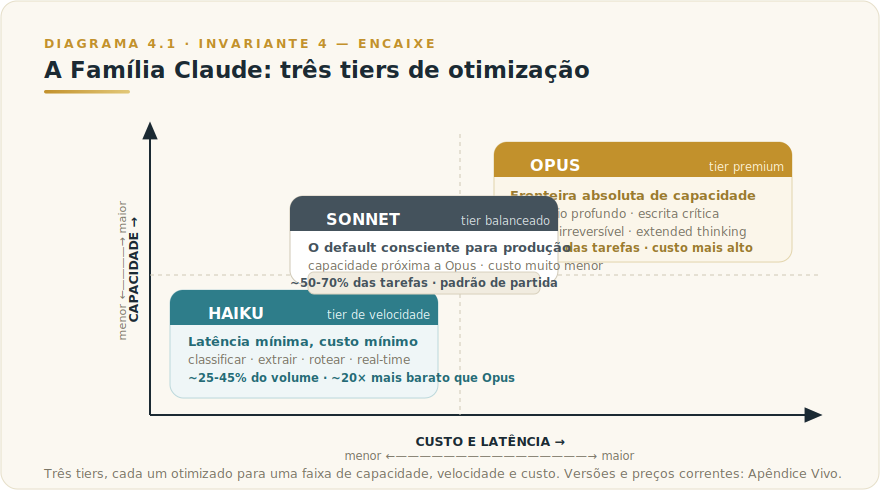
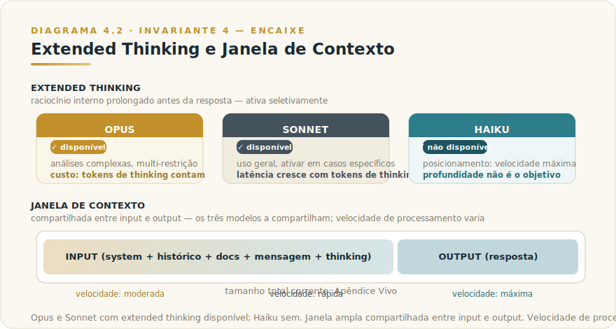

# CAPÍTULO 4
## TODOS OS MODELOS CLAUDE

---

> *"A nomenclatura Opus, Sonnet, Haiku não é marketing. É uma afirmação estrutural: três formas literárias, três perfis de otimização, um único critério de design — o encaixe certo para a tarefa certa."*

---

> 🧭 **Por que este capítulo é a aplicação do Invariante 4 — Encaixe**
>
> Opus, Sonnet e Haiku não são versões hierárquicas do mesmo produto: são **encaixes** para tarefas diferentes. Entender o que cada um é — sua capacidade, sua lógica de otimização, seus limites técnicos — é o pré-requisito para o critério de escolha. O critério de **quando** usar cada um está no Capítulo 5.
>
> Invariante secundário: **Inv. 3 — Camada Dupla** (o padrão "três tiers" dura; as versões específicas mudam — ver [Apêndice Vivo (J)](../04-apendices/L2-APX-J-apendice-vivo.md)).

---

## 4.1 — O CONCEITO INTUITIVO

A Anthropic adotou desde Claude 3, em março de 2024, uma nomenclatura tripartite com cada modelo otimizado para uma faixa diferente de capacidade, velocidade e custo. A nomenclatura em formas literárias é proposital: Opus é a forma mais longa e elaborada, Sonnet equilibra profundidade e concisão, e Haiku é a mais enxuta e rápida. Conhecer essa estrutura é pré-requisito para usar Claude profissionalmente.

A confusão recorrente é assumir que o melhor é sempre o mais caro — ou que o mais barato é sempre a escolha por economia. Ambas as posições produzem decisões erradas. Este capítulo entrega o mapa do que cada modelo é. O critério para escolher entre eles está no Capítulo 5.

---

## 4.2 — ANALOGIA: A SELEÇÃO DE ARMAS DE UM CARPINTEIRO

Um carpinteiro experiente escolhe ferramentas para cada tarefa. Para cortar tábua grossa de madeira de lei, pega a serra circular potente. Para cortes simples em volume, pega a tico-tico elétrica. Para acertos finos, um formão — baixíssimo custo operacional, precisão suficiente sem desperdiçar potência.

O carpinteiro maduro não usa a serra circular para cortar fita estreita de balsa — desperdício de potência, energia e risco. Não usa o formão em viga grossa de carvalho — levaria horas. Cada ferramenta tem seu lugar; parte da competência está em rotear o trabalho certo para a ferramenta certa.

Opus é a serra circular potente. Sonnet é a tico-tico, ferramenta de uso geral para o grosso do trabalho. Haiku é o formão — rápido, barato, ideal para cortes simples em volume. **Este capítulo descreve as ferramentas. O Capítulo 5 ensina a decidir qual pegar.**

---

## 4.3 — EXPLICAÇÃO TÉCNICA

### 4.3.1 — A família em detalhe

Cada modelo é descrito abaixo com suas especificidades técnicas e econômicas. Versões exatas, preços por milhão de tokens e benchmarks atualizados ficam no [Apêndice Vivo (J)](../04-apendices/L2-APX-J-apendice-vivo.md) — aqui está o padrão estrutural, que dura.

**O tier premium (Opus)** ocupa a fronteira absoluta de capacidade da família. Lidera benchmarks de codificação complexa e raciocínio multi-etapa — números correntes no Apêndice Vivo. A qualidade da escrita é notavelmente superior em comparações cegas com humanos. Velocidade é moderada: suficiente para uso interativo, mas não para real-time de alta concorrência. Custo é o mais alto da família — o delta em relação aos outros tiers é substancial, na faixa de 5× a 20× dependendo do modelo comparado; valor corrente no Apêndice Vivo.

**O tier balanceado (Sonnet)** é a melhor combinação de capacidade, velocidade e custo para a maioria das operações em produção. Fica muito próximo de Opus em capacidade geral, mas com latência menor e custo dramaticamente inferior. Em 2026, Sonnet é o modelo recomendado como ponto de partida para qualquer nova aplicação.

**O tier de velocidade (Haiku)** é o modelo de latência mínima e custo mínimo, posicionado para tarefas simples em alto volume. A capacidade é competente para classificação, extração de dados estruturados, roteamento, tradução e sumarização curta. Velocidade é a maior da família. Custo é radicalmente menor que Opus — cerca de vinte vezes menos, na proporção histórica; valor corrente no Apêndice Vivo.

### 4.3.2 — O modo extended thinking

Disponível em Opus e Sonnet, o extended thinking ativa raciocínio prolongado antes da resposta final, gerando tokens de "pensamento" ocultos usados para refinar a conclusão.

Útil em análises com restrições encadeadas, problemas matemáticos não triviais, decisões com trade-offs múltiplos, debug complexo. A contrapartida é custo maior em tokens — potencialmente centenas de milhares de tokens de raciocínio — e latência maior, de segundos a minutos.

A recomendação prática: ativar em Opus para tarefas verdadeiramente complexas; usar Sonnet normal para o grosso da operação. Haiku não tem extended thinking — seu posicionamento é velocidade, não profundidade. **O critério de quando ativar está no Capítulo 5.**

### 4.3.3 — Janela de contexto

Os três modelos da família operam com janela de contexto de 200 mil tokens em modo padrão, com variantes específicas em algumas configurações chegando a 500 mil ou mais para casos de uso especializados — limite exato corrente no Apêndice Vivo. Esse limite é compartilhado entre input e output combinados: prompts longos comem espaço que poderia ser usado para resposta longa.

A escolha entre os três modelos não muda a janela de contexto disponível, mas a velocidade de processar contextos longos varia significativamente. Opus processando 100 mil tokens de input leva visivelmente mais tempo que Sonnet processando o mesmo contexto, e Haiku processa contextos longos mais rápido ainda. Para aplicações que dependem de contexto longo em alto volume, essa diferença de latência importa na arquitetura.

---

## 4.4 — EXEMPLO: RECONHECER A FAMÍLIA EM CAMPO

Um gerente de produto de uma healthtech em São Paulo, em 2026, precisava avaliar Claude para três funções: classificar sintomas de triagem (centenas de milhares por mês), gerar rascunhos de relatórios médicos para revisão (algumas centenas por semana), e analisar literatura científica para protocolos emergentes (pedidos esporádicos de alta complexidade).

Antes de decidir o roteamento, ele precisava entender o que cada modelo *era* — e esse entendimento produziu três percepções que mudaram o design do produto.

Primeiro: Haiku era competente o suficiente para classificação de sintomas porque o esquema era fixo, os erros eram corrigíveis e o volume inviabilizava modelos maiores no custo. A capacidade não precisava ser premium — precisava ser consistente e rápida.

Segundo: Sonnet era adequado para rascunhos médicos porque a qualidade de escrita é alta, o raciocínio clínico de nível intermediário é confiável, e os rascunhos passavam por revisão humana de qualquer forma. Opus seria desperdício; Haiku ficaria abaixo do padrão exigido pelos médicos revisores.

Terceiro: Opus com extended thinking era o único caminho viável para análise de literatura científica complexa, porque os documentos tinham múltiplas restrições encadeadas (populações específicas, endpoints primários, nível de evidência) e o erro de avaliação poderia distorcer uma decisão clínica.

O gerente não tomou essas decisões pelo preço — tomou porque entendeu o que cada modelo *é*. O preço confirmou que as decisões faziam sentido economicamente. **Entender a família antes de decidir o roteamento não é sequência arbitrária: é o que torna o critério defensável.**

---

## 4.5 — NA PRÁTICA: TRÊS APLICAÇÕES REPLICÁVEIS

Três aplicações que você pode rodar esta semana. Cada uma segue a forma *situação → o que fazer → o ponto de julgamento* — é o ponto de julgamento que amarra o Invariante 4 (Encaixe) ao resultado real.

**Aplicação 1 — Mapeamento da família para três tarefas reais da organização.**
*Situação:* você usa Claude (ou está avaliando usá-lo) para pelo menos três tipos de tarefa diferentes, mas aplica o mesmo modelo para todas. *O que fazer:* liste as três tarefas; para cada uma, descreva em uma frase o perfil — complexidade do raciocínio exigido, tolerância a erro, volume e latência necessária; mapeie cada tarefa para o tier correspondente (Opus, Sonnet, Haiku) usando os critérios deste capítulo; não decida ainda qual implementar — apenas nomeie o encaixe. *O ponto de julgamento:* se as três tarefas mapearam para o mesmo tier, você provavelmente está subespecificando as diferenças entre elas. Reescreva o perfil de cada tarefa e procure onde o raciocínio exigido e a tolerância a erro divergem. Encaixe correto pressupõe distinção real — e forçar distinção revela o que você ainda não tinha articulado sobre as tarefas.

**Aplicação 2 — Teste cego de Sonnet versus Opus numa tarefa que você assume ser premium.**
*Situação:* você usa Opus para uma tarefa específica porque "é a mais importante" — análise estratégica, rascunho de documento crítico, avaliação de risco. *O que fazer:* rode a mesma tarefa duas vezes em paralelo, uma vez em Opus e uma vez em Sonnet, com o mesmo prompt; avalie os dois outputs sem saber qual é qual (peça a um colega para randomizar os rótulos); registre qual você prefere e por quê. *O ponto de julgamento:* se você não conseguiu distinguir os dois, a tarefa não justifica o custo de Opus — e o orçamento liberado pode ir para os casos onde Opus de fato vence. Se Opus venceu claramente, você agora tem evidência, não suposição. A diferença de comportamento entre suposição e evidência é o Invariante 4 operando: encaixe confirmado, não presumido.

**Aplicação 3 — Avaliação de encaixe para o extended thinking numa tarefa complexa.**
*Situação:* você tem uma tarefa que envolve múltiplas restrições encadeadas — análise de contrato longo, decisão com trade-offs interdependentes, debug de problema técnico em cascata. *O que fazer:* rode a tarefa em Opus sem extended thinking; rode novamente com extended thinking ativado; compare qualidade de raciocínio, não apenas de resposta — observe se o modelo detectou contradições ou condicionantes que ficaram ocultos na primeira versão. *O ponto de julgamento:* se o extended thinking não mudou a resposta ou a qualidade do raciocínio, a tarefa não tem o nível de encadeamento que justifica o custo adicional. Se mudou, você agora sabe o limiar de complexidade para o qual extended thinking justifica seu uso na sua operação — e esse limiar é mais valioso do que qualquer benchmark genérico.

> 🔧 **EXERCÍCIO**
> Escolha uma das três tarefas que você mapeou na Aplicação 1. Rode ela nos dois tiers que você considerou como candidatos (ex.: Sonnet e Opus, ou Haiku e Sonnet). Antes de ver os resultados, escreva em uma frase o critério pelo qual você vai julgar qual venceu. Depois que os resultados chegarem, aplique esse critério — não troque o critério na hora de julgar. Registre: o tier que você esperava que venceria venceu? Se não, o que o resultado revela sobre o seu modelo mental de encaixe para essa tarefa?

---

## 4.6 — O CRITÉRIO DE QUANDO USAR CADA MODELO

O critério operacional de roteamento — a árvore de três perguntas, os padrões de uso profissional, o exemplo memorável — está no **Capítulo 5** ([L2-C05-quando-usar-modelos.md](L2-C05-quando-usar-modelos.md)).

A separação é proposital: conhecer o que cada modelo é (este capítulo) precede usar bem o critério de decisão (Cap. 5). Misturar as duas camadas torna o critério difícil de memorizar e de explicar.

---

## 4.7 — CONEXÕES COM OUTROS CAPÍTULOS

- 🔗 **Critério de quando usar cada modelo (roteamento, framework de decisão)** → [Capítulo 5 — Quando Usar Opus, Sonnet, Haiku](L2-C05-quando-usar-modelos.md)
- 🔗 **Framework de encaixe tarefa × modelo (5 eixos, qualquer provedor)** → [Framework 2 — Diagnóstico de Encaixe](../../Livro-1-Os-Invariantes/03-frameworks/L1-F2-encaixe-5.md)
- 🔗 **Como modelos diferem em capacidade interna** → Capítulo 2 — Entendendo Claude ([L2-C02-entendendo-claude.md](L2-C02-entendendo-claude.md))
- 🔗 **Tokens e custo por modelo** → Capítulo 6 — Tokens e Contexto ([L2-C06-tokens-contexto.md](L2-C06-tokens-contexto.md))
- 🔗 **Claude Code, que usa Sonnet e Opus intensivamente** → [Capítulo 9 — Claude Code](L2-C09-claude-code.md)
- 🔗 **Versões, preços e benchmarks correntes** → [Apêndice Vivo (J)](../04-apendices/L2-APX-J-apendice-vivo.md)

---

## 4.8 — RESUMO EXECUTIVO

| Conceito | Síntese |
|----------|---------|
| **Opus (tier premium)** | Fronteira absoluta de capacidade, melhor para raciocínio profundo e escrita crítica — preço corrente no [Apêndice Vivo (J)](../04-apendices/L2-APX-J-apendice-vivo.md) |
| **Sonnet (tier balanceado)** | Padrão para a maioria das aplicações em produção — versão e preço correntes no Apêndice Vivo |
| **Haiku (tier de velocidade)** | Custo mínimo, latência mínima, ideal para alto volume — versão e preço correntes no Apêndice Vivo |
| **Extended thinking** | Raciocínio estendido disponível em Opus e Sonnet; ausente em Haiku. Ativar seletivamente |
| **Janela de contexto** | 200k tokens em modo padrão, compartilhada entre input e output; limite exato no Apêndice Vivo |
| **O próximo passo** | O critério de quando usar cada tier está no Capítulo 5 |

---

## 4.9 — VALIDAÇÃO UAU

| # | Critério | Você consegue? |
|---|----------|----------------|
| 1 | **Clareza** — Explicar a diferença entre Opus, Sonnet e Haiku em 60 segundos, com a analogia do carpinteiro | ☐ |
| 2 | **Profundidade** — Descrever o que é extended thinking, quando está disponível, e por que Haiku não o tem | ☐ |
| 3 | **Estrutura** — Explicar por que a janela de contexto compartilhada entre input e output afeta o design de um prompt longo | ☐ |
| 4 | **Conexão** — Articular por que entender o que cada modelo é precede a decisão de qual usar | ☐ |
| 5 | **Curiosidade** — Você está com vontade de abrir o Capítulo 5 para transformar esse mapa em critério operacional | ☐ |

**5 de 5?** Você tem o mapa da família. Avance para o Capítulo 5 e transforme esse conhecimento em decisão.
**3 ou 4?** Releia a seção 4.3 (Explicação Técnica) e o exemplo da seção 4.4.
**Menos de 3?** O capítulo merece releitura antes de avançar — o Capítulo 5 pressupõe esse mapa.

---

🔗 **Próximo capítulo:** [Capítulo 5 — Quando Usar Opus, Sonnet, Haiku](L2-C05-quando-usar-modelos.md)

---

> *"Opus, Sonnet e Haiku não são versões do mesmo produto em qualidades diferentes. São encaixes para problemas diferentes — e a competência está em saber qual problema é qual."*
