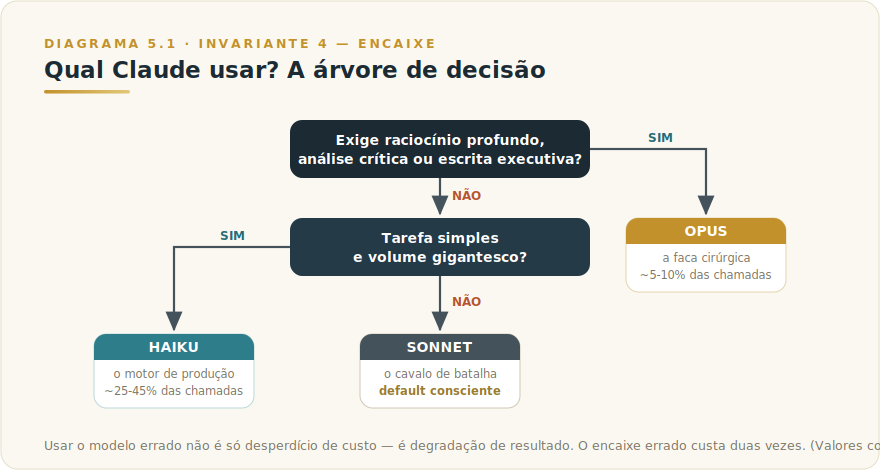
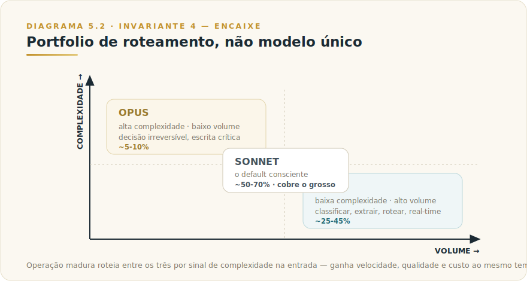

# CAPÍTULO 5
## QUANDO USAR OPUS, SONNET, HAIKU

---

> *"Roteamento não é otimização técnica. É julgamento profissional embalado em critério repetível."*

---

> 🧭 **Por que este capítulo é a aplicação do Invariante 4 — Encaixe**
>
> Conhecer a família Claude (Cap. 4) é condição necessária, não suficiente. A pergunta que produz valor operacional não é "o que cada modelo é" — é "qual uso agora, nesta tarefa, com este volume e esta tolerância a erro?" Usar o modelo errado não é apenas desperdício de custo: é degradação de resultado. Opus em tarefa simples não entrega mais qualidade; entrega mais latência e mais custo. Haiku em tarefa complexa não economiza; entrega resposta rasa que precisará ser refeita. O encaixe errado custa duas vezes.
>
> Este capítulo é a operacionalização do **F2 Encaixe** → [Framework 2 — Diagnóstico de Encaixe](../../Livro-1-Os-Invariantes/03-frameworks/L1-F2-encaixe-5.md), aplicado especificamente à família Opus/Sonnet/Haiku dentro de um ecossistema onde você já escolheu Claude como provedor.

---

## 5.1 — O CONCEITO INTUITIVO

Saber que Opus existe é diferente de saber quando Opus vence. A distinção parece óbvia até você observar equipes em produção: a maioria usa um único modelo para tudo, ou adota política por convicção ("sempre Sonnet porque é o mais equilibrado") em vez de critério testado. Ambas as abordagens desperdiçam, embora em direções diferentes.

A confusão tem raiz em como aprendemos sobre modelos: as comparações costumam ser benchmarks agregados, que medem desempenho médio em tarefas padronizadas. O problema é que sua operação não é padronizada — ela tem um perfil específico de complexidade, volume, tolerância a latência e custo. O encaixe correto emerge da sobreposição entre o perfil da tarefa e o perfil do modelo. Benchmark agregado não captura isso.

O que este capítulo entrega é o critério operacional: uma sequência de perguntas que qualquer profissional consegue responder sem precisar de especialização técnica, cujo resultado é a escolha de modelo que a equipe pode defender e medir.

---

## 5.2 — ANALOGIA: O DESPACHANTE E OS TRÊS PORTAIS

Imagine um escritório que recebe petições todos os dias — centenas delas, de natureza completamente diferente. Há o despachante experiente sentado na entrada que lê o cabeçalho de cada petição em segundos e decide por qual portal ela passa.

Petições com "urgência simples — renovação de cadastro, confirmação de endereço, consulta de status": portal rápido. Resposta em dois minutos, custo baixo, sem revisar cada linha. Qualquer erro é corrigível no mesmo dia.

Petições com "análise de contrato, revisão de prazo legal, resposta a cliente corporativo": portal padrão. Revisor com conhecimento de procedimento, tempo razoável, qualidade consistente.

Petições com "recurso de decisão judicial, análise de risco de contrato de alto valor, comunicação de crise": portal especializado. Advogado sênior, tempo estendido, zero tolerância a erro de raciocínio.

O despachante não escolhe o portal pelo tamanho físico da petição, nem pelo nome do cliente, nem por hábito. Ele escolhe pela natureza da consequência: o que acontece se errarmos aqui? Quanto tempo temos? Qual é o custo de retrabalho?

Esse é o roteamento entre Opus, Sonnet e Haiku. A família Claude é os três portais; o framework de decisão é o critério do despachante; o profissional que internalizou o critério é o despachante que toma essa decisão certa centenas de vezes por dia, sem hesitar.

> 📌 **Nota de distinção:** a analogia do carpinteiro no Cap. 4 descreve *o que cada ferramenta é*. Esta do despachante descreve *o processo de decisão*. São complementares — a competência é ter as duas camadas.

---

## 5.3 — O FRAMEWORK DE DECISÃO: A ÁRVORE DE TRÊS PERGUNTAS

O framework que segue cobre a grande maioria dos casos reais. É propositalmente simples — não por limitação, mas porque complexidade no critério de decisão é o que faz equipes abandonarem o critério e voltarem ao hábito.

### Pergunta 1: A tarefa exige raciocínio profundo, análise crítica ou escrita de alto risco?

Inclui: código com arquitetura nova ou lógica de negócio crítica; análise estratégica; redação de documentos que alimentam decisões irreversíveis (board deck, proposta contratual de alto valor, diagnóstico complexo); qualquer tarefa em que você pagaria por um consultor sênior e esperaria diferença na qualidade.

**Se sim → Opus.** O custo adicional se paga pela qualidade do resultado. O custo de um erro de raciocínio em uma decisão irreversível é ordens de magnitude maior que a diferença de preço entre Opus e Sonnet.

**Se não → ir para Pergunta 2.**

### Pergunta 2: A tarefa é estruturalmente simples e o volume é alto?

Inclui: classificação binária ou em categorias pequenas; extração de dados estruturados com esquema fixo; roteamento entre opções predefinidas; tradução de textos curtos e padronizados; confirmação de status; sumarização de uma frase. Alto volume significa que o diferencial de custo entre Haiku e Sonnet é substancial na soma.

**Se sim → Haiku.** A qualidade é adequada para essas tarefas, o custo permite escalar sem problema, e a latência mínima favorece real-time e alta concorrência.

**Se não → Sonnet é o default consciente.**

### O default: Sonnet

Cobre o grosso das aplicações profissionais em produção. Qualidade próxima de Opus a fração do custo, velocidade adequada para uso interativo. Quando uma equipe não sabe onde começar: começa em Sonnet, mede, e sobe ou desce conforme evidência.

---

## 5.4 — QUANDO USAR CADA TIER — E QUANDO EVITAR

O framework de três perguntas diz qual caminho tomar. Esta seção diz onde cada caminho se encerra.

### Opus: para o que importa de verdade

**Use Opus quando:**
- A saída alimenta decisão irreversível ou comunicação de alto risco (relatório para board, proposta contratual, diagnóstico de risco, resposta jurídica).
- O código envolve arquitetura nova ou lógica de negócio que, se errada, será cara de corrigir em produção.
- A análise exige raciocínio encadeado em múltiplas etapas e o erro de um passo contamina os seguintes.
- Você usaria um consultor sênior e pagaria mais pela diferença qualitativa.

**Evite Opus quando:**
- A tarefa é repetitiva e o resultado pode ser validado por amostra estatística — erros individuais são corrigíveis.
- O volume é alto e a diferença de custo Opus/Sonnet é substancial na soma mensal.
- A latência extra degrada a experiência do usuário final.
- Você ainda não testou se Sonnet entrega resultado equivalente — na maioria dos casos, entrega. Teste cego antes de comprometer orçamento.

### Sonnet: o default para operações profissionais

**Use Sonnet quando:**
- A tarefa é profissional mas não existe risco de decisão irreversível: análise de dados, rascunho de documentos, resposta a clientes de volume médio, sumarização de reuniões, revisão de textos.
- Você quer qualidade consistente sem pagar pelo premium de Opus.
- É o ponto de partida de qualquer nova aplicação: começa em Sonnet, mede, ajusta.

**Evite Sonnet quando:**
- O volume é tão alto que o diferencial de custo para Haiku é substancial e a tarefa claramente não exige a capacidade extra (classificação binária, extração de campos simples).
- Testes mostram que Sonnet erra em casos críticos que Opus trata corretamente — a diferença de qualidade supera a diferença de custo.

### Haiku: para velocidade e volume

**Use Haiku quando:**
- A tarefa é estruturalmente simples: classificar, rotear, extrair campos predefinidos, sumarizar em uma frase, confirmar status, traduzir textos padronizados.
- O volume é alto e erros individuais têm baixo custo de correção.
- Latência mínima é requisito funcional (real-time, streaming, filas de alta concorrência).
- Haiku funciona como pré-processador ou triagem antes de modelos maiores.

**Evite Haiku quando:**
- A tarefa exige raciocínio de múltiplas etapas ou julgamento sobre ambiguidade semântica.
- O erro de Haiku exige reprocessamento em modelo maior — o custo total acaba sendo maior que usar Sonnet diretamente.
- A percepção do usuário final sobre qualidade é crítica para o produto e a diferença de qualidade é perceptível.

---

## 5.5 — PADRÕES DE USO PROFISSIONAL

Operações maduras raramente usam um único modelo. O padrão recorrente é roteamento coordenado entre os três, com proporções que variam por caso mas obedecem a uma lógica comum.

**Padrão 1 — Haiku como classificador de entrada.** Em pipelines com volume alto, um classificador baseado em Haiku na frente analisa cada chamada e decide qual modelo a processa. Custo de classificação é próximo de zero; a economia nos modelos maiores é imediata. É frequentemente o passo com maior ROI de toda a otimização.

**Padrão 2 — Sonnet como motor principal.** Em 60 a 80% das chamadas de uma operação típica, Sonnet entrega o equilíbrio ideal. Quando alguém propõe usar Opus como default, peça teste cego em casos representativos antes de comprometer o orçamento.

**Padrão 3 — Opus seletivo para o que importa.** Reservar Opus para 5 a 10% de tarefas verdadeiramente críticas é o padrão da operação madura. Usar Opus para tudo é desperdício; evitá-lo completamente é deixar valor na mesa nos casos que o justificam.

**Padrão 4 — Extended thinking seletivo.** Ativar modo de raciocínio estendido (disponível em Opus e Sonnet) apenas em tarefas que se beneficiam claramente, medindo ganho de qualidade contra custo adicional. Em testes A/B, extended thinking ganha em problemas genuinamente complexos e não justifica o custo em problemas simples. Essa medição vale ser feita para cada caso de uso antes de ativar por padrão.

**Padrão 5 — Proporção típica em produção.** Organizações que implementam roteamento estruturado convergem para algo próximo de: 5–10% Opus (casos críticos), 50–70% Sonnet (cavalo de batalha), 25–45% Haiku (triagem e volume). Essa proporção não é prescritiva — é o ponto de partida para medir e ajustar.

---

## 5.6 — EXEMPLO MEMORÁVEL: O ASSISTENTE QUE TROCOU DE PELE TRÊS VEZES POR HORA

Uma empresa brasileira de logística operava em 2025 um assistente conversacional para motoristas em campo, atendendo cerca de 800 motoristas com volume de aproximadamente 12 mil chamadas por hora em horário de pico. O sistema cobria desde dúvidas operacionais simples até troubleshooting de problemas mecânicos complexos. Quando começaram, usavam Claude Sonnet para tudo, gastando cerca de US$ 18 mil por mês, com qualidade aceitável mas com casos extremos sendo subatendidos.

Em janeiro de 2026, aplicaram roteamento estruturado entre os três modelos. A arquitetura ficou assim.

Um classificador inicial rodando em Haiku analisava cada mensagem do motorista em menos de 100 milissegundos e a classificava em uma de três categorias. Mensagens simples — "qual o próximo endereço?", "como confirmo entrega no app?", "qual telefone do supervisor?" — eram respondidas pelo próprio Haiku no mesmo turno, sem encaminhamento. Cerca de 65% do volume caía nessa categoria, com custo unitário próximo de zero.

Mensagens moderadas — "o cliente recusou a entrega, o que faço?", "estou em rota com atraso, posso pular endereço?", "tenho dúvida sobre nota fiscal do cliente X" — eram encaminhadas para Sonnet, que resolvia 95% delas sem escalonamento humano. Cerca de 30% do volume caía nessa faixa.

Mensagens complexas — "tem barulho diferente no motor desde a parada anterior, é seguro continuar?", "estou em situação que não tem procedimento padrão, preciso de orientação" — eram encaminhadas para Opus em modo extended thinking, que avaliava contexto rico, propunha diagnósticos, e em casos de risco escalonava para humano de plantão. Cerca de 5% do volume caía aqui.

O resultado consolidado três meses após estabilização foi notável em três dimensões. O custo total mensal caiu de US$ 18 mil para cerca de US$ 8 mil, redução de 56%. A qualidade percebida pelos motoristas subiu em todas as três categorias: Haiku entregava velocidade brutal em respostas simples, Sonnet resolvia procedimentos com profundidade adequada, e Opus tratava casos complexos com qualidade que antes ficava na média de Sonnet. A taxa de escalonamento para suporte humano caiu de 12% para 3%, liberando dois atendentes para outras funções.

A lição estrutural não é sobre redução de custo. É sobre **redesenhar a aplicação para usar a família Claude como portfolio coordenado em vez de modelo único**. Quando você roteia cada tipo de pedido para o modelo apropriado, ganha simultaneamente velocidade, qualidade e economia — três objetivos que costumam estar em trade-off em outras decisões. A maioria das organizações deixa esse alinhamento na mesa por não aplicar roteamento.

> 🎯 **PARA EXECUTIVOS**
> Se sua organização usa um único modelo Claude para tudo, é altamente provável que esteja desperdiçando entre 30% e 60% do orçamento, com perda simultânea de qualidade em casos extremos. Implementar roteamento entre Opus, Sonnet e Haiku é um dos investimentos com maior ROI imediato em qualquer operação de IA usando Claude.

---

## 5.7 — NA PRÁTICA: TRÊS APLICAÇÕES REPLICÁVEIS

O exemplo anterior mostra como uma empresa de logística transformou modelo único em portfolio coordenado e colheu economia e qualidade simultaneamente; esta seção entrega o roteiro. Três aplicações que você pode rodar esta semana. Cada uma segue a forma — *situação → o que fazer → o ponto de julgamento* — porque o passo a passo é replicável, mas é o ponto de julgamento que separa roteamento como decisão fundamentada de roteamento como suposição.

**Aplicação 1 — Aplicar a árvore de três perguntas a um workflow existente.**
*Situação:* sua organização usa Claude (ou está implementando) para um caso de uso definido, com modelo fixo escolhido por conveniência ou por padrão. *O que fazer:* aplique as três perguntas do framework a esse caso de uso: (1) exige raciocínio profundo ou saída de alto risco? (2) é estruturalmente simples e de alto volume? (3) é caso intermediário? Registre a resposta a cada pergunta com evidência concreta — não "achamos que é complexo", mas "o tipo de erro gerado por Sonnet nesse caso custou X". *O ponto de julgamento:* se você não tem evidência para responder às três perguntas, você não tem critério de roteamento — tem hábito. O ponto de julgamento é exatamente distinguir os dois: o modelo correto não é o que você usou até hoje, é o que os dados da sua operação indicam.

**Aplicação 2 — Implementar Haiku como classificador de entrada em um pipeline de volume.**
*Situação:* você tem um pipeline onde todas as mensagens ou documentos passam pelo mesmo modelo, mas o conjunto tem claramente mensagens simples e mensagens complexas misturadas. *O que fazer:* defina duas categorias de input — "simples" (pode ser processado diretamente por Haiku) e "encaminhado" (vai para Sonnet ou Opus); construa um prompt mínimo de classificação para Haiku decidir em qual categoria cada input cai; rode uma amostra de 50 inputs reais pelo classificador e audite manualmente os casos categorizados como "simples"; calcule o delta de custo para o volume mensal. *O ponto de julgamento:* verifique a taxa de falsos negativos do classificador — mensagens complexas categorizadas como simples e respondidas por Haiku. Se essa taxa superar 5%, o classificador precisa de refinamento antes de ir para produção. Um classificador que erra com frequência converte economia em custo de retrabalho.

**Aplicação 3 — Teste A/B de extended thinking em tarefa de raciocínio encadeado.**
*Situação:* você tem uma tarefa que envolve raciocínio em etapas — diagnóstico de problema com múltiplas variáveis, análise de risco com dependências, decisão com restrições encadeadas. *O que fazer:* defina o critério de qualidade antes do teste (qual sinal vai indicar que o raciocínio foi melhor — identificou uma contradição, detectou um risco que não estava na superfície, produziu recomendação com menos ambiguidade); rode a tarefa em Sonnet normal e em Sonnet com extended thinking; avalie pelos critérios pré-definidos, não pela extensão da resposta. *O ponto de julgamento:* se extended thinking não mudou o resultado pelos critérios que você definiu, a tarefa não tem o nível de encadeamento que justifica o custo adicional. Esse julgamento — tarefa realmente complexa versus tarefa que parece complexa — é o Invariante 4 aplicado ao nível mais fino de roteamento.

> 🔧 **EXERCÍCIO**
> Pegue um mês de uso real de Claude na sua organização (ou na sua rotina pessoal se for uso individual) e estime a proporção de chamadas por tipo de tarefa: quantas eram classificação ou extração simples (candidatas a Haiku), quantas eram trabalho profissional padrão (candidatas a Sonnet), quantas eram análise de alto risco ou código crítico (candidatas a Opus). Compare essa proporção com o que você de fato usou. Calcule o delta de custo entre o que você usou e o que o roteamento ideal teria custado. Registre: qual é a maior oportunidade de ajuste, e qual é a barreira concreta para implementá-la esta semana?

---

## 5.8 — CAMADA VIVA

> 📋 **Apêndice J — o que fica aqui vs. no corpo**
>
> Versões específicas de cada modelo (ex.: Claude Opus 4.5, Sonnet 4.5, Haiku 3.5), preços correntes por milhão de tokens, janelas de contexto exatas e disponibilidade de extended thinking por tier são números voláteis — mudam a cada release. Esses dados ficam exclusivamente no [Apêndice Vivo (J)](../04-apendices/L2-APX-J-apendice-vivo.md), atualizado continuamente. O que está neste capítulo é o padrão estrutural: a lógica de roteamento, os critérios de encaixe, os anti-padrões. Esses duram.

---

## 5.9 — LIMITAÇÕES E CUIDADOS

**O framework não substitui teste cego.** As três perguntas são ponto de partida, não oráculo. A fronteira entre "tarefa complexa" e "tarefa simples" não é universal — depende do perfil específico da sua operação. Teste comparativo em casos representativos antes de comprometer modelo em produção.

**Extended thinking não é sempre melhor.** Em tarefas simples, extended thinking consome tokens de raciocínio sem ganho de qualidade. O modo vale o custo quando o problema tem múltiplas restrições encadeadas; não vale quando a resposta correta é óbvia e o modelo precisaria apenas de um turno limpo.

**Haiku erra com confiança.** Como todo LLM, Haiku produz respostas incorretas com fluência normal. Para tarefas onde o erro tem custo de reprocessamento alto, vale medir a taxa real de retrabalho antes de confirmar Haiku como caminho.

**Roteamento mal calibrado cria falsos negativos.** Se o classificador de entrada (normalmente Haiku) categorizar mal uma mensagem complexa como simples, o usuário recebe uma resposta de qualidade inferior. O classificador precisa ser testado sistematicamente, não presumido correto.

**A proporção típica não é a proporção certa.** Os percentuais do padrão maduro (5–10% Opus, 50–70% Sonnet, 25–45% Haiku) são referência, não meta. Medir a proporção real da sua operação e ajustar com base em dados é o que transforma referência em critério.

---

## 5.10 — CONEXÕES COM OUTROS CAPÍTULOS

- 🔗 **O que cada modelo da família é (capacidade, extended thinking, janela de contexto)** → [Capítulo 4 — Todos os Modelos Claude](L2-C04-modelos-claude.md)
- 🔗 **Framework completo de encaixe tarefa × modelo (5 eixos, válido para qualquer provedor)** → [Framework 2 — Diagnóstico de Encaixe](../../Livro-1-Os-Invariantes/03-frameworks/L1-F2-encaixe-5.md)
- 🔗 **Tokens e custo por modelo** → Capítulo 6 — Tokens e Contexto ([L2-C06-tokens-contexto.md](L2-C06-tokens-contexto.md))
- 🔗 **Claude Code, que usa Sonnet e Opus intensivamente** → [Capítulo 9 — Claude Code](L2-C09-claude-code.md)
- 🔗 **Versões, preços e disponibilidade correntes** → [Apêndice Vivo (J)](../04-apendices/L2-APX-J-apendice-vivo.md)

---

## 5.11 — RESUMO EXECUTIVO

| Conceito | Síntese |
|----------|---------|
| **A pergunta central** | Qual encaixe — não qual é "o melhor" em abstrato |
| **Opus** | Para raciocínio profundo, decisões irreversíveis, código crítico. 5–10% das chamadas em operação madura |
| **Sonnet** | Default para 60–80% das aplicações profissionais. Ponto de partida de qualquer nova implementação |
| **Haiku** | Tarefas simples em alto volume, latência mínima, classificador de entrada. 25–45% em operação madura |
| **Extended thinking** | Ativar seletivamente; medir ganho vs. custo antes de adotar por padrão |
| **Padrão maduro** | Roteamento coordenado entre os três — não modelo único para tudo |
| **Regra de ouro** | Teste cego antes de comprometer modelo em produção; a proporção certa é a que os dados da sua operação indicam |

---

## 5.12 — VALIDAÇÃO UAU

| # | Critério | Você consegue? |
|---|----------|----------------|
| 1 | **Clareza** — Aplicar a árvore de três perguntas a um caso real e justificar a escolha em 60 segundos | ☐ |
| 2 | **Profundidade** — Distinguir, com exemplos concretos, quando Opus vence Sonnet e quando Sonnet vence Opus | ☐ |
| 3 | **Aplicação** — Identificar três tarefas da sua organização que hoje usam modelo único e propor roteamento com ganho mensurável | ☐ |
| 4 | **Cálculo** — Estimar economia potencial de migrar de Sonnet-para-tudo para portfolio com Haiku na triagem | ☐ |
| 5 | **Defesa** — Convencer um colega cético de que roteamento não é complexidade desnecessária, mas redução de custo com melhora de qualidade | ☐ |

**5 de 5?** Você está pronto para implementar roteamento na sua operação — o passo de maior ROI imediato em qualquer stack Claude.
**3 ou 4?** Releia a seção 5.6 (caso da logística) e refaça a árvore de decisão com um caso real seu.
**Menos de 3?** Retome o Cap. 4 para solidificar o "o que é cada modelo" antes de avançar para o "quando usar".

---

🔗 **Próximo capítulo:** [Capítulo 5b — Quando Claude, Quando Não](L2-C05b-quando-claude-quando-nao.md)

---

> *"Quem usa apenas um modelo Claude para tudo gasta entre 30% e 60% a mais do que precisaria, com perda simultânea em casos extremos. O critério de roteamento é a alavanca mais subestimada em qualquer operação de IA."*
