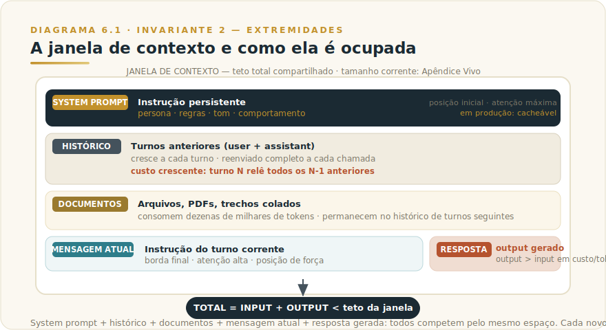
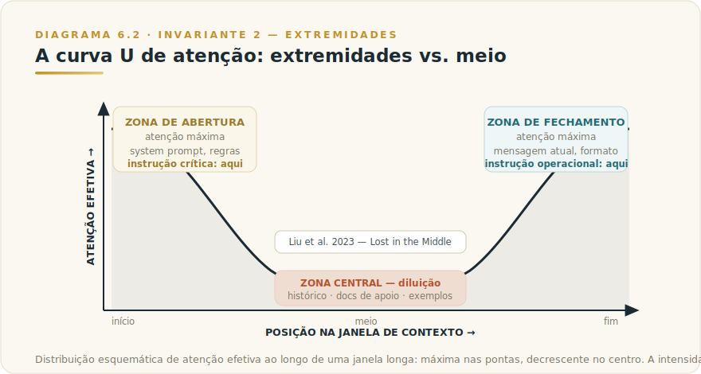

# CAPÍTULO 6
## REFRESHER: TOKENS E CONTEXTO

---

> *"Janela grande não é garantia de atenção. É território com zonas — e quem não sabe disso enterra as regras mais importantes no lugar onde o modelo olha menos."*

---

> 🧭 **Por que este capítulo é a aplicação do Invariante 2 — Extremidades**
>
> O Invariante 2 diz: *"O meio do contexto é onde a informação vai morrer."* Modelos transformer alocam atenção com viés documentado para o início e o fim da janela — o fenômeno *Lost in the Middle* (Liu et al., 2023) e estudos subsequentes confirmam que informação enterrada no centro de um contexto longo recebe peso efetivo significativamente menor do que mereceria. Isso não é limitação superada pela versão mais recente: é física da arquitetura, presente em algum grau em todos os modelos atuais. Este capítulo traduz essa física em decisões operacionais: o que é um token, o que é uma janela, o que consome seu espaço, e — sobretudo — *quando enxugar, quando reiniciar, quando externalizar*. Quem ignora o Invariante 2 constrói prompts que crescem até a zona morta e espera resultados que nunca chegam.

---

## 6.1 — O CONCEITO INTUITIVO

Quando você escreve para Claude, imagina uma folha em branco infinita — quanto mais você colocar, mais o modelo vai saber. Essa intuição é errada em dois sentidos.

Primeiro: a folha tem tamanho. O modelo processa uma janela finita de tokens por vez. Tudo que não couber é invisível — não esquecido, nunca visto. Uma conversa longa começa a perder suas próprias premissas quando elas foram ditas nos primeiros turnos e a janela avançou além delas.

Segundo: a folha tem zonas. O início e o fim recebem atenção desproporcional. O meio é onde ideias se perdem silenciosamente — sem erro, sem aviso, apenas com menos peso efetivo. Isso é o Invariante 2 em operação.

**Gerenciar contexto é uma decisão ativa, não um comportamento de fundo.** Deixar o histórico crescer indefinidamente, colar documentos inteiros no meio da conversa, enterrar instruções críticas atrás de dez parágrafos — cada hábito tem custo mensurável em qualidade ou em fatura.

Este capítulo é um refresher operacional. O tratamento profundo de tokens está no [Capítulo 3 do Livro 1](../../Livro-1-Os-Invariantes/02-capitulos/L1-C03-tokens.md); de janela de contexto, no [Capítulo 4 do Livro 1](../../Livro-1-Os-Invariantes/02-capitulos/L1-C04-janela-de-contexto.md). O que aqui está é o critério de decisão que separa uso maduro de uso caro.

---

## 6.2 — ANALOGIA: A MESA DE REUNIÃO COM MEMÓRIA CURTA

Imagine que você convoca Claude para uma reunião longa. Ele tem na frente uma mesa com espaço para cem folhas. Cada pergunta, resposta, documento e instrução ocupa folhas nessa mesa.

Quando ela enche, para cada folha nova, uma antiga vai para o chão — invisível. Se a regra mais importante estava na terceira folha e você chegou na centésima, ela pode ter ido para o chão. O modelo não vai avisar — vai simplesmente não seguir o que não vê.

Mesmo antes de encher, Claude não lê todas as folhas com a mesma atenção. Início e final da pilha recebem atenção máxima; o meio, atenção decrescente. Uma instrução enterrada no vigésimo documento é contexto de apoio, não regra. Uma instrução no topo, ou repetida logo antes da pergunta, é o centro da tarefa.

Gestão de contexto é a arte de decidir o que fica na mesa, em que ordem, e o que vai para arquivo externo — em vez de ocupar espaço de trabalho permanente.

---

## 6.3 — EXPLICAÇÃO TÉCNICA

### 6.3.1 — O que é um token

Token é a unidade de processamento que o modelo usa — não a palavra que você lê. Pode ser uma palavra inteira ("casa"), um fragmento ("con-", "-trato"), ou um caractere isolado em línguas não latinas. O algoritmo que divide texto em tokens — o tokenizador — foi treinado a partir de corpora de texto, e palavras muito frequentes ganham tokens próprios; palavras raras ou técnicas são construídas por combinação de peças menores.

A consequência direta para quem usa Claude em português do Brasil: o mesmo conteúdo em português consome entre 40% e 60% mais tokens do que em inglês, porque o tokenizador foi treinado predominantemente em inglês. Em uso pessoal, a diferença é irrelevante. Em produção com volume, a diferença é orçamentária. O princípio de por que isso acontece é estável; os números exatos variam por tokenizador e modelo — consulte o [Apêndice J](../04-apendices/L2-APX-J-apendice-vivo.md) para referências atualizadas.

Tokens são a unidade de tudo: o que você paga, o que o modelo processa, o que consome a janela. Pensar em palavras e esperar que os limites se comportem como limites de palavras é a fonte de surpresas frequentes.

### 6.3.2 — O que é a janela de contexto

A janela de contexto é o teto máximo de tokens que o modelo pode receber e gerar em uma única chamada. Ela é **compartilhada entre tudo**: o system prompt, o histórico de conversa, os documentos colados, a mensagem atual, e a resposta que o modelo vai produzir. Input e output competem pelo mesmo espaço.

A mecânica é simples e implacável: a cada turno de uma conversa, o modelo recebe o histórico completo de todos os turnos anteriores mais a nova mensagem. Quem gerencia os tokens não é o modelo — é o sistema que orquestra a conversa. Em claude.ai, a plataforma faz isso automaticamente (usando um sistema de "primeiro a entrar, primeiro a sair" conforme a janela enche). Em aplicações construídas sobre a API, cabe ao desenvolvedor decidir o que preservar e o que compactar.

Os tamanhos de janela disponíveis crescem a cada geração de modelo. O que não muda: uma janela grande não é garantia de atenção uniforme, e uma janela grande preenchida descuidadamente costuma ser pior do que uma janela menor preenchida com curadoria. Tamanhos correntes por modelo ficam no [Apêndice J](../04-apendices/L2-APX-J-apendice-vivo.md) — qualquer número que entrasse aqui envelheceria em meses.

### 6.3.3 — O que consome contexto (e que a maioria ignora)

O consumo de contexto tem quatro fontes, em ordem crescente de invisibilidade:

**O system prompt** é a instrução base. Em claude.ai com Projects, é o contexto do projeto; na API, é o parâmetro `system`. Em produção com milhares de chamadas, system prompts longos e não-cacheados são o maior item da fatura — e muitas equipes não percebem porque ele é constante e nunca aparece como "custo da conversa desta semana".

**O histórico acumulado** cresce de forma insidiosa. Em trinta turnos, o modelo recebe na mensagem 30 o histórico completo dos 29 anteriores. A conversa de trinta turnos custa muito mais que trinta vezes o custo do primeiro turno — porque cada turno reenvia tudo que veio antes.

**Documentos colados** são o candidato mais óbvio: um PDF de oitenta páginas consome dezenas de milhares de tokens. O custo é imediato e visível. O que é menos óbvio: o documento fica no histórico de todos os turnos subsequentes, relido e pago a cada nova mensagem.

**O extended thinking**, quando habilitado, gera tokens internos de raciocínio que contam para a janela e para a cobrança — embora não apareçam no texto de resposta. Em consultas muito complexas com raciocínio estendido, o consumo de tokens de thinking pode superar o da resposta visível. Para turnos subsequentes, a plataforma Claude descarta automaticamente os blocos de thinking anteriores para preservar espaço de contexto.

### 6.3.4 — Context rot: por que contexto longo degrada

A documentação da Anthropic usa o termo *context rot*: "As token count grows, accuracy and recall degrade." Não é metáfora — é terminologia técnica.

Context rot não é bug. É comportamento esperado de um transformer quando o contexto excede a escala em que ele mantém atenção uniforme. O mecanismo de atenção fica mais difuso conforme o número de tokens cresce. Informações nas pontas são ancorradas; informações no centro competem por atenção com tudo ao redor, e saem perdendo.

Liu et al. (2023), *Lost in the Middle*, documentaram que a taxa de recuperação correta em janelas longas segue curva em U: alta nas extremidades, queda no centro. Com janelas acima de 32 mil tokens e informação no primeiro terço, o recall pode cair 40–50% em relação ao desempenho nas pontas.

A consequência operacional: instrução crítica enterrada no meio tem chance real de ser sub-seguida — não porque o modelo "não sabe" a regra, mas porque o peso efetivo que ela recebe é menor do que você espera.

> ⚠️ **POSTMORTEM — O projeto que morreu por excesso de contexto**
> *O que tentaram:* Uma equipe de engenharia de produto empilhou na janela tudo que parecia relevante para o trimestre — specs de três épicos, logs de decisões passadas, transcrições de entrevistas de usuário, roadmap completo e threads de Slack exportados — na esperança de que o modelo "conhecesse o contexto inteiro" e produzisse análises integradas sem precisar de pergunta bem formulada.
> *O que deu errado:* A qualidade das respostas caiu progressivamente sem que ninguém conseguisse explicar por quê. O modelo parava de seguir as restrições de priorização definidas nas primeiras semanas. Análises que deveriam cruzar dois épicos ignoravam um deles. O custo por semana triplicou porque cada turno repassava centenas de milhares de tokens de histórico acumulado — e o problema piorava na mesma proporção em que a equipe tentava resolver adicionando mais contexto. *O Invariante violado:* Inv. 2 — Extremidades. As instruções mais críticas estavam enterradas no centro de uma janela sobrecarregada; o modelo atendia ao ruído e sub-ponderava as regras. *O que teria evitado:* Um documento de "contexto vivo" de no máximo duas páginas — restrições, decisões e premissas críticas — posicionado sempre no início da janela, com conversas curtas e focadas em vez de um único contexto monolítico. No Livro 1, o capítulo de Invariante 5 nomeia esse padrão como **custo composto**: cada token que você empilha sem curadoria cobra juros em todos os turnos seguintes, e o custo de contexto mal gerido não é linear — é exponencial conforme a conversa avança. Veja também `[Apêndice K — Os 9 Modos de Falha](../04-apendices/L2-APX-K-modos-de-falha.md)`.

### 6.3.5 — As três zonas e o Invariante 2 aplicado

A janela de contexto tem três zonas funcionais, e entender onde colocar o quê é a aplicação direta do Invariante 2:

**Zona de abertura** (início do contexto): máxima atenção. É onde vai o system prompt, as regras invioláveis, a persona, o objetivo da tarefa. O que o modelo deve respeitar o tempo todo precisa estar aqui.

**Zona central** (meio do contexto): atenção diluída. É onde vai o histórico de turnos anteriores, os documentos de contexto, os exemplos auxiliares. Conteúdo de suporte — útil quando acessado, mas não catastrófico se sub-ponderado.

**Zona de fechamento** (final do contexto, imediatamente antes da resposta): atenção máxima, segunda posição de força. É onde vai a instrução operacional da tarefa atual, o formato esperado, a pergunta viva. O que você quer que o modelo ancore na geração precisa estar aqui.

O Framework F4 do Livro 1 — Engenharia de Prompt Estendida ([L1-F4](../../Livro-1-Os-Invariantes/03-frameworks/L1-F4-prompt-ext.md)) — operacionaliza essas três zonas em cinco blocos com regras explícitas de posição. O princípio central: instrução crítica nunca vai no centro.

---

## 6.4 — CRITÉRIO DE DECISÃO: QUANDO ENXUGAR, QUANDO REINICIAR, QUANDO EXTERNALIZAR

A maioria gerencia contexto por instinto — cola tudo que parece relevante, espera que o modelo saiba o que é mais importante, e percebe o problema quando a qualidade cai ou a fatura surpreende.

O critério abaixo aplica o Invariante 2 e o Invariante 3 a situações reais de uso.

**A pergunta de partida:** o que está no contexto agora é informação que o modelo precisa para esta resposta — ou é histórico que acumulou sem curadoria?

### Tabela de decisão: Enxugar / Reiniciar / Externalizar

| Situação | Decisão recomendada | Por quê |
|----------|---------------------|---------|
| Conversa passou de 20-30 turnos e as respostas parecem "esquecer" premissas iniciais | **Reiniciar** com resumo das decisões tomadas como contexto inicial | Histórico cheio empurra premissas para a zona central ou fora da janela |
| Você colou um documento longo no chat e a conversa continuou por muitos turnos | **Nova conversa** com o documento posicionado no início, ou externalizar via Project | O documento está no histórico de todos os turnos, sendo pago a cada mensagem; e migrou para o centro da janela |
| A instrução mais importante está num parágrafo intermediário de um prompt longo | **Enxugar** o prompt: mova a regra crítica para o início, ou repita-a imediatamente antes da pergunta | Instrução no centro sofre de context rot; posição importa |
| Você usa o mesmo conjunto de documentos como referência em múltiplas conversas | **Externalizar** via Project (contexto persistente curado) ou via RAG | Colar o mesmo conteúdo em cada conversa é pagar o mesmo input repetidamente sem caching |
| A resposta chegou longa e você quer continuar com base nela | **Enxugar** a resposta antes de continuar: peça um resumo executivo e use isso como base do próximo turno | Respostas longas ficam no histórico; tokens que você não vai reler custam a cada turno subsequente |
| A tarefa é exploratória (brainstorming, ideação) e você vai descartar a maioria | **Nova conversa por exploração** em vez de uma conversa longa que acumula; guarde apenas o que vale | Contexto longo de exploração polui a memória de trabalho com ruído |
| Você tem system prompt estável e alto volume de chamadas via API | **Prompt caching** (Apêndice J para detalhes técnicos e disponibilidade) | System prompt estático relido a cada chamada é o maior desperdício de input em produção |
| Você não sabe o que está consumindo o contexto | **Token counting** antes de enviar | A API da Anthropic oferece endpoint de contagem de tokens; medir antes de gastar é controle, não burocracia |

### O critério de custo sem decorar preço

Preço por token muda. Múltiplos entre input e output mudam. O que não muda é a estrutura do custo:

**Output custa mais que input.** Em todos os modelos frontier que existem hoje, o múltiplo é real — verifique o corrente no Apêndice J. Isso significa que pedir respostas sucintas tem retorno desproporcional: "responda em no máximo 200 palavras" frequentemente economiza mais do que encurtar o prompt pela metade.

**Histórico cresce linearmente; custo cresce com ele.** Uma conversa de 30 turnos com média de 1.000 tokens por turno não custa 30.000 tokens: custa algo como 30 × (média acumulada), facilmente 400.000 tokens ao longo da conversa, porque cada turno relê tudo que veio antes.

**Custo por chamada × volume = o que realmente importa em produção.** Em uso pessoal, custo por token é irrelevante. Em produção com centenas de chamadas por dia, é a alavanca principal. O capítulo relevante para essa matemática é o [Livro 1, Capítulo 18 — Economia de Tokens](../../Livro-1-Os-Invariantes/02-capitulos/L1-C18-economia-tokens.md).

**A alavanca mais subutilizada é o escopo do que você coloca no contexto.** Não "quanto" você paga por token — mas "quantos tokens você realmente precisa". Quem aprende a perguntar "o modelo precisa de tudo isso para responder esta pergunta?" antes de montar o prompt tende a reduzir custo de 30% a 60% sem mudar de modelo e sem sacrificar qualidade.

---

## 6.5 — EXEMPLO MEMORÁVEL

*Cenário ilustrativo brasileiro.*

Uma coordenadora de projetos de uma consultoria em São Paulo usava Claude diariamente para acompanhar um projeto de transformação digital com doze entregáveis ao longo de seis meses. Ela tinha a mesma conversa aberta desde a semana um — nunca reiniciou, porque "assim o modelo sabe todo o histórico do projeto".

No quarto mês, a qualidade das respostas começou a cair. O modelo dava respostas genéricas em vez de respostas ajustadas ao contexto do projeto. Em uma das interações, ela perguntou sobre as restrições de prazo de um entregável específico — restrições que havia detalhado na semana um. O modelo respondeu com generalidades, como se não as conhecesse. Ela diagnosticou: "o modelo esqueceu". O diagnóstico certo era outro: a conversa acumulara mais de duzentos turnos; as restrições da semana um estavam enterradas no meio de uma janela parcialmente ocupada, na zona onde o context rot já havia reduzido o peso efetivo daquele conteúdo.

A solução não era mágica. Era operacional: ela criou um Project no Claude com um documento de "contexto vivo do projeto" — restrições, decisões tomadas, premissas críticas — atualizado a cada semana, sempre com as informações mais críticas no início do documento. Passou a iniciar conversas novas para cada tarefa, usando o Project como âncora de contexto persistente em vez de acumular histórico. O documento vivo entrava em cada conversa na zona de abertura — atenção máxima. As conversas eram curtas, focadas, enxutas.

A qualidade voltou. O custo por semana caiu, porque as conversas curtas com contexto curado consumiam menos tokens do que as conversas longas com histórico acumulado. E o que importava — as restrições do projeto — estava sempre na zona de força, onde o modelo efetivamente presta atenção.

A lição não é "use Projects". É a que o Invariante 2 sempre entregou: densidade de relevância vence volume bruto. Curar o que entra na janela é mais eficaz do que confiar que a janela vai dar conta de tudo.

---

## 6.6 — NA PRÁTICA: TRÊS APLICAÇÕES REPLICÁVEIS

Três aplicações que você pode rodar esta semana. Cada uma segue a forma *situação → o que fazer → o ponto de julgamento* — o ponto de julgamento é o que ancora o Invariante 2 ao resultado.

**Aplicação 1 — Auditar um prompt de alto uso e reposicionar instruções críticas.**
*Situação:* você tem um prompt que usa frequentemente, mas às vezes o modelo não segue uma ou mais das suas instruções, sem motivo aparente. *O que fazer:* abra o prompt e mapeie onde cada instrução está — início, meio ou fim; identifique as instruções que são invioláveis (formato fixo, restrição de conteúdo, critério de qualidade); mova cada instrução inviolável para o início do prompt ou para imediatamente antes da pergunta final; instruções de contexto e apoio ficam no meio. *O ponto de julgamento:* rode o prompt reformatado cinco vezes com inputs variados e observe se as instruções invioláveis estão sendo seguidas com mais consistência. Se a consistência melhorou, você confirmou que era problema de posição. Se não, o problema é outro — a instrução é ambígua ou há conflito com outra instrução — e isso é um diagnóstico igualmente valioso.

**Aplicação 2 — Construir um "contexto vivo" de projeto em lugar de conversa contínua.**
*Situação:* você usa Claude para acompanhar um projeto de múltiplas semanas e tem o hábito de manter a mesma conversa aberta, esperando que o modelo "lembre" o contexto. *O que fazer:* crie um documento de "contexto vivo do projeto" com três seções: (a) premissas e restrições que nunca mudam; (b) decisões tomadas, em ordem cronológica reversa (mais recente no topo); (c) próximos passos e perguntas abertas; a cada nova sessão, inicie uma conversa nova e cole esse documento no início, com a instrução de tarefa da sessão logo após; atualize o documento ao fim de cada sessão com as decisões e progressos. *O ponto de julgamento:* após três semanas, compare o custo de tokens das sessões curtas com o custo que a conversa longa acumularia. Mais importante: avalie se a qualidade das respostas nas sessões curtas com contexto curado é superior à qualidade que você obtinha na conversa longa. Se for, você está operando o Invariante 2 corretamente. Se não for, revise o que está no contexto vivo — provavelmente falta densidade nas premissas críticas.

**Aplicação 3 — Mapear a principal fonte de consumo de tokens na sua operação.**
*Situação:* você tem uso regular de Claude (pessoal ou corporativo) mas não sabe onde está a maior parte do consumo — se é sistema prompt, histórico, documentos colados, ou extended thinking. *O que fazer:* por uma semana, antes de cada sessão significativa, estime mentalmente o que vai consumir mais tokens naquela sessão; ao final da semana, consolide: qual categoria apareceu mais vezes como maior consumidor? Identifique uma ação concreta de redução nessa categoria (encurtar o system prompt, reiniciar conversas mais cedo, substituir documento colado por Project). *O ponto de julgamento:* implemente a ação de redução por uma semana e estime se o consumo mudou perceptivelmente, sem sacrifício de qualidade. A alavanca de economia mais subestimada não é trocar de modelo — é reduzir o que você coloca no contexto. Se a mudança foi indiferente para a qualidade e reduziu consumo, você identificou gordura que não estava entregando valor.

> 🔧 **EXERCÍCIO**
> Pegue uma conversa recente com Claude que ficou longa (mais de 15 turnos) e na qual você sentiu qualidade decaindo. Identifique: (a) onde estava a instrução mais importante que o modelo "esqueceu"; (b) quantos turnos havia entre ela e o momento em que o problema apareceu; (c) o que você teria colocado no system prompt versus no turno. Agora reconstrua o início dessa conversa do zero com o contexto curado — apenas o que é necessário, estrutural no início, situacional no turno. Rode uma tarefa equivalente e registre: a saída melhorou? O contexto curado foi suficiente, ou você percebeu que havia perdido informação que estava "enterrada" na conversa longa? Esse diagnóstico revela o que você ainda não consegue descartá-lo — e esse é o conteúdo que pertence ao contexto vivo, não ao histórico.

---

## 6.7 — CAMADA VIVA

Este capítulo deliberadamente não contém:

- Tamanhos de janela de contexto por modelo
- Preços por milhão de tokens (input ou output)
- Múltiplos de custo entre input e output
- Tamanho de janela máximo para usuários de plano X ou Y

Esses números mudam trimestralmente. Decorá-los é o Invariante 3 violado: você memoriza o número do trimestre e usa como se fosse lei, até ser surpreendido pela atualização que mudou tudo. O lugar certo para números voláteis é o **[Apêndice J — Apêndice Vivo](../04-apendices/L2-APX-J-apendice-vivo.md)**, atualizado com fonte verificável e data do snapshot.

O que este capítulo entrega — e que sobrevive a qualquer atualização de modelo — é a mecânica: tokens são unidades; janelas são finitas e compartilhadas; o meio degrada; extremidades têm peso; curar é mais eficaz do que acumular. Esses são os invariantes do contexto.

---

## 6.8 — LIMITAÇÕES E CUIDADOS

Algumas ressalvas que não podem ser omitidas.

**Context rot não é absoluto.** Claude atinge resultados de ponta em benchmarks de recuperação de contexto longo como MRCR e GraphWalks (conforme a documentação oficial da Anthropic). O fenômeno existe, mas modelos mais recentes são progressivamente melhores em manter atenção em janelas longas. O que não muda: os ganhos dependem do que está no contexto, não só de quanto espaço há. Curadoria ainda importa.

**"Enxugar" pode significar perda de informação real.** A recomendação de reiniciar ou compactar conversas longas assume que você sabe o que é descartável. Se a conversa longa tem nuances de decisão que o resumo não vai capturar, descartar é arriscado. O critério não é "enxugue sempre" — é "saiba o que está no contexto e tome a decisão com consciência".

**Compactação automática não substitui curadoria.** A plataforma Claude oferece compactação server-side (disponível em versões recentes da API) que sumariza automaticamente conversas longas antes de elas atingirem o limite. É útil, mas é uma rede de segurança, não uma estratégia. A sumarização automática não sabe o que é mais crítico para a sua tarefa. Você sabe.

**Projects resolvem parte do problema, não todo.** [Projects (Capítulo 13)](L2-C13-projects.md) permitem contexto persistente e curado que entra em cada conversa — o que endereça o problema de repetir o mesmo documento a cada sessão. Mas o tamanho do Project tem limites, e o contexto do Project também entra na janela — nas zonas corretas se bem estruturado, ou nas zonas erradas se mal ordenado.

**Modelos mais recentes são mais resistentes ao fenômeno, mas não imunes.** A documentação da Anthropic confirma ganhos em benchmarks de contexto longo. Isso não elimina a necessidade de gerenciar contexto — desloca o ponto em que o problema se manifesta. A boa prática de posicionamento e curadoria vale para qualquer tamanho de janela.

---

## 6.9 — CONEXÕES COM OUTROS CAPÍTULOS

- 🔗 **Invariante 2 — Extremidades (definição e mecânica completa)** → [Manifesto dos Nove Invariantes](../../Livro-1-Os-Invariantes/01-manifesto/L1-C00M-manifesto-invariantes.md)
- 🔗 **Tratamento profundo de tokens (L1)** → [Livro 1, Capítulo 3 — Tokens](../../Livro-1-Os-Invariantes/02-capitulos/L1-C03-tokens.md)
- 🔗 **Tratamento profundo de janela de contexto, Lost in the Middle, RAG vs. contexto longo (L1)** → [Livro 1, Capítulo 4 — Janela de Contexto](../../Livro-1-Os-Invariantes/02-capitulos/L1-C04-janela-de-contexto.md)
- 🔗 **Engenharia de prompt pelas extremidades — os 5 blocos (Framework F4)** → [L1-F4 — Engenharia de Prompt Estendida](../../Livro-1-Os-Invariantes/03-frameworks/L1-F4-prompt-ext.md)
- 🔗 **Economia de tokens em escala (L1)** → [Livro 1, Capítulo 18 — Economia de Tokens](../../Livro-1-Os-Invariantes/02-capitulos/L1-C18-economia-tokens.md)
- 🔗 **Contexto persistente e curado sem acúmulo de histórico** → [Capítulo 13 — Projects](L2-C13-projects.md)
- 🔗 **Modelos e janelas de contexto disponíveis** → [Capítulo 4 — Todos os Modelos Claude](L2-C04-modelos-claude.md)
- 🔗 **Agentes e uso de contexto em workflows longos** → [Capítulo 32 — Subagentes e Workflows](L2-C32-subagents-workflows.md)
- 🔗 **Números voláteis (tamanhos de janela, preços por token, disponibilidade de caching)** → [Apêndice J — Apêndice Vivo](../04-apendices/L2-APX-J-apendice-vivo.md)

---

## 6.10 — RESUMO EXECUTIVO

| Conceito | Síntese operacional |
|----------|---------------------|
| **Token** | Unidade de processamento do modelo — não é palavra; pode ser fragmento ou caractere; português usa ~40-60% mais tokens que inglês |
| **Janela de contexto** | Teto compartilhado entre input (system prompt + histórico + documentos + mensagem atual) e output (resposta gerada) |
| **O que consome contexto** | System prompt · histórico de turnos acumulado · documentos colados · extended thinking (quando habilitado) |
| **Context rot** | Degradação de recall conforme o contexto cresce sem curadoria; fenômeno documentado pela Anthropic e na literatura (Lost in the Middle, Liu et al. 2023) |
| **Invariante 2 aplicado** | Instrução crítica vai no início ou imediatamente antes da pergunta; nunca no meio; contexto de suporte vai no centro |
| **Quando enxugar** | Instrução crítica enterrada no meio; resposta mais longa do que o necessário no histórico |
| **Quando reiniciar** | Conversa passou de 20-30 turnos e premissas iniciais somem; exploração que gerou ruído acumulado |
| **Quando externalizar** | Documentos usados em múltiplas sessões → Project; bases de conhecimento grandes → RAG; system prompt estático em produção → prompt caching |
| **Critério de custo** | Output custa mais que input; histórico cresce linearmente; escopo do contexto é a principal alavanca de economia |
| **Camada Viva** | Tamanhos de janela, preços, múltiplos de cobrança: no Apêndice J — o padrão fica aqui; o número, lá |

---

## 6.11 — VALIDAÇÃO UAU

| # | Critério | Você consegue? |
|---|----------|----------------|
| 1 | **Clareza** — Explicar em 60 segundos por que uma conversa longa pode ter qualidade pior do que uma curta bem construída, mesmo que o modelo seja o mesmo | ☐ |
| 2 | **Profundidade** — Nomear as três zonas da janela de contexto, qual tem mais atenção, qual tem menos, e que tipo de conteúdo vai em cada uma | ☐ |
| 3 | **Decisão** — Dada uma situação real de uso (conversa longa, documento colado, tarefa recorrente), escolher entre enxugar, reiniciar ou externalizar com justificativa | ☐ |
| 4 | **Aplicação** — Revisar um prompt seu que você usa com frequência e identificar se alguma instrução crítica está na zona central (onde deveria estar no início ou no fim) | ☐ |
| 5 | **Economia** — Estimar, sem decorar preço, qual é a principal fonte de consumo de tokens na sua operação atual e qual seria a alavanca de maior impacto para reduzi-la | ☐ |

---

> *"Janela não é memória. É espaço de trabalho. E espaço de trabalho sem organização não é riqueza — é bagunça que cobra por token."*
