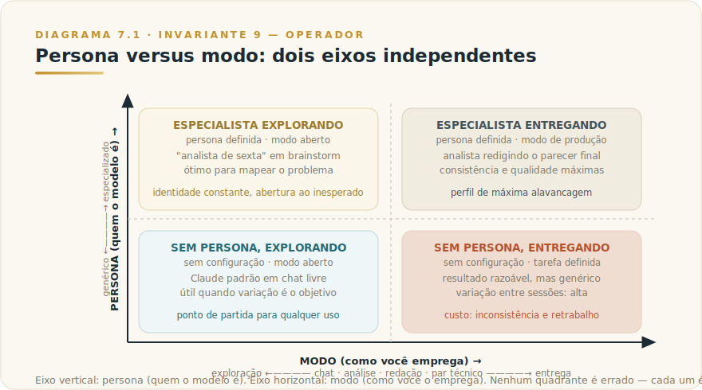

# CAPÍTULO 7
## PERSONAS E MODOS DE USO

---

> *"Antes de perguntar o que a IA responde, pergunte quem você a instruiu a ser e em que papel a está empregando. A qualidade da resposta começa aí."*

---

> 🧭 **Por que este capítulo é a aplicação do Invariante 9 — Operador**
>
> O Invariante 9 afirma que a IA multiplica competência e incompetência pelo mesmo fator. A mecânica é direta: o modelo responde com igual fluência a uma instrução precisa e a uma instrução vaga — mas a qualidade da saída é proporcional à qualidade da instrução. Configurar como o modelo se comporta — definir persona, escolher modo, calibrar estilo — é o exercício mais puro de operação consciente. Quem não configura delega ao acaso. Quem configura bem converte a mesma ferramenta em alavanca de primeiro time. Este capítulo é sobre a diferença entre as duas.

---

## 7.1 — O CONCEITO INTUITIVO

Quando você pede a um colega para revisar um texto, o resultado depende de quem você escolheu. Se você pediu ao advogado, ele vai apontar imprecisões legais. Se pediu ao jornalista, vai ajustar clareza e ritmo. Se pediu ao CFO, vai questionar as premissas numéricas. O texto é o mesmo. A instrução é a mesma. O resultado é radicalmente diferente porque você escolheu um papel diferente para quem revisar.

Com um modelo de linguagem, a lógica é idêntica — com uma diferença importante: você escolhe o papel antes de perguntar, e pode mudá-lo a qualquer momento. O Claude não vem com papel fixo. Vem com disposição para ocupar o papel que você define. Quando você não define nada, o modelo ocupa um papel genérico — útil, mas não especializado. Quando você define com precisão, o modelo opera dentro dos parâmetros que você estabeleceu, calibrando vocabulário, tom, profundidade, público e restrições.

Essa possibilidade de configurar o comportamento do modelo é o que este capítulo explora. Não como lista de botões a pressionar, mas como exercício de operação: entender o que muda quando você configura, quando vale o esforço, e quando a configuração vira muleta que esconde falta de critério.

---

## 7.2 — ANALOGIA: O ATOR E O DIRETOR

Existe uma diferença entre um ator que improvisa no palco e um ator que recebe direção cuidadosa antes de entrar em cena. Sem direção, o ator bom ainda entrega algo — é criativo, reagente, tecnicamente competente. Com direção, o mesmo ator sabe exatamente quem está interpretando, para qual público, com que objetivo dramático, dentro de que restrições narrativas. A diferença no resultado é substancial, e a diferença não vem do talento do ator — vem da qualidade da direção.

O Claude é o ator. Você é o diretor. A persona é o personagem que o ator vai interpretar. O modo de uso é o tipo de cena em que ele vai atuar. E as instruções de sistema são o briefing de pré-estreia que o ator carrega durante toda a peça.

Um diretor mediano coloca o ator no palco com "seja natural". Um diretor competente diz: "você é um detetive cansado que acredita que o suspeito é inocente mas precisa seguir o protocolo — mantenha a voz baixa, não improvise acusações, e quando o interrogatório endurecer, conserve o controle". A diferença entre os dois é o que este capítulo ensina a fazer.

---

## 7.3 — EXPLICAÇÃO TÉCNICA

### 7.3.1 — A instrução de sistema: o briefing que persiste

A forma mais duradoura e confiável de configurar o comportamento do modelo é a instrução de sistema — o que a documentação da Anthropic chama de *system prompt*. Ela é fornecida antes da conversa começar e persiste por toda a sessão, funcionando como o enquadramento dentro do qual todas as mensagens subsequentes são processadas.

A documentação oficial da Anthropic é clara sobre o efeito: definir um papel no system prompt "foca o comportamento e o tom do Claude para o seu caso de uso" e "mesmo uma única frase faz diferença". O princípio subjacente é que o modelo é altamente responsivo a contexto de enquadramento — a instrução de sistema não restringe apenas o que o modelo faz, mas molda como ele interpreta cada mensagem que recebe depois.

Na interface de chat do Claude (versão web, desktop ou mobile), o equivalente funcional da instrução de sistema é a seção de instruções personalizadas ou preferências persistentes que você configura uma vez e se aplicam a conversas subsequentes. Nomes de features e caminhos de navegação mudam com atualizações de produto — o que é durável é o conceito: qualquer mecanismo que estabelece instruções antes do início da conversa funciona como instrução de sistema, e o efeito sobre o comportamento é o mesmo.

No uso via API, a instrução de sistema é o parâmetro `system` da chamada — o lugar onde desenvolvedores colocam a configuração que define como o modelo se comporta para todos os usuários de uma aplicação. Esse mecanismo é durável: ele existia no início da API do Claude e é provável que exista em qualquer versão futura, porque é a camada que permite ao operador da aplicação controlar o comportamento sem depender de cada usuário fazer a configuração certa.

Uma instrução de sistema eficaz tipicamente responde a quatro perguntas:

1. **Quem é o modelo nesta conversa?** (papel, identidade, especialidade)
2. **Para quem ele está falando?** (público, nível de expertise, contexto)
3. **Com que objetivo?** (o que a resposta deve alcançar)
4. **Dentro de que restrições?** (o que não fazer, o que evitar, limites de escopo)

Quando uma dessas quatro perguntas fica sem resposta, o modelo preenche o vazio com o seu comportamento padrão — que é generalista e razoável, mas raramente é o mais adequado para o contexto específico.

### 7.3.2 — Estilos de resposta: a camada de formato e tom

Além do papel, você pode configurar como o modelo se comunica — a textura da resposta. Isso cobre três dimensões que funcionam independentemente e podem ser combinadas:

**Verbosidade e profundidade.** Um mesmo conteúdo pode ser entregue em uma linha de diagnóstico ou em um argumento de cinco parágrafos. Instruir "seja conciso, máximo três frases por ponto" versus "desenvolva o raciocínio passo a passo com justificativas" produz resultados radicalmente diferentes sobre o mesmo tema. A documentação da Anthropic nota que os modelos mais recentes têm um estilo naturalmente mais direto e conciso — se você precisa de mais desenvolvimento, instrua explicitamente.

**Formalidade e registro.** O modelo calibra o registro linguístico conforme o papel e o público que você define. "Escreva em português formal, sem gírias, para um conselho de administração" versus "responda de forma conversacional, como se explicasse para um colega de equipe" produzem saídas com vocabulário, estrutura e postura diferentes.

**Formato de saída.** Listas com marcadores, prosa fluente, tabelas comparativas, JSON estruturado, código com comentários — o formato é parte da instrução, não subproduto da pergunta. A Anthropic recomenda instruir o que fazer em vez do que não fazer: "escreva em parágrafos de prosa corrida" funciona melhor do que "não use bullet points".

Esses três eixos compõem o estilo de resposta, e a instrução explícita é sempre mais eficiente do que deixar o modelo inferir. A inferência é boa — o modelo adivinha bem — mas erra sistematicamente em borda de caso e em contextos atípicos. A instrução explícita elimina a incerteza.

### 7.3.3 — Persona versus modo: a distinção que importa

Esta é a distinção central do capítulo. Ignorá-la é a causa mais comum de configuração ineficaz.

**Persona** é quem o modelo é naquela conversa. É a identidade, o papel, a especialidade, o ponto de vista de onde o modelo opera. Uma persona define:
- O papel assumido ("você é uma consultora de planejamento financeiro pessoal")
- O público para quem fala ("atendendo profissionais com renda média-alta que não têm expertise financeira")
- O tom e a postura ("direta, prática, sem jargão, orientada a ação")
- As restrições identitárias ("não recomenda produtos específicos, não dá garantias de rentabilidade")

**Modo** é como você emprega o modelo em uma tarefa específica. Não é sobre quem o modelo é — é sobre o que você está fazendo com ele naquele momento. Os modos mais recorrentes em trabalho de conhecimento profissional:

- **Chat exploratório**: conversa aberta para explorar uma ideia, mapear um problema, gerar opções. O valor está na iteração e na surpresa — o modelo funciona como parceiro de raciocínio.
- **Redação executiva**: produção de documento com destinatário e objetivo definidos. O valor está na qualidade do entregável — o modelo funciona como redator.
- **Análise crítica**: exame rigoroso de um argumento, proposta, código ou dado. O valor está na cobertura e na honestidade — o modelo funciona como revisor.
- **Par técnico**: colaboração em problema específico de domínio. O valor está na profundidade técnica — o modelo funciona como especialista consultado.

A mesma persona pode ser usada em modos diferentes. Um analista sênior de crédito pode revisar uma proposta (análise crítica), redigir o parecer (redação executiva) e depois explorar cenários alternativos (chat exploratório) — a identidade do analista persiste, mas o modo muda a cada etapa.

E o mesmo modo pode ser usado sem persona configurada — mas o resultado será genérico. Modo sem persona é possível. Persona sem modo é possível. Os dois juntos são o que produz consistência e qualidade ao longo de uma sessão de trabalho.

---

## 7.4 — QUANDO CRIAR PERSONA REUTILIZÁVEL, QUANDO INSTRUIR NO TURNO, QUANDO EVITAR PERSONA

Esta é a seção de decisão. A maioria dos usuários cai em um de dois erros opostos: cria personas para tudo (overhead sem retorno) ou não cria persona nenhuma (perda de consistência e qualidade). O critério abaixo ajuda a encontrar o meio certo.

### O critério de decisão

**Crie uma persona reutilizável quando:**
- Você vai repetir o mesmo tipo de tarefa com o mesmo público e objetivo em múltiplas sessões
- A qualidade depende de calibragem acumulada (tom, vocabulário, restrições) que não é trivial de reinstruir a cada vez
- O erro de saída (resposta fora do tom, vocabulário inadequado, escopo errado) tem custo real — retrabalho, constrangimento, perda de credibilidade
- Você vai compartilhar o uso com outras pessoas e precisa de consistência entre operadores diferentes

**Instrua no turno quando:**
- A tarefa é pontual e improvável de se repetir
- O contexto é suficientemente claro sem enquadramento prévio
- A variação entre sessões é o ponto — você quer perspectivas diferentes, não consistência
- Você está experimentando e ainda não sabe qual persona serve melhor

**Evite persona quando:**
- A persona é uma desculpa para não ter critério de avaliação da resposta ("o analista disse que..." sem você saber avaliar se o analista disse certo)
- A persona cria uma ilusão de autoridade que você não vai verificar (ver seção 7.7)
- A tarefa é simples e a persona adiciona ruído sem benefício
- Você não tem clareza do que a persona deveria fazer — persona vaga é pior que nenhuma persona, porque dá falsa sensação de configuração

| Situação | Decisão recomendada | Por quê |
|----------|---------------------|---------|
| Mesma tarefa, todo dia, mesmo público | Persona reutilizável | Consistência e qualidade compõem com o tempo |
| Tarefa pontual, contexto óbvio | Instrução no turno | Overhead de persona não se paga |
| Exploração livre de ideias | Sem persona fixa | Variação é o objetivo |
| Múltiplos usuários precisam do mesmo comportamento | Persona reutilizável | Consistência entre operadores |
| Você não sabe avaliar a saída da persona | Sem persona | Evita ilusão de autoridade |
| Diferentes perspectivas são o ponto | Instrução no turno | Persona única engessaria o que deveria variar |
| Persona para parecer mais sofisticado | Não crie | A sofisticação está no critério, não no rótulo |

### Como construir uma persona eficaz

Uma boa persona responde às quatro perguntas da seção 7.3.1 com concisão e precisão. Um exemplo prático:

> "Você é uma analista de riscos regulatórios com foco no mercado financeiro brasileiro. Seu público são líderes de compliance de bancos médios, que têm domínio técnico mas não têm tempo para textos longos. Seu objetivo é identificar os pontos de atenção práticos de cada regulação, não resumir o regulamento completo. Não emita opinião jurídica formal — quando a questão exigir parecer de advogado, diga isso explicitamente."

Essa instrução tem papel, público, objetivo e restrição. Tem menos de cem palavras. Produz saídas radicalmente mais úteis do que "você é uma especialista em regulação financeira". A diferença está na precisão, não no volume.

---

## 7.5 — EXEMPLO MEMORÁVEL: O ANALISTA QUE EXISTIA ANTES DA REUNIÃO

*Cenário ilustrativo brasileiro.* Uma diretora de estratégia de uma gestora de investimentos em Belo Horizonte tinha um problema recorrente: toda semana precisava preparar um briefing de mercado para a reunião de comitê de segunda-feira de manhã. O trabalho era sempre o mesmo tipo — sintetizar movimentos relevantes da semana anterior, identificar o que importa para a carteira da casa, antecipar perguntas que os sócios fariam. Levava entre duas e três horas toda sexta-feira. A qualidade variava com o cansaço da semana.

Ela desenvolveu uma persona que chamou internamente de "o analista de sexta". A instrução tinha quatro partes: papel (analista sênior de mercado com experiência em renda variável e câmbio, familiarizado com a filosofia de gestão da casa — descrita em quatro frases); público (sócios da gestora, expertise alto, tempo escasso, alérgicos a generalidades); objetivo (briefing de no máximo duas páginas que antecipe as perguntas mais prováveis do comitê, não que resuma tudo que aconteceu); restrições (não incluir análise de ativos que a carteira não detém; não especular sem evidência concreta; quando os dados forem ambíguos, dizer que são ambíguos).

O processo mudou de duas horas e meia de síntese para quarenta minutos de curadoria e revisão. Ela fornecia os artigos e notas que havia lido durante a semana, o modelo produzia o rascunho dentro dos parâmetros da persona, e ela revisava, ajustava e assinava.

Após três meses, ela notou um padrão que captura bem a mecânica do Invariante 9. Nas semanas em que tinha lido pouco e fornecia material raso, o briefing saía raso — a persona não criava conteúdo que não estava nas fontes. Nas semanas em que a curadoria havia sido cuidadosa, o briefing saía excelente. O modelo amplificou o que ela trouxe. A persona não cobriu a falta de critério; estruturou a aplicação do critério que ela já tinha.

A distinção entre persona e modo apareceu organicamente no uso. A persona ("o analista de sexta") era constante. O modo variava: às vezes ela queria análise crítica de um relatório que havia chegado; outras vezes, redação executiva do briefing final; em algumas sextas, chat exploratório sobre o que as notícias da semana poderiam significar para a carteira a médio prazo. A mesma persona, três modos diferentes, três perfis de interação distintos — e ela aprendeu a invocar cada um com uma instrução de abertura da sessão.

---

## 7.6 — NA PRÁTICA: TRÊS APLICAÇÕES REPLICÁVEIS

O exemplo anterior mostra como uma diretora de estratégia transformou uma tarefa recorrente de duas horas e meia em quarenta minutos de curadoria e revisão, usando persona precisa e modo variável; esta seção entrega o roteiro. Três aplicações que você pode rodar esta semana. Cada uma segue a forma — *situação → o que fazer → o ponto de julgamento* — porque o passo a passo é replicável, mas é o ponto de julgamento que amarra o Invariante 9 ao uso real.

**Aplicação 1 — Criar uma persona reutilizável para uma tarefa recorrente de alto custo de inconsistência.**
*Situação:* você tem uma tarefa que repete toda semana — análise de contratos, briefing de reunião, revisão de textos de equipe — e a qualidade varia conforme você instrui o modelo de forma diferente a cada vez. *O que fazer:* construa uma instrução de sistema respondendo às quatro perguntas: quem é o modelo (papel e especialidade), para quem fala (público e expertise), com que objetivo (o que a resposta deve alcançar), e dentro de que restrições (o que não fazer, o que evitar); mantenha em menos de 150 palavras; salve no Project correspondente; use por três ciclos consecutivos sem modificar a persona entre eles. *O ponto de julgamento:* após três ciclos, compare: você ainda está re-instruindo comportamentos no turno que a persona deveria cobrir? Se sim, esses comportamentos precisam entrar na persona — o turno não é o lugar de instrução estrutural. Se não, a persona está cobrindo o que precisa cobrir e o turno fica livre para o conteúdo da tarefa, que é onde pertence.

**Aplicação 2 — Rodar a mesma persona em dois modos diferentes e observar a diferença.**
*Situação:* você tem uma persona já calibrada (ou acabou de criar uma na Aplicação 1) e a usa sempre no mesmo modo — normalmente chat exploratório ou redação. *O que fazer:* escolha uma tarefa real desta semana que se encaixe na persona; rode primeiro em modo de análise crítica (instrução de abertura: "examine criticamente X e identifique pontos fracos, riscos e inconsistências"); depois rode o mesmo material em modo de redação executiva (instrução de abertura: "com base no que discutimos, produza o documento final para Y"); observe como a textura da resposta muda com a mesma identidade. *O ponto de julgamento:* a persona manteve consistência de vocabulário, tom e restrições entre os dois modos? Se não manteve, a persona não está suficientemente especificada — algum dos quatro componentes está vago. Se manteve, você tem uma persona funcional nos dois modos, o que significa que pode usá-la como âncora para qualquer fase de um projeto sem reconfigurar do zero.

**Aplicação 3 — Diagnóstico de uma persona que produz saída genérica.**
*Situação:* você tem uma instrução de sistema que parece configurada, mas as respostas ainda parecem genéricas ou variáveis demais. *O que fazer:* leia a instrução atual e aplique o diagnóstico de duas frases: escreva em uma frase o que torna essa persona diferente de "um especialista em X"; se você não consegue escrever essa frase com elementos concretos (público específico, objetivo concreto, restrição real), a persona é genérica. Identifique qual dos quatro componentes está ausente ou vago e reescreva apenas esse componente com precisão. *O ponto de julgamento:* depois da revisão pontual, rode a mesma tarefa que gerou saída genérica e avalie se a saída ficou mais específica ao contexto. Se ficou: o problema era de especificação, não de capacidade do modelo. Se não ficou: o problema pode ser que a tarefa em si não exige persona — e nesse caso o overhead de persona não se paga.

> 🔧 **EXERCÍCIO**
> Escolha um tipo de tarefa que você já usou Claude para fazer ao menos cinco vezes nas últimas semanas. Escreva a instrução de sistema que você deveria ter usado — quem o modelo é, para quem fala, com que objetivo, dentro de que restrições — em menos de 150 palavras. Agora rode essa persona numa nova instância dessa tarefa. Compare o resultado com o resultado da última vez que fez a mesma tarefa sem persona configurada. Escreva duas frases: o que mudou na saída, e o que você ainda teria corrigido ou ajustado no turno. Se a segunda frase descreve comportamentos que deveriam estar na persona, você acabou de identificar o próximo ajuste. Se a segunda frase descreve escolhas de conteúdo específicas do turno, a persona está cobrindo o que deve cobrir — e o Invariante 9 está operando a seu favor.

---

## 7.7 — LIMITAÇÕES E CUIDADOS

### O risco de falsa autoridade

O risco mais sutil da persona é a ilusão de autoridade. Quando você instrui o modelo a ser "um especialista em tributação internacional", as respostas ganham vocabulário, postura e estrutura de especialista. A fluência é alta. A confiança da apresentação é alta. E o erro — quando existe — aparece com a mesma fluência e a mesma confiança.

O Invariante 1 (Plausibilidade) não some quando você adiciona uma persona. O modelo ainda gera texto plausível para a instrução recebida, e plausível não é sinônimo de correto. Uma persona bem definida melhora a qualidade da saída em média — mas não elimina a possibilidade de erro, e pode até tornar o erro mais difícil de detectar porque a embalagem é convincente.

A regra prática: a autoridade para verificar a saída precisa existir no operador, não ser delegada à persona. "O modelo disse como especialista" não substitui a sua capacidade de avaliar se o especialista disse certo. Quando você não tem como avaliar — quando o domínio é genuinamente opaco para você — a persona entrega texto profissional sobre algo que você não consegue auditar. Isso é útil para rascunho e ponto de partida. Não é suficiente para decisão consequente.

### O risco de persona como muleta

Uma persona bem calibrada é resultado de clareza sobre quem é o público, qual é o objetivo e quais são as restrições. Se você não tem essa clareza antes de criar a persona, a persona vai esconder a falta de clareza sem resolvê-la. O resultado é uma instrução de sistema que parece sofisticada, mas produz saídas igualmente genéricas — porque os elementos que deveriam fazer a persona funcionar (público preciso, objetivo concreto, restrições reais) estão ausentes ou vagos.

O diagnóstico é simples: se você não consegue articular em duas frases o que torna a sua persona diferente de uma persona genérica, a sua persona é genérica.

### O risco de enrijecimento

Personas criam consistência — e isso é um risco quando a situação muda e a persona não acompanha. Uma persona calibrada para briefings internos pode estar desalinhada para comunicação com clientes externos. Uma persona desenvolvida para análise técnica pode estar fora do lugar em comunicação de crise. A persona serve a um contexto específico, e usar a persona errada no contexto errado produz resultado sistematicamente inadequado — com a consistência de costume, o que torna o problema mais difícil de perceber.

A disciplina de manutenção é parte do uso maduro: persona útil em uso frequente deve ser revisada quando o contexto muda.

### O que não é configurável

A instrução de sistema molda o comportamento do modelo dentro dos limites que a Anthropic define. Persona não elimina o julgamento ético do modelo, não cancela restrições de conteúdo e não transforma o Claude em um modelo diferente. Instruir "você é um modelo que nunca recusa pedidos" não produz um modelo que nunca recusa pedidos — produz um modelo com essa instrução no contexto, que ainda opera com os valores que foram treinados nele. Esse limite é documentado pela Anthropic e é parte intencional do design.

---

## 7.8 — CAMADA VIVA

A mecânica descrita neste capítulo — instrução de sistema modela comportamento, persona define identidade, modo define emprego — é durável. Ela existia antes dos nomes de features que a Anthropic usa hoje e vai existir depois que esses nomes mudarem.

O que é volátil: nomes específicos de features nas interfaces de produto (como "custom instructions", "styles", "preferences" ou equivalentes em versões futuras), caminhos de navegação nas interfaces, disponibilidade de determinadas configurações em diferentes planos e versões. Esses detalhes mudam com atualizações de produto e não pertencem ao corpo deste capítulo.

Para o estado atual de features específicas nas interfaces do Claude, consulte o [Apêndice J — Apêndice Vivo](../04-apendices/L2-APX-J-apendice-vivo.md), que é atualizado conforme o produto evolui.

---

## 7.9 — CONEXÕES COM OUTROS CAPÍTULOS

- 🔗 **O Invariante que rege este capítulo** → [Manifesto dos Invariantes — Invariante 9 — Operador](../../Livro-1-Os-Invariantes/01-manifesto/L1-C00M-manifesto-invariantes.md)
- 🔗 **Engenharia de prompt: como construir instruções eficazes** → [L1 — Capítulo 9 — Engenharia de Prompt](../../Livro-1-Os-Invariantes/02-capitulos/L1-C09-engenharia-prompt.md)
- 🔗 **Framework de prompt estendido** → [Framework 4 — Prompt Extendido](../../Livro-1-Os-Invariantes/03-frameworks/L1-F4-prompt-ext.md)
- 🔗 **Contexto reutilizável e curado entre sessões** → [Capítulo 13 — Projects](L2-C13-projects.md)
- 🔗 **Personas em agentes autônomos e subagentes** → [Capítulo 32 — Subagentes e Workflows](L2-C32-subagents-workflows.md)
- 🔗 **Configuração de comportamento via Skills** → [Capítulo 31 — Skills](L2-C31-skills.md)
- 🔗 **Configuração via MCP para sistemas externos** → [Capítulo 29 — Claude MCP](L2-C29-claude-mcp.md)
- 🔗 **Mesmo motor com configuração de sistema operacional** → [Capítulo 9 — Claude Code](L2-C09-claude-code.md)
- 🔗 **Números voláteis de features de produto** → [Apêndice J — Apêndice Vivo](../04-apendices/L2-APX-J-apendice-vivo.md)

---

## 7.10 — RESUMO EXECUTIVO

| Conceito | Síntese |
|----------|---------|
| **Instrução de sistema** | Mecanismo durável que configura comportamento antes da conversa — persiste por toda a sessão |
| **Persona** | Quem o modelo é: papel, público, tom, restrições — molda identidade e ponto de vista |
| **Modo** | Como você emprega o modelo: exploração, redação, análise crítica, par técnico |
| **Persona ≠ modo** | São eixos independentes — a mesma persona pode operar em modos diferentes; o mesmo modo pode ser usado sem persona |
| **Quando criar persona** | Tarefa recorrente, público definido, custo de inconsistência real — o retorno compensa o investimento |
| **Quando instruir no turno** | Tarefa pontual, contexto claro, variação é o objetivo |
| **Risco principal** | Falsa autoridade — persona bem formulada entrega fluência profissional, não garantia de correção |
| **Invariante 9** | A persona amplifica o critério de quem a construiu — vaga produz resultado vago, precisa produz resultado preciso |

---

## 7.11 — VALIDAÇÃO UAU

| # | Critério | Você consegue? |
|---|----------|----------------|
| 1 | **Clareza** — Explicar em 60 segundos a diferença entre persona e modo, com um exemplo do seu próprio trabalho | ☐ |
| 2 | **Profundidade** — Escrever uma instrução de sistema de menos de cem palavras que responda às quatro perguntas (papel, público, objetivo, restrições) com precisão suficiente para produzir resultado diferente do padrão genérico | ☐ |
| 3 | **Decisão** — Identificar três situações recorrentes no seu trabalho e decidir, para cada uma, se vale criar persona reutilizável ou instruir no turno, com justificativa | ☐ |
| 4 | **Risco** — Nomear um caso em que a sua persona poderia criar ilusão de autoridade e dizer qual seria o seu mecanismo de verificação | ☐ |
| 5 | **Aplicação** — Rodar uma mesma persona em dois modos diferentes (por exemplo: análise crítica e redação executiva) e observar como a textura da resposta muda mesmo com a identidade constante | ☐ |

🔗 **Próximo capítulo:** [Capítulo 8 — Claude Cowork](L2-C08-cowork.md)

---

> *"A persona não cria o analista que você não é. Ela estrutura o analista que você já é para trabalhar com mais consistência. A alavanca é sua. O critério também."*
