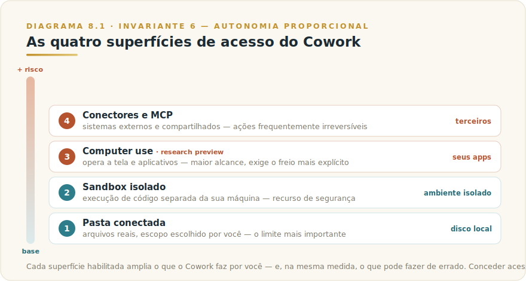
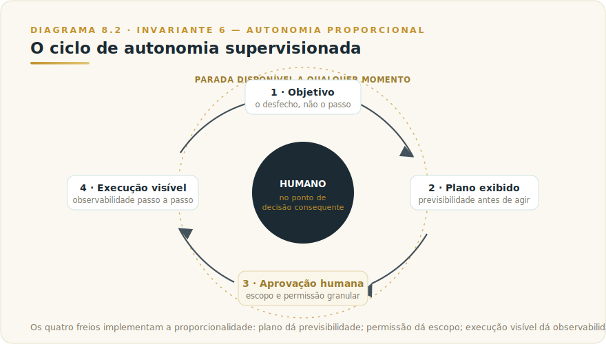
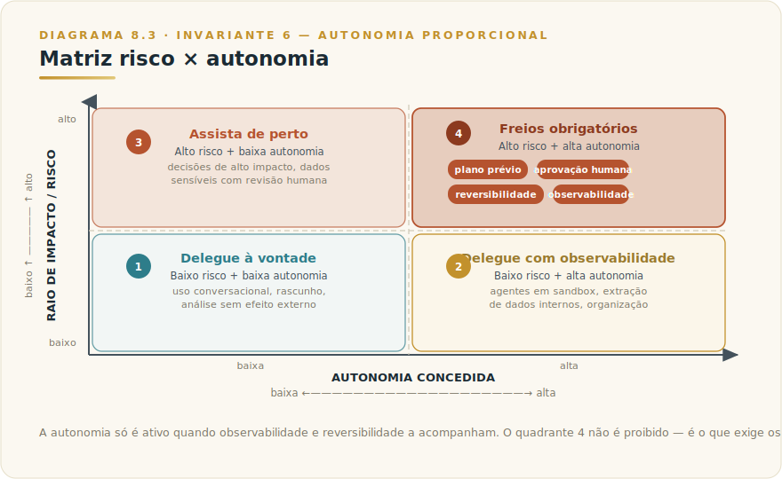

# CAPÍTULO 8
## CLAUDE COWORK

---

> *"A maioria das ferramentas de IA é construída em torno do prompt. Cowork é construída em torno do resultado. E todo resultado entregue por uma máquina que toca seus arquivos reais é, antes de tudo, uma questão de quanta autonomia você decidiu conceder."*

---

> 🧭 **Por que este capítulo é a aplicação do Invariante 6 — Autonomia Proporcional**
>
> Cowork é a superfície de maior autonomia que a Anthropic coloca na mão de um profissional não-técnico. Não é um chat que responde: é um sistema que recebe um objetivo e age — nos seus arquivos locais, na sua máquina, nos seus aplicativos — até devolver um entregável pronto. Essa é exatamente a fronteira onde o Invariante 6 deixa de ser teoria. Autonomia que não é acompanhada por observabilidade e reversibilidade proporcionais não é produtividade: é risco delegado. O capítulo inteiro gira em torno de uma única pergunta de governança — *quanta autonomia essa tarefa merece, e a minha capacidade de ver e desfazer acompanha o que estou delegando?*

---

## 8.1 — O CONCEITO INTUITIVO

Há uma diferença categórica entre pedir uma resposta e delegar um resultado. No chat, você decompõe o trabalho em perguntas: pergunta, lê, formula a próxima, copia, cola, formata, revisa. Você é o sistema operacional do processo — a IA é o processador. O esforço de coordenação fica com você, e em tarefas de muitos passos esse esforço frequentemente custa mais do que cada passo individual.

Cowork inverte essa relação. Em vez de quebrar o trabalho em prompts, você entrega o desfecho: "consolide estes quatro relatórios em um sumário de duas páginas", "extraia as cláusulas de rescisão destes dezoito contratos e me devolva uma tabela comparável". Cowork conduz os passos — abre, lê, sintetiza, escreve, formata, salva — sem você coordenar cada movimento. A Anthropic descreve: *não é um assistente de chat; é um sistema que executa trabalho de conhecimento de múltiplos passos em seu nome.*

A inversão tem um preço. No momento em que você delega um resultado, você também transfere uma fatia de controle — a máquina toma decisões intermediárias que você não viu acontecer. Cowork não é, em essência, um capítulo sobre produtividade. É um capítulo sobre **governança da autonomia delegada** — e a ferramenta é o caso mais nítido do Invariante 6 em toda a sua biblioteca de aplicativos.

---

## 8.2 — ANALOGIA: O ESTAGIÁRIO COM A CHAVE DA SALA

Você contratou um analista júnior excepcionalmente rápido. Pode usá-lo de dois jeitos. No primeiro, ele fica do lado de fora e você o chama para perguntas pontuais. Tudo que entra e sai da sala passa pelas suas mãos. Esse é o chat.

No segundo, você entrega a ele a chave da sala e diz: "organize tudo, prepare o dossiê e deixe na minha mesa até as cinco". Ele abre gavetas, lê papéis, move pastas, monta o entregável sozinho. Esse é o Cowork. O ganho é óbvio — você recupera horas. O que mudou: você deu a um agente rápido a chave de uma sala com documentos reais, e ele vai tomar dezenas de microdecisões que você não vai testemunhar.

Nenhum gestor competente entrega a chave sem três coisas: saber **quais salas** o estagiário pode entrar (escopo de acesso), **ver o que ele fez** antes de o trabalho virar oficial (observabilidade), e **conseguir desfazer** um erro antes que ele cause dano (reversibilidade). Um estagiário com a chave de todas as salas, sem supervisão e sem reversibilidade, não é alavanca — é passivo esperando para acontecer. O bom uso de Cowork é a versão digital desse julgamento gerencial. O Invariante 6 diz que usá-los não é opcional.

---

## 8.3 — EXPLICAÇÃO TÉCNICA

### 8.3.1 — O modelo de acesso: o que Cowork realmente toca

Para usar Cowork com responsabilidade, você precisa entender exatamente o que ele alcança. São quatro superfícies, em ordem crescente de poder e de risco.

A **pasta conectada** é o coração do produto. Você escolhe explicitamente uma pasta no seu computador e a "monta" para a sessão. Dentro dela, Cowork lê, cria, edita e reorganiza arquivos reais — os mesmos que continuam no seu disco depois que a sessão termina. Fora dela, ele não enxerga nada. Esse limite é a primeira e mais importante alavanca de governança: o escopo de acesso é uma decisão sua, tomada antes de qualquer ação. Apontar Cowork para uma subpasta específica de um projeto é diferente, em raio de impacto, de apontá-lo para a raiz dos seus documentos.

O **sandbox** é um ambiente Linux isolado, separado da sua máquina, onde Cowork executa código quando a tarefa exige — rodar um script de análise, processar uma planilha, converter formatos. O ponto crítico é que esse ambiente é um *sistema diferente* do seu computador: arquivos criados só no sandbox não existem na sua máquina até serem gravados na pasta conectada. Essa separação é um recurso de segurança, não um detalhe técnico — é o que permite a Cowork "tentar" coisas sem mexer diretamente no seu sistema.

O **computer use** é a superfície de maior alcance e a única ainda em *research preview*. Com ela, Cowork interage diretamente com a sua tela: abre aplicativos, navega no browser, opera software como um humano faria. É também a que exige mais cuidado, porque sai do mundo controlado dos arquivos e entra no mundo aberto dos seus aplicativos. Por isso ela vem com o freio mais explícito do produto, que veremos a seguir.

Os **conectores e MCP** estendem o alcance de Cowork a sistemas externos — e-mail, agenda, ferramentas de trabalho, bancos de dados — através do protocolo que o Capítulo 29 detalha. Aqui o raio de impacto deixa de ser o seu disco e passa a ser sistemas que outras pessoas também usam. Uma ação equivocada num arquivo local é reversível; uma mensagem enviada ao destinatário errado por um conector, frequentemente não.

A lição estrutural: cada superfície que você habilita amplia o que Cowork pode fazer por você e, na exata mesma medida, o que pode fazer de errado. Conceder acesso é uma decisão de proporcionalidade, não um passo de configuração.

> 🎯 **DA CADEIRA DO CTO**
> Quando defino o escopo de acesso de um agente que vai tocar arquivos reais, a pergunta que faço não é "o que ele precisa conseguir fazer". A pergunta é "o que acontece se ele fizer exatamente o que eu pedi, mas eu tiver subestimado o efeito colateral?". Esse enquadramento muda a decisão. Na prática, nunca autorizo acesso à raiz de documentos, à pasta do projeto inteiro ou a conectores de e-mail em primeira sessão — começo com a subpasta mínima e expando conforme confiança cresce e os freios estão sendo usados. O que não delego a agente que toca arquivos reais: acesso a sistemas compartilhados sem revisão humana no disparo, e qualquer coisa que toque dados de cliente ou comunicação externa. Não porque a ferramenta não consiga — porque governança indelegável não é limitação técnica, é critério. Modelos passam. O critério de quem decide o escopo fica.

> ⚠️ **POSTMORTEM — A pasta-raiz que vazou**
> *O que tentaram:* uma equipe de operações montou Cowork apontando para a pasta raiz de documentos da empresa — "para não precisar trocar de pasta a cada tarefa". O objetivo era organizar e consolidar relatórios de Q4.
> *O que deu errado:* o agente, seguindo instrução legítima de consolidação, leu, moveu e renomeou arquivos de outras pastas que estavam na raiz — incluindo contratos em rascunho não-finalizados e um diretório de RH que aparecia na hierarquia. Nenhum dado foi enviado para fora, mas a reorganização atingiu arquivos sensíveis fora do escopo pretendido. Desfazer levou mais tempo do que o trabalho original teria levado de forma manual.
> *O Invariante violado:* Inv. 6 — Autonomia Proporcional (escopo de acesso sem limite mínimo necessário), tocando Inv. 8 — Responsabilidade Indelegável (nenhum humano revisou o plano antes da execução de lote).
> *O que teria evitado:* definir a subpasta específica como único ponto de montagem, revisar o plano antes de aprovar, e estabelecer como regra de equipe que acesso à raiz exige aprovação de gestor — não por limitação da ferramenta, mas porque governança indelegável não é afterthought. Ver também: [Apêndice K — Os 9 Modos de Falha](../04-apendices/L2-APX-K-modos-de-falha.md) *(em elaboração)*.

### 8.3.2 — O freio: plano, permissão, visibilidade e parada

Cowork foi desenhado em torno de uma premissa que a Anthropic torna explícita: ele completa tarefas, mas **decisões consequentes permanecem com o usuário**. Esse princípio se materializa em quatro mecanismos concretos, e entendê-los é o que separa o uso maduro do uso ingênuo.

Primeiro, **o plano antes da ação**. Antes de agir em algo consequente, Cowork mostra o que pretende fazer e espera. Você lê o plano e decide se ele faz sentido *antes* de qualquer coisa acontecer. Esse é o ponto de maior alavancagem de toda a interação: corrigir o rumo no plano custa segundos; corrigir depois da execução pode custar o trabalho inteiro.

Segundo, **a permissão por aplicativo**. Quando Cowork vai interagir com a sua tela, ele pede permissão para acessar *cada aplicativo*, individualmente. Não é um cheque em branco para a máquina inteira: é uma autorização granular, aplicativo por aplicativo, que você concede com consciência do que está liberando. Além disso, aplicativos sensíveis — navegadores, terminais, ferramentas financeiras — operam em níveis de acesso restrito por categoria, com ações mais arriscadas bloqueadas por padrão.

Terceiro, **a execução visível**. Você vê o que Cowork está fazendo enquanto ele faz. Não é uma caixa-preta que devolve um resultado pronto sem rastro: o trabalho acontece à sua frente, passo a passo, observável.

Quarto, **a parada a qualquer momento**. Você pode interromper a execução em qualquer etapa. O controle final de continuar ou abortar nunca sai das suas mãos.

Releia esses quatro mecanismos com o Invariante 6 em mente e perceba o que eles são: a implementação, em produto, da proporcionalidade entre autonomia e controle. O plano dá **previsibilidade**. A permissão granular dá **escopo**. A execução visível dá **observabilidade**. A parada dá **reversibilidade de curso**. A ferramenta entrega os quatro freios; a disciplina de usá-los é responsabilidade indelegável sua — e quem desativa os freios mentalmente, aprovando planos sem ler porque "sempre dá certo", está operando fora do Invariante 6 mesmo com toda a tecnologia do lado certo.

### 8.3.3 — O que Cowork faz bem: as quatro classes de trabalho

A Anthropic identifica quatro famílias de trabalho onde Cowork rende mais, e elas formam um mapa útil do que delegar primeiro.

A **organização e gestão de arquivos locais** é o caso de entrada. Sistemas de arquivos acumulam mais rápido do que qualquer pessoa organiza. Apontar Cowork para uma pasta e pedir que renomeie, classifique, deduplique e separe o relevante resolve uma classe de trabalho que quase ninguém faz com disciplina.

A **preparação de documentos a partir de fontes** ataca o gargalo real da escrita executiva. A parte difícil de um relatório raramente é redigir — é reunir e sintetizar as fontes. Entregue os arquivos-fonte e Cowork devolve rascunho estruturado; o refino fica com você.

A **síntese de pesquisa complexa** comprime o tempo de leitura cruzada. Você fornece a pergunta e o conjunto de fontes; Cowork transforma horas de leitura dispersa em ponto de partida revisável.

A **extração de dados de arquivos não estruturados** tem o maior retorno silencioso. Cowork lê contratos, relatórios e registros densos e devolve a informação em formato estruturado e comparável — a tarefa que, por ser tediosa, costuma ser adiada e que esconde decisões mal informadas.

Sobre essas quatro classes, somam-se as capacidades que outros capítulos deste volume detalham: **Skills e plugins** (Capítulo 31) que especializam Cowork em formatos e fluxos recorrentes; **tarefas agendadas e Dispatch** (Capítulos 19 e 21), que permitem disparar trabalho de Cowork de forma recorrente ou a partir do celular; e os **artefatos**, visualizações vivas que persistem entre sessões. O ponto a reter não é a lista de recursos — é o critério: Cowork brilha onde o trabalho é de alto esforço, estruturável e repetível, e perde sentido onde o trabalho é, no fundo, uma decisão sua que nenhuma máquina deveria tomar.

---

## 8.4 — QUANDO USAR E QUANDO EVITAR: O CRITÉRIO DE DECISÃO

Esta é a seção que separa este capítulo de um tutorial. Cowork não é "o Claude melhor"; é uma superfície específica com um perfil de autonomia específico, e escolher errado entre ele e as alternativas é a falha mais comum de quem está começando.

A pergunta de partida é uma só: **este trabalho é uma resposta que eu vou usar, ou um resultado que eu quero entregue?** Se você precisa pensar junto, explorar uma ideia, redigir com ida e volta, o chat do Claude (Capítulos 10 a 12) é superior — autonomia ali seria atrito, não ajuda. Se você quer um entregável montado a partir de materiais que já existem, Cowork é a ferramenta.

A segunda pergunta separa Cowork de Claude Code (Capítulo 9): **o trabalho é de natureza técnica de engenharia de software, ou trabalho de conhecimento não-técnico?** Cowork e Code partilham o mesmo motor agêntico; a diferença é a embalagem e o público. Code é a superfície do desenvolvedor, no terminal, com a malha de ferramentas de engenharia. Cowork é a mesma capacidade com experiência simplificada, desenhada para onde o trabalho de conhecimento não-técnico acontece. Escolher Code para organizar uma pasta de contratos é usar um bisturi para abrir uma carta; escolher Cowork para refatorar um repositório é o erro inverso.

A tabela abaixo consolida o critério.

| Situação | Superfície certa | Por quê |
|----------|------------------|---------|
| Pensar junto, explorar, redigir com ida e volta | **Chat (Web/Desktop/Mobile)** | A tarefa é uma conversa; autonomia seria atrito |
| Contexto reutilizável e curado, sem agir em arquivos | **Projects** (Cap. 13) | Persistência de contexto, não execução autônoma |
| Entregável montado a partir de arquivos/fontes reais | **Cowork** | Resultado de múltiplos passos sobre material existente |
| Engenharia de software, terminal, repositório | **Claude Code** (Cap. 9) | Mesmo motor, malha de ferramentas técnicas |
| Trabalho recorrente em cadência, sem você presente | **Scheduled Tasks / Dispatch** (Caps. 19 e 21) | Disparo programado; Cowork pode ser o executor |

E o critério de quando **evitar** Cowork — tão importante quanto o de quando usar:

Evite Cowork quando a tarefa for, no fundo, **uma decisão de julgamento que não deveria ser delegada**. Aprovar uma demissão, definir um preço, decidir um investimento, responder a um cliente em crise — Cowork pode preparar o material que informa a decisão, mas a decisão é sua, e tratá-la como entregável a ser "executado" é o erro de categoria que o Invariante 8 (Responsabilidade Indelegável) condena.

Evite quando o **raio de impacto de um erro for irreversível e alto**, e você não tiver montado os freios à altura — ações que enviam comunicação externa, movem dinheiro ou alteram sistemas compartilhados exigem revisão humana antes do disparo, não depois.

Evite quando você **não consegue verificar o resultado**. Delegar a extração de cláusulas de contratos que você saberia conferir é alavancagem; delegar a síntese de um domínio que você não domina o suficiente para auditar é terceirizar o próprio julgamento — e Cowork, como toda IA, erra com confiança (Invariante 1 — Plausibilidade).

E evite, por ora, para **fluxos que dependem de capacidades ainda em research preview** em contexto de alto risco. Computer use é poderoso e ainda amadurecendo; usá-lo para tarefas críticas e sensíveis antes de você ter calibrado confiança no seu comportamento é correr na frente da maturidade da ferramenta.

> 🎯 **PARA EXECUTIVOS**
> Antes de adotar Cowork em escala no seu time, defina três políticas, não três configurações. Primeiro, **escopo de acesso**: quais pastas e conectores cada função pode montar — e por padrão, o mínimo necessário. Segundo, **classe de tarefa delegável**: publique a fronteira entre "Cowork prepara o material" e "humano decide", para que ninguém confunda preparar com decidir. Terceiro, **ritual de revisão**: ações de raio alto (comunicação externa, dados de cliente, sistemas compartilhados) passam por aprovação humana explícita antes do disparo. Produtividade de Cowork sem essas três políticas não é ganho — é dívida de governança que vence no pior momento.

---

## 8.5 — EXEMPLO MEMORÁVEL: A DILIGÊNCIA QUE COUBE EM UMA TARDE

*Cenário ilustrativo brasileiro.* Uma gerente jurídica de uma empresa de médio porte em São Paulo recebeu, numa quinta-feira, a incumbência de avaliar o risco contratual de uma aquisição: trinta e dois contratos de fornecedores da empresa-alvo, em PDF, com formatações inconsistentes, precisavam ser lidos para mapear cláusulas de mudança de controle, multas de rescisão e exclusividades que pudessem virar passivo após o negócio. O prazo era segunda-feira. Feito à mão, seria o fim de semana inteiro de leitura mecânica, com o risco real de cansaço deixar passar a cláusula que mais importava.

Ela conectou ao Cowork apenas a pasta com os trinta e dois contratos — nada além dela, deliberadamente, porque o escopo de acesso é a primeira decisão de governança. O objetivo entregue foi um resultado, não uma sequência de perguntas: "leia estes trinta e dois contratos e devolva uma tabela com, para cada um, a existência e o texto das cláusulas de mudança de controle, as condições e valores de multa de rescisão, e quaisquer cláusulas de exclusividade; marque os casos ambíguos para revisão humana em vez de adivinhar".

Cowork exibiu o plano antes de agir. Ela leu, ajustou um ponto — pediu que a coluna de mudança de controle citasse o número da cláusula original, para auditabilidade — e aprovou. A execução aconteceu à vista dela: arquivo por arquivo, a tabela foi sendo montada no sandbox e gravada na pasta conectada como uma planilha. Onde a linguagem do contrato era dúbia, Cowork fez o que fora instruído: marcou "revisão humana" em vez de inventar uma resposta confiante. Em torno de quarenta minutos, ela tinha a tabela comparável que teria levado um fim de semana.

O que ela fez em seguida é a parte que importa. Ela **não** entregou a tabela como verdade. Pegou as sete linhas marcadas como ambíguas e os três contratos de maior valor e leu o original ela mesma, conferindo contra a planilha. Encontrou uma extração imprecisa — uma multa que Cowork lera como percentual fixo era, no original, escalonada por tempo de contrato — corrigiu, e só então a diligência virou documento oficial. O ganho não foi "a IA fez o trabalho". Foi a **redistribuição**: Cowork absorveu a leitura mecânica de trinta e dois documentos; ela concentrou seu julgamento qualificado nas sete decisões que de fato exigiam um jurista.

A lição estrutural é o Invariante 6 inteiro num único episódio. A autonomia delegada foi **proporcional**: escopo mínimo de acesso (uma pasta), plano revisado antes da ação, execução observada, e — crucialmente — verificação humana no ponto consequente, porque o entregável alimentava uma decisão de M&A irreversível. Tire qualquer um desses freios e o mesmo episódio vira uma história de advertência: a tabela impecável, aprovada sem conferência, com a cláusula de multa errada no documento que fundamentou a compra.

---

## 8.6 — NA PRÁTICA: TRÊS APLICAÇÕES REPLICÁVEIS

Três aplicações que você pode rodar esta semana. Cada uma segue a forma *situação → o que fazer → o ponto de julgamento* — o ponto de julgamento é o que separa uso profissional de uso ingênuo.

**Aplicação 1 — Extração estruturada de documentos densos.**
*Situação:* você tem um conjunto de documentos longos (contratos, relatórios, atas) e precisa extrair informações específicas de cada um para comparar ou decidir. *O que fazer:* conecte Cowork apenas à pasta que contém esses documentos; entregue o objetivo como resultado esperado ("devolva uma tabela com as cláusulas X, Y e Z de cada arquivo"); instrua explicitamente que ambiguidades sejam sinalizadas para revisão humana em vez de inferidas; leia o plano antes de aprovar; acompanhe a execução e pare se ver algo inesperado. *O ponto de julgamento:* verifique os documentos de maior valor ou risco antes de usar a tabela como insumo de decisão — Cowork entrega a extração com fluência, mas erros de interpretação ocorrem com a mesma confiança que acertos (Invariante 1). A proporcionalidade entre o que você verifica e o raio de impacto da decisão é o Invariante 6 em estado puro.

**Aplicação 2 — Preparação de rascunho a partir de fontes dispersas.**
*Situação:* você precisa de um documento consolidado (relatório, briefing, sumário executivo) reunindo informação de vários arquivos-fonte que já existem. *O que fazer:* monte a pasta com as fontes, entregue o desfecho esperado com instruções de formato e extensão, leia o plano e ajuste eventuais omissões antes da execução, revise o rascunho focando no que exige julgamento seu: seleção de narrativa, verificação de fatos, tom. *O ponto de julgamento:* decida o que o rascunho afirma antes de assinar o documento. Cowork pode ter omitido uma fonte dissonante ou enfatizado o que estava mais legível — não o que era mais relevante. O rascunho não é a decisão; é o ponto de partida para o julgamento que você não pode delegar (Invariante 8).

**Aplicação 3 — Organização e triagem de acervo não estruturado.**
*Situação:* uma pasta acumulou documentos sem estrutura — downloads misturados, rascunhos sem nome, arquivos de projetos distintos convivendo. *O que fazer:* aponte Cowork para a subpasta específica (não para a raiz); descreva o critério de classificação que você usaria manualmente; leia o plano com atenção ao que será movido e renomeado; aprove somente após confirmar que a lógica está certa; ao terminar, verifique os arquivos de maior importância nos novos endereços antes de assumir que a organização está correta. *O ponto de julgamento:* confirme que nenhum arquivo foi descartado ou movido para localização que destrói rastreabilidade. Organizar é diferente de apagar; e a reversibilidade de uma reorganização de arquivos depende de você ter notado o erro antes de fechar a sessão.

> 🔧 **EXERCÍCIO**
> Escolha um conjunto real de documentos que você precisaria ler e extrair informações — pode ser de contratos, relatórios ou qualquer acervo denso. Antes de rodar Cowork, escreva em uma frase: qual é o resultado esperado e qual é o ponto de decisão que você vai conferir antes de usar o entregável. Depois de rodar, confira exatamente o que prometeu conferir. Se não conseguiu preencher a frase antes de começar, você ainda não definiu o trabalho com clareza suficiente para delegar.

---

## 8.7 — LIMITAÇÕES E CUIDADOS

Vale conhecer com clareza onde Cowork exige cautela redobrada.

A primeira é o **estado de research preview de capacidades-chave**. Computer use, em particular, ainda amadurece, e features de produto mudam em cadência rápida — disponibilidade, escopo e comportamento descritos aqui são a foto do momento da redação, e o que é volátil mora no Apêndice Vivo (J), não no corpo deste capítulo.

A segunda é a **confiança plausível em saídas não verificadas**. Cowork herda o traço de todo LLM: erra com a mesma fluência com que acerta (Invariante 1). Saída de Cowork é ponto de partida revisável, nunca verdade pronta.

A terceira é o **escopo de acesso concedido em excesso**. A tentação de montar a pasta-raiz "para facilitar" troca conveniência momentânea por raio de impacto permanente. O hábito maduro é o oposto: o menor escopo que resolve a tarefa, ampliado só quando necessário.

A quarta é a **fronteira entre preparar e decidir**. O risco mais sutil de uma ferramenta que entrega resultados é deixar que o resultado pareça a decisão. Cowork prepara; você decide. Confundir os dois é a falha do Invariante 8, vestida de produtividade.

A quinta é a **irreversibilidade de ações externas**. Erros em arquivos locais quase sempre se desfazem; mensagens enviadas, transações disparadas e alterações em sistemas compartilhados, frequentemente não. Para essas, a aprovação humana vem antes do disparo, sempre — e este livro não automatiza envio de dinheiro nem comunicação externa sem revisão, por princípio, não por limitação técnica.

A sexta é o **custo recorrente e a confidencialidade**. Trabalho agêntico de múltiplos passos consome mais do que uma resposta de chat, e Cowork opera sobre arquivos reais — frequentemente sensíveis. Escopo de acesso, classificação do que pode ser processado e instrumentação de custo são parte do desenho responsável, não afterthought.

---

## 8.8 — CONEXÕES COM OUTROS CAPÍTULOS

- 🔗 **O Invariante que rege este capítulo** → [Framework 3 — Autonomia Proporcional](../../Livro-1-Os-Invariantes/03-frameworks/L1-F3-agente-prop.md)
- 🔗 **Responsabilidade Indelegável (preparar ≠ decidir)** → [Framework 6 — Governança Indelegável](../../Livro-1-Os-Invariantes/03-frameworks/L1-F6-gov-indelegavel.md)
- 🔗 **Mesmo motor, público técnico** → [Capítulo 9 — Claude Code](L2-C09-claude-code.md)
- 🔗 **As superfícies de chat** → [Capítulo 10 — Claude Web](L2-C10-claude-web.md) · [Capítulo 11 — Desktop](L2-C11-desktop.md)
- 🔗 **Contexto curado e reutilizável** → [Capítulo 13 — Projects](L2-C13-projects.md)
- 🔗 **Disparo recorrente e a partir do celular** → [Capítulo 19 — Scheduled Tasks](L2-C19-scheduled-tasks.md) · [Capítulo 21 — Connectors e Dispatch](L2-C21-connectors-dispatch-routines.md)
- 🔗 **Integração com sistemas externos** → [Capítulo 29 — MCP](L2-C29-claude-mcp.md)
- 🔗 **Especialização por Skills e plugins** → [Capítulo 31 — Skills](L2-C31-skills.md)
- 🔗 **Números voláteis (planos, status de preview)** → [Apêndice J — Apêndice Vivo](../04-apendices/L2-APX-J-apendice-vivo.md)

---

## 8.9 — RESUMO EXECUTIVO

| Conceito | Síntese |
|----------|---------|
| **O que é Cowork** | Sistema agêntico de desktop que executa trabalho de conhecimento de múltiplos passos — entrega resultado, não resposta |
| **Invariante regente** | 6 — Autonomia Proporcional: a delegação só é ativo quando observabilidade e reversibilidade a acompanham |
| **Quatro superfícies de acesso** | Pasta conectada · Sandbox · Computer use (preview) · Conectores/MCP — poder e risco crescem juntos |
| **Quatro freios** | Plano antes da ação · Permissão por aplicativo · Execução visível · Parada a qualquer momento |
| **Quando usar** | Entregável montado de fontes reais; trabalho de alto esforço, estruturável e repetível |
| **Quando evitar** | Decisões de julgamento; ações irreversíveis sem freios; resultados que você não consegue verificar |
| **Cowork vs Code** | Mesmo motor; Code é a superfície técnica do desenvolvedor, Cowork a do trabalho não-técnico |
| **Regra de ouro** | Cowork prepara; você decide. Confundir os dois é a falha do Invariante 8 vestida de produtividade |

---

## 8.10 — VALIDAÇÃO UAU

| # | Critério | Você consegue? |
|---|----------|----------------|
| 1 | **Clareza** — Explicar em 60 segundos a diferença entre "pedir uma resposta" e "delegar um resultado", com um exemplo | ☐ |
| 2 | **Profundidade** — Nomear as quatro superfícies de acesso e os quatro freios, e dizer por que cada freio corresponde a uma dimensão do Invariante 6 | ☐ |
| 3 | **Decisão** — Escolher corretamente entre Cowork, Code, Chat e Projects para três tarefas suas reais | ☐ |
| 4 | **Aplicação** — Rodar uma tarefa de Cowork com escopo mínimo de acesso e verificação humana no ponto consequente | ☐ |
| 5 | **Governança** — Definir, para seu time, a fronteira entre "Cowork prepara" e "humano decide" | ☐ |

🔗 **Próximo capítulo:** [Capítulo 9 — Claude Code](L2-C09-claude-code.md)

---

> *"A pergunta nunca é 'o que Cowork consegue fazer'. É 'quanto eu decidi conceder, e a minha capacidade de ver e desfazer acompanha o que estou delegando'. Quem responde bem a essa pergunta tem uma alavanca. Quem a ignora tem um passivo com a chave da sala."*
