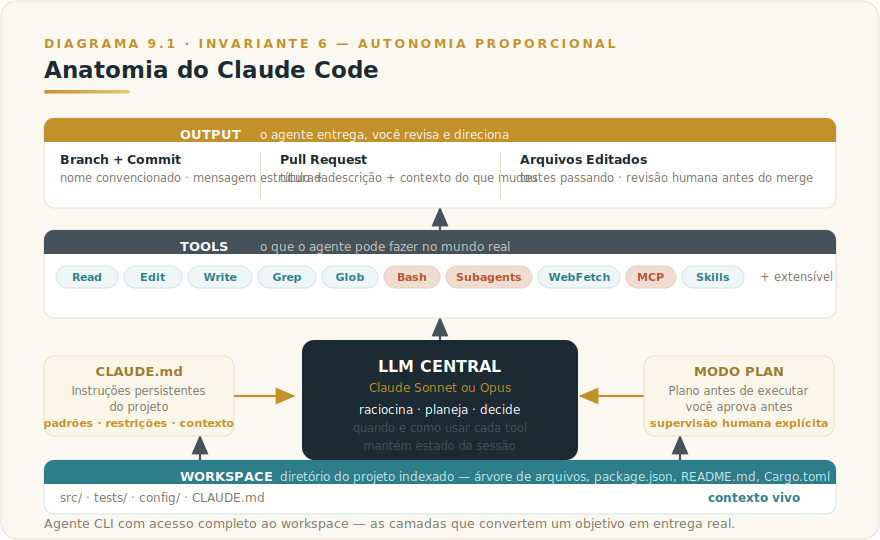
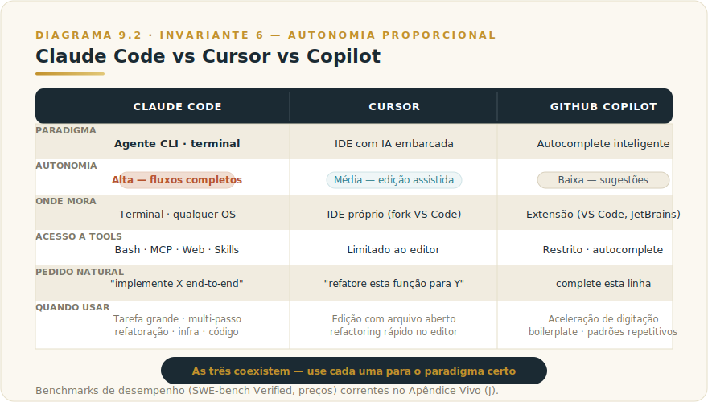
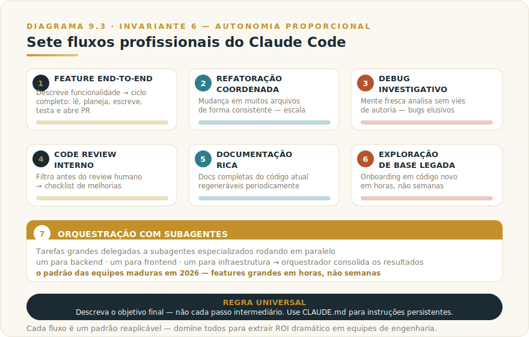
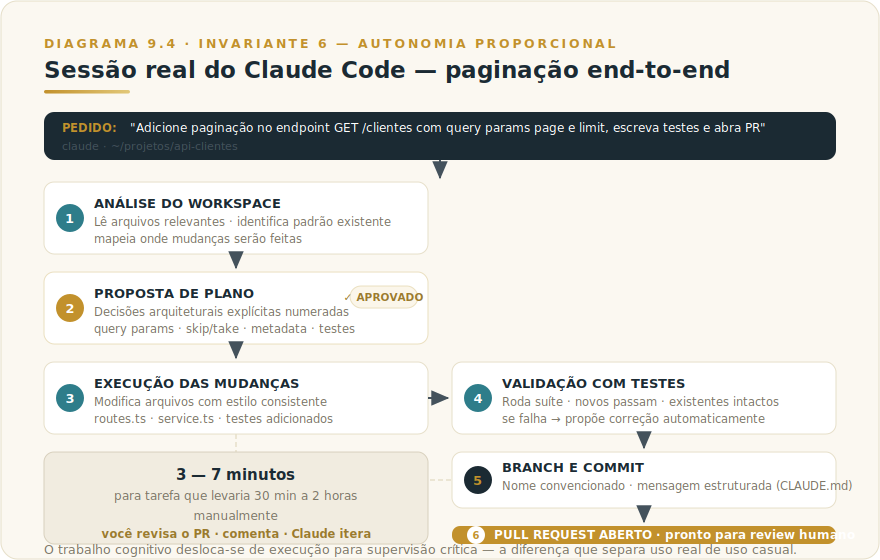

# CAPÍTULO 9
## CLAUDE CODE

---

> *"Claude Code não é mais um autocomplete bonito. É um agente de programação que pega tarefa, decompõe, executa, testa e entrega. A diferença é estrutural, não incremental."*

---

> 🧭 **Por que este capítulo é a aplicação do Invariante 6 — Autonomia Proporcional**
>
> Claude Code é o exemplo mais claro de autonomia proporcional aplicada à engenharia de software: agente que executa, humano que rastreia. Os níveis de autonomia (plan, edit, run) operacionalizam o F3 — AGENTE-PROP. O critério de calibração é direto — quanto menos você entende o que o agente fará a seguir, menos autonomia ele deve ter; quanto mais confiança você tem na cobertura de testes e nos ambientes de isolamento, mais latitude você concede. Isso não é filosofia: é a razão por que o Modo Plan existe.
> Invariante secundário: **Inv. 9 — Operador** (a competência de quem dirige amplifica ou degrada o agente pelo mesmo fator). Em Claude Code, isso se traduz na qualidade do CLAUDE.md: operador que escreve instruções vagas recebe output vago; operador que escreve restrições arquiteturais claras recebe output alinhado com o padrão do time.

---

## 9.1 — O CONCEITO INTUITIVO

Antes do Claude Code, ferramentas de IA para desenvolvimento operavam no paradigma "desenvolvedor faz, IA ajuda": Copilot sugere a próxima linha, Cursor edita o trecho que você está modificando. Em ambos os casos, você dirige cada passo.

Claude Code inverteu esse paradigma. Você descreve um objetivo — "implemente autenticação com Google OAuth, escreva testes e abra PR" — e o sistema executa tudo: planeja arquitetura, lê código existente, escreve e modifica arquivos, roda testes, comita, abre PR. Você revisa o resultado em vez de operar cada passo. A natureza do trabalho mudou de execução assistida para orquestração de execução.

Para quem adota com fluência, ganhos de 3x a 10x em produtividade são consistentemente relatados. Para quem ainda usa como autocomplete sofisticado, a ferramenta entrega valor moderado e perde a maior parte do que permite. Este capítulo é o que te dá entendimento para extrair o potencial real.

---

## 9.2 — ANALOGIA: O ESTAGIÁRIO QUE ENTREGA O TICKET COMPLETO

Dois tipos de assistente em uma equipe de engenharia. O primeiro olha por cima do seu ombro e sugere a próxima linha enquanto você digita — útil, mas você ainda dirige cada passo. Esse é o Copilot.

O segundo recebe um ticket fechado e entrega: "implemente endpoint de upload com validação de tamanho e tipo, logs estruturados, testes cobrindo cenários principais". Ele lê o código existente, propõe arquitetura, executa, testa, abre PR. Você revisa o conjunto e ele itera até merger. Esse é o Claude Code.

Os dois são úteis em situações diferentes. Copilot acelera linha por linha. Claude Code executa fluxos completos dirigidos por objetivo. Quem entende essa diferença distribui o trabalho conforme o perfil de cada ferramenta.

---

## 9.3 — EXPLICAÇÃO TÉCNICA

### 9.3.1 — A arquitetura do produto

Claude Code é, tecnicamente, um agente CLI que roda no seu terminal, com acesso completo ao workspace do projeto e a um conjunto rico de ferramentas. Os componentes principais são os seguintes.

> 📊 **Diagrama 9.1 — Anatomia do Claude Code**
>
> 
>
> *Agente CLI com workspace completo e ferramentas integradas.*

O **workspace** é o diretório do seu projeto, que Claude Code lê integralmente para entender o contexto. Quando você inicia uma sessão em um projeto, o sistema indexa a árvore de arquivos, identifica padrões de estrutura, lê arquivos de configuração principais (package.json, requirements.txt, Cargo.toml, etc.), e em alguns casos lê automaticamente arquivos de documentação como README.md. Tudo isso vira contexto que o modelo carrega durante a conversa.

O **LLM central** é tipicamente Claude Sonnet ou Opus, dependendo da configuração e do plano. Para tarefas mais simples, Sonnet entrega o equilíbrio de capacidade e custo. Para tarefas complexas com raciocínio arquitetural, Opus em modo extended thinking pode fazer diferença significativa. A escolha pode ser explícita por sessão.

As **tools disponíveis** formam o coração da capacidade prática do agente. Read lê qualquer arquivo do workspace. Edit modifica arquivos com precisão (substituição exata em vez de regenerar tudo). Write cria arquivos novos. Grep busca padrões no código com regex completo, usando ripgrep para velocidade. Glob encontra arquivos por padrão (src/**/*.tsx). Bash executa comandos no shell, permitindo rodar testes, instalar dependências, executar scripts, interagir com git, abrir pull requests via CLI do GitHub. Subagents permitem delegar subtarefas a agentes especializados rodando em paralelo. WebFetch baixa documentação online quando precisa. MCP conecta a qualquer servidor MCP configurado no sistema. Skills carregam habilidades específicas que você ou sua organização criou.

O **modo Plan** permite que Claude formule plano de ação detalhado antes de executar — mostrando o que pretende fazer, em quais arquivos vai mexer, que comandos vai rodar — antes de qualquer modificação real. Você aprova e ele executa, ou pede ajustes antes.

O arquivo **CLAUDE.md** na raiz do projeto é mecanismo poderoso para passar instruções persistentes sobre o projeto. Padrões de código adotados pela equipe, convenções de nomenclatura, comandos de teste, restrições de arquitetura, contexto sobre a empresa ou produto. Tudo que você escrever lá vira parte do contexto carregado em toda sessão dentro daquele projeto.

### 9.3.2 — Instalação e setup

Instalação via npm: `npm install -g @anthropic-ai/claude-code`. Após instalar, rode `claude` no terminal dentro de qualquer projeto, autentique com sua conta Anthropic e a sessão começa.

Configurações iniciais que valem o esforço: criar `CLAUDE.md` na raiz com contexto e regras; configurar `.claude/settings.json` com modelo padrão e permissões; conectar servidores MCP relevantes (banco de dados, GitHub, sistemas internos); integrar hooks e skills da equipe.

Para uso profissional consistente, trate CLAUDE.md e settings.json como infraestrutura versionada no Git — revisada como qualquer artefato técnico. Isso garante experiência consistente para todos no time.

### 9.3.3 — Comparação com alternativas

Vale entender com precisão como Claude Code se diferencia das principais alternativas em 2026.

> 📊 **Diagrama 9.2 — Claude Code vs Cursor vs Copilot**
>
> 
>
> *As três coexistem. Use cada uma para o paradigma certo.*

**Claude Code** é agente CLI, opera no terminal, executa fluxos completos com autonomia, tem acesso amplo a tools incluindo bash e MCP, com posição competitiva em benchmarks de engenharia de software como SWE-bench Verified (posição corrente no [Apêndice Vivo (J)](../04-apendices/L2-APX-J-apendice-vivo.md)). Custo incluído nos planos da plataforma (tiers e preços correntes no [Apêndice Vivo (J)](../04-apendices/L2-APX-J-apendice-vivo.md)). Forte para tarefas que envolvem múltiplos passos coordenados, sendo "implemente X end-to-end" o pedido natural.

**Cursor** é IDE com IA embarcada (fork do VS Code), opera em editor visual, autonomia média com edição IA assistida, modelo configurável entre Claude, GPT e outros. Preço e tier correntes no [Apêndice Vivo (J)](../04-apendices/L2-APX-J-apendice-vivo.md). Forte para edição IA dentro do editor, com chat embarcado, sugestões inline, refactoring rápido. Pedido natural é "refatore esta função para Y" enquanto você está com o arquivo aberto.

**GitHub Copilot** é extensão de autocomplete inteligente, opera em editores como VS Code e JetBrains via plugin, autonomia baixa com sugestões de próxima linha ou bloco, modelo proprietário. Preço corrente no [Apêndice Vivo (J)](../04-apendices/L2-APX-J-apendice-vivo.md). Forte para acelerar digitação de código, principalmente em código boilerplate e padrões repetitivos. Não exige briefing, sugere conforme você escreve.

Em organizações maduras, as três coexistem em fluxos diferentes. Copilot para autocomplete cotidiano. Cursor para edição IA assistida quando você está construindo algo no editor. Claude Code para tarefas grandes com autonomia, refatorações coordenadas, ou trabalho fora do editor (configuração, deploy, análise de logs).

### 9.3.4 — Quando usar Claude Code / quando EVITAR

A falha mais comum não é não usar Claude Code — é usar com autonomia alta nas situações erradas. O critério não é de funcionalidade (Claude Code consegue executar), é de risco (o que acontece quando ele erra?).

**Use Claude Code com autonomia alta quando:**
- A codebase tem cobertura de testes razoável e você consegue validar o que o agente entregou rodando `npm test` ou equivalente
- A tarefa é bem delimitada — refatoração consistente, migração de API, geração de documentação — sem efeito cascata imprevisível
- Você tem ambiente de staging ou branch isolada onde erros não causam dano de produção
- O objetivo final é suficientemente claro para que uma descrição objetiva capture a intenção sem ambiguidade

**EVITE autonomia alta quando:**
- A codebase não tem testes: Claude Code vai entregar código que parece certo, e você não tem rede de segurança para detectar a diferença
- O sistema é legacy frágil com dependências implícitas não documentadas: o agente opera no que consegue ler; acoplamento invisível não está no CLAUDE.md
- O domínio é regulado (finanças, saúde, jurídico) e modificações exigem revisão formal: o PR aberto pelo agente não substitui a etapa de compliance review
- A tarefa é exploratória e você ainda não sabe o que quer: Claude Code é ótimo em executar pedidos claros, ruim em adivinhar intenção vaga — nesses casos, itere no Web ou Desktop primeiro, depois traga o objetivo precisado para o Code

| Situação | Autonomia recomendada |
|----------|----------------------|
| Codebase com boa cobertura + staging | Alta — use Modo Plan e aprove |
| Codebase sem testes | Baixa — revise cada arquivo antes do commit |
| Sistema legacy com acoplamento oculto | Baixa — peça plano detalhado, execute arquivo por arquivo |
| Domínio regulado | Média — Code executa, humano revisa e valida conformidade |
| Objetivo ainda exploratório | Zero — defina primeiro, delegue depois |

> 🎯 **DA CADEIRA DO CTO**
> Antes de soltar um agente num repositório, exijo três condições não-negociáveis: cobertura de testes que me permita detectar regressão, um CLAUDE.md que documente restrições arquiteturais explícitas (o que não pode ser tocado, quais padrões são mandatórios, quais dependências são intocáveis), e um ambiente de staging onde o agente executa antes de qualquer merge para main. Sem essas três condições, a autonomia começa baixa e cresce conforme eu ganho evidência — não conforme o agente impressiona. O erro que vejo repetir em equipes que adotam cedo demais é confundir velocidade de entrega com qualidade de entrega. Agente que entrega rápido num repositório sem testes e sem instruções de arquitetura entrega rápido na direção errada. A minha régua: autonomia proporcional à minha capacidade de auditar o que foi feito — não à minha confiança de que vai dar certo.

> ⚠️ **POSTMORTEM — O agente que refatorou o que não devia**
> *O que tentaram:* um time de engenharia instruiu Claude Code a migrar componentes de uma biblioteca de UI para a versão nova. O pedido era amplo: "migre todos os componentes que usam a API antiga". O agente recebeu autonomia alta — sem Modo Plan, sem batches, sem revisão prévia.
> *O que deu errado:* o agente identificou corretamente os componentes-alvo mas, ao rastrear dependências transitivas, também tocou um módulo de autenticação que usava uma abstração da mesma biblioteca por razão diferente. A refatoração silenciosa quebrou um fluxo de login em produção que a suíte de testes não cobria. O incidente só foi detectado dois dias depois, por relato de usuário.
> *O Invariante violado:* Inv. 6 — Autonomia Proporcional (autonomia alta sem rede de segurança proporcional — sem testes cobrindo o módulo crítico, sem plano revisado antes da execução, sem batches que permitissem auditoria incremental).
> *O que teria evitado:* CLAUDE.md com restrição explícita para o módulo de autenticação, Modo Plan ativo com revisão do escopo antes de executar, e batches de no máximo 30 arquivos com PR separado — para que o primeiro batch revelasse o comportamento do agente antes de escalar o raio de impacto. Ver também: [Apêndice K — Os 9 Modos de Falha](../04-apendices/L2-APX-K-modos-de-falha.md) *(em elaboração)*.

---

## 9.4 — SETE FLUXOS PROFISSIONAIS

Sete padrões de uso aparecem repetidamente em equipes maduras — conhecê-los acelera adoção e calibra expectativa.

> 📊 **Diagrama 9.3 — Sete Fluxos Profissionais**
>
> 
>
> *Cada fluxo é um caso de uso que rende ROI dramático quando dominado.*

O primeiro é **feature end-to-end**. Você descreve uma funcionalidade nova, e Claude Code executa o ciclo completo, com leitura de código existente, planejamento da implementação, criação ou modificação de arquivos, escrita de testes, execução de testes, criação de branch, commit, abertura de pull request. "Implemente login social com Google OAuth, com testes cobrindo cenários principais, e abra PR" é o tipo de pedido que produz entrega completa em poucos minutos para tarefa que levaria horas manualmente.

O segundo é **refatoração coordenada**. Você tem mudança que afeta muitos arquivos de forma consistente, e fazer manualmente seria tedioso e propenso a erros. "Migre estes 30 componentes do padrão antigo para o novo, mantendo a API externa idêntica" é o tipo de pedido em que Claude Code brilha, executando a refatoração de forma consistente em todos os pontos.

O terceiro é **debug investigativo**. Você tem bug elusivo, talvez intermitente em CI, e precisa de mente fresca para investigar. "Investigue por que esse teste falha intermitente em CI" instrui Claude Code a ler o código relevante, examinar logs, executar reprodução local, e propor diagnóstico. Frequentemente identifica causas que humanos miram por viés de quem escreveu o código.

O quarto é **code review interno antes de pedir review humano**. Você terminou seu PR, sabe que tem coisas para melhorar, mas quer um filtro antes de chamar colega para revisar. "Revise este PR como senior engineer, apontando problemas de arquitetura, segurança, testes, e clareza". O resultado é checklist de melhorias que você implementa antes do review humano, elevando o nível do que seu colega vai ver.

O quinto é **documentação rica**. Documentação tende a ficar desatualizada em sistemas reais. "Documente toda esta API REST, com descrição de cada endpoint, parâmetros, exemplos de request e response, casos de erro" entrega documentação completa baseada no código atual. Pode ser regenerada periodicamente conforme o código evolui.

O sexto é **exploração de base legada**. Você entrou em projeto novo, ou em parte do código que você nunca tocou, e precisa entender rápido. "Me explique como funciona o módulo de pagamentos deste projeto, com fluxo de dados, dependências externas, e pontos de extensão". Onboarding em código legado, que costuma levar semanas, fica viável em horas.

O sétimo é **orquestração com subagentes**. Para tarefas grandes, Claude Code pode delegar subtarefas a subagentes especializados rodando em paralelo. Um para backend, um para frontend, um para infraestrutura. Cada um trabalha em seu domínio com tools apropriadas, e o orquestrador consolida os resultados. Esse é o padrão das equipes mais maduras em 2026, executando features grandes em horas em vez de semanas.

### 9.4.1 — Regra universal de uso

Existe uma regra que vale internalizar como reflexo profissional ao usar Claude Code. **Descreva o objetivo final, não cada passo intermediário.** Autocomplete pede instrução granular ("escreva linha que faz X"). Claude Code pede objetivo amplo ("entregue Y funcionando, com testes e PR aberto"). Quando você dá instrução granular ao Code, está usando ferramenta agêntica como se fosse autocomplete, e perde a maior parte da capacidade.

Combinada com essa regra, vale usar **CLAUDE.md** sistematicamente para passar instruções persistentes que não precisam ser repetidas a cada sessão. Padrões de código, convenções de nomenclatura, comandos de teste, restrições arquiteturais, contexto sobre o produto. Tudo que é estável vai para o arquivo, e tudo que é específico de uma sessão você passa no prompt inicial.

### 9.4.2 — Exemplo concreto de interação ponta a ponta

Para tornar palpável o que Claude Code entrega na prática, considere uma sessão real típica. Você é desenvolvedor em uma API de clientes, e o produto pediu paginação no endpoint GET /clientes com query params padronizados. Em ferramentas tradicionais isso levaria pelo menos uma hora. Com Claude Code, vira o que segue.

> 📊 **Diagrama 9.4 — Sessão Real do Claude Code**
>
> 
>
> *Mesmo pedido, executado de ponta a ponta em poucos minutos no terminal.*

Você abre o terminal no diretório do projeto, digita `claude`, e em seguida envia o pedido: *"Adicione paginação no endpoint GET /clientes com query params page e limit, escreva testes e abra PR".*

Claude executa a seguinte sequência de seis passos, sem intervenção sua.

**Passo 1 — Análise do workspace.** Lê os arquivos relevantes da estrutura do projeto, identifica o padrão de paginação que já existe em outros endpoints (caso exista), e mapeia onde mudanças precisarão ser feitas.

**Passo 2 — Proposta de plano.** Apresenta plano numerado com decisões arquiteturais explícitas. Adicionar query params com defaults sensatos, modificar service para usar skip/take do ORM, retornar metadata padronizada, adicionar testes cobrindo casos principais. Pede aprovação antes de modificar arquivos.

**Passo 3 — Execução das mudanças.** Após aprovação, modifica os arquivos identificados, mantendo estilo de código consistente com o resto do projeto, adicionando testes correspondentes.

**Passo 4 — Validação com testes.** Roda automaticamente a suíte de testes, valida que os novos testes passam, valida que os testes existentes não quebraram. Se algo falhasse, retornaria a propor correção.

**Passo 5 — Branch e commit.** Cria branch nova com nome convencionado, faz commit com mensagem estruturada seguindo padrão do time (se documentado em CLAUDE.md).

**Passo 6 — Pull Request.** Abre PR no GitHub via CLI, com título e descrição estruturada, inclui contexto do que mudou e por quê.

Tempo total típico: entre 3 e 7 minutos para tarefa que tradicionalmente leva entre 30 minutos e 2 horas. Você revisa o PR como revisaria qualquer outro, comenta o que precisa ajustar, e Claude itera. O trabalho cognitivo seu se desloca de execução para supervisão crítica.

> 💡 **INSIGHT**
>
> Note o que aconteceu nesse exemplo. Você não escreveu uma linha de código. Você descreveu o objetivo, aprovou um plano, revisou o PR. **A natureza do seu trabalho mudou de execução para direção.** Esse é o reflexo profissional que separa quem extrai valor real de Claude Code de quem ainda usa como autocomplete sofisticado.

---

## 9.5 — EXEMPLO MEMORÁVEL: A MIGRAÇÃO DE 3 SEMANAS QUE VIROU 2 DIAS

Uma startup brasileira de fintech precisou migrar 180 mil linhas de TypeScript de uma biblioteca de componentes para versão nova com API diferente. A estimativa inicial: três semanas com dois desenvolvedores — 240 horas-pessoa.

A senior eng. responsável decidiu testar uma abordagem alternativa num fim de semana prolongado. Configurou o setup cuidadosamente: CLAUDE.md detalhado com mapeamento explícito das mudanças de API, Opus em extended thinking com plano explícito antes de cada conjunto de mudanças, e instrução para trabalhar em branches separadas por módulo com PRs incrementais para ela revisar.

Sábado pela manhã, ela iniciou. O primeiro pedido foi "leia toda a base e identifique todos os componentes que usam a biblioteca antiga, classificando por complexidade de migração". O resultado, em cerca de quinze minutos, foi um documento estruturado com 312 componentes classificados em três tiers de complexidade, com estimativa de esforço para cada e identificação de bloqueadores potenciais.

Em seguida, instruiu Claude Code a executar a migração dos componentes do Tier 1 (mais simples, 218 componentes) em batches de 30, com PR aberto para cada batch. Para cada batch, o sistema lia os componentes, fazia as substituições necessárias respeitando o mapeamento, atualizava testes correspondentes, rodava a suíte de testes, e abria PR quando tudo passava. Quando algum teste falhava, propunha diagnóstico e tentativa de correção, alertando ela quando não tinha confiança suficiente.

Em cerca de seis horas de trabalho dela (revisando PRs sem precisar escrever código), os 218 componentes do Tier 1 foram migrados, com cerca de 89% passando direto e 11% precisando ajuste manual menor.

No domingo, ela atacou o Tier 2 (média complexidade, 76 componentes) com supervisão mais próxima, e o Tier 3 (alta complexidade, 18 componentes que envolviam casos específicos da API antiga sem equivalente direto), com Claude Code apresentando análise detalhada e ela tomando decisão de cada caso.

Na manhã de segunda-feira, antes do time chegar, ela tinha 312 componentes migrados, testes passando, e cerca de 20 PRs prontos para review do time. **O trabalho estimado em 240 horas-pessoa foi entregue em cerca de 16 horas de revisão e direcionamento dela.** O time, em vez de gastar três semanas em refatoração, gastou dois dias revisando os PRs e foi capaz de focar em features novas.

A lição estrutural não é sobre Claude Code substituir engenheiros — é sobre **redistribuição do trabalho cognitivo**. O trabalho de migração, antes intensivamente manual e tedioso, virou trabalho de design, supervisão e validação. Os engenheiros não fizeram menos trabalho importante; fizeram trabalho diferente, mais alto na cadeia de valor. **A produtividade não dobrou ou triplicou — mudou de natureza, e essa é a mudança que costuma transformar a economia de equipes inteiras quando bem absorvida.**

> 🎯 **PARA EXECUTIVOS**
> Equipes de engenharia que adotam Claude Code estruturadamente (com CLAUDE.md, com fluxos profissionais, com revisão integrada ao processo de PR) consistentemente reportam ganhos entre 30% e 200% em vazão de features em poucos meses. O investimento em treinamento e processo é trivial, o retorno é estrutural, e equipes que adotam tarde competem em desvantagem com as que adotam cedo.

---

## 9.6 — NA PRÁTICA: TRÊS APLICAÇÕES REPLICÁVEIS

Três aplicações que você pode rodar esta semana. Cada uma segue a forma *situação → o que fazer → o ponto de julgamento* — o ponto de julgamento é o que separa uso profissional de uso ingênuo.

**Aplicação 1 — Feature end-to-end com Modo Plan e revisão de PR.**
*Situação:* o produto pediu uma funcionalidade nova, você tem a especificação e a codebase tem cobertura de testes razoável. *O que fazer:* abra Claude Code no terminal do projeto; descreva o objetivo completo ("implemente X com testes cobrindo Y e Z, e abra PR"); peça o Modo Plan antes de qualquer modificação; leia o plano com atenção a quais arquivos serão tocados e quais testes escritos; aprove ou ajuste antes de executar; revise o PR com foco em comportamento e arquitetura, não em sintaxe. *O ponto de julgamento:* decida se o PR está pronto para merge — não baseado na confiança de que "o Claude fez", mas na revisão que você fez. O agente entregou; a aprovação para produção é sua, indelegável (Invariante 8). Se a codebase não tem testes suficientes para você detectar a diferença entre "parece certo" e "está certo", reduza a autonomia antes de começar.

**Aplicação 2 — Refatoração em batches com escalada de confiança.**
*Situação:* há uma mudança consistente que afeta muitos arquivos — migração de API, renomeação de padrão, atualização de biblioteca. *O que fazer:* escreva no CLAUDE.md o mapeamento exato da mudança (API antiga → API nova, convenção antiga → nova); instrua Claude Code a executar em batches de 20 a 30 arquivos com PR separado para cada batch; revise o primeiro batch com atenção máxima, arquivo por arquivo; só aumente o tamanho do batch seguinte se o primeiro passou sem surpresas. *O ponto de julgamento:* calibre o tamanho do batch pela sua capacidade real de revisão, não pela velocidade do agente. Autonomia proporcional (Invariante 6) aqui significa: quanto maior a sua confiança nos testes e na clareza do mapeamento, maior o batch que você pode aprovar com responsabilidade.

**Aplicação 3 — Debug investigativo sem viés de confirmação.**
*Situação:* há um bug elusivo que você já tentou diagnosticar sem sucesso, ou que aparece intermitentemente em CI. *O que fazer:* instrua Claude Code a investigar sem dar a hipótese que você já tem ("investigue por que esse teste falha intermitentemente em CI; não assuma a causa, leia os logs e o código relevante e apresente diagnóstico fundamentado"); compare o diagnóstico dele com o seu; execute a correção proposta somente depois de entender por que faz sentido. *O ponto de julgamento:* não aplique a correção porque "o Claude disse". Aplique porque você entendeu o diagnóstico e o considera fundamentado. Corrigir um sintoma sem entender a causa gera débito técnico invisível — o agente que opera rápido amplifica a velocidade de acumulação desse débito se o Operador não exercer julgamento (Invariante 9).

> 🔧 **EXERCÍCIO**
> Pegue uma tarefa técnica real — pode ser pequena — e rode a Aplicação 1 completa: Modo Plan, aprovação do plano, execução, revisão do PR. Ao terminar, escreva duas frases que o agente não escreveria por você: **o que você mudou no plano antes de executar** e **o que você encontrou na revisão do PR que o agente não antecipou**. Se não encontrou nada para mudar nem para ajustar, ou você teve muita sorte, ou não revisou com profundidade suficiente.

---

## 9.7 — LIMITAÇÕES E CUIDADOS

A primeira é **revisão humana continua sendo prerrequisito**. Claude Code é potente mas não infalível. Cada PR aberto precisa de review humano antes de merge — com foco em comportamento e arquitetura, não em sintaxe. Indispensável.

A segunda é **acesso a sistemas sensíveis**. Com acesso a bash, tools com efeitos no mundo e sistemas via MCP, Claude Code pode causar dano se mal instruído. Configure permissões com cuidado, use ambientes isolados e mantenha logs do que o sistema executa.

A terceira é **custos em tokens que escalem**. Sessões longas com Opus em extended thinking e múltiplos subagentes consomem tokens significativamente acima de conversas comuns. Instrumente e monitore em equipes grandes.

A quarta é **dependência crítica da qualidade do CLAUDE.md**. Sem instruções claras, o sistema opera com suposições genéricas. Equipes que investem no arquivo colhem retorno proporcional.

A quinta é **conhecimento de bibliotecas com corte de treino**. Para versões recentes, force consulta à documentação atual via WebFetch ou MCP.

---

## 9.8 — CONEXÕES COM OUTROS CAPÍTULOS

- 🔗 **Agentes como base técnica** → [Capítulo 12](../../Livro-1-Os-Invariantes/02-capitulos/L1-C12-agentes.md)
- 🔗 **MCP usado por Claude Code** → [Capítulo 13](../../Livro-1-Os-Invariantes/02-capitulos/L1-C13-mcp.md)
- 🔗 **AI Engineering como disciplina** → [Capítulo 14](../../Livro-1-Os-Invariantes/02-capitulos/L1-C14-ai-engineering.md)
- 🔗 **Modelos Claude e escolha entre Sonnet e Opus** → [Capítulo 4](L2-C04-modelos-claude.md)
- 🔗 **Claude Desktop como complemento** → [Capítulo 11](L2-C11-desktop.md)
- 🔗 **Claude Skills para especializar Claude Code** → [Capítulo 31](L2-C31-skills.md)
- 🔗 **Subagents em fluxos complexos** → [Capítulo 32](L2-C32-subagents-workflows.md)
- 🔗 **Repositórios GitHub para Claude Code** → [Capítulo 35](../../Livro-1-Os-Invariantes/02-capitulos/L1-C17-github-repos.md)

---

## 9.9 — RESUMO EXECUTIVO

| Conceito | Síntese |
|----------|---------|
| **Claude Code** | Agente CLI agêntico para programação, lançado em fevereiro de 2025 |
| **Paradigma** | Você descreve objetivo, sistema executa fluxo completo |
| **Tools** | Read, Edit, Write, Grep, Glob, Bash, Subagents, MCP, Skills, WebFetch, Plan |
| **CLAUDE.md** | Arquivo de instruções persistentes do projeto |
| **vs Cursor** | Claude Code é agente terminal, Cursor é IDE com IA embarcada |
| **vs Copilot** | Claude Code é agente, Copilot é autocomplete |
| **Sete fluxos** | Feature end-to-end, refatoração, debug, review, docs, exploração, orquestração |
| **Regra universal** | Descreva objetivo final, não passos intermediários |

---

## 9.10 — CHECKLIST DO CAPÍTULO

- [ ] Instalar Claude Code e executar primeira sessão em projeto real
- [ ] Criar CLAUDE.md cuidadoso para um projeto seu
- [ ] Aplicar pelo menos três dos sete fluxos profissionais
- [ ] Distinguir Claude Code de Cursor e Copilot, com escolha correta por situação
- [ ] Avaliar nível de autonomia adequado para cada codebase (cobertura de testes, staging, domínio)
- [ ] Configurar permissões adequadas para ambiente de trabalho
- [ ] Defender adoção estruturada para equipe técnica

---

## 9.11 — PERGUNTAS DE REVISÃO

1. Por que Claude Code é qualitativamente diferente de autocomplete?
2. Em que situação Cursor é melhor escolha que Claude Code?
3. Por que CLAUDE.md é peça crítica para uso profissional?
4. Como você configuraria Claude Code para uso seguro em produção?
5. Por que descrever objetivo final é diferente de descrever passos intermediários?
6. Quais duas condições de codebase tornam autonomia alta do Code um risco, e como mitigar cada uma?

---

## 9.12 — EXERCÍCIOS PRÁTICOS

### Exercício 1 — Setup completo com calibração de autonomia
Instale Claude Code em um projeto seu. Antes de começar, avalie: esse projeto tem testes suficientes para autonomia alta? Documente sua conclusão. Configure CLAUDE.md cuidadoso. Execute uma feature pequena end-to-end usando Modo Plan — aprove o plano antes de deixar executar. Registre onde o plano divergiu do que você esperava.

### Exercício 2 — Refatoração controlada com batches
Para uma refatoração consistente que sua equipe tem na lista, peça Claude Code que execute em batches de no máximo 30 arquivos com PR separado para cada batch. Revise o primeiro PR com atenção máxima. Se passar, aumente o tamanho dos batches seguintes. Documente o critério de escalada de confiança que você desenvolveu.

### Exercício 3 — Debug investigativo
Para um bug que sua equipe não consegue diagnosticar, instrua Claude Code a investigar sem dar a hipótese que você já tem. Compare o diagnóstico dele com o seu. Onde ele foi mais longe? Onde ficou aquém? Essa calibração melhora como você briefa sessões futuras.

### Exercício 4 — Comparação prática com critério de decisão
Faça a mesma tarefa em Cursor e em Claude Code. Ao final, não compare apenas velocidade — compare o tipo de atenção que cada ferramenta exigiu de você. Cursor exigiu execução granular? Code exigiu revisão estrutural? Esse mapeamento vai guiar qual ferramenta você escolhe em qual contexto.

---

## 9.13 — PROJETO DO CAPÍTULO

**Estabeleça Claude Code como ferramenta produtiva da sua equipe.**

Para uma equipe de engenharia (a sua ou simulada), defina o processo de adoção em três fases. Fase 1, setup técnico com CLAUDE.md por projeto e configurações de permissão. Fase 2, treinamento prático em fluxos selecionados aplicados a tarefas reais. Fase 3, integração ao processo de PR com revisão padronizada. Documente o protocolo, aplique em uma equipe real por quatro semanas, e meça impacto em vazão de tickets, qualidade de PRs e satisfação do time.

---

## 9.14 — VALIDAÇÃO UAU

| # | Critério | Você consegue? |
|---|----------|----------------|
| 1 | **Clareza** — Explicar Claude Code e a diferença para Cursor/Copilot em 90 segundos, usando a analogia do desenvolvedor júnior | ☐ |
| 2 | **Profundidade** — Defender, em discussão técnica com sênior, os sete fluxos profissionais e quando aplicar cada um | ☐ |
| 3 | **Decisão** — Dado um cenário de codebase sem testes em domínio regulado, explicar por que autonomia alta é risco e como reduzir (CLAUDE.md + Modo Plan + batches pequenos) | ☐ |
| 4 | **Aplicação** — Adotar Claude Code em um projeto real, com CLAUDE.md cuidadoso e critério de autonomia explícito, e medir ganho em duas semanas | ☐ |
| 5 | **Curiosidade UAU** — Está com vontade de entender Claude Desktop, o app nativo que desbloqueia automação de PC e MCP local | ☐ |

**5 de 5?** Avance. Você acaba de internalizar uma das ferramentas mais transformadoras da plataforma.
**3 ou 4?** Releia 9.5 (caso da migração) e 9.3.4 (quando evitar). É onde teoria vira produtividade responsável.
**Menos de 3?** O capítulo merece releitura prática, com Claude Code instalado em paralelo.

---

## 9.15 — REFERÊNCIAS PRINCIPAIS

📚 **Documentação oficial**

- [Anthropic — Claude Code](https://www.anthropic.com/claude-code)
- [Claude Code docs](https://docs.claude.com/en/docs/claude-code/overview)
- [Anthropic — Best practices for agentic coding](https://www.anthropic.com/engineering)

📚 **Repositórios e comunidade**

- [Claude Code (GitHub)](https://github.com/anthropics/claude-code)
- [Awesome Claude Code](https://github.com/hesreallyhim/awesome-claude-code)

---

🔗 **Próximo capítulo:** [Capítulo 10 — Claude Web](L2-C10-claude-web.md)

---

> *"Claude Code é agente, não autocomplete. A distinção não é técnica — é de postura: quem ainda o usa como autocompletar sofisticado compete no paradigma errado. Autonomia proporcional não é freio ao potencial da ferramenta; é a condição para que o potencial seja sustentável."*
