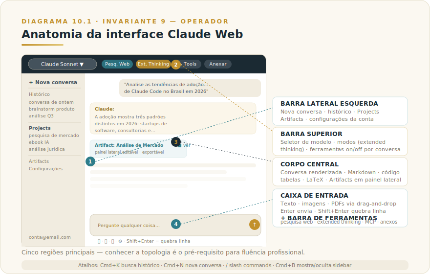
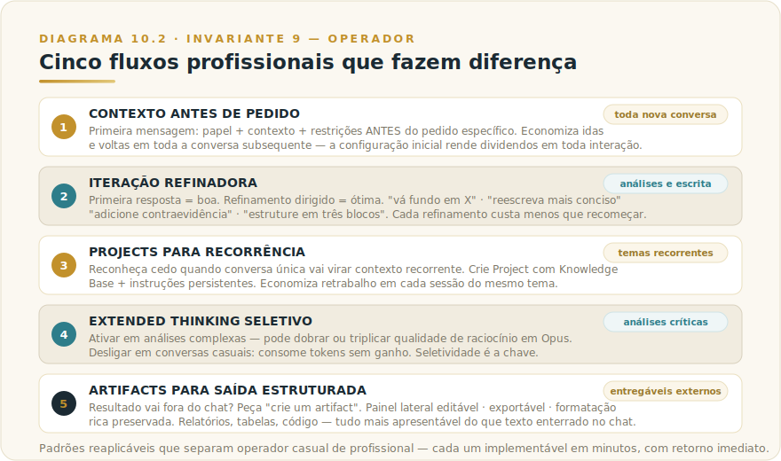

# CAPÍTULO 10
## CLAUDE WEB

---

> *"A interface mais usada é também a mais subutilizada. A maioria das pessoas conhece 10% do que ela oferece, e perde o resto por nunca explorar."*

---

> 🧭 **Por que este capítulo é a aplicação do Invariante 9 — Operador**
>
> Claude Web é onde o Invariante 9 se torna mais visível porque é a única interface em que a curva de aprendizado do Operador não tem onde se esconder. Não há código, não há configuração de servidor, não há arquitetura técnica — há apenas o que você pede, como você pede, e o que você faz com o resultado. A interface captura a competência do Operador em estado puro.
>
> Isso também explica por que a maioria dos usuários trava no nível 1 do Invariante: acessa a interface, faz perguntas pontuais, aceita a primeira resposta. A lacuna entre esse nível e o uso profissional — iteração refinadora, contexto estruturado, Projects, Artifacts, extended thinking seletivo — não é de acesso nem de funcionalidade. É de competência de operação. E competência de operação se adquire deliberadamente, não por uso passivo.
>
> A interface Web é onde essa aquisição acontece de forma mais direta. Dominar essa interface é, literalmente, dominar o Invariante 9 na prática.

---

## 10.1 — O CONCEITO INTUITIVO

A interface web do Claude, acessível em claude.ai, é provavelmente o ponto de entrada de mais de 90% das pessoas que conhecem a plataforma. É também, paradoxalmente, a interface que a maioria dos usuários explora menos profundamente, ficando na superfície de chat conversacional sem descobrir as camadas de produtividade que estão a um clique de distância. Conhecer bem essa interface é o que separa usuário casual, que tira valor moderado da ferramenta, do usuário profissional, que tira valor que justifica seu tempo dedicado.

Este capítulo é deliberadamente prático. Sem filosofia de IA: percorremos a interface com cuidado, identificamos cada região da tela, explicamos o que cada elemento faz e quais fluxos profissionais merecem ser internalizados. Ao terminar, você saberá o que existe em cada canto da interface e terá repertório de padrões que rendem ROI imediato no dia a dia.

A grande mudança que aconteceu entre 2023 e 2026 foi a evolução da claude.ai de "interface conversacional para um LLM" para "ambiente de trabalho integrado para uso profissional". Hoje a interface contém seleção de modelo, ferramentas como busca web e extended thinking, sistema de Projects com Knowledge Base persistente, Artifacts para saída estruturada, integração com MCP, configurações granulares de comportamento. Quem ainda usa apenas o campo de texto está deixando a maior parte da plataforma intocada.

---

## 10.2 — ANALOGIA: O ESCRITÓRIO QUE VOCÊ NUNCA EXPLOROU

Pense em uma empresa de coworking premium em que você assinou plano completo mas só usa uma mesa em um canto. Existem salas de reunião com videoconferência, biblioteca técnica especializada, área de café com mesas de discussão, sala de meditação, espaço de eventos, network de profissionais qualificados, eventos de aprendizado, ferramentas de produtividade integradas, serviços de impressão e digitalização, secretaria, suporte de TI. Você paga pelo conjunto inteiro, mas só usa uma mesa. Pessoas que conhecem o espaço e usam as várias camadas tiram retorno radicalmente superior pela mesma mensalidade.

Claude Web tem essa estrutura. A mesa onde você digita o prompt é apenas a entrada principal. Em volta dela há recursos que mudam fundamentalmente a forma como você trabalha com IA, mas que só rendem se você souber que existem e como usar. Este capítulo é o tour guiado pelo coworking, com cada sala identificada e seu propósito explicado, para que você decida quais incorporar ao seu fluxo profissional.

---

## 10.3 — EXPLICAÇÃO TÉCNICA

### 10.3.1 — Anatomia da interface

Cada região da interface principal, percorrida em sentido visual — porque conhecer a topologia é prerrequisito para usar com fluência.

> 📊 **Diagrama 10.1 — Anatomia da Interface Claude Web**
>
> 
>
> *Cinco regiões principais, cada uma com função específica.*

A **barra lateral esquerda** organiza navegação. Contém o botão de iniciar nova conversa, o histórico de conversas anteriores ordenadas por recência, a seção de Projects (que estudaremos a fundo no Capítulo 13), o acesso a Artifacts criados, e os ajustes da conta. Conversas antigas continuam acessíveis indefinidamente, e podem ser organizadas em pastas para quem opera em volume.

A **barra superior da janela de conversa** contém o seletor de modelo, com a possibilidade de alternar entre os tiers disponíveis (premium, balanceado e compacto — versões correntes no [Apêndice Vivo (J)](../04-apendices/L2-APX-J-apendice-vivo.md)) conforme a tarefa, e algumas ferramentas que serão detalhadas adiante. O seletor também expõe modos como extended thinking quando disponíveis para o tier escolhido.

O **corpo central** é onde a conversa acontece, com mensagens do usuário em uma cor e respostas de Claude em outra. Conteúdo é renderizado com formatação rica, com suporte a Markdown, código com syntax highlighting, tabelas, equações matemáticas em LaTeX, e diagramas em Mermaid quando apropriado. Artifacts gerados aparecem em painel lateral separado.

A **caixa de entrada na parte inferior** aceita texto plain, mas também colagem de imagens, PDFs, planilhas e outros arquivos via drag-and-drop. O botão de envio à direita dispara a mensagem, e a tecla Enter envia enquanto Shift+Enter faz quebra de linha.

A **barra de ferramentas contextual** apresenta, conforme o modelo selecionado e o plano da conta, botões para ativar pesquisa web, extended thinking, escolha de tools disponíveis via MCP, e anexar arquivos. Cada uma dessas ferramentas é capacidade que pode ser ligada ou desligada por conversa, e usá-las seletivamente é parte do fluxo profissional.

### 10.3.2 — Configurações que ninguém olha

Existem configurações importantes na claude.ai que a maioria dos usuários nunca abre, e que mudam significativamente o comportamento da plataforma. Vale conhecer as principais.

Em **Settings → Profile**, você pode preencher um campo de descrição pessoal que vira contexto persistente em todas as conversas. Algo como "sou Head de Tecnologia, prefiro respostas executivas em português, gosto de tabelas comparativas, evito emojis" muda imediatamente o tom de todas as conversas futuras. Esse campo é o equivalente a system prompt pessoal, e em poucos minutos de configuração rende dividendos em todas as interações posteriores.

Em **Settings → Appearance**, ajustes visuais como tema escuro ou claro, tamanho de fonte, layout compacto ou expandido. Pouco impacto profissional direto, mas importa em uso intenso.

Em **Settings → Privacy**, controles sobre uso dos seus dados para treinamento futuro do modelo. Em planos pagos, dados não são usados para treinamento por padrão, mas vale verificar.

Em **Settings → Workspace** (em planos Team e Enterprise), gestão de membros, permissões, faturamento centralizado, controles administrativos.

Em **Settings → Integrations**, conexão com servidores MCP, ativação de tools específicas, integração com sistemas corporativos via conectores oficiais.

A maioria dos usuários casual nunca abre nenhuma dessas seções. Profissionais maduros configuram cada uma deliberadamente.

### 10.3.3 — Atalhos e produtividade

Conhecer alguns atalhos de teclado economiza minutos por dia para quem usa Claude intensivamente. Os principais valem ser memorizados.

`Cmd/Ctrl + K` abre busca rápida no histórico de conversas, permitindo encontrar trechos específicos sem rolar a barra lateral. Funciona com busca semântica, não apenas palavras-chave.

`Cmd/Ctrl + N` inicia nova conversa, sem precisar clicar no botão na sidebar.

`Cmd/Ctrl + Shift + L` alterna o tema claro e escuro instantaneamente.

`Shift + Enter` quebra linha sem enviar a mensagem, útil para mensagens estruturadas com múltiplos parágrafos.

`/` em campo vazio abre menu de slash commands, com atalhos para tarefas comuns como iniciar Project, abrir Artifact, ativar tool específica.

`Cmd/Ctrl + B` esconde ou mostra a barra lateral, útil para ter mais espaço de leitura.

### 10.3.4 — Quando usar Web / quando EVITAR (e quando preferir outra interface)

A falha mais comum no uso da interface Web não é usar mal — é usar quando outra interface entregaria resultado muito superior. O critério de decisão não é de preferência pessoal, é de fit entre o tipo de trabalho e o que cada superfície oferece.

**Use Web quando:**
- A tarefa é predominantemente conversacional: escrita, análise, brainstorm, pesquisa, síntese de documentos
- Você está em dispositivo que não é o seu (computador de cliente, sala de reunião, viagem) — Web está disponível em qualquer browser, sem instalação
- Você quer Extended Thinking em análises complexas, com acesso fácil ao seletor de modo
- A saída vai virar Artifact: relatório, tabela comparativa, rascunho de documento — Artifacts ficam em painel lateral editável, e essa experiência é melhor no Web que em qualquer outra superfície

**Prefira Desktop quando:**
- A tarefa envolve arquivos locais do seu computador — no Web você precisa fazer upload manual; no Desktop o acesso é contínuo
- Você usa MCPs customizados que rodam na sua máquina (banco de dados local, sistema interno sem exposição na internet)
- Você quer Cowork mode: automatizar ações no seu sistema operacional, abrir apps nativos, organizar pastas

**Prefira Mobile quando:**
- Você está fora do computador e a tarefa é de tamanho médio-pequeno: preparação rápida para reunião, processar pensamentos em trânsito, capturar insight
- A entrada vai ser por voz ou câmera — essas modalidades só existem no mobile

**Prefira Claude Code quando:**
- A tarefa é de engenharia de software com objetivo claro: implemente, refatore, documente, abra PR — o agente CLI executa fluxos que o Web apenas conversa sobre

**Fique no Web (chat livre) e não crie Project quando:**
- A conversa é pontual e não se repetirá — criar Project com Knowledge Base para pergunta única é overhead sem retorno
- Você ainda está explorando o tema e não sabe quais documentos são relevantes — explore no chat livre primeiro, estruture em Project quando a recorrência ficar clara

| Tipo de tarefa | Interface ideal |
|---------------|----------------|
| Análise longa, escrita, pesquisa profunda | Web |
| Automação de PC, arquivos locais, MCP customizado | Desktop |
| Voz em movimento, câmera, janelas curtas | Mobile |
| Engenharia de software end-to-end | Claude Code |
| Trabalho recorrente com contexto fixo | Web + Project |
| Pergunta pontual sem recorrência | Web (chat livre) |

---

## 10.4 — CINCO FLUXOS PROFISSIONAIS QUE FAZEM DIFERENÇA

Cinco padrões de uso separam o operador casual do profissional, tirados de organizações maduras usando Claude em volume.

O primeiro fluxo é **contexto antes de pedido**. Em vez de mergulhar direto na pergunta, comece a conversa estabelecendo papel, contexto e restrições em uma primeira mensagem estruturada, antes de fazer o pedido específico. Algo como "vou trabalhar com você em uma análise estratégica para o conselho da minha empresa. Sou Head de Tecnologia, a empresa tem 800 funcionários no setor financeiro, e estou avaliando adoção de Claude Code. Em seguida vou te pedir análises específicas, com formato JSON quando aplicável. Vamos começar?". Essa configuração inicial economiza idas e voltas em toda a conversa subsequente.

O segundo é **iteração refinadora**. A primeira resposta de Claude geralmente é boa mas não ótima, e refinamento dirigido entrega ganho significativo. Em vez de aceitar a primeira versão, peça "refine", "vá fundo em X", "reescreva mais conciso", "estruture em três blocos", "adicione contraevidência". Cada refinamento custa muito menos que reiniciar e refazer, e a qualidade final supera o resultado de prompts longos iniciais.

O terceiro é **Projects para recorrência**. Quando você vai trabalhar com um tema por dias ou semanas, criar um Project específico com Knowledge Base e instruções persistentes economiza enorme retrabalho. Estudaremos Projects no Capítulo 13, mas o reflexo profissional é reconhecer cedo quando uma conversa única vai virar contexto recorrente.

O quarto é **extended thinking seletivo**. Ativar o modo de raciocínio estendido em análises complexas, e desligar em conversas casuais. Em Opus, extended thinking pode dobrar ou triplicar a qualidade da análise em problemas multifatoriais, mas usar em pergunta simples consome tokens sem ganho real.

O quinto é **artifacts para saída estruturada**. Quando o resultado vai ser usado fora do chat, em apresentação, documento, código que vai para repositório, peça explicitamente "crie um artifact". Artifacts ficam em painel lateral, são editáveis, podem ser exportados, e mantêm formatação rica em vez de ficar enterrados em mensagem de chat.

> 📊 **Diagrama 10.2 — Cinco Fluxos Profissionais**
>
> 
>
> *Padrões reaplicáveis que separam usuário casual de profissional.*

---

## 10.5 — EXEMPLO MEMORÁVEL: O CONSULTOR QUE TRIPLICOU OUTPUT EM SEMANAS

Um consultor estratégico brasileiro, atendendo clientes corporativos em projetos de transformação digital, começou a usar Claude no início de 2025 para acelerar trabalho de pesquisa e redação. No primeiro mês operou exatamente como a maioria dos usuários começa, com perguntas pontuais em conversas separadas, esperando "milagre" de prompts curtos, e ficando moderadamente impressionado com os resultados sem ainda extrair o potencial real.

Em fevereiro de 2025, depois de um workshop intensivo de uma semana sobre uso profissional de Claude, ele mudou radicalmente sua forma de operar. As mudanças foram pontuais mas se acumularam em transformação grande.

Primeiro, configurou o profile no settings com descrição executiva detalhada sobre como ele trabalha, suas áreas de expertise, suas preferências de formato. Cada conversa nova começava com Claude já calibrado para o tom certo, sem precisar reexplicar a cada conversa.

Segundo, criou Projects específicos para cada cliente em curso, com a Knowledge Base contendo briefings, materiais de research da empresa cliente, decisões anteriores tomadas, instruções persistentes sobre como abordar aquele cliente específico. Conversas dentro do Project começavam já com contexto completo carregado.

Terceiro, adotou rotina de iteração refinadora consistente, em que primeira resposta sempre era refinada com três ou quatro turnos de "vá fundo aqui", "estruture diferente", "adicione contraevidência", até o resultado ficar alinhado com o nível de qualidade esperado por seus clientes corporativos.

Quarto, começou a usar artifacts para todos os entregáveis estruturados, com decks, tabelas comparativas, frameworks de análise, sendo gerados como artifacts editáveis que ele exportava e refinava em ferramentas finais.

Quinto, adotou extended thinking em todas as análises estratégicas críticas, aceitando o custo adicional em troca de profundidade de raciocínio que diferenciava o trabalho dele de competidores.

O resultado, três meses depois das mudanças, foi notável em três dimensões. O **output mensal** triplicou aproximadamente, em horas faturáveis equivalentes de trabalho entregue, mantendo o mesmo número de horas trabalhadas. A **qualidade percebida pelos clientes** subiu, com vários comentando que o material entregue parecia produto de equipes maiores. E a **satisfação no trabalho** aumentou, porque ele passou menos tempo em trabalho mecânico (research básico, formatação) e mais tempo em análise estratégica e relacionamento com cliente.

A lição estrutural não foi sobre Claude — foi sobre o profissional. **A ferramenta era a mesma; o que mudou foi a competência de uso. Em poucas semanas de aprendizado deliberado, ele saiu de operação superficial para fluência profissional, e o retorno se materializou em receita e em qualidade de vida.** Qualquer profissional pode replicar essa mudança. A maioria não replica porque não dedica o tempo curto necessário para aprender a usar bem.

> 🎯 **PARA EXECUTIVOS**
> Treinamento intensivo em uso profissional de Claude para profissionais de conhecimento na sua organização costuma render entre 30% e 200% de aumento de produtividade individual, em poucas semanas. O investimento em horas de treinamento estruturado é trivial comparado ao ROI, e a maioria das empresas deixa esse ganho na mesa.

---

## 10.6 — NA PRÁTICA: TRÊS APLICAÇÕES REPLICÁVEIS

O exemplo anterior conta uma história; esta seção entrega o roteiro. Três aplicações que você pode rodar esta semana. Cada uma segue a mesma forma — *situação → o que fazer → o ponto de julgamento* — porque o passo a passo é replicável, mas é o ponto de julgamento que separa uso profissional de uso ingênuo.

**Aplicação 1 — Primeira mensagem de contexto antes de qualquer pedido.**
*Situação:* você tem uma análise complexa para fazer e vai precisar de vários turnos de conversa para chegar no resultado certo. *O que fazer:* antes de qualquer pergunta, escreva uma mensagem estruturada com papel, contexto e restrições — "Sou gerente de produto em fintech, vou trabalhar com você numa análise de priorização de roadmap para o próximo trimestre; prefiro respostas em português executivo, com tabelas quando houver comparação, sem emojis; vou enviar os dados em seguida". Depois envie os dados e o pedido. *O ponto de julgamento:* ao final da análise, verifique se Claude operou dentro do contexto que você definiu ou fez suposições que você não autorizou. O operador que investe dois minutos na primeira mensagem calibra toda a conversa; o que não investe passa o tempo restante corrigindo curso. A qualidade final é função direta da competência de quem configura — não da ferramenta (Invariante 9).

**Aplicação 2 — Iteração refinadora com critério de parada explícito.**
*Situação:* você tem um entregável em rascunho — análise, texto, framework — que está bom mas não ótimo. *O que fazer:* identifique o elemento mais fraco da resposta atual; peça refinamento específico nele ("o segundo argumento está genérico demais; reescreva com dados do Brasil e uma evidência contrária"); repita por no máximo três turnos; ao quarto turno, decida se o resultado justifica continuar ou se chegou no ponto de retorno decrescente. *O ponto de julgamento:* o critério de parada não é "quando o Claude não tiver mais sugestões" — é quando você, o Operador, julga que o documento está adequado à decisão que vai fundamentar. Iteração sem critério de parada é procrastinação disfarçada de rigor; iteração com critério é o Invariante 9 funcionando como deve.

**Aplicação 3 — Extended thinking seletivo para decisão de alto custo de erro.**
*Situação:* você tem uma análise estratégica ou decisão com múltiplas variáveis em que a primeira resposta parece razoável mas você suspeita que faltam nuances. *O que fazer:* ative extended thinking no seletor de modo; formule o pedido como problema de análise, não como pergunta de resposta rápida ("analise os trade-offs de adotar X versus Y para a nossa operação, considerando regulação BCB, custo de migração e risco de execução"); leia o raciocínio intermediário, não apenas a conclusão; questione os dois pontos que parecem mais frágeis. *O ponto de julgamento:* o extended thinking aumenta a profundidade do raciocínio do modelo — não substitui o seu. A conclusão do modelo é uma perspectiva bem construída, não uma aprovação. Quem usa extended thinking e aceita a conclusão sem questionar está pagando mais por uma resposta que trata da mesma forma que qualquer outra (Invariante 1 — o modelo erra com fluência igual em ambos os modos).

> 🔧 **EXERCÍCIO**
> Pegue uma tarefa real que você faria no Claude Web esta semana. Antes de começar, escreva a primeira mensagem de contexto (Aplicação 1) — papel, domínio, restrições de formato. Execute a tarefa com pelo menos dois turnos de refinamento. Ao terminar, escreva uma frase: **o que você mudou no resultado depois do primeiro rascunho e por quê**. Se a resposta for "nada", ou a tarefa era simples demais para precisar de refinamento, ou você não exerceu o julgamento que o Invariante 9 exige do Operador.

---

## 10.7 — CONEXÕES COM OUTROS CAPÍTULOS

- 🔗 **Engenharia de prompt para profile e conversas** → [Capítulo 9](../../Livro-1-Os-Invariantes/02-capitulos/L1-C09-engenharia-prompt.md)
- 🔗 **Context engineering aplicado em Projects** → [Capítulo 11](../../Livro-1-Os-Invariantes/02-capitulos/L1-C11-context-engineering.md)
- 🔗 **Modelos Claude e quando escolher cada um** → [Capítulo 4](L2-C04-modelos-claude.md)
- 🔗 **Projects em profundidade** → [Capítulo 13](L2-C13-projects.md)
- 🔗 **Artifacts e seus tipos** → [Capítulo 14](L2-C14-artifacts.md)
- 🔗 **Claude Desktop como complemento do Web** → [Capítulo 11](L2-C11-desktop.md)

---

## 10.8 — RESUMO EXECUTIVO

| Conceito | Síntese |
|----------|---------|
| **Interface principal** | Sidebar, top bar, corpo, input, barra de ferramentas |
| **Seletor de modelo** | Alternância entre tiers (versões correntes no Apêndice Vivo J) |
| **Settings** | Profile pessoal, integrações MCP, privacy, workspace |
| **Atalhos chave** | Cmd+K busca, Cmd+N nova, / slash commands |
| **Quando usar Web** | Conversa, análise, escrita, pesquisa, qualquer dispositivo, Artifacts |
| **Quando preferir outra** | Desktop (arquivos locais, MCP), Mobile (voz, câmera), Code (engenharia) |
| **Fluxo 1** | Contexto antes de pedido |
| **Fluxo 2** | Iteração refinadora |
| **Fluxo 3** | Projects para recorrência |
| **Fluxo 4** | Extended thinking seletivo |
| **Fluxo 5** | Artifacts para saída estruturada |

---

## 10.9 — CHECKLIST DO CAPÍTULO

- [ ] Identificar as cinco regiões principais da interface
- [ ] Configurar profile pessoal com descrição executiva
- [ ] Memorizar ao menos três atalhos de teclado
- [ ] Praticar os cinco fluxos profissionais em uso real
- [ ] Reconhecer quando iniciar Project versus continuar em chat
- [ ] Defender uso seletivo de extended thinking
- [ ] Aplicar o critério de decisão Web/Desktop/Mobile/Code a tarefas do trabalho real

---

## 10.10 — PERGUNTAS DE REVISÃO

1. Por que configurar o profile no settings rende dividendos em todas as conversas?
2. Quando criar um Project em vez de continuar uma conversa única?
3. Por que iteração refinadora é mais eficaz que prompts longos iniciais?
4. Em que situação extended thinking é desperdício?
5. Quando pedir artifact em vez de resposta em chat?

---

## 10.11 — EXERCÍCIOS PRÁTICOS

### Exercício 1 — Configuração profissional com medição de impacto
Configure o profile no settings com descrição executiva detalhada: sua função, área de expertise, preferências de formato, tom esperado. Use Claude por uma semana sem reexplicar contexto em nenhuma conversa. Ao final, compare três conversas da semana anterior (sem profile) com três da semana atual. Documente diferença concreta de alinhamento, não apenas sensação.

### Exercício 2 — Iteração refinadora com critério de parada
Pegue uma tarefa de análise complexa real. Faça o prompt inicial. Depois de cada resposta, identifique o elemento mais fraco e peça refinamento específico nele. Depois de quatro turnos, avalie: a qualidade final justificou os turnos extras? Qual turno trouxe o maior salto? Essa calibração ensina quando parar de refinar.

### Exercício 3 — Auditoria de interface com decisão de migração
Revise suas últimas dez conversas com Claude. Para cada uma, aplique o critério de 10.3.4: a tarefa estava na interface certa? Onde teria sido melhor em Desktop, Mobile ou Code? Documente duas tarefas que você vai migrar de interface a partir desta semana, com razão explícita.

### Exercício 4 — Artifact versus chat
Pegue um entregável real que você criaria no chat (análise, tabela, framework). Crie a mesma coisa pedindo explicitamente um Artifact. Compare a usabilidade: o Artifact ficou mais editável, mais exportável, mais apresentável? Se sim, adote como padrão para esse tipo de entregável.

---

## 10.12 — PROJETO DO CAPÍTULO

**Profissionalize seu uso pessoal do Claude Web.**

Em uma semana, aplique sistematicamente as cinco práticas. Configure profile detalhado. Crie ao menos dois Projects para temas recorrentes do seu trabalho. Use iteração refinadora em todas as tarefas complexas. Ative extended thinking em análises críticas. Use artifacts em todos os entregáveis estruturados. Ao final da semana, documente o ganho percebido em produtividade e qualidade. Esse projeto pequeno costuma render mudança duradoura no jeito de trabalhar.

---

## 10.13 — REFERÊNCIAS PRINCIPAIS

📚 **Documentação**

- [Claude.ai](https://claude.ai)
- [Anthropic — Getting started](https://docs.claude.com/en/docs/intro)
- [Anthropic — Tips and tricks](https://docs.claude.com/en/docs/build-with-claude/prompt-engineering/overview)

---

## 10.14 — VALIDAÇÃO UAU

| # | Critério | Você consegue? |
|---|----------|----------------|
| 1 | **Clareza** — Mostrar para um colega novato as cinco regiões da interface e suas funções | ☐ |
| 2 | **Decisão** — Dado um cenário concreto de tarefa, decidir se Web é a interface certa ou se Desktop/Mobile/Code entregaria mais — com critério explícito, não intuição | ☐ |
| 3 | **Profundidade** — Defender quais configurações de settings importam para uso profissional e por que o profile é system prompt pessoal | ☐ |
| 4 | **Aplicação** — Aplicar os cinco fluxos profissionais no seu trabalho cotidiano por uma semana completa | ☐ |
| 5 | **Curiosidade UAU** — Está com vontade de dominar Claude Projects, o componente que transforma sessões isoladas em colaboração contínua | ☐ |

**5 de 5?** Avance. Você acabou de subir vários degraus de fluência prática.
**3 ou 4?** Releia 10.5 (caso do consultor) e 10.3.4 (critério de decisão). É onde a interface vira produtividade.
**Menos de 3?** O capítulo merece releitura prática, com a interface aberta em paralelo.

---

🔗 **Próximo capítulo:** [Capítulo 11 — Claude Desktop](L2-C11-desktop.md)

---

> *"A interface mais usada é a mais subutilizada. Aprender a usar bem é investimento que se paga em semanas."*
