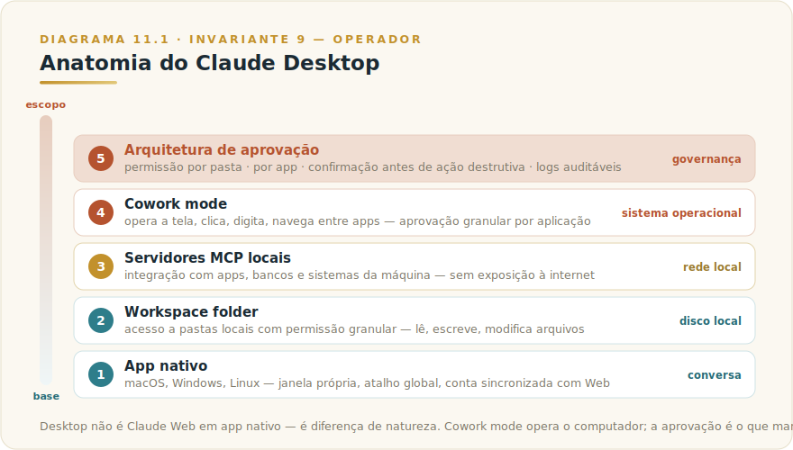
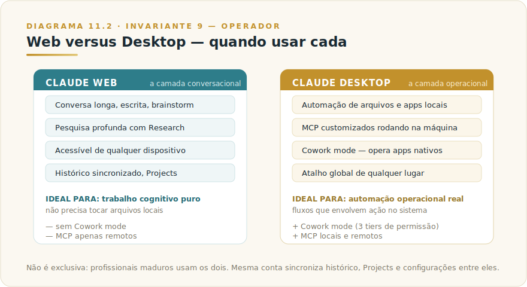

# CAPÍTULO 11
## CLAUDE DESKTOP

---

> *"Web é onde Claude conversa com você. Desktop é onde Claude opera o seu computador. A diferença muda o que se torna possível automatizar."*

---

> 🧭 **Por que este capítulo é a aplicação do Invariante 9 — Operador**
>
> Desktop é o ponto mais alto do espectro de delegação do Invariante 9. No Web, o Operador direciona — Claude responde em texto. No Desktop com Cowork mode, o Operador delega ações com efeito real no sistema operacional: Claude clica, digita, move arquivos, opera aplicações. Isso não é diferença de grau, é diferença de natureza. O Invariante 9 diz que a competência do Operador amplifica ou degrada o agente pelo mesmo fator; no Desktop, o fator de amplificação se aplica a ações no mundo físico do seu computador, não apenas ao texto na tela. A responsabilidade do Operador — o que autorizar, o que revisar, o que não delegar — fica proporcionalmente maior.

---

## 11.1 — O CONCEITO INTUITIVO

A versão Desktop do Claude, disponível para macOS, Windows e Linux, costuma ser descrita por usuários casuais como "Claude Web em app nativo", e essa descrição é tecnicamente correta mas profundamente incompleta. O Desktop oferece acesso à mesma interface conversacional, à mesma família de modelos, ao mesmo histórico de conversas e Projects sincronizados com a conta. Mas a diferença que importa, e que justifica instalar o app mesmo se você usa o Web intensivamente, está em três capacidades adicionais que apenas o Desktop entrega.

A primeira é **acesso direto a arquivos locais**, com Claude podendo ler, escrever, modificar arquivos em pastas específicas do seu computador que você concedeu permissão. Não é mais upload manual de arquivo um por um, é integração contínua com o sistema de arquivos local. A segunda é **conexão com servidores MCP locais**, que permite integrar Claude com aplicações, bancos de dados, ferramentas internas que rodam na sua máquina, sem necessidade de exposição via internet. A terceira é **Cowork mode**, capacidade que permite Claude ler tela do seu computador, clicar em interfaces, digitar em campos, controlar aplicações nativas como Finder, Notes, Apple Mail, com supervisão e aprovação granular.

Quando você entende essas três capacidades, percebe que o Desktop não é alternativa ao Web, é complemento que desbloqueia classes inteiras de uso impossíveis no navegador. Profissionais maduros operam com os dois, escolhendo conforme a tarefa.

---

## 11.2 — ANALOGIA: O ASSISTENTE QUE ENTRA NA SUA SALA

Pense na diferença entre dois modos de receber assistência profissional. No primeiro, você se conecta com um assistente competente por chamada de vídeo. Conversam, ele te ajuda a pensar, te dá conselhos, talvez você compartilhe a tela ocasionalmente para mostrar algo. A interação é rica, mas ele continua do outro lado da tela, sem poder mexer no que está aqui no seu lado.

No segundo, o mesmo assistente está fisicamente na sua sala, com acesso ao seu computador, aos seus arquivos, às suas ferramentas. Ele continua conversando com você, mas agora também consegue executar diretamente o trabalho operacional. "Organize esses cinquenta PDFs em pastas por cliente" deixa de ser pedido teórico e vira execução real, com ele clicando, organizando, renomeando. A mudança de natureza da assistência é qualitativa, e o tipo de problema que vira solucionável muda dramaticamente.

Claude Desktop com Cowork mode é exatamente essa segunda configuração. Continua oferecendo conversa, raciocínio e análise, mas adiciona a capacidade de operar diretamente no seu ambiente. Para muitos fluxos de trabalho, especialmente os que envolvem ferramentas locais, organização de arquivos, integração com apps nativos, essa adição é a diferença entre "Claude é ferramenta útil" e "Claude é parte da minha operação cotidiana".

---

## 11.3 — EXPLICAÇÃO TÉCNICA

### 11.3.1 — Anatomia do produto

Cada componente do Desktop, com cuidado — porque conhecer essa estrutura é o que torna o uso fluente.

> 📊 **Diagrama 11.1 — Anatomia do Claude Desktop**
>
> 
>
> *App nativo com acesso ao sistema local, MCP integrado e Cowork mode.*

O **app nativo** roda em macOS, Windows e Linux como aplicação tradicional, com janela própria, dock icon, atalhos de sistema. A interface principal espelha o Web em layout e funcionalidades visuais, mas opera com integração ao sistema operacional que browsers não oferecem.

A **conexão a servidores MCP locais** é configurada em arquivo de configuração do Desktop, localizado em pasta específica do sistema operacional (caminho corrente e formato no [Apêndice Vivo (J)](../04-apendices/L2-APX-J-apendice-vivo.md)). Esse arquivo é onde você declara quais servidores MCP o Desktop pode usar, junto com configurações de autenticação e parâmetros. Servidores oficiais como Filesystem (acesso a pastas locais), Memory (memória persistente), GitHub, Slack, Notion, e dezenas de outros podem ser conectados editando esse arquivo.

O **workspace folder** é mecanismo análogo ao do Claude Code, em que você concede acesso a uma pasta específica do seu computador, e Claude pode ler, escrever, modificar arquivos dentro dela durante a conversa. Diferente do Code que vive no terminal, aqui o acesso é da interface conversacional, e a permissão é por pasta com possibilidade de várias pastas simultaneamente, dependendo do plano.

O **Cowork mode** é a capacidade mais transformadora do Desktop. Quando ativado, Claude pode literalmente operar seu computador, lendo a tela via screenshots, identificando elementos visuais, clicando, digitando, navegando entre aplicações. Você concede permissão por aplicação ("Claude pode usar Finder", "Claude pode usar Apple Mail"), e cada interação fica registrada e auditável. Para uso seguro, há controles que impedem ações destrutivas sem confirmação humana, e configurações de quais apps são acessíveis.

A **arquitetura de aprovação** é parte central do design. Diferente do Web onde Claude é assistente puramente conversacional, no Desktop ele pode tomar ações com efeito real no seu sistema. Por isso, há múltiplas camadas de controle, com permissão por pasta de workspace, permissão por aplicação no Cowork, e em casos sensíveis confirmação explícita antes de executar. Esse controle existe não para limitar capacidade, mas para garantir que o controle de o quê é feito permanece com você.

### 11.3.2 — Cowork mode em profundidade

O Cowork mode merece aprofundamento: é a capacidade que mais surpreende usuários novos e a que mais expande o universo de tarefas automatizáveis.

A mecânica básica funciona da seguinte forma. Quando você instrui Claude a fazer algo que envolve aplicação específica, ele primeiro pede permissão para acessar essa aplicação. Você confirma, e a partir daí Claude pode tirar screenshots da tela, identificar elementos visuais via análise multimodal do modelo, clicar em coordenadas específicas, digitar texto, usar teclado. Para cada ação significativa, especialmente as que modificam estado, pode pedir confirmação.

Os tipos de aplicação aprovadas têm tratamento diferente conforme o risco, em hierarquia de três níveis (nomenclatura corrente no [Apêndice Vivo (J)](../04-apendices/L2-APX-J-apendice-vivo.md)). O nível de acesso completo, como Finder, Notes, Calendar, permite leitura e ação completa. O nível de clique, como editores de código e terminal, permite leitura e clique, mas bloqueia digitação direta para evitar mudanças não intencionais. Browsers ficam no nível de apenas leitura visual, com qualquer ação real precisando ser feita via Claude in Chrome (MCP do Chrome) que tem controles próprios. Essa hierarquia é parte do design de segurança.

Os casos de uso típicos que florescem com Cowork mode são surpreendentes em variedade. Organizar arquivos em pastas seguindo critérios complexos. Renomear lotes de arquivos baseado em conteúdo. Comparar versões de documentos em apps nativos. Coletar informações espalhadas em vários apps e consolidar em um relatório. Automatizar configurações repetitivas em System Preferences. Operar apps de produtividade como Notion, Things, OmniFocus quando o MCP não cobre o que você precisa. A criatividade do usuário define o limite, não a tecnologia.

**Quando NÃO ativar Cowork mode:**

A mesma capacidade que torna o Cowork mode poderoso o torna arriscado quando usado sem critério. Não ative em situações onde o erro tem custo alto de reversão.

- **Sistemas de produção sem ambiente de teste paralelo** — Cowork mode opera apps reais; se ele executa uma ação num sistema de produção sem staging, não há desfazimento
- **Dados altamente sensíveis sem política de retenção clara** — screenshots tirados pelo Cowork ficam processados pelo modelo; em ambientes regulados (saúde, finanças, jurídico), verifique compliance antes de conceder permissão
- **Apps com ações destrutivas de difícil reversão** — deletar arquivos, mover em lote, modificar configurações de sistema requerem confirmação explícita configurada; se você não configurou esse gatilho, não delegue tarefas que envolvam essas ações
- **Quando você não entende o fluxo que está autorizando** — delegue para Cowork mode apenas o que você conseguiria executar manualmente com confiança; se você não sabe o que a tarefa envolve, defina melhor antes de executar

### 11.3.3 — Web versus Desktop, quando usar cada

A escolha entre Web e Desktop não é exclusiva, é situacional. Os critérios são os seguintes.

> 📊 **Diagrama 11.2 — Web versus Desktop**
>
> 
>
> *Ambos têm seu lugar. Profissionais maduros usam os dois.*

**Web é ideal** para conversas longas de pensamento, escrita, brainstorm, pesquisa profunda com Research, qualquer trabalho que não precisa tocar arquivos locais. Acessível de qualquer dispositivo, mantém histórico sincronizado, não exige instalação. Para a maioria das interações cotidianas que envolvem só conversa, Web é o caminho.

**Desktop é ideal** para automação de PC com arquivos locais, integração com aplicações nativas, uso de servidores MCP customizados rodando em sua máquina, acesso rápido via atalho global. Para fluxos que envolvem operação real no seu sistema, Desktop é onde a mágica acontece.

Em prática, profissionais maduros operam com os dois. Conversa exploratória, escrita criativa, pesquisa profunda fica no Web. Automação operacional, manipulação de arquivos do trabalho, integração com sistemas internos fica no Desktop. A mesma conta sincroniza histórico, Projects e configurações entre eles, então não há fricção em alternar.

---

## 11.4 — EXEMPLO MEMORÁVEL: A AUTOMAÇÃO QUE LIBERTOU CINCO HORAS POR SEMANA

Um diretor de operações brasileiro, gerenciando uma operação de e-commerce com cerca de quarenta funcionários, tinha uma rotina chata mas crítica. Toda segunda-feira de manhã, dedicava cerca de cinco horas para consolidar relatórios da semana anterior. Os dados estavam espalhados em vários lugares, com extratos de meio de pagamento baixados como PDFs, relatórios de marketplaces em CSVs, planilhas de NF emitidas em pasta da nuvem, log de devoluções no sistema interno. O trabalho consistia em baixar tudo, abrir planilha mestre, copiar números de cada fonte, fazer conferência cruzada, gerar relatório consolidado para o time executivo.

Em janeiro de 2026, ele decidiu testar automação via Claude Desktop, depois de um podcast em que ouviu sobre Cowork mode. O processo de setup levou cerca de oito horas distribuídas em duas semanas, com instrução cuidadosa do que precisava ser feito em cada passo.

A solução final ficou estruturada assim. Domingo à noite, scheduled task em Claude (vamos ver no Capítulo 19) disparava o fluxo. Claude Desktop abria pasta de downloads, identificava extratos baixados na semana, lia cada PDF, extraía valores relevantes. Em paralelo, conectava ao MCP de Google Drive, abria as planilhas de NF, lia os números, validava integridade. Em seguida, abria o sistema interno via Cowork, navegava até o log de devoluções, copiava os números da semana. Consolidava todos os dados em planilha mestre, fazia cálculo de margem, gerava relatório executivo em Markdown com tabelas. Por fim, salvava o relatório em pasta específica e enviava notificação para o diretor avisando que estava pronto para revisão.

Toda segunda-feira de manhã, o diretor abria o relatório, fazia revisão de cerca de trinta minutos validando inconsistências (Claude sinalizava o que parecia anormal), e o material estava pronto para a reunião executiva. **A rotina de cinco horas virou rotina de trinta minutos, com qualidade igual ou superior, e o tempo liberado foi redirecionado para trabalho estratégico de fato.**

A lição estrutural não é sobre automação isolada — é sobre **mudança no tipo de trabalho que se faz**. Antes, o diretor consumia uma manhã inteira em trabalho mecânico distante de sua função real. Depois, esse trabalho fica feito sem ele, e ele dedica a segunda-feira ao que só ele consegue fazer: decisões estratégicas, conversas com o time, planejamento. **Cowork mode bem aplicado libera profissionais qualificados do trabalho mecânico que herdaram por falta de automação. Em escala organizacional, essa liberação compõe muito tempo de valor cognitivo elevado.**

> 🎯 **PARA EXECUTIVOS**
> Em qualquer organização há profissionais qualificados gastando porcentagens significativas do tempo em trabalho mecânico repetitivo que poderia ser automatizado com Claude Desktop. Identificar essas rotinas, calcular o tempo gasto, e investir em automação estruturada costuma render entre 5 e 20 horas por funcionário por mês recuperadas para trabalho estratégico. Esse cálculo, em escala de organização, vira retorno gigantesco.

---

## 11.5 — NA PRÁTICA: TRÊS APLICAÇÕES REPLICÁVEIS

O exemplo anterior conta uma história; esta seção entrega o roteiro. Três aplicações que você pode rodar esta semana. Cada uma segue a mesma forma — *situação → o que fazer → o ponto de julgamento* — porque o passo a passo é replicável, mas é o ponto de julgamento que separa uso profissional de uso ingênuo.

**Aplicação 1 — Consolidação de dados locais via workspace folder.**
*Situação:* você tem arquivos de trabalho em pastas locais — relatórios mensais, planilhas de acompanhamento, registros exportados de sistemas internos — e precisa de um documento consolidado regularmente. *O que fazer:* no Desktop, conceda acesso apenas à pasta específica que contém esses arquivos; descreva o entregável esperado com critério de seleção ("consolide os arquivos deste mês em um sumário executivo; ignore arquivos de rascunho com sufixo _v1"); ao receber o consolidado, verifique os números de maior impacto contra as fontes originais antes de usar o documento. *O ponto de julgamento:* o Desktop acessa os seus arquivos reais — o que errar ali erra na sua base de trabalho real. Verificar os números-chave não é desconfiança da ferramenta; é o exercício obrigatório de quem delegou resultado (não resposta) a um sistema que age, não apenas responde. A proporcionalidade entre verificação e impacto da decisão é o Invariante 9 materializado no seu sistema de arquivos.

**Aplicação 2 — Automação de rotina com Cowork mode e limites explícitos.**
*Situação:* você tem uma tarefa semanal que envolve abrir aplicativos, navegar, copiar dados de uma fonte e registrar em outra. *O que fazer:* antes de ativar Cowork mode, escreva em uma frase o critério de parada segura — "se o aplicativo X pedir senha ou autorização que não está no script, pare e me avise"; conceda permissão apenas para os aplicativos que a tarefa exige; acompanhe a primeira execução completa, passo a passo; só automatize sem supervisão depois de confirmar que o fluxo reproduz exatamente o que você faria manualmente. *O ponto de julgamento:* identifique qual passo da automação tem maior potencial de dano irreversível se errar — mensagem enviada ao destinatário errado, dado gravado no campo errado, arquivo movido para local indevido. Esse passo específico deve ter confirmação explícita configurada, independentemente do resto da automação funcionar bem. Cowork mode amplifica velocidade na mesma proporção em que amplifica o erro — e o Operador que não definiu os limites antes de começar descobriu apenas depois (Invariante 9).

**Aplicação 3 — Integração com MCP local para sistemas internos.**
*Situação:* você usa regularmente um sistema interno (banco de dados local, ferramenta de gestão, repositório interno) e precisa fazer perguntas sobre ele ou gerar relatórios a partir dos seus dados. *O que fazer:* configure o servidor MCP correspondente no arquivo de configuração do Desktop; teste com três pedidos de leitura antes de tentar qualquer operação de escrita; documente quais operações o MCP pode executar e quais estão fora do escopo que você autorizou. *O ponto de julgamento:* o MCP local é código que roda no seu sistema com as permissões que você concedeu. Antes de usar em produção, responda: se esse MCP executar uma operação não intencional, qual é o dano máximo possível? Se a resposta for "irreversível e alto", o escopo de permissão precisa ser reduzido antes do primeiro uso real. Escopo mínimo de acesso não é precaução excessiva — é o Invariante 6 traduzido para configuração de servidor.

> 🔧 **EXERCÍCIO**
> Mapeie uma rotina semanal sua que envolve abrir aplicativos e mover informações entre eles. Escreva, antes de automatizar: (1) quais aplicativos serão usados, (2) qual é o passo de maior risco de erro irreversível, (3) qual confirmação explícita você vai exigir nesse passo. Só execute a automação depois de ter as três respostas escritas. Se não conseguir preencher o item 2, a tarefa ainda não está definida com precisão suficiente para ser delegada com segurança.

---

## 11.6 — CUIDADOS DE SEGURANÇA

Os cuidados que separam uso responsável de uso displicente no Desktop — o produto tem acesso real ao seu sistema.

O primeiro é **escopo mínimo de permissão**. Conceda acesso apenas às pastas e apps que efetivamente serão usados. Não dê permissão indiscriminada a todo o sistema. A interface do Desktop facilita revogar acesso quando não é mais necessário.

O segundo é **revisão de servidores MCP instalados**. Cada servidor MCP é código que roda no seu sistema com acesso a dados que você concede. Use apenas servidores de origem confiável (oficiais da Anthropic, repositórios reconhecidos, empresas estabelecidas), e revise as permissões que cada um pede.

O terceiro é **dados sensíveis**. Mesmo com VPC e termos comerciais favoráveis, dados altamente sensíveis devem ser tratados com cuidado adicional. Para informação verdadeiramente crítica, considere se vale a pena que Claude processe.

O quarto é **logs e auditabilidade**. Em ambiente corporativo, registre o que Claude executa via Cowork mode, especialmente ações com efeito em sistemas operacionais. Em uso pessoal, manter consciência do que você autoriza.

O quinto é **confirmações para ações destrutivas**. Operações como deletar arquivos, mover em lote, modificar configurações de sistema, devem ter confirmação explícita antes de execução, mesmo dentro de aplicação aprovada.

---

## 11.7 — CONEXÕES COM OUTROS CAPÍTULOS

- 🔗 **MCP, mecanismo de integração** → [Capítulo 13](../../Livro-1-Os-Invariantes/02-capitulos/L1-C13-mcp.md)
- 🔗 **Agentes e Cowork como agente nativo** → [Capítulo 12](../../Livro-1-Os-Invariantes/02-capitulos/L1-C12-agentes.md)
- 🔗 **Claude Web e complementaridade** → [Capítulo 10](L2-C10-claude-web.md)
- 🔗 **Claude Code, agente CLI análogo** → [Capítulo 9](L2-C09-claude-code.md)
- 🔗 **Scheduled Tasks para automação periódica** → [Capítulo 19](L2-C19-scheduled-tasks.md)
- 🔗 **Skills que rodam no Desktop** → [Capítulo 31](L2-C31-skills.md)
- 🔗 **MCP corporativo em escala** → [Capítulo 29](L2-C29-claude-mcp.md)
- 🔗 **Segurança em IA** → [Capítulo 37](../../Livro-1-Os-Invariantes/02-capitulos/L1-C19-seguranca.md)

---

## 11.8 — RESUMO EXECUTIVO

| Conceito | Síntese |
|----------|---------|
| **Claude Desktop** | App nativo para macOS, Windows e Linux, com integração ao sistema |
| **Workspace folder** | Acesso a pastas locais com permissão granular |
| **MCP local** | Servidores MCP rodando no seu próprio computador |
| **Cowork mode** | Controle do PC com leitura de tela, cliques, digitação |
| **Tiers de aplicação** | Três níveis (completo / clique / leitura) por app — nomenclatura corrente no Apêndice Vivo J |
| **Quando usar Web** | Conversa, escrita, pesquisa, qualquer dispositivo |
| **Quando usar Desktop** | Automação, arquivos locais, apps nativos, MCP customizado |
| **Cuidados** | Escopo mínimo, MCPs confiáveis, dados sensíveis, logs, confirmação destrutiva |

---

## 11.9 — CHECKLIST DO CAPÍTULO

- [ ] Instalar Claude Desktop e configurar acesso a pelo menos uma pasta local
- [ ] Conectar pelo menos um servidor MCP local relevante para sua função
- [ ] Ativar Cowork mode e testar uma tarefa de organização de arquivos
- [ ] Aplicar o critério de quando NÃO usar Cowork mode ao seu ambiente de trabalho
- [ ] Configurar confirmação obrigatória para ações destrutivas no Desktop
- [ ] Distinguir com clareza os casos de uso Web versus Desktop
- [ ] Defender adoção de Desktop + Cowork mode para automação operacional real

---

## 11.10 — PERGUNTAS DE REVISÃO

1. Por que Desktop não é "Claude Web em app nativo"? Qual capacidade muda qualitativamente a natureza da assistência?
2. Em que situação um servidor MCP local é preferível a um MCP hospedado remotamente?
3. Por que Cowork mode é o caso mais alto do espectro de delegação do Invariante 9?
4. Quais dois cenários tornam o Cowork mode arriscado mesmo quando tecnicamente funcionaria?
5. Um profissional de operações quer automatizar consolidação de dados de três fontes distintas. Quais componentes do Desktop ele usaria, e em qual sequência?

---

## 11.11 — EXERCÍCIOS PRÁTICOS

### Exercício 1 — Setup de MCP local
Escolha um servidor MCP relevante para sua função (Filesystem, GitHub, Slack, ou outro). Configure no arquivo de configuração do Desktop. Teste com três pedidos reais. Documente o que funcionou e onde precisou ajuste.

### Exercício 2 — Automação de rotina com Cowork mode
Identifique uma rotina manual que você executa ao menos semanalmente e que envolve apps nativos do seu computador. Instrua Claude Desktop a executá-la com Cowork mode habilitado. Antes de executar, escreva explicitamente o critério de risco: é seguro delegar? Há ação destrutiva sem reversão fácil? Execute apenas se o critério estiver satisfeito.

### Exercício 3 — Comparação Desktop versus Web
Pegue uma tarefa que você faz normalmente no Web e que envolve arquivos do seu computador. Faça no Web (com upload manual) e depois no Desktop (com workspace folder). Compare fricção, tempo e qualidade. Documente para qual classe de tarefa a diferença é decisiva.

### Exercício 4 — Defesa interna
Esboce uma proposta de 10 minutos para sua equipe ou organização sobre uma automação operacional específica usando Desktop + Cowork mode. Inclua: a rotina atual (horas/semana), a automação proposta, os componentes necessários, os riscos e como mitigá-los, e o ROI esperado. Apresente para pelo menos uma pessoa.

---

## 11.12 — PROJETO DO CAPÍTULO

**Libere cinco horas mensais de trabalho mecânico da sua rotina.**

Mapeie as tarefas recorrentes da sua função que são predominantemente mecânicas — consolidar dados, organizar arquivos, compilar relatórios, preencher formulários, mover informações entre sistemas. Calcule o tempo total mensal. Escolha uma tarefa que some ao menos duas horas mensais. Construa automação usando Claude Desktop com a combinação de MCP e Cowork mode que fizer sentido. Execute por um mês com log de tempo. Compare o antes e o depois. Documente o que aprendeu sobre critério de delegação e riscos encontrados.

---

## 11.13 — VALIDAÇÃO UAU

| # | Critério | Você consegue? |
|---|----------|----------------|
| 1 | **Clareza** — Distinguir Web e Desktop para um colega não-técnico em 90 segundos, usando a analogia do assistente que entra na sala | ☐ |
| 2 | **Decisão** — Dado um cenário de automação, avaliar se é seguro usar Cowork mode ou se requer mitigação adicional | ☐ |
| 3 | **Profundidade** — Defender o uso de Cowork mode para automações operacionais reais, incluindo os cuidados de segurança | ☐ |
| 4 | **Aplicação** — Configurar Desktop com pelo menos um MCP local relevante e uma automação Cowork funcionando | ☐ |
| 5 | **Curiosidade UAU** — Está com vontade de entender Claude Mobile, a versão que torna IA presente nos momentos fora do desktop | ☐ |

**5 de 5?** Avance. Você acaba de desbloquear a superfície de maior potencial de automação do ecossistema.
**3 ou 4?** Releia 11.4 (caso do diretor de operações) e 11.3.2 (Cowork mode em profundidade). É onde a teoria vira automação real.
**Menos de 3?** O capítulo merece releitura prática, com o Desktop instalado e um MCP configurado.

🔗 **Próximo capítulo:** [Capítulo 12 — Claude Mobile](L2-C12-mobile.md)

---

> *"Desktop transforma Claude de assistente conversacional em operador do seu computador. Onde Web conversa, Desktop executa."*
