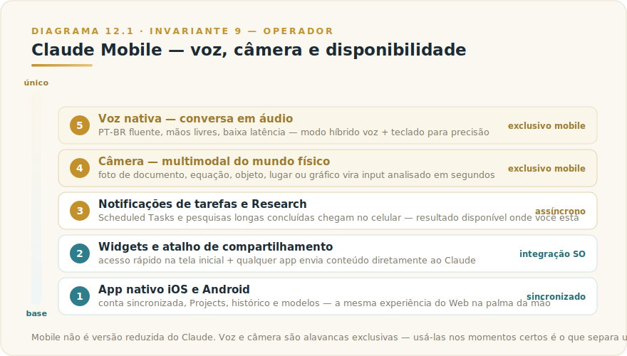
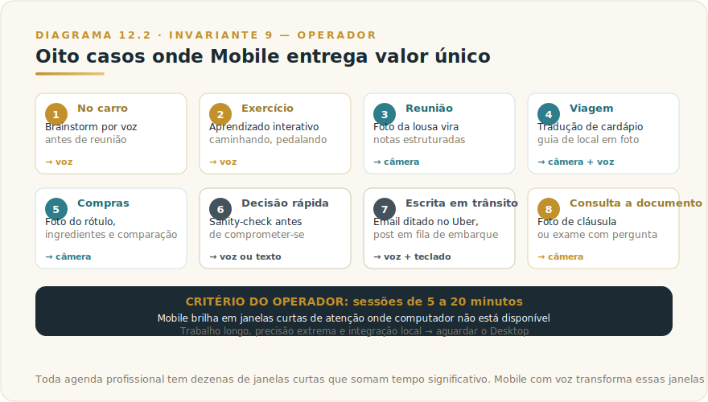

# CAPÍTULO 12
## CLAUDE MOBILE

---

> *"Mobile não é versão reduzida do Claude. É a interface onde a IA encontra você nos momentos em que o desktop não está, e em alguns deles é insubstituível."*

---

> 🧭 **Por que este capítulo é a aplicação do Invariante 9 — Operador**
>
> Mobile é a extensão do Invariante 9 ao tempo não-estruturado. No Web e no Desktop, o Operador opera de uma posição deliberada — sentado, tela aberta, contexto carregado. No Mobile, o Operador opera em movimento, com fragmentos de atenção, sem mesa, frequentemente com mãos ocupadas. Isso não reduz a capacidade do Operador — muda o tipo de competência exigida. O Operador profissional em Mobile sabe o que cabe em cinco minutos de carro, o que cabe em voz, o que deve aguardar o Desktop. Essa calibração — usar a superfície certa para o tipo de trabalho certo — é Invariante 9 aplicado ao tempo da vida real, não apenas ao tempo do escritório.

---

## 12.1 — O CONCEITO INTUITIVO

Usuários novos, especialmente os mais técnicos, tratam o mobile como "irmã menor" do Web — útil para consultas rápidas, mas nada sério. Essa leitura subestima o que mobile entrega e, principalmente, as situações em que ele entrega valor que nenhuma outra interface consegue.

O app, disponível para iOS e Android, sincroniza com sua conta: mesmo histórico, mesmos Projects, mesmo seletor de modelos, mesma busca web. Mas adiciona três alavancas exclusivas: **voz nativa fluente** (conversa em áudio com latência baixa), **câmera integrada** (análise multimodal do mundo físico), e **disponibilidade onde computador não existe** (carro, caminhada, reunião presencial, fila, viagem).

Para profissionais que entendem essas três alavancas, mobile vira parte integral da operação. Para os que ignoram, fica capacidade adormecida esperando ativação consciente.

---

## 12.2 — ANALOGIA: O COLABORADOR QUE ANDA COM VOCÊ

Um analista sênior excelente que só atende na sala dele, com horário comercial, é útil — mas limitado aos momentos em que você pode ir até lá. O mesmo analista com fone de ouvido, disponível por voz onde quer que você esteja, muda a natureza da colaboração. Você está dirigindo para reunião, quer pensar em voz alta: ele está lá. Sala de espera com cinco minutos vagos: ele está lá. A qualidade não mudou — o acesso virou contínuo.

Claude Mobile cumpre essa função: voz no carro, brainstorm caminhando, foto de algo para análise rápida, retomada de pensamento iniciado no Web. Para profissionais com agenda intensa, esse acesso compõe valor que não cabe em métricas simples.

---

## 12.3 — EXPLICAÇÃO TÉCNICA

### 12.3.1 — Anatomia do app

Os componentes principais do mobile — conhecê-los amplia o repertório de uso.

> 📊 **Diagrama 12.1 — Claude Mobile**
>
> 
>
> *Voz, câmera, sincronização e disponibilidade em qualquer lugar.*

A **interface principal** espelha o Web, com seletor de modelo no topo, conversa em corpo central, campo de entrada na base. A diferença visível é a posição prominente do botão de voz, geralmente em destaque ao lado do campo de texto, sinalizando a importância dessa modalidade no design.

O **modo voz nativo** é a capacidade mais transformadora do mobile. Quando você toca o botão de voz, entra em modo conversacional em áudio, falando com Claude e recebendo resposta vocal. A latência e a qualidade de reconhecimento de voz em português variam com a versão do app e a velocidade da conexão (métricas correntes no [Apêndice Vivo (J)](../04-apendices/L2-APX-J-apendice-vivo.md)) — em condições de conexão estável, o resultado é próximo de conversa natural. Pode ser usado como ditado para gerar texto, ou como conversa contínua para brainstorm e pensamento em voz alta.

A **câmera integrada** abre uso multimodal direto. Você toca o ícone da câmera, tira foto, e a imagem entra na conversa para análise. Pode ser foto de documento (Claude lê o conteúdo), foto de equação (Claude resolve), foto de objeto (Claude identifica), foto de lugar (Claude reconhece e contextualiza), foto de gráfico (Claude analisa). A qualidade da análise visual em modelos modernos é alta, e os casos de uso que aparecem com fluência são frequentemente inesperados.

O **atalho de compartilhamento** integra Claude com o sistema operacional do celular. Praticamente qualquer app moderno tem opção de "compartilhar", e Claude aparece como destino válido. Você está lendo um artigo no Safari, compartilha para Claude, e a conversa começa já com o conteúdo carregado. Mesma coisa para imagens da galeria, mensagens recebidas, vídeos, audios.

Os **widgets de tela inicial**, disponíveis em iOS e Android, permitem ações rápidas sem abrir o app inteiro. Conversa rápida, acesso a Project específico, retomada da última conversa, todos com um toque. Para uso frequente, esses widgets economizam segundos por interação que se acumulam ao longo do dia.

As **notificações** entram em jogo quando você usa Scheduled Tasks (veremos no Capítulo 19) ou Research profundo. Quando uma tarefa agendada termina ou um Research longo conclui, a notificação chega no celular, e você pode ver o resultado direto, sem precisar voltar ao computador.

### 12.3.2 — A voz como protagonista

O modo voz merece atenção especial: é onde o mobile entrega valor verdadeiramente único.

A voz funciona bem em situações de mãos ocupadas ou movimentação contínua. Dirigindo é o caso clássico, com você pensando em voz alta sobre o dia, sobre uma decisão pendente, sobre como abordar uma situação difícil. Claude escuta, responde com perspectivas, ajuda a estruturar pensamento. Em caminhadas longas vale o mesmo, com a vantagem adicional de que o movimento físico tende a destravar criatividade, e ter um interlocutor inteligente disponível amplifica esse efeito.

Voz também funciona bem para velocidade quando precisão exata não importa. Para gerar primeira versão de email rápido, para ditar ideias soltas que você quer registrar, para fazer pergunta exploratória sem precisar abrir laptop. Em situações em que abrir um app, digitar, esperar resposta tomaria meio minuto, voz resolve em dez segundos.

Onde voz **não** funciona bem é em situações que exigem precisão alta. Conteúdo técnico com nomes próprios que o reconhecedor pode errar, código de programação que precisa de sintaxe exata, edição cuidadosa de texto existente. Para essas, o teclado continua sendo melhor caminho.

Uma técnica que vale conhecer é o **modo híbrido**, em que você usa voz para o conteúdo principal e teclado para correções pontuais. Você dita um pedaço grande de pensamento, depois corrige nomes específicos via teclado, depois continua ditando. Esse híbrido captura o melhor das duas modalidades.

### 12.3.3 — Casos de uso onde mobile brilha

Os casos em que o mobile entrega valor que outras interfaces não conseguem replicar.

> 📊 **Diagrama 12.2 — Oito Casos de Uso no Mobile**
>
> 
>
> *Onde mobile entrega valor único, distinto de Web e Desktop.*

**Dirigindo no carro** é o caso paradigmático. Brainstorm sobre apresentação que será dada em algumas horas, pensamento sobre conversa difícil que terá adiante, resumo de podcast que está ouvindo, ditado de ideias para serem trabalhadas no escritório.

**Em exercício físico** funciona surpreendentemente bem, especialmente caminhada e bicicleta. Aprendizado interativo de tema específico, com Claude explicando e respondendo perguntas, é maneira de transformar 40 minutos de exercício em sessão produtiva sem prejudicar o exercício em si.

**Em reunião presencial**, foto da lousa ou flipchart vira input multimodal. Claude transcreve o conteúdo, organiza em estrutura, sugere próximos passos baseados no que foi discutido. Substitui notas manuais que ninguém revisa depois.

**Em viagem**, tradução de cardápio em foto, identificação de monumento, contextualização sobre lugar onde você está, são casos típicos. Para viagens internacionais, mobile com Claude vira guia personalizado.

**Em compras**, foto do rótulo de produto na prateleira, com pergunta sobre ingredientes, comparação com alternativa, validação de claim de marketing. Decisão de compra fica informada em tempo real.

**Em decisão rápida**, conversa de elevador antes de reunião, sanity-check em decisão tomada minutos atrás, segunda opinião pré-comprometimento. Mobile cabe nos espaços entre compromissos que computador não consegue ocupar.

**Em escrita em trânsito**, ditar email completo no Uber, escrever post LinkedIn em fila de embarque, redigir mensagem importante caminhando para casa. Mobile transforma momentos "perdidos" em tempo produtivo.

**Em consulta a documento**, foto de cláusula contratual com pergunta sobre o significado, foto de exame médico com pedido de explicação, foto de regulamento com pergunta específica. Acesso imediato a interpretação especializada.

### 12.3.4 — O que muda tecnicamente no Mobile

Mobile não é apenas "o mesmo Claude em tela menor". Há diferenças técnicas que afetam como você trabalha, e conhecê-las evita frustração.

**Contexto fragmentado é a realidade, não a exceção.** No Desktop ou Web, você geralmente chega com tempo para contextualizar. No Mobile, você tem 30 segundos antes da reunião ou 8 minutos no Uber. O reflexo profissional é ter Projects configurados com contexto pré-carregado para os temas recorrentes: quando você inicia uma conversa dentro de um Project no mobile, o contexto já está lá — você não precisa reexplicar. Sem Projects, você perde a maior parte do tempo útil em recontextualização.

**Câmera versus upload de imagem têm qualidade equivalente, mas casos de uso diferentes.** A foto tirada na hora captura o objeto no contexto real — você está na rua, viu algo, fotografou para análise imediata. O upload de imagem da galeria dá mais controle de enquadramento e qualidade. Para análise de documentos impressos, documentos de texto ou gráficos complexos, tirar a foto com enquadramento cuidadoso e boa iluminação faz diferença real na qualidade da análise. Em ambientes com pouca luz ou ângulo ruim, o resultado degrada — mova para o Web com upload se precisar de análise precisa.

**Reconhecimento de voz em português degrada em condições específicas.** Os casos problemáticos são previsíveis: ambiente com ruído de fundo acima de conversação normal (transporte público lotado, evento, cozinha), vento direto no microfone, pronúncia de nomes próprios não-usuais, termos técnicos de nicho, números longos (CPF, CNPJ, CEP). Para esses, use teclado ou confirme oralmente após a transcrição. O modo híbrido — ditar o conteúdo e corrigir pontos específicos via teclado — captura o melhor das duas modalidades sem comprometer precisão onde ela importa.

**Sincronização com Web e Desktop é automática mas tem lag de segundos.** Conversas iniciadas no mobile aparecem no Web em segundos, não milissegundos. Em fluxos onde você começa no mobile e continua no Desktop, não feche o app antes de enviar a última mensagem — a sincronização acontece no envio, não em tempo real de digitação.

**Bateria e conexão limitam sessões longas.** Sessões de voz de mais de 20 minutos, especialmente com modelo premium ativo, consomem bateria e dados significativamente. Para trabalho longo, prefira Web no computador. Mobile brilha em sessões de 5 a 20 minutos — esse é o espaço onde ele é insubstituível.

---

## 12.4 — EXEMPLO MEMORÁVEL: A HORA DO TRÂNSITO QUE VIROU ESCRITÓRIO

Um diretor comercial em São Paulo tinha duas horas diárias perdidas no trânsito — tempo que precisava para preparar ou processar reuniões, mas sem computador disponível. Chamadas telefônicas pontuais eram a única saída.

Em meados de 2025, começou a experimentar Claude Mobile com voz nos deslocamentos. Algumas semanas de adaptação para aprender a estruturar pensamento em voz alta, descobrir o que funcionava ditado e o que exigia tela. Em dois meses, tinha fluxo que mudou sua produtividade diária.

Antes de cada reunião importante, ele usava cerca de quinze minutos no carro ditando "vou ter reunião com o CEO da empresa X em meia hora. O contexto é Y, o objetivo principal é Z, e eles têm preocupação sobre W. Me ajude a pensar em três pontos que devo enfatizar, dois riscos a antecipar, e uma pergunta de abertura que demonstre que entendo o problema deles". Claude respondia por voz, ele escutava, fazia perguntas adicionais, refinava. Quando chegava à reunião, tinha estrutura mental clara sem ter aberto laptop em momento algum.

Depois das reuniões, voltando ao escritório ou para casa, ele usava outros quinze ou vinte minutos processando o que tinha acontecido. "A reunião com cliente X correu assim e assim, ele mencionou pontos A, B e C, e a decisão ficou em aberto sobre D. Me ajude a estruturar email de follow-up, com pontos de ação claros, e prazo sugerido para próxima conversa". Claude estruturava, ele refinava por voz, e ao chegar no destino tinha rascunho pronto que ele finalizava em três minutos no celular antes de enviar.

Em seis meses, a hora morta virou 90 minutos diários de trabalho cognitivo de qualidade. Em escala anual: mais de 300 horas adicionais de trabalho qualificado, quase dois meses úteis de produtividade extra, sem aumentar horas trabalhadas.

A lição não é sobre dirigir e trabalhar — é sobre **IA como amplificador de momentos previamente improdutivos**. Toda agenda tem janelas curtas em que o computador não está disponível. Mobile com voz transforma essas janelas em pensamento estruturado. **Quem descobre esse uso ganha vantagem competitiva sutil e durável.**

> 🎯 **PARA EXECUTIVOS**
> Se você passa tempo significativo em situações de mãos livres mas mente disponível (dirigindo, caminhando, esperando), Claude Mobile com voz é provavelmente a alavanca de produtividade individual mais subutilizada do seu portfolio. Investir uma semana adaptando seu fluxo a essa modalidade costuma render dezenas de horas mensais de tempo produtivo recuperado.

---

## 12.5 — NA PRÁTICA: TRÊS APLICAÇÕES REPLICÁVEIS

Três aplicações que você pode rodar esta semana. Cada uma segue a forma *situação → o que fazer → o ponto de julgamento* — o ponto de julgamento é o que separa uso profissional de uso ingênuo.

**Aplicação 1 — Preparação de reunião por voz no deslocamento.**
*Situação:* você tem uma reunião importante em menos de uma hora e está no carro, no metrô ou a pé. *O que fazer:* abra o Project do cliente ou tema no mobile (com Knowledge Base já carregada); ative o modo voz; fale o contexto resumido e o objetivo da reunião; peça três pontos para enfatizar, dois riscos para antecipar e uma pergunta de abertura que demonstre que você entende o problema do outro lado; escute a resposta; faça uma ou duas perguntas de refinamento por voz. *O ponto de julgamento:* quando chegar à reunião, você opera com a estrutura que o Claude ajudou a organizar — mas o julgamento de quais dos três pontos priorizar, que tom usar, e o que deixar de fora é seu. O mobile entrega a preparação mais rápido; a leitura da sala na hora é indelegável. O Operador que chega com estrutura pronta mas rígida usa a ferramenta como muleta; o que chega com estrutura pronta e flexível usa como alavanca (Invariante 9).

**Aplicação 2 — Captura e estruturação de reunião presencial via câmera e voz.**
*Situação:* você está numa reunião presencial e a lousa, o flip chart ou um documento físico registra decisões e próximos passos. *O que fazer:* ao final da reunião, fotografe o conteúdo registrado; abra Claude no mobile; envie a foto e peça "transcreva e organize em três blocos: decisões tomadas, próximos passos com responsável e prazo, e questões em aberto"; dite via voz qualquer contexto que não está na imagem; ao chegar ao computador, revise e envie o follow-up. *O ponto de julgamento:* confira se os responsáveis e prazos foram capturados com precisão — esse é o ponto onde erro tem consequência real para outras pessoas. A câmera captura o que estava registrado; o que foi dito oralmente e não anotado depende da sua memória, não da foto. O Operador que entrega o follow-up sem verificar esses pontos transfere o risco para os colegas (Invariante 8).

**Aplicação 3 — Processamento de pensamento em trânsito para entregável no computador.**
*Situação:* você está fora do escritório e tem um pensamento, insight ou rascunho mental que quer desenvolver, mas o computador não está disponível agora. *O que fazer:* abra Claude mobile e dite o pensamento de forma livre — não se preocupe com estrutura, fale como se estivesse pensando em voz alta; peça ao Claude que organize em estrutura provisória (tópicos, argumentos, próximos passos); dite adendos e correções; ao chegar no computador, acesse a conversa no Web (sincronizada) e refine o material. *O ponto de julgamento:* o mobile capturou e organizou o pensamento; o julgamento de quais partes têm substância e quais são ruído ainda é seu — e esse julgamento é mais fácil de exercer no computador, com distância e tempo. A armadilha é achar que porque o rascunho ficou organizado ele está pronto. Organizado é o começo da revisão, não o fim (Invariante 1 — plausibilidade não é veracidade nem qualidade).

> 🔧 **EXERCÍCIO**
> Na próxima semana, use o modo voz do mobile para preparar uma reunião (Aplicação 1) ou processar algo depois dela (Aplicação 2). Ao terminar, escreva em uma frase: **o que você alterou ou descartou do que o Claude sugeriu antes de usar o material de verdade**. Se não alterou nada, examine se o pedido foi específico o suficiente ou se o julgamento que era seu foi omitido sem perceber.

---

## 12.6 — LIMITAÇÕES E QUANDO NÃO USAR

Os casos em que o mobile **não** é a interface certa.

A primeira é em **trabalho longo e cuidadoso**. Documentos extensos, código de programação detalhado, análises com muitas referências cruzadas, ficam melhor em Web ou Desktop. Mobile é para começar, pensar, esboçar, não para entrega final cuidadosa.

A segunda é em **integração com sistemas locais**. Mobile não tem acesso a arquivos do seu computador, não tem Cowork mode, não conecta a servidores MCP locais. Para esses, Desktop é o caminho.

A terceira é em **uso quando precisão extrema importa**. Voz pode errar transcrição de nomes específicos, números técnicos, termos pouco comuns. Em decisão crítica, prefira teclado.

A quarta é em **ambientes barulhentos**. Voz funciona mal em locais com muito ruído de fundo, com vento, em transporte público lotado. Reconhecimento degrada, e a experiência piora.

A quinta é em **tarefas que dependem de múltiplas janelas**. Mobile mostra um app por vez, e tarefas que exigem alternar entre Claude e outros apps frequentemente ficam mais eficientes em computador.

---

## 12.7 — CONEXÕES COM OUTROS CAPÍTULOS

- 🔗 **Modelos Claude e seletor mobile** → [Capítulo 4](L2-C04-modelos-claude.md)
- 🔗 **Claude Web e sincronização** → [Capítulo 10](L2-C10-claude-web.md)
- 🔗 **Projects sincronizados** → [Capítulo 13](L2-C13-projects.md)
- 🔗 **Claude Desktop e complementaridade** → [Capítulo 11](L2-C11-desktop.md)
- 🔗 **Claude Voice em profundidade** → [Capítulo 18](L2-C18-voice.md)
- 🔗 **Scheduled Tasks com notificações** → [Capítulo 19](L2-C19-scheduled-tasks.md)

---

## 12.8 — RESUMO EXECUTIVO

| Conceito | Síntese |
|----------|---------|
| **Claude Mobile** | App nativo iOS e Android sincronizado com conta |
| **Voz nativa** | Conversa em áudio com latência baixa, PT-BR fluente |
| **Câmera** | Análise multimodal de fotos do mundo físico |
| **Atalho de compartilhar** | Integração com qualquer app via menu nativo |
| **Widgets** | Tela inicial com acesso rápido |
| **Quando brilha** | Mãos ocupadas, mundo físico, momentos curtos |
| **Quando evitar** | Trabalho longo, precisão extrema, integração local |

---

## 12.9 — CHECKLIST DO CAPÍTULO

- [ ] Instalar Claude Mobile (iOS ou Android) e sincronizar conta
- [ ] Configurar pelo menos dois Projects para temas recorrentes do trabalho — acesso rápido no mobile
- [ ] Testar modo voz em pelo menos três situações diferentes (carro, caminhada, sala de espera)
- [ ] Usar câmera para análise de documento real (contrato, cardápio, equação, gráfico)
- [ ] Mapear janelas diárias improdutivas que mobile poderia recuperar
- [ ] Aplicar o critério de quando NÃO usar mobile (trabalho longo, precisão extrema, integração local)
- [ ] Configurar widget de acesso rápido na tela inicial

---

## 12.10 — PERGUNTAS DE REVISÃO

1. Por que Projects configurados com Knowledge Base são especialmente importantes no Mobile?
2. Em quais condições o reconhecimento de voz em português degrada, e qual é a alternativa em cada caso?
3. Qual é a diferença prática entre usar câmera no momento e fazer upload de imagem da galeria? Em que situação uma é melhor que a outra?
4. Por que Mobile é melhor que Web em "sessões de 5 a 20 minutos" mas não em trabalho longo?
5. Um profissional com 1h30 de trânsito diário quer usar Mobile para trabalho produtivo. Quais três tipos de tarefa você priorizaria, e por quê?

---

## 12.11 — EXERCÍCIOS PRÁTICOS

### Exercício 1 — Mapeamento de janelas improdutivas
Durante uma semana, registre todos os momentos em que você tinha atenção disponível mas nenhum computador: trânsito, filas, esperas, intervalo de academia. Estime o tempo total. Classifique cada janela por duração e tipo de tarefa que caberia (voz, câmera, leitura, escrita curta). Ao final da semana, você terá um mapa de oportunidade de Mobile.

### Exercício 2 — Semana de uso deliberado
Escolha dois dos seus casos de uso mapeados e use Mobile deliberadamente neles por uma semana. Não espere que "apareça" a oportunidade — planeje: antes desta reunião, vou usar 10 minutos no carro para preparação por voz. Ao final da semana, avalie: o resultado foi equivalente ao que você faria no computador? Melhor? Pior? O que ajustaria?

### Exercício 3 — Modo híbrido voz + teclado
Em uma sessão de voz, dite um pedido completo (email, análise curta, planejamento de reunião). Identifique os três pontos que precisam de correção de teclado (nome próprio, número, termo técnico). Corrija apenas esses. Compare o tempo total com o de digitar o mesmo pedido. Documente quando o híbrido é mais rápido.

### Exercício 4 — Camera em uso real
Em três situações diferentes no espaço de uma semana, use a câmera do Mobile para análise com Claude: um documento impresso, um objeto de compra (rótulo, manual), e um gráfico ou tabela de apresentação. Documente a qualidade da análise em cada caso e o que limitou o resultado.

---

## 12.12 — PROJETO DO CAPÍTULO

**Recupere duas horas semanais de tempo improdutivo.**

Mapeie seus deslocamentos e esperas semanais. Identifique as janelas de tempo onde computador não está disponível e que somam ao menos duas horas. Construa um protocolo deliberado de uso do Mobile para essas janelas: qual tarefa em qual contexto, com qual configuração (Projects carregados, voz vs. teclado, câmera vs. upload). Aplique por quatro semanas. Ao final, meça: quantas horas foram recuperadas? Qual foi a qualidade do trabalho produzido comparado ao equivalente no Desktop? Esse projeto costuma revelar que Mobile tem muito mais potencial produtivo do que a maioria dos profissionais imagina.

---

## 12.13 — VALIDAÇÃO UAU

| # | Critério | Você consegue? |
|---|----------|----------------|
| 1 | **Clareza** — Explicar valor do mobile em 60 segundos com casos concretos, incluindo o que muda tecnicamente | ☐ |
| 2 | **Decisão** — Dado um cenário de tarefa fora do escritório, decidir se Mobile é a interface certa ou se deve aguardar o Desktop — com critério explícito | ☐ |
| 3 | **Profundidade** — Explicar por que o reconhecimento de voz degrada em três condições específicas e como contornar cada uma | ☐ |
| 4 | **Aplicação** — Identificar e recuperar três janelas diárias suas com Mobile por duas semanas, com medição de resultado | ☐ |
| 5 | **Curiosidade UAU** — Está com vontade de entender Voice como capacidade dedicada, não apenas modalidade mobile | ☐ |

**5 de 5?** Avance. Você acaba de transformar tempo improdutivo em vantagem competitiva.
**3 ou 4?** Releia 12.3.4 (o que muda tecnicamente) e 12.4 (caso do trânsito de SP). É onde o Mobile deixa de ser curiosidade e vira ferramenta.
**Menos de 3?** O capítulo merece releitura prática, com o app instalado e uma janela de tempo identificada.

🔗 **Próximo capítulo:** [Capítulo 13 — Claude Projects](L2-C13-projects.md)

---

> *"Mobile é onde a IA encontra você fora da mesa. Para quem aprende a usar, o tempo morto do dia vira hora produtiva."*
