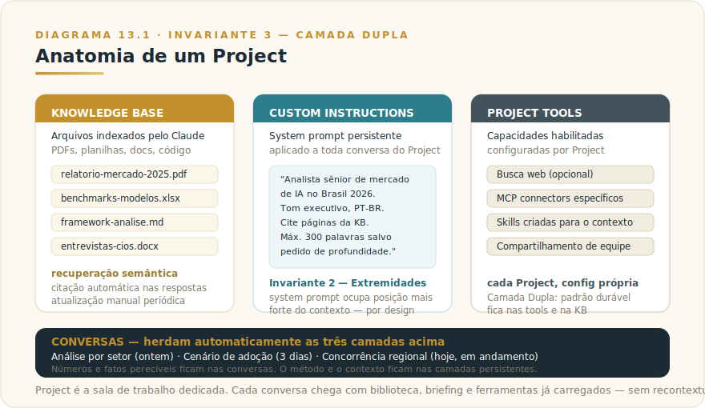
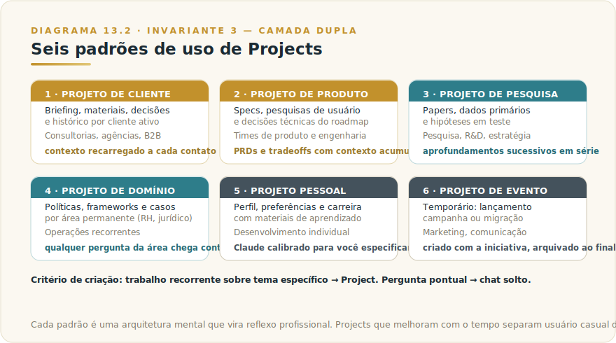

# CAPÍTULO 13
## CLAUDE PROJECTS

---

> *"Projects transformam Claude de assistente de conversa em colaborador organizacional. É a peça que separa quem usa Claude como consulta de quem usa Claude como infraestrutura cognitiva."*

---

> 🧭 **Por que este capítulo é a aplicação do Invariante 3 — Camada Dupla**
>
> Projects é Camada Dupla materializada: o padrão durável vai no system prompt e nos arquivos persistentes; o número volátil vai na conversa do dia. O que muda toda semana fica em cima da mesa; o que dura anos fica no Project.
> Invariante secundário: **Inv. 2 — Extremidades** (o system prompt ocupa a posição mais forte do contexto, por design).

---

## 13.1 — O CONCEITO INTUITIVO

Existe um momento na curva de aprendizado de Claude em que a pessoa percebe um problema recorrente, e esse momento é onde o salto de competência acontece. O problema é que cada conversa começa do zero, sem memória do que foi discutido antes, sem acesso aos documentos relevantes, sem o contexto que tornaria a interação produtiva. Você passa cinco minutos no início de cada conversa explicando quem você é, o que está fazendo, qual o contexto, antes de poder pedir o que realmente quer. Multiplique isso por dezenas de conversas por semana, e o desperdício fica evidente.

Claude Projects é a resposta arquitetural para esse problema. Project é um espaço de trabalho persistente que carrega três elementos importantes para todas as conversas dentro dele. A primeira é a Knowledge Base, com arquivos que o Claude consulta automaticamente quando relevante. A segunda são as Custom Instructions, que funcionam como system prompt persistente, configurando comportamento esperado em todas as interações daquele projeto. A terceira é o histórico de conversas anteriores, que pode ser referenciado quando necessário.

Para quem entende Projects e os usa bem, Claude deixa de ser ferramenta de consulta pontual e vira algo mais próximo de colaborador organizacional, com memória de contexto, conhecimento de domínio específico e padrão de trabalho calibrado. A diferença prática em produtividade é dramática, e a barreira de entrada é trivial. Em poucos minutos de configuração, você ganha capacidade que estava sentada na plataforma o tempo todo, esperando ser ativada.

---

## 13.2 — ANALOGIA: A SALA DE TRABALHO DEDICADA

Pense na diferença entre duas formas de trabalhar com um consultor experiente sobre um projeto longo. Na primeira forma, você o encontra em um café diferente toda semana, e cada encontro começa com você reexplicando o contexto inteiro, mostrando documentos no celular ou imprimindo em papel, recapitulando o que decidiu antes. O consultor é tão competente quanto sempre, mas o tempo útil de cada encontro fica drasticamente reduzido pela necessidade constante de recontextualizar.

Na segunda forma, você aluga uma sala de trabalho dedicada para o projeto, com biblioteca contendo todos os documentos relevantes, quadro com decisões já tomadas, briefing escrito do projeto, e o consultor entra na sala já com tudo isso à disposição. Cada encontro começa onde o anterior terminou, com o trabalho avançando em vez de retroceder ao ponto de partida.

Projects são a sala de trabalho dedicada. Cada projeto é seu próprio ambiente, com biblioteca própria, regras próprias, histórico próprio. Quando você inicia uma conversa dentro de um Project, Claude já chega com tudo carregado, e o tempo dedicado a contextualizar pode ser redirecionado para o trabalho substantivo. Quem opera com essa estrutura tira valor proporcionalmente maior da plataforma.

---

## 13.3 — EXPLICAÇÃO TÉCNICA

### 13.3.1 — Anatomia de um Project

Um Project tem três camadas persistentes que coexistem com conversas que acontecem dentro dele.

> 📊 **Diagrama 13.1 — Anatomia de um Project**
>
> 
>
> *Knowledge Base, Custom Instructions e Tools persistentes, com conversas herdando tudo automaticamente.*

A **Knowledge Base** é a área onde você adiciona arquivos que Claude vai consultar automaticamente quando relevante. PDFs, planilhas, documentos Word, arquivos de texto, código, praticamente qualquer formato comum. A Anthropic indexa o conteúdo em formato otimizado para recuperação semântica, e durante as conversas Claude busca o que importa para a pergunta atual, citando trechos relevantes nas respostas. O limite de conteúdo varia por plano e muda com atualizações — valores correntes e diferenças por tier no [Apêndice Vivo (J)](../04-apendices/L2-APX-J-apendice-vivo.md).

As **Custom Instructions** funcionam como system prompt persistente do Project. Você escreve uma vez, em formato livre, explicando contexto, papel desejado, regras de comportamento, formato preferido de resposta. Em todas as conversas dentro do Project, essas instruções entram no prompt inicial automaticamente, sem que você precise reescrevê-las. Algo como "este Project trata de pesquisa de mercado de IA no Brasil em 2026. Você é analista sênior, responde em português executivo, sempre cita as fontes da Knowledge Base, e estrutura respostas em três blocos quando aplicável".

As **Tools do Project** incluem capacidades específicas que podem ser habilitadas para aquele projeto, como busca web, MCP connectors específicos, Skills criadas para aquele contexto. Cada Project pode ter configuração diferente de tools, dependendo do que faz sentido para o tipo de trabalho.

Os **arquivos compartilhados nos chats** são adicionados nas conversas individuais e ficam disponíveis apenas naquela conversa, ao contrário dos arquivos da Knowledge Base que persistem. Útil para arquivos temporários que você quer analisar mas não vincular permanentemente ao projeto.

As **conversas dentro do Project** herdam automaticamente Knowledge Base e Custom Instructions, e ficam organizadas dentro daquela área de trabalho. Você pode ter dezenas ou centenas de conversas dentro de um único Project, e todas operam com o mesmo contexto base.

### 13.3.2 — Como criar um Project bem feito

A maioria das pessoas que cria o primeiro Project joga arquivos aleatórios e escreve instruções genéricas — o resultado é apenas marginalmente melhor que conversa sem Project. O que diferencia um Project medíocre de um profissional são quatro práticas.

A primeira coisa é **curadoria da Knowledge Base**. Em vez de adicionar tudo que parece tangencialmente relevante, selecione cuidadosamente os arquivos que vão alimentar respostas com qualidade. Documentos atualizados, materiais primários (não tradução nem resumo de segunda mão), conteúdo bem estruturado. Knowledge Base de 30 documentos bem escolhidos costuma render mais que de 200 documentos misturados sem critério.

A segunda é **especificidade nas Custom Instructions**. Instruções genéricas como "seja útil e responda em português" são desperdício. Instruções específicas como "você está apoiando análise de mercado para conselho de uma fintech brasileira, sempre considerando regulação BCB; respostas executivas em até 300 palavras a menos que peçam profundidade; cite páginas dos documentos da Knowledge Base; quando houver incerteza, declare explicitamente" calibram o modelo para o trabalho real.

A terceira é **manutenção contínua**. Projects desatualizados produzem respostas desatualizadas. Reservar tempo periódico para atualizar a Knowledge Base com material novo, refinar as Custom Instructions à luz do que aprendeu nas conversas, e arquivar Projects que não estão mais ativos, mantém a infraestrutura cognitiva produtiva ao longo do tempo.

A quarta é **organização em hierarquia mental**. Projects funcionam melhor quando você tem critério claro sobre o que merece Project versus o que pode ficar em conversa solta. Trabalho recorrente sobre tema específico merece Project. Pergunta pontual sobre tema diverso pode ficar em chat livre. Essa separação evita proliferação de Projects pouco usados.

### 13.3.3 — Seis padrões de uso

Seis padrões de uso aparecem repetidamente em organizações maduras e ajudam a calibrar onde Projects rendem mais.

O **projeto de cliente** é o padrão clássico para consultores, agências e profissionais B2B. Cada cliente ativo tem seu Project, com briefing, materiais da empresa, decisões anteriores, comunicações importantes. Quando o cliente liga ou manda mensagem, você abre o Project dele e tem todo o contexto recarregado para Claude.

O **projeto de produto** é o padrão para times de produto e engenharia. Cada produto em desenvolvimento tem seu Project, com specs, pesquisas de usuário, decisões técnicas anteriores, roadmap. Análises de tradeoff, redação de PRDs, decisões de prioritização, acontecem dentro do Project com contexto recarregado.

O **projeto de pesquisa** é o padrão para pesquisa, R&D e estratégia. Cada tema de pesquisa tem seu Project, com papers, dados primários, framework de análise, hipóteses em teste. Aprofundamentos sucessivos acontecem em conversas dentro do Project, evolvendo o entendimento ao longo do tempo.

O **projeto de domínio** é o padrão para áreas permanentes de trabalho, como Project de RH, Project de jurídico, Project de compliance, Project de financeiro. Conhecimento estável da área (políticas, frameworks, casos relevantes) vive na Knowledge Base, e qualquer pergunta dentro daquele domínio chega com contexto carregado.

O **projeto pessoal** é o padrão para você mesmo, com perfil profissional detalhado, preferências de trabalho, contexto sobre sua carreira, materiais de aprendizado em curso. Conversas sobre carreira, decisões pessoais, aprendizado contínuo, acontecem nesse Project, com Claude calibrado para você especificamente.

O **projeto de evento** é o padrão para iniciativas temporárias, como lançamento de produto, campanha de marketing, migração de sistema. Project criado para a duração do evento, com todos os materiais relevantes, e arquivado quando o evento termina.

> 📊 **Diagrama 13.2 — Seis Padrões de Uso de Projects**
>
> 
>
> *Cada padrão é uma arquitetura mental que vira reflexo profissional.*

---

## 13.4 — EXEMPLO MEMORÁVEL: A AGÊNCIA QUE DIGITALIZOU MEMÓRIA INSTITUCIONAL

Uma agência brasileira de comunicação estratégica, com cerca de 40 funcionários atendendo cerca de 25 clientes corporativos ativos, enfrentava em 2025 um problema crônico que vale conhecer porque é universal. A memória institucional sobre cada cliente estava espalhada em emails, decks antigos, anotações pessoais, dropbox compartilhado, slack de canal por cliente. Quando um novo membro da equipe entrava em um cliente, levava semanas para se contextualizar. Quando um cliente fazia uma pergunta que dependia de decisão tomada dois anos atrás, ninguém lembrava onde estava o registro. Quando alguém saía da empresa, o conhecimento ia junto.

Em janeiro de 2026, a sócia diretora propôs um experimento estruturado usando Claude Projects. Em vez de tentar resolver tudo de uma vez, escolheram três clientes-piloto, e dedicaram duas semanas para construir Projects bem feitos para cada um.

A construção seguiu um protocolo cuidadoso. Para cada cliente, uma pessoa do time foi designada como "curador da memória". Essa pessoa passou três a quatro dias coletando materiais relevantes, decks antigos, briefings, comunicações importantes, decisões registradas, contratos vigentes. Filtraram para os documentos verdadeiramente importantes (em média cerca de 40 a 60 por cliente), e adicionaram à Knowledge Base do Project respectivo. Custom Instructions foram escritas em conjunto com o líder da conta, capturando tom da relação, sensibilidades específicas, padrões de entrega esperados pelo cliente.

Depois das duas semanas de setup, abriram acesso aos Projects para os times respectivos. Os primeiros dias foram de adaptação, com colaboradores aprendendo a abrir o Project antes de iniciar trabalho, com perguntas começando dentro do contexto carregado. Em três semanas, o padrão já era natural.

Os resultados em três meses surpreenderam até a direção que tinha promovido o experimento.

Primeiro, o **tempo de onboarding** de novo membro em uma conta caiu de cerca de três semanas para cerca de cinco dias. O novo entrante, ao abrir o Project, fazia perguntas amplas como "me explique a relação histórica com este cliente", "quais foram as três maiores decisões estratégicas dos últimos dois anos", "o que sabemos sobre as preferências de comunicação do CEO deles", e Claude respondia com base na Knowledge Base com qualidade que antes só sêniors poderiam fornecer.

Segundo, a **qualidade do trabalho cotidiano** subiu visivelmente. Análises e recomendações ficaram mais consistentes com o histórico da conta. Erros de contradição com decisões anteriores praticamente desapareceram. A continuidade de raciocínio entre membros do time melhorou, porque todos operavam a partir da mesma base.

Terceiro, e talvez o mais inesperado, o **valor percebido pelos clientes** subiu. Em apresentações, em e-mails, em conversas estratégicas, a agência demonstrava memória profunda da relação, com referências precisas a decisões passadas e contextualização cuidadosa. Em uma conversa, o CFO de um dos clientes-piloto comentou "vocês parecem lembrar de cada coisa que conversamos, é como se tivessem um histórico melhor que o meu". Esse foi o momento em que a sócia diretora percebeu que estavam diante de algo maior.

Depois desse piloto, a agência sistematizou Projects para todos os 25 clientes, com um curador designado em cada conta, e protocolo de atualização mensal da Knowledge Base. **A memória institucional saiu do território da intuição individual e virou ativo organizacional auditável.** Os colaboradores passaram a contribuir ativamente, sabendo que o conhecimento organizado beneficiaria colegas e clientes.

A lição estrutural não foi sobre Claude nem sobre IA — foi sobre **dar forma à memória institucional**. Toda organização de conhecimento sofre com esse problema, e Projects oferece estrutura simples e poderosa para resolvê-lo. **Quem trata Projects como recurso técnico secundário deixa o maior valor da plataforma intocado. Quem trata como arquitetura cognitiva organizacional transforma a operação.**

> 🎯 **PARA EXECUTIVOS**
> Empresas de serviços profissionais (consultoria, advocacia, agências, contabilidade, R&D) com memória institucional dispersa têm em Projects uma oportunidade clara de ganho operacional. O investimento é modesto (poucas semanas de setup por área crítica), o retorno é estrutural (onboarding mais rápido, qualidade consistente, fidelização de clientes), e a alavanca é cumulativa (Projects melhoram com o tempo se mantidos).

---

## 13.5 — NA PRÁTICA: TRÊS APLICAÇÕES REPLICÁVEIS

O exemplo anterior conta uma história; esta seção entrega o roteiro. Três aplicações que você pode rodar esta semana. Cada uma segue a mesma forma — *situação → o que fazer → o ponto de julgamento* — porque o passo a passo é replicável, mas é o ponto de julgamento que separa uso profissional de uso ingênuo.

**Aplicação 1 — Project de cliente com Custom Instructions específicas.**
*Situação:* você atende um cliente recorrente — seja como consultor, prestador de serviço ou gerente de conta — e toda semana repassa o contexto da relação antes de qualquer conversa produtiva. *O que fazer:* crie um Project para esse cliente; adicione à Knowledge Base os documentos que você consultaria manualmente — briefing, histórico de decisões, contratos vigentes, materiais do cliente; escreva Custom Instructions específicas com tom da relação, sensibilidades conhecidas, formato esperado de entregas; use o Project por uma semana para todas as tarefas relacionadas a esse cliente e compare o tempo de contextualização com o período anterior. *O ponto de julgamento:* após a primeira semana, revise as Custom Instructions à luz do que funcionou e do que precisou correção nas conversas. O document na extremidade do contexto — a instrução que chega antes de tudo — define o frame inteiro das respostas; instrução vaga na extremidade produz resultado vago na saída. Ajustar essa extremidade é o trabalho mais alavancado que existe no Project (Invariante 2 — Extremidades).

**Aplicação 2 — Migração de memória institucional dispersa para Project.**
*Situação:* sua equipe tem conhecimento crítico espalhado em emails, decks antigos, arquivos em nuvem, chats — e toda vez que alguém precisa de contexto, gasta horas procurando ou perguntando para quem lembra. *O que fazer:* designe uma pessoa como "curador"; colete os documentos mais importantes (mire em qualidade, não em quantidade — 30 documentos bem escolhidos rendem mais que 200 misturados); adicione à Knowledge Base com descrições claras; escreva Custom Instructions que especificam o domínio, o nível do leitor e o formato esperado de respostas; teste com três perguntas que você sabe a resposta antes de abrir para o time. *O ponto de julgamento:* ao testar, avalie se as respostas citam fontes corretas da Knowledge Base ou fazem afirmações sem âncora documental. A extremidade da consulta — a pergunta bem formulada — determina se o Claude busca na Knowledge Base certa ou recorre a conhecimento geral. Perguntas vagas recebem respostas genéricas mesmo com Knowledge Base excelente; perguntas específicas que mencionam o domínio correto ativam as fontes certas (Invariante 2).

**Aplicação 3 — Project pessoal como contexto persistente de carreira.**
*Situação:* você tem objetivos de carreira, áreas de desenvolvimento e decisões profissionais que recorrentemente recomeça do zero a cada conversa com o Claude. *O que fazer:* crie um Project pessoal; escreva Custom Instructions com perfil profissional detalhado — função atual, aspirações, forças reconhecidas, áreas de desenvolvimento, restrições reais (geograficas, financeiras, de timing); adicione à Knowledge Base documentos relevantes — CV atualizado, feedback recebido, material de aprendizado em curso; use esse Project para todas as conversas sobre carreira, desenvolvimento e decisões profissionais. *O ponto de julgamento:* revise as Custom Instructions a cada três meses — você mudou, o contexto mudou, e a extremidade do contexto precisa refletir quem você é agora, não quem você era quando criou o Project. Context desatualizado na posição mais forte do prompt (a instrução persistente) silenciosamente contamina todas as respostas — você recebe conselhos calibrados para uma versão passada de você mesmo, sem perceber (Invariante 2 — Extremidades como ponto mais influente do contexto, para o bem e para o mal).

> 🔧 **EXERCÍCIO**
> Escolha um Project que você vai criar ou que já existe. Escreva as Custom Instructions a partir do zero, sem reutilizar texto genérico. Formule pelo menos uma restrição específica ("nunca sugira soluções que envolvam mudança de CRM; já passamos por isso e custou seis meses") e um formato esperado de resposta com exemplo. Depois de uma semana de uso, revise: qual instrução fez mais diferença? Qual instrução gerou resposta que você não esperava? O que você mudaria na extremidade para calibrar melhor o resultado?

---

## 13.6 — LIMITAÇÕES E ARMADILHAS

As limitações de Projects — ignorá-las é entrar em qualquer ferramenta sem ler o manual.

A primeira é **limite de Knowledge Base**. Cada plano tem um limite combinado de conteúdo na Knowledge Base (valores correntes no [Apêndice Vivo (J)](../04-apendices/L2-APX-J-apendice-vivo.md)). Planos de entrada cobrem algumas centenas de páginas; planos corporativos têm limites maiores, mas ainda finitos. Para bases verdadeiramente grandes, arquitetura RAG dedicada como vimos no Capítulo 6 pode ser mais apropriada — veja critério de decisão abaixo.

A segunda é **drift de informação**. Knowledge Base não se atualiza sozinha. Documentos que ficam lá há meses podem estar desatualizados, e Claude vai responder com base neles sem aviso. Manutenção periódica é responsabilidade do dono do Project.

A terceira é **compartilhamento e colaboração**. Planos de entrada limitam Projects ao uso individual. Planos corporativos permitem compartilhamento dentro do workspace com configuração de permissões, mas a mecânica específica (ownership, visibilidade, edição colaborativa da Knowledge Base) varia por tier — conferir documentação corrente ou [Apêndice Vivo (J)](../04-apendices/L2-APX-J-apendice-vivo.md) para o estado atual antes de planejar arquitetura de equipe.

A quarta é **dependência de qualidade da curadoria**. Lixo entra, lixo sai. Se a Knowledge Base tem materiais de baixa qualidade, inconsistentes ou desatualizados, Claude vai usar isso na resposta, com a mesma confiança que usaria material excelente. Curadoria é prerrequisito de qualidade.

A quinta é **proliferação descontrolada**. Algumas pessoas começam a criar Project para tudo, e em seis meses têm 60 Projects pouco usados que viraram poluição mental. Critério para criar versus deixar em chat solto é parte da disciplina.

> ⚠️ **POSTMORTEM — Contexto demais, decisão de menos**
> *O que tentaram:* Um time de estratégia de uma empresa de serviços financeiros transformou o Project compartilhado em depósito organizacional: relatórios de mercado de cinco anos, apresentações antigas de conselho, transcrições de entrevistas de clientes, benchmarks de concorrentes, políticas internas e threads de email copiados como texto bruto. A Knowledge Base chegou a mais de 180 documentos. As Custom Instructions tinham 1.200 palavras descrevendo o time, os clientes e as restrições de forma tão abrangente que eram, na prática, um manual corporativo.
> *O que deu errado:* O Project passou a devolver respostas genéricas e prolixas que misturavam contextos incompatíveis — análises de 2021 com premissas de 2026, políticas já revogadas citadas como vigentes. Pior: como o contexto era vasto e aparentemente completo, ninguém no time se sentia autorizado a decidir coisa alguma sem "consultar o Project". O Project virou obstáculo à decisão, não suporte a ela. A ironia é que o Invariante violado é o Inv. 2 — Extremidades: com 180 documentos na Knowledge Base e 1.200 palavras nas Custom Instructions, o que era crítico afogou no que era apenas arquivado. *O que teria evitado:* Curadoria real: no máximo 30 documentos ativos, revisados mensalmente; Custom Instructions de uma página com restrições específicas e formato esperado; separação entre o que o Project deve *conhecer* (base estável) e o que o usuário deve *decidir* (julgamento ativo, indelegável). Depósito não é contexto — é entropia com interface. Veja também `[Apêndice K — Os 9 Modos de Falha](../04-apendices/L2-APX-K-modos-de-falha.md)`.

### 13.6.1 — Projects versus RAG dedicado: critério de decisão

A pergunta "quando Projects não é suficiente e RAG dedicado é necessário?" aparece em organizações que crescem para além do uso pessoal. O critério é simples em teoria, menos simples na prática.

**Use Projects quando:**
- O volume de conteúdo cabe no limite do plano (algumas centenas a alguns milhares de páginas, dependendo do tier)
- O conteúdo é relativamente estável — atualizado mensalmente, não em tempo real
- O acesso é por um ou poucos usuários com conta na plataforma
- A curadoria manual é viável (você consegue revisar o que entra)

**Migre para RAG dedicado (Capítulo 6) quando:**
- O volume cresce para dezenas de milhares de documentos ou atualização frequente
- Múltiplos sistemas precisam acessar o mesmo repositório de conhecimento (não apenas via claude.ai)
- Você precisa de controle granular sobre quais documentos chegam em qual resposta, com rastreabilidade de fonte por linha
- A atualização precisa ser em tempo real ou quase real — um ticket resolvido hoje deve ser buscável hoje, não depois da próxima atualização manual da Knowledge Base
- A base de conhecimento é de toda a organização, não de um projeto específico

| Situação | Projects | RAG dedicado |
|----------|---------|--------------|
| Base de 30-200 documentos estáveis | ✅ | Desnecessário |
| Atualização mensal manual viável | ✅ | Desnecessário |
| Acesso só via claude.ai | ✅ | Desnecessário |
| Dezenas de milhares de documentos | ⚠️ Limite | ✅ |
| Atualização em tempo real necessária | ❌ | ✅ |
| Múltiplos sistemas acessando o mesmo conhecimento | ❌ | ✅ |
| Rastreabilidade de fonte por linha requerida | ⚠️ Parcial | ✅ |

---

## 13.7 — CONEXÕES COM OUTROS CAPÍTULOS

- 🔗 **RAG, fundação técnica da Knowledge Base** → [Capítulo 6](../../Livro-1-Os-Invariantes/02-capitulos/L1-C06-rag.md)
- 🔗 **Memória em IA, conceito mais amplo** → [Capítulo 7](../../Livro-1-Os-Invariantes/02-capitulos/L1-C07-memoria.md)
- 🔗 **Engenharia de prompt para Custom Instructions** → [Capítulo 9](../../Livro-1-Os-Invariantes/02-capitulos/L1-C09-engenharia-prompt.md)
- 🔗 **Context engineering aplicado em Projects** → [Capítulo 11](../../Livro-1-Os-Invariantes/02-capitulos/L1-C11-context-engineering.md)
- 🔗 **Claude Web e onde Projects vivem** → [Capítulo 10](L2-C10-claude-web.md)
- 🔗 **Skills do Project** → [Capítulo 31](L2-C31-skills.md)
- 🔗 **Subagents dentro de Projects** → [Capítulo 32](L2-C32-subagents-workflows.md)

---

## 13.8 — RESUMO EXECUTIVO

| Conceito | Síntese |
|----------|---------|
| **Project** | Espaço de trabalho persistente com Knowledge Base, Custom Instructions e Tools |
| **Knowledge Base** | Arquivos consultados automaticamente pelo Claude nas conversas do Project |
| **Custom Instructions** | System prompt persistente que se aplica a todas as conversas do Project |
| **Project Tools** | Capacidades específicas habilitadas para aquele contexto |
| **Seis padrões** | Cliente, produto, pesquisa, domínio, pessoal, evento |
| **Limites** | Tamanho de KB (Apêndice Vivo J), drift, compartilhamento (varia por tier), curadoria, proliferação |
| **Projects vs RAG** | Projects para base estável, curada, acesso via claude.ai; RAG para volume grande, tempo real, multiusuário |

---

## 13.9 — CHECKLIST DO CAPÍTULO

- [ ] Distinguir as três camadas persistentes de um Project
- [ ] Criar um Project bem feito com Knowledge Base curada
- [ ] Escrever Custom Instructions específicas para um caso real
- [ ] Identificar quais dos seis padrões se aplicam à sua organização
- [ ] Estabelecer protocolo de manutenção de Projects ativos
- [ ] Aplicar o critério de Projects versus RAG dedicado a pelo menos um caso real
- [ ] Defender Projects como ativo organizacional, não recurso técnico

---

## 13.10 — PERGUNTAS DE REVISÃO

1. Por que Custom Instructions específicas rendem dramaticamente mais que genéricas?
2. Em que situação Project é melhor que chat solto, e vice-versa?
3. Como você convenceria uma agência ou consultoria a investir em Projects?
4. Por que manutenção contínua de Projects é parte do design, não acessório?
5. Quando RAG dedicado (Cap 6) é melhor que Project? Cite três condições concretas.
6. Uma organização tem base de conhecimento de RH com 500 políticas internas, atualizada mensalmente. Qual arquitetura você recomendaria — Project ou RAG? Justifique.

---

## 13.11 — EXERCÍCIOS PRÁTICOS

### Exercício 1 — Auditoria de oportunidade
Liste cinco temas em que você trabalha recorrentemente. Para cada um, avalie se mereceria um Project. Documente os critérios usados.

### Exercício 2 — Construção piloto
Crie um Project bem feito para um tema seu importante. Curadoria cuidadosa da Knowledge Base, Custom Instructions específicas, ao menos 10 documentos relevantes. Use por uma semana e meça a diferença.

### Exercício 3 — Estrutura de equipe
Esboce arquitetura de Projects para uma equipe sua, com regras de criação, curadoria e atualização. Apresente para discussão.

### Exercício 4 — Migração de memória com critério de arquitetura
Para um cliente ou área onde sua memória institucional está dispersa, aplique primeiro o critério de 13.5.1: Project ou RAG dedicado? Se Project, construa com as quatro práticas de 13.3.2 (curadoria cuidadosa, Custom Instructions específicas, manutenção, critério de criação). Documente o esforço de setup, o volume de documentos, e a qualidade das três primeiras respostas comparadas ao que você obteria sem o Project.

---

## 13.12 — PROJETO DO CAPÍTULO

**Transforme uma área crítica em Project consolidado.**

Escolha uma área onde memória institucional está dispersa na sua organização. Pode ser um cliente importante, um produto, um domínio operacional. Construa um Project completo, com Knowledge Base de pelo menos 20 documentos cuidadosamente selecionados, Custom Instructions específicas, e protocolo de atualização. Use por um mês com sua equipe. Documente o impacto em onboarding, qualidade do trabalho e satisfação dos envolvidos. Esse projeto, se bem executado, costuma virar template replicável para outras áreas.

---

## 13.13 — REFERÊNCIAS PRINCIPAIS

📚 **Documentação**

- [Anthropic — Claude Projects](https://www.anthropic.com/news/projects)
- [Claude — Working with files](https://docs.claude.com/en/docs/build-with-claude/embeddings)

---

## 13.14 — VALIDAÇÃO UAU

| # | Critério | Você consegue? |
|---|----------|----------------|
| 1 | **Clareza** — Explicar Projects para um diretor em 90 segundos, usando a analogia da sala de trabalho | ☐ |
| 2 | **Decisão** — Dado um cenário de base de conhecimento organizacional, decidir entre Projects e RAG dedicado com critério explícito | ☐ |
| 3 | **Profundidade** — Defender quando Project rende mais que chat livre, e quando Custom Instructions específicas fazem diferença real | ☐ |
| 4 | **Aplicação** — Construir um Project bem feito para área real, com curadoria, Custom Instructions específicas e protocolo de manutenção | ☐ |
| 5 | **Curiosidade UAU** — Está com vontade de entender Artifacts, a capacidade que vira saída do chat em ferramenta editável | ☐ |

**5 de 5?** Avance. Você acabou de ganhar uma ferramenta organizacional poderosa.
**3 ou 4?** Releia 13.4 (caso da agência). É onde Projects viram ativo institucional.
**Menos de 3?** O capítulo merece releitura prática, com Claude aberto em paralelo.

---

🔗 **Próximo capítulo:** [Capítulo 14 — Claude Artifacts](L2-C14-artifacts.md)

---

> *"Projects transformam Claude de assistente em colaborador organizacional. A memória institucional sai do território da intuição e vira ativo auditável."*
