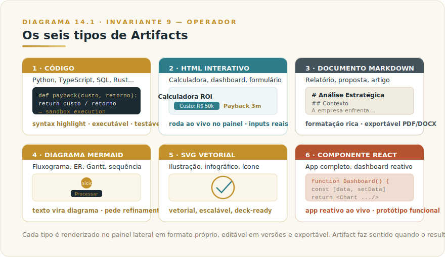
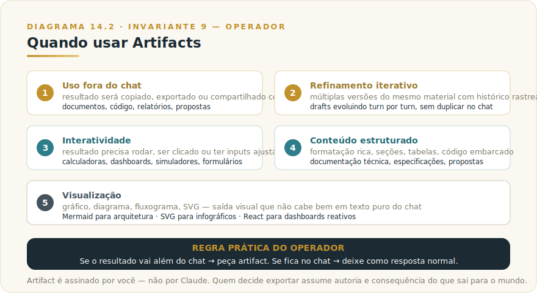

# CAPÍTULO 14
## CLAUDE ARTIFACTS

---

> *"Artifacts são o momento em que Claude para de só conversar e começa a entregar. A maioria dos usuários ainda não percebeu que o chat virou superfície de produção."*

---

> 🧭 **Por que este capítulo é a aplicação do Invariante 9 — Operador**
>
> Artifacts separam rascunho de entrega. O operador é quem decide quando algo está pronto para sair. Mas o Invariante 9 coloca uma pergunta mais dura do que parece: **quem é responsável pelo que está dentro do artifact quando ele sai para o mundo?**
>
> Um artifact exportado para um deck executivo, publicado como ferramenta interna, ou enviado para um cliente é assinado por você — não por Claude. Se o cálculo no HTML interativo está errado, se os dados do relatório Markdown estão desatualizados, se o protótipo React coleta dados sem aviso ao usuário, a responsabilidade é do operador que decidiu exportar. Claude produz; você entrega. Essa distinção não é burocrática — é o ponto em que ferramenta vira autoria, e autoria carrega consequência.

---

## 14.1 — O CONCEITO INTUITIVO

Artifacts desloca saídas estruturadas (código, documentos, diagramas, aplicações pequenas) do fluxo da conversa para um painel lateral dedicado, onde o conteúdo é renderizado, fica editável, pode ser exportado e evolui em versões sucessivas.

Em chat puro, quando você pede um código de Python ou documento estruturado, o resultado vem como bloco de texto — copie manualmente para outro lugar, compare versões visualmente sem histórico claro. Artifacts resolvem isso: painel separado, renderização em formato apropriado (código com syntax highlight, Markdown formatado, HTML executando ao vivo, diagramas desenhados), e cada refinamento atualiza a versão anterior em vez de criar duplicata no chat.

Para uso profissional, Artifacts viraram peça central. Apresentações, dashboards interativos, calculadoras de ROI, protótipos, relatórios executivos — todos constroem dentro de Claude, evoluem iterativamente e exportam quando prontos. O fluxo acontece integralmente na plataforma.

---

## 14.2 — ANALOGIA: A PRANCHETA DO ARQUITETO

Dois modos de trabalhar com um arquiteto. No primeiro, ele faz rascunhos em guardanapos e você sai com notas avulsas. No segundo, ele trabalha em prancheta dedicada — cada versão marcada, possibilidade de comparar a v3 com a v7, exportação quando pronto.

Artifacts são a prancheta. Em chat puro, material estruturado fica embaralhado no fluxo, sem versionamento, sem exportação nativa. Com Artifacts, o material ganha lugar próprio — histórico de versões, edição ao vivo, renderização rica, botões claros de exportação. Diferença que parece pequena no marketing e rende todo dia em produtividade real.

---

## 14.3 — EXPLICAÇÃO TÉCNICA

### 14.3.1 — Os seis tipos suportados

Artifacts suportam seis tipos principais de conteúdo — a lista atual está no [Apêndice Vivo (J)](../04-apendices/L2-APX-J-apendice-vivo.md), e conhecer cada um amplia o repertório do que você pode pedir a Claude com qualidade profissional.

> 📊 **Diagrama 14.1 — Os Seis Tipos de Artifacts**
>
> 
>
> *Cada tipo é renderizado em formato apropriado e exportável.*

O primeiro tipo é **código**, em qualquer linguagem que Claude conheça. Python, TypeScript, JavaScript, SQL, Rust, Go, Java, C#, e muitos outros. O artifact aparece em painel lateral com syntax highlighting, numeração de linhas, e em alguns casos pode ser executado em sandbox direto na interface para validação rápida. Útil para protótipos, scripts utilitários, refatoração de código existente, ou para construir trechos que serão integrados em base maior.

O segundo é **HTML com JavaScript e CSS**, que vira aplicação interativa rodando ao vivo no painel. Calculadoras de ROI com inputs ajustáveis, dashboards com dados em hard code mas visualização rica, formulários funcionais, jogos simples, simuladores. O artifact fica completamente funcional dentro da interface, e o usuário pode interagir antes de exportar. Esse é provavelmente o tipo de maior impacto para usuários não técnicos, porque permite criar ferramentas pequenas sem precisar saber programar.

O terceiro é **documento em Markdown**, ideal para relatórios, propostas, artigos, documentação técnica. O artifact é renderizado com formatação rica, headers estilizados, listas, tabelas, código embarcado, citações. Pode ser exportado para PDF, DOCX, ou copiado para Notion, Confluence, ou qualquer ferramenta que aceite Markdown. Substitui, em muitos casos, a redação direta em Word ou Google Docs para primeira versão de conteúdo estruturado.

O quarto é **diagrama Mermaid**, em que código texto em sintaxe Mermaid vira diagrama renderizado. Fluxogramas, diagramas de sequência, diagramas de estado, ER, gráficos de Gantt, mapas mentais. Como o artifact mantém o código fonte, você pode pedir refinamentos como "adicione um nó", "mude a direção do fluxo", "destaque o caminho crítico", e ver o resultado atualizado.

O quinto é **SVG**, com gráficos vetoriais customizados. Desde ícones e ilustrações simples até infográficos complexos, todos vetoriais, escaláveis, prontos para uso em apresentações ou web. Para profissionais que produzem material visual mas não dominam ferramentas de design, é caminho rápido para chegar a primeiro corte de qualidade aceitável.

O sexto é **componente React**, com aplicações completas em um único arquivo, incluindo JSX, hooks, estado, eventos. Dashboards reativos, ferramentas internas, protótipos de produto, todos rodando ao vivo no painel. Esse é o tipo mais sofisticado e mais surpreendente em uso, porque permite construir aplicações pequenas inteiramente em conversa de Claude, exportar quando pronto, e em muitos casos publicar como protótipo funcional sem nenhuma alteração.

### 14.3.1.1 — Exemplos práticos por tipo

Um exemplo real de uso para cada tipo, com pedido que você pode replicar agora.

**Tipo 1 — Código (Python, TS, SQL)**. Pedido típico: *"Crie um artifact em Python com função que recebe lista de transações e retorna agregação por categoria, com testes unitários cobrindo casos vazios, valores negativos e categorias inválidas".* Resultado: código limpo, syntax highlight, executável em sandbox. Útil em prototipagem rápida, refatoração, scripts utilitários, geração de testes.

**Tipo 2 — HTML interativo**. Pedido típico: *"Crie um artifact com calculadora de payback de investimento, com inputs para custo inicial, retorno mensal e taxa de impostos, mostrando resultado em meses com gráfico de fluxo de caixa".* Resultado: aplicação funcional rodando ao vivo no painel, com inputs reais, cálculo dinâmico, visual aceitável. Útil para validar fórmulas, demonstrações para stakeholders, mini-ferramentas pessoais.

**Tipo 3 — Markdown**. Pedido típico: *"Crie um artifact com proposta comercial estruturada para [cliente X], cobrindo contexto, abordagem proposta, cronograma em 3 fases, equipe envolvida e investimento. Use tabelas para o investimento".* Resultado: documento formatado com headers, listas, tabelas, exportável para PDF ou DOCX em um clique. Útil para propostas, relatórios, artigos, documentação técnica.

**Tipo 4 — Mermaid**. Pedido típico: *"Crie um artifact com diagrama Mermaid mostrando o fluxo de aprovação de pedido na nossa operação, desde solicitação até aprovação final, com decisões em losangos e responsáveis em cada etapa".* Resultado: diagrama renderizado, editável via código texto, exportável como SVG ou PNG. Útil para fluxogramas, arquitetura de sistemas, diagramas ER, gantts simples.

**Tipo 5 — SVG**. Pedido típico: *"Crie um artifact em SVG com infográfico mostrando os 4 pilares da nossa estratégia, cada pilar com ícone, título curto e descrição de uma linha, com paleta de cores corporativa em tons de azul".* Resultado: ilustração vetorial, escalável, pronta para deck ou web. Útil para infográficos rápidos, ícones, ilustrações conceituais, gráficos customizados.

**Tipo 6 — React**. Pedido típico: *"Crie um artifact em React de dashboard de vendas com 3 KPIs no topo (receita, ticket médio, conversão), tabela de top 10 produtos abaixo, e filtro por período. Use dados fictícios coerentes para demonstração".* Resultado: aplicação reativa completa rodando no painel, com estado funcional, filtros operando, gráficos. Útil para protótipos de produto, ferramentas internas, demonstrações para investidores, MVPs visuais.

> 🔧 **NA PRÁTICA**
>
> Para extrair o máximo de cada tipo, descreva no pedido três coisas: o **objetivo** (o que precisa entregar), o **conteúdo** (dados ou estrutura específica), e o **formato visual** (cores, estilo, layout esperado). Quanto mais específico, mais o primeiro corte chega perto do que você quer, reduzindo iterações.

### 14.3.2 — Como invocar artifacts deliberadamente

Em 2026, Claude tende a criar artifacts automaticamente quando reconhece que o conteúdo se beneficiaria do formato, mas você pode invocar deliberadamente — e isso vale ser hábito. Algumas formas de pedir explicitamente.

"**Crie um artifact com [tipo de conteúdo]**" é a forma direta, deixando claro o que você quer. "Crie um artifact com calculadora de payback de investimento" entrega HTML interativo. "Crie um artifact com diagrama Mermaid mostrando o fluxo do nosso processo" entrega diagrama renderizado. "Crie um artifact em formato React de dashboard mostrando esses indicadores" entrega componente funcional.

"**Vamos iterar isso como artifact**" sinaliza para Claude que o material em construção vai passar por múltiplas revisões e deveria viver em painel próprio. Útil quando você sabe que vai refinar muito antes de chegar à versão final.

"**Atualize o artifact com X**" mantém continuidade com versão anterior, em vez de criar artifact novo. Importante para preservar histórico de versões e evitar proliferação.

"**Exporte o artifact como PDF/DOCX/etc**" pede saída em formato específico, quando o destino final é conhecido.

### 14.3.3 — Versionamento e histórico

Cada artifact mantém histórico de versões à medida que você pede refinamentos, e você pode voltar a versões anteriores. Isso é especialmente útil em três situações comuns.

A primeira é quando um refinamento piora o resultado. Você pediu uma mudança, viu que não ficou bem, e quer voltar à versão anterior. O painel de versões permite isso com um clique, sem precisar pedir a Claude para "desfazer" e gerar novamente.

A segunda é quando você quer comparar duas direções. Em vez de seguir linearmente, você pode pedir variações ("crie versão alternativa mais agressiva", "crie outra versão mais conservadora"), e o histórico preserva ambas para comparação.

A terceira é quando você quer exportar uma versão intermediária. Talvez a versão 3 ainda atendia ao caso de uso A, enquanto a versão 7 final atende ao caso B. Você pode exportar cada uma quando precisar.

### 14.3.4 — Quando usar artifacts

Os gatilhos que indicam que um conteúdo deveria virar artifact em vez de ficar como resposta em chat.

> 📊 **Diagrama 14.2 — Quando Usar Artifacts**
>
> 
>
> *Cinco gatilhos que indicam saída merecedora de painel dedicado.*

O primeiro gatilho é **uso fora do chat**. Se o material vai ser copiado para outro lugar, exportado, ou compartilhado com terceiros, artifact é o caminho. Resposta em chat perde formatação quando copiada, exige seleção manual, e fica enterrada no histórico.

O segundo é **refinamento iterativo**. Se você vai pedir múltiplas revisões do mesmo material, em vez de gerar várias versões soltas no chat, artifact mantém histórico e permite comparação.

O terceiro é **interatividade**. Se o resultado precisa rodar, ser clicado, ter inputs ajustáveis ao vivo, só artifact (HTML, React) suporta.

O quarto é **conteúdo estruturado**. Documentos com seções, tabelas, código embarcado, formatação rica, ficam melhor renderizados em artifact que em texto puro de chat.

O quinto é **visualização**. Gráficos, diagramas, fluxogramas, SVGs, são naturais para artifacts e ficam ilegíveis ou impossíveis em chat puro.

A regra prática é simples. Se o resultado vai além do chat, peça artifact. Se vai ficar no chat (resposta conversacional, análise para você ler ali mesmo, perguntas e respostas), deixe em resposta normal.

### 14.3.5 — Quando NÃO usar artifacts

O reflexo de transformar tudo em artifact é erro tão comum quanto não usar artifacts. Os anti-padrões a evitar.

**Resposta conversacional simples.** Se a resposta tem menos de quatro parágrafos e você não vai reusar o material, artifact é overhead sem ganho. O painel lateral para uma lista de três pontos é excesso.

**Iteração ainda em rascunho inicial.** Artifact criado cedo demais vira acúmulo de versões sem valor. Comece em chat, migre para artifact quando o escopo estiver razoavelmente definido — iterações de alinhamento de conceito não precisam de versionamento.

**Conteúdo que você não vai exportar nem revisar.** Artifact faz sentido quando a saída tem destino além da tela atual. Se vai ser descartada após leitura, cria em chat.

**Aplicação com requisitos de produção.** Artifact React é protótipo. Se você precisa de autenticação real, banco de dados, API calls seguras, LGPD, escala — é engenharia de software, não artifact. Confundir os dois é o maior gerador de dívida técnica que artifacts produzem.

**Conteúdo sensível que não deve ser exportável.** Artifacts têm botão de cópia e download visíveis. Material confidencial que não deveria circular livremente é melhor tratado em chat, com o controle de contexto que a conversa fornece.

---

## 14.4 — EXEMPLO MEMORÁVEL: O PROTÓTIPO QUE VIROU PRODUTO

Em meados de 2025, uma empreendedora brasileira tinha ideia para um SaaS B2B simples — indicadores financeiros básicos para pequenas empresas. Sem experiência em programação, o caminho normal seria contratar freelancer, esperar duas a quatro semanas, gastar R$ 15 a 30 mil, e só então mostrar para clientes. Em vez disso, ela testou Claude com Artifacts durante cinco dias.

No primeiro dia, ela descreveu para Claude o conceito do produto em conversa estruturada. Em algumas iterações de refinamento, chegou a um documento de Markdown bem articulado descrevendo as funcionalidades essenciais, com priorização clara. O documento já foi gerado como artifact, com formatação rica e exportável.

No segundo dia, baseada no documento, ela pediu para Claude criar um wireframe interativo das telas principais, em HTML com JavaScript. O artifact que apareceu era um protótipo navegável, com três telas conectadas, inputs simulados, e visual aceitável. Em mais algumas iterações de refinamento (cores, layout, organização), chegou a versão que parecia produto real.

No terceiro dia, ela transformou o protótipo HTML em aplicação React mais sofisticada, com estado real, persistência em memória, gráficos usando biblioteca de visualização. Esse artifact, exportado como código, foi o primeiro material que ela apresentou para potenciais clientes em validação.

No quarto dia, com feedback de três clientes potenciais que mostraram interesse, ela voltou ao Claude e pediu refinamentos baseados nas observações específicas. Adicionou funcionalidades, ajustou comportamentos, evoluiu a interface. Em uma sessão de quatro horas, fez avanços que normalmente exigiriam dias de desenvolvedor profissional.

No quinto dia, ela usou o protótipo React final como base para conversa com desenvolvedor freelancer, que orçou apenas R$ 8 mil para transformar aquilo em produto real com backend, autenticação e banco, em duas semanas. **O custo de validar a ideia foi o preço da assinatura mensal mais o orçamento reduzido do desenvolvimento — números que variam; o que não varia é a proporção entre explorar sozinho e contratar sem especificação.**

A lição estrutural não é que Claude substitui desenvolvedores — é que **artifacts permitem a profissionais não técnicos chegar muito mais longe sozinhos antes de envolver desenvolvedores**. Validação de ideia, primeira interação com clientes, refinamento de UX, definição de especificação técnica: tudo isso pode acontecer com a qualidade necessária dentro de Claude com artifacts. O desenvolvedor entra depois, com escopo bem definido e protótipo funcional, em vez de receber descrição vaga e construir do zero. **Para empreendedores, profissionais de produto, designers e consultores, essa capacidade muda como se opera no início do ciclo de qualquer iniciativa.**

> 🎯 **PARA EXECUTIVOS**
> Artifacts são alavanca subestimada para validação de ideias e construção de protótipos. Profissionais não técnicos da sua organização podem chegar surpreendentemente longe sozinhos antes de envolver times técnicos, reduzindo custo e velocidade de iteração. O treinamento para esse uso é trivial, e o ROI organizacional vem da redução de retrabalho e da melhor qualidade do brief que chega para times de engenharia.

---

## 14.5 — LIMITAÇÕES E CUIDADOS

As limitações de Artifacts — assumir que tudo é possível leva a frustração.

A primeira é **complexidade de aplicação**. Artifacts são ótimos para protótipos, ferramentas pequenas e demonstrações, mas não substituem desenvolvimento de software profissional para sistemas reais em produção. Backend, autenticação, persistência em banco, integração com APIs externas, escala, segurança, são responsabilidades de engenharia de verdade que vão muito além do que cabe em um artifact.

A segunda é **dependências externas**. Artifacts HTML e React rodam no sandbox da Anthropic, com acesso limitado a bibliotecas externas. As bibliotecas suportadas e a lista de imports React disponíveis mudam com o produto — consulte o [Apêndice Vivo (J)](../04-apendices/L2-APX-J-apendice-vivo.md) para o estado atual. Tentar usar algo fora da lista suportada vai falhar silenciosamente.

A terceira é **armazenamento de dados**. Artifacts não conseguem usar localStorage ou outras formas de persistência em navegador no ambiente Claude.ai. Estado fica em memória durante a sessão, e é perdido ao recarregar. Para protótipos isso pode ser limitação séria.

A quarta é **versionamento confuso em conversas longas**. Em sessões com muitas iterações, o histórico de versões pode ficar grande e difícil de navegar. Vale ser disciplinado em pedir mudanças específicas em vez de regenerar tudo do zero.

A quinta é **exportação não é mágica**. Exportar um React complexo para arquivo significa salvar o código, mas você ainda precisa de ambiente Node configurado para rodar localmente. Para usuário não técnico, o caminho do artifact para produção pode ter atrito que não fica claro no início.

---

## 14.6 — CONEXÕES COM OUTROS CAPÍTULOS

- 🔗 **Claude Web e onde Artifacts vivem** → [Capítulo 10](L2-C10-claude-web.md)
- 🔗 **Projects com Artifacts persistentes** → [Capítulo 13](L2-C13-projects.md)
- 🔗 **Claude Code para construção profissional de software** → [Capítulo 9](L2-C09-claude-code.md)
- 🔗 **Engenharia de prompt para gerar artifacts específicos** → [Capítulo 9](../../Livro-1-Os-Invariantes/02-capitulos/L1-C09-engenharia-prompt.md)
- 🔗 **Skills que produzem artifacts especializados** → [Capítulo 31](L2-C31-skills.md)

---

## 14.7 — RESUMO EXECUTIVO

| Conceito | Síntese |
|----------|---------|
| **Artifacts** | Saídas estruturadas em painel dedicado, renderizadas e exportáveis |
| **Seis tipos** | Código, HTML interativo, Markdown, Mermaid, SVG, React |
| **Invocação** | "Crie um artifact com X" ou automático em conteúdo apropriado |
| **Versionamento** | Histórico mantido a cada refinamento, com possibilidade de voltar |
| **Cinco gatilhos** | Uso fora do chat, refinamento iterativo, interatividade, estrutura, visualização |
| **Limitações** | Complexidade de aplicação, dependências, storage, exportação não trivial |

---

## 14.8 — CHECKLIST DO CAPÍTULO

- [ ] Listar os seis tipos de artifacts e quando usar cada um
- [ ] Invocar artifact deliberadamente em três tarefas reais
- [ ] Iterar um artifact com múltiplas versões e comparar
- [ ] Exportar artifacts em formatos apropriados
- [ ] Reconhecer quando artifact é desperdício vs quando é essencial
- [ ] Identificar oportunidades de prototipação rápida na sua rotina

---

## 14.9 — PERGUNTAS DE REVISÃO

1. Por que React Artifacts são especialmente surpreendentes para profissionais não técnicos?
2. Quando documento em Markdown como artifact rende mais que como resposta em chat?
3. Em que situação Mermaid faz diferença gigantesca em comunicação?
4. Por que artifacts não substituem desenvolvimento de software para produção?
5. Como você usaria artifacts para validar uma ideia antes de envolver desenvolvedores?

---

## 14.10 — EXERCÍCIOS PRÁTICOS

### Exercício 1 — Construa uma calculadora
Crie um artifact em HTML com calculadora útil para seu trabalho (ROI, payback, dimensionamento). Itere até a versão final. Exporte e use.

### Exercício 2 — Documento estruturado
Pegue um relatório que você teria escrito em Word. Construa como artifact Markdown. Compare a fluência da iteração com a forma anterior.

### Exercício 3 — Diagrama Mermaid
Para um processo da sua organização, peça a Claude que crie diagrama de fluxo em Mermaid. Itere até ficar claro. Use em reunião.

### Exercício 4 — Protótipo React
Esboce uma ferramenta interna que sua equipe precisaria. Construa protótipo React funcional como artifact. Valide com colegas.

---

## 14.11 — PROJETO DO CAPÍTULO

**Substitua uma ferramenta externa por artifact por uma semana.**

Identifique uma ferramenta que você usa para produzir material estruturado (Word, Excel, draw.io, Figma...). Por uma semana, faça o trabalho equivalente como artifact em Claude. Documente o que funcionou bem, o que falhou, e onde o atrito apareceu. Esse exercício deliberado costuma revelar oportunidades de simplificar fluxo de trabalho cotidiano.

---

## 14.12 — REFERÊNCIAS PRINCIPAIS

📚 **Documentação**

- [Anthropic — Artifacts](https://www.anthropic.com/news/artifacts)
- [Claude — Building with artifacts](https://docs.claude.com/en/docs/build-with-claude)

---

## 14.13 — VALIDAÇÃO UAU

| # | Critério | Você consegue? |
|---|----------|----------------|
| 1 | **Clareza** — Mostrar para um colega os seis tipos de artifacts com exemplo de cada | ☐ |
| 2 | **Profundidade** — Defender quando artifact rende mais que resposta em chat | ☐ |
| 3 | **Aplicação** — Identificar três fluxos seus que se beneficiariam de artifacts | ☐ |
| 4 | **Conexão** — Articular como Artifacts integram com Web (Cap 10), Projects (Cap 13), Code (Cap 9) | ☐ |
| 5 | **Curiosidade UAU** — Está com vontade de entender Claude Design, a superfície que leva os entregáveis da conversa para o trabalho visual com a marca embutida | ☐ |

**5 de 5?** Avance. Você descobriu uma das alavancas mais subestimadas da plataforma.
**3 ou 4?** Releia 14.4 (caso da empreendedora). É onde artifacts viram produto real.
**Menos de 3?** O capítulo merece releitura prática, com artifacts sendo testados em paralelo.

---

🔗 **Próximo capítulo:** [Capítulo 15 — Claude Design](L2-C15-claude-design.md)

---

> *"Artifacts são o momento em que Claude para de só conversar e começa a entregar. Saída saiu do chat e virou prancheta dedicada."*
