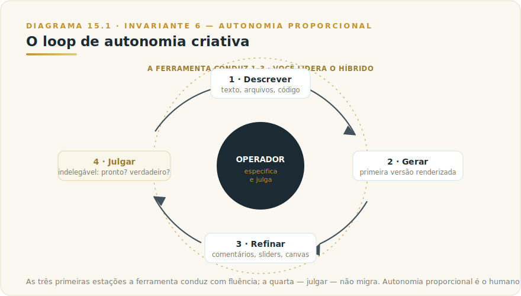
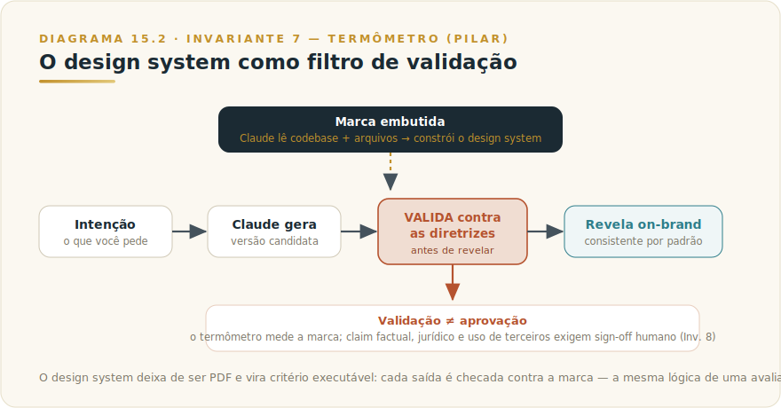

# CAPÍTULO 15
## CLAUDE DESIGN

---

> *"Quando produzir um protótipo deixa de custar uma semana e passa a custar uma tarde, o gargalo não desaparece — ele sobe. Some o trabalho de fazer; sobra o trabalho de decidir o que merece existir. Claude Design é a ferramenta que torna essa subida visível, e a pergunta que ela força não é 'o que consigo gerar', mas 'quanto desta cadeia eu deveria deixar a máquina conduzir'."*

---

> 🧭 **Por que este capítulo é a aplicação do Invariante 6 — Autonomia Proporcional**
>
> Claude Design move a fronteira da autonomia para dentro do trabalho visual. Cowork delegou trabalho de conhecimento sobre arquivos; Code delegou engenharia no terminal; Design delega a produção de protótipos, telas, decks e landing pages — artefatos que antes exigiam um designer e um ciclo de revisão. A tentação é ler isso como "agora qualquer um produz design". A leitura madura é outra: a ferramenta abre um espectro de delegação, e quase todo erro de uso vem de escolher o ponto errado nesse espectro — deixar o Claude conduzir do briefing à produção final quando a tarefa pedia que ele explorasse e você decidisse. O capítulo gira em torno de uma única pergunta de governança: *quanto desta cadeia criativa essa tarefa merece delegar, e onde o julgamento humano e a engenharia de verdade reassumem o comando?*

---

## 15.1 — O CONCEITO INTUITIVO

Existe um custo que todo profissional que já precisou comunicar uma ideia visual conhece de cor: o custo de transformar intenção em artefato. Você sabe o que quer — três direções para uma landing page, um deck que não pareça feito às pressas, um protótipo navegável para testar com clientes — mas entre saber e ter existe um vão. Designers experientes racionam exploração porque cada direção custa horas; quem não tem formação em design simplesmente não atravessa o vão, e a ideia morre como descrição verbal de algo que ninguém viu.

Claude Design ataca esse vão. Você descreve o que precisa e o Claude constrói uma primeira versão — não um esboço esquemático, mas um artefato visual renderizado: uma tela, um deck, uma página interativa. A partir daí você refina por conversa, por comentários ancorados em elementos específicos, por edição direta no canvas, ou por controles deslizantes que o próprio Claude monta para a tarefa. O ciclo é *descrever → gerar → refinar → julgar*, repetido até o artefato estar certo. A Anthropic posiciona o produto como uma forma de "colaborar com o Claude para criar trabalho visual polido" — protótipos, designs, slides, one-pagers e mais.

A descrição soa como "Artifacts para design", e há parentesco — mas a diferença de categoria importa, e é o que justifica este capítulo existir separado do Capítulo 14. Artifacts geram um entregável estruturado dentro do fluxo da conversa. Claude Design é uma superfície dedicada, que conhece a sua marca, sustenta projetos visuais de múltiplas telas, valida o que produz contra as suas diretrizes antes de mostrar, e empacota o resultado para a engenharia construir de verdade. Onde Artifacts é a prancheta que aparece ao lado do chat, Claude Design é o ateliê — com o seu sistema de design embutido nas paredes.

Mas o ponto que organiza o capítulo inteiro não é a lista de capacidades. É o deslocamento que a ferramenta provoca. Quando produzir vira barato e instantâneo, o valor migra para cima na cadeia: para a especificação (saber pedir), para o julgamento (reconhecer o que presta), e para a governança (garantir que o que sai respeita a marca, a verdade e a lei). Claude Design é poderoso na exata medida em que você opera bem essas três camadas que ele *não* automatiza. Quem trata a ferramenta como uma máquina de terceirizar o gosto recebe, em alta velocidade, design medíocre com a sua marca em cima.

---

## 15.2 — ANALOGIA: O ATELIÊ COM UM PROTOTIPADOR INCANSÁVEL

Imagine que você dirige um estúdio criativo e contratou um prototipador sobre-humano: rápido, infatigável, capaz de produzir em minutos a versão visual de qualquer ideia que você descreva. Você pode usá-lo de dois jeitos profundamente diferentes.

No primeiro, você o usa como parceiro de exploração. Diz "me mostre cinco direções para esta home", olha as cinco, descarta três, aponta o que funciona em duas, pede para cruzar os pontos fortes, ajusta o espaçamento aqui, a tipografia ali — e em uma tarde você percorreu um espaço de possibilidades que sozinho levaria uma semana para esboçar. Você continua sendo o diretor de arte. O prototipador produz; você decide. Esse é o uso que rende.

No segundo, você lhe entrega o briefing inteiro e diz "faça tudo, do conceito à versão final que vai pro ar". Ele faz. Devolve algo polido, plausível, que parece pronto. E é exatamente aí que mora o risco, porque "parece pronto" e "está certo" são coisas diferentes — e um prototipador que produz com confiança uniforme não sinaliza qual das suas decisões foi inspirada e qual foi um chute estatístico bem-acabado. Se você não exerceu julgamento ao longo do caminho, você não tem como exercê-lo no fim: a única coisa que sobrou para julgar é um fato consumado.

A diferença entre os dois usos não está na ferramenta — é o mesmo prototipador. Está em *quanto da cadeia você decidiu conduzir*. Nenhum diretor de arte competente assina uma campanha que não dirigiu. O bom uso de Claude Design é, ponto por ponto, a versão digital dessa direção de arte: a máquina amplia drasticamente quanto você consegue explorar e produzir, e o seu trabalho deixa de ser desenhar para virar dirigir — especificar com clareza, julgar com critério, e saber a hora de tirar a mão da máquina e passar o bastão para a engenharia.

---

## 15.3 — EXPLICAÇÃO TÉCNICA

### 15.3.1 — O ciclo central: descrever, gerar, refinar, julgar

O coração do produto é um loop, e entender suas quatro estações é entender onde o seu julgamento entra.

A primeira estação é **descrever**. Você fornece a intenção — em texto, mas não só. Claude Design importa de várias fontes: prompt textual, upload de imagens e documentos (DOCX, PPTX, XLSX), apontamento para uma base de código, e uma ferramenta de captura que recorta elementos diretamente do seu site para que o protótipo se pareça com o produto real. A qualidade do que sai depende da qualidade do que entra: descrição vaga gera primeira versão genérica, e é aqui que a competência de especificação — o Invariante 9 em ação — começa a separar quem extrai valor de quem extrai ruído.

A segunda estação é **gerar**. O Claude constrói uma primeira versão renderizada. Não é um wireframe esquemático: é um artefato visual, e em casos mais avançados um protótipo interativo com comportamento real. Essa velocidade de primeira versão é a alavanca óbvia — mas é também a mais perigosa de usar sozinha, porque um primeiro corte convincente convida a parar de pensar.

A terceira estação é **refinar**, e é onde o produto se diferencia de "gerar imagem com IA". O refino é cirúrgico: você comenta inline num elemento específico, edita o texto diretamente, manipula controles deslizantes — que o próprio Claude gera para a tarefa — para ajustar espaçamento, cor e layout ao vivo, e então pede que a mudança se propague por todo o design. A edição direta no canvas dá controle fino sobre layout, escolha tipográfica e estilo de botões dentro de um protótipo interativo. O refino é o mecanismo pelo qual o seu julgamento entra no artefato sem você precisar saber desenhar.

A quarta estação não está na interface, mas é a que define se a ferramenta foi bem usada: **julgar**. Decidir que está pronto, que respeita a marca, que a afirmação no slide é verdadeira, que o protótipo não coleta dados sem aviso. Essa estação é indelegável. A ferramenta entrega as três primeiras com fluência; a quarta é a fronteira onde o Invariante 6 deixa de ser teoria.

### 15.3.2 — A marca embutida: o design system como governança executável

Aqui está o recurso mais subestimado do produto, e o que mais interessa a um executivo. Durante a configuração, o Claude constrói um **design system** para o seu time lendo a sua base de código e os seus arquivos de design. A partir daí, todo projeto herda automaticamente as suas cores, tipografia e componentes. Você pode importar um ou vários sistemas — de um repositório GitHub, de arquivos de design, ou de uploads brutos — e manter mais de um. E, crucialmente: o Claude **valida as saídas contra essas diretrizes antes de revelar o resultado final**.

Leia essa última frase com o Invariante 7 — Termômetro — em mente, porque é exatamente o que ela descreve. O design system deixa de ser um PDF que ninguém abre e vira um *critério executável*: uma especificação contra a qual cada output é checado automaticamente. É a mesma lógica de uma avaliação automatizada, aplicada à conformidade de marca. Para uma organização que sofre com a entropia visual — cada time produzindo material ligeiramente fora do padrão — isso é uma mudança estrutural: a consistência deixa de depender da disciplina de cada pessoa e passa a ser propriedade do sistema.

Mas atenção à fronteira, porque é onde mora um ponto cego perigoso. Validação automática contra diretrizes **não é aprovação**. O sistema garante que a cor é a sua cor e que a fonte é a sua fonte; não garante que a afirmação de desempenho no banner é verdadeira, que o uso da imagem respeita direitos de terceiros, ou que o claim regulado passa no compliance. Confundir "passou na validação do design system" com "está aprovado para o mundo" é o Invariante 8 — Responsabilidade Indelegável — sendo violado com a aparência de rigor. O termômetro mede a temperatura da marca; ele não assina o documento.

### 15.3.3 — Colaboração e exportação: para onde o artefato vai

Um design em Claude Design não nasce preso à ferramenta. O compartilhamento é escopado pela organização: você mantém um documento privado, libera por link para quem é da sua organização visualizar, ou concede edição para colegas modificarem e conversarem com o Claude juntos, em conversa de grupo. Isso transforma o artefato de entregável solitário em superfície colaborativa — com as implicações de governança que toda superfície colaborativa carrega (quem vê, quem edita, o que sai da organização).

A exportação é deliberadamente ampla: URL interna, pasta, e saída para formatos e ferramentas externas — Canva, PDF, PPTX, HTML autônomo, entre outros destinos que o produto vem expandindo. *A lista corrente de destinos de exportação, o modelo que alimenta a ferramenta e o estado de preview são camada volátil — vivem no [Apêndice Vivo (J)](../04-apendices/L2-APX-J-apendice-vivo.md), não no corpo deste capítulo.* O que não é volátil é o princípio: a exportação ampla é o que impede o produto de virar uma prisão de fornecedor para a sua camada visual. O artefato sai; você não fica refém.

### 15.3.4 — O handoff para o Claude Code: onde a autonomia troca de mãos

Este é o mecanismo que mais bem encarna o Invariante 6, e o que separa o uso ingênuo do maduro. Quando um design está pronto para ser construído de verdade, o Claude empacota tudo num *bundle* de handoff que você passa ao Claude Code (Capítulo 9) com uma única instrução. Há ainda sincronização bidirecional com o Code e um comando `/design` no terminal, fechando um ciclo entre exploração visual e implementação.

O ponto não é a conveniência técnica — é a *coreografia de autonomia* que ela torna possível. Claude Design é a ferramenta da fase de cima: exploração, especificação, validação de conceito, primeira produção. Claude Code é a ferramenta da fase de baixo: implementação de grau de engenharia, com o contexto do repositório real, testes, segurança, escala. O handoff é a articulação entre as duas — e o desenho do produto materializa uma tese que veremos defendida até por quem o critica: o futuro não é "o Claude faz tudo do início ao fim", e sim um modelo híbrido em que a máquina acelera as pontas certas e o humano lidera a travessia. Um protótipo navegável não é um produto. O bundle de handoff é a ponte honesta entre os dois — desde que você atravesse, em vez de fingir que já chegou.

---

## 15.4 — QUANDO USAR E QUANDO EVITAR: O CRITÉRIO DE DECISÃO

Esta é a seção que separa este capítulo de um tour de funcionalidades. Claude Design não é "o jeito novo de fazer tudo que é visual"; é uma superfície com um perfil de autonomia específico, ótima numa faixa da cadeia criativa e perigosa fora dela.

A pergunta de partida é uma só: **esta tarefa é exploração e primeira produção, ou é implementação final de grau de produção?** Se você precisa percorrer direções, validar um conceito, montar um deck on-brand em minutos, transformar um mockup estático em protótipo navegável para testar com usuários sem code review nem PR — Claude Design é a ferramenta, e poucas chegam perto da sua velocidade. Se o que está em jogo é a página que vai pro ar com backend, autenticação, dados reais e LGPD — isso é engenharia de software, mora no Claude Code com o contexto do repositório, e tratar o protótipo como produto é o erro de categoria mais caro que a ferramenta induz.

A segunda pergunta separa Claude Design do seu vizinho, Artifacts (Capítulo 14): **o trabalho é visual/de design com identidade de marca e múltiplas telas, ou é um entregável estruturado pontual dentro da conversa?** Uma calculadora de ROI, um relatório em Markdown, um diagrama — Artifacts resolve dentro do chat. Um sistema de telas que precisa respeitar a marca, ser testado com usuários e seguir para a engenharia — é Claude Design.

A tabela consolida o critério.

| Situação | Superfície certa | Por quê |
|----------|------------------|---------|
| Explorar direções visuais, validar conceito, testar protótipo com usuários | **Claude Design** | Velocidade de primeira versão e refino fino sobre material visual |
| Deck on-brand, landing page, colateral de marketing a partir do design system | **Claude Design** | Marca embutida + validação automática de consistência |
| Entregável estruturado pontual (relatório, calculadora, diagrama) na conversa | **Artifacts** (Cap. 14) | Saída renderizada no fluxo do chat, sem ateliê dedicado |
| Implementação final com backend, auth, dados, escala, LGPD | **Claude Code** (Cap. 9) | Grau de engenharia, com contexto do repositório real |
| Trabalho de conhecimento não-técnico sobre arquivos (síntese, extração) | **Cowork** (Cap. 8) | Mesmo motor agêntico, embalado para resultado documental |

E o critério de quando **evitar** Claude Design — tão importante quanto o de quando usar:

Evite quando a tarefa for, no fundo, **uma decisão de gosto, marca ou verdade que não deveria ser delegada**. A ferramenta produz o artefato; aprovar que ele representa a empresa, que a afirmação é verdadeira e que o uso é legal é seu. Tratar isso como passo de "geração" é o Invariante 8 vestido de produtividade.

Evite quando o caminho mais barato for **fazer você mesmo**. Há um detalhe econômico que a fonte crítica do produto expõe sem rodeios: pedir que o Claude execute *cada* microajuste consome recurso, e nem sempre "feito pela máquina" é mais eficiente que "feito à mão". Claude Design compartilha o pool de uso com o Code e o chat; mover um botão três pixels via prompt pode custar mais — em tokens e em tempo — do que arrastá-lo você mesmo. Use a máquina para o salto, não para o retoque que seu dedo resolve.

Evite **deixar o Claude construir do início ao fim** quando a saída tem consequência. O modelo de uso que rende, segundo praticantes, é híbrido: exploração e primeira produção na ferramenta, e então handoff de grau de engenharia para o Claude Code com o contexto do repositório. Quem pula a fase de julgamento e a fase de engenharia entrega um protótipo polido como se fosse produto — e descobre o vão depois, em produção.

Evite quando **a conformidade de marca dá uma falsa sensação de aprovação completa**. A validação automática contra o design system cobre o visual; ela não cobre o jurídico, o factual nem o ético. Em material regulado, sensível ou de alto risco reputacional, a revisão humana vem depois da validação, não no lugar dela.

> 🎯 **DA CADEIRA DO CTO**
> Uso Claude Design para exploração — e tenho uma regra pessoal que nunca quebro: nenhum artefato gerado aqui vai para produção sem passar pelo Code. O motivo não é desconfiança da ferramenta; é respeito pela distinção entre duas coisas que parecem iguais e não são: *testar uma hipótese* e *construir um sistema*. Quando peço três direções de landing, estou comprando informação sobre o que ressoa com o usuário — e o custo de token dessa exploração é o menor gasto do ciclo. O que me preocupa é o microajuste: quando começo a pedir ao Claude que mova um elemento três pixels à esquerda ou ajuste a sombra de um botão, o custo por gesto dispara e o ganho cai a zero — minha mão no canvas é mais rápida e mais barata. O critério que aprendi: a máquina para o salto de direção, o dedo para o retoque de pixel. A fronteira protótipo→engenharia não é negociável porque não é estética — é onde segurança, autenticação, dados reais e LGPD entram na conversa. Protótipo que parece produto é o passivo mais caro que já vi em due diligence de M&A: você compra uma interface bonita e herda a dívida técnica que ficou embaixo.

> 🎯 **PARA EXECUTIVOS**
> Antes de liberar Claude Design no time, defina três políticas, não três configurações. Primeiro, **governança de marca**: importe o design system oficial como fonte única, mas estabeleça que a validação automática é um *filtro*, não um *aprovador* — material externo, regulado ou de alto risco passa por sign-off humano antes de sair. Segundo, **a fronteira da autonomia**: publique onde termina o trabalho do Claude Design (explorar, prototipar, primeira produção) e onde começa o do humano (julgar) e o do Claude Code (construir em grau de produção), para que ninguém confunda protótipo com produto. Terceiro, **economia de tokens**: como Design divide o pool com Code e chat, instrumente custo por projeto e treine o time a usar a máquina para o salto criativo, não para o microajuste — "deixar o Claude fazer cada edição" não é grátis e raramente é o caminho mais barato. Velocidade de design sem essas três políticas não é ganho de produtividade — é dívida de marca e de custo que vence no pior momento.

---

## 15.5 — EXEMPLO MEMORÁVEL: AS TRÊS DIREÇÕES QUE COUBERAM EM UMA TARDE

*Cenário ilustrativo brasileiro.* Uma líder de produto de uma scale-up de SaaS em Florianópolis recebeu, numa terça-feira, duas frentes com o mesmo prazo curto: validar três direções visuais para a nova landing page de um produto que entrava em beta, e montar um deck para uma reunião de investidores na segunda seguinte. O caminho tradicional seria competir por horas escassas do único designer do time, receber uma direção (não três), e fazer o deck à mão na pressa. O resultado provável: uma direção não testada e um deck que denunciava o aperto.

Ela fez diferente. Conectou o Claude Design ao repositório do produto, e o Claude leu a base de código e os arquivos de design para construir o design system do time — cores, tipografia, componentes, tudo herdado automaticamente em cada projeto a partir dali. Essa foi a primeira decisão de governança: a marca entrou como fonte única, não como algo a ser reinventado a cada tela.

Para a landing, ela descreveu o conceito e pediu três direções. Em vez de uma, teve três protótipos navegáveis em cima da marca real, cada um explorando uma tese diferente de mensagem e hierarquia. Refinou por comentários inline e pelos controles deslizantes — ajustou espaçamento e ênfase ao vivo, sem tocar em código — e levou os três para teste com cinco clientes do beta, sem nenhum code review, sem nenhum PR, sem ocupar o designer. O feedback apontou uma direção vencedora e matou duas hipóteses que, no caminho antigo, teriam ido a produção como achismo. Para o deck, partiu de um outline e chegou a uma apresentação on-brand em minutos, exportada para PPTX e levada ao Canva para o ajuste final.

O que ela fez em seguida é a parte que importa, e é o Invariante 6 inteiro num gesto. Ela **não** mandou o Claude construir a landing vencedora do início ao fim e publicar. Fez três coisas que a máquina não faria por ela. Primeiro, **julgou**: leu cada claim do banner — "reduza X em 40%" — e checou se o número se sustentava, porque um protótipo bonito com uma afirmação falsa é um passivo jurídico com a marca certa. Segundo, **passou o bastão**: empacotou o design vencedor no bundle de handoff e entregou ao Claude Code, que construiu a página de grau de produção com o contexto do repositório real, testes e a integração de dados que um protótipo não tem. Terceiro, **mediu o custo**: percebeu que estava pedindo ao Claude microajustes de pixel que ela mesma resolvia mais rápido no canvas, e redirecionou a máquina para o que só ela fazia bem — gerar e cruzar direções.

A lição estrutural é a redistribuição, não a substituição. Claude Design absorveu o que era caro e mecânico: produzir três direções renderizadas e um deck on-brand. A líder de produto concentrou o que era seu e indelegável: especificar com clareza, julgar a verdade e o gosto, e decidir a hora de trocar a exploração pela engenharia. Tire o julgamento e o handoff dessa história e ela vira advertência — a landing impecável, publicada direto do protótipo, com o claim de 40% que ninguém conferiu e a integração que ninguém construiu.

---

## 15.6 — NA PRÁTICA: TRÊS APLICAÇÕES REPLICÁVEIS

O exemplo anterior conta uma história; esta seção entrega o roteiro. Três aplicações que você pode rodar esta semana. Cada uma segue a mesma forma — *situação → o que fazer → o ponto de julgamento* — porque o passo a passo é replicável, mas é o ponto de julgamento que separa uso profissional de uso ingênuo.

**Aplicação 1 — Do mockup estático ao protótipo navegável para teste, sem PR.**
*Situação:* você tem o mockup de uma funcionalidade e quer testar com cinco usuários antes de comprometer a engenharia. *O que fazer:* aponte o design system para herdar a marca; suba o mockup e descreva o fluxo entre as telas; peça o protótipo navegável; refine cliques e estados pelos comentários inline; compartilhe por link de visualização escopado apenas para o teste. *O ponto de julgamento:* confirme que está testando a **hipótese certa** — o fluxo e a mensagem —, não a fidelidade de pixel; e que nada que o usuário vê promete o que a engenharia ainda não vai entregar. Um teste que valida a tela errada custa mais caro do que não testar.

**Aplicação 2 — Deck on-brand para comitê ou investidor em minutos.**
*Situação:* o outline está pronto, a reunião é amanhã. *O que fazer:* cole o outline; gere o deck sobre o design system; ajuste hierarquia e ênfase pelos controles deslizantes; exporte para PPTX ou envie ao Canva para o passe final. *O ponto de julgamento:* leia cada número e cada afirmação do slide e confirme que são verdadeiros e rastreáveis à fonte. A estética convincente do deck é justamente o que torna uma afirmação frágil mais perigosa — beleza não é evidência (Invariante 1).

**Aplicação 3 — Três direções de landing até o handoff de produção.**
*Situação:* um produto novo entra em beta e você quer validar a mensagem antes de mandar construir. *O que fazer:* descreva o conceito e peça três direções; teste as três com clientes reais; escolha a vencedora e refine; **empacote o bundle de handoff e entregue ao Claude Code com o contexto do repositório** — não publique a partir do protótipo. *O ponto de julgamento:* decida conscientemente onde termina a exploração (Design) e começa a produção de grau de engenharia (Code). Publicar a página direto do protótipo é o erro de categoria que parece atalho e vira dívida.

> 🔧 **EXERCÍCIO**
> Pegue um material visual real seu — uma tela, um deck ou uma landing — e rode uma das três aplicações acima com escopo mínimo de compartilhamento. Ao terminar, escreva as duas frases que nenhuma máquina escreveria por você: **o que você julgou e mudou** depois que o Claude entregou, e **onde você passou o bastão** para a engenharia. Se não conseguir preencher as duas, você delegou demais.

---

## 15.7 — LIMITAÇÕES E CUIDADOS

Vale conhecer com clareza onde Claude Design exige cautela redobrada.

A primeira é o **estado de research preview e a cadência rápida**. O produto nasceu como produto do Anthropic Labs e evolui depressa — modelo que o alimenta, destinos de exportação, escopo e disponibilidade descritos aqui são a foto do momento da redação. O que é volátil mora no Apêndice Vivo (J), não no corpo deste capítulo; decore o mecanismo, consulte o número.

A segunda é a **economia de tokens do microajuste**. Trabalho visual iterativo pode consumir mais do que parece, e Design compartilha o pool de uso com Code e chat. Pedir à máquina cada retoque que sua mão resolveria é troca ruim — de custo e de tempo. A disciplina é usar autonomia onde ela dá salto, não onde ela só substitui um gesto trivial seu.

A terceira é a **validação que não é aprovação**. O design system valida consistência de marca antes de revelar; ele não valida verdade factual, conformidade jurídica nem uso legítimo de ativos de terceiros. Falsa confiança aqui é especialmente traiçoeira porque vem embrulhada em rigor automático (Invariante 1 — Plausibilidade, somado ao Invariante 8).

A quarta é a **fronteira entre protótipo e produto**. Um protótipo navegável não tem backend, autenticação, persistência real, escala nem LGPD resolvidos. O bundle de handoff para o Claude Code existe justamente porque essa travessia é necessária — ignorá-la é o mesmo erro de categoria que o Capítulo 14 alerta sobre Artifacts em produção, agora vestido de design pronto.

A quinta é a **propriedade dos ativos importados**. A captura de elementos do seu site e o upload de arquivos facilitam o trabalho, mas convidam a trazer imagens, fontes e componentes cuja licença talvez não seja sua. O que entra no design herda as obrigações de quem o criou; conveniência de importação não dissolve direito de terceiros.

A sexta é a **governança de compartilhamento e saída de dados**. O compartilhamento escopado por organização é um controle, mas controle que precisa ser usado: link de visualização e acesso de edição ampliam quem vê e o que sai da organização. Em material sensível, o escopo mínimo de compartilhamento é a regra, não a exceção.

---

## 15.8 — CONEXÕES COM OUTROS CAPÍTULOS

- 🔗 **O Invariante que rege este capítulo** → [Framework 3 — Escala de Propriedade do Agente](../../Livro-1-Os-Invariantes/03-frameworks/L1-F3-agente-prop.md)
- 🔗 **O gargalo que sobe para o julgamento e a especificação** → [Framework 4 — Engenharia de Prompt Estendida](../../Livro-1-Os-Invariantes/03-frameworks/L1-F4-prompt-ext.md)
- 🔗 **Validação como critério executável (design system como eval)** → [Framework 8 — Pirâmide da Avaliação](../../Livro-1-Os-Invariantes/03-frameworks/L1-F8-eval-piramide.md)
- 🔗 **Aprovar ≠ gerar: a responsabilidade que não migra** → [Framework 6 — Governança Indelegável](../../Livro-1-Os-Invariantes/03-frameworks/L1-F6-gov-indelegavel.md)
- 🔗 **O vizinho conceitual: entregáveis na conversa** → [Capítulo 14 — Claude Artifacts](L2-C14-artifacts.md)
- 🔗 **Para onde vai o handoff: implementação em grau de produção** → [Capítulo 9 — Claude Code](L2-C09-claude-code.md)
- 🔗 **Mesmo motor agêntico, trabalho documental** → [Capítulo 8 — Claude Cowork](L2-C08-cowork.md)
- 🔗 **Números voláteis (modelo, exportações, status de preview)** → [Apêndice J — Apêndice Vivo](../04-apendices/L2-APX-J-apendice-vivo.md)

---

## 15.9 — RESUMO EXECUTIVO

| Conceito | Síntese |
|----------|---------|
| **O que é Claude Design** | Superfície dedicada para criar trabalho visual com o Claude — protótipos, telas, decks, landing pages — com a marca embutida |
| **Invariante regente** | 6 — Autonomia Proporcional: o ganho é real na faixa de exploração e primeira produção; o julgamento e a engenharia reassumem o comando |
| **O loop central** | Descrever → gerar → refinar → julgar; as três primeiras estações são da ferramenta, a quarta é indelegável |
| **Design system embutido** | O Claude lê código e arquivos, herda a marca e valida saídas contra as diretrizes antes de revelar — governança executável (Inv. 7) |
| **O deslocamento** | Produzir virou barato; o gargalo subiu para especificar e julgar (Inv. 9) |
| **Handoff para o Code** | Bundle de entrega para implementação de grau de produção — a articulação honesta entre protótipo e produto |
| **Quando usar** | Exploração, validação de conceito, protótipo para teste, deck/landing on-brand a partir do design system |
| **Quando evitar** | Implementação final de produção; decisões de gosto/marca/verdade; microajuste que sua mão resolve; deixar o Claude fazer do início ao fim |
| **Regra de ouro** | A máquina para o salto, o humano para o julgamento, o Code para a produção. Validação de marca não é aprovação |

---

## 15.10 — VALIDAÇÃO UAU

| # | Critério | Você consegue? |
|---|----------|----------------|
| 1 | **Clareza** — Explicar em 60 segundos por que "produzir ficou barato" desloca o gargalo para especificar e julgar | ☐ |
| 2 | **Profundidade** — Nomear as quatro estações do loop e dizer qual é indelegável e por quê | ☐ |
| 3 | **Decisão** — Escolher corretamente entre Claude Design, Artifacts, Claude Code e Cowork para três tarefas suas reais | ☐ |
| 4 | **Governança** — Distinguir, com um exemplo, "passou na validação do design system" de "aprovado para o mundo" | ☐ |
| 5 | **Autonomia proporcional** — Definir, para um projeto seu, onde termina a máquina, onde entra o seu julgamento e onde começa a engenharia | ☐ |

🔗 **Próximo capítulo:** [Capítulo 16 — Claude Research](L2-C16-research.md)

---

> *"Claude Design não democratiza o gosto — democratiza a produção. O gosto continua escasso, e agora vale mais, porque é a única coisa que a máquina não gera junto com o pixel. Quem entendeu isso usa a ferramenta para explorar mais longe e decidir melhor. Quem não entendeu publica, em alta velocidade, design medíocre com a própria marca em cima."*
