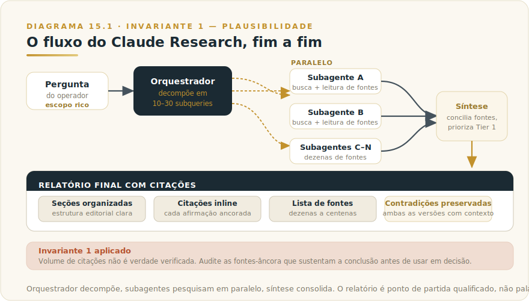
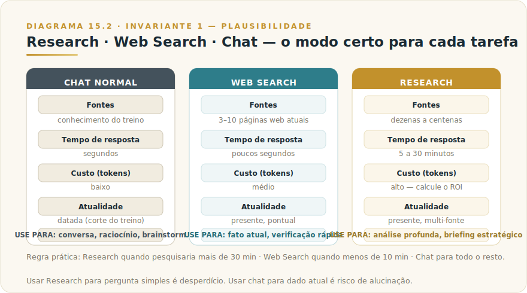

# CAPÍTULO 16
## CLAUDE RESEARCH

---

> *"Research transforma Claude em pesquisador profundo, com subagentes paralelos consultando dezenas de fontes em minutos. Bem usado, vira a alavanca de produtividade mais clara em trabalho cognitivo intensivo."*

---

> 🧭 **Por que este capítulo é a aplicação do Invariante 1 — Plausibilidade**
>
> Research entrega pesquisa, não verdade. O ganho real é cobertura de fontes e velocidade de síntese; a calibração de confiança continua sendo trabalho do operador, com honestidade de citação como filtro central.
> Invariante secundário: **Inv. 9 — Operador**.

---

## 16.1 — O CONCEITO INTUITIVO

Existe uma classe de tarefa em trabalho profissional que sempre consumiu tempo desproporcional — e que mesmo profissionais experientes raramente conseguem fazer com qualidade alta no prazo curto que negócios exigem. Pesquisa profunda multi-fonte: entender um tema complexo, consultar dezenas de fontes, conciliar informações contraditórias, identificar tendências, produzir síntese organizada. Análise competitiva, due diligence, pesquisa de mercado, revisão de literatura, briefing antes de reunião importante. Cada um pode levar horas ou dias quando feito direito, e a maioria das pessoas faz mal por falta de tempo.

Claude Research é a resposta da Anthropic para essa classe de problema. Quando você ativa o modo Research, em vez de responder do próprio treino, o modelo inicia um processo agêntico: orquestrador interno decompõe a pergunta em dezenas de subqueries, dispara subagentes paralelos que pesquisam cada uma na web, lê dezenas ou centenas de fontes, sintetiza os achados em relatório estruturado com citações auditáveis. O processo dura de alguns minutos a dezenas de minutos, dependendo da profundidade (latências atuais no [Apêndice Vivo (J)](../04-apendices/L2-APX-J-apendice-vivo.md)). O output é tipicamente equivalente a horas de pesquisa humana.

Para quem aprende a usá-lo bem, Research vira provavelmente a alavanca de produtividade mais visível em trabalho cognitivo intensivo — ganhos de 5x a 20x em velocidade de produzir material pesquisado de qualidade. Para quem não descobre, a capacidade fica adormecida atrás de um botão na interface.

---

## 16.2 — ANALOGIA: O CHEFE DE PESQUISA COM TIME DEDICADO

Pense na diferença entre dois cenários. No primeiro, você é o pesquisador único: navegador aberto, abrindo abas, lendo páginas uma a uma, anotando trechos, comparando fontes, organizando. Leva tempo, exige concentração contínua, e você sabe que cobre apenas uma fração do que existe sobre o tema.

No segundo, você é o chefe de pesquisa de uma agência especializada, com oito pesquisadores júnior à disposição. Você define o escopo, decompõe em frentes, delega cada frente a um pesquisador. Eles trabalham em paralelo durante uma manhã e entregam relatório consolidado com citações e análises preliminares. Você revisa, refina, edita — e em uma tarde tem material que sozinho levaria semanas. A natureza do trabalho mudou de execução para curadoria.

Claude Research é essa segunda configuração. Você é o chefe de pesquisa, o sistema é a equipe — mas em minutos em vez de manhãs. Subagentes têm capacidade de leitura menor que pesquisadores sêniors, mas em volume e velocidade compensam; o output pode ser refinado em ciclos sucessivos. Para a maioria das tarefas de pesquisa não acadêmica, esse arranjo entrega valor real.

---

## 16.3 — EXPLICAÇÃO TÉCNICA

### 16.3.1 — Como Research funciona por dentro

Quando você ativa o modo Research e formula uma pergunta complexa, vários processos coordenados acontecem em paralelo — e entender essa mecânica ajuda a calibrar o uso.

> 📊 **Diagrama 16.1 — Fluxo do Claude Research**
>
> 
>
> *Orquestrador decompõe, subagentes pesquisam em paralelo, síntese consolida com citações.*

Primeiro, um **orquestrador central**, frequentemente rodando Opus, analisa sua pergunta e decompõe em dez a trinta subqueries específicas. Se você pediu "análise estratégica do mercado brasileiro de fintechs em 2026", o orquestrador pode decompor em subqueries como "principais fintechs brasileiras com valuation acima de 100 milhões em 2026", "regulação BCB sobre Open Finance 2025-2026", "tendências de Pix entre setores", "comparação com mercado mexicano de fintechs", "saídas e fusões relevantes 2025-2026", e assim por diante.

Em seguida, o sistema dispara **subagentes paralelos**, cada um responsável por uma subquery. Cada subagente faz busca web, lê as páginas retornadas, extrai informação relevante e organiza em formato estruturado. Operam de forma independente e paralela — o que reduz drasticamente o tempo total comparado a buscas sequenciais.

Quando os subagentes terminam, o **orquestrador agrega** os resultados, identifica contradições entre fontes (se uma fonte diz X e outra diz Y, ambas são preservadas com contexto), descarta informação de qualidade baixa, prioriza fontes mais autoritativas, e constrói uma síntese estruturada.

A **síntese final** é apresentada ao usuário como relatório com seções organizadas, citações inline para cada afirmação importante, lista completa de fontes consultadas no final, e em alguns casos visualizações como tabelas comparativas ou cronologias.

O tempo total e o custo em tokens dependem da profundidade configurada e do volume de fontes — consulte o [Apêndice Vivo (J)](../04-apendices/L2-APX-J-apendice-vivo.md) para benchmarks atuais. O princípio que não muda: Research é significativamente mais caro que uma chamada normal, e esse custo deve entrar no cálculo de ROI.

### 16.3.2 — Como ativar e calibrar

A forma de ativar Research varia conforme plano e interface. Em claude.ai com plano adequado, há botão dedicado no menu de tools. Em Claude Desktop, integração similar. A profundidade é tipicamente configurável: pesquisa rápida (cinco a sete fontes em poucos minutos) a pesquisa profunda (cinquenta ou mais fontes ao longo de meia hora).

A formulação da pergunta importa mais em Research do que em chat normal. Perguntas vagas geram pesquisas vagas. Em vez de "me fale sobre IA no Brasil", peça "produza análise estratégica de adoção de IA em empresas brasileiras de médio porte em 2026, com foco em setores financeiro e saúde, incluindo principais provedores, custos típicos, principais desafios reportados, e previsão para 2027". Quanto mais escopo e critério, melhor o resultado.

Vale também explicitar **tipo de fontes desejadas**. "Privilegie fontes oficiais como bancos centrais, consultorias top-tier e papers acadêmicos" guia o orquestrador na priorização. "Inclua perspectivas brasileiras especificamente" evita resultado dominado por conteúdo americano. "Sinalize quando informação for incerta ou disputada" calibra honestidade epistêmica.

### 16.3.2.1 — Anatomia de um prompt de Research que rende

Vale dissecar a estrutura de um prompt de Research eficaz. A diferença entre pedido medíocre e pedido excelente determina a qualidade do output em proporção que a maioria subestima. Um prompt profissional tem seis componentes.

O primeiro é **objetivo declarado**. Não é a pergunta, é o propósito por trás dela. "Vou apresentar para o conselho na próxima semana, decidindo entre entrar ou não no mercado mexicano" é diferente de "vou estudar para uma palestra". O Research calibra profundidade conforme o objetivo declarado.

O segundo é **escopo delimitado**. Países, setores, recortes temporais, segmentos específicos. "Brasil e México, fintechs B2C, últimos 24 meses" produz resultado focado em vez de panorama amplo de baixa utilidade.

O terceiro é **tipo de saída esperada**. Relatório executivo, análise comparativa, briefing de uma página, deep dive técnico. Sinalizar formato afeta tom, estrutura e nível de detalhe.

O quarto é **tipo de fonte preferida**. Como vimos antes, priorizar Tier 1 e Tier 2 vira diferença grande na confiabilidade.

O quinto é **perguntas específicas a responder**. Em vez de "análise geral", liste 4 a 8 perguntas que precisam ser respondidas. Isso vira estrutura do relatório.

O sexto é **restrições e cuidados**. Sinalizar viés a evitar, conflitos de interesse a destacar, incertezas a explicitar. "Sinalize quando uma estatística vier de fonte com agenda política clara" calibra ceticismo automático.

### 16.3.2.2 — Exemplo de prompt completo de Research profissional

Para tornar concreto, segue um prompt real que entrega resultado de qualidade alta em domínios executivos:

```
OBJETIVO: Preparar decisão do conselho da empresa X sobre entrar
no mercado mexicano de fintechs B2B nos próximos 12 meses.

ESCOPO: México, fintechs B2B, mercado de PME brasileira tradicional,
horizonte 2024-2027.

SAÍDA: Relatório executivo de ~25 páginas em Markdown, com sumário
de 2 páginas no início.

FONTES PREFERIDAS: Bancos centrais (Banxico, CNBV), consultorias
top-tier (McKinsey, BCG, Bain LATAM), papers acadêmicos peer-reviewed,
relatórios oficiais de associações setoriais mexicanas.

PERGUNTAS A RESPONDER:
1. Qual o tamanho atual e projetado do mercado mexicano de fintechs B2B?
2. Quem são os 5 principais players e qual sua estratégia?
3. Qual o ambiente regulatório (Lei Fintech mexicana, Banxico, CONDUSEF)?
4. Quais barreiras de entrada para empresa brasileira (capital, licenças, parcerias)?
5. Que empresas brasileiras já entraram, com que resultados?
6. Quais 3 cenários de entrada possíveis, com prós e contras?
7. Que riscos macro (câmbio, política, segurança) merecem atenção?
8. Recomendação preliminar com justificativa.

RESTRIÇÕES:
- Sinalize quando dados vierem de fontes com agenda comercial óbvia
- Distinga entre 'fato verificado' e 'projeção' explicitamente
- Cite páginas e datas das fontes principais
- Marque informações incertas com flag de confiança
```

Esse prompt, executado em Research profundo, tipicamente entrega relatório de 20 a 30 páginas com 100 a 200 fontes citadas, em 20 a 35 minutos. Comparado com pesquisa manual equivalente que levaria 40 a 80 horas, a redistribuição de tempo cognitivo é dramática.

### 16.3.2.3 — Padrões avançados de Research

Profissionais maduros usam padrões refinados para extrair valor adicional do Research.

O **Research em camadas** consiste em executar primeiro um Research raso para mapear o território, em seguida usar os achados para formular Research profundo direcionado. Em vez de uma pesquisa gigante, duas pesquisas em sequência, cada uma calibrada pelo aprendizado da anterior.

O **Research adversarial** instrui o sistema a buscar deliberadamente evidências contra a tese principal. "Após produzir a análise principal, dedique uma seção a contra-argumentos sólidos, com fontes que defendem posição oposta". Isso reduz risco de viés de confirmação e fortalece a robustez da decisão.

O **Research comparativo** roda múltiplas pesquisas paralelas sobre alternativas, depois consolida em matriz de decisão. Útil quando você precisa comparar 3 a 5 opções (cidades, fornecedores, tecnologias, estratégias) com critérios consistentes.

O **Research de validação** complementa pesquisa manual prévia. Você fez sua própria análise, agora pede que Research busque furos, evidências contraditórias, dados atualizados. Útil para revisão antes de comprometer publicamente com posição.

### 16.3.3 — Quando usar Research

Nem toda pergunta merece Research. O modo é poderoso, mas caro em tokens e tempo — usar para pergunta simples é desperdício. Vale conhecer os critérios.

> 📊 **Diagrama 16.2 — Research versus Web Search versus Chat Normal**
>
> 
>
> *Três modos com complexidades e custos diferentes. Use o certo para cada tarefa.*

Research é a escolha certa quando a pergunta exige **integração de múltiplas fontes** com triagem e síntese. Análise competitiva, panorama de setor, comparação entre alternativas, due diligence preliminar, pesquisa de tendências, briefing antes de reunião importante — casos em que uma única página não responde e síntese estruturada é o que você precisa.

Web Search é melhor quando você precisa de **fato específico e atual**: cotação de uma ação hoje, evento recente, especificação de produto lançado essa semana. A pergunta tem resposta concreta em uma ou duas páginas, e o overhead do Research seria desproporcional.

Chat normal sem busca é melhor quando a pergunta é **conhecida ou conversacional**: o conhecimento já está no treino de Claude, ou o pedido é brainstorm, raciocínio sobre conteúdo que você forneceu, conversa exploratória sem necessidade de fonte externa.

A regra prática é usar Research quando você gastaria mais de meia hora pesquisando manualmente o tema, web search quando gastaria menos de dez minutos, e chat normal para tudo mais.

---

## 16.4 — VALIDAÇÃO E LIMITES

Research é poderoso, mas tem limitações que vale conhecer antes de usar resultados em decisões importantes.

### 16.4.0 — O problema que ninguém menciona: relatório bem-formatado com cem fontes que produz falsa confiança

Existe um risco específico do Research que vai além de "a fonte pode ser ruim". É mais insidioso, porque se parece exatamente com qualidade.

Você recebe um relatório de 30 páginas, com sumário executivo, sete seções estruturadas, tabelas comparativas, e 140 fontes citadas em rodapé com links. A formatação é impecável. A lógica narrativa é coesa. O executivo que recebe aquilo sente que foi feito trabalho cuidadoso, equivalente a semanas de consultoria.

**Esse sentimento é o problema.**

Volume de citações não é evidência de rigor epistêmico. É evidência de que muitos documentos foram lidos. Mas 140 fontes de qualidade variável, triadas automaticamente por um sistema que otimiza coerência narrativa, podem produzir relatório que soa autoritativo e contém premissas falsas distribuídas de forma invisível. Cada afirmação individual é "citada". A síntese entre elas — o argumento, a conclusão, a recomendação — não é auditável.

**Como o executivo que usa Research de forma madura desconfia:**

Primeiro, **audita as fontes âncora, não todas as fontes**. Identifique as três a cinco citações que sustentam a conclusão principal do relatório. Abra-as. Leia o trecho original. Verifique se o que Claude diz que a fonte diz é o que a fonte realmente diz. Você não precisa verificar 140 fontes — precisa verificar as cinco que sustentam o argumento que você vai usar.

Segundo, **procura a afirmação que você mais quer que seja verdade**. Essa é a mais perigosa. Viés de confirmação é confortável, e um relatório de Research pode encontrar fontes que confirmam o que você já acredita com aparente rigor. Questione especificamente os números e conclusões mais favoráveis à sua tese.

Terceiro, **identifica o que o relatório não encontrou**. Pergunte a Claude explicitamente: "O que eu precisaria saber que contradiz a conclusão principal deste relatório? Quais perspectivas estão sub-representadas?" Se o sistema não consegue articular nenhuma, o relatório tem viés de cobertura, não rigor.

Quarto, **distingue fato verificado de síntese inferida**. Fontes suportam afirmações factuais pontuais. A interpretação dessas afirmações em conjunto, a narrativa que as conecta, a recomendação que emerge — essas são do modelo, não das fontes. Trate a narrativa com o mesmo ceticismo que você trataria a opinião de um analista inteligente mas falível.

Quinto, **cuidado especial com números compostos**. "O mercado cresceu X% em Y anos e deve atingir Z em W" parece uma afirmação única. São pelo menos três afirmações empilhadas, cada uma com sua fonte, cada uma com seu erro potencial. Erros se multiplicam na composição.

> **O Invariante 1 aplicado aqui não é "desconfie de Claude".**
> É: **não confunda volume de citação com verdade verificada.** Um relatório de Research bem-feito é ponto de partida qualificado para decisão. A decisão em si — e a responsabilidade por ela — continua sendo do operador, com auditoria proporcional ao risco.

A primeira: **fontes não são todas confiáveis**. O sistema lê o que está na web, e a web tem qualidade variável. Research faz triagem razoável, privilegiando fontes mais autoritativas, mas sem julgamento infalível. Blog desconhecido pode aparecer ao lado de paper acadêmico — valide fontes críticas antes de citar em decisão.

A segunda: **alucinação ainda é possível, embora reduzida**. Modelos de linguagem têm tendência a preencher lacunas com plausibilidade. Mesmo com citações inline, verifique afirmações importantes contra as fontes originais. Em decisões com consequência real, o relatório de Research é ponto de partida, não palavra final.

A terceira: **viés de cobertura web**. Research só acessa o que está indexado. Temas de nicho, conteúdo em português brasileiro específico, ou fontes pagas atrás de paywall podem ficar mal cobertos. Em domínios especializados, complemente com fontes próprias.

A quarta: **tempo de processamento**. Research demora minutos a dezenas de minutos — em fluxos interativos, isso pode quebrar o ritmo. Use-o como ferramenta de produção, quando você tem outras coisas para fazer em paralelo, não como resposta instantânea.

A quinta: **custo em tokens significativo**. Cada pesquisa profunda pode consumir o equivalente a vinte conversas comuns. Em uso intensivo, isso aparece na fatura. Dimensione conforme orçamento e ROI esperado.

---

## 16.5 — EXEMPLO MEMORÁVEL: O BRIEFING DE QUATRO HORAS QUE VIROU VINTE MINUTOS

Uma diretora executiva de uma empresa brasileira de logística precisava se preparar para uma reunião crítica com investidores sobre expansão para o México. A reunião era em três dias, e ela precisava chegar com conhecimento sólido sobre o mercado mexicano de logística: principais players, regulação relevante, casos de empresas brasileiras que já tinham feito esse movimento, tendências macro que pudessem afetar a decisão.

Na rotina anterior, esse tipo de preparação levaria seis a dez horas de trabalho pessoal — relatórios, consultores, anotações, síntese manual. Com prazo apertado e agenda cheia, ela sabia que chegaria à reunião com menos preparação do que gostaria.

Em vez disso, ela testou usar Claude Research. Formulou uma pergunta cuidadosa, com escopo claro, com tipo de fontes desejadas, com nível de profundidade explicitado. Ativou Research e foi tratar de outras urgências. Em cerca de vinte minutos, recebeu de volta um relatório estruturado com dezenas de fontes citadas, várias delas autoritativas (consultorias top-tier, órgãos reguladores mexicanos, papers acadêmicos, reportagens especializadas). Números exatos de tempo e volume variam com o produto — o que interessa aqui é o padrão.

A primeira reação foi ceticismo. "Isso pode estar cheio de erros — e me entregou tudo em vinte minutos." Ela dedicou cerca de duas horas validando as informações mais críticas: dados numéricos, regulações citadas, referências a casos de empresas. A taxa de acerto foi alta — a grande maioria das afirmações conferiu com as fontes, e os pequenos erros encontrados eram questões de precisão decimal ou data, não erros conceituais.

Refinou o relatório em mais duas iterações com Claude, pedindo aprofundamento em pontos específicos e correções nas pequenas imprecisões identificadas. No final, em algumas horas totais (Research + validação + refinamento + adaptação), tinha material melhor que conseguiria produzir em muitas horas de trabalho manual.

Na reunião com investidores, o conhecimento profundo foi um dos fatores que credenciou a operação para discussão séria de aporte. A reunião, planejada como exploratória, virou conversa adiantada sobre estrutura do investimento. **O ROI específico daquela sessão de Claude Research, em termos de oportunidade que se abriu, foi calculado pela CEO como sendo de algumas ordens de grandeza acima do custo da assinatura.**

A lição estrutural não é sobre velocidade isolada, é sobre **mudança no que se torna viável fazer bem**. Antes de Research, certos tipos de preparação cuidadosa eram pulados em rotinas executivas pela falta de tempo, e a qualidade das decisões refletia essa falta. Com Research, preparação profunda fica acessível em prazos curtos, e o padrão de decisão sobe. **A diferença não é fazer o mesmo trabalho em menos tempo, é fazer trabalho que antes era inviável fazer.**

> 🎯 **PARA EXECUTIVOS**
> Claude Research é alavanca específica para trabalho cognitivo intensivo de pesquisa, preparação e síntese. Em organizações com perfil executivo que toma muitas decisões com base em análise estruturada, essa capacidade transforma a forma como dirigentes se preparam para reuniões, decisões e iniciativas. O treinamento para uso eficaz é trivial, e o impacto na qualidade da decisão é estrutural.

---

## 16.6 — FLUXOS PROFISSIONAIS COM RESEARCH

Três fluxos recorrentes em uso profissional de Research — conhecê-los acelera a adoção.

O primeiro é **briefing antes de reunião importante**. Você tem reunião em alguns dias com cliente novo, parceiro potencial, investidor, ou interlocutor sobre tema desconhecido. Use Research para produzir briefing estruturado em poucas horas em vez de dias. Inclua na pergunta o objetivo da reunião, o que você sabe e o que não sabe, e o tipo de material que seria útil. Output costuma chegar pronto para virar suas notas pessoais com mínima edição.

O segundo é **análise comparativa de alternativas**. Você precisa escolher entre opções, sejam fornecedores, plataformas, parceiros, estratégias. Use Research para gerar análise estruturada de cada opção, com critérios consistentes, fontes auditáveis, e recomendação preliminar. Refine com seus próprios critérios contextuais que Claude não conhece, e chegue à decisão com fundamentação clara.

O terceiro é **acompanhamento de tendência**. Para temas que importam para sua organização ao longo do tempo (regulação setorial, tecnologia emergente, comportamento de mercado), use Research periodicamente para gerar atualizações. Em vez de monitorar manualmente, você dispara pesquisa estruturada a cada três meses, com mesmo escopo, e tem visão consistente da evolução ao longo do ano.


---

## 16.7 — NA PRÁTICA: TRÊS APLICAÇÕES REPLICÁVEIS

O fluxo anterior apresenta categorias; esta seção entrega o passo a passo executável. Três aplicações que você pode iniciar esta semana. Cada uma segue a forma — *Situação → O que fazer → O ponto de julgamento* — porque o roteiro é replicável, mas é o ponto de julgamento que separa uso profissional de uso ingênuo.

**Aplicação 1 — Due diligence de fornecedor em 48 horas.**
*Situação:* você precisa avaliar um novo fornecedor de tecnologia antes da reunião de aprovação com o conselho; o prazo é curto e a análise tradicional levaria semanas. *O que fazer:* formule prompt de Research com escopo declarado (setor, país, últimos 24 meses), tipo de fontes preferidas (consultorias top-tier, órgãos reguladores, mídia especializada), e cinco a oito perguntas específicas — saúde financeira, casos de referência, litígios, comparação com alternativas. Ative Research profundo e use o tempo de processamento para outras urgências. Revise o relatório em camadas: sumário primeiro, depois as seções que embasam a recomendação. *O ponto de julgamento:* antes de levar o relatório ao conselho, abra as três a cinco citações que sustentam a recomendação central e confirme que o que Claude diz que as fontes dizem é o que as fontes realmente dizem. Um relatório de Research é ponto de partida qualificado; a assinatura embaixo da recomendação é sua, não do modelo (Invariante 1 — Plausibilidade).

**Aplicação 2 — Preparação profunda para reunião com novo cliente ou parceiro.**
*Situação:* você tem reunião importante em 48 horas com executivo de empresa que você conhece pouco; chegar sem contexto é perda de credibilidade. *O que fazer:* formule Research com escopo declarado — empresa, setor, notícias recentes, principais desafios do mercado em que atua, decisões estratégicas recentes que apareçam em fontes públicas. Peça síntese em formato de briefing executivo de uma página, com pontos para agenda, e contexto para perguntas de abertura que demonstrem que você entende o problema do interlocutor. Refine em ciclo iterativo se alguma frente precisar de mais profundidade. *O ponto de julgamento:* identifique o que no briefing é fato verificável (resultado financeiro publicado, produto lançado, notícia de mercado) e o que é inferência ou projeção do modelo. Use apenas os fatos verificáveis como âncoras na conversa; a inferência pode orientar suas perguntas, mas não deve ser apresentada como dado (Invariante 1 — Plausibilidade).

**Aplicação 3 — Acompanhamento trimestral de tendência regulatória ou tecnológica.**
*Situação:* você precisa manter-se atualizado sobre tema crítico para o negócio — regulação do BCB, movimentos de um concorrente, ou avanços em tecnologia relevante — mas monitoramento manual consome horas que você não tem. *O que fazer:* construa um prompt de Research padrão com escopo fixo, fontes preferidas e as mesmas perguntas a cada ciclo. Execute a cada três meses com o mesmo prompt. Compare os relatórios entre ciclos para ver o que mudou, o que ficou estável e o que foi confirmado ou refutado em relação ao trimestre anterior. Salve os relatórios em Project dedicado para acesso histórico. *O ponto de julgamento:* sinalize internamente a diferença entre o que o Research encontrou (citado em fonte pública) e o que você inferiu da comparação entre ciclos (sua análise). Quando levar essa visão para decisões de negócio, deixe explícito o que é dado e o que é interpretação sua — especialmente ao apresentar para stakeholders que não viram o processo (Invariante 1 — Plausibilidade; Invariante 8 — Responsabilidade Indelegável).

> 🔧 **EXERCÍCIO**
> Escolha uma reunião importante que você tem nas próximas duas semanas. Formule um prompt de Research completo para ela — com objetivo declarado, escopo delimitado, tipo de fontes preferidas, e cinco perguntas específicas. Execute e receba o relatório. Agora faça uma coisa que a máquina não faz: **identifique as três afirmações do relatório em que você mais quer acreditar** e verifique cada uma contra a fonte primária citada. Documente o resultado: o número confirmou, estava errado, ou a fonte não dizia o que o relatório afirmava? Essa verificação é o Invariante 1 em prática real.

---

## 16.8 — CONEXÕES COM OUTROS CAPÍTULOS

- 🔗 **Agentes como base técnica do Research** → [Capítulo 12](../../Livro-1-Os-Invariantes/02-capitulos/L1-C12-agentes.md)
- 🔗 **Subagentes paralelos em arquitetura agêntica** → [Capítulo 12](../../Livro-1-Os-Invariantes/02-capitulos/L1-C12-agentes.md)
- 🔗 **Claude Web Search para fato pontual** → [Capítulo 17](L2-C17-web-search.md)
- 🔗 **Subagents do Claude para fluxos customizados** → [Capítulo 32](L2-C32-subagents-workflows.md)
- 🔗 **Claude para executivos e tomada de decisão** → [Capítulo 1](L2-C01-executivos.md)
- 🔗 **Segurança e validação de fontes em IA** → [Capítulo 37](../../Livro-1-Os-Invariantes/02-capitulos/L1-C19-seguranca.md)

---

## 16.9 — RESUMO EXECUTIVO

| Conceito | Síntese |
|----------|---------|
| **Research** | Pesquisa profunda multi-fonte com subagentes paralelos |
| **Mecânica** | Orquestrador decompõe → subagentes paralelos → síntese consolidada |
| **Tempo** | 5 a 30 minutos por pesquisa |
| **Fontes** | Dezenas a centenas, com triagem e citações |
| **Quando usar** | Pesquisa profunda, análise integrada, briefing estratégico |
| **Quando evitar** | Pergunta simples, fato pontual, conversa exploratória |
| **Limites** | Qualidade variável de fontes, alucinação possível, custo significativo |

---

## 16.10 — CHECKLIST DO CAPÍTULO

- [ ] Distinguir Research de Web Search e de chat normal
- [ ] Formular pergunta de Research com escopo, fontes e profundidade
- [ ] Identificar três tarefas suas que se beneficiariam de Research
- [ ] Aplicar protocolo de validação após receber relatório
- [ ] Calibrar uso conforme custo de tokens e ROI da pesquisa
- [ ] Adotar Research como hábito profissional para briefings importantes

---

## 16.11 — PERGUNTAS DE REVISÃO

1. Por que decomposição em subqueries paralelas é vantagem arquitetural?
2. Em que situação Research é desperdício comparado a Web Search?
3. Por que validar fontes críticas após Research continua sendo necessário?
4. Como você incorporaria Research em rotina executiva sua?
5. Qual o limite ético de citar relatório de Research como se fosse seu próprio trabalho?

---

## 16.12 — EXERCÍCIOS PRÁTICOS

### Exercício 1 — Briefing real
Para uma reunião importante nas próximas duas semanas, formule pergunta de Research detalhada e execute. Compare com a preparação que você faria sem Research.

### Exercício 2 — Análise competitiva
Para alternativas que sua organização está avaliando, peça Research comparativa estruturada. Valide com fontes próprias se aplicável.

### Exercício 3 — Tendência setorial
Para tema relevante ao seu setor, peça Research sobre tendências dos próximos doze meses. Confronte com o que você já sabia. Documente o que aprendeu de novo.

### Exercício 4 — Validação rigorosa
Para um Research que você executou, valide manualmente todas as afirmações numéricas críticas contra as fontes citadas. Documente taxa de acerto.

---

## 16.13 — PROJETO DO CAPÍTULO

**Incorpore Research em rotina executiva por um mês.**

Estabeleça rotina mensal de pelo menos três Research profundos sobre temas importantes para sua função. Pode ser briefing antes de reunião crítica, análise comparativa, acompanhamento de tendência. Mantenha registro do que cada Research consumiu e do que rendeu. Ao final do mês, avalie o ROI percebido em qualidade de decisões e em tempo economizado.

---

## 16.14 — REFERÊNCIAS PRINCIPAIS

📚 **Documentação e estudos**

- [Anthropic — Multi-agent Research System](https://www.anthropic.com/engineering/built-multi-agent-research-system)
- [Claude Docs — Research mode](https://docs.claude.com/)

---

## 16.15 — VALIDAÇÃO UAU

| # | Critério | Você consegue? |
|---|----------|----------------|
| 1 | **Clareza** — Explicar Claude Research para um executivo em 90 segundos, usando analogia | ☐ |
| 2 | **Profundidade** — Defender quando usar Research, Web Search ou chat normal, com critérios objetivos | ☐ |
| 3 | **Aplicação** — Identificar três situações de trabalho seu onde Research entregaria ganho dramático | ☐ |
| 4 | **Conexão** — Articular como Research integra agentes (ver L1-C12), subagents (Cap 31), AI Fluency (Cap 1) | ☐ |
| 5 | **Curiosidade UAU** — Está com vontade de avançar para Web Search e os demais produtos do ecossistema | ☐ |

**5 de 5?** Avance. Você acaba de consolidar a fundação do ecossistema Claude.
**3 ou 4?** Releia 15.4 (caso da diretora). É onde Research vira ROI claro.
**Menos de 3?** O capítulo merece releitura prática com Research aberto em paralelo.

---

🔗 **Próximo capítulo:** [Capítulo 17 — Claude Web Search](L2-C17-web-search.md)


> *"Research não é só pesquisa mais rápida, é pesquisa profunda que antes era inviável fazer no prazo executivo. A diferença não é velocidade, é qualidade de decisão acessível."*
