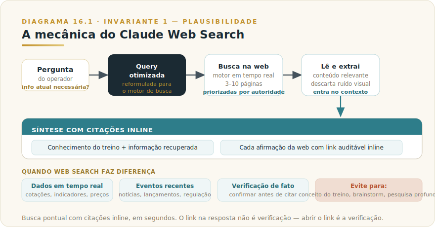
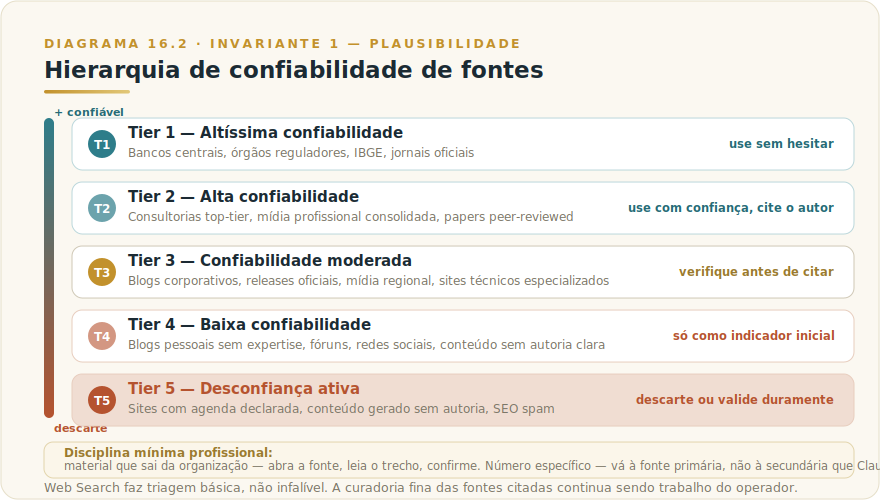

# CAPÍTULO 17
## CLAUDE WEB SEARCH

---

> *"Web Search é o complemento que tira Claude do isolamento do treino e o coloca em contato com o mundo atual. Bem usado, fecha a lacuna mais óbvia entre conhecimento congelado e realidade viva."*

---

> 🧭 **Por que este capítulo é a aplicação do Invariante 1 — Plausibilidade**
>
> Web Search é o antídoto parcial à Plausibilidade: quando o modelo não sabe, pergunta a uma fonte fora dele. Não elimina alucinação; restringe a superfície em que ela atua.

---

## 17.1 — O CONCEITO INTUITIVO

Existe uma limitação estrutural de modelos de linguagem que vimos no Capítulo 2. Todo modelo foi treinado com dados até uma data de corte; depois disso, não sabe nada do que aconteceu, a menos que receba a informação no contexto da conversa. Para Claude em maio de 2026, o conhecimento direto se estende até alguns meses atrás — lacuna que cresce conforme o tempo passa.

Web Search resolve essa lacuna de forma elegante. Quando ativado, Claude pode, durante o raciocínio, fazer consultas à web em tempo real, ler páginas relevantes, extrair informação e usar isso para compor a resposta. Diferente de Research — processo profundo com subagentes paralelos — Web Search é mais leve, mais rápido e mais pontual. O modelo consulta algumas páginas em uma única busca, em segundos (latências e volumes atuais no [Apêndice Vivo (J)](../04-apendices/L2-APX-J-apendice-vivo.md)). A resposta integra os achados com citações inline.

Em uso profissional, Web Search é a alavanca que separa "Claude limitado ao corte de treino" de "Claude conectado ao presente". Quando você precisa de cotação atual, evento recente, especificação de produto lançado essa semana ou status de regulação que mudou ontem, Web Search resolve. O modelo fica mais útil porque para de inventar plausibilidade onde pode fornecer fato verificado.

---

## 17.2 — ANALOGIA: O ASSISTENTE QUE TEM ACESSO AO JORNAL

Pense em dois assistentes executivos. O primeiro é extremamente competente — vasto conhecimento sobre praticamente tudo que importa para o seu trabalho — mas trancado em um escritório sem internet ou jornais. Para temas do dia, ele responde "pelo que eu sei até dois meses atrás, era assim". Útil para temas estáveis, problemático para tudo que evolui.

O segundo tem a mesma competência, mas pode consultar jornais, sites e fontes oficiais quando precisa. Para tema estável, responde do próprio conhecimento. Para tema atual, consulta as fontes, volta com a informação atualizada e cita a origem. A combinação dos dois modos é o que o torna útil para qualquer pergunta.

Claude com Web Search é o segundo assistente. O modelo escolhe automaticamente quando consultar a web e quando responder do treino — ou você força o comportamento quando faz diferença. Conhecer essa mecânica é parte do uso fluente.

---

## 17.3 — EXPLICAÇÃO TÉCNICA

### 17.3.1 — Como funciona a busca por dentro

Quando Web Search está ativo e Claude identifica que a pergunta exige informação atual, alguns passos coordenados acontecem.

> 📊 **Diagrama 17.1 — Mecânica do Claude Web Search**
>
> 
>
> *Busca pontual com citações inline, em segundos.*

Primeiro, Claude formula a query de busca otimizada para o motor de pesquisa, frequentemente diferente da pergunta original do usuário. Se você pergunta "qual o impacto da nova regulação do Banco Central sobre Open Finance?", Claude pode buscar com query mais específica como "regulação Open Finance Banco Central Brasil 2026 mudança recente".

Em seguida, o sistema executa a busca em um motor de pesquisa em tempo real, recebe a lista de resultados e seleciona as fontes mais promissoras — tipicamente entre três e dez páginas. A seleção prioriza fontes autoritativas e descarta spam ou conteúdo de baixa qualidade, mas sem garantia perfeita.

Depois, o sistema lê o conteúdo dessas páginas, extrai trechos relevantes, descarta ruído visual e elementos sem relação. Esse conteúdo entra no contexto da conversa como material recuperado, pronto para Claude usar na resposta.

Finalmente, Claude compõe a resposta integrando o conhecimento próprio com a informação recuperada, com citações inline para cada afirmação derivada da web. As citações aparecem como referências inline com link para a fonte — o comportamento exato varia por interface.

### 17.3.2 — Como ativar e calibrar

A forma de ativar Web Search depende da interface e do plano — consulte o [Apêndice Vivo (J)](../04-apendices/L2-APX-J-apendice-vivo.md) para o estado atual. O princípio que não muda: pode ser ativado pontualmente ou permanecer sempre ativo. Em modo automático, Claude decide quando buscar; em modo manual, você controla.

Para uso profissional, vale conhecer algumas técnicas que melhoram qualidade da busca.

Primeiro, **seja específico sobre temporalidade quando importa**. Em vez de "regulação do BCB sobre fintechs", peça "regulação do BCB sobre fintechs em 2026 ou mais recente". Isso ajuda Claude a calibrar a query e a priorizar fontes atuais.

Segundo, **especifique o tipo de fonte quando relevante**. "Privilegie fontes oficiais como Bacen e CVM" guia a triagem. "Inclua perspectivas brasileiras" evita resultado dominado por conteúdo americano.

Terceiro, **peça verificação cruzada em fatos críticos**. "Verifique este dado em pelo menos duas fontes independentes" força Claude a buscar confirmação.

Quarto, **explicite quando alguma fonte específica deve ser consultada**. "Consulte o site oficial da empresa para o número mais recente" direciona para fonte de verdade quando você a conhece.

### 17.3.3 — Quando Web Search rende mais

Web Search faz diferença visível em algumas classes específicas de pergunta, e vale conhecer para ativar conscientemente.

A primeira classe são **dados em tempo real**, como cotações, preços, indicadores econômicos publicados regularmente, status de mercado. Sem Web Search, Claude inventa ou se recusa. Com Web Search, retorna número atual com fonte.

A segunda são **eventos recentes**, das últimas semanas ou meses. Lançamentos de produto, mudanças regulatórias, notícias de mercado. O conhecimento de treino fica defasado, Web Search atualiza.

A terceira são **especificações de produto**, especialmente para produtos lançados ou atualizados recentemente. Versões de software, configurações de planos, novos recursos.

A quarta são **verificações de fato**, em que você quer confirmar afirmação específica antes de citar em material seu. Web Search permite que Claude valide com fonte ao vivo em vez de afirmar do treino.

A quinta são **pesquisas de fontes pontuais**, em que você precisa encontrar uma página específica que mencione algo. Web Search é mais eficaz que tentar lembrar URL ou usar mecanismo de busca tradicional.

### 17.3.4 — Quando não usar

Por outro lado, há classes de pergunta em que Web Search é desperdício ou pode até atrapalhar.

**Conceitos conhecidos do treino**. Se você está pedindo explicação sobre algo estável (machine learning, contabilidade, gramática portuguesa), o conhecimento de treino é suficiente, e busca adiciona ruído sem ganho.

**Pesquisas profundas**. Se você precisa de análise multi-fonte com síntese estruturada, use Research em vez de Web Search. Web Search é pontual, Research é arquitetural.

**Análises sobre conteúdo já no contexto**. Se você anexou documento e quer análise dele, busca externa pode confundir o modelo. Mantenha foco no material fornecido.

**Brainstorm criativo**. Para gerar ideias, pesquisar opções, explorar possibilidades, busca não ajuda. Você quer o conhecimento integrado do modelo, não fatos pontuais.

---

## 17.4 — VALIDAÇÃO DE FONTES, A DISCIPLINA QUE NINGUÉM ENSINA

Web Search retorna o que está disponível na web — e a web tem qualidade radicalmente variável. Em decisões críticas, a triagem fina das fontes continua sendo responsabilidade humana.

> 📊 **Diagrama 17.2 — Hierarquia de Confiabilidade de Fontes**
>
> 
>
> *Web Search faz triagem básica. A curadoria fina continua sendo sua.*

A **Tier 1**, com confiabilidade altíssima, inclui bancos centrais, órgãos reguladores oficiais, institutos de estatística governamentais como IBGE, jornais oficiais como Diário Oficial. Quando uma afirmação vem dessas fontes, você pode usar sem hesitar, e citar diretamente em material profissional.

A **Tier 2**, com confiabilidade alta, inclui consultorias top-tier como McKinsey, BCG, Bain, Deloitte, Gartner, Forrester, junto com mídia profissional consolidada como Financial Times, Valor Econômico, The Economist, e papers peer-reviewed publicados em revistas científicas reputadas. Use com confiança, citando autor e veículo.

A **Tier 3**, com confiabilidade moderada, inclui blogs corporativos oficiais, releases de empresas, mídia regional menos rigorosa, sites técnicos especializados. Use, mas verifique antes de citar em material crítico. Releases podem ter viés institucional, blogs podem ter precisão variável.

A **Tier 4**, com confiabilidade baixa, inclui blogs pessoais sem expertise demonstrada, fóruns como Reddit, redes sociais, conteúdo agregado sem autoria clara. Use apenas como indicador inicial para investigação posterior. Nunca cite como fonte primária em material profissional.

A **Tier 5**, com desconfiança ativa, inclui sites com agenda política clara que precisaria ser declarada, conteúdo gerado por IA sem autoria, fontes obscuras, conteúdo de SEO spam. Descarte ou trate com ceticismo elevado, validando duramente contra fontes melhores antes de aceitar qualquer afirmação.

Quando Web Search retorna mistura de fontes, vale olhar os domínios antes de aceitar afirmação importante. Se a citação principal vem de bacen.gov.br, você está em terreno sólido. Se vem de algum blog desconhecido, vale verificar antes.

---

## 17.5 — EXEMPLO MEMORÁVEL: O FATO QUE NÃO ERA FATO

Em fevereiro de 2026, um diretor de uma empresa brasileira de saúde preparava apresentação sobre tendências de IA no setor, com prazo de três dias. Sob pressão, pediu a Claude com Web Search ativo "qual o tamanho do mercado de IA aplicado à saúde no Brasil em 2025". A resposta veio com número específico e impressionante, citando uma "consultoria especializada".

Antes de incluir na apresentação para o board, ele resolveu validar a fonte. Clicou no link da citação. O destino era um blog de empresa pequena, conteúdo claramente otimizado para SEO, sem autoria identificada, e o número citado não tinha origem documentada. Investigando mais, descobriu que aquela "consultoria especializada" não existia como entidade formal. O número provavelmente havia sido inventado por um redator e replicado por agregadores, virando "fato consensual" sem nunca ter sido verificado.

A validação levou quinze minutos. Refez a pergunta pedindo explicitamente "use apenas fontes Tier 1, como IBGE, Anvisa, ABDI, ou consultorias top-tier reconhecidas, com nome próprio do autor da estimativa". A nova resposta veio com números bem mais conservadores, vindos de relatório da Gartner e de estudo da ABDI, com referências verificáveis. Os números eram cerca de 40% menores que o "fato" anterior — mas eram verdade.

A apresentação foi feita com os dados validados. Na discussão, um executivo do board questionou exatamente esse número. Como a fonte era sólida, a resposta foi tranquila e o argumento sustentou. Com o número anterior, teria sido pego em informação fabricada — com consequência direta para a credibilidade junto à diretoria.

A lição estrutural é dura mas necessária. **Web Search reduz risco de alucinação porque traz fontes, mas não elimina risco quando as fontes são ruins. A curadoria humana das fontes citadas continua sendo parte indispensável do uso profissional, especialmente em material que vai sair da sua organização ou subir em hierarquia decisória.** Quinze minutos validando podem salvar credibilidade construída em anos.

> 🎯 **PARA EXECUTIVOS**
> Em qualquer apresentação, relatório ou comunicação executiva onde números específicos são citados, **valide as fontes retornadas pelo Web Search antes de usar**. Especialmente para estatísticas de mercado, percentuais e projeções, que são as informações mais frequentemente fabricadas em conteúdo SEO. O custo de validar é minutos, o custo de não validar pode ser reputação.

### 17.5.1 — O padrão de falsa confiança específico do Web Search

Web Search tem um risco diferente do Research — mas igualmente silencioso. No Research, o perigo é o relatório denso com muitas fontes que parece completo. No Web Search, o perigo é mais simples e mais frequente: **a resposta com citação inline que parece verificada, mas cuja fonte você nunca abriu**.

Claude retorna uma afirmação com número preciso e um link. Você lê a afirmação. O link está lá. Você assume que o link suporta a afirmação. Você não clica.

Esse é o padrão. A citação funciona como sinal visual de rigor, independentemente do que está na fonte. Em uso profissional, um número citado sem abertura da fonte é tão não-verificado quanto um número sem citação — a diferença é que parece verificado, o que é pior.

**A disciplina mínima para uso profissional:**

- Afirmação que vai sair da sua organização (deck, email, relatório, publicação) → **abra a fonte, leia o trecho, confirme**.
- Afirmação numérica específica (percentual, valor, data) → **verifique contra a fonte primária, não a secundária que Claude citou**.
- Afirmação que contradiz o que você sabia antes → **investigue a contradição, não aceite a versão nova só porque tem link**.
- Afirmação que confirma perfeitamente a sua tese → **trate com ceticismo redobrado**. Viés de confirmação tem link agora.

O Invariante 1 aplicado ao Web Search não é "não use Web Search". É: **o link não é a verificação. Abrir o link é a verificação.**

---

## 17.6 — NA PRÁTICA: TRÊS APLICAÇÕES REPLICÁVEIS

O exemplo anterior mostra o risco; esta seção entrega o roteiro para evitá-lo. Três aplicações que você pode rodar esta semana, cada uma com o passo a passo e o ponto de julgamento que a torna profissional.

**Aplicação 1 — Verificação de número antes de apresentar.**
*Situação:* você está finalizando deck ou relatório com estatística de mercado que obteve de fonte secundária; a apresentação é para liderança ou cliente e você não quer ser apanhado com dado incorreto. *O que fazer:* ative Web Search com instrução explícita de fonte Tier 1 ou Tier 2 — "verifique este número em fonte primária como IBGE, Bacen, consultoria top-tier com nome do autor, ou paper peer-reviewed". Receba a resposta com citações inline. Abra cada link citado, leia o trecho original, confirme que o que Claude diz que a fonte diz é o que a fonte realmente diz. Ajuste se necessário. *O ponto de julgamento:* a verificação que vale não é Claude retornar uma citação — é você abrir a fonte. Citação visível sem leitura da fonte é ilusão de verificação, não verificação. O número que vai no slide tem sua assinatura embaixo, não a do modelo (Invariante 1 — Plausibilidade).

**Aplicação 2 — Atualização de contexto antes de reunião urgente.**
*Situação:* você tem reunião em duas horas com interlocutor que veio a público ontem com declaração relevante, ou cuja empresa anunciou mudança estratégica recente que afeta a conversa; você não teve tempo de acompanhar. *O que fazer:* ative Web Search e peça contexto com escopo temporal explícito — "notícias sobre [empresa/pessoa] dos últimos sete dias, com foco em [tema específico], priorizando fontes Tier 1 e Tier 2". Receba o sumário com citações. Abra as duas ou três citações principais para confirmar os fatos que você vai usar na reunião. *O ponto de julgamento:* distinga o que você vai usar como âncora factual (verificado) do que vai usar como contexto de fundo (não verificado, não cite como dado). A diferença entre "li que a empresa anunciou X" e "a empresa anunciou X" é a diferença entre informação e fato verificado — e ela aparece quando o interlocutor pergunta a fonte (Invariante 1 — Plausibilidade).

**Aplicação 3 — Monitoramento pontual de mudança regulatória.**
*Situação:* você precisa saber se houve mudança em regulação relevante para o negócio — normativa do BCB, resolução da CVM, instrução da Anvisa — sem querer fazer Research completo para uma resposta pontual. *O que fazer:* ative Web Search com instrução de fonte Tier 1 exclusiva — "busque em sites oficiais como bacen.gov.br, cvm.gov.br ou anvisa.gov.br publicações sobre [tema] dos últimos 90 dias". Se Claude retornar resultado sem fonte Tier 1, peça refinamento explícito. Se não houver resultado confiável, sinalize isso ao invés de aceitar resposta vaga. *O ponto de julgamento:* em matéria regulatória, a única fonte que importa é o texto oficial no site do órgão. Resumo em blog ou notícia de segunda mão pode estar desatualizado ou incorreto. Se a citação não apontar para o Diário Oficial ou site do regulador, a verificação não terminou — termine você (Invariante 1 — Plausibilidade; Invariante 8 — Responsabilidade Indelegável).

> 🔧 **EXERCÍCIO**
> Pegue um material profissional seu — deck, relatório, e-mail para cliente — que contenha pelo menos um número de mercado ou estatística. Identifique a fonte original desse número. Agora peça a Claude com Web Search que **verifique esse número em fonte Tier 1 ou Tier 2**, com link para a fonte. Abra o link e leia o trecho. O número é o mesmo? A fonte diz o que Claude disse que dizia? Documente o resultado. Esse exercício, feito uma vez com atenção, muda como você usa Web Search para sempre.

---

## 17.7 — CONEXÕES COM OUTROS CAPÍTULOS

- 🔗 **RAG e recuperação de informação** → [Capítulo 6](../../Livro-1-Os-Invariantes/02-capitulos/L1-C06-rag.md)
- 🔗 **Alucinação e validação** → [Capítulo 2](../../Livro-1-Os-Invariantes/02-capitulos/L1-C02-como-modelos-funcionam.md)
- 🔗 **Claude Research, busca profunda** → [Capítulo 16](L2-C16-research.md)
- 🔗 **Claude Code com web search integrado** → [Capítulo 9](L2-C09-claude-code.md)
- 🔗 **Segurança em uso de IA** → [Capítulo 37](../../Livro-1-Os-Invariantes/02-capitulos/L1-C19-seguranca.md)

---

## 17.8 — RESUMO EXECUTIVO

| Conceito | Síntese |
|----------|---------|
| **Web Search** | Busca pontual integrada ao chat, com citações inline |
| **Mecânica** | Query otimizada → resultados → leitura → síntese com citações |
| **Quando usar** | Dados em tempo real, eventos recentes, verificação de fato |
| **Quando evitar** | Conceitos do treino, pesquisa profunda, brainstorm criativo |
| **Hierarquia de fontes** | Tier 1 oficial, Tier 2 consultoria/mídia profissional, até Tier 5 spam |
| **Validação** | Triagem básica automática, mas curadoria fina continua humana |

---

## 17.9 — CHECKLIST DO CAPÍTULO

- [ ] Distinguir Web Search de Research e de chat normal
- [ ] Ativar Web Search seletivamente conforme tarefa
- [ ] Validar fontes antes de citar em material profissional
- [ ] Aplicar a hierarquia de cinco tiers de confiabilidade
- [ ] Especificar tipo de fonte e temporalidade na pergunta
- [ ] Reconhecer quando Web Search vira ruído em vez de ajuda

---

## 17.10 — PERGUNTAS DE REVISÃO

1. Por que Web Search é diferente de Research e quando cada um faz sentido?
2. Como você instrui Claude a priorizar fontes específicas?
3. Quais são os cinco tiers de confiabilidade e exemplos de cada?
4. Por que validar fontes manualmente continua sendo necessário?
5. Em que situação Web Search atrapalha em vez de ajudar?

---

## 17.11 — EXERCÍCIOS PRÁTICOS

### Exercício 1 — Comparação de modos
Faça a mesma pergunta sobre tendência recente em três modos diferentes (chat normal, Web Search, Research). Compare qualidade, profundidade e tempo.

### Exercício 2 — Validação rigorosa
Para uma resposta de Claude com Web Search, valide cada fonte citada manualmente. Documente quais eram Tier 1-2 e quais eram Tier 3-5.

### Exercício 3 — Calibração de fontes
Refaça uma busca pedindo explicitamente apenas Tier 1 e Tier 2. Compare o resultado com a busca aberta original.

### Exercício 4 — Auditoria de uso
Revise suas últimas cinco respostas de Claude com Web Search. Quantas você citou em material profissional sem validar fontes? Documente os riscos identificados.

---

## 17.12 — PROJETO DO CAPÍTULO

**Estabeleça política pessoal de validação de fontes.**

Para uso profissional de Web Search, escreva sua política de validação. Em quais tipos de pergunta você sempre valida? Em quais aceita sem verificar? Que tiers você considera aceitáveis para citação direta? Que tiers exigem validação adicional? Esse documento, mesmo pessoal, vira hábito que protege sua credibilidade em uso intensivo.

---

## 17.13 — REFERÊNCIAS PRINCIPAIS

📚 **Documentação**

- [Anthropic — Web search](https://www.anthropic.com/news/web-search)
- [Claude Docs](https://docs.claude.com/)

---

## 17.14 — VALIDAÇÃO UAU

| # | Critério | Você consegue? |
|---|----------|----------------|
| 1 | **Clareza** — Explicar Web Search e quando usá-lo em 60 segundos | ☐ |
| 2 | **Profundidade** — Defender a hierarquia de cinco tiers de confiabilidade | ☐ |
| 3 | **Aplicação** — Aplicar validação de fontes em três usos reais nesta semana | ☐ |
| 4 | **Conexão** — Articular como Web Search conecta com RAG (Cap 6), Research (Cap 15), segurança (Cap 37) | ☐ |
| 5 | **Curiosidade UAU** — Está com vontade de entrar em Claude Code, o produto que vem mudando como software é construído | ☐ |

**5 de 5?** Avance. Você acabou de adicionar disciplina de validação ao seu uso de IA.
**3 ou 4?** Releia 16.5 (caso do diretor). É onde a disciplina vira salva-vidas reputacional.
**Menos de 3?** O capítulo merece releitura, especialmente se você usa Web Search em material profissional.

---

🔗 **Próximo capítulo:** [Capítulo 18 — Claude Voice](L2-C18-voice.md)

---

> *"Web Search tira Claude do isolamento do treino. Validar as fontes que ele retorna é o que tira você do risco de citar fato inventado."*
