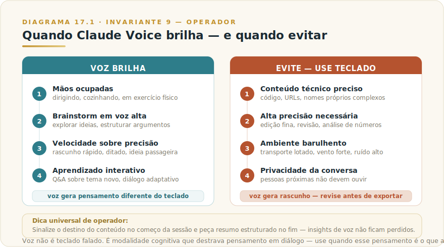

# CAPÍTULO 18
## CLAUDE VOICE

---

> *"Voz não é teclado falado. É modalidade distinta com regras próprias, que destrava pensamento, mas degrada precisão. Usar bem é saber em qual situação cada propriedade importa mais."*

---

> 🧭 **Por que este capítulo é a aplicação do Invariante 9 — Operador**
>
> Voice muda o canal, não o contrato. Mas a pergunta real que o Invariante 9 coloca aqui é mais fina: **o que você faz com o pensamento que voz destravou?**
>
> Conversa de voz com Claude não deixa rastro automático. Insights que emergem em 40 minutos de caminhada desaparecem quando você tira o fone. Se você transcreve, sumariza e guarda — você é o operador que validou e reteve. Se envia o resumo para um cliente sem revisar — você assinou o que o modelo sintetizou da sua própria fala. Se usa a posição que articulou em voz como base de uma decisão sem confirmar depois — você delegou julgamento executivo ao fluxo oral sem ponto de verificação.
>
> A responsabilidade do operador em Voice é dupla: decidir o que reter do que foi dito, e revisar antes de qualquer exportação. Voz gera rascunho de velocidade elevada. O operador decide o que desse rascunho vira entrega.

---

## 18.1 — O CONCEITO INTUITIVO

A capacidade de conversar com Claude por voz, em qualidade natural com latência baixa, amadureceu ao longo de 2024 e 2025 até virar feature de primeira classe nas interfaces mobile e desktop em 2026. Hoje, voz no Claude é fluente em português brasileiro, compreende contexto conversacional, responde com prosódia natural sem sotaque artificial, e suporta conversas longas sem fadiga aparente. A tendência inicial é tratar tudo isso como "teclado falado mais rápido".

Essa tendência subestima o que voz oferece como modalidade própria. Voz não é ditado acelerado. É uma forma de cognição diferente — o pensamento se estrutura enquanto é articulado, ideias se desenvolvem em diálogo em vez de em escrita solitária, o ritmo conversacional muda o tipo de raciocínio que emerge. Profissionais que descobrem essa diferença passam a usar voz não apenas quando teclado é inviável, mas quando o pensamento que voz permite é superior ao que teclado produziria, mesmo disponível.

Para algumas tarefas, voz é a ferramenta certa pela natureza da tarefa em si, não pela conveniência da situação. Brainstorm criativo, reflexão pós-evento, aprendizado interativo, exploração de ideias soltas, conversas que exigem fluência de raciocínio em vez de precisão de redação. Para outras, teclado continua sendo melhor, e tentar forçar voz é desperdício. Saber distinguir é parte do uso profissional fluente.

---

## 18.2 — ANALOGIA: O PENSAMENTO QUE SE FORMA ENQUANTO FALA

Pense em duas formas de chegar a uma ideia clara sobre um tema difícil. Na primeira, você senta com tela em branco e tenta articular sua posição em texto. Revisões, parágrafos apagados, reordenação, refinamento. O resultado tem virtudes de clareza estrutural que escrita madura traz.

Na segunda, você caminha falando em voz alta com um colega capaz — ele escuta, faz perguntas pontuais, oferece perspectivas alternativas. O pensamento se forma no momento da articulação, com ramificações inesperadas surgindo conforme você fala. O resultado pode ser estruturalmente mais solto, mas frequentemente captura nuances que escrita pura não capturaria, porque o diálogo segue caminhos que silêncio não segue.

Claude Voice é a segunda configuração, disponível sob demanda. Você fala, ele escuta e responde, você reage. O ciclo gera tipo de pensamento que escrita solitária não gera — e para tarefas em que esse pensamento é o desejado, voz é ferramenta superior, não substituta de conveniência. Profissionais maduros usam ambas as modalidades conforme o tipo de saída cognitiva que precisam produzir.

---

## 18.3 — EXPLICAÇÃO TÉCNICA

### 18.3.1 — Onde voz existe no ecossistema

Voz está disponível nas interfaces principais do Claude — disponibilidade por plano e plataforma no [Apêndice Vivo (J)](../04-apendices/L2-APX-J-apendice-vivo.md). O princípio que não muda: Mobile é onde a experiência tende a ser mais polida; Desktop e Web têm suporte crescente.

A mecânica básica é a mesma em todas. Você toca botão de voz, fala normalmente, Claude transcreve em tempo real (você vê o texto aparecer enquanto fala), processa o conteúdo, e responde por voz com áudio sintetizado de alta qualidade. Você pode interromper a resposta para fazer pergunta de follow-up, criando dinâmica conversacional natural.

Em 2026, a qualidade de voz suporta português brasileiro de forma fluente, com modelo treinado para sotaques regionais variados, e síntese de saída com prosódia próxima de fala humana. A latência fim a fim fica na faixa de conversa humana natural — números atuais no [Apêndice Vivo (J)](../04-apendices/L2-APX-J-apendice-vivo.md).

### 18.3.2 — Quando voz é a escolha certa

Vale conhecer com precisão os casos em que voz entrega vantagem sobre teclado, e os casos em que é desperdício ou contraproducente.

> 📊 **Diagrama 18.1 — Quando Usar Claude Voice**
>
> 
>
> *Voz brilha em alguns contextos e atrapalha em outros. Conhecer a diferença vale tanto quanto a técnica.*

**Voz brilha em quatro classes de situação.** A primeira é quando as **mãos estão ocupadas** — dirigindo, cozinhando, em exercício físico, segurando criança no colo. Voz é a única opção viável, e a cognição com IA aparece em momentos antes inacessíveis. A segunda é **brainstorm e pensamento em voz alta**: o objetivo é explorar ideias soltas, e o ritmo conversacional ajuda o pensamento a fluir de formas que escrita não permitiria. A terceira é quando **velocidade importa mais que precisão** — primeira versão de e-mail, ideia rápida que você quer registrar, ditado de notas. A quarta é **aprendizado interativo**: você quer ser ensinado sobre tema novo em modalidade Q&A, interrompendo com perguntas conforme aparecem.

**Voz é desperdício — use teclado — em situações opostas.** Conteúdo técnico com nomes próprios, comandos de programação, URLs, números longos: o reconhecedor de voz pode errar de formas frustrantes. Trabalho que exige precisão alta, como edição cuidadosa, revisão fina ou análise de números específicos. Ambientes barulhentos — transporte público lotado, vento forte, ruído de fundo — que degradam o reconhecimento. Situações em que a privacidade da conversa importa e você não quer que pessoas próximas escutem o que está pedindo.

### 18.3.3 — Quatro padrões profissionais

Quatro padrões recorrentes em uso profissional de voz que vale internalizar.

O **brainstorm estruturado pré-evento** é o padrão mais transformador para quem tem agenda intensa. Você tem reunião importante em algumas horas e usa quinze a vinte minutos no carro, caminhando, articulando em voz alta com Claude. "Vou apresentar X amanhã — me ajude a pensar em três ângulos principais, dois riscos a antecipar, e uma pergunta de abertura que demonstre que entendo o problema do interlocutor." Claude responde, você refina, adiciona contexto, ele estrutura. Quando chega à reunião, está mentalmente preparado de um jeito que teclado não entregaria com a mesma fluência.

A **reflexão pós-evento** é o complemento do anterior. Saindo de reunião importante, você dedica algum tempo conversando com Claude sobre o que aconteceu. "A reunião com cliente X correu assim, ele mencionou pontos A, B e C, e a decisão ficou em aberto sobre D. O que você acha que eu poderia ter feito melhor?". Esse tipo de processamento estruturado em voz, logo após o evento, captura insights que ficam perdidos se você espera até voltar à mesa de trabalho.

O **ditado para rascunho** é o padrão mais utilitário. Em vez de digitar e-mail, post ou mensagem, você dita o conteúdo geral por voz — Claude estrutura, refina a linguagem, e você revisa por texto antes de enviar. A velocidade de ditado contra digitação é tipicamente 3x a 5x maior, especialmente para conteúdo conversacional ou exploratório.

O **aprendizado por diálogo** é o padrão mais subutilizado e potencialmente o mais valioso a longo prazo. Em vez de ler material denso sobre tema novo, você pede a Claude que te ensine em modalidade Q&A. "Me ensina sobre teoria moderna de portfólio, eu interrompo com perguntas conforme aparecem". A interação adaptativa, em que Claude ajusta profundidade conforme suas reações, costuma produzir aprendizado mais profundo que leitura passiva equivalente em tempo.

### 18.3.4 — A mecânica cognitiva: por que voz produz pensamento diferente

Sem esta seção, o capítulo fica em "dica de produtividade". Voz não é atalho — é modalidade cognitiva com características documentadas que diferem da escrita.

**Pensamento declarativo versus pensamento exploratório.** Escrita profissional pressiona por afirmação: você escreve o que acredita, revisa, consolida. Voz conversacional pressiona por exploração: você testa posições, contradiz a si mesmo, deixa afirmações incompletas que o interlocutor completa. A diferença não é estilística — é estrutural no tipo de raciocínio que cada modalidade convida.

**O papel do interlocutor que faz perguntas.** Pesquisas em psicologia cognitiva há décadas documentam que raciocínio em voz alta com interlocutor que faz perguntas pontuais produz raciocínio diferente de pensamento silencioso. O interlocutor não precisa ser humano — precisa responder em tempo real com perguntas que forçam você a precisar o que estava vago. Claude faz isso. A conversa de 40 minutos da estudante de mestrado (seção 17.4) não funcionou porque Claude é inteligente. Funcionou porque Claude perguntou "isso contradiz a leitura X?" em exatamente o momento em que a pergunta era útil.

**Latência zero de julgamento externo.** Na escrita, um editor interno impede que você articule posições incompletas. Na voz, esse editor tem latência maior. Você diz coisas que ainda não sabia que pensava — e muitas vezes é dessas formulações que vêm os insights. Claude não julga prematuridade de pensamento, o que cria espaço para que o pensamento incompleto seja dito, reagido, desenvolvido.

**Cognição distribuída no tempo.** Escrita é produto finalizado no momento em que para. Voz em conversa estendida distribui o raciocínio no tempo, com o início da conversa sendo contexto que o final refina. Um problema que parece confuso nos primeiros dez minutos frequentemente se clarifica nos minutos vinte a trinta, não porque você pesquisou mais, mas porque articulou mais.

**A implicação prática:** para problemas em que você está travado — sabe que precisa pensar, mas escrita solitária bloqueia, ou o problema é de estruturação, não de falta de informação — voz em diálogo é a ferramenta certa. Não porque é mais rápida. Porque o tipo de raciocínio que produz é diferente, e frequentemente é o que o problema exige.

### 18.3.5 — A dica do gancho contextual

Existe uma técnica simples mas valiosa que vale conhecer. **Comece e termine sessões longas de voz indicando o destino do que conversaram**. No início, "vou conversar sobre análise estratégica do projeto X, anote tudo que sair de relevante no Project correspondente". No fim, "agora resuma essa conversa em formato estruturado para eu revisar depois no Web". Esse hábito garante que insights bons gerados em voz não se percam quando você troca de contexto, e que material útil esteja prontamente disponível em texto para uso posterior.

---

## 18.4 — EXEMPLO MEMORÁVEL: A CONVERSA DE 40 MINUTOS QUE VIROU TESE

Uma estudante de mestrado em administração estava travada em sua dissertação no início de 2026. O tema era complexo, ela tinha lido muito material, mas não conseguia formar uma posição clara sobre a contribuição original que sua pesquisa traria. Sentar para escrever virava bloqueio. Toda tentativa terminava em parágrafos hesitantes que ela apagava no dia seguinte.

Por sugestão de uma colega, decidiu mudar de abordagem. Em vez de tentar escrever, foi caminhar no parque com Claude Voice ativado e começou a explicar para ele o que estava tentando dizer. Sem pressão de redação formal, sem expectativa de texto pronto — apenas conversa por voz com alguém que escutava com atenção.

Os primeiros vinte minutos foram exploratórios. Ela articulava posições, Claude fazia perguntas pontuais ("isso contradiz a leitura X que você fez na semana passada?", "você está separando bem o argumento A do argumento B?"), ela se corrigia, refinava, descobria nuances. Por volta dos 25 minutos, disse algo que ela mesma não tinha pensado antes daquela frase sair. Era a contribuição original que procurava há semanas — articulada com clareza pela primeira vez.

Ao final dos 40 minutos, ela pediu a Claude que resumisse os pontos principais da conversa, com a estrutura argumentativa que ela tinha desenvolvido. O resumo veio organizado, com a tese central destacada, três argumentos de sustentação, evidências que ela tinha mencionado em conversa, contraponto que ela ainda precisava resolver. Esse resumo virou o esqueleto do capítulo central da dissertação, que ela escreveu em duas semanas com fluência que antes parecia impossível.

A lição estrutural não é sobre IA em academia — é sobre **um tipo de cognição que escrita solitária bloqueia, mas voz em diálogo destrava**. Pesquisas em psicologia cognitiva apontam que pensamento em voz alta, especialmente com interlocutor que faz perguntas pontuais, produz raciocínio diferente do pensamento silencioso. Para problemas em que você está travado, mudar de modalidade pode ser a diferença entre semanas de bloqueio e horas de avanço. **Claude Voice torna esse interlocutor disponível a qualquer momento, em qualquer lugar, com paciência infinita para o seu processo.**

> 🎯 **PARA EXECUTIVOS**
> Em decisões complexas em que você se percebe travado, considere mudar modalidade. Vinte minutos de caminhada conversando com Claude por voz, antes de tentar redigir relatório ou estruturar argumento, frequentemente entrega clareza que horas de tentativa silenciosa não entregariam. O custo é tempo modesto, o ganho pode ser desproporcional em decisões importantes.

---

## 18.5 — NA PRÁTICA: TRÊS APLICAÇÕES REPLICÁVEIS

O exemplo anterior mostra o que voz destrava cognitivamente; esta seção entrega o roteiro. Três aplicações que você pode usar esta semana, com o passo a passo e o ponto de julgamento que a torna uso profissional, não apenas conveniência.

**Aplicação 1 — Brainstorm estruturado antes de apresentação importante.**
*Situação:* você tem apresentação ou reunião crítica em 48 horas e precisa chegar com posição clara e argumentos sólidos, mas escrita solitária está bloqueando o pensamento. *O que fazer:* reserve 20 a 30 minutos em deslocamento ou caminhada. Ative Claude Voice e apresente o contexto — "vou apresentar X para Y amanhã, ajude-me a pensar em três ângulos principais, dois riscos que posso antecipar, e uma pergunta de abertura que demonstre que entendo o problema do interlocutor". Deixe o diálogo seguir os caminhos que emergem; não tente controlar. No final, peça que Claude resuma os pontos principais em formato estruturado e salve em Project ou mande para o seu email. *O ponto de julgamento:* o resumo que Claude gera a partir da sua fala é síntese do que você disse, não análise independente — valide se captura o que você quis dizer antes de usá-lo como rascunho ou levar para a reunião. Voz gera rascunho de velocidade elevada; você decide o que desse rascunho vira entrega (Invariante 9 — Operador).

**Aplicação 2 — Processamento de decisão difícil em movimento.**
*Situação:* você está há dias circular em torno de uma decisão complexa — alocação de orçamento, definição de prioridade, posição em conflito interpessoal no time — e escrita e pesquisa não estão resolvendo. *O que fazer:* ative Claude Voice durante caminhada ou deslocamento. Não tente resolver; comece a descrever o problema em voz alta, com todos os lados que você vê. Deixe Claude fazer perguntas pontuais — "isso contradiz o que você disse antes?", "o que acontece se você fizer X em vez de Y?". Articule a posição que você não tinha certeza que tinha. No fim, peça síntese das opções que emergiram e os critérios que você articulou para escolher entre elas. *O ponto de julgamento:* Claude estrutura o que você disse, não decide por você. A síntese é o mapa; o julgamento é seu. Antes de agir com base no que emergiu da conversa, confirme por escrito — mesmo que seja um parágrafo — qual é sua posição e por quê. O fluxo oral sem ponto de verificação escrito é decisão sem rastro (Invariante 9 — Operador).

**Aplicação 3 — Reflexão estruturada após evento crítico.**
*Situação:* você saiu de reunião difícil — negociação, conflito, apresentação que não foi como planejado — e precisa processar o que aconteceu antes que os detalhes se percam. *O que fazer:* dentro de uma hora do evento, ative Claude Voice e relate o que aconteceu enquanto ainda está fresco. "A reunião com X correu assim, ele disse A, eu respondi B, a decisão ficou em aberto sobre C". Peça análise — "o que eu poderia ter feito diferente?", "que padrão você vê no que descrevi?". Salve o resumo. *O ponto de julgamento:* a análise de Claude sobre o que você relatou é análise de segunda mão — ele viu o que você descreveu, não o que aconteceu. Informação que você omitiu por estar no calor da emoção pode ser a mais relevante. Revise o resumo depois com distanciamento; o que você não disse em voz alta pode ser tão importante quanto o que disse (Invariante 9 — Operador).

> 🔧 **EXERCÍCIO**
> Identifique um problema que está circular na sua cabeça há mais de três dias — uma decisão, uma posição que você precisa articular, uma conversa difícil que precisa preparar. Em vez de escrever, ative Claude Voice durante pelo menos 20 minutos de caminhada ou deslocamento. Não planeje o que vai dizer; comece a descrever o problema e deixe o diálogo seguir. Ao terminar, peça que Claude resuma os pontos principais. Leia o resumo e responda por escrito: **o que emergiu que você não sabia que pensava antes de falar?** Se a resposta for "nada", o problema provavelmente não era de pensamento — era de informação, e Research é a ferramenta certa.

---

## 18.6 — CONEXÕES COM OUTROS CAPÍTULOS

- 🔗 **Claude Mobile, principal habitat da voz** → [Capítulo 12](L2-C12-mobile.md)
- 🔗 **Claude Web e voz integrada** → [Capítulo 10](L2-C10-claude-web.md)
- 🔗 **Claude Desktop e voz local** → [Capítulo 11](L2-C11-desktop.md)
- 🔗 **Projects para destino de conversas de voz** → [Capítulo 13](L2-C13-projects.md)

---

## 18.7 — CHECKLIST DO CAPÍTULO

- [ ] Distinguir voz como modalidade cognitiva de voz como ditado acelerado
- [ ] Identificar três situações semanais em que voz produziria pensamento melhor que teclado
- [ ] Aplicar o gancho contextual em uma sessão de brainstorm de voz (sinalizar destino no início e resumir no fim)
- [ ] Testar reflexão pós-evento em voz logo após reunião importante
- [ ] Revisar qualquer resumo de sessão de voz antes de exportar ou usar em decisão

---

## 18.8 — PERGUNTAS DE REVISÃO

1. Por que voz não é apenas "teclado falado mais rápido"? Qual a diferença cognitiva?
2. Em que tipo de problema travado voz tende a entregar resultado que escrita solitária não entrega?
3. Quais são os quatro padrões profissionais de voz e qual deles você usaria imediatamente?
4. Como o Invariante 9 se aplica quando você usa um resumo de sessão de voz para tomar uma decisão?
5. Por que o interlocutor que faz perguntas pontuais muda o tipo de raciocínio que emerge?

---

## 18.9 — EXERCÍCIOS PRÁTICOS

### Exercício 1 — Brainstorm estruturado pré-evento
Para uma reunião importante na próxima semana, faça 15 minutos de conversa de voz com Claude no dia anterior. Apresente o contexto, peça estrutura de ângulos e riscos. Compare com o que você teria chegado escrevendo no mesmo tempo.

### Exercício 2 — Reflexão pós-evento ao vivo
Na saída de uma reunião complexa esta semana, acione Claude Voice e relate o que aconteceu enquanto ainda está fresco. Peça análise do que funcionou, o que ficou em aberto, o que você poderia ter feito diferente. Salve o resumo.

### Exercício 3 — Problema travado em voz
Identifique algo em que você está preso há mais de uma semana — uma decisão, uma posição para um texto, uma abordagem para um problema. Caminhe por 30 minutos falando sobre isso com Claude Voice. Não escreva antes. Ouça onde a fala leva o pensamento.

### Exercício 4 — Aprendizado por diálogo
Escolha um tema que você precisa entender melhor mas que leitura passiva não está resolvendo. Peça a Claude que te ensine em modalidade Q&A por voz. Interrompa com perguntas conforme aparecem. Compare com ler o mesmo material.

---

## 18.10 — PROJETO DO CAPÍTULO

**Substitua uma sessão de escrita por semana por sessão de voz por um mês.**

Identifique um tipo de trabalho que você faz regularmente por escrita — preparar reunião, processar feedback, estruturar argumento, criar rascunho de comunicação. Por um mês, faça esse trabalho primeiro por voz, depois refine por texto. Documente: o tempo foi o mesmo? A qualidade foi diferente? Em quais casos voz produziu pensamento que escrita não teria produzido?

---

## 18.11 — RESUMO EXECUTIVO

| Conceito | Síntese |
|----------|---------|
| **Claude Voice** | Modalidade de áudio em todas as interfaces principais |
| **Latência** | 1 a 2 segundos, próximo de conversa humana |
| **Qualidade PT-BR** | Fluente, com prosódia natural |
| **Quando brilha** | Mãos ocupadas, brainstorm, velocidade, aprendizado por diálogo |
| **Quando evitar** | Conteúdo técnico preciso, edição fina, ambientes barulhentos, privacidade |
| **Quatro padrões** | Brainstorm pré-evento, reflexão pós-evento, ditado, aprendizado interativo |
| **Dica universal** | Sinalizar destino do conteúdo no começo e fim da sessão |

---

## 18.12 — VALIDAÇÃO UAU

| # | Critério | Você consegue? |
|---|----------|----------------|
| 1 | **Clareza** — Explicar a diferença entre voz como modalidade e voz como ditado em 60 segundos | ☐ |
| 2 | **Profundidade** — Defender em quais situações voz é ferramenta superior, não apenas conveniente | ☐ |
| 3 | **Aplicação** — Aplicar os quatro padrões em sua rotina por uma semana | ☐ |
| 4 | **Conexão** — Articular como Voice se conecta com Mobile (Cap 12), Web (Cap 10), Projects (Cap 13) | ☐ |
| 5 | **Curiosidade UAU** — Está com vontade de explorar Scheduled Tasks, automação que acontece sem você precisar estar presente | ☐ |

🔗 **Próximo capítulo:** [Capítulo 19 — Claude Scheduled Tasks](L2-C19-scheduled-tasks.md)

---

> *"Voz não é teclado falado. É forma de cognição diferente que destrava pensamento. Usar bem é saber quando essa cognição é a desejada."*
