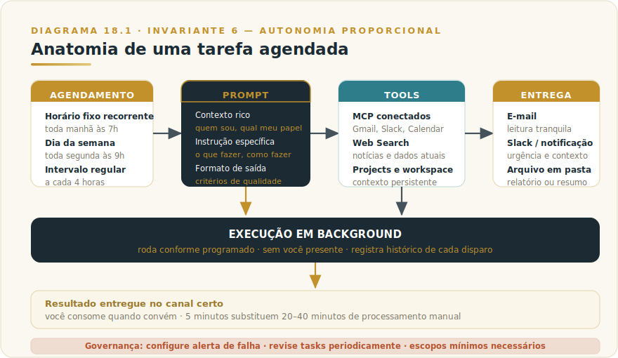
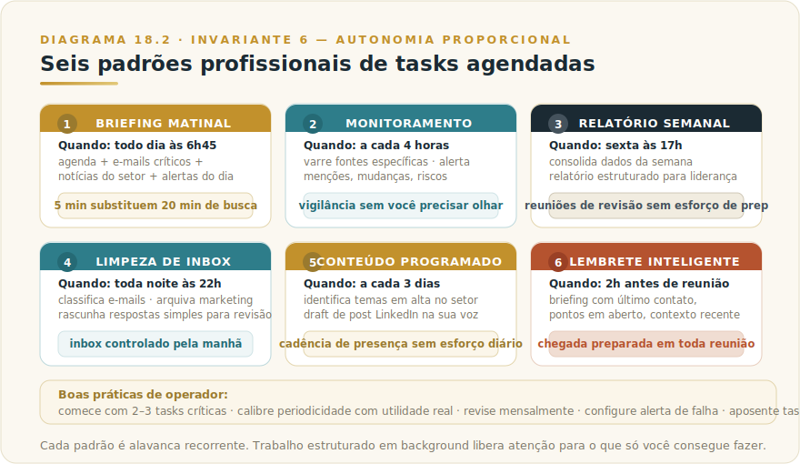

# CAPÍTULO 19
## CLAUDE SCHEDULED TASKS

---

> *"Tasks são quando Claude trabalha enquanto você dorme. Bem usadas, viram infraestrutura cognitiva contínua que entrega valor enquanto você foca no que apenas você pode fazer."*

---

> 🧭 **Por que este capítulo é a aplicação do Invariante 6 — Autonomia Proporcional**
>
> Tarefa agendada é autonomia delegada no tempo: Claude trabalha enquanto você dorme. Sem observabilidade e sem rollback, essa autonomia é passivo, não ativo. O nível de delegação tem que casar com a capacidade de rastrear e reverter.

---

## 19.1 — O CONCEITO INTUITIVO

Existe uma classe de trabalho cognitivo recorrente com uma característica peculiar: é importante, demanda análise, mas é previsível em estrutura e periodicidade. Briefing matinal, monitoramento de tema crítico, relatório semanal para liderança, limpeza de inbox, lembrete pré-reunião, geração de conteúdo em cadência regular. Cada tarefa consome entre 10 e 40 minutos por execução — em escala, somam dezenas de horas mensais de tempo qualificado que poderia ir para trabalho de maior valor.

Claude Scheduled Tasks automatiza essa classe de trabalho. Você define o que deve ser feito (prompt detalhado), quando (agendamento flexível), com quais ferramentas (MCP, web search, arquivos) e para onde o resultado vai (e-mail, Slack, notificação no celular). A partir daí, a tarefa roda conforme programado.

Em uso profissional sério, Tasks viram parte da infraestrutura cognitiva — não substitutos do trabalho criativo ou estratégico, mas mecanismos que liberam você dos blocos recorrentes de processamento estruturado para focar onde só você agrega valor real.

---

## 19.2 — ANALOGIA: A ASSISTENTE QUE TRABALHA À NOITE

Pense em uma assistente executiva competente que, enquanto você dorme, continua trabalhando nas tarefas estruturadas que você deixou agendadas. Toda manhã há um briefing na mesa — agenda organizada, e-mails críticos destacados, notícias relevantes ao setor. Toda sexta o relatório semanal está pronto. Toda noite o inbox foi classificado.

Você não tem essa assistente em pessoa porque seria cara e exigiria gestão constante. Claude Scheduled Tasks oferece a versão funcional: você configura as rotinas uma vez e elas operam continuamente sem gestão ativa. Tempo liberado para o trabalho que só você consegue fazer.

---

## 19.3 — EXPLICAÇÃO TÉCNICA

### 19.3.1 — Anatomia de uma tarefa agendada

Componentes de uma scheduled task bem construída.

> 📊 **Diagrama 19.1 — Anatomia de uma Tarefa Agendada**
>
> 
>
> *Schedule + prompt + tools + entrega. Funciona automaticamente em background.*

O **agendamento** define quando a tarefa roda: horário fixo recorrente ("toda manhã às 7h"), dia da semana ("toda segunda às 9h"), intervalo regular ("a cada 4 horas"), ou data única no futuro. A flexibilidade cobre qualquer padrão de cadência relevante em uso profissional.

O **prompt** é o que Claude executa quando a tarefa dispara. Valem aqui os mesmos cuidados de engenharia de prompt do Capítulo 9: contexto rico, instruções específicas, formato de saída claro, critérios de qualidade explícitos. "Resuma minhas notificações de e-mail das últimas 24 horas, destaque o que precisa da minha atenção hoje, ignore newsletters e marketing, e envie o resumo para meu Slack no canal #pessoal" é o tipo de prompt que produz resultado útil.

As **tools** disponíveis incluem todos os MCPs configurados no Claude Desktop, web search, Projects da sua conta e arquivos de workspace folder. A tarefa opera com as mesmas capacidades de uma sessão interativa, mas sem você presente.

O **canal de entrega** define onde o resultado aparece: email, Slack via MCP, push no celular, arquivo salvo, atualização em Project, ou combinação. Entrega no lugar errado é entrega ignorada — canal certo é parte do design.

O **registro de execução** mantém histórico de cada disparo — você revisa execuções anteriores, identifica falhas, ajusta padrões. Falhas geram alertas configuráveis para que problemas não passem despercebidos.

### 19.3.2 — Como definir uma boa tarefa

O que separa uma scheduled task que rende valor de uma que vira ruído.

Primeiro, **objetivo claro e mensurável**. "Me ajude com meu dia" é prompt ruim para automação. "Liste os três compromissos mais importantes do dia, com contexto sobre cada um, identifique conflito potencial de agenda, e sugira preparação para reuniões com clientes externos" é operacionalizável.

Segundo, **periodicidade compatível com utilidade**. Tarefa diária deve produzir output que vale ler diariamente. Tarefas mal calibradas em cadência viram poluição que você ignora.

Terceiro, **canal de entrega adequado à urgência**. Briefing matinal vai bem por email. Alerta crítico precisa de push imediato. Resumo semanal pode ser arquivo salvo para revisão na sexta.

Quarto, **acesso restrito ao necessário**. Tarefa que precisa só ler emails não precisa de MCP de banco de dados. Minimizar escopo de permissões reduz risco e simplifica troubleshooting.

Quinto, **revisão periódica**. Toda task deveria ser revista a cada poucas semanas. Continua sendo lida? Gera valor proporcional ao custo? Tasks que ninguém lê viram custo sem benefício.

### 19.3.3 — Seis padrões profissionais

Padrões que aparecem repetidamente em uso maduro de scheduled tasks.

> 📊 **Diagrama 19.2 — Seis Padrões Profissionais**
>
> 
>
> *Cada padrão é alavanca recorrente de produtividade.*

O **briefing matinal** é o padrão mais transformador para quem tem agenda intensa. Dispara cedo (6h–7h), consolida agenda do dia, e-mails críticos, contexto sobre quem você vai encontrar, notícias do setor. Lido em 5 minutos no café, prepara o dia antes de chegar ao escritório.

O **monitoramento contínuo** é o padrão de vigilância automatizada. Roda a cada poucas horas, varre fontes específicas (notícias, redes sociais, fóruns relevantes), detecta menções importantes e riscos emergentes. Alerta quando algo merece atenção; silêncio quando tudo está normal.

O **relatório semanal estruturado** cobre entregáveis recorrentes. Roda sexta no fim do dia, consolida dados de várias fontes, gera relatório em formato consistente, salva em pasta e envia notificação. Reuniões de revisão chegam com material pronto.

A **limpeza de inbox** gerencia carga cognitiva. Roda à noite, classifica emails recebidos, responde os simples (com revisão sua antes do envio), arquiva os irrelevantes, deixa apenas os críticos esperando. Inbox controlado toda manhã.

O **conteúdo programado** serve criadores e profissionais com presença pública. Roda a cada poucos dias, identifica temas em alta, gera draft de post LinkedIn na sua voz, salva para revisão. Cadência mantida sem esforço de geração constante.

O **lembrete inteligente pré-evento** garante preparação consistente. Dispara horas antes de reuniões importantes, prepara briefing com último contato com a pessoa, pontos em aberto, contexto recente, sugestão de abordagem. Você chega preparado em todas as reuniões — não apenas nas que lembrou de preparar.

---

## 19.4 — EXEMPLO MEMORÁVEL: A SEMANA QUE GANHOU OITO HORAS

Uma diretora de marketing, gerenciando time de doze pessoas em empresa de tecnologia, enfrentava sobrecarga estrutural em janeiro de 2026. Gestão de equipe, monitoramento de campanhas, acompanhamento de tendências, preparação para reuniões executivas e geração de conteúdo somavam mais trabalho do que conseguia entregar com qualidade. Algumas dimensões ficavam negligenciadas toda semana.

Em fevereiro, decidiu automatizar via Scheduled Tasks tudo de característica "recorrente estruturado". Mapear, configurar e refinar levou três semanas. A configuração final ficou assim.

**Toda manhã às 6h45**, briefing do dia por e-mail: agenda das reuniões com contexto de quem ia participar e o que havia sido tratado nos últimos contatos, três alertas do que precisava de atenção, três notícias do setor que poderiam emergir em conversas. Leitura de cinco minutos no café substituía vinte minutos que ela gastava todo dia procurando informação no celular.

**A cada quatro horas durante o dia útil**, monitoramento de mídias sociais e canais relevantes, com alerta push apenas quando havia menção importante à empresa, à concorrência ou a temas críticos. Silêncio em períodos normais. Substituiu o hábito de ficar olhando feeds a cada meia hora.

**Toda sexta às 17h**, consolidação de dados de campanhas da semana de todas as plataformas (Meta, Google, LinkedIn), relatório estruturado em Markdown salvo em pasta do Drive. Quando a reunião de status acontecia segunda-feira, o material estava pronto — ela só precisava revisar e ajustar antes de apresentar.

**Toda noite às 22h**, classificação de emails recebidos durante o dia: respostas simples em draft para revisão dela de manhã antes do envio efetivo, marketing arquivado, apenas o crítico na caixa de entrada. Manhã começava com inbox controlado.

**A cada três dias**, tarefa identificava tendências em alta no setor de marketing tech, gerava draft de post LinkedIn no estilo dela (treinado com posts anteriores via Project) e salvava em pasta para revisão. Cadência de presença pública mantida sem esforço criativo constante.

**Duas horas antes de reuniões classificadas como importantes** no calendar, briefing com último contato com cada participante, pontos em aberto, sugestão de pauta. Chegada preparada em toda reunião relevante — não apenas nas que ela lembrava de preparar.

O resultado consolidado, após dois meses de operação madura, foi notável. **Cerca de 8 horas semanais recuperadas de trabalho cognitivo qualificado**, redirecionadas para coaching de equipe, planejamento estratégico e relacionamento com stakeholders externos. A qualidade percebida do trabalho subiu junto aos pares e à direção — não pelo aumento de horas trabalhadas, mas pela melhoria do que ela fazia no tempo disponível. **O tempo que antes ia para processamento mecânico passou a ser dedicado ao que apenas ela conseguia fazer, e essa redistribuição foi a vantagem competitiva real.**

A lição estrutural é sobre **redistribuição do que ocupa atenção qualificada**. Toda função profissional tem uma proporção de trabalho estruturado que pode ser automatizada sistematicamente. **Profissionais maduros usam o tempo liberado para o que IA não consegue fazer — frequentemente o que mais agrega valor à organização.**

> 🎯 **PARA EXECUTIVOS**
> Mapeie em sua semana atual quanto tempo é consumido por trabalho cognitivo estruturado e recorrente (briefings, monitoramentos, relatórios, classificações). Se essa fração ultrapassa cinco horas semanais, Scheduled Tasks bem configuradas costumam recuperar a maior parte desse tempo. Investir uma semana inicial em configuração e dois ou três ciclos de refinamento costuma ser uma das mudanças de produtividade individual com maior ROI imediato.

---

## 19.5 — NA PRÁTICA: TRÊS APLICAÇÕES REPLICÁVEIS

O exemplo anterior mostra o impacto agregado; esta seção entrega as aplicações individuais com passo a passo e o ponto de julgamento que separa automação útil de automação que vira passivo.

**Aplicação 1 — Briefing matinal automatizado.**
*Situação:* você começa o dia sem visão consolidada do que importa — agenda fragmentada, e-mails sem priorização, notícias relevantes espalhadas em fontes diferentes. *O que fazer:* configure uma Scheduled Task que dispara às 6h45 com prompt detalhado — agenda do dia com contexto de cada participante externo, três e-mails críticos pendentes de resposta, duas ou três notícias do setor que podem emergir em conversas. Canal de entrega: e-mail ou push no celular. Refine o prompt nas primeiras duas semanas até o resultado chegar pronto para consumo em cinco minutos. *O ponto de julgamento:* o briefing consolida, não decide. As prioridades que ele sugere refletem o que o prompt instrui — se sua semana mudou, o prompt não sabe. Antes de agir com base no briefing, confirme mentalmente se o contexto do seu dia ainda é o que a task foi configurada para entender. Tasks com premissas desatualizadas produzem saída incorreta que parece correta (Invariante 6 — Autonomia Proporcional).

**Aplicação 2 — Monitoramento de concorrente ou tema crítico.**
*Situação:* você precisa acompanhar movimentos de concorrente específico, mudança em regulação relevante ou cobertura de mídia sobre tema que afeta o negócio — mas monitoramento manual é inconsistente e consome tempo que você não tem. *O que fazer:* configure task a cada quatro horas durante o horário comercial, com prompt que busca via Web Search menções ao tema, avalia se há novidade relevante em relação à última execução, e envia alerta push apenas quando identifica algo material. Silêncio quando tudo está normal. Refine o critério de "relevância" no prompt até a taxa de falsos positivos (alertas sobre nada relevante) ficar abaixo de um por dia. *O ponto de julgamento:* o critério de relevância que o modelo usa é o que você escreveu no prompt — se for vago, a task alerta sobre ruído ou silencia sobre sinal. Revise o prompt depois de duas semanas com os alertas recebidos: quais eram úteis, quais eram ruído? Automação de monitoramento sem revisão periódica do critério deteriora em silêncio (Invariante 6 — Autonomia Proporcional).

**Aplicação 3 — Relatório semanal consolidado para liderança.**
*Situação:* você ou seu time produz relatório recorrente para a liderança — métricas da semana, status de projetos, highlights e riscos — que consome uma ou duas horas toda sexta e frequentemente fica para a correria do fim do dia. *O que fazer:* configure task que dispara sexta às 16h, consolida dados de fontes conectadas via MCP (planilhas, CRM, ferramenta de projeto), gera relatório em formato padronizado (template definido no prompt) e salva com notificação. Na primeira execução, revise cada seção e ajuste o prompt. Na segunda semana, o relatório chega como rascunho que você revisa em 15 minutos. *O ponto de julgamento:* o relatório automatizado é o rascunho, não a entrega. Antes de enviar para a liderança, leia cada número: os dados consolidados são os corretos? Alguma fonte mudou de formato e está produzindo número errado em silêncio? A responsabilidade pelo que vai à liderança é sua — a task produz, você aprova (Invariante 8 — Responsabilidade Indelegável).

> 🔧 **EXERCÍCIO**
> Mapeie sua semana atual e identifique um bloco de trabalho recorrente que tem três características: acontece regularmente (semanal ou com mais frequência), tem estrutura previsível (você sabe como fazer antes de começar), e consome 30 minutos ou mais. Configure uma Scheduled Task para automatizar esse bloco. Depois da primeira execução, responda: **o output que chegou era utilizável sem revisão, utilizável com ajustes, ou inútil?** Se inútil, refine o prompt e repita. Se utilizável com ajustes, documente o que ajustou — o prompt precisa dessas instruções. A task só vira infraestrutura quando o output chega pronto para uso; enquanto você passa mais tempo corrigindo do que teria gasto fazendo, o prompt está incompleto.

---

## 19.6 — LIMITAÇÕES E CUIDADOS

O que tasks não fazem bem:

A primeira: **trabalho que exige julgamento contextual em tempo real**. Tasks funcionam para padrões previsíveis. Quando o contexto muda dramaticamente ou exige decisão executiva, a task continua executando o padrão antigo — saída potencialmente inadequada para o momento.

A segunda: **interação contínua**. Tasks são disparos pontuais, não conversas. Para fluxos que exigem ida e volta, sessões interativas continuam sendo o caminho.

A terceira: **falhas silenciosas**. Sem alertas configurados, tarefas podem falhar e você só percebe quando falta a saída esperada. Notificação de erro é parte do design responsável.

A quarta: **drift de utilidade**. Task útil em janeiro pode virar ruído em julho porque seu trabalho mudou. Revisão periódica de tasks ativas é parte da disciplina.

A quinta: **custo recorrente em tokens**. Cada execução consome tokens — tasks frequentes em escala somam custos significativos. Vale monitorar, especialmente em uso intensivo.

---

## 19.7 — CONEXÕES COM OUTROS CAPÍTULOS

- 🔗 **MCP para integrações em tasks** → [Capítulo 13](../../Livro-1-Os-Invariantes/02-capitulos/L1-C13-mcp.md)
- 🔗 **Engenharia de prompt para tasks** → [Capítulo 9](../../Livro-1-Os-Invariantes/02-capitulos/L1-C09-engenharia-prompt.md)
- 🔗 **Projects como contexto de tasks** → [Capítulo 13](L2-C13-projects.md)
- 🔗 **Desktop como hub de MCP local** → [Capítulo 11](L2-C11-desktop.md)
- 🔗 **Mobile recebendo notificações** → [Capítulo 12](L2-C12-mobile.md)
- 🔗 **Subagents em fluxos complexos** → [Capítulo 32](L2-C32-subagents-workflows.md)

---

## 19.8 — RESUMO EXECUTIVO

| Conceito | Síntese |
|----------|---------|
| **Scheduled Tasks** | Automação de prompts em cadência programada |
| **Componentes** | Schedule + prompt + tools + canal de entrega + registro |
| **Seis padrões** | Briefing matinal, monitoramento, relatório, inbox, conteúdo, lembrete |
| **Boas práticas** | Objetivo claro, periodicidade adequada, canal apropriado, escopo mínimo, revisão periódica |
| **Quando rende** | Trabalho recorrente estruturado e previsível |
| **Quando evita** | Julgamento contextual em tempo real, interação contínua |

---

## 19.9 — VALIDAÇÃO UAU

| # | Critério | Você consegue? |
|---|----------|----------------|
| 1 | **Clareza** — Explicar Scheduled Tasks em 60 segundos com exemplo concreto | ☐ |
| 2 | **Profundidade** — Defender quais classes de trabalho são automatizáveis e quais não são | ☐ |
| 3 | **Aplicação** — Configurar três tasks na sua rotina pessoal nesta semana | ☐ |
| 4 | **Conexão** — Articular como Tasks integram MCP (Cap 28), Projects (Cap 13), Desktop (Cap 11) | ☐ |
| 5 | **Curiosidade UAU** — Está pronto para avançar para Team, Enterprise e os produtos avançados | ☐ |

🔗 **Próximo capítulo:** [Capítulo 20 — Claude Team](L2-C20-team.md)

---

> *"Tasks são quando IA trabalha enquanto você dorme. Bem configuradas, viram infraestrutura cognitiva que opera continuamente em background da sua vida profissional."*
