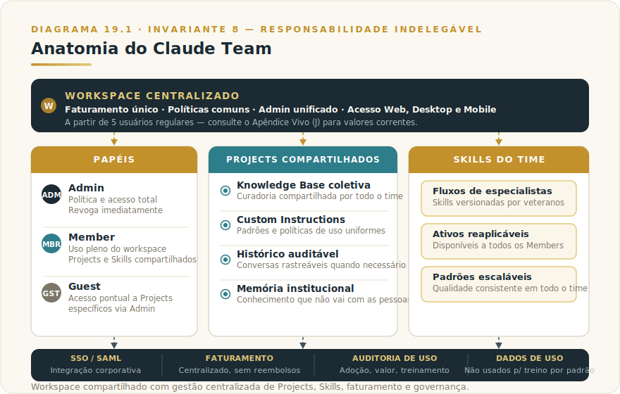

# CAPÍTULO 20
## CLAUDE TEAM

---

> *"Team transforma Claude de ferramenta individual em plataforma organizacional. A diferença não é desconto de volume, é capacidade nova de gestão e compartilhamento."*

---

> 🧭 **Por que este capítulo é a aplicação do Invariante 8 — Responsabilidade Indelegável**
>
> Team transforma uso individual em prática organizacional: cada conversa, Project e Skill passa a ter dono identificável. A camada de governança técnica do Team é a primeira instância prática do Invariante 8. Sem Team, a responsabilidade se dilui entre contas pessoais; com Team, ela tem endereço.

---

## 20.1 — O CONCEITO INTUITIVO

Existe um momento na adoção corporativa de IA em que a estrutura individual começa a falhar. As primeiras pessoas usam Claude Pro com contas pessoais, descobrem valor, contam para colegas. Em poucas semanas há dez, quinze, vinte pessoas na mesma empresa usando Claude — cada uma com sua conta, sem compartilhamento de Projects, sem governança comum, com reembolsos individuais fragmentados e sem qualquer visibilidade sobre como a organização usa a ferramenta.

A imagem mais precisa: uma biblioteca corporativa onde cada funcionário tem sua estante pessoal trancada, sem acervo comum, e quando alguém sai de férias o conhecimento vai junto. Novo contratado começa do zero. Team é a decisão de construir o acervo comum — não apenas centralizar billing, mas criar a infraestrutura onde o conhecimento coletivo passa a existir.

Claude Team é o plano corporativo da Anthropic projetado para esse cenário: workspace centralizado, gestão unificada de membros, compartilhamento estruturado de Projects e Skills, faturamento consolidado, camada de administração com visibilidade e controle. Para preço e requisito mínimo de usuários, consulte o [Apêndice Vivo (J)](../04-apendices/L2-APX-J-apendice-vivo.md) — valores mudam com frequência e a decisão deve ser feita com o número corrente da página oficial da Anthropic.

Para organizações com mais de algumas pessoas usando Claude regularmente, Team não é luxo — é arquitetura básica. Sem ele, a fragmentação limita o que IA pode entregar coletivamente.

---

## 20.2 — ANATOMIA DO TEAM

> 📊 **Diagrama 20.1 — Anatomia do Claude Team**
>
> 
>
> *Workspace compartilhado com gestão centralizada de Projects, Skills, faturamento e governança.*

O **workspace centralizado** unifica a operação da empresa. Cada membro tem conta própria sincronizada entre Web, Desktop e Mobile, mas todos pertencem ao mesmo workspace, com faturamento único e políticas comuns. O administrador adiciona ou remove membros conforme contratações e saídas, sem fricção financeira individual.

O **modelo de papéis** define o que cada pessoa pode fazer. O **Admin** configura políticas do workspace, gerencia membros, controla quais MCPs e Skills podem ser usados, acessa logs de uso e pode revogar acessos imediatamente. O **Member** usa o workspace pleno, acessa Projects e Skills compartilhados e cria conteúdo próprio conforme permissões. O **Guest** tem acesso limitado a Projects específicos designados pelo Admin — útil para colaboradores externos que precisam de contexto pontual sem acesso ao workspace completo. Compreender esses três papéis é pré-requisito para planejar a migração.

Os **Projects compartilhados** são a alavanca de produtividade coletiva mais importante. Diferente do Pro — onde Projects são individuais — no Team eles podem ser compartilhados com o time inteiro ou subgrupos. Knowledge Base curada coletivamente, Custom Instructions padronizadas, histórico de conversas auditável quando apropriado. Memória institucional sobre clientes, produtos e processos acessível a todos que precisam.

As **Skills do time** funcionam de forma análoga. Workflows criados por especialistas ficam disponíveis para todos. Quando alguém constrói uma Skill que automatiza análise específica, redação de documento padrão ou processamento de dados recorrente, ela vira ativo organizacional reaplicável.

A **camada administrativa** entrega visibilidade e controle. SSO via SAML integra com provedores corporativos (Okta, Azure AD, Google Workspace), eliminando senhas separadas. No Team, o SSO está disponível, mas sem SCIM (provisionamento automático do diretório de RH) e sem offboarding automático — essas capacidades pertencem ao Enterprise. Quando um funcionário sai, o Admin precisa revogar o acesso manualmente. Para equipes menores, isso é gerenciável; para organizações com alto turnover ou centenas de usuários, vira atrito que justifica avaliar Enterprise. Faturamento centralizado elimina reembolsos individuais. Auditoria de uso mostra padrões de adoção: quem precisa de treinamento, onde Claude está subutilizado, quais áreas geram mais valor.

Os **dados de uso corporativo** são tratados diferentemente. Por padrão, conversas em Team não são usadas para treinamento futuro do modelo, e há controles adicionais sobre retenção, exportação e exclusão — pré-requisito para empresas com requisitos de compliance.

---

## 20.3 — QUANDO MIGRAR — E QUANDO AINDA NÃO É HORA

### Quando Team é a escolha óbvia

**A partir de 5 usuários regulares de Claude na mesma organização, Team é a escolha óbvia.** O custo individual sobe (consulte o [Apêndice Vivo (J)](../04-apendices/L2-APX-J-apendice-vivo.md) para valores correntes), mas o ganho em produtividade compartilhada, em redução de overhead administrativo e em controle organizacional supera amplamente essa diferença.

Sinais claros de que está na hora de migrar: múltiplas pessoas recriando os mesmos Projects, reembolsos individuais viraram tema de RH, ninguém sabe quem está usando Claude e como, MCPs internos precisariam ser configurados por dezenas de pessoas separadamente, ou compliance está perguntando sobre fluxo de dados corporativos.

### Quando Team é prematuro ou insuficiente

Team não é a resposta certa para todos os cenários. Há dois casos claros de erro.

**Quando Team é prematuro:** se a organização tem 2 a 3 pessoas e nenhum compartilhamento real de Projects acontece na prática, Pro individual com acordos informais de reuso pode ser suficiente. Migrar antes de ter necessidade concreta de compartilhamento significa pagar por governança sem usar. O sinal certo é quando alguém reclama que não consegue acessar o Project de um colega — essa dor justifica a migração.

**Quando Team é insuficiente e o pulo direto para Enterprise é o caminho:** se a organização tem requisitos formais de compliance (LGPD com DPA, HIPAA, SOC 2 auditado por clientes), precisa de SCIM para provisionamento automático via diretório centralizado, ou opera em setor regulado onde o jurídico vai exigir contrato formal com SLA, começar com Team e migrar depois provavelmente desperdiça dois ciclos de implementação. Para esses casos, vá direto ao Capítulo 20b antes de decidir.

**A fronteira entre Team e Enterprise está na tabela ao final deste capítulo (20.6).** Leia antes de fechar a decisão.

---

## 20.4 — EXEMPLO MEMORÁVEL: A AGÊNCIA QUE ESCALOU MEMÓRIA INSTITUCIONAL

Uma agência brasileira de marketing digital com 45 funcionários, atendendo 30 clientes, vivia o "caos de Claude Pro descentralizado". Cada profissional tinha conta própria, sem compartilhamento entre membros. Quando alguém saía de férias, o conhecimento sobre o cliente ia junto. Onboarding em nova conta levava duas a três semanas reconstruindo contexto.

Em fevereiro de 2026, a sócia migrou para Team. A centralização levou quatro semanas e mudou a operação. Projects de clientes foram migrados para o workspace compartilhado, com curador designado para a Knowledge Base de cada conta. Skills criadas por veteranos — briefing inicial de cliente, análise competitiva padrão, relatório semanal — ficaram disponíveis para todos.

O resultado em três meses foi notável em três dimensões. **Onboarding de novo membro caiu de 3 semanas para 4 dias**, com a Knowledge Base do Project compartilhado entregando contexto que antes só existia na cabeça dos sêniors. **Qualidade ficou mais consistente**, porque todos operavam a partir da mesma base e das mesmas Skills validadas. **Custo total caiu cerca de 15%**, considerando licenças centralizadas versus reembolsos individuais fragmentados com taxas e overhead administrativo.

A lição estrutural: **Team não é centralização de billing — é mudança no que se torna possível fazer coletivamente**. Memória institucional vira ativo da organização, padrões de qualidade tornam-se replicáveis em escala, e a capacidade de IA da empresa cresce além da soma das capacidades individuais.

---

## 20.5 — NA PRÁTICA: TRÊS APLICAÇÕES REPLICÁVEIS

O exemplo anterior mostra o impacto organizacional; esta seção entrega o roteiro de adoção. Três aplicações concretas com passo a passo e o ponto de julgamento que separa migração bem feita de migração que cria mais caos do que resolve.

**Aplicação 1 — Migração de Projects individuais para workspace compartilhado.**
*Situação:* seu time já usa Claude Pro individualmente; cada pessoa tem seus Projects, sem acesso cruzado. Quando alguém sai de férias ou da empresa, o conhecimento vai junto. *O que fazer:* antes de migrar, mapeie quais Projects existem e quem são os curadores naturais (quem criou e mantém cada um). Defina quais serão compartilhados com o time inteiro e quais ficam restritos a subgrupos. Migre por prioridade — comece pelos Projects de clientes estratégicos. Para cada Project migrado, designe um curador responsável por manter a Knowledge Base atualizada. *O ponto de julgamento:* Project compartilhado sem curador é biblioteca sem bibliotecário — o conteúdo se degrada sem que ninguém perceba. A responsabilidade pela qualidade do que está no Project tem nome e sobrenome. Migrar sem designar curador transfere o caos de silos individuais para silos coletivos desorganizados (Invariante 8 — Responsabilidade Indelegável).

**Aplicação 2 — Criação e disseminação de Skills organizacionais.**
*Situação:* alguém no time construiu um fluxo de Claude que funciona muito bem — análise de proposta comercial, briefing de cliente, triagem de oportunidades — mas esse conhecimento fica restrito a quem o criou ou a quem pergunta. *O que fazer:* identifique os três fluxos mais usados e replicáveis. Peça aos criadores para construir Skills compartilhadas com instruções explícitas — o que a Skill faz, quando usar, parâmetros necessários, exemplos de output esperado. Compartilhe no workspace. Faça sessão curta de apresentação; Skills que ninguém sabe que existem não são usadas. Revise após 30 dias: quem usou, qual o feedback, o que precisa ser refinado. *O ponto de julgamento:* Skill compartilhada no workspace não garante adoção — garante disponibilidade. Se o time não usa, a razão costuma ser uma de três: não sabe que existe, não entende quando usar, ou o output não vale o esforço de aprender. Investigar qual das três antes de criar mais Skills evita biblioteca de ferramentas que ninguém abre (Invariante 8 — Responsabilidade Indelegável).

**Aplicação 3 — Governança de onboarding e offboarding no workspace.**
*Situação:* seu time cresce e não há processo claro para o que acontece quando alguém entra ou sai — qual acesso dar, quais Projects apresentar, o que revogar na saída. *O que fazer:* escreva um protocolo de onboarding: quais Projects cada papel acessa por padrão, qual Skill apresentar primeiro, com quem a pessoa faz a primeira sessão de uso orientado. Escreva o protocolo de offboarding: revogar acesso no dia da saída (no Team isso é manual — o Admin precisa fazer), verificar se Projects com curador único têm sucessor designado, exportar histórico relevante se necessário. Revise os protocolos a cada trimestre. *O ponto de julgamento:* em Team (sem SCIM), offboarding automático não existe — se você não revogar manualmente no dia da saída, a pessoa mantém acesso ao workspace. Em organizações com turnover regular, isso é risco de segurança concreto. Se esse processo manual não é aceitável pelo volume ou criticidade dos dados, é o sinal de que o pulo para Enterprise está justificado (Invariante 8 — Responsabilidade Indelegável).

> 🔧 **EXERCÍCIO**
> Antes de contratar Team, mapeie: liste todos os Projects Claude da organização (incluindo contas individuais). Para cada um, responda: quem é o curador? Quem mais deveria ter acesso? O que acontece com esse Project se o curador sair amanhã? Se você não consegue responder as três perguntas para os Projects críticos, tem um problema de governança que Team organiza a infraestrutura para resolver — mas que ainda precisa de decisão humana para cada Project. Team não resolve o que você não decidiu; ele dá estrutura para que a decisão possa ser executada.

---

## 20.6 — FRONTEIRA TEAM vs ENTERPRISE

A tabela abaixo é o critério de decisão. Para tudo que Team não oferece, Enterprise existe — o Capítulo 20b parte daqui, sem repetir o que está nesta tabela.

| Capacidade | Team | Enterprise |
|------------|------|------------|
| **Workspace compartilhado** | ✅ | ✅ |
| **Projects e Skills compartilhados** | ✅ | ✅ |
| **SSO via SAML** | ✅ (básico) | ✅ (com granularidade avançada) |
| **SCIM (provisionamento automático de contas)** | ❌ | ✅ |
| **Offboarding automático via diretório** | ❌ | ✅ |
| **MFA obrigatório por política** | Configurável | ✅ por padrão |
| **Múltiplos workspaces com hierarquia de admins** | ❌ | ✅ |
| **Políticas por departamento** | ❌ | ✅ |
| **Data residency (região específica)** | ❌ | ✅ |
| **VPC isolado via AWS Bedrock** | ❌ | ✅ |
| **DPA formal e contrato com SLA** | ❌ | ✅ |
| **Certificações formais (SOC 2, ISO 27001)** | Não documentadas contratualmente | ✅ documentadas |
| **Logs de auditoria detalhados para compliance** | Básico | Avançado com exportação |
| **Customer Success Manager dedicado** | ❌ | ✅ |
| **Suporte 24x7 com SLA contratual** | ❌ | ✅ |
| **Preço** | Por usuário/mês (ver [Apêndice Vivo J](../04-apendices/L2-APX-J-apendice-vivo.md)) | Sob consulta, contrato anual |

**Regra prática:** se qualquer item "❌ no Team" for requisito obrigatório, avalie Enterprise diretamente. O Capítulo 20b parte desta tabela.

---

## 20.7 — CONEXÕES E RESUMO EXECUTIVO

🔗 **Conexões:** [Projects (Cap 13)](L2-C13-projects.md) · [Desktop com MCP corporativo (Cap 11)](L2-C11-desktop.md) · [Enterprise (Cap 20b)](L2-C20b-enterprise.md) · [Skills (Cap 31)](L2-C31-skills.md) · [Segurança (Cap 37)](../../Livro-1-Os-Invariantes/02-capitulos/L1-C19-seguranca.md)

| Conceito | Síntese |
|----------|---------|
| **Claude Team** | Plano corporativo com workspace compartilhado |
| **Preço** | Ver [Apêndice Vivo (J)](../04-apendices/L2-APX-J-apendice-vivo.md) |
| **Diferenciais** | Projects compartilhados, Skills do time, SSO básico, admin centralizado |
| **Papéis** | Admin (política e acesso), Member (uso pleno), Guest (acesso pontual) |
| **Quando migrar** | A partir de 5 usuários regulares com necessidade real de compartilhamento |
| **Quando é insuficiente** | Requisitos de SCIM, DPA, data residency, VPC ou SLA formal → Enterprise |
| **Dados** | Não usados para treinamento por padrão |

## 20.8 — EXERCÍCIOS

| # | Exercício | O que desenvolve |
|---|-----------|-----------------|
| 1 | **Mapeie o workspace.** Desenhe como seu time ficaria organizado no Team: quem são os Admins, quais Projects existiriam, quais Skills seriam compartilhadas primeiro. Se não há Project compartilhado óbvio, Team pode ser prematuro. | Clareza de necessidade real |
| 2 | **Consulte a tabela de fronteira (20.6).** Marque quais capacidades Enterprise são obrigatórias para sua organização. Se zero: Team é suficiente. Se uma ou mais: abra o Cap 20b antes de contratar. | Decisão de plano correta |
| 3 | **Calcule o custo da fragmentação atual.** Some horas perdidas por semana: recriar Projects de outras contas, reembolsos processados pelo RH, onboarding sem base compartilhada. Compare com o custo de Team pelo [Apêndice Vivo (J)](../04-apendices/L2-APX-J-apendice-vivo.md). | Argumento econômico para a migração |

🔗 **Próximo capítulo:** [Capítulo 20b — Claude Enterprise](L2-C20b-enterprise.md)

---

> *"Team é onde Claude deixa de ser ferramenta individual e vira plataforma organizacional. A diferença não é desconto, é capacidade coletiva. O pré-requisito é ter necessidade real de compartilhamento — sem ela, a governança é overhead vazio."*
