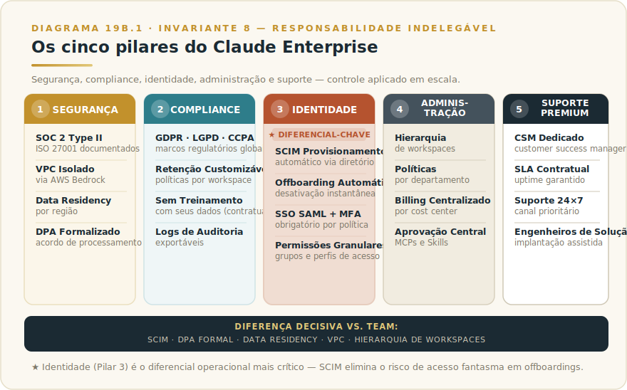

# CAPÍTULO 20b
## CLAUDE ENTERPRISE

---

> *"Enterprise não é Team com desconto. É camada de governança, segurança e compliance projetada para organizações em que essas dimensões são pré-requisito, não acessório."*

---

> 🧭 **Por que este capítulo é a aplicação do Invariante 8 — Responsabilidade Indelegável**
>
> Enterprise é a camada onde governança encontra escala: controle aplicado, não documento publicado. SCIM, auditoria rigorosa, data residency e SLA contratual operacionalizam a indelegabilidade em tamanho e risco que Team não suporta.
> Invariante secundário: **Inv. 6 — Autonomia Proporcional** (escala demanda observabilidade proporcional: quanto maior o deploy, mais rigoroso o controle).

---

> ⚠️ **Este capítulo parte da tabela de fronteira Team vs Enterprise do Capítulo 20.** Se você chegou aqui sem ler o Cap 19, consulte a seção 19.5 primeiro — ela define o que Team cobre e o que Enterprise adiciona. Este capítulo não repete essa base; parte dela.

---

## 19b.1 — O CONCEITO INTUITIVO

Existe um patamar de tamanho e maturidade organizacional em que os requisitos de adoção de IA mudam qualitativamente. Bancos, seguradoras, empresas de saúde, governo, setores estratégicos — todos têm necessidades que vão além do que Team entrega. Não porque Team seja ruim, mas porque esses setores operam sob regimes de compliance que exigem documentação contratual, auditoria formal e controles técnicos que apenas Enterprise provê.

A diferença central — já estabelecida no Cap 19: Team tem SSO via SAML, mas não tem SCIM. Team tem administração centralizada, mas não tem hierarquia de workspaces. Team tem proteção de dados por padrão, mas não tem DPA formal assinável. **Enterprise existe exatamente para fechar essas lacunas quando elas são obrigatórias, não opcionais.**

A Anthropic estruturou Enterprise como plano premium customizável, tipicamente contratado por organizações com centenas ou milhares de usuários, preço sob consulta, contratos anuais. A diferença para Team não é incremental em preço — é categórica em capacidades de governança, segurança e suporte.

---

## 19b.2 — OS CINCO PILARES (E O QUE CADA UM EXIGE NA PRÁTICA)

> 📊 **Diagrama 19b.1 — Cinco Pilares do Enterprise**
>
> 
>
> *Segurança, compliance, identidade, administração e suporte premium.*

### Pilar 1 — Segurança

Certificações como SOC 2 Type II e ISO 27001 são documentadas formalmente e disponíveis para auditoria. No Team, a Anthropic segue boas práticas de segurança, mas não entrega documentação contratual dessas certificações. Para empresas cujos clientes ou auditores exigem prova documental, essa é a diferença que desbloqueou o processo.

Além da documentação, Enterprise inclui criptografia em trânsito e em repouso (também presente no Team, mas formalizada aqui), VPC isolado via AWS Bedrock para organizações que precisam que o tráfego não transite pela infraestrutura compartilhada da Anthropic, region selection para escolha de onde os dados ficam armazenados, e Data Processing Addendum (DPA) que formaliza obrigações contratuais sobre tratamento de dados — o documento jurídico que compliance e jurídico precisam antes de assinar qualquer adoção.

> ⚡ **Certificações e conformidades específicas:** a lista exata de certificações vigentes, com links para os relatórios de auditoria, está na página de trust da Anthropic e no [Apêndice Vivo (J)](../04-apendices/L2-APX-J-apendice-vivo.md). Certificações têm ciclos de renovação e escopo que mudam — consulte a fonte oficial antes de comunicar ao seu time de segurança.

### Pilar 2 — Compliance regulatório

GDPR europeu, LGPD brasileira, CCPA californiana, HIPAA para saúde nos EUA. Inclui retenção customizável, direito ao esquecimento, política de "sem treinamento com seus dados" formalizada **contratualmente** — no Team, essa proteção existe por padrão, mas não há contrato que a formalize —, localização de dados por região, relatórios de auditoria e suporte para certificações que sua organização precisa manter.

O ponto prático mais relevante: **DPA não é documento interno — é contrato bilateral**. Empresas europeias sob GDPR, brasileiras com contratos que exigem LGPD Art. 37, ou empresas de saúde sob HIPAA precisam de DPA assinado antes que qualquer dado sensível passe pela plataforma. Team não oferece DPA; Enterprise, sim.

> ⚡ **Status de regulações e compliance:** LGPD, GDPR e equivalentes têm interpretações que evoluem com decisões regulatórias. O [Apêndice Vivo (J)](../04-apendices/L2-APX-J-apendice-vivo.md) mantém ponteiros para as fontes regulatórias correntes.

### Pilar 3 — Identidade corporativa integrada

Este pilar é onde a diferença técnica entre Team e Enterprise fica mais concreta.

**SSO via SAML 2.0** existe em ambos os planos, mas com granularidade diferente. No Enterprise, é possível configurar múltiplos provedores SAML para workspaces distintos, aplicar políticas de sessão por grupo (tempo de expiração, re-autenticação em dados sensíveis) e integrar com fluxos de auditoria de identidade corporativa.

**SCIM (System for Cross-domain Identity Management)** é exclusivo do Enterprise. SCIM automatiza criação e remoção de contas conforme o diretório central de RH (Workday, BambooHR) ou o provedor de identidade (Okta, Azure AD) é atualizado. Quando um funcionário é contratado e aparece no sistema de RH, a conta Claude é provisionada automaticamente. Quando sai da empresa, é desativada automaticamente — sem depender de nenhum Admin lembrar de fazer isso manualmente. Para organizações com dezenas de entradas e saídas por mês, ou onde offboarding imediato é requisito de segurança, SCIM deixa de ser conveniência e vira controle obrigatório.

**MFA obrigatório** é configurável no Team; no Enterprise, é aplicável por política a toda a organização, sem exceção por usuário.

**Domínio reservado de e-mail, grupos e permissões granulares** permitem mapear a estrutura organizacional real (departamentos, projetos, hierarquias) no controle de acesso ao Claude.

### Pilar 4 — Administração em escala

O Team tem um workspace. Enterprise tem hierarquia de workspaces.

Uma empresa com múltiplas subsidiárias, BUs independentes ou geografias com políticas distintas pode ter workspaces separados com administradores locais, sob políticas globais definidas pelo Admin corporativo central. RH não acessa dados do workspace de Engenharia. Subsidiária A não acessa Projects da subsidiária B. O Admin central vê tudo, com relatórios consolidados.

**Billing por cost center** permite alocar o custo à área que usa — pré-requisito de aprovação orçamentária em grandes organizações: TI central não quer pagar pelo uso de Marketing.

**Aprovação centralizada de MCPs e Skills** fecha o loop de governança: qualquer MCP ou Skill que entra no workspace precisa de aprovação do Admin antes de ser disponibilizado ao time. Sem isso, usuários conectam sistemas externos sem supervisão — risco de segurança e compliance que Enterprise foi desenhado para controlar.

### Pilar 5 — Suporte premium

Customer Success Manager (CSM) dedicado, SLA contratual com uptime garantido, suporte 24x7 para tickets críticos, tempo de resposta garantido por nível de severidade, e engenheiros de solução disponíveis para integração e troubleshooting.

Para uma empresa com 500 pessoas usando Claude em operações críticas, uma queda de 4 horas sem resposta de suporte é incidente sério. O SLA não é upgrade de conforto — é compromisso contratual que protege a operação.

---

## 19b.3 — QUANDO ENTERPRISE FAZ SENTIDO (E QUANDO É EXCESSO)

### Quando Enterprise é obrigatório

**Enterprise faz sentido quando você precisa atender requisitos formais que Team não cobre, ou quando o tamanho da organização exige administração em escala.**

Indicadores claros de necessidade:
- Departamento jurídico exigindo DPA formal antes de qualquer adoção
- Auditoria interna pedindo logs detalhados de uso exportáveis
- Necessidade de SCIM para provisionamento automático (alto turnover ou política de offboarding imediato)
- VPC isolado ou region selection específica por requisito de dados
- Contratos com clientes que exigem certificações documentadas (financeiro, saúde, governo)
- Mais de um workspace com políticas independentes
- Billing por cost center para alocação entre departamentos

### Quando Enterprise é excesso

Enterprise também pode ser a resposta errada. Uma empresa com 300 usuários que compartilha dados não sensíveis, não opera em setor regulado e não tem auditoria interna que exige logs detalhados provavelmente opera bem com Team. O sinal de que Enterprise é excesso: nenhum item da lista acima é obrigatório — apenas desejável.

A armadilha comum é contratar Enterprise "por precaução" antes de testar se Team atende. O processo de contratação Enterprise — NDA, revisão jurídica, negociação de SLA, integração de SCIM — leva semanas ou meses. Sem requisitos formais que o justifiquem, esse overhead atrasa a adoção sem adicionar valor.

### O processo de negociação Enterprise

Para quem está na faixa certa: o processo típico começa com contato via página Enterprise da Anthropic, inclui reunião técnica com Account Executive (geralmente após NDA), proposta customizada com volume de usuários e capacidades específicas, revisão jurídica do MSA e DPA, e integração técnica de SCIM e SSO com o time de identidade. Organizações em setores regulados devem alocar 4 a 12 semanas para o ciclo completo — o exemplo do banco no próximo item ilustra o extremo.

---

## 19b.4 — EXEMPLO MEMORÁVEL: O BANCO QUE LEVOU OITO MESES PARA APROVAR

Um banco brasileiro de grande porte, com cerca de 12 mil funcionários, decidiu em janeiro de 2025 avaliar a adoção corporativa de IA. A intenção inicial era simples: começar com Team em 500 licenças para tecnologia e operações, expandindo conforme a adoção amadurecesse. A jornada que se seguiu mostra por que organizações em setores regulados precisam de Enterprise, não Team.

O processo passou por seis instâncias. **Segurança da informação** exigiu SOC 2 documentado, penetration test recente e DPA formal antes de qualquer prova de conceito. **Compliance** verificou conformidade com Bacen, requisitos de LGPD e política sobre treinamento com dados sensíveis. **Auditoria interna** pediu acesso a logs detalhados de uso para amostragem regulatória. **Jurídico** revisou contratos, MSA, condições de exoneração e garantias contratuais. **Identidade** exigiu integração SAML com o Okta corporativo, SCIM para provisionamento automático e MFA obrigatório por política. **Risco operacional** avaliou SLA, plano de continuidade e runbook de incidentes.

Em cada instância, Team falhava em pelo menos um requisito. Enterprise atendia todos com documentação formal. **O contrato Enterprise foi assinado em outubro de 2025**, oito meses após o início da avaliação, com 800 licenças iniciais e cláusulas customizadas que apenas o plano corporativo permitia.

A lição estrutural: **organizações em setores regulados não podem escolher Team apenas por preço unitário**. O custo de usar plano insuficiente para os requisitos é meses de bloqueio em compliance, retrabalho de implementação e, em alguns casos, impossibilidade legal de prosseguir. **Enterprise existe porque há classes de organização que precisam dele para adotar IA com segurança jurídica e operacional — e essas organizações descobrem isso na primeira tentativa séria de adoção.**

---

## 19b.5 — RESUMO E CONEXÕES

🔗 **Conexões:** [Team (Cap 19)](L2-C20-team.md) · [MCP corporativo (Cap 28)](L2-C29-claude-mcp.md) · [Segurança (Cap 37)](../../Livro-1-Os-Invariantes/02-capitulos/L1-C19-seguranca.md) · [Skills do time (Cap 30)](L2-C31-skills.md)

| Conceito | Síntese |
|----------|---------|
| **Enterprise** | Plano corporativo customizável para grandes organizações |
| **Diferença decisiva de Team** | SCIM, offboarding automático, DPA formal, data residency, VPC, hierarquia de workspaces |
| **Cinco pilares** | Segurança, compliance, identidade, administração, suporte |
| **Quando obrigatório** | Requisitos regulatórios formais, SCIM, DPA, VPC, +500 usuários ou setores regulados |
| **Quando é excesso** | Sem requisitos formais que justifiquem; Team atende e processo Enterprise atrasa adoção |
| **Preço** | Sob consulta, contratos anuais customizados |
| **Processo de contratação** | 4–12 semanas típicas em setores regulados |

## 19b.6 — EXERCÍCIOS

| # | Exercício | O que desenvolve |
|---|-----------|-----------------|
| 1 | **Mapeie os requisitos formais.** Para cada item da lista de Quando Enterprise é obrigatório (seção 19b.3), marque obrigatório, desejável ou não se aplica. Se zero obrigatórios: Team basta. Se dois ou mais: Enterprise é o caminho. | Decisão fundamentada de plano |
| 2 | **Simule as seis instâncias do banco.** Para sua organização, quais departamentos precisariam aprovar a adoção? O que cada um exigiria? Quantas dessas exigências Team não atende? | Antecipação do ciclo de aprovação real |
| 3 | **Estime o ciclo de negociação.** Se Enterprise for o caminho, quando você precisaria ter o contrato assinado? Trabalhando retroativamente com 8 semanas de ciclo típico (ou mais em setor regulado), quando começa a avaliação? | Planejamento de cronograma real |

🔗 **Próximo capítulo:** [Capítulo 21 — Connectors, Dispatch e Routines](L2-C21-connectors-dispatch-routines.md)

---

> *"Enterprise existe porque algumas organizações precisam de governança formal para adotar IA. Sem ele, ficam fora do jogo por compliance, não por capacidade técnica. Com ele antes da hora, perdem semanas num processo que Team resolveria mais rápido."*
