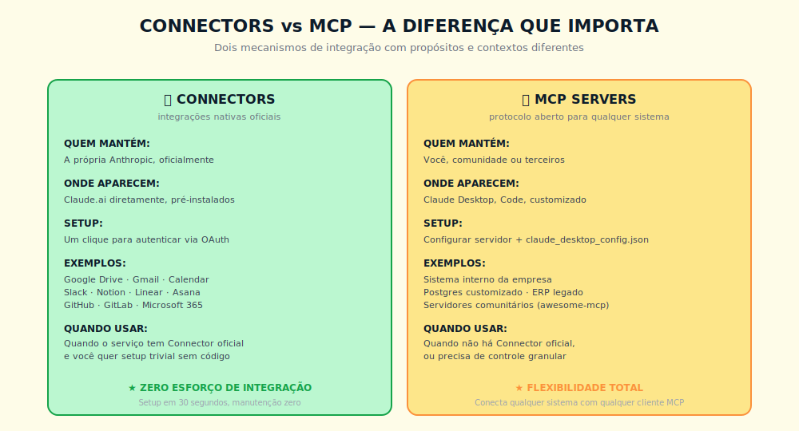
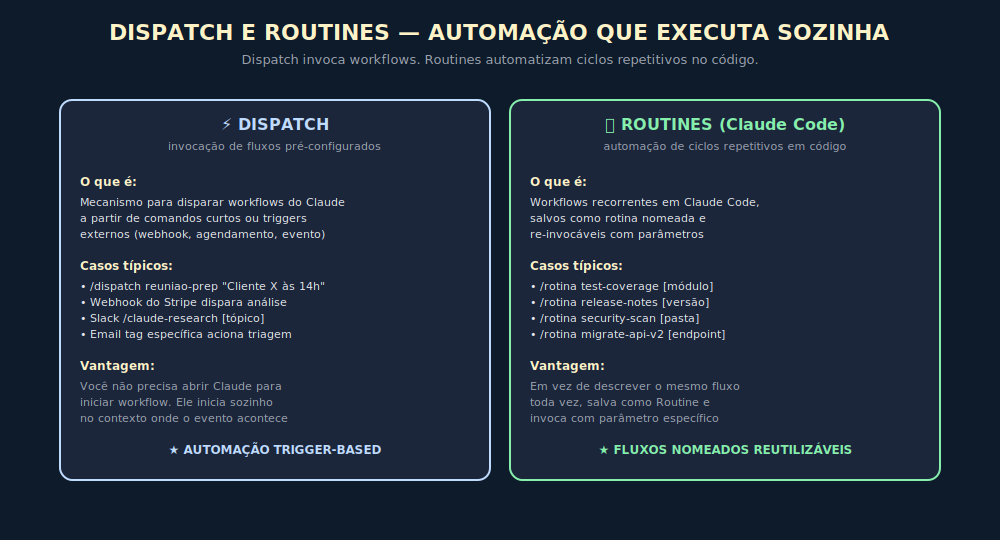

# CAPÍTULO 21
## CONNECTORS, DISPATCH E ROUTINES

---

> *"A Anthropic adicionou três mecanismos em 2025-2026 que diminuem dramaticamente a fricção entre o usuário e a ação automatizada. Quem entende esses três opera com fluência que ainda é rara."*

---

> 🧭 **Por que este capítulo é a aplicação dos Invariantes 6 e 5**
>
> Connectors, Dispatch e Routines tornam Claude execução continuada: o que rodava manual passa a rodar agendado ou triggerado. Autonomia Proporcional segue sendo o critério (Inv. 6) — cada mecanismo que opera sem supervisão humana exige observabilidade correspondente. Custo composto vira eixo crítico porque o que dispara sozinho não pede licença para gastar (Inv. 5).
>
> **Critério central antes de ativar qualquer um dos três:** você consegue ver o que está rodando, quanto está custando, e reverter se der errado? Se não, o mecanismo ainda não está pronto para produção.

---

## 21.1 — POR QUE ESTE CAPÍTULO EXISTE

Três peças que apareceram ou amadureceram entre 2025 e 2026 merecem atenção própria porque cobrem situações que os capítulos anteriores tocaram apenas tangencialmente. Connectors são integrações nativas pré-instaladas, diferentes de MCP em natureza e propósito. Dispatch invoca workflows a partir de triggers externos. Routines são fluxos repetitivos nomeados no Claude Code.

Cada uma resolve um tipo específico de fricção: Connectors removem fricção de setup, Dispatch remove fricção de iniciar workflow, Routines removem fricção de re-explicar fluxo. Profissionais que dominam os três operam em outro patamar de produtividade.

---

## 21.2 — CONNECTORS, AS INTEGRAÇÕES PRÉ-INSTALADAS

A Anthropic mantém um conjunto crescente de **Connectors oficiais** disponíveis diretamente no claude.ai e Claude Desktop, pré-construídos e pré-aprovados, que diferem de servidores MCP em pontos importantes.

> 📊 **Diagrama 21.1 — Connectors versus MCP**
>
> 
>
> *Dois mecanismos de integração com propósitos diferentes.*

### 21.2.1 — A natureza dos Connectors

Connectors são integrações oficiais mantidas pela Anthropic, disponíveis sem configuração técnica. O usuário clica em "ativar conector", autoriza via OAuth e o Claude passa a ter acesso ao serviço durante as conversas.

> ⚡ **Lista de Connectors disponíveis:** a relação de Connectors oficiais ativos muda conforme a Anthropic lança novas integrações ou descontinua outras. A lista corrente está na documentação oficial da Anthropic e no [Apêndice Vivo (J)](../04-apendices/L2-APX-J-apendice-vivo.md). As categorias típicas incluem produtividade (Google Workspace, Microsoft 365), comunicação (Slack, Teams), documentação, desenvolvimento e CRM — mas use sempre a fonte oficial para confirmar disponibilidade atual.

### 21.2.2 — Diferença essencial Connector vs MCP

A diferença que mais importa é manutenção. Connectors são mantidos pela Anthropic, com atualizações automáticas conforme as APIs evoluem. Servidores MCP são responsabilidade de quem os construiu, e atualizações exigem trabalho.

Para serviços populares com Connector oficial, a escolha quase sempre é o Connector. MCP faz mais sentido em casos específicos: comportamento customizado, sistemas internos sem Connector, controle granular de permissões, ou escopo de autorização menor que o Connector expõe.

### 21.2.3 — Casos de uso onde Connectors brilham

Connector de **Google Drive + Gmail** é o mais transformador para profissionais executivos. Permite que Claude leia anexos de e-mails, busque documentos no Drive e escreva respostas com contexto — sem setup técnico. "Pegue o último contrato que recebi do cliente X por e-mail, compare com a versão anterior no Drive e me diga as mudanças relevantes" funciona em uma única conversa.

Connector de **Slack** transforma Claude em colaborador integrado ao time. "Resuma o que foi discutido no canal #produto nas últimas 24 horas, destaque decisões e identifique pontos em aberto" é fluxo cotidiano em empresas que usam Slack intensivamente.

Connector de **GitHub** permite que Claude leia issues, PRs e código de repositórios autorizados durante conversa de planejamento ou análise. Útil para preparação de reuniões técnicas, análise de débito técnico e revisão de roadmap.

Connector de **CRM** (Salesforce, HubSpot quando disponível) abre análise de pipeline em linguagem natural. "Quais negócios em estágio de proposta com fechamento previsto este mês estão sem contato há mais de 7 dias?" vira pergunta direta, não relatório customizado.

### 21.2.4 — Quando NÃO ativar um Connector

Cada Connector ativado dá ao Claude acesso aos dados do serviço durante a conversa. Antes de ativar, responda a três perguntas:

**1. Qual é o escopo real do OAuth?** "Acesso ao Gmail" pode significar leitura de todos os e-mails ou apenas os selecionados. Revise o que o Connector solicita antes de autorizar — acesso mais amplo que o necessário cria superfície de risco.

**2. Dados sensíveis passarão pelo Connector?** Em uso pessoal, o risco é baixo. Em uso corporativo com dados de clientes, contratos ou dados de saúde, o Connector transmite esses dados ao modelo. Em planos Team e Enterprise, administradores controlam quais Connectors podem ser ativados. Em contas individuais com dados sensíveis, avalie antes de ativar.

**3. Você precisa de auditoria desta integração?** Connectors não produzem log de cada consulta individual como um MCP com instrumentação própria. Se você precisa rastrear exatamente quais dados fluíram em qual conversa, MCP com logging próprio pode ser mais adequado.

Em uso pessoal com dados não-sensíveis, Connectors são a escolha certa quase sempre. O cuidado é principalmente corporativo. Revise periodicamente quais estão ativos e revogue os que não estão mais em uso.

---

## 21.3 — DISPATCH, AUTOMAÇÃO POR TRIGGER

> 📊 **Diagrama 21.2 — Dispatch e Routines**
>
> 
>
> *Dispatch invoca workflows. Routines automatizam ciclos no código.*

### 21.3.1 — O conceito

Dispatch permite **invocar workflows do Claude a partir de triggers externos** sem abrir a interface conversacional. Muitos fluxos profissionais são iniciados por eventos — e-mail recebido, agenda chegou, webhook disparou — e interromper o trabalho para abrir o Claude é fricção desnecessária.

### 21.3.2 — Formas comuns de Dispatch

A primeira é **comandos curtos em Slack ou Teams**. `/claude-research [tópico]` permite que qualquer membro do time dispare pesquisa profunda sem sair do contexto; o resultado chega no canal quando pronto.

A segunda é **webhooks de sistemas externos**. Sistema A dispara evento, Dispatch ativa workflow do Claude, resultado é entregue no canal configurado — nova venda no Stripe gera análise de cliente; bug crítico no Sentry gera triagem automatizada.

A terceira é **agendamento estendido**, mais sofisticado que Scheduled Tasks simples: cadeias condicionais (se A então execute B, senão execute C) e dependências entre tarefas.

A quarta é **tags ou rótulos em ferramentas externas**. Marcar e-mail com label específica dispara processamento; marcar issue no GitHub com tag específica aciona análise.

### 21.3.3 — Quando NÃO usar Dispatch

Dispatch é onde o Invariante 6 (Autonomia Proporcional) tem aplicação mais direta. Antes de configurar qualquer trigger, responda:

**O workflow dispara ações irreversíveis?** Enviar e-mail, criar ticket, publicar conteúdo — ações que não se desfazem exigem confirmação humana antes, ou ao menos carência configurada para cancelamento. Dispatch sem revisão em operações irreversíveis é risco de compliance e reputação.

**Você consegue monitorar o custo acumulado?** Dispatch pode disparar workflows em cascata. Webhook mal configurado que dispara a cada evento em vez de em batches gera custos muito acima do esperado. Configure alertas de custo antes de ir para produção.

**O que acontece quando o trigger é ambíguo?** Webhooks recebem payloads que variam. Se o sistema externo muda o formato do evento, o workflow pode falhar silenciosamente. Inclua logging e alertas de falha em qualquer Dispatch em produção.

**Dispatch que opera sem supervisão em dados sensíveis requer aprovação explícita do responsável de segurança da organização — não apenas do usuário que o configurou.**

### 21.3.4 — Casos de uso onde Dispatch agrega valor real

Em **comunicação corporativa**, comandos curtos em Slack ou Teams democratizam acesso ao Claude. O time dispara workflows com sintaxe simples — pedido de pesquisa, triagem de e-mail, geração de resumo — com revisão humana antes de qualquer ação de saída.

Em **operações com revisão humana garantida**, webhooks ligam ferramentas ao Claude para análise, não para execução. CRM detecta cliente em risco: Dispatch dispara análise de retenção para o gestor revisar. Monitoramento alerta sobre incidente: Dispatch aciona postmortem assistido. Faturamento gera fatura grande: Dispatch dispara revisão automática. O humano vê e aprova antes da ação.

Em **automação executiva de baixo risco**, agenda dispara briefing antes de cada reunião, e-mails de stakeholders específicos disparam triagem prioritária para leitura humana, métricas semanais disparam relatório consolidado. Em todos esses casos o humano é receptor e decisor final — Dispatch prepara, não decide.

---

## 21.4 — ROUTINES NO CLAUDE CODE

### 21.4.1 — O conceito

Routines (também chamadas "named workflows" em algumas documentações) são **fluxos repetitivos nomeados que você salva no Claude Code e invoca com parâmetros**. Desenvolvedores executam certas sequências dezenas de vezes — descrever a sequência inteira a cada invocação é desperdício.

Em vez de digitar "rode os testes do módulo X, verifique cobertura, identifique gaps, sugira testes adicionais" a cada vez, você cria uma Routine `test-coverage` e invoca com `/rotina test-coverage [módulo]`. A sequência fica codificada na Routine; os parâmetros variam por execução.

### 21.4.2 — Routines típicas em times de engenharia

A **rotina test-coverage** roda testes, gera relatório de cobertura, identifica gaps e sugere testes adicionais para áreas descobertas. Invocada antes de fechar PR ou em revisões periódicas.

A **rotina release-notes** percorre commits desde a última release, agrupa por tipo (feature, fix, chore), gera release notes em formato padronizado e sugere classificação semântica de versão. Invocada antes de cada deploy.

A **rotina security-scan** analisa vulnerabilidades, verifica dependências desatualizadas, identifica padrões inseguros e gera relatório priorizado. Invocada periodicamente ou antes de releases importantes.

A **rotina migrate-api-v2** acompanha migração de endpoints, com checagem de breaking changes, atualização de testes e notas de compatibilidade. Útil em projetos de modernização.

A **rotina onboarding-feature** prepara documentação inicial de feature nova com base no PR aprovado e atualiza o README correspondente. Reduz tempo de documentação pós-deploy.

### 21.4.3 — Como construir Routines bem feitas

A construção segue princípio similar ao de Skills, com algumas adaptações. Cada Routine é um arquivo (ou pasta) em `.claude/routines/` do projeto, com nome explícito e definição clara de:

- Parâmetros aceitos (com tipos e exemplos)
- Sequência de passos numerada
- Validações intermediárias (o que fazer se um passo falhar)
- Critério de sucesso
- Formato de saída esperado

Um exemplo mínimo de estrutura para a rotina `test-coverage`:

```
.claude/routines/
└── test-coverage/
    ├── routine.md        # instruções e parâmetros
    └── output-format.md  # template de saída esperada
```

```markdown
# routine.md — test-coverage
Parâmetros: [módulo] (obrigatório), [threshold] (opcional, default 80%)

Passos:
1. Execute os testes do módulo via comando padrão do projeto
2. Analise o relatório de cobertura gerado
3. Identifique arquivos/funções abaixo do threshold
4. Para cada gap, sugira nome e estrutura do teste faltante
5. Gere relatório no formato output-format.md

Em caso de falha em testes existentes: interrompa e reporte antes de continuar.
```

Bem construídas, Routines viram infraestrutura do projeto: versionadas em Git, atualizadas conforme o time aprende. Times maduros costumam ter entre 5 e 20 Routines ativas.

### 21.4.4 — Quando Routines não valem o overhead

Routines têm custo de construção e manutenção. A Routine vale quando: o fluxo é repetido ao menos semanalmente, a sequência é estável e o ganho de não re-explicar supera o custo de criar e manter o arquivo. Fluxos únicos, exploratórios ou instáveis não justificam Routine — um prompt bem feito resolve mais rápido.


---

## 21.5 — EXEMPLO MEMORÁVEL: A OPERAÇÃO QUE PAROU DE DEPENDER DE MEMÓRIA

*Cenário ilustrativo brasileiro.* Um head de operações de uma logística de médio porte em Belo Horizonte, com 120 funcionários e 40 clientes ativos, tinha o que chamava de "memória fraca de operação". Cada turno dependia de quem estava presente para lembrar os detalhes de cada cliente — preferências de embalagem, janelas de entrega, contatos de emergência, histórico de ocorrências. Quando alguém saía, o conhecimento some; novos colaboradores levavam semanas para operar com autonomia.

Em fevereiro de 2026, ele decidiu usar os três mecanismos em conjunto.

Começou pelos **Connectors**. Ativou o Connector de Google Drive no workspace Team, conectando à pasta de documentação de clientes que já existia mas ninguém consultava com agilidade. Claude passou a responder perguntas sobre clientes com base nos arquivos reais — "quais são as restrições de entrega do cliente X?" virou consulta de segundos, não busca manual.

Em seguida, configurou **Dispatch** via webhook no sistema de roteirização. Quando uma rota era criada para cliente com flag de "restrição especial", o webhook disparava análise do Claude contra as restrições do cliente no Drive, retornando nota de atenção para o motorista. Sem Dispatch, esse passo era manual — e frequentemente esquecido. Com Dispatch, virou parte automática do fluxo.

Para a equipe de operações no Claude Code, criou três **Routines**: `verifica-ocorrencia` (analisa relato, classifica tipo, sugere ação e escalation), `relatorio-turno` (consolida dados do turno em relatório padronizado para o gestor), e `atualiza-cliente` (sugere atualização no arquivo de cliente no Drive para revisão humana). Cada Routine que antes era re-explicada a cada sessão passou a ser invocada com uma linha.

O resultado após dois meses: **onboarding caiu de três semanas para quatro dias**, com o Connector entregando contexto de cliente que antes ficava na memória dos veteranos. **Taxa de ocorrências por restrição ignorada caiu** porque o Dispatch passou a notificar antes da saída do veículo. **Tempo de geração de relatório de turno caiu** e a consistência subiu porque a Routine padronizou o formato.

A lição estrutural: **cada mecanismo remove um tipo específico de fricção**. Connector removeu a fricção de acessar conhecimento que existia mas estava inacessível. Dispatch removeu a fricção de lembrar de executar o passo certo. Routines removeram a fricção de re-explicar a cada sessão. O que o head aprendeu além do manual: **os três exigem observabilidade proporcional**. O webhook mal configurado que disparava para toda rota (e não só as com flag especial) gerou dois dias de ruído. O Connector aberto demais expôs documentos que não deveriam circular entre turnos. A Routine `atualiza-cliente` sem revisão humana foi revertida na primeira semana quando um colaborador aprovou atualização incorreta. Cada mecanismo que opera sem supervisão exige monitoramento correspondente (Invariante 6 — Autonomia Proporcional).

---

## 21.6 — NA PRÁTICA: TRÊS APLICAÇÕES REPLICÁVEIS

O exemplo anterior mostrou os três combinados; esta seção os apresenta individualmente com o passo a passo e o ponto de julgamento que separa uso produtivo de automação que cria risco silencioso.

**Aplicação 1 — Connector para consulta de base de conhecimento em conversas.**
*Situação:* documentação relevante — contratos, especificações, políticas — está em Google Drive ou repositório conectável, mas acessá-la durante conversas exige sair da interface. *O que fazer:* ative o Connector oficial (Google Drive, GitHub, etc.), autorize via OAuth com escopo mínimo necessário (leitura, não escrita, se escrita não é necessária), e passe a perguntar diretamente — "com base nos arquivos do cliente X no Drive, quais são as restrições de entrega?". Teste com pergunta cuja resposta você já sabe antes de usar em contexto real. *O ponto de julgamento:* acesso de leitura a todos os arquivos do Drive é escopo diferente de acesso a uma pasta específica. Se o Connector não permite escopo granular, avalie se MCP com permissão customizada é mais adequado para dados sensíveis. Connector com escopo mais amplo que o necessário é superfície de risco invisível no dia a dia (Invariante 6 — Autonomia Proporcional).

**Aplicação 2 — Dispatch para briefing automático antes de evento recorrente.**
*Situação:* reuniões semanais recorrentes — status com cliente, revisão de pipeline — e a preparação manual (último contato, pontos em aberto, métricas) consome 20 a 40 minutos que frequentemente se comprimem ou pulam. *O que fazer:* configure Dispatch que dispara duas horas antes via calendário. O prompt consolida: último contato com participantes (via Connector de Gmail/Drive), pontos em aberto da última reunião (arquivo de notes no Drive), e métricas relevantes (planilha ou CRM). Entrega por e-mail ou push. Revise nas duas primeiras execuções se o output é utilizável sem edição; ajuste o prompt até que seja. *O ponto de julgamento:* o briefing reflete o que o Dispatch acessa, não o contexto completo na sua cabeça. Contexto crítico fora dos sistemas conectados não aparece. Antes de entrar na reunião, verifique o que você sabe e o briefing não capturou — esse é o complemento humano irredutível (Invariante 6 — Autonomia Proporcional).

**Aplicação 3 — Routine para fluxo de revisão de código ou entrega técnica.**
*Situação:* ciclo de revisão recorrente no Claude Code — cobertura de testes, padrões de segurança, release notes, documentação — e re-explicar a sequência a cada vez consome tempo e produz inconsistência. *O que fazer:* documente a sequência que você já executa bem: passos numerados, o que verificar em cada um, critério de sucesso, formato de saída. Crie `routine.md` em `.claude/routines/[nome]/`. Invoque com `/rotina [nome] [parâmetro]`. Após cinco execuções, revise: o que o Claude faz diferente do que você faria? O que precisa ser mais explícito? *O ponto de julgamento:* Routine bem documentada reduz variação, mas não elimina julgamento. Quando o Claude encontra resultado ambíguo — cobertura borderline, padrão de segurança que pode ou não ser problema — segue o critério do `routine.md`. Se esse critério não cobre o caso, você recebe output que parece correto mas não é. Inclua o que fazer em casos ambíguos: "interrompa e sinalize" é critério válido que a maioria das Routines mal documentadas omite (Invariante 6 — Autonomia Proporcional).

> 🔧 **EXERCÍCIO**
> Escolha um dos três mecanismos — Connector, Dispatch ou Routines — e implemente a versão mínima de uma das aplicações acima. Antes de ativar, responda por escrito as três perguntas do Invariante 6: **o que esta automação faz que é irreversível?** (identificar antes, não depois) **como você vai saber se está rodando errado?** (logging ou revisão manual com que frequência?) **o que você vai checar manualmente mesmo com a automação ativa?** Se você não consegue responder as três, a automação não está pronta para operar sem supervisão.

---

## 21.7 — COMO OS TRÊS SE COMPLEMENTAM

Os três mecanismos cobrem dimensões distintas da fricção entre intenção e ação.

| Fricção removida | Mecanismo | Critério de evitar |
|------------------|-----------|-------------------|
| **Setup técnico de integração** | Connectors | Dados sensíveis + auditoria exigida |
| **Iniciar workflow no contexto certo** | Dispatch | Ações irreversíveis sem revisão humana |
| **Re-explicar fluxo repetitivo** | Routines | Fluxo único ou instável demais |

Quem domina apenas Claude conversacional já é produtivo. Quem adiciona Skills vira operador avançado. Quem combina Connectors + Dispatch + Routines + Skills + Scheduled Tasks opera em patamar qualitativamente diferente — IA presente continuamente em contextos relevantes, sem fricção, sem repetir instruções.

Esse é o estado da arte em uso profissional de Claude em 2026 — com a ressalva de que cada automação adicionada exige observabilidade proporcional: mais mecanismos, mais superfície de monitoramento necessária.

---

## 21.8 — CONEXÕES COM OUTROS CAPÍTULOS

🔗 **Conexões:** [MCP (Cap 13)](../../Livro-1-Os-Invariantes/02-capitulos/L1-C13-mcp.md) · [Claude Code (Cap 24)](L2-C09-claude-code.md) · [Desktop (Cap 25)](L2-C11-desktop.md) · [Scheduled Tasks (Cap 28)](L2-C19-scheduled-tasks.md) · [Skills (Cap 30)](L2-C31-skills.md) · [Claude + MCP corporativo (Cap 28)](L2-C29-claude-mcp.md)

## 21.9 — RESUMO EXECUTIVO

| Mecanismo | Função principal | Onde mora |
|-----------|------------------|-----------|
| **Connectors** | Integrações oficiais pré-instaladas | Claude.ai, Desktop |
| **MCP** | Protocolo aberto para qualquer sistema | Desktop, Code |
| **Dispatch** | Invocação de workflows por trigger externo | Slack, webhooks, agendamento |
| **Routines** | Fluxos repetitivos nomeados | Claude Code |
| **Scheduled Tasks** | Automação por cadência regular | Conta Claude |
| **Skills** | Habilidades especializadas reutilizáveis | Conta ou workspace |

## 21.10 — EXERCÍCIOS

| # | Exercício | O que desenvolve |
|---|-----------|-----------------|
| 1 | **Auditoria de Connectors.** Liste todos os Connectors ativos na sua conta. Para cada um: o escopo OAuth concedido é o mínimo necessário? Dados sensíveis podem fluir por ele? Se você é Admin num workspace Team/Enterprise, quais Connectors estão aprovados para uso? | Critério de governança de integrações |
| 2 | **Mapeie um trigger de Dispatch com checklist de segurança.** Escolha um fluxo que poderia se beneficiar de Dispatch (briefing matinal, triagem de canal, análise de evento). Antes de configurar: é reversível? Tem custo monitorado? Tem alerta de falha? Se resposta a qualquer uma for "não", como você adicionaria antes de ativar? | Aplicação de Autonomia Proporcional a automação |
| 3 | **Crie sua primeira Routine mínima.** Escolha um fluxo que você executou pelo menos 5 vezes no último mês no Claude Code. Crie o arquivo `routine.md` com parâmetros, passos numerados e critério de sucesso. Não precisa ser perfeito — precisa ser utilizável amanhã. | Habilidade prática de construção de Routines |

🔗 **Próximo capítulo:** [Capítulo 22 — API + SDKs](L2-C22-api-sdks.md)

---

> *"Connectors removem fricção de setup. Dispatch remove fricção de início. Routines removem fricção de repetição. Os três juntos viram outro patamar de uso — desde que você consiga ver o que está rodando, quanto está custando, e reverter se der errado."*
