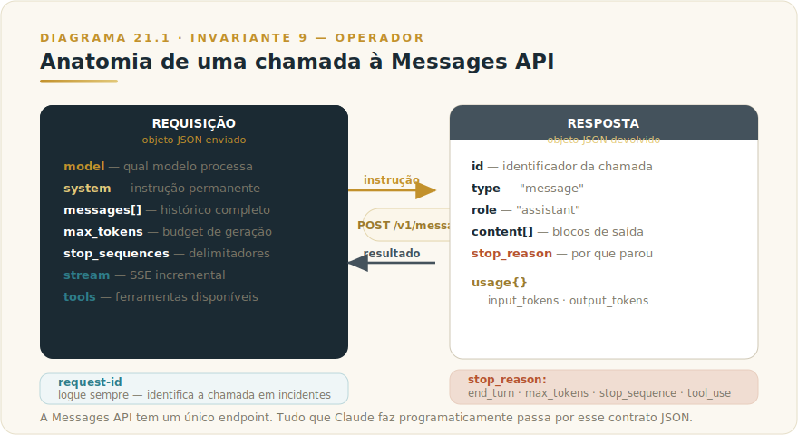
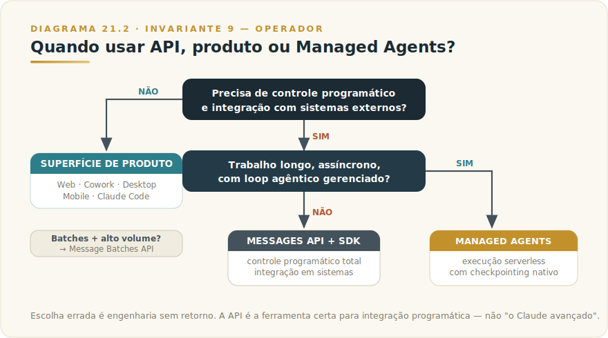

# CAPÍTULO 22
## API + SDKS

---

> *"O operador competente fornece instrução precisa, critério de aceitação explícito e capacidade de rejeitar a saída inadequada — o modelo responde com qualidade proporcional à instrução."*
>
> — Invariante 9 — Operador, Livro 1

---

> 🧭 **Por que este capítulo é a aplicação do Invariante 9 — Operador**
>
> A API é o ponto de máxima expressão do Invariante 9. Nas superfícies de produto — Cowork, Web, Desktop, Mobile — parte do critério de operação está embutido: a interface guia, o escopo é pré-definido, os mecanismos de freio já estão na experiência. Na API, nada disso existe. O operador define tudo: qual modelo, com qual instrução de sistema, com qual limite de tokens, com qual tratamento de erro, com qual política de retry. A qualidade do sistema resultante é, literalmente, proporcional à competência de quem o projetou. Não há interface que compense instrução vaga, nem SDK que corrija critério de aceitação ausente. A API amplifica o operador — competência e incompetência pelo mesmo fator.

---

## 22.1 — O CONCEITO INTUITIVO

Existe uma diferença fundamental entre *usar* Claude e *operar* Claude. Quando você abre claude.com e digita uma pergunta, você está usando uma superfície de produto: a Anthropic pré-configurou o modelo, pré-definiu os limites de segurança, pré-construiu a interface de conversa. Você traz o conteúdo; a plataforma traz a infraestrutura. É como ligar a televisão: o canal, o sinal, a decodificação — tudo já está pronto.

A API inverte essa relação. Você acessa o modelo diretamente, via protocolo HTTP, e constrói o sistema ao redor dele. Não há interface pré-configurada, nem fluxo de conversa gerenciado, nem freios embutidos além dos que você escreve. Há um endpoint, uma chave de autenticação e um contrato de dados: você envia um objeto JSON estruturado, o modelo processa, você recebe um objeto JSON estruturado de volta.

Esse grau de controle é o que torna a API a escolha certa para aplicações reais em produção. Um sistema de atendimento que precisa responder em menos de dois segundos, personalizado com o histórico do cliente, restrito a um conjunto específico de tópicos, com fallback automático em caso de sobrecarga — nenhuma superfície de produto atende a essa combinação. A API atende, porque você controla cada dimensão.

Os SDKs — bibliotecas oficiais em Python, TypeScript e outras linguagens — abstraem a camada de HTTP puro. Não mudam o que você pode fazer; mudam quanto código de infraestrutura você precisa escrever. A distinção entre API e SDK é a distinção entre o protocolo e a ferramenta que o fala.

---

## 22.2 — ANALOGIA: O ESTÚDIO E O INSTRUMENTO

Pense na diferença entre tocar um instrumento em um show já produzido e construir um estúdio de gravação do zero. No show, o palco já está montado, o som já está calibrado, a iluminação já segue um roteiro. Você traz o talento; a infraestrutura já existe. Essa é a experiência das superfícies de produto.

Construir o estúdio é diferente. Você escolhe cada equipamento. Decide a acústica da sala. Calibra cada canal do mixer. Determina a cadência de gravação, o formato de saída, como os erros de performance são tratados, como as pistas são mixadas. O resultado pode ser exatamente o que um show genérico jamais entregaria — mas exige que você saiba o que está fazendo.

A API é o estúdio. Os SDKs são as ferramentas de primeira qualidade com que você equipa a sala — as melhores DI boxes, os preamps certos, os monitores calibrados. Eles não constroem o estúdio por você; eles tornam a construção mais precisa e menos sujeita a erro de baixo nível. O resultado ainda depende inteiramente de quem está atrás do console.

---

## 22.3 — EXPLICAÇÃO TÉCNICA

### 22.3.1 — A Messages API: o contrato central

A API de Claude é, em essência, uma única operação: criar uma mensagem. O endpoint `POST /v1/messages` recebe uma requisição estruturada e devolve uma resposta estruturada. Tudo que Claude faz programaticamente passa por esse contrato.



Os campos essenciais da requisição são sete, e entender cada um não é detalhe técnico — é a gramática de qualquer sistema bem construído.

**`model`** — identifica qual membro da família Claude processa a requisição. O campo aceita o identificador de versão (ex.: `claude-opus-4-8`); os valores correntes estão no Apêndice Vivo (J). A decisão de qual modelo usar segue o critério do Capítulo 4: Opus para raciocínio premium, Sonnet como default de produção, Haiku para volume em velocidade.

**`system`** — a instrução de sistema: o que o modelo deve ser, o que pode e não pode fazer, o contexto permanente da aplicação. É o campo que transforma Claude de modelo genérico em assistente especializado. Uma aplicação de atendimento sem `system` bem escrito não é uma aplicação incompleta — é uma aplicação sem governança. Todo comportamento do modelo no seu sistema — o tom, os limites, o que ele responde quando não sabe, como trata casos fora do escopo — é definido aqui.

**`messages`** — o histórico da conversa como array de objetos com `role` e `content`. Roles disponíveis: `user` (entrada do usuário ou do sistema externo) e `assistant` (resposta do modelo). A Messages API é **stateless** por design: você sempre envia o histórico completo. Não há sessão mantida do lado do servidor. Se você quer continuidade de conversa, é você quem acumula e re-envia o histórico a cada turno. Essa é uma decisão arquitetural deliberada: o estado da conversa é responsabilidade do operador, não da API.

**`max_tokens`** — limite máximo de tokens na resposta. Campo obrigatório com implicação direta de custo e latência. O valor correto não é o máximo suportado — é o máximo que a aplicação precisa. Uma classificação binária com `max_tokens: 4096` desperdiça budget e paga por tokens que nunca chegam a ser usados. Defina com critério.

**`stop_sequences`** — lista de strings que encerram a geração quando encontradas. Útil para formatos estruturados onde você quer parar exatamente na delimitação certa, sem esperar `end_turn`. Por exemplo, em geração de XML, você pode parar ao encontrar a tag de fechamento do elemento principal.

**`stream`** — booleano que ativa o modo de streaming via Server-Sent Events (SSE). Quando `true`, a resposta chega em fragmentos incrementais em vez de um bloco único ao final. Essencial para aplicações com interface de usuário — a percepção de latência cai dramaticamente quando o texto aparece enquanto é gerado.

**`tools`** — array de definições de ferramentas que o modelo pode invocar. Quando presente, Claude pode decidir chamar uma das ferramentas em vez de (ou além de) gerar texto. O ciclo de tool use, detalhado no Capítulo 29 (MCP), segue o padrão: o modelo emite uma `tool_use` content block, o operador executa a ferramenta, devolve o resultado como `tool_result`, e o modelo completa a resposta. A API gerencia o protocolo; a execução da ferramenta é sempre responsabilidade do operador.

A resposta inclui campos diagnósticos que o operador maduro sempre monitora. **`stop_reason`** informa por que a geração parou: `end_turn` (modelo terminou naturalmente), `max_tokens` (atingiu o limite — se ocorre com frequência, `max_tokens` está subdimensionado), `stop_sequence` (hit em string de parada), `tool_use` (modelo quer chamar ferramenta). **`usage`** reporta `input_tokens` e `output_tokens`, matéria-prima do custo composto (Invariante 5).

### 22.3.2 — Streaming: a experiência que o usuário sente

Quando a API opera sem streaming, o cliente abre a conexão, espera — às vezes vários segundos — e recebe a resposta inteira de uma vez. Para interfaces de usuário, isso é inaceitável: a tela fica em branco enquanto o modelo gera, e então de repente aparece tudo.

Com streaming (`"stream": true`), a resposta chega como sequência de eventos SSE. O ciclo de eventos de uma resposta típica:

```
# Fluxo ilustrativo de eventos SSE — não é código de produção
event: message_start
data: {"type": "message_start", "message": {"id": "msg_...", ...}}

event: content_block_start
data: {"type": "content_block_start", "index": 0, "content_block": {"type": "text", "text": ""}}

event: content_block_delta
data: {"type": "content_block_delta", "index": 0, "delta": {"type": "text_delta", "text": "Olá"}}

# ... múltiplos content_block_delta com fragmentos de texto ...

event: content_block_stop
event: message_delta   # inclui stop_reason e usage final
event: message_stop
```

Os SDKs abstraem esse ciclo. Em Python, `client.messages.stream()` como context manager expõe `stream.text_stream` — um iterador que entrega fragmentos de texto à medida que chegam. Se você não precisa processar eventos individuais mas quer o `Message` completo no final (útil para geração de documentos longos onde você não exibe progressivamente), `stream.get_final_message()` faz exatamente isso: usa streaming internamente para evitar timeout de conexão, mas entrega o resultado consolidado.

```python
# Exemplo ilustrativo — use suas chaves reais via variável de ambiente
import anthropic

client = anthropic.Anthropic()  # lê ANTHROPIC_API_KEY do ambiente

with client.messages.stream(
    model="claude-opus-4-8",
    max_tokens=1024,
    system="Você é um assistente especializado em contratos comerciais brasileiros.",
    messages=[{"role": "user", "content": "Resuma os principais riscos deste contrato."}],
) as stream:
    for text in stream.text_stream:
        print(text, end="", flush=True)
```
*Exemplo ilustrativo. Nunca inclua chaves de API em código-fonte — use variáveis de ambiente ou cofres de segredo.*

### 22.3.3 — SDKs: o que eles abstraem

Os SDKs oficiais — Python (`anthropic`) e TypeScript (`@anthropic-ai/sdk`) — não são wrappers finos sobre HTTP. Eles implementam três classes de responsabilidade que, sem o SDK, você precisaria escrever manualmente.

**Gerenciamento de conexão e retry automático.** O SDK detecta erros transientes — `429 rate_limit_error`, `529 overloaded_error` — e aplica exponential backoff com jitter automaticamente. Número de retries e limite de tempo são configuráveis. Sem o SDK, você implementa esse ciclo manualmente, inclusive lendo o header `retry-after` que a API devolve com o valor em segundos a aguardar.

**Tipagem e deserialização.** O SDK mapeia a resposta JSON para objetos tipados. Em Python, `message.content[0].text` é um acesso direto ao texto; sem o SDK, você manipula dicts e lida com ausência de campos. Em TypeScript, o SDK exporta tipos completos, o que significa que erros de contrato são detectados em tempo de compilação, não em produção.

**Tratamento de erro estruturado.** Erros da API são levantados como exceções tipadas. Um `404` vira `anthropic.NotFoundError`; um `429` vira `anthropic.RateLimitError`; um `401` vira `anthropic.AuthenticationError`. Você captura pela classe, não por string-matching em mensagens de erro — uma distinção que importa quando erros diferentes exigem tratamento diferente.

A tabela de erros HTTP que você precisa conhecer:

| Código | Tipo | Ação recomendada |
|--------|------|-----------------|
| 400 | `invalid_request_error` | Corrija a requisição — campo inválido, formato errado |
| 401 | `authentication_error` | Verifique a chave de API — inválida ou ausente |
| 403 | `permission_error` | A chave não tem permissão para o recurso solicitado |
| 429 | `rate_limit_error` | Backoff exponencial; leia o header `retry-after` |
| 500 | `api_error` | Erro interno Anthropic; retry com backoff |
| 529 | `overloaded_error` | Capacidade temporária esgotada; retry com backoff mais longo |
| 504 | `timeout_error` | Requisição excedeu o tempo; use streaming para respostas longas |

Cada resposta também inclui o header `request-id` (e o campo `_request_id` em objetos Python). Logue esse valor. Quando algo der errado em produção e você precisar acionar suporte, é o que identifica a chamada específica.

### 22.3.4 — Autenticação e gestão de chaves

A autenticação da API usa uma chave secreta prefixada com `sk-ant-`. A regra é uma e não tem exceção: **a chave nunca vai para o código-fonte**.

O padrão correto é ler a chave de variável de ambiente. Os SDKs fazem isso automaticamente ao instanciar o cliente: procuram `ANTHROPIC_API_KEY` no ambiente e usam seu valor. Você não precisa passar a chave explicitamente.

```python
# Correto — o SDK lê a variável de ambiente automaticamente
client = anthropic.Anthropic()

# Errado — nunca faça isso
client = anthropic.Anthropic(api_key="sk-ant-...")  # hardcoded = risco real
```
*Exemplo ilustrativo do padrão correto vs. errado. Chaves reais não aparecem em código.*

Em produção, use um cofre de segredos (AWS Secrets Manager, Azure Key Vault, HashiCorp Vault, ou o equivalente no seu stack). O cofre injeta a chave como variável de ambiente na inicialização do serviço; o código nunca vê a chave em texto claro. Rotação de chaves — desativar a antiga, criar nova, atualizar o cofre — é rotina operacional, não emergência.

Chaves têm escopo por organização no Console da Anthropic. Para sistemas com múltiplos times ou múltiplos ambientes (desenvolvimento, homologação, produção), use chaves separadas: rastreabilidade de custo e isolamento de incidentes dependem disso.

---

## 22.4 — PADRÕES DE PRODUÇÃO

### 22.4.1 — Rate limits e idempotência

A API impõe limites em três dimensões: requisições por minuto (RPM), tokens de input por minuto (ITPM), e tokens de output por minuto (OTPM). O tier de cada organização define os valores exatos — números correntes no Apêndice Vivo (J). O que não muda é a estratégia.

**Backoff exponencial com jitter** é a resposta padrão ao `429`. O SDK aplica isso automaticamente. Na implementação manual: aguarde o valor do header `retry-after`; se ausente, comece com 1 segundo, dobre a cada retry, adicione jitter de ±20% para evitar thundering herd. Não retente mais de 5–7 vezes — acima disso, o erro provavelmente é estrutural, não transiente.

**Idempotência** é o padrão que previne efeitos duplicados quando um retry ocorre depois de um timeout. Para operações write (mensagens enviadas a usuários, registros gravados em banco), aplique uma chave de idempotência no seu sistema: antes de chamar a API, verifique se essa operação já foi executada com sucesso. A Messages API em si não tem idempotência built-in — a responsabilidade é do operador.

**Ramp-up gradual** evita atingir limites de aceleração. Se você vai subir um novo sistema ou aumentar carga existente, escale tráfego progressivamente — 10%, 25%, 50%, 100% — com pausa de monitoramento entre cada etapa. Picos súbitos podem gerar `429` mesmo dentro dos limites nominais, porque aceleração é medida em janela temporal curta.

### 22.4.2 — Observabilidade

Um sistema de produção que chama a API sem observabilidade está operando cego. O mínimo operacionalmente aceitável:

**Logue o `request-id` de toda resposta.** É o identificador que conecta sua chamada ao evento nos sistemas da Anthropic. Sem ele, debugar incidentes é adivinhação.

**Monitore `stop_reason` em distribuição.** Se `max_tokens` aparece com frequência crescente, seu limite está subdimensionado. Se `tool_use` cresce inesperadamente, o modelo está invocando ferramentas mais que o esperado. A distribuição dos stop reasons é um sinal de saúde do sistema.

**Monitore `usage.input_tokens` e `usage.output_tokens` por chamada.** Custo composto (Invariante 5) é multiplicação: aumento de tokens por chamada vezes aumento de volume vezes variação de tier. Rastrear por chamada permite identificar prompts inchados ou respostas maiores que o necessário antes de o custo escalar.

**Rastreie latência de ponta a ponta.** A API reporta tokens; a latência percebida pelo usuário inclui overhead de rede e processamento do seu sistema. Estabeleça baseline com streaming ativado vs. desativado — a diferença costuma ser substancial.

### 22.4.3 — Tratamento de erro em produção

A prática é capturar por tipo de erro e responder com comportamento diferente:

```python
# Padrão ilustrativo de tratamento de erro — adapte ao seu stack
import anthropic

client = anthropic.Anthropic()

try:
    message = client.messages.create(
        model="claude-opus-4-8",
        max_tokens=1024,
        messages=[{"role": "user", "content": prompt}],
    )
except anthropic.RateLimitError as e:
    # 429 — retry com backoff (o SDK já faz, mas você pode customizar)
    log_and_alert(e, level="warning")
except anthropic.AuthenticationError as e:
    # 401 — a chave está inválida; não retente, alerte imediatamente
    log_and_alert(e, level="critical")
except anthropic.APIError as e:
    # Outros erros da API — log com request_id para debugging
    log_with_request_id(e, e.request_id if hasattr(e, 'request_id') else None)
```
*Exemplo ilustrativo do padrão de captura — sem chaves reais, sem dados sensíveis.*

O erro `401` não deve ser retentado: a chave está inválida, e retry não corrige isso. Alerte imediatamente; é incidente operacional. O `429` e `529` são transientes — o SDK retenta automaticamente dentro dos limites configurados. O `500` é raro e geralmente transiente; retry com backoff é adequado.

Para respostas longas (análise de documento extenso, geração de relatório), use streaming ou o Message Batches API. Sem streaming, conexões idle podem ser dropadas por intermediários de rede após 30–60 segundos, causando timeout que parece erro da API mas é problema de infraestrutura de rede.

---

## 22.5 — CRITÉRIO DE DECISÃO: QUANDO DESCER PARA A API

Esta é a seção que separa este capítulo de uma documentação técnica. A API não é "o Claude avançado" — é uma superfície com um perfil de responsabilidade específico. Escolher errado entre API e produto é a falha de arquitetura mais comum de quem está começando com sistemas de IA.



| Situação | Superfície certa | Por quê |
|----------|-----------------|---------|
| Uso interativo pessoal ou em equipe, sem integração de sistema | **Web / Desktop / Mobile / Cowork** | A infraestrutura já está construída; a API seria engenharia sem retorno |
| Integração em sistema existente, controle de fluxo, personalização de comportamento | **Messages API + SDK** | Controle programático é o requisito; produto não entrega isso |
| Automação de tarefas longas, assíncronas, com checkpointing | **Message Batches API** | Tolerância a latência, resultado polled em vez de awaited |
| Loop agêntico de longa duração com infraestrutura gerenciada | **Managed Agents (Claude.ai)** | Execução serverless com checkpointing nativo |
| Engenharia de software, terminal, repositório | **Claude Code** (Capítulo 9) | SDK especializado com ferramentas de engenharia |
| Protocolo de integração com ferramentas externas | **MCP** (Capítulo 29) | Padrão aberto para conectar Claude a ferramentas — roda sobre a API |
| Workflows de múltiplos agentes com orquestração | **Subagents** (Capítulo 32) | Padrão de paralelismo e especialização — roda sobre a API |

**Quando SDK vs. HTTP puro:**

Use o SDK na esmagadora maioria dos casos. HTTP puro faz sentido em dois cenários: quando não existe SDK oficial para a sua linguagem, ou quando a dependência do SDK é problemática em um ambiente de baixíssimo nível com restrição de dependências externas. Fora desses casos, o SDK entrega retry automático, tipagem, tratamento de erro estruturado e compatibilidade com versões futuras da API.

**O critério real de quando descer para a API:**

Desça para a API quando precisar de uma ou mais das seguintes: integrar Claude num sistema existente com interface própria; personalizar o comportamento do modelo além do que as superfícies de produto permitem; escalar para volumes que exigem controle explícito de custo e rate limit; construir um produto que usa Claude como motor, não como interface. Se a necessidade é "quero que Claude me ajude a fazer X", a superfície de produto certa provavelmente já existe. Se é "quero que meu sistema faça X usando Claude como componente", a API é o caminho.

---

## 22.6 — EXEMPLO MEMORÁVEL: A CORRETORA QUE DEIXOU DE COBRAR DUAS VEZES PELO MESMO TRABALHO

*Cenário ilustrativo brasileiro.*

Uma corretora de seguros de médio porte, com operação concentrada em seguros para PMEs, processava manualmente cerca de quatrocentas solicitações de cotação por dia. Cada cotação exigia leitura do questionário do cliente, classificação de risco, identificação de coberturas aplicáveis, e elaboração de uma carta de cotação personalizada — trabalho que consumia entre quinze e vinte minutos por analista.

A decisão de integrar Claude via API surgiu de uma análise simples: o trabalho tinha estrutura (inputs conhecidos, outputs padronizados), volume suficiente para justificar engenharia, e sensibilidade suficiente para exigir controle preciso sobre o comportamento do modelo. Superfície de produto não atendia porque o sistema precisava se integrar ao CRM existente, receber inputs estruturados do banco de dados de questionários, e gravar as cotações geradas de volta no sistema de gestão.

A arquitetura escolhida: um serviço Python que lê questionários do CRM via API interna, monta o objeto de requisição para a Messages API, inclui no `system` as regras de classificação de risco da corretora (em linguagem natural, não lógica programada), e grava a resposta no sistema de gestão. O modelo escolhido foi Sonnet para o grosso do volume, com Opus acionado apenas para casos com coberturas atípicas ou risco elevado — roteamento implementado por uma primeira chamada de classificação com Haiku.

O `system` levou três semanas para estabilizar. Não por dificuldade técnica — por necessidade de iterar com os analistas sênior até que os casos de borda (exclusões específicas por segmento, regras de subscrição para determinados CNAEs) estivessem corretamente representados. Esse processo de refinamento da instrução de sistema é o trabalho do Invariante 9: a qualidade do sistema era proporcional à qualidade da instrução.

Observabilidade foi implementada desde o primeiro deploy: `request-id` logado em cada chamada, `stop_reason` e `usage.output_tokens` monitorados com alerta quando saíam do baseline. Em dois casos, o alerta de `max_tokens` frequente revelou que cotações de um segmento específico tinham padrão de resposta mais longo que o previsto — o `max_tokens` foi ajustado para esse segmento.

O resultado após três meses: volume processado subiu de 400 para 950 cotações/dia com a mesma equipe, que passou a atuar em revisão e aprovação em vez de elaboração. A taxa de aceitação das cotações pelos clientes subiu porque as cartas ficaram mais personalizadas. O custo por cotação caiu para menos de um terço do custo anterior, mesmo incluindo o custo de tokens da API.

---


## 22.7 — NA PRÁTICA: TRÊS APLICAÇÕES REPLICÁVEIS

As aplicações abaixo seguem a forma *situação → o que fazer → o ponto de julgamento*. O ponto de julgamento é o passo que separa integração profissional de automação ingênua.

**Aplicação 1 — Classificação de alto volume com roteamento por modelo.**
*Situação:* você tem um fluxo de centenas a milhares de documentos diários (e-mails, formulários, ocorrências) que precisam de triagem antes de qualquer ação. *O que fazer:* chame Haiku com `max_tokens` mínimo necessário para a classificação (típico: 10–50 tokens), inclua no `system` a taxonomia de categorias com critérios explícitos, use `stop_sequences` para encerrar no primeiro token da resposta. Para documentos que caem na categoria "complexo" ou "ambíguo", re-chame com Sonnet ou Opus — roteamento programático com um `if` no seu código, não lógica embutida no modelo. *O ponto de julgamento:* meça a distribuição de `stop_reason` e revise os casos onde `max_tokens` foi atingido — sinais de que a instrução de sistema está produzindo resposta maior que o esperado. E monitore `usage.output_tokens` por categoria: drift aqui é sinal de que a instrução de classificação perdeu precisão.

**Aplicação 2 — Pipeline de geração com validação de output estruturado.**
*Situação:* você precisa que o Claude gere JSON, YAML ou outro formato estruturado para alimentar um sistema downstream. *O que fazer:* defina `tools` com o schema do objeto esperado — use `strict: true` se disponível para garantir aderência — e instrua o modelo a usar a ferramenta em vez de responder em texto livre. Seu código valida o JSON recebido contra o schema antes de passar ao sistema downstream. Use `stop_reason == "tool_use"` como critério de sucesso; qualquer outro stop_reason é exceção tratada. *O ponto de julgamento:* não assuma que JSON válido é JSON correto. Valide os valores, não apenas a estrutura: um campo `cnpj` com formato válido mas CNPJ inexistente é erro de conteúdo que o schema não detecta. Decida antecipadamente quais validações de negócio rodam no seu código antes de aceitar a saída.

**Aplicação 3 — Assistente especializado com system prompt versionado.**
*Situação:* você quer construir um assistente interno (atendimento, suporte, análise) onde o comportamento precisa ser auditável e atualizável sem redeploy de código. *O que fazer:* armazene o system prompt em arquivo de configuração versionado separado do código (não hardcoded); leia o arquivo na inicialização do serviço. Logue `request-id` e a versão do system prompt em cada chamada para rastreabilidade. Monitore `stop_reason` e tokens de output em dashboard operacional. *O ponto de julgamento:* antes de mudar o system prompt em produção, rode um conjunto de casos de teste com resultado esperado contra a nova versão — o que o Capítulo de Evals chama de golden set. Mudança de prompt é mudança de comportamento de sistema; tratá-la com menos rigor que uma mudança de código é o erro mais frequente em manutenção de assistentes em produção.

> 🔧 **EXERCÍCIO**
> Pegue um fluxo de trabalho repetitivo do seu contexto que hoje consome tempo humano com entradas estruturadas e saídas padronizadas. Escreva o system prompt que definiria o comportamento do assistente — incluindo o que ele faz, o que não faz, e como trata casos fora do escopo. Depois, escreva as três validações que seu código faria sobre a saída antes de passá-la ao próximo passo. Se não conseguir escrever as validações, o critério de aceitação ainda não está claro o suficiente para confiar na integração.

---

## 22.8 — CAMADA VIVA → APÊNDICE J

Os seguintes elementos deste capítulo são voláteis e pertencem ao Apêndice Vivo (J), não ao corpo do texto:

- Identificadores exatos de versão de modelo (ex.: `claude-opus-4-8`) e datas de depreciação
- Preços por milhão de tokens de input e output por tier de modelo
- Limites de rate por tier (RPM, ITPM, OTPM)
- Versões dos SDKs (`anthropic` Python, `@anthropic-ai/sdk` TypeScript) e changelogs relevantes
- Janela de contexto máxima por modelo e limites de `max_tokens` por modelo
- Tamanho máximo de requisição por endpoint (referência: 32 MB para Messages API)

O que não muda: a estrutura da requisição (`model`, `system`, `messages`, `max_tokens`, `stop_sequences`, `stream`, `tools`), o ciclo de eventos SSE do streaming, o padrão de erros HTTP, o comportamento do backoff, o papel do `request-id`, e o critério de quando descer para a API vs. usar superfície de produto.

---

## 22.9 — LIMITAÇÕES E O QUE ESTE CAPÍTULO NÃO COBRE

**O que fica de fora intencionalmente:**

Tool use avançado (definição de schemas, parallel tool use, fine-grained streaming de tool inputs) é detalhado no Capítulo 29 (MCP), que trata o ecossistema de ferramentas por inteiro. Skills programáticas via API estão no Capítulo 31. Workflows de subagentes que usam a API como motor estão no Capítulo 32.

A Files API — upload de documentos para referência em múltiplas chamadas — não foi tratada aqui porque é uma extensão do contrato básico, não o contrato em si. A Batch API, para processamento assíncrono de alto volume, tampouco: ela altera o modelo de execução (poll em vez de await) mas usa o mesmo objeto de requisição.

**Limitações reais da API que você precisa conhecer:**

A Messages API é stateless por design. Isso é uma escolha arquitetural, não uma limitação para ser contornada — mas significa que o custo de tokens de input cresce linearmente com a conversa se você re-envia o histórico completo. Para conversas longas, a estratégia de compactação (resumir turnos anteriores antes de re-enviar) é responsabilidade do operador. A API não faz isso por você.

O modelo não tem acesso a tempo real ou a sistemas externos a menos que você forneça via tools ou via contexto na mensagem. Um sistema que precisa de dados atualizados do mercado, de registros do banco de dados, ou de qualquer informação externa precisa buscar esses dados antes de chamar a API e incluí-los no contexto da requisição.

---

## 22.10 — CONEXÕES

**Capítulos anteriores:**
- Capítulo 4 (Modelos Claude) — o critério de qual modelo usar na chamada de API
- Capítulo 8 (Cowork) — a superfície de produto de maior autonomia; entender a diferença entre Cowork e API é entender dois pontos distintos no espectro de controle vs. conveniência
- Capítulo 9 (Claude Code) — SDK especializado de engenharia que roda sobre a API; comparte o motor, diferencia-se no ecossistema de ferramentas

**Capítulos à frente:**
- Capítulo 29 (MCP) — protocolo de ferramentas externas que se integra à API via `tools`; a API é o motor, MCP é a malha de conectores
- Capítulo 31 (Skills) — extensões de capacidade acessíveis via API
- Capítulo 32 (Subagents e Workflows) — padrões de orquestração de múltiplos agentes usando a API como primitiva

---

## RESUMO EXECUTIVO

A Claude API é o ponto de máxima expressão do Invariante 9: nenhuma superfície de produto gerencia o comportamento do modelo por você. Você controla o modelo (`model`), a instrução permanente (`system`), o histórico (`messages`), o budget de geração (`max_tokens`), e todos os parâmetros de produção. A qualidade do sistema resultante é proporcional à sua competência de operação.

A Messages API tem um único endpoint (`POST /v1/messages`) e uma resposta estruturada com diagnóstico de término (`stop_reason`) e contabilidade de tokens (`usage`). SDKs Python e TypeScript abstraem HTTP, tipagem, retry automático e tratamento de erro estruturado — use-os. Chaves de API vivem em variáveis de ambiente ou cofres de segredo, nunca em código-fonte.

Em produção: logue o `request-id`, monitore `stop_reason` em distribuição, rastreie uso de tokens, implemente backoff para `429` e `529`. Streaming reduz latência percebida em interfaces de usuário. A API é stateless — estado de conversa é responsabilidade do operador.

O critério de quando descer para a API é uma pergunta: você precisa integrar Claude em um sistema existente como componente, com controle programático do comportamento? Se sim, API. Se não, existe uma superfície de produto para o seu caso de uso.

---

> ☐ **Validação UAU** — este capítulo cumpre a promessa se, ao terminar, o leitor técnico consegue: (1) articular a estrutura de uma requisição à Messages API sem consultar documentação; (2) explicar por que a API é stateless e o que isso implica arquiteturalmente; (3) justificar quando SDK é preferível a HTTP puro; (4) tomar a decisão API vs. superfície de produto com critério explícito, não intuição.

---

> *"A API não é a ferramenta avançada para quem domina o básico. É a ferramenta certa para quem tem a necessidade certa — integração programática, controle preciso, escala de produção. Quem desce para ela sem ter essa necessidade não ganhou poder; ganhou responsabilidade sem contrapartida."*

---

*Fontes primárias consultadas para este capítulo:*
- *[Using the Messages API — Claude API Docs](https://platform.claude.com/docs/en/build-with-claude/working-with-messages)*
- *[Streaming Messages — Claude API Docs](https://platform.claude.com/docs/en/build-with-claude/streaming)*
- *[Errors — Claude API Docs](https://platform.claude.com/docs/en/api/errors)*
- *[Rate Limits — Claude API Docs](https://platform.claude.com/docs/en/api/rate-limits)*
- *Invariante 9 — Operador: manifesto em L1-C00M-manifesto-invariantes.md e Apêndice M (L1-APX-M-manifesto-bolso.md)*
