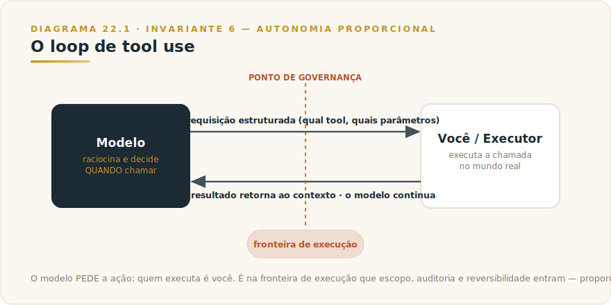
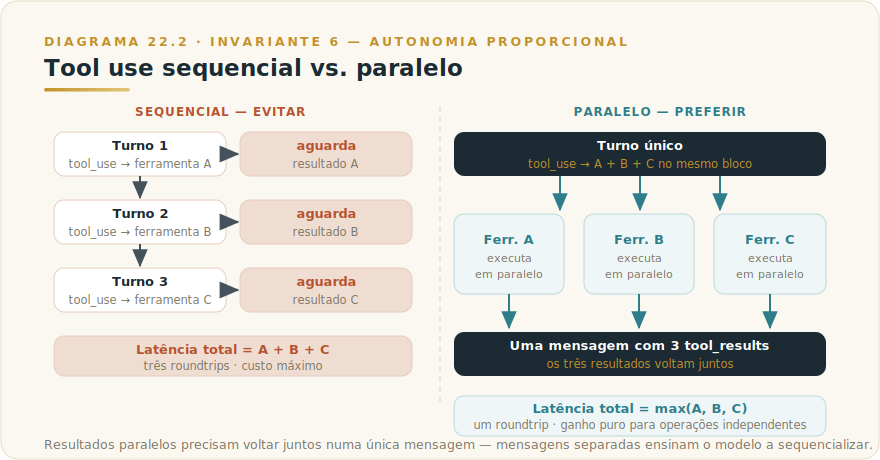
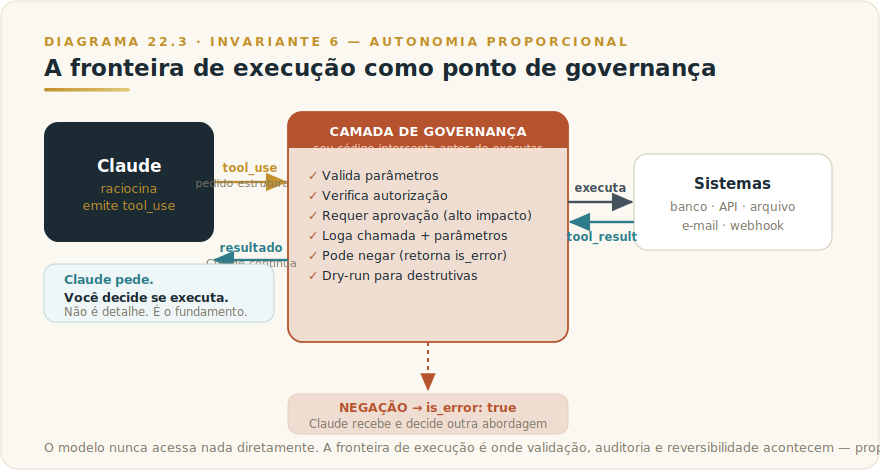

# CAPÍTULO 23
## TOOL USE

---

> *"O modelo raciocina. A ferramenta age. Quem entende essa divisão de trabalho nunca mais confunde 'Claude respondeu' com 'Claude fez'."*

---

> 🧭 **Por que este capítulo é a aplicação do Invariante 6 — Autonomia Proporcional**
>
> Dar uma ferramenta ao modelo é um ato de delegação. Não de conversação. Quando você expõe uma função — consultar um banco de dados, enviar uma mensagem, criar um arquivo — você está dizendo ao modelo: "use isso para agir no mundo em meu nome." Toda ação tem consequência. Toda ferramenta amplia o raio de impacto de um erro. O Invariante 6 diz que autonomia delegada só é ativo quando observabilidade e reversibilidade proporcionais a acompanham. Tool use é onde essa equação se materializa na chamada de API mais comum da engenharia de IA em 2026.

---

## 23.1 — O CONCEITO INTUITIVO

Há uma fronteira fundamental que a maioria das pessoas que usa IA nunca torna explícita: a diferença entre um modelo que **responde** e um modelo que **age**.

Quando você pede a Claude "qual a capital da Austrália?", ele responde a partir do que sabe. Nenhum sistema externo é tocado. O modelo consultou sua própria memória treinada e devolveu texto. Esse é o caso de uso mais simples: linguagem em, linguagem fora.

Mas o mundo profissional raramente se contenta com isso. Você quer que o modelo consulte o banco de dados de clientes atual, não o que existia na data de corte do treinamento. Quer que ele verifique o preço de um ativo neste minuto. Quer que ele grave um registro, dispare um processo, escreva num arquivo. Para isso, o modelo precisa de **ferramentas** — funções externas que ele pode invocar quando o raciocínio exige ação.

Tool use (ou *function calling*, como o padrão ficou conhecido nas versões iniciais das APIs) é o mecanismo que torna isso possível. A ideia central é simples: você descreve ao modelo quais funções existem e o que cada uma faz. O modelo decide quando chamar cada uma. **Você executa a chamada.** O resultado volta ao modelo, que continua raciocinar. O ciclo se repete até a tarefa estar concluída.

A distinção que o capítulo inteiro vai reforçar é esta: **o modelo pede a chamada. Você decide se executa.** Esse momento de decisão — entre o pedido do modelo e a execução da função — é o ponto de governança mais importante de toda a engenharia de agentes.

---

## 23.2 — ANALOGIA: O ESPECIALISTA COM O CATÁLOGO DE SERVIÇOS

Imagine um consultor sênior extremamente qualificado, mas que nunca sai da sala de reuniões. Ele pode raciocinar, analisar, sintetizar, redigir. O que ele não pode fazer sozinho é: consultar o sistema ERP da empresa, ligar para um cliente, assinar um documento. Para essas ações, ele usa um catálogo de serviços que a empresa disponibiliza — uma lista de pessoas e sistemas que ele pode acionar, com instruções sobre quando usar cada um.

Quando o consultor precisa de um número do financeiro, ele não inventa: ele requisita o serviço "consultar_saldo_conta". Você — o assistente que coordena o trabalho — recebe a requisição, a executa, e devolve o resultado. O consultor processa o número e continua o raciocínio.

O consultor nunca tem acesso direto ao ERP. Ele não liga para o cliente por conta própria. Ele **pede**, e alguém entre ele e o sistema decide se a requisição faz sentido e a executa. Esse alguém é o seu código — e é nesse ponto que governança acontece.

Essa analogia captura exatamente o que tool use é: um sistema de raciocínio que pede ações, e uma camada de execução que decide realizá-las, com você controlando quais ações existem, como são chamadas, e o que retornam.

---

## 23.3 — EXPLICAÇÃO TÉCNICA

### 23.3.1 — O ciclo agentico: como o loop funciona na prática

O ciclo de tool use é um loop, não um disparo único. Entender esse loop é o que separa quem usa tool use de quem usa tool use bem.



A sequência canônica, conforme documentada na API da Anthropic:

1. Você envia a mensagem do usuário ao modelo junto com o array `tools` — a lista de ferramentas disponíveis.
2. Claude avalia a mensagem e decide se precisa de uma ferramenta para responder.
3. Se decidir chamar uma ferramenta, Claude para e devolve `stop_reason: "tool_use"` com um ou mais blocos `tool_use` no conteúdo — cada bloco contém o nome da ferramenta e os parâmetros em JSON.
4. **Seu código** extrai os parâmetros, executa a operação (uma consulta SQL, uma chamada de API, uma escrita em arquivo), e formata o resultado como um bloco `tool_result`.
5. Você envia de volta uma nova mensagem de usuário contendo os `tool_result`s.
6. Claude lê os resultados e continua raciocinar. Se precisar de mais ferramentas, retorna ao passo 3. Quando tem tudo que precisa, devolve `stop_reason: "end_turn"` com a resposta final.

O loop termina quando `stop_reason` é qualquer coisa diferente de `"tool_use"` — seja `"end_turn"` (concluiu), `"max_tokens"` (atingiu o limite), ou `"refusal"` (recusou por política).

Esse design tem uma consequência arquitetural importante: **seu código é o executor**. Claude nunca acessa diretamente nenhum sistema. Ele emite uma requisição estruturada. Você intercepta, valida, executa, e devolve. A camada de execução está sempre na sua aplicação, nunca no modelo.

*Nota sobre ferramentas de servidor:* A Anthropic oferece um conjunto de ferramentas cujos efeitos colaterais são executados na infraestrutura deles — `web_search`, `web_fetch`, `code_execution`. Para essas, você não precisa gerenciar o loop: a execução já aconteceu quando a resposta chega. Os blocos `server_tool_use` na resposta mostram o que rodou e o que retornou. São úteis para o caso padrão; ferramentas que tocam seus sistemas, sua lógica de negócio, seus dados, sempre serão do tipo cliente (você executa). Detalhes de disponibilidade e preço dessas ferramentas de servidor residem no [Apêndice J](../04-apendices/L2-APX-J-apendice-vivo.md).

### 23.3.2 — Definindo ferramentas: schema, descrição e parâmetros

Uma ferramenta em Claude é definida por três campos obrigatórios:

| Campo | O que faz | Por que importa |
|-------|-----------|-----------------|
| `name` | Identificador único da ferramenta | O modelo refere-se a ela por esse nome; deve ser descritivo e sem espaços |
| `description` | Texto em linguagem natural explicando o que a ferramenta faz, quando usá-la, e o que retorna | É o principal sinal que Claude usa para decidir se e quando chamar a ferramenta |
| `input_schema` | JSON Schema descrevendo os parâmetros, seus tipos, e quais são obrigatórios | Define o "contrato" da ferramenta; Claude deve gerar JSON válido contra esse schema |

O campo mais subestimado é `description`. A Anthropic é explícita: descrições são "by far the most important factor in tool performance." Uma descrição vaga produz chamadas erradas ou ausentes. Uma descrição detalhada, com exemplos de quando usar e quando não usar, produz roteamento correto e consistente.

Exemplo de schema ilustrativo (não para produção):

```json
{
  "name": "consultar_contrato",
  "description": "Consulta os dados de um contrato de fornecedor pelo seu ID. Use quando precisar de informações sobre vigência, valor, cláusulas de rescisão, ou partes do contrato. Não use para criar ou modificar contratos — apenas para leitura. Retorna um objeto JSON com os campos: id, fornecedor, valor_mensal, data_inicio, data_fim, clausulas.",
  "input_schema": {
    "type": "object",
    "properties": {
      "contrato_id": {
        "type": "string",
        "description": "O identificador único do contrato, no formato CTR-XXXXXX"
      },
      "campos": {
        "type": "array",
        "items": {"type": "string"},
        "description": "Lista opcional de campos a retornar. Se omitido, retorna todos."
      }
    },
    "required": ["contrato_id"]
  }
}
```

Três práticas que a documentação oficial reforça e a experiência confirma:

**Consolide ferramentas relacionadas.** Em vez de `criar_ticket`, `atualizar_ticket`, `fechar_ticket`, considere uma ferramenta `gerenciar_ticket` com parâmetro `acao`. Menos ferramentas reduzem a ambiguidade de seleção.

**Nomeie com namespacing quando o conjunto crescer.** `github_list_prs`, `slack_send_message`, `crm_consultar_cliente`. Quando a biblioteca de ferramentas cresce, o prefixo resolve ambiguidade sem precisar de heurísticas na descrição.

**Retorne apenas o que o modelo precisa.** Respostas de ferramenta que retornam campos irrelevantes inflam o contexto e confundem o raciocínio. Retorne o subconjunto de dados que o modelo precisa para o próximo passo.

### 23.3.3 — Tool use paralelo: quando Claude chama múltiplas ferramentas de uma vez

Uma capacidade que economiza latência significativa e permanece subutilizada: Claude pode emitir múltiplas chamadas de ferramenta num único turno quando as operações são independentes entre si.



Quando Claude chama `get_weather` para São Paulo e para Rio de Janeiro no mesmo turno, a resposta da API contém dois blocos `tool_use`. Seu código executa ambos — em paralelo real, com `asyncio.gather` ou `Promise.all` — e devolve os dois `tool_result`s **numa única mensagem de usuário**. Esse é o detalhe crítico: resultados paralelos precisam voltar juntos, não em mensagens separadas. Mensagens separadas ensinam o modelo a sequencializar nas próximas chamadas.

Claude 4 em diante tem capacidade de paralelismo forte por padrão. Para estimulá-lo ainda mais, a documentação oficial recomenda instrução explícita no system prompt: "Quando múltiplas operações são independentes, invoque todas em paralelo no mesmo turno."

Para desabilitar o paralelismo quando a ordem importa (operação B depende do resultado de A), use `disable_parallel_tool_use: true` no parâmetro `tool_choice`. Mas na maioria dos casos de análise de dados, consultas independentes, e buscas paralelas, o paralelismo é ganho puro de performance.

### 23.3.4 — A fronteira de execução: onde a governança mora

Este é o ponto que justifica o Invariante 6 neste capítulo.

A documentação da Anthropic articula o princípio com precisão: *"The model never executes anything on its own. It emits a structured request, your code (or Anthropic's servers) runs the operation, and the result flows back into the conversation."*

Em português: Claude nunca executa nada diretamente. Ele pede. Você faz.

Essa arquitetura cria um ponto de interceptação natural entre o raciocínio do modelo e qualquer efeito no mundo. É o lugar onde governança acontece:

- **Você pode validar os parâmetros antes de executar.** O contrato_id que Claude passou existe? O valor do campo `acao` está dentro dos valores permitidos? Validação antes da execução previne erros de entrada que o modelo pode cometer com confiança.

- **Você pode requerer confirmação humana para ações de alto impacto.** Claude pediu `enviar_email` com 500 destinatários? Seu código intercepta, exibe para aprovação humana, e só executa após confirmação.

- **Você pode implementar dry-run para ferramentas destrutivas.** `deletar_registros` pode primeiro rodar em modo simulado, mostrar o que seria deletado, e só executar com flag explícito.

- **Você pode logar cada chamada.** Toda chamada de ferramenta, com seus parâmetros, quem a originou, e o resultado, pode ser registrada antes de qualquer execução — audit trail nativo.

- **Você pode negar a execução.** Se a chamada viola política (um modelo pedindo para acessar tabela restrita), seu código simplesmente retorna `tool_result` com `is_error: true` e uma mensagem explicativa. Claude recebe o erro e decide o que fazer — geralmente, tenta outra abordagem ou informa o usuário.

Esse ponto de interceptação não é detalhe de implementação — é o fundamento de toda segurança em sistemas com tool use. Um sistema que executa cegamente todo `tool_use` que o modelo emite não tem governança: tem obediência irrestrita. Em sistemas que enviam mensagens, modificam bancos de dados ou deletam arquivos, obediência irrestrita não é eficiência — é risco delegado sem controle.



---

## 23.4 — CRITÉRIO DE DECISÃO

### Quando dar uma ferramenta vs. resolver no prompt

Essa pergunta aparece toda vez que alguém está desenhando um sistema com Claude. A resposta tem três eixos:

**Primeiro eixo: o modelo pode responder sem a ferramenta?**
Se a informação existe no treinamento, está no contexto ou pode ser razoavelmente inferida, uma ferramenta adiciona latência e complexidade sem ganho. Resumir texto, traduzir um parágrafo, redigir um e-mail — nenhuma dessas tarefas precisa de ferramenta. A pergunta diagnóstica: *você estaria escrevendo regex para extrair uma decisão da saída do modelo?* Se sim, essa decisão deveria ser uma chamada de ferramenta.

**Segundo eixo: a tarefa tem efeito colateral ou precisa de dado externo?**
Enviar e-mail, gravar registro, consultar preço atual, verificar status de pedido — essas operações exigem ferramenta por natureza. O modelo não pode inventar um preço de ontem com credibilidade; ele precisa da consulta real.

**Terceiro eixo: a saída precisa ter formato garantido?**
Quando você precisa que o modelo produza um JSON com campos específicos e tipos definidos, use uma ferramenta com schema. O schema força o formato — `strict: true` no tool definition garante aderência total. Prosa que "parece JSON" mas pode variar é menos confiável que uma chamada de ferramenta com schema estrito.

### Como desenhar ferramentas seguras

| Princípio | O que significa | Exemplo concreto |
|-----------|-----------------|------------------|
| **Princípio de menor privilégio** | A ferramenta expõe apenas o que a tarefa requer | `consultar_saldo` retorna o saldo de uma conta específica, não acesso ao extrato de todas as contas |
| **Separar leitura de escrita** | Ferramentas que leem e ferramentas que modificam devem ser distintas | `buscar_cliente` (só leitura) separada de `atualizar_cliente` (requer autorização extra) |
| **Parâmetros explícitos, não amplos** | Evite parâmetros como `query: string` que aceitam qualquer coisa | Prefira enumerações explícitas: `status: "ativo" | "inativo" | "suspenso"` |
| **Retorno mínimo necessário** | Não retorne campos que o modelo não precisa para a próxima decisão | Se o modelo precisa saber se o pagamento aprovado, retorne `{aprovado: true}` não o objeto de pagamento completo |
| **Validação antes da execução** | Valide parâmetros no seu código antes de tocar o sistema | Verifique se o ID existe, se o usuário tem permissão, se o valor está no range esperado |
| **Dry-run para destrutivas** | Ferramentas que deletam, enviam, ou modificam dados em massa devem ter modo de simulação | `deletar_registros(dry_run=True)` mostra o que seria deletado sem executar |

### O que nunca expor como ferramenta automática

Há classes de ação que não devem existir como ferramentas executadas automaticamente — onde "automaticamente" significa sem confirmação humana explícita no fluxo de execução.

| Classe de ação | Por quê não automatizar | Alternativa |
|----------------|------------------------|-------------|
| **Comunicação externa em massa** | E-mail, mensagem, notificação para listas grandes é irreversível | Ferramenta gera rascunho; humano aprova e envia |
| **Operações financeiras** | Débito, transferência, aprovação de pagamento têm impacto irreversível e regulatório | Ferramenta prepara instrução; sistema de aprovação separado executa |
| **Deleção de dados sem backup** | Erro num parâmetro pode apagar dados que não se recuperam | Soft delete + período de retenção; hard delete só com confirmação dupla |
| **Alteração de permissões de acesso** | Mudança de ACL pode abrir brechas de segurança ou bloquear usuários | Ferramenta propõe mudança; admin revisa e aplica |
| **Disparo de webhooks para sistemas de terceiros** | Efeito cascata em sistemas externos fora do seu controle | Ferramentas para sistemas internos; webhooks externos com retry e confirmação |

A heurística prática: se o erro da ferramenta exigiria uma ligação para corrigir, ela precisa de confirmação humana antes da execução — não depois.

---

## 23.5 — EXEMPLO MEMORÁVEL: O SISTEMA DE TRIAGEM QUE APRENDEU A PERGUNTAR ANTES DE AGIR

*Cenário ilustrativo brasileiro.* Uma empresa de e-commerce de médio porte em Belo Horizonte construiu, no início de 2026, um sistema de triagem de reclamações com Claude. O objetivo: reduzir o tempo de resposta a clientes que reclamavam de pedidos atrasados. O modelo receberia a mensagem do cliente, consultaria o sistema logístico, e proporia uma resolução.

A primeira versão foi ingênua e custou caro. O sistema expôs quatro ferramentas ao modelo: `consultar_pedido`, `emitir_reembolso`, `reprocessar_pedido`, e `enviar_email_cliente`. Claude usava todas as quatro de forma encadeada — consultava o pedido, verificava o atraso, emitia o reembolso, e enviava e-mail confirmando. Rápido, eficiente, e desastroso quando o pedido simplesmente estava em trânsito normal mas com rastreamento desatualizado: o modelo reembolsava e enviava e-mail pedindo desculpas por um atraso que não existia.

A segunda versão aplicou o Invariante 6 com rigor. Três mudanças cirúrgicas.

Primeiro, `emitir_reembolso` e `enviar_email_cliente` foram removidas do conjunto de ferramentas automáticas e substituídas por `propor_reembolso` e `redigir_email_cliente` — ferramentas que **preparam** a ação mas não a executam. O resultado de cada uma era um rascunho para revisão humana, não uma operação disparada.

Segundo, `consultar_pedido` foi enriquecida com mais contexto de retorno — status logístico detalhado, histórico de rastreamento, última atualização do transportador. Claude passou a ter informação suficiente para distinguir atraso real de atraso de rastreamento.

Terceiro, um nó de aprovação humana foi inserido no fluxo: o atendente via o rascunho de resolução que Claude propunha (incluindo reembolso se aplicável), ajustava se necessário, e disparava com um clique. A automação absorveu o trabalho de triagem e redação; o humano manteve a decisão final nas ações de impacto.

Resultado: tempo médio de triagem caiu de 12 minutos para 3 minutos por caso. Taxa de reembolsos indevidos caiu para zero. A satisfação dos atendentes subiu — eles passaram de triadores a decisores informados.

A lição estrutural é o Invariante 6 inteiro num sistema de produção. O modelo ganhou ferramentas de leitura com autonomia plena, e ferramentas de escrita com alcance limitado a rascunho. A execução de ações irreversíveis ficou com o humano. Observabilidade total (cada chamada logada), reversibilidade garantida (nada executado sem aprovação). Autonomia proporcional ao que o sistema conseguia observar e desfazer.

---

## 23.6 — NA PRÁTICA: TRÊS APLICAÇÕES REPLICÁVEIS

Três aplicações com a forma *situação → o que fazer → o ponto de julgamento*. O ponto de julgamento é o que separa tool use bem governado de delegação irrestrita.

**Aplicação 1 — Consulta e análise de dados internos com ferramenta de leitura.**
*Situação:* você quer que o Claude responda perguntas sobre dados da empresa — clientes, pedidos, contratos — consultando o banco de dados em tempo real, não apenas conhecimento estático. *O que fazer:* exponha ferramentas de leitura com escopo restrito (`buscar_cliente`, `listar_pedidos_por_periodo`, `consultar_contrato`); cada ferramenta retorna apenas os campos necessários para a decisão imediata, não o objeto inteiro. Instrua no system prompt que ferramentas de escrita não existem nesse contexto — eliminar do catálogo é mais seguro do que proibir por instrução. *O ponto de julgamento:* revise periodicamente os parâmetros passados às ferramentas em produção: o modelo está consultando intervalos razoáveis? Está construindo filtros corretos? Um `buscar_pedidos(data_inicio="2020-01-01", data_fim="2026-12-31")` sem filtro de cliente útil é um sinal de que a instrução não especificou o escopo esperado da consulta.

**Aplicação 2 — Geração de rascunhos para ações de alto impacto com confirmação humana.**
*Situação:* você quer que o Claude prepare comunicações, documentos ou registros que depois um humano revisa e dispara. *O que fazer:* exponha apenas ferramentas de rascunho (`redigir_email`, `preparar_relatorio`, `propor_atualizacao_cadastro`); o resultado de cada ferramenta é texto estruturado para revisão, não uma ação executada. Seu código exibe o rascunho ao operador humano com botão de aprovação explícita — a execução real (enviar e-mail, gravar no banco, chamar API externa) fica no handler de aprovação, fora do ciclo de tool use. *O ponto de julgamento:* o operador humano não deve apenas "clicar em aprovar" — deve ler o conteúdo. Monitore o tempo médio entre a geração do rascunho e a aprovação: se está abaixo de cinco segundos consistentemente, o processo de revisão virou formalidade, e você voltou à obediência irrestrita com uma camada de UI por cima.

**Aplicação 3 — Agente com limite de turnos e dry-run para operações destrutivas.**
*Situação:* você tem um agente com loop agentico que pode chamar múltiplas ferramentas em sequência para completar uma tarefa (atualizar registros, processar lote de documentos, executar ações em sistema externo). *O que fazer:* implemente `max_turns` explícito no loop — se o agente não convergiu em N turnos, ele para e reporta o estado atual para revisão humana. Para ferramentas com efeito destrutivo ou irreversível, implemente parâmetro `dry_run=True` que retorna o que *seria* feito sem executar; o agente roda em dry-run primeiro, e seu código exibe o sumário ao operador antes de permitir a execução real. *O ponto de julgamento:* o sumário de dry-run precisa ser legível por um humano não-técnico em menos de dois minutos. Se não for, o escopo da operação está grande demais para ser aprovado de forma informada — divida em etapas menores.

> 🔧 **EXERCÍCIO**
> Escolha uma tarefa repetitiva do seu fluxo de trabalho que hoje exige que você consulte pelo menos dois sistemas diferentes antes de tomar uma decisão. Escreva a definição de duas ferramentas de leitura que dariam ao Claude o acesso necessário — com `name`, `description` e `input_schema`. Depois, escreva a regra que seu código aplicaria como ponto de interceptação antes de executar cada chamada de ferramenta. Se a segunda parte for mais difícil que a primeira, você encontrou o lugar certo para construir governança.

---

## 23.7 — CAMADA VIVA: O QUE MUDA, O QUE FICA

Tool use é um dos padrões mais estáveis da engenharia de IA. O ciclo — modelo raciocina, ferramenta age, resultado volta, modelo continua — não é uma característica de uma versão específica de Claude. É o padrão arquitetural que surgiu com o advento dos LLMs como coordenadores de sistemas e que vai perdurar enquanto modelos de linguagem precisarem interagir com o mundo externo.

O que é **durável**:
- O contrato "modelo pede, você executa": a divisão de trabalho entre raciocínio e efeito
- O schema JSON como interface entre linguagem natural e sistemas tipados
- A fronteira de execução como ponto de governança
- O ciclo agentico (while stop_reason == tool_use)
- O princípio de menor privilégio na definição de ferramentas

O que está **no Apêndice J** (volátil):
- Quais ferramentas de servidor a Anthropic oferece hoje e seus preços por uso
- Limites de tokens nos schemas de ferramentas por modelo
- Número máximo de ferramentas num único request por versão de API
- Modelos recomendados para cenários de tool use complexo (cambia com cada geração)
- Benchmarks de performance de tool use por modelo

Veja [Apêndice J — Apêndice Vivo](../04-apendices/L2-APX-J-apendice-vivo.md) para a foto atual desses números.

---

## 23.8 — LIMITAÇÕES E CUIDADOS

**A qualidade da ferramenta é teto da qualidade do agente.** Um modelo excelente com ferramentas mal descritas produz chamadas erradas com confiança. Invista na descrição tanto quanto no schema — frequentemente mais.

**O modelo erra parâmetros, especialmente em casos de borda.** Claude pode passar um ID em formato incorreto, omitir campo obrigatório em instrução ambígua ou interpretar mal um enumerador. Validação antes da execução é defesa obrigatória, não opcional.

**Ferramentas com retorno verboso inflam o contexto.** Cada ciclo do loop agentico acumula no contexto: a chamada, os parâmetros, o resultado. Ferramentas que retornam objetos grandes (um contrato inteiro quando o modelo precisava só do valor da multa) encarecem o ciclo e degradam a atenção do modelo em conversas longas. Projete retornos enxutos.

**Loops podem não convergir.** Em casos raros, o modelo entra num ciclo de chamadas que nunca resolve — chama ferramenta A, o resultado leva a chamar ferramenta B, que leva de volta a A. Implemente limite de turnos (`max_turns` no Claude Code SDK, ou contador manual no loop próprio) e tratamento de loop.

**Ferramentas de servidor têm pricing adicional.** `web_search`, `code_execution`, e similares têm cobrança por uso além dos tokens. Volume alto pode surpreender o orçamento. Ver Apêndice J para números atuais.

**Tool use e extended thinking têm restrições de compatibilidade.** Quando extended thinking está ativo, `tool_choice: "any"` e `tool_choice: "tool"` retornam erro — apenas `"auto"` e `"none"` são compatíveis. Verifique compatibilidade antes de combinar.

---

## 23.9 — CONEXÕES COM OUTROS CAPÍTULOS

- 🔗 **Invariante que rege este capítulo** → [Framework 3 — Autonomia Proporcional](../../Livro-1-Os-Invariantes/03-frameworks/L1-F3-agente-prop.md)
- 🔗 **Cowork: tool use em produtos para não-técnicos** → [Capítulo 8 — Claude Cowork](L2-C08-cowork.md)
- 🔗 **Claude Code: tool use no terminal** → [Capítulo 9 — Claude Code](L2-C09-claude-code.md)
- 🔗 **Skills: ferramenta como ativo organizacional** → [Capítulo 31 — Claude Skills](L2-C31-skills.md)
- 🔗 **Subagents: orquestrar múltiplos agentes com ferramentas** → [Capítulo 32 — Subagents e Workflows](L2-C32-subagents-workflows.md)
- 🔗 **MCP: o protocolo que padroniza ferramentas em escala** → [Capítulo 29 — Claude + MCP](L2-C29-claude-mcp.md)
- 🔗 **Números voláteis (pricing de ferramentas de servidor, limites por modelo)** → [Apêndice J — Apêndice Vivo](../04-apendices/L2-APX-J-apendice-vivo.md)

### Tool use e MCP: a conexão estrutural

Tool use e MCP (Model Context Protocol) não são alternativas — são camadas distintas do mesmo ecossistema. Tool use é o mecanismo primitivo da API: você define ferramentas no JSON, Claude chama, você executa. MCP é o protocolo que padroniza como ferramentas são descobertas, descritas e acessadas em escala.

Em termos práticos: quando você conecta um servidor MCP ao Claude, cada `Tool` que esse servidor expõe vira automaticamente uma ferramenta disponível para o modelo — com schema, descrição, e semântica de execução definidos pelo servidor. MCP é, essencialmente, um catálogo de ferramentas com protocolo de transporte padronizado. Em vez de definir manualmente cada ferramenta no array `tools` da API, o servidor MCP anuncia o catálogo, e o cliente (Claude, Cowork, Claude Code) o consome.

Para arquiteturas corporativas onde dezenas de ferramentas precisam estar disponíveis, onde a governança exige catálogo aprovado e log de chamadas, e onde múltiplos sistemas internos precisam ser expostos como ferramentas, o MCP é o passo natural após dominar tool use primitivo. O Capítulo 29 detalha como construir e governar essa camada em escala.

---

## 23.10 — RESUMO EXECUTIVO

| Conceito | Síntese |
|----------|---------|
| **O que é tool use** | Mecanismo que permite ao modelo invocar funções externas; modelo raciocina, você executa, resultado volta |
| **O ciclo agentico** | `while stop_reason == "tool_use"`: Claude pede → você executa → `tool_result` de volta → Claude continua |
| **A ferramenta é um schema** | Três campos: `name`, `description` (mais importante), `input_schema` (JSON Schema) |
| **Tool use paralelo** | Claude pode emitir múltiplas chamadas num único turno; resultados devem voltar em uma única mensagem |
| **A fronteira de execução** | Claude pede; você decide se executa — ponto de governança onde validação, autorização e logging acontecem |
| **Quando usar ferramenta** | Dado externo ou atual, efeito colateral necessário, formato de saída garantido obrigatório |
| **Quando não usar** | Modelo responde do treinamento, tarefa é puramente de raciocínio ou escrita, latência adicional não vale |
| **Ferramentas seguras** | Menor privilégio, leitura separada de escrita, parâmetros explícitos, validação antes da execução |
| **O que nunca automatizar** | Comunicação em massa, operações financeiras, deleção sem backup — sempre confirmação humana antes |
| **MCP como evolução** | Protocolo que padroniza descoberta e execução de ferramentas em escala; detalhe no Cap 28 |
| **Invariante regente** | 6 — Autonomia Proporcional: ferramenta amplia ação; governança deve acompanhar o alcance |

---

## 23.11 — VALIDAÇÃO UAU

| # | Critério | Você consegue? |
|---|----------|----------------|
| 1 | **Clareza** — Explicar em 60 segundos a diferença entre "Claude respondeu" e "Claude chamou uma ferramenta", e por que isso importa para governança | ☐ |
| 2 | **Técnica** — Descrever o ciclo agentico completo (os 6 passos), incluindo o que acontece com múltiplas ferramentas paralelas | ☐ |
| 3 | **Schema** — Escrever uma definição de ferramenta com `name`, `description`, e `input_schema` que um desenvolvedor poderia usar sem perguntas | ☐ |
| 4 | **Decisão** — Dado um conjunto de 5 ações, classificar cada uma: ferramenta automática, ferramenta com confirmação, ou não-ferramenta | ☐ |
| 5 | **Governança** — Identificar os três pontos de controle que seu código pode implementar entre o `tool_use` do modelo e a execução real | ☐ |

🔗 **Próximo capítulo:** [Capítulo 29 — Claude + MCP](L2-C29-claude-mcp.md) *(Tool use padronizado em escala corporativa)*

---

> *"A ferramenta amplifica o raio de ação. A fronteira de execução amplifica o raio de controle. Quem constrói sistemas com tool use sem construir a fronteira ao mesmo tempo não tem alavancagem — tem exposição."*
