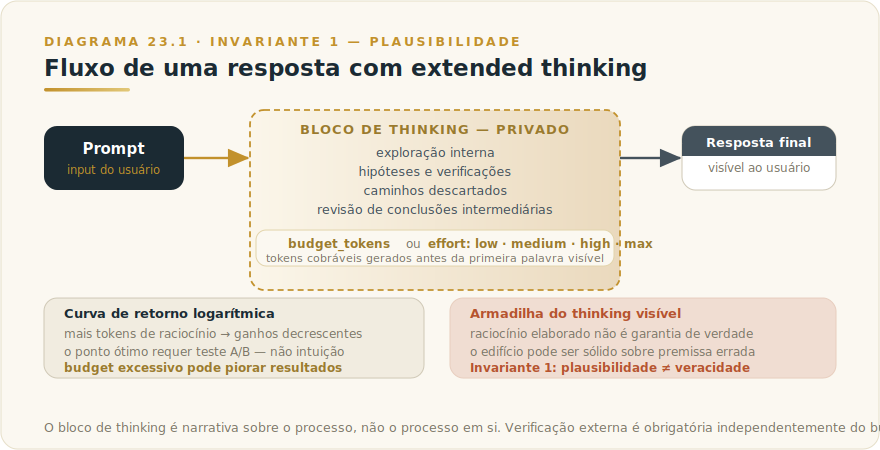
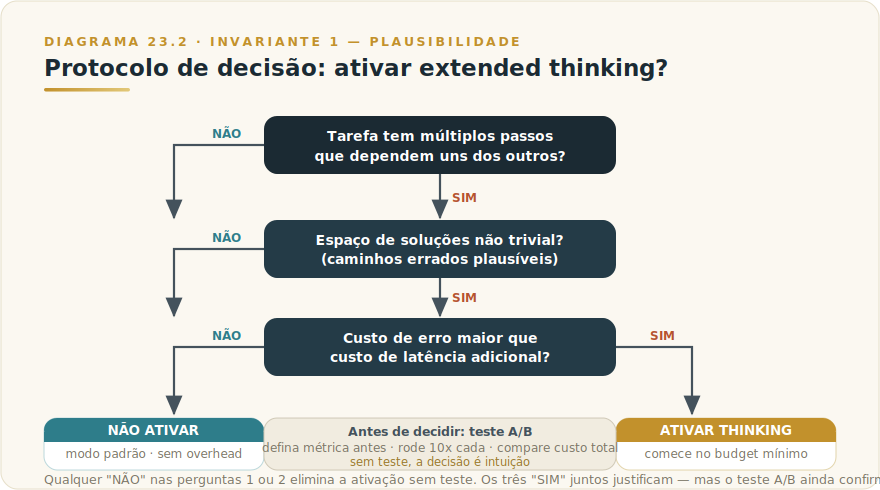

# CAPÍTULO 24
## EXTENDED THINKING

---

> *"Mais tempo de pensar não garante chegar mais perto da verdade — garante chegar mais rápido ao que parece verdade."*

---

> 🧭 **Por que este capítulo é a aplicação do Invariante 1 — Plausibilidade**
>
> Extended thinking amplifica o que Claude já faz naturalmente: produzir a continuação mais plausível dado o contexto. Com mais tokens de raciocínio, o modelo chega a conclusões que parecem mais sólidas — mais passos, mais verificações cruzadas, mais detalhes. O problema é que a aparência de solidez cresce mais rápido do que a solidez real. Plausibilidade não é verdade, e essa distinção não desaparece porque o modelo "pensou mais". Este capítulo é sobre quando o raciocínio estendido realmente melhora o resultado, quando é desperdício, e quando — caso mais insidioso — aumenta a confiança do leitor sem aumentar a veracidade da resposta.
>
> Invariante secundário: **Inv. 5 — Custo Composto** (tokens de raciocínio entram na conta; o thinking budget é o multiplicador mais silencioso de custo que existe).

---

## 24.1 — O CONCEITO INTUITIVO

Existe uma distinção fundamental no modo como seres humanos resolvem problemas. Algumas questões são respondidas quase instantaneamente, por reconhecimento de padrão: "qual a capital do Brasil?", "como se escreve 'gerência'?", "qual é o formato padrão de um CNPJ?". Outras exigem pausa, exploração, rascunho mental — descobrir que o prazo vence na sexta e que sexta é hoje, e então recalcular todo o cronograma a partir disso, mantendo na cabeça as restrições que se acumulam.

Claude, em modo padrão, responde como alguém que processa tudo em uma única passagem linear. O modelo lê o prompt, gera tokens um a um — cada token produzido com base nos anteriores e no contexto disponível, sem possibilidade de voltar atrás formalmente. É rápido e suficiente para a esmagadora maioria das tarefas.

Extended thinking muda essa equação para problemas específicos. Quando ativado, o modelo gera primeiro uma sequência privada de tokens de raciocínio — o "pensamento" — antes da resposta final visível ao usuário. Esses tokens permitem explorar caminhos, verificar hipóteses, detectar contradições e revisar conclusões intermediárias antes de se comprometer com a resposta. O resultado é um processo mais parecido com rascunho-e-revisão do que com ditado direto.

O ganho real, quando existe, é mensurável: em matemática competitiva (AIME 2024), ciências em nível de doutorado (GPQA Diamond) e raciocínio multi-etapa com muitas restrições, o extended thinking produz melhorias substanciais de acurácia. A melhora segue uma curva logarítmica: mais tokens de raciocínio geram ganhos decrescentes, mas os primeiros incrementos costumam ser significativos.

O limite que este capítulo vai estabelecer com clareza: raciocínio estendido não cura alucinação. Se o modelo não sabe um fato, pensar mais não vai fazer o fato aparecer — vai apenas gerar um caminho de raciocínio mais elaborado chegando a uma conclusão plausível e errada. O Invariante 1 permanece intacto: o modelo é motor de plausibilidade, independentemente de quanto tempo ele "pensou".

---

## 24.2 — ANALOGIA: O CONSULTOR COM TEMPO PARA TRABALHAR

Imagine dois cenários com o mesmo consultor especialista. No primeiro, você o para no corredor e pergunta: "você acha que devemos expandir para o nordeste agora?" Ele responde em quarenta segundos, com base no que já sabe sobre o mercado. A resposta é informada, mas improvisada.

No segundo cenário, você agenda uma reunião para sexta, envia a pergunta por escrito, e deixa o consultor trabalhar dois dias no problema antes da reunião. Ele estuda os números, verifica três hipóteses contra os dados, descobre que uma premissa da sua pergunta está errada, e chega à reunião com uma análise mais robusta e com a inconsistência identificada.

O segundo consultor produziu algo melhor? Em geral, sim — mas apenas se o problema era suficientemente complexo para se beneficiar de dois dias de trabalho. Se você perguntou "qual o CNPJ da filial de Recife?", os dois dias extras não adicionaram nada além de custo. E em ambos os casos, se o consultor não tiver acesso aos dados certos, ele vai produzir uma análise bem elaborada baseada em premissas equivocadas.

Extended thinking é o segundo cenário. Melhor para problemas que têm estrutura suficiente para se beneficiar de exploração. Inútil para recuperação de informação simples. Incapaz de transformar ausência de dado em dado.

---

## 24.3 — COMO FUNCIONA: A MECÂNICA DO RACIOCÍNIO ESTENDIDO

### 24.3.1 — Tokens de raciocínio: o que são e onde vivem

Quando extended thinking está ativo, a resposta do modelo é composta de dois blocos distintos. O primeiro é o bloco de thinking — a sequência interna de raciocínio que o modelo gera antes de formular a resposta final. O segundo é a resposta propriamente dita, visível ao usuário.

Os tokens de raciocínio podem ser exibidos ao usuário como parte do output ou permanecer internos, dependendo da configuração da plataforma. O que não varia: esses tokens são gerados, consomem tempo de inferência e entram na cobrança.

A propriedade mais relevante para fins práticos: os tokens de raciocínio são "não alinhados ao personagem" no sentido de que o processo interno de exploração pode incluir passos contraditórios, hipóteses descartadas e caminhos mortos — exatamente como um rascunho humano. A resposta final passa pelo processo de alinhamento normal; o thinking block não necessariamente. Isso cria uma assimetria importante que retomaremos em 23.5.

### 24.3.2 — Thinking budget e effort: controles disponíveis

A API da Anthropic disponibilizou dois mecanismos de controle ao longo do tempo, com evolução importante.

O mecanismo original — **budget_tokens** — permitia ao desenvolvedor especificar um número máximo de tokens que o modelo poderia usar no bloco de raciocínio. Mínimo de 1.024 tokens; o modelo podia parar antes se julgasse suficiente. O budget_tokens entra como subconjunto do parâmetro max_tokens da chamada e é cobrado como tokens de output.

O mecanismo mais recente — **adaptive thinking com effort** — substitui o budget estático por um controle de esforço qualitativo. Em vez de especificar um teto de tokens, o desenvolvedor especifica o nível de esforço desejado: `low`, `medium`, `high` (default), ou `max`. O modelo calibra o quanto pensar em função do esforço declarado e da complexidade percebida da query. Em queries simples, o modelo pode responder diretamente sem acionar o thinking mesmo em effort `high`. A Anthropic documenta que adaptive thinking supera extended thinking com budget estático em avaliações internas.

> **Números específicos de budget máximo e preço por token de raciocínio** → [Apêndice Vivo (J)](../04-apendices/L2-APX-J-apendice-vivo.md). Esses números mudam entre versões de modelo e tier.

### 24.3.3 — Disponibilidade por tier de modelo

Extended thinking e adaptive thinking estão disponíveis nos tiers Opus e Sonnet da família Claude. O tier Haiku — posicionado para velocidade e volume — não oferece essa capacidade, alinhada ao seu propósito: Haiku é o modelo para tarefas onde latência e custo mínimos são o critério dominante, não profundidade de raciocínio.

A progressão é instrutiva como padrão, não como release. As primeiras gerações expunham um *thinking budget* explícito; gerações seguintes adotaram modo adaptativo, em que o próprio modelo calibra quanto pensar, e o controle manual por tokens passou a mecanismo herdado. A direção — menos configuração manual, mais calibração automática — tende a continuar. O nome exato do parâmetro e quais modelos o suportam vivem no [Apêndice Vivo (J)](../04-apendices/L2-APX-J-apendice-vivo.md); verifique antes de configurar.

### 24.3.4 — A curva de retorno do raciocínio

A documentação da Anthropic descreve o ganho de performance com extended thinking como logarítmico em relação ao número de tokens de raciocínio. Em matemática competitiva (AIME 2024), a acurácia melhora de forma previsível com o budget crescente — mas com retornos decrescentes claros a partir de determinado patamar.

Isso tem implicação direta para o uso prático: não existe benefício em simplesmente maximizar o budget. O ponto ótimo existe em algum lugar entre o budget mínimo funcional e o máximo técnico, e varia por tipo de tarefa. Encontrar esse ponto requer teste — não intuição.

---

## 24.4 — FRAMEWORK DE DECISÃO: QUANDO ATIVAR, QUANDO ECONOMIZAR, COMO MEDIR

A pergunta prática é simples: esta tarefa se beneficia de raciocínio estendido o suficiente para justificar o custo adicional em tokens e latência? A tabela abaixo organiza o critério.

### Tabela 24.1 — Quando ativar vs. quando é desperdício

| Categoria de tarefa | Extended thinking? | Por quê |
|---|---|---|
| Problemas matemáticos não triviais (álgebra, cálculo, probabilidade) | **Sim** | Múltiplos passos com verificação de consistência; erros cascateiam |
| Raciocínio com múltiplas restrições simultâneas | **Sim** | O modelo precisa explorar trade-offs e eliminar contradições |
| Debug de código complexo com falha não óbvia | **Sim** | A causa raiz pode estar várias camadas acima do sintoma |
| Análise estratégica com premissas conflitantes | **Sim** | A exploração de hipóteses alternativas melhora a conclusão |
| Planejamento com dependências não lineares | **Sim** | Detectar loops e impasses requer simulação de caminhos |
| Perguntas factuais simples ("qual o endereço de X?") | **Não** | O modelo não tem o fato; pensar mais não o cria |
| Recuperação de informação do contexto | **Não** | O dado já está no prompt; o modelo precisa localizar, não raciocinar |
| Sumarização de texto curto | **Não** | A tarefa é linear; pensamento adicional não agrega |
| Classificação e roteamento | **Não** | Custo/latência adicional desnecessário para tarefas binárias |
| Tradução e reformatação | **Não** | Transformação, não raciocínio |
| Alucinação factual verificável | **Nunca resolve** | Extended thinking elabora melhor o erro, não o corrige |

### Critério executivo de ativação

Ative extended thinking quando a tarefa atende a pelo menos dois dos três critérios:

1. **Múltiplos passos que dependem uns dos outros** — errar no passo 2 invalida os passos 3, 4 e 5.
2. **Espaço de soluções não trivial** — existem caminhos errados plausíveis que parecem certos na passagem linear.
3. **Custo de erro maior que custo de latência** — uma resposta errada rápida é pior do que uma resposta certa em dois minutos.

### Como medir o ganho real: protocolo A/B mínimo

Não ative extended thinking assumindo que vai ajudar. O protocolo correto:

**Passo 1 — Defina a métrica de qualidade antes de testar.** Para matemática: acurácia binária (correto/errado). Para análise: rubrica de 1-5 por critério predefinido. Para código: taxa de testes passando. Sem métrica prévia, o viés de confirmação vai fazer você "ver" melhora onde ela não existe.

**Passo 2 — Rode o mesmo prompt com e sem thinking, dez vezes cada.** Variância importa. Uma amostra de um não é dado.

**Passo 3 — Compare custo total, não custo por resposta.** Se thinking aumenta acurácia em 20% mas triplica o custo por chamada, o ROI depende do custo de uma resposta errada no seu caso específico.

**Passo 4 — Teste o menor budget que entrega o ganho.** Começar do mínimo (1.024 tokens) e subir é mais eficiente do que começar do máximo e tentar cortar.

---

## 24.5 — A ARMADILHA COGNITIVA: O THINKING VISÍVEL AUMENTA CONFIANÇA, NÃO VERACIDADE

Este é o ponto mais importante do capítulo — e o mais negligenciado nas discussões sobre extended thinking.

Quando o usuário vê o bloco de raciocínio antes da resposta, algo previsível acontece: a confiança aumenta. Você viu o "trabalho". Acompanhou os passos. Parece rigoroso.

O problema é documentado pela própria Anthropic: "o raciocínio estendido às vezes acaba sendo enganoso; Claude às vezes inventa passos plausíveis para chegar onde quer chegar." Mais diretamente: "o raciocínio 'falso' de Claude pode ser muito convincente."

É o Invariante 1 operando em nova roupagem. O motor de plausibilidade não gera apenas respostas plausíveis — gera *raciocínios* plausíveis. Um raciocínio plausível que conduz a uma conclusão errada é mais perigoso do que uma resposta diretamente errada: o caminho de raciocínio ativa a confiança do leitor de um modo que uma resposta seca não ativaria.

A Anthropic é direta sobre o problema de fidelidade (*faithfulness*): não temos como garantir que o bloco de thinking representa fielmente o que realmente acontece dentro do modelo. Modelos frequentemente tomam decisões com base em fatores que não discutem explicitamente no processo de raciocínio visível. Isso significa que o thinking visível não é uma janela transparente para o processo cognitivo do modelo — é uma narrativa sobre esse processo.

### A analogia da perícia judicial

Imagine um perito que apresenta ao júri um laudo de doze páginas, com equações, referências cruzadas e conclusões intermediárias numeradas, chegando à conclusão de que o réu estava no local do crime. A estrutura do laudo aumenta enormemente a persuasividade da conclusão. Mas se a premissa inicial estiver errada — se a metodologia de coleta de amostras estava contaminada, por exemplo — todo o edifício elaborado conduz com rigor aparente à conclusão errada.

O thinking visível funciona da mesma forma. Ele constrói um edifício persuasivo. O operador competente sabe que a solidez do edifício depende da solidez das premissas, e que o modelo pode construir edifícios muito sólidos sobre premissas equivocadas.

### Implicação operacional

**Nunca use o thinking visível como substituto de verificação externa.** O bloco de thinking confirmando uma afirmação factual não é evidência adicional de que a afirmação é verdadeira — é evidência de que o modelo gerou um raciocínio coerente com ela, o que é propriedade muito diferente.

Se a afirmação precisaria de verificação sem o thinking visível, precisa da mesma verificação com ele. A cadeia de raciocínio não muda o status epistêmico da conclusão.

---

## 24.6 — EXEMPLO MEMORÁVEL: A ANÁLISE QUE PRECISAVA PENSAR ANTES DE RESPONDER

*Contexto: escritório de contabilidade em São Paulo, consultoria para empresa do setor de logística que está analisando estruturar uma filial no Espírito Santo para aproveitar benefícios fiscais estaduais.*

**Sem extended thinking** — o contador usa Claude para obter uma visão geral inicial. Claude responde com os principais benefícios do FUNDAP e das regras gerais de ICMS, estrutura uma resposta clara e bem organizada. Tempo: segundos.

**Com extended thinking** — o contador usa Claude para analisar se a estrutura planejada (filial ES com exportação triangulada) é consistente com as regras de estabelecimento permanente para fins de PIS/COFINS e se há risco de autuação com base em precedentes do CARF. O modelo gera um bloco de raciocínio que explora três interpretações possíveis da Instrução Normativa relevante, identifica que o ponto crítico é a caracterização de "operações próprias" versus "operações em conta de terceiros", e conclui que há ambiguidade legal que precisa de parecer especializado.

**O que mudou:** a tarefa do primeiro caso é recuperação e síntese — extended thinking não ajudaria. A do segundo é raciocínio multi-etapa com restrições legais sobrepostas — exatamente o perfil que se beneficia do thinking.

**O que não mudou:** a resposta do segundo caso, por mais elaborada que seja, não é substituto de consulta a advogado tributarista e verificação de precedentes recentes no CARF. O Invariante 1 permanece: a conclusão é plausível; veracidade exige verificação externa.

---

## 24.7 — NA PRÁTICA: TRÊS APLICAÇÕES REPLICÁVEIS

Três aplicações com a forma *situação → o que fazer → o ponto de julgamento*. Extended thinking tem custo real em tokens e latência — o ponto de julgamento define onde esse custo é justificado.

**Aplicação 1 — Revisão de contrato com múltiplas cláusulas interdependentes.**
*Situação:* você tem um contrato de 30 páginas com cláusulas que se referenciam mutuamente — penalidades que dependem de definições no preâmbulo, limites de responsabilidade que interagem com exclusões no anexo. Precisa identificar inconsistências e riscos que surgem da combinação das cláusulas, não de cada uma isoladamente. *O que fazer:* ative extended thinking (effort `high`) e estruture o prompt pedindo explicitamente que o modelo mapeie as dependências entre cláusulas antes de fazer qualquer afirmação sobre risco. Inclua o contrato completo no contexto e defina no system prompt as categorias de risco que o seu contexto jurídico considera relevantes. Peça que a resposta cite o número de cada cláusula referenciada. *O ponto de julgamento:* o thinking visível pode apresentar um argumento legal coerente baseado em uma leitura que um jurista experiente rejeitaria por razões de prática forense ou jurisprudência recente. A saída não substitui revisão de advogado — ela organiza e aponta; o julgamento sobre o que é risco real permanece com o especialista humano que conhece o contexto regulatório atual.

**Aplicação 2 — Diagnóstico de causa raiz em sistema com múltiplas camadas.**
*Situação:* um sistema em produção está falhando de forma intermitente — logs mostram erros em três serviços diferentes, métricas de banco indicam lentidão em horários específicos, e o time não consegue determinar se é problema de aplicação, de infraestrutura ou de dados. *O que fazer:* compile os logs, métricas e configuração relevantes em um bloco de contexto estruturado; ative thinking com effort `high`; instrua o modelo a raciocinar explicitamente sobre hipóteses alternativas e descartar as que contradizem a evidência antes de concluir. Use pseudocódigo ou estrutura de dados no contexto (não o código completo) para tornar o contexto denso e navegável sem inflá-lo desnecessariamente. *O ponto de julgamento:* rode o protocolo A/B — mesmo prompt com e sem thinking, cinco vezes cada. Se a hipótese de causa raiz for diferente entre os grupos, você encontrou um caso onde o raciocínio adicional muda a conclusão. Se for idêntica, extended thinking era overhead desnecessário para esse diagnóstico específico.

**Aplicação 3 — Planejamento de projeto com restrições conflitantes.**
*Situação:* você precisa planejar um projeto com prazo fixo, orçamento limitado, dependências entre entregáveis e três restrições de recursos que se contradizem parcialmente (pessoa A não pode trabalhar com pessoa B no mesmo sprint; entregável C depende de D que depende de A que tem disponibilidade limitada nas semanas 3 e 4). *O que fazer:* liste todas as restrições explicitamente no prompt, peça que o modelo raciocine em voz alta sobre cada possível sequência antes de propor um cronograma, e especifique que o modelo deve identificar os trade-offs que está fazendo (o que ele prioriza quando as restrições são mutuamente exclusivas). *O ponto de julgamento:* o cronograma proposto é um ponto de partida para negociação, não uma decisão. Verifique explicitamente os trade-offs que o modelo declarou: eles refletem as prioridades reais do projeto? Se o modelo escolheu priorizar prazo sobre qualidade sem que você tivesse declarado essa preferência, você precisa corrigir a premissa, não apenas o cronograma.

> 🔧 **EXERCÍCIO**
> Pegue um problema técnico ou analítico real que você resolveu recentemente por tentativa e erro — um diagnóstico, uma decisão de arquitetura, uma análise com dados conflitantes. Rode o mesmo problema com Claude, com e sem thinking ativado, e compare: (1) a conclusão foi diferente? (2) o caminho de raciocínio visível revelou uma premissa que você assumia implicitamente? (3) o thinking levou a uma conclusão correta por um raciocínio que você não consegue verificar passo a passo? Essa terceira pergunta é o ponto de atenção central do Invariante 1 aplicado ao thinking estendido.

---

## 24.8 — CAMADA VIVA: O QUE MUDA E O QUE FICA

Extended thinking é uma área em rápida evolução. O Apêndice Vivo (J) deve ser consultado para:

- **Modelos com suporte a adaptive thinking vs. budget_tokens** — a linha de corte muda a cada geração
- **Preço por token de raciocínio por tier** — pode diferir do preço de output padrão
- **Budget máximo por versão de modelo** — muda entre releases
- **Latência típica por faixa de budget** — relevante para decisão de produto

**O que não muda** (e por isso fica no corpo do capítulo):

O trade-off fundamental entre computação na inferência e custo/latência/veracidade é estrutural. Qualquer modelo que gere tokens adicionais antes de responder vai incorrer em custo adicional de tempo e dinheiro. Qualquer modelo que gere mais tokens plausíveis vai produzir raciocínios mais elaborados que podem ser corretos ou elegantemente errados. O critério de quando usar — tarefas multi-etapa com restrições, não recuperação factual simples — vai sobreviver a múltiplas gerações de modelos porque deriva da natureza do problema, não da tecnologia.

---

## 24.9 — LIMITAÇÕES, ADVERTÊNCIAS E CONEXÕES

### Limitações verificadas

**Extended thinking não cura alucinação.** Se o modelo não tem o dado ou o dado no corpus de treinamento está errado, raciocinar mais produz conclusões erradas mais convincentes. A verificação externa continua sendo obrigatória para fatos de domínio restrito.

**Extended thinking não resolve contexto insuficiente.** Se o prompt não tem as informações necessárias, o modelo raciocina a partir do que tem — incluindo pressupostos não verificados que preenchem lacunas com plausibilidade.

**Raciocínio visível não é janela transparente.** A Anthropic documenta que "modelos frequentemente tomam decisões com base em fatores que não discutem explicitamente no processo de thinking." O bloco de thinking é uma narrativa sobre o processo, não o processo em si.

**Budget excessivo pode piorar resultados.** Em alguns casos documentados, budgets muito altos levam o modelo a "overthink" — explorar caminhos que o desviam de respostas corretas que chegaria mais diretamente com budget menor.

**Custo composto é real.** Um pipeline com extended thinking ativado em todas as chamadas — inclusive nas que não se beneficiam dele — pode multiplicar custos sem ganho proporcional. O Invariante 5 (Custo Composto) aplica-se com força total aqui.

### Conexões com outros capítulos

**Capítulo 4 — Todos os Modelos Claude:** a seção 4.3.2 introduz extended thinking no contexto de seleção de modelo. Este capítulo aprofunda o critério operacional de quando ativar e como medir o ganho real.

**Capítulo 16 — Claude Research:** Research usa raciocínio estendido internamente em algumas configurações. A limitação do Invariante 1 — pesquisa entrega cobertura e síntese, não verdade verificada — se aplica independentemente de quanto raciocínio interno aconteceu antes do relatório final.

**Capítulo 8 — Claude Cowork:** Cowork em tarefas complexas de múltiplos passos pode se beneficiar de adaptive thinking nos nós de decisão. O mesmo critério de proporcionalidade do Invariante 6 (Autonomia Proporcional) aplica-se ao thinking budget: ative onde agrega, não como default global.

**Invariante 1 (L1 — Os Invariantes):** "O modelo entrega o plausível, não o verdadeiro — e os dois coincidem, até a hora em que não." Extended thinking não muda essa mecânica fundamental: amplia a capacidade de produzir plausível elaborado, não de produzir verdadeiro verificado.

---

## RESUMO EXECUTIVO DO CAPÍTULO 24

Extended thinking é uma capacidade real com ganhos reais em classe específica de tarefa — e com armadilhas reais quando mal compreendida.

**O que é:** o modelo gera tokens de raciocínio privados antes da resposta final. Isso permite exploração de hipóteses, verificação de consistência e correção de caminhos errados antes do commit na resposta.

**Quando ajuda:** problemas de múltiplas restrições simultâneas, matemática não trivial, debug de causa raiz não óbvia, análise estratégica com premissas conflitantes. O critério: múltiplos passos dependentes + espaço de soluções não trivial + custo de erro > custo de latência.

**Quando não ajuda:** recuperação factual, sumarização simples, classificação, tradução, qualquer tarefa onde a resposta depende de um dado que o modelo simplesmente não tem.

**A armadilha central:** o thinking visível aumenta a confiança do leitor sem aumentar necessariamente a veracidade da conclusão. Raciocínio elaborado que chega a uma premissa errada é mais perigoso do que resposta diretamente errada, porque a estrutura do argumento desativa a vigilância crítica.

**O custo:** tokens de raciocínio são cobráveis. A curva de retorno é logarítmica. Budget excessivo não otimiza resultado. O ponto ótimo requer teste A/B, não intuição.

**O que sobrevive às versões:** o trade-off entre computação na inferência e custo/latência/veracidade. Isso é estrutural, não uma característica de modelo específico.

---

☐ **UAU deste capítulo:** A próxima vez que você ver um bloco de "raciocínio" visível que chega a uma conclusão clara e bem fundamentada, resista ao impulso de confiar mais nela do que confiaria sem o bloco. O edifício pode ser sólido. A fundação pode não ser.

---

> *"O pensamento visível é uma narrativa sobre o processo, não o processo. A narrativa pode ser convincente. A conclusão ainda precisa ser verificada."*

---
