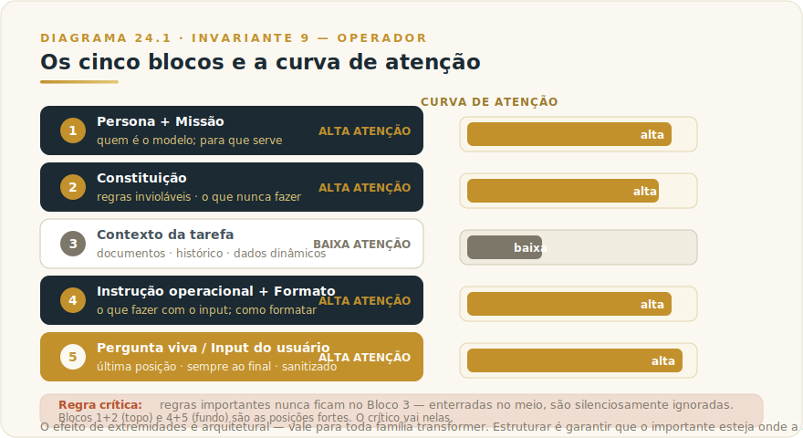
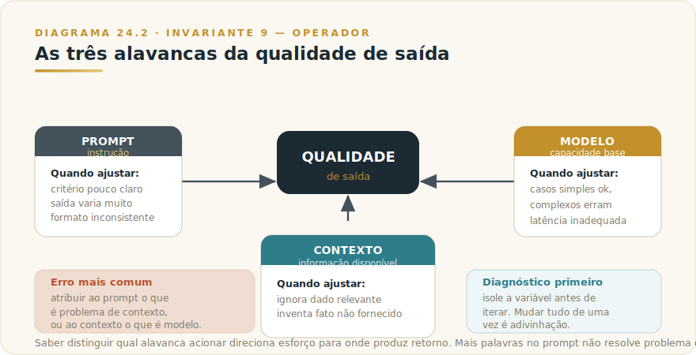

# CAPÍTULO 25
## ENGENHARIA DE PROMPT AVANÇADA

---

> *"O modelo não distingue boa instrução de má instrução por sinalização explícita — responde com mesma confiança a ambas. A qualidade da saída é, antes de tudo, a qualidade da instrução."*
>
> — Invariante 9, manifesto de Os Invariantes

---

> 🧭 **Por que este capítulo é a aplicação do Invariante 9 — Operador**
>
> O Invariante 9 afirma que a IA amplifica competência e incompetência pelo mesmo fator. Engenharia de prompt avançada é o campo onde essa assimetria se torna mais visível e mais explorável. Um prompt bem construído não é uma fórmula mágica: é a materialização de um critério claro — o operador sabe o que quer, sabe como verificar, e traduz isso numa instrução que o modelo consegue seguir de forma confiável. O prompt ruim não é aquele que usa as palavras erradas; é aquele que esconde um critério de aceitação mal definido atrás de linguagem elaborada. Este capítulo trata do método de construir prompts confiáveis, não de receitas. O framework estrutural está em **L1-F4 — Engenharia de Prompt Estendida** (Livro 1); o que fazemos aqui é a aplicação concreta desse framework no contexto específico do Claude.

---

## 25.1 — O CONCEITO INTUITIVO

Toda interação com o Claude começa com uma instrução. Mas "instrução" cobre uma faixa enorme: de uma pergunta vaga a um sistema de produção com memória, ferramentas e regras invioláveis. Engenharia de prompt é o trabalho de fechar essa faixa — de transformar uma intenção difusa numa instrução suficientemente precisa para que o modelo produza saída útil de forma repetível e verificável.

O problema fundamental não é técnico — é epistêmico. Para escrever um bom prompt, o operador precisa saber o que quer com a precisão necessária para distinguir uma saída boa de uma medíocre. Quando esse critério existe, o prompt é relativamente simples de construir. Quando está vago, nenhum truque de formatação resolve: o modelo gera algo plausível, e o operador fica insatisfeito sem conseguir articular por quê.

Daí a primeira regra do método: **antes de escrever o prompt, escreva o critério de aceitação.** O que concretamente tornaria a resposta boa? O que a tornaria inaceitável? Sem resposta para essas perguntas, a iteração de prompt é adivinhação disfarçada de engenharia.

A segunda regra é consequência direta do Invariante 9: a qualidade do prompt não é medida pelo esforço que custou escrevê-lo, mas pela consistência dos resultados que produz. Um prompt de três linhas que gera saída confiável em noventa por cento dos casos é superior a um prompt de trinta linhas cujo comportamento varia. Mais palavras não é melhor instrução.

---

## 25.2 — ANALOGIA: O BRIEFING DE CRIAÇÃO

Em agências de publicidade, existe uma distinção clássica entre o *brief* e o *brainstorm*. O brief é o documento que o cliente entrega à criação: define o problema, o público, as restrições, o critério de sucesso. O brainstorm é o que o criativo faz com isso. Um brief ruim não inibe a criatividade — redireciona-a. O criativo produz algo brilhante para o problema errado.

O prompt funciona da mesma forma. Claude é o criativo excepcionalmente capaz; o operador é o responsável pelo brief. A inteligência do modelo não compensa um brief vago — amplifica-o, produzindo com grande fluência algo que não serve ao que o operador precisava. A saída parecerá boa: extensão certa, tom certo, estrutura certa. E errará no que importa, porque o que importava não estava no brief.

Bons diretores de criação sabem que metade do trabalho de um brief é explicitar o que **não** se quer — a restrição que delimita o espaço criativo. O mesmo vale para prompts: especificar o que o modelo não deve fazer, o que não deve assumir, o formato que não serve, às vezes é mais eficaz do que acrescentar mais instruções positivas.

---

## 25.3 — TÉCNICAS DE CONSTRUÇÃO: O MÉTODO

Esta seção cobre as técnicas de construção de prompts confiáveis. O foco é o *como e por quê* de cada técnica — não modelos prontos para copiar, mas princípios que o operador aplica conforme o contexto. Cada técnica é datável em termos de evidência (ver Seção 24.5 para o que pode mudar); os princípios subjacentes são derivados de propriedades estruturais de modelos de linguagem que sobrevivem a versões.

### 25.3.1 — Estrutura clara: a anatomia de um prompt confiável

O framework L1-F4 define cinco blocos canônicos para prompts de produção: **persona e missão** (topo, posição de maior atenção), **constituição** (regras invioláveis, logo após a persona), **contexto da tarefa** (meio, posição de menor atenção), **instrução operacional e formato** (imediatamente antes do input, posição forte), e **pergunta viva** (última posição, sempre). Este capítulo aplica esse framework ao Claude especificamente.

A propriedade estrutural que fundamenta o framework é o que o Livro 1 chama de Invariante 2 — Extremidades: modelos de linguagem prestam mais atenção ao início e ao fim do contexto do que ao meio. Isso não é quirk do Claude — é consequência da arquitetura de atenção que toda família de modelos transformer compartilha. O corolário direto é que regras críticas enterradas no meio de um prompt longo são silenciosamente ignoradas com frequência maior do que o operador percebe. A solução não é repetir a regra em todo lugar; é estruturar o prompt para que o crítico esteja nas posições fortes.

A implicação prática para Claude especificamente: o **system prompt** é o Bloco 1+2 do L1-F4 — é onde vão a definição de papel e as regras invioláveis, e ele recebe atenção completa a cada chamada. O **contexto dinâmico** (documentos, histórico, dados) é o Bloco 3 — cresce por tarefa, mas nada crítico vai aqui. A **instrução final + input do usuário** é o Bloco 4+5 — posição forte que reitera o que importa e entrega o input sanitizado.

### 25.3.2 — Few-shot e multishot: exemplos como especificação

Exemplos são a técnica de maior retorno por esforço em engenharia de prompt. A razão é estrutural: um exemplo bom comunica formato, tom, nível de detalhe, regras implícitas e casos extremos de uma vez só, sem exigir que o operador os articule explicitamente. Três exemplos bem escolhidos frequentemente superam duas páginas de instrução verbal.

A documentação da Anthropic recomenda entre três e cinco exemplos para resultados consistentes, envoltos em tags `<example>` (múltiplos em `<examples>`) para separação clara das instruções. Não é formalismo — reduz ambiguidade em prompts que misturam instrução, contexto e demonstração.

O critério de um bom exemplo é triplo: **relevância** (espelha o caso real, não uma versão simplificada), **diversidade** (cobre casos extremos, não apenas o caso típico), e **negatividade seletiva** (inclui pelo menos um exemplo do que não fazer, com anotação explícita do por quê). Exemplos negativos são sistematicamente sub-utilizados, e frequentemente são os mais eficazes para delimitar comportamento indesejado que o operador não sabe articular positivamente.

O que torna o multishot especialmente valioso no Claude é que ele funciona como especificação implícita de critério — o modelo infere o padrão a partir dos exemplos e o generaliza. Isso tem uma consequência importante: **exemplos inconsistentes ensinam inconsistência**. Se os três exemplos usam formatos ligeiramente diferentes, o modelo vai variar entre eles, porque aprendeu que variação é permitida.

### 25.3.3 — Chain-of-thought: quando o raciocínio explícito ajuda

Chain-of-thought (CoT) é a técnica de pedir ao modelo que raciocine em passos antes de produzir a resposta final. A evidência empírica de que isso melhora desempenho em problemas que requerem raciocínio multi-etapa é robusta — mas "melhora desempenho" não significa "sempre vale a pena".

CoT faz sentido quando a tarefa é decomponível em passos que dependem uns dos outros e um erro intermediário propagaria para a conclusão. Problemas matemáticos, análise de contratos, diagnósticos clínicos, planejamento com restrições — casos em que o raciocínio em si é parte do valor entregue. Não faz sentido para extração simples, classificação direta ou geração de texto em que o raciocínio intermediário não reduz erros — apenas aumenta latência e custo.

Em Claude especificamente, a versão mais poderosa de CoT hoje é o **thinking adaptativo** (adaptive thinking) dos modelos de geração 4.6 e posteriores: o modelo decide internamente quando e quanto pensar, calibrado pelo parâmetro `effort` configurável via API. Isso substitui a necessidade de pedir CoT verbalmente em muitos casos de uso técnico — o modelo já o faz internamente quando a tarefa justifica. Para operadores não-técnicos usando interfaces de produto (Claude.ai, Cowork, Projects), CoT manual ainda é útil: pedir que o modelo "pense em voz alta" ou "explique o raciocínio antes da conclusão" produz saída verificável e, frequentemente, mais precisa.

A distinção prática: **CoT no prompt** (instrução explícita para raciocinar em passos, com a saída do raciocínio visível) é útil quando o operador precisa auditar o processo, não apenas o resultado. **Thinking adaptativo via API** é mais eficiente quando o modelo precisa de raciocínio profundo mas o operador não precisa inspecionar cada passo.

> ⚠️ **Cuidado com o raciocínio plausível:** CoT não elimina o Invariante 1 — Plausibilidade. Um modelo pode raciocinar de forma coerente e chegar a uma conclusão errada. A cadeia de raciocínio pode ser internamente consistente sem ser correta. CoT aumenta a probabilidade de acerto em tarefas estruturadas; não substitui verificação no resultado.

### 25.3.4 — Tags XML: estrutura como comunicação não-ambígua

Em prompts que misturam múltiplos tipos de conteúdo — instrução, documentos de referência, exemplos, input do usuário, restrições — a ambiguidade de fronteira é um vetor silencioso de erros. O modelo tenta inferir o que é instrução versus dado versus exemplo, e frequentemente infere errado.

Tags XML resolvem isso de forma estrutural. `<instructions>`, `<context>`, `<examples>`, `<input>` — cada tipo de conteúdo tem seu container, e o modelo processa cada um na função correta. A documentação da Anthropic é direta nesse ponto: "XML tags help Claude parse complex prompts unambiguously, especially when your prompt mixes instructions, context, examples, and variable inputs."

O princípio é consistência: use os mesmos nomes de tag em todos os prompts de um sistema. Tags descritivas e consistentes treinam o modelo a antecipar a estrutura — em produção, com muitas chamadas, isso melhora confiabilidade sem custo adicional.

Uma aplicação específica e especialmente eficaz é delimitar o input do usuário com tags fixas — `<user_input>...</user_input>` — para isolá-lo das instruções do sistema. Isso é o que o L1-F4 chama de sanitização básica do Bloco 5: tentativas de prompt injection via campo de input (o usuário tentando reescrever as regras do sistema embutido no próprio input) são atenuadas quando o modelo reconhece explicitamente a fronteira entre instrução e dado de entrada. Ver Capítulo 19 do Livro 1 para tratamento completo de segurança em prompt.

### 25.3.5 — Role e system prompting: persona como filtro de comportamento

Definir um papel no system prompt é uma das formas mais eficientes de calibrar o comportamento padrão do modelo sem precisar reiterar preferências a cada chamada. Uma linha de persona — "Você é o agente de atendimento ao cliente do Banco Meridional. Sua missão é resolver o problema em até três respostas ou escalar para humano com sumário estruturado" — altera consistentemente o tom, o nível de formalidade, o tratamento de casos ambíguos e a estrutura das respostas.

O mecanismo não é mistério: a persona define o espaço de saídas plausíveis. Um agente bancário formal não vai usar gírias. Um consultor técnico não vai dar conselhos médicos. A persona não é uma restrição adicionada sobre o comportamento padrão — ela redefine o que o modelo entende como "comportamento adequado" no contexto.

Uma advertência para operadores em 2026: nos modelos de geração 4.6 e posteriores, o seguimento de instrução melhorou significativamente. O que antes exigia linguagem enfática ("NUNCA faça X", "É CRÍTICO que Y") agora funciona com instrução normal. Prompts migrados com linguagem excessivamente enfática podem causar comportamento excessivo — o modelo interpreta ênfase como sinal para cautela extra, podendo travar onde deveria apenas ser cuidadoso. Calibre pelo resultado observado, não pela intensidade do que você acha que precisa dizer.

### 25.3.6 — Decomposição de tarefa: quando um prompt não é suficiente

Algumas tarefas são grandes demais para um único prompt — não porque o modelo não consiga, mas porque um único prompt não permite inspeção do processo. Quando o operador precisa auditar, aprovar ou corrigir etapas intermediárias, a solução é decomposição: quebrar a tarefa em chamadas sequenciais de escopo limitado, verificando a saída antes de alimentar a próxima etapa.

O padrão mais comum é o de **rascunho e revisão**: a primeira chamada gera um rascunho, a segunda avalia o rascunho contra critérios explícitos, a terceira refina com base na avaliação. Cada etapa é uma chamada separada — o que permite logar, avaliar e bifurcar em qualquer ponto.

Decomposição não é sempre melhor. Ela tem custo de latência, de tokens (contexto que precisa ser re-passado entre chamadas) e de complexidade de orquestração. A decisão de decompor deve ser guiada pela mesma pergunta do critério de aceitação: o operador consegue verificar o resultado de uma chamada única? Se sim, decomposição é overhead. Se não, decomposição é necessária.

Para sistemas agênticos mais complexos — onde múltiplos agentes se dividem em sub-tarefas em paralelo — o padrão de orquestração está coberto no Capítulo sobre subagentes e workflows (L2-C32). O ponto aqui é o critério de quando decompor, não a mecânica de como implementar.

### 25.3.7 — Prefill e controle de formato de saída

Nota histórica relevante: versões de Claude anteriores a 4.6 suportavam "prefill" — pré-preencher o início da resposta do assistente para forçar determinado formato ou eliminar preâmbulos. **A partir dos modelos 4.6, prefill de última mensagem do assistente não é mais suportado via API** — chamadas com essa estrutura retornam erro 400.

Os casos de uso de prefill migraram para instruções diretas de formato. Em vez de iniciar a resposta do modelo com `{`, instrua: "Responda exclusivamente em JSON, sem preâmbulo, com as chaves X, Y e Z." Em vez de prefill para eliminar conclusão, instrua: "Vá direto à resposta, sem saudação inicial ou sumário final." O comportamento é equivalente ou superior — o modelo atual segue instrução de formato com alta fidelidade quando a instrução é precisa.

Para controle de verbosidade e estilo de resposta: instrua pelo que você quer, não pelo que você não quer. "Responda em prosa fluida, sem listas ou bullets, em no máximo três parágrafos" é mais eficaz do que "não use markdown". O modelo entende objetivos positivos melhor do que negações abstratas.

---

## 25.4 — CRITÉRIO DE DECISÃO: QUANDO O PROBLEMA É O PROMPT?

Esta é a seção que separa engenharia de prompt de sobre-engenharia de prompt.

O erro mais comum de quem começa com modelos de linguagem é diagnosticar qualquer resultado insatisfatório como "problema de prompt". Na maioria das vezes, não é. O prompt é apenas uma das três alavancas de qualidade; as outras duas — contexto e modelo — são frequentemente a causa real.

A tabela abaixo operacionaliza o diagnóstico:

| Sintoma observado | Causa mais provável | Alavanca correta |
|---|---|---|
| Resposta certa para o problema errado | Critério de aceitação mal definido | **Prompt** — refinar instrução e exemplos |
| Resposta varia muito entre execuções | Instrução ambígua ou exemplos inconsistentes | **Prompt** — adicionar estrutura e exemplos negativos |
| Resposta ignora informação relevante que existe no contexto | Informação enterrada no meio de contexto longo | **Contexto** — reposicionar, comprimir ou estruturar com XML |
| Resposta inventa fatos que não estão no contexto | Lacuna de contexto que o modelo preenche com plausibilidade | **Contexto** — fornecer a informação ou instruir explicitamente a não inferir |
| Resposta correta para casos simples, errada para casos complexos | Capacidade insuficiente do modelo | **Modelo** — migrar para tier superior (ver L2-C04) |
| Resposta lenta demais para o caso de uso | Latência de modelo inadequada para o fluxo | **Modelo** — migrar para tier de velocidade |
| Resposta correta, mas formato inconsistente entre execuções | Instrução de formato imprecisa | **Prompt** — especificar formato com exemplo ou schema |
| Resposta correta, mas não usa ferramenta disponível quando deveria | Trigger de ferramenta não especificado | **Prompt** — instruir explicitamente quando usar a ferramenta |

### Quando parar de iterar o prompt

O sinal de que um prompt "está bom o suficiente" não é subjetivo — é empírico. Você mede contra um conjunto de casos de teste com resultado esperado conhecido (o que o Capítulo de Evals detalha metodicamente). Quando a taxa de aceitação nesses casos atinge o limiar que você definiu como suficiente, o prompt está pronto.

Na ausência de evals formais, o sinal prático é: o prompt parou de falhar nos casos que você consegue antecipar. Isso não garante comportamento em casos imprevistos — para isso você precisa de cobertura de testes. Mas é o critério operacional mínimo.

**Sinais de over-engineering de prompt:**
- O prompt tem mais de quarenta linhas para uma tarefa de escopo restrito
- Cada nova instrução foi adicionada para corrigir uma falha pontual, sem revisão do conjunto
- O prompt usa linguagem altamente enfática ("NUNCA", "É ABSOLUTAMENTE CRÍTICO") de forma generalizada em vez de seletiva
- Há instruções contraditórias que o modelo resolve silenciosamente de formas imprevisíveis
- O tempo de iteração do prompt supera em muito o tempo que valeria a pena dado o volume da tarefa

Quando esses sinais aparecem, o diagnóstico mais frequente não é "preciso de um prompt melhor" — é "preciso de um critério de aceitação mais claro" ou "esta tarefa não deveria estar num único prompt".

> ⚠️ **POSTMORTEM — Os 300 prompts que ninguém conseguia manter**
>
> *O que tentaram:* Uma financeira com cinco times de produto construiu, ao longo de dezoito meses, mais de trezentas versões de prompts para atendimento, análise de crédito e geração de relatórios — cada uma criada por quem estava disponível no momento, salva em pastas compartilhadas sem nomenclatura consistente, sem versionamento e sem score de baseline. Prompts que "tinham funcionado" eram copiados, modificados e redistribuídos até que ninguém sabia qual versão estava em produção.
>
> *O que deu errado:* Sem governança de instrução, cada falha gerava um prompt novo em vez de uma revisão fundamentada do anterior. O acervo virou dívida técnica silenciosa: quando o modelo foi atualizado pelo provedor, vinte e três prompts em uso simultâneo começaram a produzir saída fora do padrão — mas como nenhum tinha critério de aceitação documentado, ninguém sabia distinguir regressão de variação normal. O diagnóstico levou semanas; a correção, meses.
>
> *O Invariante violado:* Inv. 9 — Operador. O operador amplifica competência e incompetência pelo mesmo fator. Sem método de versionamento e critério de aceitação, a organização estava amplificando inconsistência em escala.
>
> *O que teria evitado:* Tratar o prompt como ativo versionável desde o primeiro deploy — identificador único, critério de aceitação explícito, score de eval associado, dono nominal. Um prompt sem critério não é um ativo: é uma intenção sem endereço. O Livro 1 chama isso de Invariante 9 precisamente porque a IA amplifica o que o operador entrega — e entregar instruções sem governança é entregar incompetência em escala. (Ver também `[Apêndice K — Os 9 Modos de Falha](../04-apendices/L2-APX-K-modos-de-falha.md)` para o padrão de falha por ausência de governança de instrução.)

---

## 25.5 — EXEMPLO MEMORÁVEL: O PROMPT QUE NINGUÉM CONSEGUIA ESCREVER

*Cenário ilustrativo brasileiro.* Um escritório de advocacia trabalhista em Recife tinha um problema clássico de instrução vaga: queria que o Claude redigisse minutas de defesa em reclamações trabalhistas, mas os resultados variavam tanto de uma chamada para outra que os advogados desistiram de usar o sistema em duas semanas. A instrução original era: "Você é um advogado trabalhista especialista. Redija uma defesa para a reclamação abaixo."

O que estava errado não era o modelo — era que o operador não tinha articulado o que tornaria uma defesa boa ou ruim. Quando o coordenador foi forçado a escrever o critério de aceitação antes de qualquer ajuste de prompt, o problema ficou óbvio: a equipe não concordava internamente. Para o sócio sênior, boa defesa era aquela que antecipava a resposta do reclamante a cada argumento. Para a advogada júnior, era aquela que citava a jurisprudência mais recente do TRT da 6ª Região. Para o gerente de qualidade, era aquela que seguia o padrão estrutural do escritório — seções específicas em ordem definida.

Três critérios diferentes produziam três prompts diferentes — e nenhum dos três seria "o prompt certo" para todos os casos. O diagnóstico correto, quando chegou, foi: o escritório precisava de um prompt por tipo de reclamação (verbas rescisórias, assédio moral, horas extras), cada um com exemplos de minutas aprovadas pela banca inteira e um critério de aceitação explícito definido pelos sócios.

A primeira versão funcional do prompt para rescisórias tinha: (1) persona e missão; (2) lista das seções obrigatórias em ordem; (3) três exemplos de minutas reais anonimizadas com anotação de por que cada parágrafo foi escrito daquele jeito; (4) instrução de citar jurisprudência apenas do TRT-6 e TST publicados nos últimos dois anos; (5) o texto da reclamação como input delimitado por tags XML.

A lição não é o prompt em si — é que a semana de debate entre os sócios sobre o critério de aceitação foi o trabalho real. O prompt foi o subproduto. Tire o critério e você tem um template que parece profissional e produz resultados que ninguém consegue defender.

---

## 25.6 — EXEMPLO APLICADO: TRIAGEM DE LEADS POR EMAIL

**Cenário:** Uma consultoria de serviços financeiros em São Paulo recebe dezenas de emails por dia de potenciais clientes. A equipe quer que o Claude classifique cada email por urgência e tipo de serviço solicitado, e produza um resumo de duas linhas para priorização.

**O problema inicial:** O operador tinha um prompt de uma linha — "Classifique este email por urgência e tipo de serviço" — e os resultados variavam tanto que a equipe desistiu de confiar neles.

**O diagnóstico correto:** Não era problema de modelo (Sonnet é suficiente para classificação). Era problema de critério: o que é "urgente"? Quais são as categorias de serviço? O que vai no resumo? Essas perguntas não tinham resposta no prompt.

**A solução pelo método:**

1. **Definir critério de aceitação** antes de reescrever o prompt: urgência tem três níveis com definição operacional (resposta em 24h, 48h, semana); serviços têm quatro categorias explícitas; o resumo tem exatamente duas linhas, a primeira descrevendo o contexto do cliente, a segunda descrevendo o pedido.

2. **Construir exemplos** que cobrem os casos típicos e os extremos: email de urgência alta com pedido claro, email ambíguo onde o operador já decidiu como classificar, email fora de escopo.

3. **Usar estrutura XML** para separar instrução, categorias definidas, exemplos e input.

4. **Testar contra dez emails reais** com resultado esperado conhecido. Ajustar com base nos erros — não adivinhando, mas identificando qual parte do critério a instrução não capturou.

O resultado: um prompt de quinze linhas que produz classificação consistente e verificável. Não porque usou técnicas avançadas — porque começou com critério claro.

*Este exemplo ilustra o método, não o prompt. Operadores em contextos diferentes vão construir prompts diferentes; o que não varia é a sequência: critério → exemplos → estrutura → teste.*

---

## 25.7 — NA PRÁTICA: TRÊS APLICAÇÕES REPLICÁVEIS

Três aplicações com a forma *situação → o que fazer → o ponto de julgamento*. Em engenharia de prompt, o ponto de julgamento frequentemente é: o problema está na instrução, no contexto ou no modelo?

**Aplicação 1 — Construir um system prompt para assistente especializado interno.**
*Situação:* você quer criar um assistente para uma função específica do negócio — suporte ao cliente, triagem jurídica, análise financeira — onde o comportamento precisa ser consistente entre chamadas e auditável. *O que fazer:* antes de escrever uma linha do prompt, escreva o critério de aceitação: (a) o que torna a saída boa, (b) o que a tornaria inaceitável, (c) como você saberia se o assistente está derivando do comportamento esperado. Com o critério em mãos, construa o prompt nos cinco blocos do L1-F4: persona e missão, constituição (regras invioláveis), contexto da tarefa, instrução operacional + formato, placeholder de input delimitado por XML. *O ponto de julgamento:* teste o prompt contra pelo menos dez casos reais com resultado esperado conhecido antes de considerar pronto. Se mais de dois casos produzirem saída fora do critério, a instrução ainda não captura o critério — itere a instrução, não apenas o wording.

**Aplicação 2 — Converter processo de análise manual em pipeline verificável.**
*Situação:* um analista sênior executa um processo de análise repetitivo — avaliação de fornecedores, due diligence de clientes, classificação de riscos — e você quer que o Claude faça o mesmo de forma sistemática. *O que fazer:* documente o processo do analista em exemplos anotados (três a cinco casos reais com a decisão e o raciocínio por escrito); use esses exemplos como few-shot no prompt; estruture a saída para incluir campos explícitos (justificativa, confiança, flag de revisão humana). Para casos onde o analista marcaria "preciso de mais informação", instrua o modelo a retornar `revisao_humana: true` com o campo que falta. *O ponto de julgamento:* compare as classificações do Claude com as do analista em um conjunto de histórico com resultado conhecido. A taxa de discordância define o limiar do que vai para revisão humana — esse limiar precisa ser decidido pelo negócio, não pelo modelo. Um falso negativo (classificar como OK algo que o analista marcaria como risco) tem custo diferente de um falso positivo; a instrução deve refletir essa assimetria.

**Aplicação 3 — Diagnosticar e corrigir saída inconsistente.**
*Situação:* um prompt que funcionava bem começou a produzir saídas inconsistentes — algumas chamadas boas, outras que não seguem o formato ou ignoram uma regra. *O que fazer:* colete dez exemplos de saídas ruins e dez de saídas boas. Analise o padrão: o que as saídas ruins têm em comum nos inputs? A instrução é ambígua para algum tipo específico de input? A regra que está sendo ignorada está no meio do prompt (posição de menor atenção — Invariante 2)? Reposicione a regra crítica para início ou fim do prompt; adicione um exemplo negativo anotado mostrando exatamente o padrão de falha. *O ponto de julgamento:* antes de concluir que o problema é o prompt, verifique se o problema não é o modelo (mudança de comportamento com nova versão) ou o contexto (inputs que chegam com mais ruído que antes). O diagnóstico correto determina se você itera o prompt, troca o modelo ou sanitiza o input — esforços em direção errada não convergem.

> 🔧 **EXERCÍCIO**
> Escolha um prompt que você usa regularmente e que às vezes produz resultados insatisfatórios. Antes de alterar uma palavra, escreva o critério de aceitação em duas colunas: "saída que aceito" (com dois exemplos) e "saída que rejeito" (com dois exemplos). Depois diagnostique: o problema está na instrução, no contexto ou seria necessário um modelo diferente? Só então altere o prompt — e altere apenas uma coisa por vez, testando com o mesmo conjunto de inputs antes e depois.

---

## 25.8 — CAMADA VIVA: O QUE PODE MUDAR

A distinção entre técnica durável e truque datado é o núcleo da Camada Dupla (Invariante 3 do Livro 1). Neste capítulo, a linha fica aqui:

**O que é durável** — porque deriva de propriedades estruturais de modelos de linguagem que sobrevivem a versões:
- A primazia do critério de aceitação sobre a elaboração do prompt
- A eficácia de exemplos como especificação implícita de padrão
- O efeito de posição no contexto (extremidades recebem mais atenção que o meio)
- A separação estrutural entre instrução, contexto e input como redutora de ambiguidade
- A distinção entre problema de prompt, problema de contexto e problema de modelo

**O que é datado** — específico da geração atual de modelos, pode mudar:
- O suporte ou não a prefill de última mensagem do assistente (mudou em Claude 4.6)
- O comportamento de thinking adaptativo (específico de implementação por versão)
- Limites específicos de janela de contexto e custo por token (Apêndice Vivo J)
- A calibração exata de quanto ênfase é necessária para que uma instrução seja seguida
- O comportamento padrão de verbosidade e formatação sem instrução explícita

> ⚠️ **Truques de versão específica:** Técnicas como "adicione 'pense passo a passo' para ativar CoT", estratégias de prompt que contornavam limitações de modelos anteriores, ou hacks de formatação específicos de Claude 2/3 — essas técnicas podem não funcionar, ser desnecessárias, ou produzir comportamento indesejado nos modelos atuais. Antes de usar uma técnica que você leu em um tutorial de 2023 ou 2024, verifique se ainda é relevante. O [Apêndice Vivo (J)](../04-apendices/L2-APX-J-apendice-vivo.md) documenta o que é atual.

---

## 25.9 — LIMITAÇÕES E CONEXÕES

**O que este capítulo não cobre:**
- Segurança em prompt (prompt injection, jailbreaks, proteção de system prompt) — tratado no Livro 1, Capítulo 19
- Context engineering como disciplina (gestão de janela, RAG, memória) — tratado em L2-C06 (Tokens e Contexto) e no L1-F4
- Prompts em sistemas agênticos com múltiplos modelos — tratado em L2-C32 (Subagents e Workflows)
- Prompts via MCP e conectores — tratado em L2-C29

**Como medir se o prompt está funcionando:**
A única forma rigorosa é com evals — conjuntos de casos de teste com resultado esperado, executados sistematicamente. O Capítulo de Evals (referenciado na estrutura do livro como Cap. 35 — Avaliação e Métricas) detalha como construir esse sistema de medição. A relação entre prompt engineering e evals é direta: sem evals, a iteração de prompt é anedótica; com evals, ela é cumulativa. Cada versão do prompt que você testa deixa rastro que informa a próxima.

**Conexões internas:**
- **L2-C04** — Modelos Claude: a escolha de modelo afeta o teto de qualidade independentemente do prompt
- **L2-C08** — Cowork: em sistemas com autonomia delegada, o system prompt é o único mecanismo de governança da instrução
- **L2-C13** — Projects: Projects materializam o bloco de constituição do L1-F4 como contexto persistente
- **L2-C29** — Claude e MCP: o system prompt de um servidor MCP define o comportamento padrão de ferramentas que o Claude vai usar
- **L2-C31** — Skills: Skills versionam o prompt de sistema como ativo controlado — a forma mais madura de governança de instrução
- **L2-C32** — Subagents e Workflows: em sistemas agênticos, cada agente tem seu próprio system prompt; inconsistência entre eles é fonte de comportamento imprevisível

---

## RESUMO DO CAPÍTULO 25

Engenharia de prompt avançada começa antes do prompt: começa no critério de aceitação. Sem saber o que torna uma saída boa ou inaceitável, qualquer iteração de prompt é adivinhação. Com o critério claro, as técnicas — estrutura canônica de cinco blocos, exemplos como especificação, chain-of-thought seletivo, tags XML para eliminar ambiguidade, decomposição quando o escopo excede a capacidade de verificação em uma chamada — são aplicáveis com disciplina e mensuráveis contra o critério.

O diagnóstico mais importante que este capítulo entrega é a distinção entre problema de prompt, problema de contexto e problema de modelo. A maioria dos resultados insatisfatórios que profissionais atribuem ao modelo é, na verdade, problema de instrução; a maioria do que atribuem à instrução é problema de contexto; e alguma fração é, de fato, problema de capacidade de modelo. Saber distinguir esses três direciona o esforço para onde ele produz retorno.

O Invariante 9 fecha o argumento: a IA amplifica competência e incompetência pelo mesmo fator. Um prompt bem construído não é uma técnica — é a materialização de competência do operador em linguagem que o modelo consegue seguir. O modelo faz o resto. Prompt sem método é ruído com boa gramática.

---

> ☐ **UAU do capítulo:** A qualidade do prompt é a qualidade do critério de aceitação que existe na cabeça de quem o escreveu — e isso não é ensinável via técnica, apenas via método.

---

> *"A IA é alavanca; quem decide para onde alavancar é o operador."*
>
> — Invariante 9
