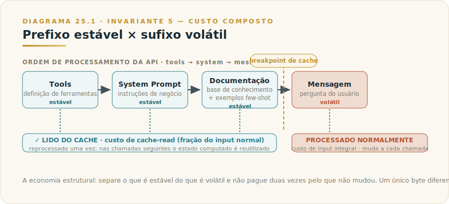
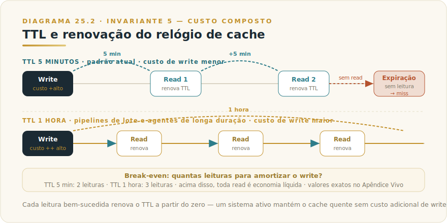
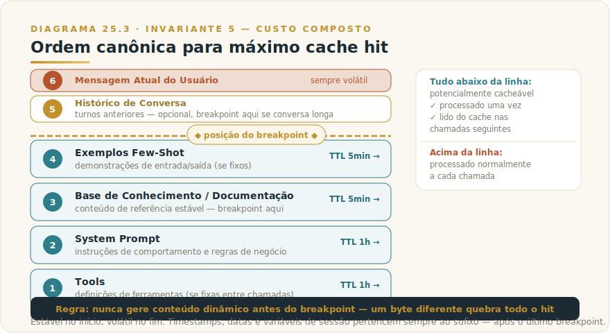

# CAPÍTULO 26
## PROMPT CACHING

---

> *"Inteligência não é processar a mesma coisa duas vezes. É reconhecer o que já foi processado — e não pagar por isso de novo."*

---

> 🧭 **Por que este capítulo é a aplicação do Invariante 5 — Custo Composto**
>
> Prompt caching é a alavanca estrutural de custo mais poderosa disponível para sistemas com contexto estável e repetido. O Invariante 5 diz que o custo de IA não é por chamada isolada — é o acúmulo de tokens reprocessados a cada requisição, composto ao longo de centenas ou milhares de chamadas. Caching corta esse acúmulo na raiz: em vez de reprocessar o que não mudou, você reutiliza o processamento já feito. A economia não é marginal — em sistemas bem desenhados, a parte estável do prompt pode representar a maior fração do input. Quem ignora caching está pagando pela mesma aula toda vez que o aluno levanta a mão.
>
> O Framework 7 — Custo Composto em Três Tempos (F7-composto-3t) posiciona caching como componente central de T2 (Topologia de Chamada): a alavanca de redução de redundância que opera sem mexer no tier do modelo nem no tamanho do contexto. Este capítulo é a implementação de T2 em detalhe operacional.

---

## 26.1 — O CONCEITO INTUITIVO

Cada vez que você faz uma chamada à API do Claude, o modelo processa todos os tokens de input — do primeiro caractere do system prompt até o último token da mensagem do usuário. Esse processamento tem um custo que você paga integralmente em cada chamada, independentemente de quanto do conteúdo mudou desde a chamada anterior.

Em um chat simples, isso é razoável: cada conversa é nova, o contexto muda o tempo todo. Em sistemas de produção — agentes com instruções fixas, pipelines de processamento de documentos, assistentes especializados com bases de conhecimento extensas — uma fração grande do prompt é idêntica em praticamente todas as chamadas. O system prompt com as regras do negócio não muda. A documentação de referência não muda. Os exemplos de few-shot não mudam. A base de conhecimento não muda. Só a pergunta do usuário muda.

Sem caching, você paga o processamento de tudo isso toda vez. Com caching, paga uma vez para armazenar o estado computado até o breakpoint — e nas chamadas seguintes, aquela parte do input é lida do cache por uma fração do custo original, sem reprocessamento.

O princípio que dura, independentemente de qualquer versão ou preço: **separe o que é estável do que é volátil e não pague duas vezes pelo que não mudou.**

---

## 26.2 — ANALOGIA: O PROFESSOR QUE GRAVOU A AULA

Imagine um professor universitário que ministra a mesma disciplina para turmas diferentes ao longo do ano. Cada aula começa com quarenta minutos de contextualização teórica — os conceitos fundamentais, a história do campo, os exemplos canônicos. Depois, nos últimos vinte minutos, ele responde às perguntas específicas daquela turma.

Sem gravação, ele repete os mesmos quarenta minutos de contextualização para cada turma. O esforço é real, o conteúdo é idêntico, e o custo recai integralmente sobre cada apresentação.

Com a contextualização gravada, ele exibe o vídeo — custo marginal de reprodução — e dedica toda a energia presencial apenas às perguntas específicas de cada turma. O que mudou foi a separação: o que é estável (a contextualização) vai para o cache; o que é volátil (as perguntas) permanece ao vivo.

Prompt caching é exatamente isso. O "vídeo gravado" é o estado computado do modelo após processar a parte estável do prompt. As "perguntas específicas" são os tokens que mudam a cada chamada. Você paga pelo processamento do vídeo uma vez — e nas chamadas seguintes, o modelo "reproduz" esse estado a custo de leitura.

---

## 26.3 — A MECÂNICA TÉCNICA

### 26.3.1 — Como o cache de prefixo funciona

Prompt caching no Claude é um **cache de prefixo**: o modelo armazena o estado computado de tudo que vem antes de um ponto marcado explicitamente. A chave de cache são os bytes exatos do conteúdo até esse ponto. Para um hit, as chamadas subsequentes precisam ter os mesmos bytes no mesmo prefixo.

A ordem de processamento pela API é fixa: `tools → system → messages`. O cache funciona sobre essa sequência. Um breakpoint marcado no final do system prompt, por exemplo, cobre tools + system. Um breakpoint no meio do array de mensagens cobre tudo até aquele ponto na conversa.

Você marca um breakpoint adicionando `cache_control` ao bloco de conteúdo onde quer o ponto de corte:

```json
{
  "role": "user",
  "content": [
    {
      "type": "text",
      "text": "[documentação de referência longa aqui]",
      "cache_control": {"type": "ephemeral"}
    },
    {
      "type": "text",
      "text": "Qual é a política de reembolso para o produto X?"
    }
  ]
}
```

Neste exemplo, a documentação de referência é marcada como breakpoint. Tudo até ela — incluindo o system prompt e quaisquer tools definidas — é armazenado no cache. A pergunta final não é marcada e é processada normalmente a cada chamada.





### 26.3.2 — TTL e a dinâmica de expiração

O cache tem um tempo de vida — TTL (Time To Live) — após o qual o estado é descartado e a próxima chamada precisa reprocessar o prefixo.

A API suporta dois TTLs:

- **5 minutos** (`{"type": "ephemeral"}`): o padrão atual desde março de 2026. Cache de curta duração, adequado para conversas interativas onde o contexto muda em minutos.
- **1 hora** (`{"type": "ephemeral", "ttl": "1h"}`): cache de longa duração, para pipelines de processamento em lote ou agentes com contexto fixo que operam por períodos mais longos.

O TTL é renovado a cada hit: toda vez que o cache é lido com sucesso, o relógio recomeça. Uma conversa ativa com chamadas frequentes mantém o cache quente sem pagar novamente pela escrita.

Os dois TTLs têm estruturas de custo diferentes — cache write de 1 hora custa mais que o de 5 minutos, porque armazenar por mais tempo tem custo de infraestrutura maior. A aritmética de break-even e os percentuais correntes estão no Apêndice J.

**Restrição importante de ordem**: quando você mistura os dois TTLs no mesmo request, breakpoints de TTL mais longo devem aparecer antes dos de TTL mais curto. O raciocínio é estrutural: um prefixo de longa duração só faz sentido antes de prefixos de curta duração na sequência do prompt.





### 26.3.3 — O que é cacheável e o que não é

O cache aceita qualquer conteúdo textual no prompt — system prompt, mensagens, documentos, exemplos de few-shot. Há uma restrição prática: o prefixo a ser cacheado precisa ter um tamanho mínimo de tokens (especificado na documentação; valor corrente no Apêndice J). Prefixos muito curtos não são elegíveis para cache — o overhead de armazenamento não compensa para conteúdo pequeno.

**Elegíveis para cache:**
- System prompts com instruções extensas de comportamento
- Documentação de referência (manuais de produto, FAQs, regulamentos)
- Exemplos de few-shot (demonstrações de entrada/saída)
- Bases de conhecimento embutidas no prompt
- Histórico de conversa — os turnos anteriores, marcados como breakpoint

**Não cacheáveis ou de cache ineficiente:**
- Conteúdo que muda a cada chamada (a pergunta atual do usuário)
- Tokens de output — caching é só para input; a resposta gerada não é cacheada
- Prefixos que variam entre chamadas (mesmo que minimamente — um único caractere diferente resulta em cache miss)
- Prefixos abaixo do tamanho mínimo (ver Apêndice J)

Cache é **tudo ou nada** por prefixo. Se o byte 1 até o breakpoint for idêntico, você tem hit. Se qualquer coisa diferiu — um espaço, uma pontuação, uma versão diferente de instrução — você tem miss e paga o input completo. Essa rigidez é por que o design do prompt para cache hit exige disciplina.

### 26.3.4 — Limite de breakpoints e caching automático

Você pode definir até **quatro breakpoints por request**. Isso permite estratificar o prompt em camadas de estabilidade diferentes:

1. Tools (se estáveis entre chamadas) — breakpoint de 1 hora
2. System prompt com instruções — breakpoint de 1 hora
3. Base de conhecimento / documentação — breakpoint de 5 minutos
4. Histórico de conversa (turnos anteriores) — breakpoint de 5 minutos

A API também suporta **caching automático**: em vez de marcar breakpoints individuais, você adiciona um campo `cache_control` no nível do request e o sistema coloca automaticamente o breakpoint no último bloco cacheável. É a opção mais simples para começar — sem reestruturar o prompt existente.

### 26.3.5 — Isolamento de cache

Desde fevereiro de 2026, o cache é isolado por **workspace**: chamadas do mesmo workspace compartilham cache entre si, mas não com outros workspaces da mesma organização. Isso é relevante para equipes que operam múltiplos ambientes (desenvolvimento, staging, produção) — cada ambiente tem seu próprio cache independente.

---

## 26.4 — A ECONOMIA ESTRUTURAL

O mecanismo de preço tem uma assimetria que é a lógica econômica do caching:

- **Cache write** custa mais que input normal (você paga um prêmio para armazenar o estado)
- **Cache read** custa significativamente menos que input normal (você recupera uma fração do custo a cada leitura)

O break-even é simples: quantas leituras você precisa para amortizar o write extra e sair na frente? Para TTL de 5 minutos, a conta fecha com duas leituras. Para TTL de 1 hora (write mais caro), são três leituras. Os percentuais exatos — quanto menos custa um cache read, quanto mais custa um cache write — estão no Apêndice J; eles mudam com a precificação da Anthropic, mas a estrutura (write cara, read barata) é estável.

A lógica de escala é onde o Invariante 5 fica concreto. Um sistema com 10.000 chamadas por dia, cada uma carregando 8.000 tokens de system prompt e documentação estável, reprocessa 80 milhões de tokens de input por dia. Com caching efetivo, esses 80 milhões viram cache hits — uma fração do custo. A redução não é percentual: é estrutural e cresce com o volume.

A outra dimensão de economia frequentemente subestimada é a **latência**. Cache reads são mais rápidos que processamento de input completo — o modelo não precisa recomputar a atenção sobre o prefixo, apenas carrega o estado pré-computado. Em sistemas onde tempo de resposta importa, caching reduz simultaneamente custo e latência. Os dois benefícios se combinam no mesmo design.

---

## 26.5 — O CRITÉRIO DE DECISÃO

### Quando caching compensa

| Condição | Por quê caching ajuda |
|----------|----------------------|
| **Alto volume de chamadas** (centenas a milhares por dia) | Break-even do write é atingido rapidamente; a economia por chamada se multiplica |
| **Contexto estável repetido** (system prompt, documentação, exemplos fixos) | A fração cacheável é grande; o custo evitado por chamada é alto |
| **Múltiplas perguntas sobre o mesmo documento** | Cada pergunta nova é só a fatia volátil; o documento não é reprocessado |
| **Sessões de conversa longas** | Turnos anteriores acumulam como prefixo estável; sem cache, cada mensagem nova reprocessa toda a conversa |
| **Pipelines de processamento em lote** | Mesmo sistema de instrução, muitos inputs diferentes — a parte estável é cacheada uma vez |
| **Agentes com ferramentas e instruções fixas** | Definição de tools + system prompt raramente muda entre invocações |

### Quando caching é irrelevante ou contraproducente

| Condição | Por quê caching não ajuda |
|----------|--------------------------|
| **Baixo volume de chamadas** (poucas dezenas por dia) | Break-even pode não ser atingido; o write extra não é amortizado |
| **Contexto muda a cada chamada** | Sem prefixo estável, não há hit possível; o write é custo puro |
| **System prompts curtos** | Prefixo abaixo do mínimo de elegibilidade; sem ganho de cache |
| **Protótipos e uso ad hoc** | Simplicidade vale mais que otimização de custo marginal |
| **Chamadas espaçadas por mais do que o TTL** | Cache expira entre chamadas; cada chamada é um write sem hit |

### Como desenhar o prompt para maximizar cache hit

**Princípio central: estável no início, volátil no fim.** O cache é um prefixo — só o que vem antes do breakpoint é cacheado. O que vem depois não é afetado. Portanto, tudo que não muda deve ir para o início do prompt, e o que muda (a pergunta do usuário, o documento específico desta chamada) vai para o fim.

Ordem recomendada:

1. **Tools** (se fixas) — primeiro, antes de qualquer conteúdo textual
2. **System prompt** com instruções de comportamento — logo depois, parte mais estável
3. **Base de conhecimento / documentação de referência** — se estável, aqui; breakpoint aqui
4. **Exemplos de few-shot** — se fixos, antes do breakpoint
5. **Histórico de conversa** (turnos anteriores) — breakpoint aqui se conversa longa
6. **Mensagem atual do usuário** — sempre no fim, sempre volátil





### Armadilhas comuns

**A invalidação por byte único.** A causa mais frequente de miss inesperado é uma variação imperceptível no prefixo: timestamp embutido no system prompt, data formatada dinamicamente, versão de instrução que mudou. Um único caractere diferente quebra o hit para todo o prefixo. A regra é simples: nunca gere conteúdo dinâmico antes do breakpoint. Data, hora, UUID de sessão, nome do usuário logado — tudo pertence ao sufixo volátil.

**Caching de conteúdo instável.** Marcar como cacheável um bloco que muda frequentemente produz o pior resultado possível: você paga o write extra sem nunca ter um hit. Se um bloco muda mais frequentemente do que o TTL, não o marque como cache.

**Breakpoints na posição errada.** Um breakpoint colocado cedo demais (antes de uma seção estável longa) deixa tokens estáveis fora do cache. Colocado tarde demais (incluindo tokens voláteis), resulta em misses constantes. A posição ideal é imediatamente após o último bloco que é garantidamente idêntico entre chamadas.

**Ignorar a ordem de TTL.** Misturar TTLs com a ordem errada — um breakpoint de 5 minutos antes de um de 1 hora — resulta em erro de validação da API. Longa duração sempre antes de curta duração.

**Não monitorar hit rate.** A API retorna, no campo `usage` da resposta, os campos `cache_creation_input_tokens` e `cache_read_input_tokens`. Sem monitorar esses campos, você não sabe se o caching está funcionando. Um sistema que parece cacheado mas tem hit rate zero está pagando o write extra sem nenhum benefício de read.

---

## 26.6 — EXEMPLO MEMORÁVEL: O ASSISTENTE JURÍDICO QUE APRENDEU A NÃO RELER O CÓDIGO

*Cenário ilustrativo brasileiro.* Uma legaltech em Curitiba desenvolveu um assistente para advogados trabalhistas: dada uma petição inicial, o sistema sugeria precedentes relevantes do TST e analisava a probabilidade de sucesso com base na jurisprudência recente. O sistema tinha um prompt com quatro componentes: instruções de comportamento (2.000 tokens), uma base de jurisprudência curada dos últimos três anos (18.000 tokens), exemplos de análise (4.000 tokens) e, por fim, a petição do usuário (variável, média de 3.000 tokens).

Nas primeiras semanas de produção, o custo por análise era calculado sobre os 27.000 tokens de input médio, integralmente, a cada chamada. Para cem análises por dia, o custo acumulava sobre 2,7 milhões de tokens de input — sendo que 24.000 tokens de cada chamada eram exatamente os mesmos.

A equipe de engenharia implementou caching em uma tarde: breakpoint de 1 hora marcado após os exemplos de few-shot (cobrindo os 24.000 tokens de conteúdo estável), com a petição do usuário como sufixo volátil. Na primeira chamada de cada sessão, o cache é escrito. Nas chamadas seguintes dentro da mesma hora de operação do servidor — e havia em média quarenta chamadas por hora no horário de pico — o sistema lia do cache.

O resultado foi uma redução dramática no custo de input de cada análise. A latência média caiu perceptivelmente, o que permitiu que o produto oferecesse uma interface mais responsiva. Mais relevante: a base de jurisprudência podia ser atualizada mensalmente sem custo adicional de migração — bastava deixar o cache expirar naturalmente na renovação e ele seria reescrito com o conteúdo novo na próxima chamada.

A armadilha que quase destruiu o ganho: um desenvolvedor adicionou, "para debug", o timestamp da requisição dentro do system prompt. Isso foi suficiente para quebrar todos os hits — o prefixo mudava a cada segundo. A descoberta veio ao comparar `cache_read_input_tokens` antes e depois da mudança. O timestamp foi movido para o sufixo, onde pertencia.

*Cenário ilustrativo brasileiro.*

---

## 26.7 — NA PRÁTICA: DUAS APLICAÇÕES REPLICÁVEIS

Duas aplicações com a forma *situação → o que fazer → o ponto de julgamento*. Em caching, o ponto de julgamento é sempre econômico: o design do prompt está maximizando os hits ou pagando o write sem colher o read?

**Aplicação 1 — Agente especializado com system prompt longo e documentação de referência.**
*Situação:* você tem um assistente de produção com system prompt de 3.000 tokens e uma base de documentação interna de 15.000 tokens que raramente muda, mas o custo por chamada está alto porque você reprocessa tudo a cada pergunta do usuário. *O que fazer:* reestruture o prompt na ordem canônica: tools estáticas (se existirem) → system prompt → documentação de referência → exemplos de few-shot → input do usuário. Adicione `cache_control` ao bloco de documentação e, se as tools também forem estáveis, ao bloco de tools. Use TTL de 1 hora se o sistema opera em modo batch ou tem janelas de uso concentradas; TTL de 5 minutos para assistentes interativos com usuários em tempo real. *O ponto de julgamento:* monitore `cache_creation_input_tokens` vs. `cache_read_input_tokens` no campo `usage` de cada resposta. Se `cache_read_input_tokens` for sistematicamente zero, o cache não está sendo atingido — inspecione se há conteúdo dinâmico antes do breakpoint (timestamp, nome do usuário, UUID de sessão) que invalida o prefixo a cada chamada.

**Aplicação 2 — Pipeline de processamento de lote com documento fixo e perguntas variáveis.**
*Situação:* você precisa processar centenas ou milhares de perguntas sobre o mesmo documento (contrato, relatório, manual técnico) num período de tempo definido — análise paralela, Q&A em lote, extração de campos em escala. *O que fazer:* na primeira chamada, o documento entra com `cache_control: {type: "ephemeral", ttl: "1h"}` — o cache write acontece uma vez. Todas as chamadas subsequentes dentro do TTL reutilizam o estado computado; o custo marginal de cada chamada cobre apenas os tokens da pergunta e da resposta. Para processar em paralelo, garanta que o prefixo do documento seja byte-a-byte idêntico em todas as chamadas — gere o bloco de documento a partir da mesma fonte sem transformação dinâmica. *O ponto de julgamento:* calcule o break-even antes de implementar: quantas chamadas sobre esse documento você vai fazer nessa janela de uma hora? Se forem menos de três, o write de 1 hora custa mais do que o processamento direto. Se forem dezenas ou centenas, o caching é economicamente óbvio — mas sem o monitoramento de hit rate, você não saberá se está realmente colhendo o benefício ou pagando o write sem o read.

> 🔧 **EXERCÍCIO**
> Identifique o sistema de produção ou pipeline que você opera que tem o maior volume de chamadas repetidas. Estime: qual fração do prompt é estável entre chamadas (não muda)? Qual é o volume diário de chamadas? Calcule o custo atual de tokens de input por dia, e estime quanto seria economizado se a fração estável entrasse em cache a partir da segunda chamada. Se o ganho for superior ao custo de implementar (poucas horas de engenharia), implemente. Se o ganho for marginal, o esforço vai para o próximo item da lista — caching é prioridade quando a alavanca é grande, não quando é elegante.

---

## 26.8 — CAMADA VIVA → APÊNDICE J

Os seguintes números deste capítulo são **voláteis** e não constam no corpo do texto:

- Custo de cache write por milhão de tokens (por TTL)
- Custo de cache read por milhão de tokens
- Tamanho mínimo de prefixo elegível para cache
- Disponibilidade de caching por modelo (Opus, Sonnet, Haiku)
- Data da mudança do TTL padrão de 1 hora para 5 minutos (referência histórica)

Consulte o **[Apêndice J — Apêndice Vivo](../04-apendices/L2-APX-J-apendice-vivo.md)** para os valores correntes com fonte e data do snapshot.

O que não muda: a estrutura (write cara, read barata, break-even em poucas leituras), o princípio de cache de prefixo, e a regra estável no início/volátil no fim.

---

## 26.9 — LIMITAÇÕES E CUIDADOS

**Caching não elimina o custo do output.** Tokens de resposta são cobrados integralmente, sempre. Caching reduz o custo de input — que é frequentemente a maior parte do custo em sistemas com contexto longo, mas não é o único componente.

**Cache hit não garante consistência de resposta.** O estado computado armazenado é determinístico para o prefixo idêntico, mas o resto da chamada (temperatura, tokens voláteis) ainda afeta o output. Não assuma que dois hits de cache produzirão respostas idênticas — produzirão apenas o mesmo ponto de partida interno para o modelo.

**Caching não substitui contexto menor.** Se o prefixo é enorme porque o system prompt cresceu sem disciplina, caching mitiga o custo mas não resolve o problema de design. O Framework 7 — T3 (Tamanho de Contexto) trata da poda de contexto; caching é T2 (Topologia de Chamada). São complementares, não substituíveis.

**Isolamento de workspace impõe restrição de compartilhamento.** Em organizações com múltiplos times compartilhando o mesmo conteúdo estável mas operando em workspaces diferentes, o cache não é compartilhado entre eles. Cada workspace mantém seu próprio estado de cache — o que pode ser desejável (isolamento de dados) ou ineficiente (cada workspace paga seu próprio write).

**Mudanças na Anthropic afetam o comportamento do cache.** A mudança do TTL padrão de 1 hora para 5 minutos em março de 2026 impactou sistemas que não especificavam o TTL explicitamente — e quem não monitorava hit rate não percebeu de imediato. A mitigação: sempre especifique o TTL e monitore `cache_read_input_tokens` em produção.

---

## 26.10 — CONEXÕES COM OUTROS CAPÍTULOS

- 🔗 **O framework de custo que ancora este capítulo** → [Framework 7 — Custo Composto em Três Tempos (F7-composto-3t)](../../Livro-1-Os-Invariantes/03-frameworks/L1-F7-composto-3t.md) — caching é T2 (Topologia de Chamada); leia junto com T1 e T3
- 🔗 **Como acessar a API e configurar cache_control via SDK** → [Capítulo 22 — API e SDKs](L2-C22-api-sdks.md)
- 🔗 **Engenharia de prompt que cria prefixos estáveis** → [Capítulo 25 — Prompt Avançado](L2-C25-prompt-avancado.md)
- 🔗 **Como caching se encaixa em arquiteturas de agentes e pipelines** → Capítulo 27 — Arquitetura de Agentes *(a produzir)*
- 🔗 **Tool use e como definir tools estáveis para cachear** → Capítulo 28 — Orquestração de Ferramentas *(a produzir)*
- 🔗 **MCP e caching em servidores de contexto** → [Capítulo 29 — Claude MCP](L2-C29-claude-mcp.md)
- 🔗 **Caching em contexto de observabilidade de custo (LLMOps)** → Capítulo 30 — LLMOps *(a produzir)*
- 🔗 **Caching em Cowork e sessões de agente** → [Capítulo 8 — Cowork](L2-C08-cowork.md)
- 🔗 **Preços, percentuais e TTLs correntes** → [Apêndice J — Apêndice Vivo](../04-apendices/L2-APX-J-apendice-vivo.md)

---

## 26.11 — RESUMO EXECUTIVO

| Conceito | Síntese |
|----------|---------|
| **O que é prompt caching** | Armazenamento do estado computado de um prefixo de prompt para reutilização em chamadas subsequentes, sem reprocessamento |
| **Invariante regente** | 5 — Custo Composto: o custo de IA é acúmulo; caching corta o acúmulo de tokens repetidos |
| **Mecânica** | Cache de prefixo: tudo antes do breakpoint é cacheado; bytes exatos precisam ser idênticos para hit |
| **TTLs disponíveis** | 5 minutos (padrão atual) e 1 hora (com custo de write maior) |
| **Estrutura de custo** | Write: mais caro que input normal; Read: fração do input normal; break-even em 2-3 leituras |
| **Benefício duplo** | Redução de custo de input **e** redução de latência com o mesmo design |
| **Quando usar** | Alto volume + contexto estável repetido; o break-even cresce com escala |
| **Princípio de design** | Estável no início, volátil no fim; nunca conteúdo dinâmico antes do breakpoint |
| **Armadilha principal** | Um único byte diferente no prefixo quebra o hit — timestamps e variáveis dinâmicas são assassinos de cache |
| **Monitoramento** | Campos `cache_creation_input_tokens` e `cache_read_input_tokens` na resposta da API |

---

## 26.12 — VALIDAÇÃO UAU

| # | Critério | Você consegue? |
|---|----------|----------------|
| 1 | **Clareza** — Explicar em 60 segundos por que caching é uma alavanca de custo estrutural, não apenas uma otimização marginal | ☐ |
| 2 | **Profundidade** — Descrever a diferença entre TTL de 5 minutos e 1 hora, e quando cada um compensa | ☐ |
| 3 | **Decisão** — Dado um sistema com suas características (volume, fração estável, frequência de chamadas), dizer se caching compensa e qual TTL escolher | ☐ |
| 4 | **Aplicação** — Reestruturar um prompt existente colocando o estável antes do volátil e adicionando um breakpoint de cache na posição correta | ☐ |
| 5 | **Diagnóstico** — Identificar a causa de um hit rate zero em produção a partir dos campos de `usage` da resposta da API | ☐ |

---

> *"O erro mais caro em sistemas de IA de produção não é usar o modelo errado. É pagar para o modelo aprender a mesma coisa toda vez que alguém faz uma pergunta. Caching não é otimização — é a decisão de não ser cobrado pelo que você já comprou."*
