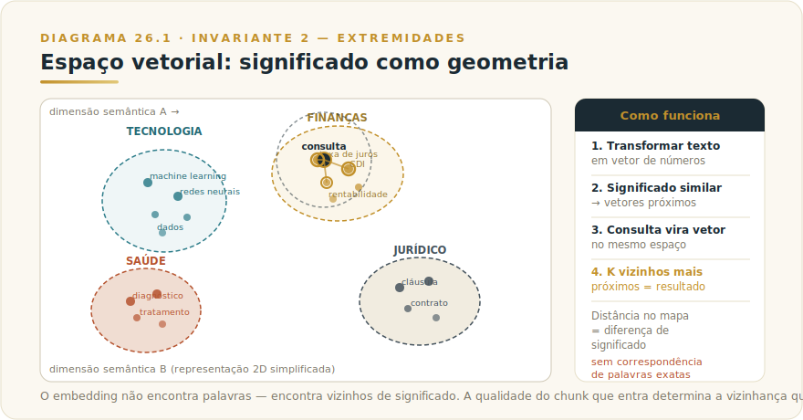
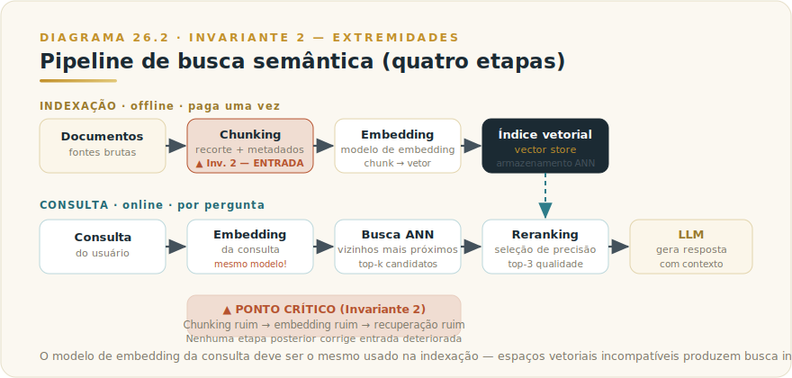
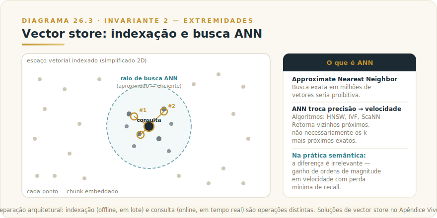
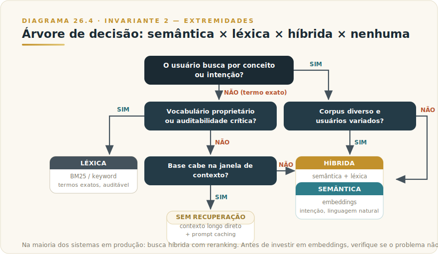

# CAPÍTULO 27
## EMBEDDINGS

---

> *"Antes de recuperar conhecimento, você precisa ter transformado esse conhecimento em algo pesquisável. Toda falha de busca começa na entrada — no que entrou, como entrou, e com que granularidade entrou."*

---

> 🧭 **Por que este capítulo é a aplicação do Invariante 2 — Extremidades**
>
> O Invariante 2 diz: atenção alta nas pontas, diluída no centro; densidade de relevância vence volume bruto. Em embeddings, esse princípio opera antes mesmo de o modelo ler qualquer coisa. O embedding é a representação que vai entrar no contexto — e a qualidade do que entra determina o que pode ser recuperado. Um chunk mal construído, embeddado de forma errada, retorna lixo com confiança máxima. Não há nada que o LLM faça depois que corrija uma entrada deteriorada. A extremidade que importa neste capítulo é a entrada do pipeline: o que foi transformado em vetor, como foi recortado, e com qual granularidade. Acertar aí é pré-condição de tudo que vem depois.

---

## 27.1 — O CONCEITO INTUITIVO

Existe uma classe de perguntas que motores de busca tradicionais respondem mal. Você pesquisa "como resolver conflito com colega" e o motor retorna páginas com as palavras "conflito" e "colega" — mas deixa escapar um artigo excelente sobre "gestão de relacionamento interpersonal em ambiente profissional", que aborda exatamente o que você queria, só porque não usou as mesmas palavras. A busca léxica, baseada em correspondência de termos, é precisa para o que você digitou e cega para o que você quis dizer.

Embeddings resolvem exatamente esse problema. A ideia central: transformar texto numa lista de números chamada vetor — de tal forma que textos com **significados semelhantes** produzam vetores **próximos** no espaço geométrico. Proximidade vetorial vira medida de similaridade de significado.

Esse mecanismo transforma "encontrar textos parecidos" num problema de geometria: dado um vetor de consulta, encontre os vetores mais próximos no índice — operação que computadores resolvem com eficiência em escalas de milhões de documentos.

A palavra "embedding" significa inserção — o texto é inserido num espaço de alta dimensão onde sua posição codifica seu significado. Esse espaço não é projetado manualmente: emerge do treinamento em volumes massivos de texto, onde o modelo aprende que "cachorro" e "cão" aparecem em contextos parecidos e portanto acabam próximos no espaço vetorial. Significado, para um modelo de embedding, é questão de vizinhança estatística.

---

## 27.2 — ANALOGIA: O MAPA ONDE PARECIDO FICA PERTO

Imagine um mapa geográfico, mas em vez de longitude e latitude, os eixos codificam *tema* e *tom*. Textos sobre finanças ficam agrupados num canto do mapa. Textos sobre saúde ficam em outro. Textos técnicos e secos ficam numa faixa; textos narrativos e humanos ficam em outra. Dentro do cluster de finanças, "taxa de juros" e "custo do crédito" ficam próximos. "Taxa de juros" e "gestão de RH" ficam distantes.

Agora imagine que você tem uma pergunta: "qual o impacto do CDI nos investimentos?". Você transforma essa pergunta num ponto no mesmo mapa — e busca os pontos mais próximos. Não os que usaram as palavras "CDI" e "investimentos", mas os que **habitam o mesmo bairro semântico** da sua pergunta. Textos sobre rentabilidade de renda fixa, sobre custo de oportunidade, sobre benchmark de fundos — todos aparecem como candidatos, mesmo que não compartilhem uma só palavra com a sua busca.

O embedding é o processo de colocar um texto no mapa. O vetor resultante é as coordenadas desse texto. A busca por similaridade é encontrar os vizinhos mais próximos no mapa. Toda a infraestrutura de busca semântica é, no fundo, uma implementação eficiente dessa navegação geográfica num espaço de alta dimensão.

---

## 27.3 — EXPLICAÇÃO TÉCNICA

### 27.3.1 — O vetor e suas dimensões

Um embedding é, concretamente, um array de números de ponto flutuante. Se o modelo produz vetores de 1024 dimensões, cada texto vira uma lista de 1024 números. Cada número é uma coordenada numa dimensão do espaço semântico — dimensões que o modelo aprendeu durante o treinamento e que não têm interpretação humana óbvia ("dimensão 347 corresponde a formalidade de registro" não é algo que nenhum engenheiro projetou; emergiu dos dados).

A dimensão do vetor é o principal parâmetro de trade-off de um modelo de embedding:

| Dimensão menor | Dimensão maior |
|----------------|----------------|
| Índices menores (menos armazenamento) | Mais precisão semântica |
| Busca mais rápida | Busca mais lenta |
| Menor custo de infraestrutura | Maior custo de infraestrutura |
| Suficiente para domínios simples | Necessário para nuances finas ou domínios especializados |

Modelos de embedding modernos suportam dimensões variáveis — o mesmo modelo pode produzir vetores de 256, 512, 1024 ou 2048 dimensões, permitindo que você ajuste o trade-off por caso de uso. Esse recurso, chamado de Matryoshka Representation Learning, permite truncar o vetor sem reembeddar tudo: um vetor de 2048 dimensões truncado para 256 ainda captura a maior parte da informação.

### 27.3.2 — O pipeline: chunking → embedding → indexação → busca

O pipeline completo de busca semântica tem quatro etapas. Cada uma afeta a qualidade final — e a primeira afeta todas as outras.

**Etapa 1 — Chunking (recorte dos documentos)**

Antes de embeddar qualquer coisa, você precisa decidir em que granularidade vai representar seus documentos. Chunking é o processo de dividir documentos longos em pedaços menores que serão embeddados individualmente.

Por que não embeddar o documento inteiro? Porque um embedding único de 50 páginas comprime demais e perde especificidade. Uma pergunta sobre a cláusula 7.3 não será semanticamente próxima do vetor do contrato inteiro, que mistura tudo. Chunks menores e coesos produzem vetores mais específicos e recuperações mais precisas.

Chunks pequenos demais, por outro lado, perdem contexto — um parágrafo solto pode ser ambíguo sem o anterior. A arte do chunking está em encontrar a granularidade que preserva unidade semântica sem diluir especificidade.

Estratégias comuns de chunking:
- **Chunk fixo por tamanho** (ex.: 512 tokens com sobreposição de 50 tokens): simples, mas pode cortar no meio de uma ideia.
- **Chunk por estrutura semântica** (parágrafo, seção, heading): respeita a organização natural do documento.
- **Chunk hierárquico**: chunks grandes para recuperação inicial, chunks menores para uso no contexto — técnica que equilibra cobertura e precisão.
- **Chunk com metadados**: cada chunk carrega título do documento, seção, data, tipo — que podem ser usados para filtrar antes de buscar.

O Invariante 2 opera aqui com clareza: a qualidade do chunk que entra determina o que pode ser recuperado depois. Não há buscador que corrija um documento mal recortado.

**Etapa 2 — Embedding dos chunks**

Cada chunk passa pelo modelo de embedding e produz um vetor. Essa etapa é offline (feita antes das consultas, geralmente em lote) e o custo é por token processado — uma fração do custo de usar um LLM de geração.

Bons modelos de embedding distinguem entre o texto que você quer indexar (documento) e o texto de busca (consulta). O modo de embedding para cada um é diferente — alguns modelos otimizam explicitamente essa assimetria, produzindo vetores de documento que "atraem" vetores de consulta relacionados mesmo quando formulados de formas distintas.

**Etapa 3 — Indexação (vector store)**

Vetores embeddados são armazenados num vector store — um sistema otimizado para busca por vizinhos. A operação fundamental é ANN (Approximate Nearest Neighbor): dado um vetor de consulta, retornar os k vetores mais próximos no índice, aproximadamente, de forma eficiente.

Por que "aproximadamente"? Busca exata em milhões de vetores de centenas de dimensões seria proibitiva. Algoritmos como HNSW e IVF trocam um grau mínimo de precisão por ganhos de ordens de magnitude em velocidade. Na prática, a diferença raramente é perceptível para recuperação semântica.

Soluções de vector store variam de simples a robustas, de gratuitas a gerenciadas. O que importa arquiteturalmente é que o vector store separa a operação de indexação (offline, em lote) da operação de consulta (online, em tempo real). Nomes específicos de produtos, com pricing corrente e características de escala, estão no Apêndice J — Apêndice Vivo.

**Etapa 4 — Busca e ranking**

Na hora da consulta, o texto do usuário é embeddado pelo mesmo modelo usado para indexar os documentos (isso é crítico: modelo diferente produz espaços vetoriais incompatíveis) e o vector store retorna os k chunks mais próximos. Esses chunks são o contexto que vai para o LLM.

Frequentemente, uma etapa de **reranking** é inserida entre a busca inicial e o uso no LLM: um modelo separado, mais lento mas mais preciso, reordena os chunks retornados pela similaridade de embedding. O reranker considera a consulta e cada chunk em conjunto — ele não opera no espaço vetorial, mas lê o texto diretamente. Resultado: top-3 de qualidade superior ao top-k bruto da busca vetorial.

---

## 27.4 — CRITÉRIO DE DECISÃO: QUANDO EMBEDDINGS, QUANDO BUSCA LÉXICA, QUANDO HÍBRIDA

Aqui este capítulo diverge do entusiasmo ingênuo sobre embeddings. **Busca semântica não vence sempre.** Há casos em que ela é inferior à busca léxica clássica, e casos em que o problema não é de recuperação de nenhum tipo. Escolher a abordagem errada desperdiça engenharia e piora resultados.

**Quando embeddings (busca semântica) ganham:**

- A pergunta é formulada de forma diferente dos documentos ("como aumentar margem" × "estratégias de rentabilidade operacional")
- O corpus é diverso e os usuários não conhecem a terminologia exata
- A intenção importa mais que os termos exatos
- Perguntas em linguagem natural sobre conteúdo em linguagem técnica (ou vice-versa)
- Múltiplas línguas no mesmo corpus ou na consulta

**Quando busca léxica (BM25/keyword) ganha:**

- O usuário sabe exatamente o termo que busca: número de contrato, código de produto, nome próprio, string técnica exata
- O corpus é altamente especializado com jargão que o modelo de embedding não viu em treinamento (terminologia proprietária, siglas internas, nomes de sistemas legados)
- A recuperação precisa ser determinística e auditável (sistemas regulatórios: "me dê todos os documentos que contêm o termo 'LGPD' na seção 3")
- Alta frequência de consultas exatas repetidas onde caching léxico é mais eficiente
- Erros de embedding em domínio novo podem ser piores que resultados léxicos imperfeitos

**Quando busca híbrida (semântica + léxica) é o padrão correto:**

A maioria dos sistemas em produção usa busca híbrida: recuperar candidatos por ambos os métodos e fundir os rankings antes do reranking final. Essa abordagem captura a intenção (semântica) sem perder termos específicos (léxica). A fusão de rankings por RRF (Reciprocal Rank Fusion) é simples de implementar e geralmente melhora precisão sobre qualquer método isolado.

**Quando o problema não é de recuperação:**

A falha mais cara em projetos de RAG é assumir que degradação de qualidade é problema de busca. Antes de investir em embeddings, verifique:

- **O problema está no modelo?** Se o LLM não raciocina sobre a informação mesmo quando ela está no contexto, melhorar a recuperação não ajuda.
- **O problema está nos documentos?** Documentos mal estruturados, desatualizados ou inconsistentes produzem lixo recuperado com precisão máxima.
- **O problema está no chunking?** Chunks sem coerência semântica prejudicam embeddings antes de chegar ao vector store.
- **O problema é de geração, não de recuperação?** O chunk certo foi retornado, mas o LLM não o usou bem na resposta.

| Situação | Abordagem |
|----------|-----------|
| Busca por intenção, linguagem natural | **Semântica (embeddings)** |
| Busca por termo exato, código, nome próprio | **Léxica (BM25/keyword)** |
| Corpus diverso, usuários variados, consultas abertas | **Híbrida (semântica + léxica + reranking)** |
| Alta especialização com jargão proprietário | **Léxica + fine-tuning do embedder** |
| Qualidade ruim mesmo com busca boa | **Revisar documentos, chunking, modelo** |
| Contexto suficientemente pequeno para caber inteiro | **Sem recuperação — passe o contexto direto** |

---

## 27.5 — USOS ALÉM DA BUSCA: O QUE MAIS SE FAZ COM EMBEDDINGS

Embeddings têm cinco aplicações principais, e busca semântica é só a mais conhecida.

**Busca semântica** é o caso canônico: indexar uma base de conhecimento e recuperar os trechos mais relevantes para uma consulta. É o coração do padrão RAG (Retrieval-Augmented Generation), que o Capítulo RAG — Recuperação Aumentada detalha como aplicação completa deste substrato.

**Clustering** agrupa documentos por similaridade de significado sem rótulos prévios. Útil para categorizar automaticamente suporte, mapear temas em feedback de clientes, identificar áreas temáticas em grandes corpora. A distância no espaço vetorial é a métrica de agrupamento.

**Deduplicação semântica** encontra documentos que dizem a mesma coisa com palavras diferentes. Ao contrário da deduplicação exata (hash), usa limiar de similaridade para identificar redundâncias — relevante para limpeza de bases de conhecimento e para evitar que o mesmo conteúdo entre múltiplas vezes no contexto.

**Classificação** treina um classificador simples sobre os vetores de embedding — uma regressão logística ou SVM que aprende a separar categorias no espaço vetorial. Mais eficiente que treinar um modelo do zero: o embedding faz o trabalho pesado de representação, o classificador aprende a fronteira.

**Recomendação** encontra itens semelhantes ao que o usuário interagiu. O vetor de um artigo lido serve como consulta para encontrar artigos próximos no espaço. A distância semântica substitui métricas de colaboração quando o histórico de comportamento é escasso.

---

## 27.6 — A ANTHROPIC E EMBEDDINGS: O QUE A DOCUMENTAÇÃO OFICIAL DIZ

Este é o ponto que exige honestidade vendor-neutral. **A Anthropic não oferece modelo de embedding próprio de primeira parte.** A documentação oficial (platform.claude.com/docs/en/build-with-claude/embeddings) é direta: "Anthropic does not offer its own embedding model."

O parceiro referenciado como recomendação primária na documentação Anthropic é a **Voyage AI**, com modelos especializados para domínios diferentes (texto geral, código, finanças, jurídico) e suporte a multimodal. A Voyage AI é também disponível via AWS Marketplace para quem já opera em infraestrutura Amazon Bedrock.

Mas a documentação Anthropic também é explícita em não criar lock-in: "you should assess a variety of embeddings vendors to find the best fit for your specific use case." Outros provedores de embedding relevantes no mercado incluem OpenAI, Google, Cohere, e modelos open-weight como os da família Sentence Transformers — cada um com suas características de domínio, latência e custo.

Os **critérios de seleção** que a documentação Anthropic lista são duráveis e vendor-neutral:

1. **Tamanho e especificidade do dataset de treinamento** — modelos treinados em texto geral performam bem em generalista; domínios especializados (jurídico, biomédico, código) beneficiam de modelos finos.
2. **Performance de inferência** — latência de embedding é crítica em alta escala; modelo mais preciso que demora demais pode inviabilizar a arquitetura.
3. **Opções de customização** — fine-tuning sobre dados proprietários para domínios com vocabulário específico.

Especificações de modelos (dimensões, context length, preços, benchmarks MTEB) ficam no **Apêndice J — Apêndice Vivo** por design: mudam com cada geração de modelos, e o que importa saber aqui é o critério de seleção, não o número da semana.

---

## 27.7 — EXEMPLO MEMORÁVEL: O CATÁLOGO QUE NINGUÉM CONSEGUIA BUSCAR

*Cenário ilustrativo.* Uma distribuidora de materiais de construção em Curitiba operava um catálogo de 85 mil SKUs, com descrições escritas por fornecedores diferentes ao longo de dez anos: terminologia inconsistente, siglas proprietárias, nomes de produto sem padronização. O time de vendas internas passava entre 15 e 25 minutos em cada atendimento só tentando encontrar o produto certo para o que o cliente descrevia — "aquela abraçadeira que vai no tubo de esgoto de 75" virava uma caçada manual.

A primeira tentativa foi busca léxica melhorada — expansão de sinônimos, índice invertido com stemming. Funcionou razoavelmente para clientes que sabiam o nome técnico. Falhou sistematicamente para os que descreviam o produto pelo uso ("o negócio que segura a tubulação no teto") ou pela aparência ("aquela peça em U de metal galvanizado").

A segunda tentativa usou embeddings. O pipeline foi montado em três decisões deliberadas:

**Decisão 1 — Chunking**: cada SKU foi embeddado como chunk único, com título + descrição + categoria concatenados. Não faz sentido dividir uma descrição de produto de 200 tokens. O metadado de categoria foi incluído para que a busca pudesse filtrar por família de produto antes de ranquear por similaridade.

**Decisão 2 — Modelo**: um modelo de embedding geral, com contexto suficiente para as descrições e dimensão 1024. O catálogo era de domínio misto (construção civil, hidráulica, elétrico, ferramentas) — um modelo geral de qualidade cobria melhor a diversidade que um especializado em domínio único.

**Decisão 3 — Busca híbrida**: consultas com códigos de produto ou siglas exatas usavam busca léxica; consultas em linguagem natural usavam busca semântica; casos ambíguos usavam ambas com fusão de rankings. A distinção era feita por um classificador simples de intenção antes do roteamento.

O resultado: o tempo médio de identificação de produto caiu de 20 minutos para menos de 3 minutos. Mais relevante: a taxa de "produto não encontrado" — que frequentemente escondia um produto presente mas inacessível — caiu 67%. O catálogo não mudou. O que mudou foi como ele entrou no sistema de busca.

A lição estrutural é o Invariante 2 inteiro: o problema não estava na geração de respostas (o LLM), nem no catálogo em si. Estava na entrada — em como 85 mil descrições heterogêneas foram transformadas em representações pesquisáveis. Corrigir a entrada corrigiu o sistema.

---

## 27.8 — NA PRÁTICA: TRÊS APLICAÇÕES REPLICÁVEIS

Três aplicações com a forma *situação → o que fazer → o ponto de julgamento*. Em embeddings, o ponto de julgamento é quase sempre sobre o que entrou no pipeline — não sobre o modelo de geração.

**Aplicação 1 — Base de conhecimento interna com busca semântica para suporte e atendimento.**
*Situação:* sua empresa tem manuais, FAQs, políticas e procedimentos dispersos em diferentes formatos e pastas. Usuários internos (ou clientes) fazem perguntas em linguagem natural que não correspondem à terminologia dos documentos. *O que fazer:* faça o chunking respeitando a estrutura semântica dos documentos (por seção ou cláusula, não por tamanho fixo); adicione metadados a cada chunk (tipo de documento, data de atualização, categoria); gere embeddings com um modelo de contexto suficiente para o tamanho dos seus chunks; use busca híbrida (semântica + BM25) se a base mistura linguagem natural com termos técnicos. *O ponto de julgamento:* construa um golden set de 30 a 50 perguntas com o chunk de origem correto identificado. Meça recall@5 antes de colocar em produção. Se estiver abaixo de 70%, o problema provavelmente está no chunking ou na falta de contexto nos chunks — resolva na ingestão, não no modelo de geração.

**Aplicação 2 — Deduplicação e clustering de tickets ou feedbacks em escala.**
*Situação:* você acumula centenas ou milhares de tickets de suporte, feedbacks de clientes ou ocorrências que chegam formulados de formas diferentes mas frequentemente descrevem o mesmo problema. A equipe gasta tempo triando manualmente o que é recorrente e o que é novo. *O que fazer:* gere embeddings para cada ticket; calcule similaridade entre pares usando cosseno ou produto interno; agrupe os tickets acima de um limiar de similaridade (ex.: 0,88) em clusters; apresente os clusters com contagem e exemplos representativos para revisão humana. Não automatize a fusão dos tickets — use os clusters para informar a triagem, não para substituí-la. *O ponto de julgamento:* o limiar de similaridade para agrupamento é uma decisão de negócio, não técnica. Limiar muito baixo cria clusters grandes com itens não relacionados; muito alto deixa duplicatas separadas. Calibre o limiar revisando manualmente 50 pares borderline e decidindo com a equipe operacional qual erro custa mais (falsa fusão vs. duplicata não detectada).

**Aplicação 3 — Escolha de provedor de embedding com avaliação no seu domínio.**
*Situação:* você está iniciando um projeto de busca semântica ou RAG e precisa decidir qual modelo de embedding usar. A documentação da Anthropic recomenda Voyage AI como referência primária, mas você quer validar para o seu caso específico. *O que fazer:* colete 100 pares (consulta, documento relevante) do seu domínio real; gere embeddings com dois a três provedores candidatos; meça o recall@5 de cada um no seu conjunto de teste; compare latência e custo por token para o volume esperado. Use o resultado para decidir, não o benchmark genérico MTEB. *O ponto de julgamento:* o melhor modelo para o seu caso pode não ser o melhor no ranking MTEB geral — benchmarks gerais são úteis para triagem inicial, mas domínios especializados (jurídico, médico, código, terminologia interna) frequentemente mostram inversões de ranking quando testados em dados reais. A avaliação no seu corpus é insubstituível.

> 🔧 **EXERCÍCIO**
> Pegue um conjunto de 20 documentos do seu contexto de trabalho (e-mails, relatórios, procedimentos, artigos) e divida-os em chunks seguindo a estrutura semântica natural — parágrafos, seções, cláusulas, dependendo do tipo. Compare o resultado com chunks de 500 tokens por tamanho fixo: quantos chunks de tamanho fixo cortam no meio de uma ideia completa? Quantos chunks semânticos ficaram grandes demais ou pequenos demais? Esse exercício manual em 20 documentos é mais valioso do que qualquer leitura sobre chunking, porque o problema só aparece quando você tenta resolver com dados reais.

---

## 27.9 — CAMADA VIVA → APÊNDICE J

Os seguintes elementos deste capítulo são voláteis e ficam no **[Apêndice J — Apêndice Vivo](../04-apendices/L2-APX-J-apendice-vivo.md)**:

- Modelos de embedding atuais da Voyage AI e seus pares (dimensões, context length, pricing por token)
- Comparativo de performance em MTEB (Massive Text Embedding Benchmark) por domínio
- Modelos open-weight de embedding relevantes (Sentence Transformers, E5, etc.)
- Soluções de vector store: características, pricing, escala suportada
- Algoritmos de ANN atuais (HNSW, IVF, ScaNN) e trade-offs de recall × latência
- Preços de embedding por milhão de tokens por provedor

O que **não** vai para o Apêndice porque é durável: o conceito de que significado vira geometria pesquisável; a estrutura do pipeline (chunking → embedding → indexação → busca); a tabela de critérios semântico × léxico × híbrido; e o princípio de que a qualidade da entrada determina a qualidade da recuperação.

---

## 27.10 — LIMITAÇÕES E CUIDADOS

**O embedding não lê, aproxima.** Um modelo de embedding não entende o texto como um humano entende — aprende associações estatísticas. Textos irônicos, sarcásticos ou que dependem de contexto externo podem ser embeddados de forma enganosa: o vetor de "este produto é absolutamente terrível (ironia)" pode ficar próximo de avaliações positivas.

**Domínios especializados com vocabulário proprietário falham.** Um modelo treinado em texto geral não sabe que "RG-123" é um tipo específico de regulador de gás da empresa X. Jargão interno, siglas proprietárias e terminologia setorial muito específica exigem fine-tuning ou complementação léxica. Esse é exatamente o cenário onde busca léxica supera embeddings.

**Drift de distribuição entre documentos e consultas.** Se os documentos foram escritos em estilo formal e as consultas chegam em linguagem informal (ou vice-versa), a distância semântica entre eles no espaço vetorial será artificialmente grande. Modelos com modo explícito de documento e consulta mitigam isso, mas não eliminam.

**Modelo de embedding e índice precisam ser compatíveis.** Reembeddar um corpus inteiro ao trocar de modelo é operação cara. A escolha do modelo é decisão de longo prazo com custo de migração real — trate-a com cuidado proporcional.

**Embeddings não substituem estrutura.** Filtros estruturados (data, categoria, autor, tipo de documento) são mais precisos e eficientes que busca semântica quando o critério é categórico. Combine filtros pré-busca com similaridade semântica em vez de confiar que o embedding vai "descobrir" que a pergunta é sobre 2024 e não 2022.

**Privacidade e dados sensíveis.** Embeddar documentos via API de terceiro implica enviar esses documentos para o servidor do provedor. Avalie esse aspecto em relação à sensibilidade dos dados antes de escolher provedor externo.

---

## 27.11 — CONEXÕES COM OUTROS CAPÍTULOS

- 🔗 **O Invariante que ancora este capítulo** — Invariante 2 — Extremidades: "O meio do contexto é onde a informação vai morrer" → presente em [Livro 1 — Os Invariantes](../../Livro-1-Os-Invariantes/02-capitulos/L1-C02-como-modelos-funcionam.md)
- 🔗 **RAG — a aplicação mais completa de embeddings** → Capítulo RAG — Recuperação Aumentada (mesmo lote; cite por nome, arquivo ainda não em disco)
- 🔗 **Models Claude e encaixe de capacidade** → [Capítulo 4 — Modelos Claude](L2-C04-modelos-claude.md)
- 🔗 **Tokens e custo da etapa de embedding no pipeline** → [Capítulo 6 — Tokens e Contexto](L2-C06-tokens-contexto.md)
- 🔗 **Projects como vector store informal de contexto curado** → [Capítulo 13 — Projects](L2-C13-projects.md)
- 🔗 **Tool use: embeddings como ferramenta chamada por agentes** → [Capítulo 23 — Tool Use](L2-C23-tool-use.md)
- 🔗 **MCP: conectar vector stores externos ao Claude em arquiteturas corporativas** → [Capítulo 29 — Claude + MCP](L2-C29-claude-mcp.md)
- 🔗 **Números voláteis: modelos, dimensões, preços por provedor** → [Apêndice J — Apêndice Vivo](../04-apendices/L2-APX-J-apendice-vivo.md)

---

## 27.12 — RESUMO EXECUTIVO

| Conceito | Síntese |
|----------|---------|
| **O que é um embedding** | Representação de texto como vetor num espaço onde proximidade = similaridade de significado |
| **Por que funciona** | Textos usados em contextos semelhantes acabam próximos no espaço vetorial — o modelo aprende essa estrutura no treinamento |
| **O pipeline** | Chunking → Embedding → Indexação (vector store) → Busca ANN → Reranking → LLM |
| **O ponto crítico** | A qualidade do chunk que entra determina o que pode ser recuperado — Invariante 2 na entrada |
| **Anthropic e embeddings** | A Anthropic não tem modelo de embedding próprio; recomenda parceiros (Voyage AI como referência primária na doc oficial); vendor-neutral — avalie por caso de uso |
| **Semântico vs léxico** | Semântico: intenção, linguagem natural, diversidade de formulação. Léxico: termos exatos, jargão proprietário, auditabilidade. Híbrido: padrão para produção |
| **Quando não é recuperação** | Qualidade ruim de resposta pode ser problema no modelo, nos documentos, no chunking, ou na geração — não necessariamente na busca |
| **Dimensão e trade-off** | Dimensão maior = mais precisão e mais custo. Escolha por necessidade do domínio, não por máximo disponível |
| **Usos além de busca** | Clustering, deduplicação semântica, classificação, recomendação |

---

## 27.13 — VALIDAÇÃO UAU

| # | Critério | Você consegue? |
|---|----------|----------------|
| 1 | **Clareza** — Explicar em 60 segundos o que é um embedding e por que proximidade vetorial equivale a similaridade de significado | ☐ |
| 2 | **Pipeline** — Nomear as quatro etapas do pipeline de busca semântica e dizer qual delas está sujeita ao Invariante 2 — Extremidades | ☐ |
| 3 | **Decisão** — Dar três exemplos de consulta onde busca léxica supera semântica e três onde ocorre o inverso | ☐ |
| 4 | **Honestidade vendor** — Explicar por que a Anthropic não resolve embeddings com seus próprios modelos e o que isso implica arquiteturalmente | ☐ |
| 5 | **Aplicação** — Desenhar o pipeline de embedding para um problema de busca real do seu contexto, incluindo a decisão de chunking | ☐ |

---

> *"Significado vira geometria pesquisável. Mas geometria pesquisável só retorna o que entrou com qualidade. Nenhum buscador conserta uma entrada deteriorada — e nenhuma geração de resposta compensa uma recuperação ruim."*
