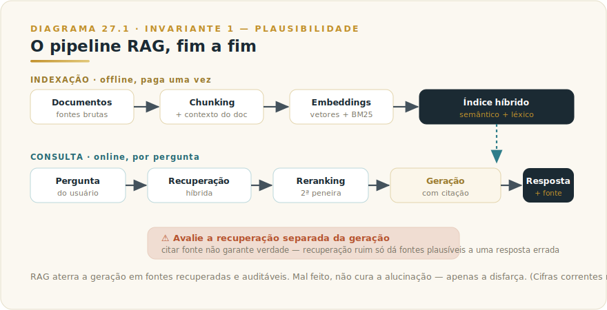
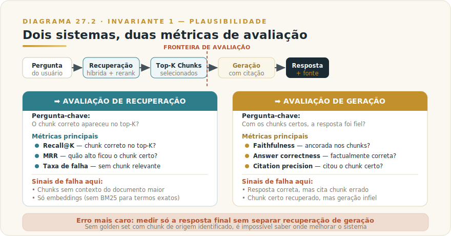

# CAPÍTULO 28
## RAG — RETRIEVAL-AUGMENTED GENERATION

---

> *"Um modelo sem memória externa é como um consultor que só sabe o que aprendeu na faculdade. O modelo com RAG sabe tudo isso e ainda consultou o dossiê da empresa antes de entrar na sala. A diferença não é de inteligência: é de contexto."*

---

> 🧭 **Por que este capítulo é a aplicação do Invariante 1 — Plausibilidade**
>
> O Invariante 1 diz que o modelo entrega o plausível, não o verdadeiro — e os dois coincidem, até a hora em que não. RAG ataca esse problema de frente: ancora a geração em documentos recuperados em tempo real, tornando a resposta mais verificável do que resposta livre.
>
> Mas o Invariante 1 não desaparece com o RAG — ele se desloca. Um RAG mal calibrado não elimina a alucinação: **disfarça**. O modelo gera respostas plausíveis *a partir de chunks irrelevantes*, com aparência de fonte. Citar um documento não garante que o documento correto foi recuperado. Recuperar o documento correto não garante que o trecho certo foi extraído. Extrair o trecho certo não garante que a geração foi fiel a ele. Cada elo pode quebrar silenciosamente, e o resultado quebrado parece tão autoritativo quanto o correto.
>
> Avaliar RAG exige medir a recuperação separada da geração — dois problemas distintos, dois pontos de falha distintos, e confundi-los é o erro de calibração mais caro que uma organização pode cometer.

---

## 28.1 — O CONCEITO INTUITIVO

Todo modelo de linguagem tem um limite intransponível: ele só sabe o que estava no corpus de treinamento. O médico que parou de estudar em 2023 desconhece o protocolo publicado em 2025. O analista financeiro que decorou relatórios de mercado não conhece os resultados do trimestre atual. O suporte técnico que decorou a documentação de ontem não conhece a atualização desta manhã.

Essa limitação não é falha de implementação — é consequência estrutural do treinamento. O modelo congela enquanto o mundo continua.

A solução mais direta seria retreinar continuamente — caro, lento e, para a maioria das organizações, impraticável. A alternativa é RAG: Retrieval-Augmented Generation. O princípio: dar ao modelo, no momento em que vai responder, os documentos relevantes que ele não tem nos pesos. Em vez de esperar que o modelo "saiba" de memória, você busca a informação e entrega na janela de contexto.

O resultado é que o modelo responde com o que você acabou de mostrar a ele — e o que você mostrou tem fonte: documento real, com data, autor e localização verificável.

Esta é a promessa do RAG. O que este capítulo faz é levar a sério o espaço entre promessa e realidade — porque é aí que organizações perdem tempo e confiança.

---

## 28.2 — ANALOGIA: O PESQUISADOR DE BANCADA

Imagine um pesquisador com excelente formação de base — domina a literatura clássica, entende os princípios, raciocina com clareza. Mas para responder sua pergunta sobre a causa de um acidente industrial da semana passada, ele precisa de algo que não está na cabeça dele: registros do incidente, laudos técnicos, comunicações internas. Você não espera que ele saiba isso de memória.

Você dá a ele acesso ao arquivo. Ele lê, extrai o relevante, sintetiza e responde. A resposta é muito mais precisa porque está ancorada em material específico — não na média de tudo que ele já leu.

RAG é esse mecanismo. O modelo é o pesquisador. Sua base de conhecimento interna (documentação, contratos, relatórios, e-mails históricos) é o arquivo. O sistema de recuperação decide quais pastas abrir antes da reunião.

Mas note o que acontece se o arquivista trouxer a pasta errada. O pesquisador lê com atenção, sintetiza com competência, responde com confiança — e a resposta parecerá autoritativa. Só que estará baseada no documento errado. A sofisticação do pesquisador não corrige o erro do arquivista: amplifica a aparência de precisão enquanto a substância está errada.

**RAG mal calibrado não reduz a alucinação. Substitui alucinação livre por alucinação com fonte.**

---

## 28.3 — A ARQUITETURA EM DETALHE

### 28.3.1 — A visão geral: ingestão e consulta

RAG opera em duas fases distintas.

A **fase de ingestão** acontece offline, antes de qualquer consulta. Você processa sua base de conhecimento uma vez — ou conforme ela é atualizada — e armazena o resultado num índice consultável.

A **fase de consulta** acontece em tempo real, quando o usuário faz uma pergunta. O sistema busca no índice, recupera os pedaços mais relevantes, e passa tudo ao modelo junto com a pergunta. O modelo lê o material recuperado e gera a resposta.

O gargalo não está na geração — está na recuperação. Um modelo excelente com recuperação ruim produz respostas ruins. Melhorar o sistema RAG começa pelo diagnóstico correto de onde a cadeia quebra.

### 28.3.2 — Chunking: o primeiro ponto de falha silencioso

Documentos longos não são entregues inteiros ao modelo — isso consumiria a janela de contexto inteira em um único documento. A base é fragmentada em chunks, tipicamente de algumas centenas a poucos milhares de tokens.

A escolha do tamanho e das fronteiras de chunk é consequente. Chunk grande demais inclui ruído e dificulta recuperação precisa. Chunk pequeno demais perde contexto que tornaria o trecho interpretável. Uma fronteira que corta no meio de uma tabela, argumento jurídico ou instrução técnica garante que o trecho recuperado será inutilizável isolado.

O erro clássico: fragmentar por tamanho fixo (cada 500 tokens), ignorando estrutura semântica. Parágrafo, seção, argumento, cláusula — a unidade de sentido natural raramente coincide com a unidade de tamanho arbitrária.

A Anthropic documentou em setembro de 2024: em bases tradicionais, chunks frequentemente perdem o contexto do documento que os gerou. Um chunk que diz *"a receita cresceu 3% no trimestre anterior"* não especifica empresa, trimestre ou base de comparação. Sozinho no índice, pode ser recuperado com alta confiança de similaridade e ainda assim ser inútil ou enganoso.

A solução que a Anthropic chamou de **Contextual Retrieval** resolve isso: antes de indexar cada chunk, um modelo (Claude Haiku, por custo) gera um parágrafo curto de 50 a 100 tokens situando o chunk no documento original. Esse parágrafo é pré-anexado antes do embedding e da indexação BM25. O custo é pago uma única vez na ingestão; o benefício persiste em cada consulta.

### 28.3.3 — Embeddings e índice: semântica e léxico trabalhando juntos

Embeddings são representações vetoriais de texto: cada chunk é convertido em vetor numérico de alta dimensão, posicionado num espaço onde chunks semanticamente parecidos ficam geometricamente próximos. Quando uma pergunta chega, ela também é convertida em vetor e o sistema encontra os chunks mais próximos.

Essa busca semântica é poderosa para perguntas conceituais — captura paráfrases, sinônimos, variações de linguagem. Mas falha num caso frequente: correspondência exata de termos técnicos, códigos, nomes próprios, identificadores. Um usuário que pergunta por *"erro TS-999"* pode não receber o chunk que contém exatamente *"TS-999"* se ele não for o mais próximo semanticamente.

BM25 é um algoritmo de busca léxica que complementa os embeddings: pesa frequência de termos e raridade relativa no corpus, encontrando chunks com as palavras exatas da consulta, especialmente termos raros ou específicos.

A prática recomendada é busca híbrida: combinar busca vetorial com BM25, fundir as listas com rank fusion, e passar a lista combinada para reranking. Nos experimentos de Contextual Retrieval da Anthropic (set/2024), essa combinação reduziu a taxa de falha de recuperação em quase metade comparada à busca vetorial isolada — mesmo antes de reranking (cifras exatas e fonte no [Apêndice Vivo (J)](../04-apendices/L2-APX-J-apendice-vivo.md)).

### 28.3.4 — Reranking: a segunda peneira

A recuperação inicial devolve dezenas a centenas de chunks candidatos. O reranker é um modelo separado, treinado para classificar relevância: dado o par (pergunta, chunk), atribui pontuação e reordena os candidatos.

A recuperação precisa ser rápida e escalável — opera sobre todo o índice. O reranker opera sobre a lista curta pré-selecionada; pode ser mais sofisticado porque processa um número manejável de pares.

A cadeia completa — busca híbrida embeddings+BM25 seguida de reranking — reduziu a taxa de falha de recuperação em cerca de dois terços nos mesmos experimentos da Anthropic, comparado à busca vetorial pura sem contexto nos chunks (valores correntes no Apêndice Vivo).

O valor do reranking vai além da métrica: ele separa dois problemas que sistemas confundem — *encontrar* candidatos (alta cobertura, tolerância a ruído) e *selecionar* o que entregar ao modelo (alta precisão, intolerância a ruído). Misturar os dois objetivos num único passo compromete ambos.

### 28.3.5 — Geração com citação

O modelo recebe a pergunta original mais os top-K chunks selecionados pelo reranker. A geração deve ser instruída a citar as fontes — não como decoração, mas como obrigação funcional.

Citar o chunk correto tem dois propósitos: auditabilidade (o usuário verifica se a resposta foi fiel ao trecho recuperado) e diagnóstico (a equipe identifica se a falha veio da recuperação ou da geração).

Sem citação rastreável, esses dois modos de falha são indistinguíveis — e diagnosticar o sistema às cegas é impossível.

---

## 28.4 — O CRITÉRIO DE DECISÃO: RAG, CONTEXTO LONGO, FINE-TUNING OU BUSCA?

Esta é a seção que a maioria dos tutoriais sobre RAG omite. RAG não é a única forma de dar ao modelo conhecimento que ele não tem nos pesos — e escolher RAG quando a situação pede outra abordagem compromete o resultado antes de qualquer implementação.

### A matriz de decisão

| Situação | Abordagem certa | Razão |
|----------|----------------|-------|
| Base < 200k tokens, relativamente estável | **Contexto longo** | Coloque tudo no prompt com cache; mais simples, zero overhead de recuperação |
| Base grande, perguntas factuais, dados que mudam | **RAG** | Recuperação precisa para bases que não cabem na janela; fonte verificável |
| Mudar o *estilo* ou *comportamento* do modelo, não o conhecimento | **Fine-tuning** | Ajusta padrão de resposta, não base de fatos; não é substituto para RAG em bases que mudam |
| Informação em sistemas externos vivos (CRM, ERP, banco de dados) | **Ferramenta/busca direta** | Dados em tempo real exigem acesso direto, não indexação prévia |
| Combinação de todos acima | **Híbrido** | Sistema real costuma usar RAG + ferramentas + prompt com contexto fixo |

### RAG vs. contexto longo

A janela de contexto longo de 200 mil tokens da família Claude abre uma alternativa que reduz a complexidade radicalmente. Para bases menores — documentação de um produto, contratos de um cliente, manuais internos — colar tudo no contexto pode ser superior a construir um pipeline RAG.

Vantagens: zero latência de recuperação, sem erros de recuperação, sem infraestrutura de índice. Desvantagens: custo por token escala com o tamanho da base, e o Invariante 2 (Extremidades) lembra que informação enterrada no meio de um contexto longo recebe menos atenção do que nas posições inicial ou final.

O critério prático: se a base cabe na janela e não muda com frequência, teste contexto longo primeiro. Com prompt caching (Capítulo 26), o custo de reprocessar o contexto fixo cai dramaticamente (faixas correntes no Apêndice Vivo). Se a base cresce além do limite ou o custo por consulta for proibitivo, RAG é o próximo passo.

### RAG vs. fine-tuning

Fine-tuning e RAG são frequentemente confundidos como alternativas para o mesmo problema. Não são.

Fine-tuning muda o que o modelo *sabe como fazer* — ajusta padrão de resposta, tom, aderência a formatos, comportamento em domínios especializados. Não é forma eficiente de inserir fatos novos: modelos fine-tuned em dados factuais tendem a aluciná-los mais confortavelmente, não menos.

RAG muda o que o modelo *tem acesso* no momento da resposta — injeta fatos verificáveis e rastreáveis na janela de contexto. É a ferramenta certa quando o problema é conhecimento, não comportamento.

O stack correto para a maioria das aplicações corporativas: RAG para conhecimento organizacional específico, prompt engineering para comportamento e formato, fine-tuning como refinamento opcional quando o comportamento genérico demonstravelmente não atende após exaurir alternativas mais simples.

### Sinais de RAG mal feito

Cinco sinais de que o pipeline RAG está falhando e onde procurar:

**1. Respostas corretas, citações erradas.** O modelo gerou a resposta certa mas citou um documento diferente do que a sustentaria. Causa provável: o chunk mais relevante não foi recuperado; o modelo usou conhecimento paramétrico e citou o que estava mais próximo como proxy.

**2. Respostas plausíveis, fontes irrelevantes.** O reranker classificou chunks por similaridade superficial de tokens, não por relevância real. Sinal: respostas que soam corretas mas divergem sutilmente do documento citado.

**3. Degradação com bases grandes.** O sistema funciona com 100 documentos e degrada com 10.000. Causa: indexação sem contexto nos chunks — o problema que Contextual Retrieval resolve. Chunks sem contexto ficam ambíguos em escala.

**4. Perguntas sobre termos técnicos específicos falham.** O sistema usa só embeddings sem BM25. Correspondência exata de códigos, nomes próprios e identificadores técnicos requer busca léxica.

**5. Ninguém sabe distinguir falha de recuperação de falha de geração.** Ausência de citação rastreável. Sem citar qual chunk foi usado, o diagnóstico é impossível — e a melhoria contínua, também.

---

## 28.5 — EXEMPLO MEMORÁVEL: A SEGURADORA QUE ACHAVA QUE TINHA RAG

Uma seguradora de médio porte em São Paulo implantou um chatbot interno para a equipe de sinistros, baseado em RAG sobre a base de apólices e manuais regulatórios. Em três semanas estava em uso. Em dois meses, ninguém mais confiava nele.

O problema não era o modelo. Era o pipeline de recuperação.

**O que estava errado:** os documentos foram fragmentados em chunks de 500 tokens por tamanho fixo, sem respeitar estruturas de cláusula. Uma cláusula de exclusão de cobertura distribuída por dois chunks nunca era recuperada inteira. Pior: o sistema usava apenas busca por embeddings — números de apólice, identificadores de cláusula e datas de vigência específicas eram ignorados pela busca semântica, que os tratava como ruído.

**O diagnóstico levou três semanas** porque sem citação rastreável, os analistas não conseguiam distinguir se o erro era da recuperação ou da geração. Pareciam erros de modelo; eram erros de arquitetura.

**A correção:** chunking por cláusula (respeitando a estrutura do documento), adição de contexto documental a cada chunk (número de apólice, vigência, produto), busca híbrida adicionando BM25 para correspondência de identificadores, e citação obrigatória com número de cláusula em cada resposta.

Resultado: taxa de erros de recuperação caiu de 34% para 6%. A confiança da equipe retornou quando os analistas passaram a abrir o documento citado e verificar a cláusula referenciada — o sinal mais simples de que o sistema funciona.

O Invariante 1 continua presente: o modelo ainda pode interpretar incorretamente a cláusula que recuperou. Mas agora os analistas sabem onde verificar. A cadeia de accountability ficou visível.

> ⚠️ **POSTMORTEM — A seguradora que achava que tinha RAG**
>
> *O que tentaram:* Implantar RAG sobre base de apólices e regulatórios usando chunking fixo de 500 tokens e busca exclusivamente semântica por embeddings. O sistema foi ao ar em três semanas. Em dois meses, os analistas de sinistro haviam parado de confiar nas respostas — que soavam autoritativas e chegavam com aparência de fonte, mas citavam cláusulas erradas ou parcialmente truncadas.
>
> *O que deu errado:* O Invariante 1 não desapareceu com o RAG — deslocou-se. O modelo respondia com confiança a partir de chunks irrelevantes: cláusulas de exclusão divididas entre dois fragmentos nunca eram recuperadas inteiras; identificadores técnicos (número de apólice, datas de vigência) eram ignorados pela busca semântica. Sem citação rastreável, os analistas não conseguiam distinguir falha de recuperação de falha de geração. O diagnóstico levou três semanas porque a arquitetura era opaca.
>
> *O Invariante violado:* Inv. 1 — Plausibilidade. O modelo entrega o plausível, não o verdadeiro — e os dois coincidem até a hora em que não. RAG mal calibrado não cura alucinação: substitui alucinação livre por alucinação com endereço de fonte. O Livro 1 é preciso: o Invariante 1 é estrutural, não contornável por adição de contexto sem avaliação do elo de recuperação.
>
> *O que teria evitado:* Chunking respeitando fronteiras semânticas de cláusula, busca híbrida adicionando BM25 para correspondência léxica de identificadores, e citação obrigatória de número de cláusula em cada resposta — tornando o pipeline auditável desde o primeiro dia. Um golden set de 50 perguntas com chunk de origem identificado, medindo recall@5 na recuperação separadamente da geração, teria revelado a falha de arquitetura antes da virada do segundo mês. (Ver `[Apêndice K — Os 9 Modos de Falha](../04-apendices/L2-APX-K-modos-de-falha.md)` para o padrão de falha por recuperação não avaliada.)

---

## 28.6 — NA PRÁTICA: TRÊS APLICAÇÕES REPLICÁVEIS

Três aplicações com a forma *situação → o que fazer → o ponto de julgamento* — que em RAG separa sistemas auditáveis de sistemas que só podem ser acreditados.

**Aplicação 1 — RAG sobre base de conhecimento interna com citação obrigatória.**
*Situação:* você quer que o Claude responda perguntas baseado em documentação da empresa — políticas, manuais, procedimentos — com respostas verificáveis. *O que fazer:* implemente o pipeline completo: chunking por estrutura semântica → contextualização de cada chunk (parágrafo de 50-100 tokens situando o chunk no documento) → indexação híbrida (embeddings + BM25) → reranking → geração com instrução de citar o documento e seção de origem de cada afirmação. Instrua o modelo no system prompt a responder "não encontrei informação suficiente na base" quando nenhum chunk relevante for recuperado, em vez de usar conhecimento paramétrico. *O ponto de julgamento:* construa um golden set de 50 perguntas com o chunk correto identificado. Meça recall@5 na recuperação separadamente da qualidade da geração. Se a recuperação falha em mais de 20% dos casos, corrija o pipeline de ingestão antes de iterar na geração — contexto errado não é corrigido por prompt melhor.

**Aplicação 2 — Decidir entre RAG e contexto longo com critério econômico.**
*Situação:* você tem uma base de documentos e precisa decidir entre RAG e colar tudo no contexto com prompt caching. *O que fazer:* calcule o tamanho da base em tokens; compare o custo por chamada de contexto longo com cache vs. o custo de infraestrutura + latência de um pipeline RAG. Para bases abaixo de 150.000 tokens que raramente mudam, contexto longo com caching é mais simples e frequentemente mais barato. Para bases que crescem além desse limite ou mudam com frequência, RAG é o investimento correto. *O ponto de julgamento:* não implemente RAG por sofisticação técnica — implemente quando o contexto longo demonstravelmente não resolve (base grande demais, latência inaceitável, custo proibitivo). O custo de manter um pipeline RAG bem calibrado é significativo; só faz sentido quando a alternativa simples falha em critérios mensuráveis.

**Aplicação 3 — Diagnosticar e corrigir um RAG que não está funcionando.**
*Situação:* seu sistema RAG está em produção mas a equipe não confia nas respostas — às vezes certas, às vezes inventadas, sem padrão claro. *O que fazer:* adicione citação rastreável obrigatória se ainda não existe — sem ela, o diagnóstico é impossível. Colete 30 exemplos de respostas incorretas e identifique: o chunk correto foi recuperado (mas o modelo ignorou ou interpretou mal) ou não foi recuperado (falha de recuperação)? Se mais da metade são falhas de recuperação, revise o chunking, adicione contexto documental e BM25. Se mais da metade são falhas de geração com chunks corretos, revise o system prompt e os exemplos. *O ponto de julgamento:* sem separar as duas métricas, qualquer melhoria é tentativa às cegas. Um sistema que você sabe que falha na recuperação em 30% e na geração em 10% é mais fácil de melhorar do que um que "às vezes falha, não sei por quê".

> 🔧 **EXERCÍCIO**
> Identifique uma base de conhecimento da sua organização que hoje é acessada por buscas manuais (pesquisa no Drive, busca no Confluence, consulta à wiki interna) e calcule: quantas perguntas por semana as pessoas fazem sobre esse conteúdo? Quanto tempo cada busca manual consome em média? Com esses números, estime o custo operacional anual da ausência de RAG. Esse número justifica o investimento em pipeline? Se sim, quais são os dois critérios de qualidade que o sistema precisaria atingir para ser adotado pela equipe — não os critérios técnicos, mas os critérios de confiança do usuário final?

---

## 28.7 — O QUE MEDIR: AVALIAÇÃO DE RAG

Avaliar RAG é avaliar dois sistemas distintos — confundi-los é o erro mais caro nesta etapa.

### Avaliação de recuperação

O sistema de recuperação é avaliado independentemente: dado um conjunto de perguntas com respostas conhecidas, os chunks que sustentam cada resposta foram recuperados no top-K?

Métricas-chave:
- **Recall@K**: percentual de perguntas para as quais o chunk correto apareceu no top-K recuperado.
- **MRR (Mean Reciprocal Rank)**: quão alto na lista o chunk correto apareceu em média.
- **Taxa de falha de recuperação**: percentual de perguntas sem nenhum chunk relevante no top-K.

A Anthropic usa recall@20 como métrica primária nos experimentos de Contextual Retrieval — a porcentagem de vezes em que o chunk relevante não apareceu nos 20 primeiros resultados. A contextualização com busca híbrida derrubou a taxa de falha para uma fração da linha de base; o reranking a reduziu ainda mais. Os valores exatos por configuração ficam no Apêndice Vivo, porque são o tipo de número que se move.

### Avaliação de geração

Com os chunks corretos no contexto, o modelo gerou uma resposta fiel e útil?

Métricas-chave:
- **Faithfulness**: a resposta está ancorada nos chunks fornecidos, ou o modelo "saiu dos trilhos" e usou conhecimento paramétrico não verificável?
- **Answer correctness**: a resposta está factualmente correta segundo a base de conhecimento?
- **Citation precision**: quando o modelo citou um chunk, ele era o chunk que sustentava aquela afirmação?

O erro mais comum: medir apenas a resposta final, sem medir a recuperação separadamente. Se o sistema produz 80% de respostas corretas, não sabemos se o teto é 80% por falha de recuperação ou de geração — e sem saber, não sabemos onde melhorar.

### O golden set é insubstituível

O mínimo viável é um golden set: 50 a 200 perguntas com resposta correta conhecida e chunk de origem identificado. Com isso, é possível medir recuperação e geração separadamente, detectar regressões e tomar decisões baseadas em dados.

Sem golden set, qualquer melhoria é julgada por intuição — e intuição é o que o Invariante 1 substitui quando os dados estão disponíveis.

---

## 28.8 — CAMADA VIVA E APÊNDICE J

RAG é uma das áreas de desenvolvimento mais ativo em 2026. Os números concretos que se movem — taxas de falha de recuperação em diferentes configurações, custo por token de modelos de embedding, comparativos entre Voyage, Gemini e outros provedores, latência e custo de rerankers — ficam no [Apêndice Vivo (J)](../04-apendices/L2-APX-J-apendice-vivo.md) com fonte e data de snapshot.

O que este capítulo preserva como durável: a separação entre recuperação e geração, o critério de escolha entre RAG e alternativas, e a necessidade de avaliar cada elo independentemente. O padrão "aterrar geração em recuperação avaliável" sobrevive a qualquer mudança de ferramenta ou provedor.

---

## 28.9 — LIMITAÇÕES HONESTAS

RAG resolve o problema de conhecimento estático — mas cria novos problemas que merecem tratamento honesto.

**Latência**: um pipeline RAG completo (recuperação + reranking + geração) adiciona latência a cada consulta. Em aplicações de tempo real, essa latência precisa entrar no design.

**Manutenção do índice**: bases que mudam frequentemente exigem re-indexação frequente. Um chunk desatualizado no índice é mais perigoso que uma lacuna de conhecimento — transmite confiança sobre informação errada.

**Qualidade dos documentos fonte**: RAG amplifica a qualidade do que indexa. Base com documentos contraditórios, desatualizados ou malformatados produz recuperação ruim independentemente da sofisticação do pipeline.

**O limite do Invariante 1 permanece**: mesmo com recuperação perfeita, a geração pode ser infiel ao chunk. A citação rastreável não elimina esse risco — torna-o verificável. A diferença entre verificável e eliminado é o que separa um sistema de confiança de um sistema de comodidade.

---

## 28.10 — CONEXÕES COM OUTROS CAPÍTULOS

**Capítulo 27 — Embeddings** (a ser publicado): a etapa de recuperação por similaridade semântica depende de como os vetores são gerados e do modelo de embedding escolhido. Entender embeddings é pré-requisito para entender por que a qualidade da recuperação varia entre provedores e configurações.

**Capítulo 4 — Todos os Modelos Claude** ([L2-C04-modelos-claude.md](L2-C04-modelos-claude.md)): o modelo usado na geração importa, mas o modelo usado na contextualização dos chunks durante a ingestão (Claude Haiku, no exemplo da Anthropic) é uma decisão separada de custo e arquitetura. A lógica de encaixe de modelo por tarefa se aplica dentro do pipeline RAG.

**Capítulo 13 — Claude Projects** ([L2-C13-projects.md](L2-C13-projects.md)): Projects oferece uma forma nativa de persistência de contexto curado sem pipeline de RAG. Para casos de uso simples com bases menores, Projects pode ser o ponto de partida correto antes de decidir por infraestrutura RAG completa.

**Capítulo 16 — Claude Research** ([L2-C16-research.md](L2-C16-research.md)): tem sobreposição natural com RAG em bases de documentos extensas. A diferença é que Research usa buscas ao vivo na web; RAG usa índices de bases privadas. O critério de escolha: os dados estão em bases internas curadas ou na web aberta?

**Capítulo 29 — Claude + MCP** ([L2-C29-claude-mcp.md](L2-C29-claude-mcp.md)): arquiteturas corporativas sofisticadas frequentemente combinam RAG (bases internas indexadas) com ferramentas via MCP (dados ao vivo em sistemas externos). A separação entre o que vai para o índice RAG e o que vai para ferramentas MCP é uma decisão arquitetural crítica.

**Capítulo 35 — Evals** (a ser publicado): a avaliação de RAG da seção 28.7 é uma instância do framework que o Capítulo 35 trata em detalhe. O golden set para RAG segue a mesma lógica: sem ele, melhoria é opinião, não medição.

---

## RESUMO DO CAPÍTULO

RAG existe porque modelos treinados congelam no tempo e bases de conhecimento organizacionais não. A solução é injetar na janela de contexto os documentos relevantes no momento da consulta.

A arquitetura tem cinco elos: chunking (fragmentar documentos respeitando estrutura semântica), contextualização (situar cada chunk no documento maior), indexação híbrida (embeddings para semântica + BM25 para correspondência léxica), reranking (segunda seleção de precisão sobre os candidatos), e geração com citação rastreável.

O Invariante 1 não desaparece com RAG — desloca-se. Recuperação ruim substitui alucinação livre por alucinação com aparência de fonte. Avaliar RAG exige medir recuperação e geração separadamente, com golden set e métricas distintas para cada elo.

O critério de escolha entre RAG, contexto longo, fine-tuning e ferramenta direta é estrutural: qual é o problema real? Conhecimento que precisa de atualização frequente? RAG. Base pequena que cabe na janela? Contexto longo. Comportamento, não conhecimento? Fine-tuning. Dados ao vivo em sistemas externos? Ferramenta. Muitas organizações implementam RAG onde contexto longo seria mais simples, e recorrem a fine-tuning onde RAG seria mais honesto.

O padrão que dura: aterrar geração em recuperação avaliável. O que muda são provedores de embedding, rerankers, custos por token, janelas de contexto. O que permanece é a separação entre recuperação e geração, e a necessidade de medir cada uma. RAG sem eval de recuperação não é uma solução — é o mesmo problema com um índice na frente.

---

> ☐ **UAU DO CAPÍTULO**
>
> A Anthropic descobriu, em experimentos com bases reais (codebases, ficção, papers científicos), que adicionar contexto documental a cada chunk antes da indexação — uma operação barata e paga uma única vez (custo corrente no Apêndice Vivo) — reduz a taxa de falha de recuperação em quase metade. Combinar esse pré-processamento com reranking reduz a taxa de falha em cerca de dois terços. Um pipeline bem calibrado não é só melhor do que um mal calibrado: é categoricamente diferente na confiabilidade que entrega.

---

> *"Citar uma fonte não é o mesmo que ter razão. É o mesmo que ter um endereço onde alguém pode verificar se você tinha razão. A diferença entre as duas coisas é o trabalho de avaliação — e é exatamente essa diferença que separa sistemas que podem ser auditados de sistemas que só podem ser acreditados."*

---

## REFERÊNCIAS E FONTES

- Anthropic, "Contextual Retrieval" (setembro 2024): https://www.anthropic.com/engineering/contextual-retrieval
- Anthropic, Cookbook de Contextual Retrieval: https://platform.claude.com/cookbook/capabilities-contextual-embeddings-guide
- Apêndice Vivo (J) — Versões, preços e benchmarks: [../04-apendices/L2-APX-J-apendice-vivo.md](../04-apendices/L2-APX-J-apendice-vivo.md)
