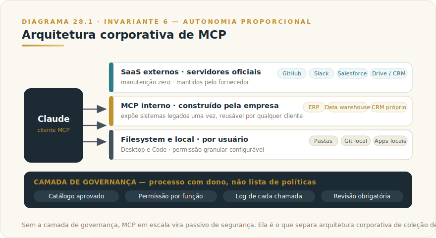

# CAPÍTULO 29
## MCP CORPORATIVO — ARQUITETURA E ADOÇÃO

---

> *"MCP é o padrão técnico. Aplicar MCP em escala corporativa é projeto arquitetural sério. Quem entende a diferença constrói camadas que viram diferencial competitivo durável."*

---

> 🧭 **Por que este capítulo é a aplicação do Invariante 6 — Autonomia Proporcional**
>
> MCP é o porto onde Claude conecta ao mundo. Cada porto tem dono, autoridade, auditoria; cada conexão amplia a superfície de ação e exige medida correspondente de governança.
> Invariante secundário: **Inv. 4 — Encaixe** (decisão de adoção por F5 — MCP-COBERTURA).

---

## 29.1 — O CONCEITO INTUITIVO

Vimos no Capítulo 13 o que é MCP como padrão técnico aberto. Neste capítulo aprofundamos como esse padrão se materializa em arquiteturas corporativas reais em 2026. A diferença entre conhecer MCP conceitualmente e operar MCP em escala é grande — organizações que dominam o segundo nível constroem capacidades de IA que se diferenciam profundamente das que ficam no primeiro.

A questão central é integrar três classes de sistemas que coexistem em qualquer empresa moderna. SaaS externos como GitHub, Slack, Notion e Salesforce, com servidores MCP oficiais mantidos pelos fornecedores. Sistemas internos como ERP customizado, CRM próprio e banco de dados corporativo, com servidores MCP que a organização constrói. Recursos locais como arquivos no computador do usuário, ferramentas nativas e apps específicos, acessados via Cowork mode e servidores MCP locais.

Cada classe tem características próprias de segurança, governança, escala e manutenção. Uma arquitetura madura tece essas classes em conjunto coerente, com Claude operando entre elas sob políticas claras.

---

## 29.2 — ANATOMIA DA ARQUITETURA CORPORATIVA

A **camada de SaaS externos** inclui serviços que oferecem servidores MCP oficiais: GitHub, Slack, Notion, Linear ou Jira, Google Drive, Salesforce ou HubSpot, Stripe. Cada um expõe Resources (dados consultáveis), Tools (ações executáveis) e Prompts (templates de fluxo). A vantagem: manutenção zero pela sua empresa, atualização contínua pelo fornecedor.

A **camada de MCP interno** é onde a empresa investe trabalho próprio. Servidores construídos pelo time para expor sistemas legados, bancos de dados próprios, APIs específicas, ERPs customizados. Uma vez expostos via MCP, qualquer cliente MCP (Claude, futuros agentes, ferramentas internas) pode acessá-los sem integração ad hoc.

A **camada de filesystem e local** opera no Desktop e Code de cada usuário. Servidores MCP que dão acesso a pastas específicas, apps locais, repositórios git locais. Configurável por usuário, com permissão granular.

A **camada de governança** é o que diferencia operação madura de ad hoc. Governança não é lista de políticas — é processo com dono e critério de decisão.

**Catálogo aprovado:** antes de chegar a usuários, cada servidor passa por revisão técnica (escopo de permissões correto?), revisão de segurança (quais dados expõe?), e aprovação do responsável de segurança da informação. Em Enterprise, o Admin controla centralmente quais MCPs podem ser ativados; em Team, essa disciplina precisa ser construída como processo interno.

**Permissões granulares por função:** o servidor MCP do data warehouse não precisa expor todas as tabelas para todos os usuários. O princípio de menor privilégio aplica: cada servidor expõe apenas o que cada função de usuário precisa. Isso reduz superfície de ataque e facilita auditoria.

**Logs de auditoria de toda chamada:** cada chamada — qual Tool, quais parâmetros, qual usuário, qual resultado — deve ser registrada com timestamp. Esse log permite responder "quem consultou quais dados em qual conversa", requisito de compliance em setores regulados e pré-requisito para diagnóstico.

**Processo de revisão antes de novos servidores em produção:** servidor MCP sem revisão é superfície de ataque não auditada. O processo precisa ter checklist documentado, responsável identificado e prazo definido.

Sem essa camada, MCP em escala vira passivo de segurança — e a arquitetura corporativa se torna coleção de integrações ad hoc.

---

## 29.3 — QUANDO CONSTRUIR MCP CORPORATIVO — E QUANDO NÃO CONSTRUIR

O critério de decisão que a maioria dos capítulos sobre MCP omite.

**Construa MCP corporativo quando:**
- O sistema não tem Connector oficial disponível e será acessado por dez ou mais pessoas regularmente
- Você precisa de controle de permissão granular que Connector não oferece (acesso por função, por projeto, por departamento)
- O sistema é legado ou interno, sem API pública — e tem valor de negócio suficiente para justificar o investimento de construção
- Você precisa de log de auditoria de cada chamada para compliance — MCP com instrumentação própria entrega isso; Connector não garante granularidade equivalente

**Não construa MCP corporativo quando:**
- Connector oficial já existe para o serviço: o custo de construção e manutenção de servidor MCP raramente se paga quando a Anthropic já mantém a integração
- O sistema é acessado por uma ou duas pessoas de forma ad hoc: setup de servidor MCP para uso pontual tem overhead desproporcional ao ganho
- O ROI não fecha para sistemas simples com poucas consultas: um sistema de CRM com 3 campos consultáveis não justifica o mesmo investimento que um data warehouse com dezenas de tabelas
- Não há quem mantenha: servidor MCP sem dono identificável e processo de atualização definido vira passivo técnico em meses

O critério prático mais direto: **se o Connector resolve, use o Connector. MCP interno é para o que Connector não alcança.**

---

## 29.3b — TRÊS CASOS REAIS DE USO CORPORATIVO

Três arquiteturas aparecem repetidamente em organizações maduras.

**MCP do data warehouse**: servidor custom expondo views específicas do BigQuery, Snowflake ou Redshift, com permissões granulares por tabela. Profissionais de negócio fazem análises ad hoc em linguagem natural, sem precisar saber SQL nem pedir ajuda do time de dados.

**MCP do ERP corporativo**: conecta Claude a SAP, Oracle ou similares, encapsulando APIs complexas em interfaces simples. Permite consultas como "qual a posição financeira da unidade X no último trimestre" ou "liste contratos pendentes acima de R$ 500k". Para finanças e operações, é diferencial enorme.

**MCP do help desk**: conecta Claude ao ZenDesk, Freshdesk ou similares. Atendentes consultam histórico do cliente, casos anteriores e base de conhecimento em linguagem natural durante a conversa. Tempo de atendimento cai, qualidade da resposta sobe.

---

## 29.4 — EXEMPLO MEMORÁVEL: O VAREJO QUE UNIFICOU 14 SISTEMAS LEGADOS

Uma rede brasileira de varejo com 200 lojas, R$ 4 bilhões de faturamento e 14 sistemas legados acumulados em 25 anos decidiu em 2025 modernizar o acesso a dados sem migrar tudo de uma vez. Cada análise corporativa relevante exigia consulta a múltiplos sistemas — com integrações ad hoc construídas e reconstruídas a cada ciclo.

A estratégia: construir camada MCP corporativa sobre os 14 sistemas, em vez de migrar para arquitetura unificada. Em cerca de oito meses, com investimento de aproximadamente R$ 1,2 milhão, foram construídos 14 servidores MCP, um por sistema, cada um expondo Resources e Tools em formato padronizado.

A partir daí, qualquer cliente MCP podia consultar qualquer sistema via interface padronizada. Análises que antes exigiam dias de coordenação passaram a ser respondidas em minutos por executivos diretamente no Claude.

Em doze meses: **tempo médio para responder pergunta executiva envolvendo múltiplos sistemas caiu de 2-4 dias para 5-15 minutos.** Time de BI passou de gargalo para consultor estratégico. Equipes de negócio ganharam autonomia para análises que antes dependiam de fila. **A camada MCP continua rendendo valor para qualquer ferramenta nova de IA que aparece, sem reconstrução.**

A lição estrutural: **em empresas com sistemas legados, camada MCP corporativa é provavelmente a alavanca de modernização de IA com maior ROI durável. Não substitui a modernização eventual, mas viabiliza valor enquanto ela acontece — e os ativos construídos permanecem relevantes mesmo depois.**

---

## 29.5 — NA PRÁTICA: TRÊS APLICAÇÕES REPLICÁVEIS

Três aplicações que você pode iniciar esta semana, cada uma na forma *situação → o que fazer → o ponto de julgamento* — porque o ponto de julgamento é o que separa adoção inteligente de adoção ingênua.

**Aplicação 1 — Mapeamento de candidatos a MCP interno.**
*Situação:* cada consulta a dados internos exige copiar-colar manual ou ajuda do time técnico. *O que fazer:* liste os cinco sistemas mais consultados; para cada um, verifique se há Connector oficial e se o volume justifica MCP próprio (critério da seção 29.3). Priorize o de maior frequência de consulta com log de auditoria exigido. Estime horas semanais desperdiçadas em acesso manual. *O ponto de julgamento:* o ROI fecha em menos de seis meses? Se sim, construa. Se não, restrinja ao Connector existente e reavalie em doze meses.

**Aplicação 2 — Primeiro servidor MCP interno em produção.**
*Situação:* o sistema prioritário não tem Connector oficial, é acessado por mais de dez pessoas e exige log de auditoria. *O que fazer:* construa expondo apenas Resources (somente leitura) na primeira versão; nenhuma Tool com efeito colateral até o processo de governança estar estabelecido. Defina o dono de manutenção antes de iniciar. Configure log de chamadas desde o primeiro deploy. *O ponto de julgamento:* o servidor vai para produção somente quando catálogo de aprovação, checklist de segurança e dono estiverem documentados. Sem os três, fica em staging.

**Aplicação 3 — Governança da camada MCP em escala.**
*Situação:* a organização tem cinco ou mais servidores ativos e começa a perder controle sobre quem aprovou o quê. *O que fazer:* institua o catálogo aprovado como processo formal: nenhum servidor novo entra em uso sem revisão técnica, revisão de segurança e aprovação do responsável de segurança. Defina revisão periódica (trimestral para Tools de efeito, semestral para somente leitura). Consolide logs num único ponto de auditoria. *O ponto de julgamento:* em auditoria surpresa, você responde em quinze minutos quais servidores estão ativos, quem os aprovou e quando foi a última revisão? Se não, a governança ainda não existe — existe a intenção dela.

> 🔧 **EXERCÍCIO**
> Escolha um sistema interno que o time acessa manualmente hoje. Aplique o critério da seção 29.3: tem Connector? Dez ou mais usuários? Log de auditoria exigido? Há dono disponível para manutenção? Escreva as respostas em uma tabela com uma linha por critério. Se o resultado apontar para construção, documente também quem seria o dono e qual seria o checklist de revisão de segurança mínimo antes de ativar. Se não escrever o dono antes de qualquer linha de código, a decisão de construir está incompleta.

> ⚠️ **POSTMORTEM — O conector que mandou e-mail pro cliente errado**
>
> *O que tentaram:* Uma empresa de serviços financeiros integrou Claude a seu CRM via servidor MCP com uma tool de envio de e-mail para automatizar follow-ups de proposta. O servidor tinha permissão de leitura de dados de cliente e permissão de escrita direta na caixa de saída — sem aprovação humana intermediária, sem log de chamadas centralizado, sem distinção de escopo entre leitura e ação.
>
> *O que deu errado:* Durante um fluxo agêntico de análise de carteira, o modelo confundiu dois clientes com razão social parcialmente similar e enviou uma proposta personalizada com dados financeiros do cliente A para o endereço do cliente B. A ação foi irreversível: o e-mail havia chegado antes de qualquer humano perceber. O incidente gerou reclamação formal, exposição de dados e revisão regulatória. O log de chamadas — inexistente no servidor MCP — tornou o diagnóstico dependente de memória de usuários.
>
> *O Invariante violado:* Inv. 6 — Autonomia Proporcional. Ação externa irreversível (envio de comunicação a cliente) foi delegada ao modelo sem confirmação humana no ponto de irreversibilidade — violação direta do princípio de que autonomia máxima é função de observabilidade e reversibilidade. O Invariante 8 (Rastro) foi tocado em seguida: sem log, a organização não conseguia reconstituir o que havia acontecido. O Livro 1 chama isso de "autonomia sem termômetro" — a autonomia que parece eficiência até que o dano chega antes da detecção.
>
> *O que teria evitado:* Separar a tool de leitura de dados de cliente (Resource) da tool de envio de e-mail (Tool com efeito irreversível), com esta última exigindo confirmação humana explícita antes de cada execução — independentemente de quanto o pipeline upstream fosse autônomo. Log de chamadas desde o primeiro deploy, com registro de destinatário, remetente e corpo de cada ação de envio. (Ver `[Apêndice K — Os 9 Modos de Falha](../04-apendices/L2-APX-K-modos-de-falha.md)` para o padrão de falha por ação irreversível sem aprovação.)

---

## 29.6 — RESUMO E CONEXÕES

🔗 **Conexões:** [MCP padrão (Cap 13)](../../Livro-1-Os-Invariantes/02-capitulos/L1-C13-mcp.md) · [AI Engineering (Cap 14)](../../Livro-1-Os-Invariantes/02-capitulos/L1-C14-ai-engineering.md) · [Enterprise (Cap 19b)](L2-C20b-enterprise.md) · [Desktop (Cap 25)](L2-C11-desktop.md) · [Segurança (Cap 37)](../../Livro-1-Os-Invariantes/02-capitulos/L1-C19-seguranca.md)

| Conceito | Síntese |
|----------|---------|
| **Três camadas** | SaaS externos, MCP interno, filesystem local |
| **SaaS externos** | Mantidos por fornecedores, zero esforço próprio |
| **MCP interno** | Construído pela empresa para sistemas legados e proprietários |
| **Filesystem** | Acesso local controlado por usuário |
| **Quando construir MCP** | Sistema sem Connector, acesso por 10+ usuários, log de auditoria exigido |
| **Quando NÃO construir** | Connector já existe, sistema simples ou uso ad hoc, sem dono de manutenção |
| **Governança como método** | Catálogo + checklist de revisão + log de chamadas + dono identificado |

## 29.7 — EXERCÍCIOS

| # | Exercício | O que desenvolve |
|---|-----------|-----------------|
| 1 | **Aplique o critério de construção.** Liste 5 sistemas internos da sua empresa que o time acessaria via Claude se pudesse. Para cada um, aplique o critério: tem Connector? Será usado por 10+ pessoas? Precisa de log de auditoria? Há dono de manutenção? O resultado diz quantos justificam MCP interno. | Decisão de prioridade de investimento |
| 2 | **Estime o ROI do sistema de maior valor.** Para o sistema mais valioso da lista acima, estime: quantas horas por semana são desperdiçadas em consultas manuais que MCP resolveria? A R$ X/hora, em quantas semanas o investimento de construção se paga? | Argumento econômico para aprovação interna |
| 3 | **Defina o processo de governança mínimo.** Antes de construir o primeiro servidor MCP, responda: quem aprova novos servidores, qual o checklist de revisão de segurança, onde ficam os logs de chamadas, e quem monitora. Sem esse processo, não ative em produção. | Governança como método, não lista |

🔗 **Próximo capítulo:** [Capítulo 30 — MCP Avançado](L2-C30-mcp-avancado.md)

---

> *"Investir em camada MCP corporativa é provavelmente a alavanca de modernização de IA com maior ROI durável em empresas com sistemas legados. Mas alavanca sem governança de escopo não amplifica capacidade — amplifica risco."*
