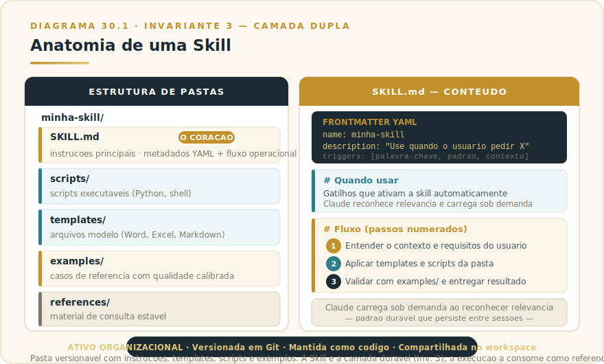
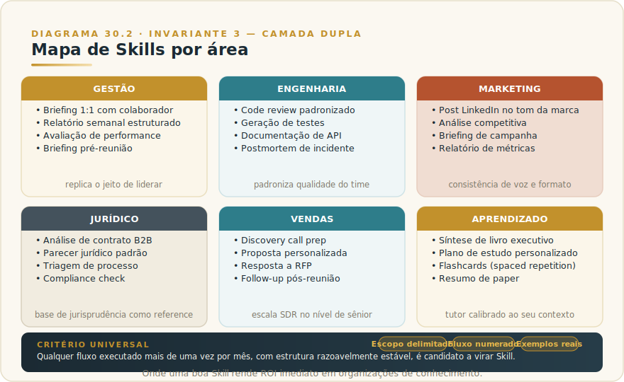
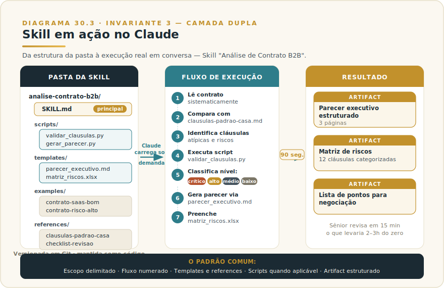

# CAPÍTULO 31
## CLAUDE SKILLS

---

> *"Skills são quando você ensina Claude a fazer algo do seu jeito, uma vez, e essa habilidade vira ativo organizacional reaplicável. Para times que entendem isso, IA deixa de ser ferramenta individual e vira infraestrutura."*

---

> 🧭 **Por que este capítulo é a aplicação do Invariante 3 — Camada Dupla**
>
> Skills é Camada Dupla materializada: padrão durável (método, rubrica, exemplos) capturado em forma reaplicável e versionada; a execução do dia consome a Skill como referência. Quem usa Skills constrói ativo organizacional; quem só prompta refaz tudo a cada turno.
> Invariante secundário: **Inv. 9 — Operador** (Skill amplifica o operador que sabe pedir, rejeitar e validar).

---

## 31.1 — O CONCEITO INTUITIVO

Skills são uma das peças mais subestimadas do ecossistema Claude, e provavelmente a alavanca de maior ROI para organizações de conhecimento que dominam o conceito. Toda equipe tem um conjunto de fluxos recorrentes que envolvem certo grau de complexidade, como análise de contrato comercial, code review padronizado, geração de relatório semanal estruturado, postmortem de incidente e briefing pré-reunião com cliente. Esses fluxos têm estrutura conhecida, exemplos do que é bom e do que é ruim, templates de saída, referências a consultar, validações a fazer. Mas codificar esse conhecimento em forma reaplicável é tipicamente trabalho cansativo que ninguém faz, e o resultado é cada pessoa do time reinventando o fluxo a cada execução.

Claude Skills resolve esse problema. Uma Skill é uma pasta versionada que contém instruções principais (SKILL.md), templates, scripts, exemplos e referências, encapsulando uma habilidade específica. Claude carrega a Skill apropriada sob demanda, executa o fluxo seguindo as instruções, usa os recursos disponíveis e entrega resultado consistente com o padrão definido. Para o time inteiro, é como ter o sênior mais experiente do grupo ensinando a melhor forma de fazer aquela tarefa, sempre disponível.

A diferença em maturidade entre uma organização que tem dez Skills bem construídas e outra que opera apenas com prompts soltos é dramática. A primeira tem replicabilidade de qualidade. A segunda tem variabilidade que depende de quem fez.

---

## 31.2 — ANATOMIA DE UMA SKILL

> 📊 **Diagrama 31.1 — Anatomia de uma Skill**
>
> 
>
> *Pasta versionável com instruções, templates, scripts e exemplos.*

A estrutura técnica de uma Skill segue convenções estabelecidas pela Anthropic. **SKILL.md** na raiz é o documento principal, contendo metadados (nome, descrição) em frontmatter YAML, e as instruções operacionais em Markdown. A descrição é especialmente importante porque é o que Claude usa para decidir se a Skill é relevante para a tarefa atual.

A pasta **scripts/** contém scripts executáveis (Python, shell, etc.) que a Skill pode invocar durante a execução. Geração de documento, validação de saída, processamento de dados, qualquer operação que se beneficie de código real em vez de raciocínio do modelo.

A pasta **templates/** contém arquivos modelo que viram base de geração. Documentos Word, planilhas Excel, slides PowerPoint, arquivos Markdown estruturados. Claude preenche os templates conforme a tarefa, mantendo formatação e estrutura consistentes.

A pasta **examples/** contém exemplos concretos de aplicação bem-sucedida da Skill. Casos resolvidos com qualidade de referência, que servem como calibração de padrão durante a execução.

A pasta **references/** contém material de consulta que Claude pode usar. Glossários, políticas internas, frameworks, qualquer conhecimento estável que apoie a execução.

A estrutura inteira é versionável em Git, tratada como código, com pull requests, code review, testes quando aplicáveis. Skills profissionais são mantidas pela equipe com a mesma disciplina que se aplica a outros artefatos de engenharia.

---

## 31.3 — SKILLS POR ÁREA, ONDE RENDEM MAIS

> 📊 **Diagrama 31.2 — Mapa de Skills por Área**
>
> 
>
> *Onde uma boa Skill rende ROI imediato em organizações de conhecimento.*

Skills funcionam em praticamente qualquer área de conhecimento profissional. Para cada uma das seis áreas principais, o capítulo apresenta uma Skill completa — com estrutura de pastas real, conteúdo de SKILL.md e exemplo de uso no Claude. Esses exemplos são templates diretos para adaptar e construir hoje.

A regra geral é simples. Qualquer fluxo que você executa mais de uma vez por mês, com estrutura razoavelmente estável, é candidato a virar Skill. O investimento inicial de construção paga em poucas execuções.

---

### 31.3.1 — GESTÃO: Skill "Briefing 1:1 com Colaborador"

**Problema que resolve.** Toda semana, gestor precisa preparar 1:1 com cada colaborador direto, revisando o que foi tratado no encontro anterior, identificando pontos em aberto, considerando contexto recente (entregas, ausências, sentimentos demonstrados). Sem estrutura, 1:1s viram conversas sem agenda e desperdiçam o ritual mais importante da gestão.

**Estrutura da pasta:**

```
briefing-1a1/
├── SKILL.md
├── templates/
│   ├── pauta-1a1.md
│   └── follow-up.md
├── examples/
│   ├── 1a1-novo-colaborador.md
│   └── 1a1-colaborador-em-dificuldade.md
└── references/
    ├── perguntas-poderosas.md
    └── framework-radical-candor.md
```

**SKILL.md (essência):**

```
---
name: briefing-1a1
description: Prepara pauta de 1:1 personalizada para cada colaborador,
  com base em histórico, contexto recente e tipo de momento da relação.
---

# Quando usar
Sempre que usuário pedir preparação de 1:1, briefing pré-reunião com
direto, ou retomada após período sem 1:1s.

# Fluxo
1. Pergunte nome do colaborador, função, tempo na empresa, momento atual
2. Consulte histórico de 1:1s anteriores no Project (se existir)
3. Identifique pontos em aberto, compromissos pendentes
4. Aplique framework de references/perguntas-poderosas.md
5. Gere pauta usando templates/pauta-1a1.md como base
6. Inclua 3 perguntas abertas + 2 perguntas de calibração + check-in pessoal
```

**Uso no Claude (exemplo real):** Gestor abre Project "Equipe", invoca a Skill com "preciso preparar o 1:1 da Renata amanhã". Claude consulta o histórico de 1:1s anteriores na Knowledge Base, identifica que ela mencionou desafio com priorização há 3 semanas, sugere check-in sobre evolução desse tema, propõe estrutura completa de 30 minutos com perguntas calibradas. Tempo de preparação cai de 20 minutos para 4 minutos, com qualidade superior.

---

### 31.3.2 — ENGENHARIA: Skill "Code Review Padronizado"

**Problema que resolve.** Code reviews variam dramaticamente de revisor para revisor no mesmo time. Alguns olham apenas sintaxe, outros mergulham em arquitetura. PRs param em filas porque revisores experientes viram gargalo. Juniors fazem reviews superficiais sem perceber.

**Estrutura da pasta:**

```
code-review-padrao/
├── SKILL.md
├── scripts/
│   ├── analisar_diff.sh
│   └── checar_complexidade.py
├── templates/
│   └── comentario-pr.md
├── examples/
│   ├── review-bom-pr-pequeno.md
│   ├── review-arquitetura-flag.md
│   └── review-com-sugestao-construtiva.md
└── references/
    ├── padroes-do-time.md
    ├── checklist-seguranca.md
    └── anti-padroes-comuns.md
```

**SKILL.md (essência):**

```
---
name: code-review-padrao
description: Faz code review estruturado seguindo padrões da casa,
  com foco em arquitetura, segurança, testes, legibilidade e performance.
---

# Quando usar
Quando usuário pedir review de PR, análise de diff, ou validação
antes de pedir review humano.

# Fluxo
1. Identifique linguagem e contexto do projeto via CLAUDE.md
2. Execute scripts/analisar_diff.sh para mudanças estruturais
3. Para cada arquivo modificado, aplique checklist:
   - Arquitetura: respeita padrões do time? (references/padroes-do-time.md)
   - Segurança: cobre checklist? (references/checklist-seguranca.md)
   - Testes: cobertura adequada?
   - Legibilidade: nomes claros, complexidade aceitável?
   - Performance: gargalos óbvios?
4. Gere comentários construtivos com sugestão de fix
5. Classifique severidade: blocker / major / minor / nit
6. Use templates/comentario-pr.md como formato
```

**Uso no Claude (exemplo real):** Dev sênior pede review de PR de junior com 8 arquivos alterados. Claude Code carrega Skill, analisa cada arquivo seguindo o fluxo, gera 12 comentários (1 blocker sobre vulnerabilidade SQL injection, 3 major sobre testes faltando, 5 minor sobre estilo, 3 nits sobre nomes), com sugestão de fix em cada. Dev sênior revisa em 10 minutos o que normalmente levaria 45.

---

### 31.3.3 — MARKETING: Skill "Post LinkedIn no Tom da Marca"

**Problema que resolve.** Marca tem voz específica que custou anos para calibrar, mas cada novo post LinkedIn parece escrito por uma pessoa diferente. Equipes de conteúdo gastam tempo refinando estilo em vez de produzir volume.

**Estrutura da pasta:**

```
post-linkedin-marca/
├── SKILL.md
├── templates/
│   ├── post-insight.md
│   ├── post-caso-real.md
│   ├── post-framework.md
│   └── post-historia-pessoal.md
├── examples/
│   ├── top-10-posts-virais.md
│   └── posts-com-erro-de-tom.md
└── references/
    ├── style-guide-marca.md
    ├── vocabulario-evitar.md
    ├── pessoas-citaveis.md
    └── temas-em-alta-setor.md
```

**SKILL.md (essência):**

```
---
name: post-linkedin-marca
description: Gera post LinkedIn no tom da marca, com estrutura,
  vocabulário e cadência calibrados pelo style guide e exemplos.
---

# Quando usar
Quando usuário pedir post LinkedIn, conteúdo de autoridade,
ou rascunho para publicação corporativa.

# Tom da marca (resumido)
- Executivo e direto, nunca corporativês
- Provocativo sem ser polêmico vazio
- Sempre com 1 dado concreto OU 1 caso real
- Frases longas com vírgulas, travessão raro
- Sem emojis exceto em listas
- Encerra com pergunta ou call-to-action sutil

# Fluxo
1. Pergunte ao usuário: tema, formato (insight/caso/framework/história)
2. Consulte examples/top-10 para calibrar tom
3. Gere primeira versão usando template adequado
4. Compare com style-guide-marca.md e ajuste
5. Sugira 2 variações de hook de abertura
6. Entregue como artifact Markdown para refinamento
```

**Uso no Claude (exemplo real):** Diretor de marketing pede "post sobre por que automação de marketing está falhando em PMEs". Claude carrega Skill, escolhe formato "insight provocativo", gera draft de 280 palavras seguindo style guide da marca, com hook forte, três argumentos sustentados por dados, e fechamento que convida discussão. Diretor refina em 8 minutos, em vez dos 45 que normalmente gastaria do zero.

---

### 31.3.4 — JURÍDICO: Skill "Análise de Contrato B2B"

**Problema que resolve.** Análise de contrato comercial exige checagem sistemática contra padrões da casa, cláusulas críticas conhecidas, jurisprudência aplicável. Cada advogado faz à sua maneira, com inconsistência entre revisões e risco de pular pontos importantes.

**Estrutura da pasta:**

```
analise-contrato-b2b/
├── SKILL.md
├── scripts/
│   ├── validar_clausulas.py
│   └── gerar_parecer.py
├── templates/
│   ├── parecer_executivo.md
│   └── matriz_riscos.xlsx
├── examples/
│   ├── contrato-saas-bom.md
│   ├── contrato-prestacao-ok.md
│   └── contrato-risco-alto.md
└── references/
    ├── clausulas-padrao-casa.md
    ├── jurisprudencia.md
    └── checklist-revisao.md
```

> 📊 **Diagrama 31.3 — Skill em Ação no Claude**
>
> 
>
> *Da estrutura da pasta à execução real em conversa com o Claude.*

**SKILL.md (essência):**

```
---
name: analise-contrato-b2b
description: Analisa contratos B2B comerciais identificando cláusulas
  críticas, riscos legais, e gerando parecer executivo padronizado.
---

# Quando usar
Quando usuário anexar contrato (PDF/DOCX) e pedir análise jurídica.

# Fluxo
1. Leia o contrato sistematicamente seguindo ordem:
   objeto → vigência → preços → SLA → multas → confidencialidade →
   propriedade intelectual → rescisão → foro
2. Para cada seção, compare com references/clausulas-padrao-casa.md
3. Identifique cláusulas atípicas, desvios, riscos
4. Execute scripts/validar_clausulas.py para checks formais
5. Classifique riscos: crítico / alto / médio / baixo / informacional
6. Gere parecer usando templates/parecer_executivo.md
7. Preencha matriz_riscos.xlsx com pontos para negociação
```

**Uso no Claude (exemplo real):** Advogada júnior anexa contrato de SaaS de 28 páginas e pede análise. Claude carrega Skill, executa o fluxo completo, gera parecer de 3 páginas estruturado com 12 cláusulas analisadas, 3 alertas críticos (cláusula de exclusividade abusiva, ausência de cap em multas, foro inconveniente), e lista priorizada de 7 pontos para negociar com cliente. Tempo total: 90 segundos para análise que sênior do escritório levaria 2-3 horas. Júnior entrega no padrão de sênior, sênior revisa em 15 minutos.

---

### 31.3.5 — VENDAS: Skill "Preparação de Discovery Call"

**Problema que resolve.** Vendedor B2B chega em discovery call sem ter pesquisado adequadamente o cliente, perde primeira impressão, faz perguntas que poderia ter respondido sozinho com 30 minutos de pesquisa prévia. Conversões caem.

**Estrutura da pasta:**

```
discovery-call-prep/
├── SKILL.md
├── scripts/
│   └── pesquisar_empresa.sh
├── templates/
│   ├── briefing-cliente.md
│   └── perguntas-discovery.md
├── examples/
│   ├── discovery-saas-bom.md
│   └── discovery-com-c-level.md
└── references/
    ├── perguntas-spin-selling.md
    ├── perguntas-c-level.md
    └── sinais-de-buying-intent.md
```

**SKILL.md (essência):**

```
---
name: discovery-call-prep
description: Prepara briefing completo de cliente antes de discovery call,
  com pesquisa, perguntas calibradas e estratégia de abordagem.
---

# Quando usar
Quando vendedor disser que tem discovery call agendada e precisa preparar.

# Fluxo
1. Pergunte: nome da empresa, persona (cargo), tempo até a call
2. Execute pesquisa via Web Search:
   - Empresa: tamanho, faturamento, setor, eventos recentes
   - Persona: LinkedIn, conteúdo público, prioridades sinalizadas
   - Concorrência: quem já atende eles, com qual abordagem
3. Identifique gatilhos de oportunidade (mudanças, expansões, dores)
4. Gere briefing usando templates/briefing-cliente.md
5. Sugira 6 perguntas de discovery baseadas em SPIN selling
6. Proponha 3 mensagens de abertura testando diferentes ângulos
7. Identifique 2 riscos de objeção a preparar
```

**Uso no Claude (exemplo real):** SDR tem call em 2h com VP de Operações de empresa de logística com 800 funcionários. Pede briefing. Claude executa pesquisa em 4 minutos, retorna briefing de 2 páginas com perfil da empresa, contexto recente (notícia de expansão para Nordeste de 3 semanas atrás), perfil profissional do VP, 6 perguntas de discovery calibradas, abordagem sugerida. SDR chega preparado em nível que antes só sêniors entregavam.

---

### 31.3.6 — APRENDIZADO: Skill "Síntese de Livro Executivo"

**Problema que resolve.** Profissional ocupado quer extrair valor de livro de negócios sem ler 350 páginas. Resumos genéricos do Google são rasos, deixam de fora o que importa para o contexto específico de quem está lendo.

**Estrutura da pasta:**

```
sintese-livro-executivo/
├── SKILL.md
├── templates/
│   ├── sintese-completa.md
│   ├── flashcards-spaced-rep.md
│   └── plano-aplicacao.md
├── examples/
│   ├── sintese-thinking-fast-slow.md
│   └── sintese-good-to-great.md
└── references/
    ├── framework-extracao.md
    └── perguntas-aplicacao.md
```

**SKILL.md (essência):**

```
---
name: sintese-livro-executivo
description: Gera síntese executiva de livro com framework de aplicação
  prática, calibrada ao contexto profissional do usuário.
---

# Quando usar
Quando usuário pedir resumo, síntese ou principais ideias de livro
de negócios, gestão ou desenvolvimento profissional.

# Fluxo
1. Pergunte ao usuário: título do livro, sua função, principal desafio atual
2. Se livro for conhecido, gere síntese estruturada:
   - 3 teses centrais em uma frase cada
   - 5 modelos mentais ou frameworks principais
   - 8 ideias acionáveis no contexto profissional do usuário
3. Use templates/sintese-completa.md como estrutura
4. Gere 10 flashcards no formato spaced repetition
5. Proponha plano de aplicação prática em 30 dias
6. Entregue 3 artifacts: síntese, flashcards, plano
```

**Uso no Claude (exemplo real):** CTO pede síntese de "Crucial Conversations" com foco em aplicação para gerenciar discordâncias técnicas com VP de Produto. Claude gera síntese de 4 páginas customizada ao contexto, com exemplos específicos de como aplicar cada modelo em conversas de roadmap. Tempo: 3 minutos para conteúdo que substituiu (com qualidade superior) leitura de 8 horas.

---

### 31.3.7 — Adapte, não copie

Os seis exemplos acima são blueprints, não receitas. Cada organização tem seu vocabulário, seus padrões de qualidade, seus casos de referência. Uma Skill que funciona na consultoria de M&A do exemplo pode falhar numa empresa de tecnologia que tem nomenclatura diferente ou processo distinto.

O sinal de que você está copiando em vez de adaptando: você não conseguiu preencher a pasta `examples/` com casos reais da sua organização. Se os exemplos são genéricos ou hipotéticos, a Skill ainda não está calibrada para o seu contexto.

### 31.3.8 — O padrão comum

Note o padrão que se repete em todos os seis exemplos. Toda Skill bem feita tem cinco características.

A primeira é **escopo bem delimitado**. Faz uma coisa, faz bem. Skills genéricas demais perdem precisão.

A segunda é **fluxo numerado explícito**. SKILL.md descreve passos ordenados que Claude deve executar, não orientação vaga.

A terceira é **uso ativo de templates e references**. Material reutilizável vive na pasta, não no prompt.

A quarta é **execução de scripts quando apropriado**. Validações, cálculos, processamentos que código resolve melhor que raciocínio do modelo.

A quinta é **entrega estruturada em artifacts**. O output final fica em formato compartilhável, não enterrado no chat.

Quando sua organização internaliza esses cinco elementos, Skills viram ativo organizacional reaplicável. Bibliotecas de 20 a 50 Skills bem construídas costumam transformar dramaticamente a qualidade e velocidade do trabalho cognitivo coletivo.

---

## 31.4 — GOVERNANÇA DE SKILLS: QUANDO RESPONSABILIDADE INDELEGÁVEL ENCONTRA ATIVO ORGANIZACIONAL

Skills compartilhadas no workspace Team ou Enterprise são ativos organizacionais. E ativos organizacionais têm requisitos de governança que prompts individuais não têm. O Invariante 8 — Responsabilidade Indelegável — aplica aqui com precisão: quando uma Skill é distribuída para o time inteiro, quem é responsável pelo que ela entrega?

Sem governança, Skills acumulam três tipos de problema silencioso.

**O problema do acúmulo não curado:** Skills criam valor quando são precisas. Uma Skill jurídica construída em janeiro com as cláusulas-padrão da empresa pode estar desatualizada em agosto, se os padrões tiverem mudado. Se ninguém é responsável pela atualização, o time continua usando a Skill mas confiando num padrão obsoleto — e não percebe porque a saída "parece certa" mas não está.

**O problema da distribuição sem validação:** qualquer membro de um workspace Team pode criar uma Skill e, dependendo da configuração, disponibilizá-la para outros. Skill mal-construída distribuída amplamente é pior que prompt solto: cria falsa confiança de qualidade. Alguém vai usar acreditando que segue o "padrão do time" quando na verdade está seguindo um rascunho que nunca foi validado.

**O problema da descontinuação fantasma:** Skills que não servem mais ficam no workspace, aparecem na sugestão de Claude, e confundem novos membros. Uma Skill para um processo que foi descontinuado há seis meses pode induzir alguém a seguir um fluxo que não existe mais.

### O ciclo mínimo de governança

O ciclo abaixo não é burocracia — é o mínimo para que Skills permaneçam ativos confiáveis:

**1. Aprovação antes da distribuição.** Toda Skill que vai para o workspace compartilhado passa por uma pessoa designada (o curador da Skill) que valida: o fluxo está correto, os exemplos são reais e de qualidade, e a Skill não contradiz políticas vigentes. Em times pequenos, o curador pode ser quem construiu a Skill mas com revisão de pelo menos um par. Em times grandes, o processo é mais formal.

**2. Dono identificado por Skill.** Cada Skill tem um nome no campo `owner:` do frontmatter do SKILL.md. Quando o processo muda, quem mudou o processo vai até o dono para atualizar a Skill. Quando o dono sai da empresa, a Skill é reatribuída ou suspensa — não continua ativa sem responsável.

**3. Ciclo de revisão periódico.** Skills de processos estáveis (onboarding, template de documento) revisadas a cada seis meses. Skills de processos dinâmicos (análise competitiva, compliance) revisadas a cada trimestre. A data da última revisão fica registrada no SKILL.md.

**4. Critério de descontinuação.** Skill é marcada como descontinuada quando: o processo que ela suporta foi extinto, o volume de uso caiu abaixo de um threshold por ciclo, ou a qualidade das saídas ficou consistentemente abaixo do padrão. Skills descontinuadas saem do workspace ativo mas ficam arquivadas — o histórico de por que existiam tem valor.

**5. Teste antes de atualização em larga escala.** Quando uma Skill existente é atualizada significativamente, valide com dois ou três casos reais antes de re-publicar. Atualização mal-calibrada afeta todo o time imediatamente.

### O frontmatter mínimo de governança

```yaml
---
name: analise-contrato-b2b
description: Analisa contratos B2B comerciais identificando cláusulas críticas
owner: nome.sobrenome@empresa.com
version: 1.3
last-reviewed: 2026-05-15
status: active  # active | deprecated | draft
approved-by: nome.aprovador@empresa.com
---
```

Com esses campos, qualquer Admin do workspace pode auditar o estado de cada Skill: quem é responsável, quando foi revisada por último, se está aprovada para uso. É o mínimo de accountability para que o ativo organizacional continue confiável.

---

## 31.5 — EXEMPLO MEMORÁVEL: A CONSULTORIA QUE INDUSTRIALIZOU CONHECIMENTO

Uma consultoria brasileira de M&A, com cerca de 20 consultores atendendo operações complexas, vivia com um problema clássico de organização de conhecimento. Cada novo deal de due diligence preliminar exigia análise estruturada que apenas sêniors faziam com qualidade, juniors levavam o dobro do tempo e entregavam resultado inconsistente, e a memória institucional sobre como abordar cada tipo de setor estava na cabeça de três pessoas.

Em janeiro de 2026, a sócia diretora propôs construir biblioteca interna de Skills. Em quatro meses, com investimento de cerca de 200 horas de trabalho dedicado, foram criadas 12 Skills cobrindo os fluxos principais do trabalho. Análise financeira preliminar, mapeamento competitivo, due diligence jurídica preliminar, análise de cultura organizacional, projeção de sinergias, valuation simplificado.

Cada Skill foi construída por um sênior dedicado, com curador identificável responsável por manutenção contínua. Templates seguiam padrões já validados, exemplos eram casos reais resolvidos com qualidade, references incluíam frameworks proprietários da casa.

O resultado em três meses foi notável. **Tempo médio de due diligence preliminar caiu de 18 horas-consultor para 6 horas**, com qualidade igual ou superior em testes cegos comparativos. **Onboarding de novo consultor caiu de 8 semanas para 3 semanas** para conseguir entregar trabalho aceitável. **Cinco novos deals foram atendidos no trimestre seguinte** sem expansão de equipe, simplesmente porque a capacidade efetiva da firma havia crescido sem contratações.

A lição estrutural é dura mas reveladora. **Consultoria sempre vendeu "expertise dos sócios sêniors", mas essa expertise frequentemente vivia em formato pouco transferível. Skills permitem industrializar essa expertise sem perder qualidade, escalando entrega sem proporção direta de aumento de pessoal.** Para empresas de serviços profissionais, essa é provavelmente a mudança organizacional mais transformadora da década, e a maioria ainda não percebeu o tamanho do que está em jogo.

---

## 31.6 — NA PRÁTICA: TRÊS APLICAÇÕES REPLICÁVEIS

O exemplo anterior mostra o resultado agregado de uma biblioteca inteira; esta seção entrega o roteiro para começar. Três aplicações que você pode iniciar esta semana. A forma é *situação → o que fazer → o ponto de julgamento* — porque o método é imitável, mas o julgamento é o que separa Skill que vira ativo de Skill que vira lixo organizacional.

**Aplicação 1 — Primeira Skill de alto impacto e baixo esforço.**
*Situação:* existe um fluxo que alguém no time executa mais de uma vez por semana com estrutura estável (relato de incidente, preparação de reunião, análise de métrica recorrente). *O que fazer:* entreviste a pessoa que melhor executa esse fluxo; peça que descreva os passos em ordem, o que uma boa saída tem que um output medíocre não tem, e quais referências consulta. Codifique isso em um SKILL.md com fluxo numerado, três exemplos reais de saída de qualidade alta, e um frontmatter com dono e status `draft`. Teste em três casos reais antes de declarar `active`. *O ponto de julgamento:* você consegue preencher a pasta `examples/` com casos reais — não hipotéticos — da sua organização? Se não conseguir, a Skill não está calibrada para o seu contexto; está calibrada para o que você imagina que seu contexto é.

**Aplicação 2 — Skill de governança para um processo regulado ou crítico.**
*Situação:* o time executa análises que exigem checklist padronizado (conformidade contratual, revisão de código de segurança, aprovação de crédito). Um único passo pulado pode custar caro. *O que fazer:* construa a Skill com a lista de verificação embutida no fluxo do SKILL.md; adicione um script de validação que confirma que os campos obrigatórios foram preenchidos antes de gerar o output final; inclua no frontmatter o campo `approved-by` com o nome do responsável que validou o fluxo. Distribua ao workspace somente após esse campo estar preenchido. *O ponto de julgamento:* a Skill deve fazer o que o analista mais cuidadoso do time faria — não o mediano. Teste com três casos onde o analista mediano erraria e o cuidadoso pegaria. Se a Skill não capturar os três, o fluxo ainda está incompleto.

**Aplicação 3 — Ciclo de governança para biblioteca de Skills do workspace.**
*Situação:* o workspace compartilhado já tem cinco ou mais Skills e começa a surgir confusão sobre quais são confiáveis, quais estão desatualizadas e quem é o dono. *O que fazer:* rode uma auditoria de todas as Skills ativas: para cada uma, verifique se `owner`, `last-reviewed` e `approved-by` estão preenchidos. Skills sem `owner` identificado ficam com status `deprecated` imediatamente. Skills com `last-reviewed` há mais de seis meses entram em fila de revisão do dono. Documente o critério de descontinuação e publique-o no canal de comunicação do time. *O ponto de julgamento:* depois da auditoria, um novo colaborador consegue, sem pedir ajuda, identificar quais Skills estão ativas, quem é o responsável e quando foram validadas pela última vez? Se não consegue, a governança existe só como intenção.

> 🔧 **EXERCÍCIO**
> Escolha um fluxo recorrente que você executa — não hipotético, real. Escreva o SKILL.md mínimo: nome, descrição, `# Quando usar` e cinco passos numerados do fluxo. Preencha o frontmatter com `owner` (você), `status: draft` e `last-reviewed` (data de hoje). Agora tente preencher a pasta `examples/` com dois casos reais de saída de qualidade alta. Se não conseguir, volte ao fluxo e pergunte ao sênior do time o que diferencia uma saída boa de uma aceitável — essa resposta é o que estava faltando no SKILL.md.

---

## 31.7 — RESUMO E CONEXÕES

🔗 **Conexões:** [Memória procedural (Cap 7)](../../Livro-1-Os-Invariantes/02-capitulos/L1-C07-memoria.md) · [Engenharia de prompt (Cap 9)](../../Livro-1-Os-Invariantes/02-capitulos/L1-C09-engenharia-prompt.md) · [Projects (Cap 20)](L2-C13-projects.md) · [Subagents (Cap 31)](L2-C32-subagents-workflows.md) · [Team (Cap 19)](L2-C20-team.md)

| Conceito | Síntese |
|----------|---------|
| **Skill** | Pasta versionada com habilidade específica encapsulada |
| **SKILL.md** | Documento principal com metadados e instruções |
| **Estrutura** | scripts/, templates/, examples/, references/ |
| **Carregamento** | Sob demanda, quando Claude reconhece relevância |
| **Compartilhamento** | Workspace Team ou Enterprise |
| **Áreas que rendem** | Gestão, engenharia, marketing, jurídico, vendas, aprendizado |
| **Governança obrigatória** | Dono por Skill, aprovação antes da distribuição, revisão periódica, descontinuação explícita |

## 31.8 — EXERCÍCIOS

| # | Exercício | O que desenvolve |
|---|-----------|-----------------|
| 1 | **Identifique três candidatos a Skill.** Liste fluxos que você ou seu time executam mais de uma vez por mês, com estrutura razoavelmente estável. Classifique: qual tem maior impacto? Qual tem estrutura mais conhecida? Essa é a primeira Skill a construir. | Priorização de investimento |
| 2 | **Construa uma SKILL.md mínima.** Escolha o candidato de maior prioridade. Crie o SKILL.md com: nome, descrição, `# Quando usar`, e os passos numerados do fluxo. Não precisa de scripts ou templates ainda — o fluxo codificado já é valor. | Habilidade prática de construção |
| 3 | **Defina a governança antes de compartilhar.** Para a Skill que você construiu: quem é o dono? Quem aprova antes de distribuir ao workspace? Com que frequência será revisada? Escreva isso no frontmatter antes de publicar. Sem esses campos preenchidos, a Skill não vai ao workspace compartilhado. | Responsabilidade Indelegável aplicada a ativos de IA |

🔗 **Próximo capítulo:** [Capítulo 32 — Subagents e Workflows](L2-C32-subagents-workflows.md)

---

> *"Skills industrializam expertise. Para empresas de conhecimento, é provavelmente a mudança organizacional mais transformadora da década."*
