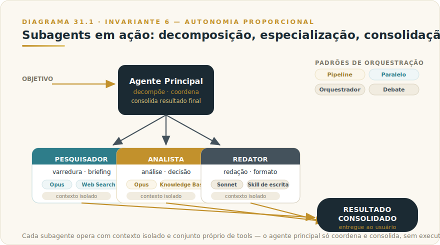

# CAPÍTULO 32
## SUBAGENTS E WORKFLOWS

---

> *"Quando uma tarefa cresce além do que um único agente faz bem, dividir entre subagentes especializados muda o que se torna possível. É o padrão das equipes que entregam o que antes parecia inviável."*

---

> 🧭 **Por que este capítulo é a aplicação do Invariante 6 — Autonomia Proporcional**
>
> Subagentes só fazem sentido com observabilidade proporcional à autonomia que recebem. Sem tracing e sem rollback, sub-rotina vira loop opaco com custo composto crescente. O F3 — AGENTE-PROP define os níveis de delegação por capacidade de rastrear e reverter.

---

## 32.1 — O CONCEITO INTUITIVO

Existe um ponto na complexidade de tarefas em que um único agente Claude começa a falhar. Contexto inflado prejudica atenção, variedade de tools confunde a decisão sobre qual usar, sequência longa acumula erros compostos, especializações distintas são demandadas simultaneamente. A resposta arquitetural é Subagents: distribuir o trabalho entre múltiplos agentes especializados, com um agente principal orquestrando o conjunto.

Subagents é capacidade nativa do Claude em 2026, disponível em Claude Code e em fluxos avançados: o agente principal invoca subagentes com objetivos delimitados, contexto isolado e Skills específicas. Cada subagente trabalha em sua especialidade sem ser distraído pelo escopo alheio; o agente principal consolida os resultados em entrega coerente. A analogia é a de gerente de projeto coordenando especialistas, em vez de tentar fazer tudo sozinho.

Para fluxos que envolvem pesquisa profunda, análise estruturada, redação e validação técnica, o padrão multi-agente entrega resultado qualitativamente superior ao que agente único conseguiria.

---

## 32.2 — ANATOMIA DA ORQUESTRAÇÃO

O **agente principal** recebe o objetivo do usuário, decompõe em subtarefas, invoca cada subagente com instruções específicas e consolida os resultados. É o papel de coordenação — visão de conjunto que cada subagente não precisa ter.

Cada **subagente** opera com contexto próprio, separado do principal: recebe apenas o que é relevante para sua tarefa, mantendo foco e qualidade superiores. Cada subagente pode usar tools, Skills e modelos diferentes (Opus para profundidade, Sonnet para tarefas comuns, Haiku para volume).

A **especialização** pode seguir várias dimensões. Por domínio (subagente jurídico, subagente financeiro, subagente técnico). Por etapa do processo (subagente de pesquisa, subagente de análise, subagente de redação). Por modelo (subagente de raciocínio profundo em Opus, subagente de processamento em volume em Haiku). A escolha de como dividir depende da natureza da tarefa.

A **comunicação** entre agente principal e subagentes é estruturada: o principal envia objetivo com critério de sucesso, o subagente retorna resultado em formato definido, o principal aprova ou solicita refinamento. Interface programática, não conversa livre.

---

## 32.3 — QUANDO USAR SUBAGENTS

Subagents rendem em alguns contextos e atrapalham em outros — a distinção é operacionalmente importante.

**Rendem em tarefas complexas com múltiplas especializações**, em que o resultado depende de competências distintas executadas em coordenação. Pesquisa profunda multi-domínio, análise estratégica integrando dados financeiros, técnicos e de mercado, geração de proposta comercial que precisa de pesquisa, análise e redação.

**Rendem em tarefas com paralelismo natural**, em que subtarefas podem ser executadas independentemente. Análise simultânea de várias fontes, processamento de lotes, varredura de múltiplos sistemas em paralelo.

**Rendem em tarefas longas que se beneficiam de contexto isolado**, em que um único agente acumularia contexto grande demais. Refatoração de base de código grande, due diligence ampla, pesquisa de mercado profunda.

**Atrapalham em tarefas simples** — dividir adiciona overhead sem ganho; agente único é mais rápido e barato.

**Atrapalham quando a coordenação custa mais que a especialização rende** — quando o principal faz trabalho desproporcional para integrar resultados que poderiam ter sido produzidos diretamente.

---

## 32.4 — EXEMPLO MEMORÁVEL: A PROPOSTA DE 8 PÁGINAS EM 25 MINUTOS

Uma agência de consultoria estratégica brasileira com cerca de 30 consultores recebia regularmente RFPs de potenciais clientes. Cada proposta de qualidade exigia entre 12 e 20 horas de pesquisa, análise, formatação e customização — gargalo constante em meio a múltiplos deals.

Em fevereiro de 2026, uma sócia construiu um fluxo multi-agente em Claude Code para preparar a primeira versão de propostas. A arquitetura ficou assim.

**Subagente Pesquisador** recebia nome e setor do cliente, fazia varredura web e em bases internas, produzia briefing de 2 páginas com contexto setorial, desafios típicos e decisões recentes. Usava Opus com Web Search e Skill de pesquisa corporativa.

**Subagente Analista** recebia o briefing e o escopo do RFP, identificava a oferta mais adequada, casos similares na base, propunha abordagem com cronograma e equipe, mapeava riscos. Usava Opus com Knowledge Base da casa.

**Subagente Redator** recebia briefing e análise, gerava a primeira versão seguindo o template padrão, com tom calibrado pela Skill de escrita corporativa. Usava Sonnet por velocidade.

**Subagente Revisor** recebia a proposta gerada, verificava critérios de qualidade, identificava lacunas e propunha melhorias. Usava Opus em extended thinking com checklist de revisão.

**Agente Principal** recebia o RFP, disparava os subagentes em sequência, consolidava os resultados e entregava proposta final de 8 páginas com pontos de atenção marcados.

Após duas semanas de refinamento dos prompts e Skills, o resultado foi notável. **Tempo médio para a primeira versão de proposta caiu de 16 horas para 25 minutos.** A qualidade melhorou em testes cegos comparativos com versões manuais — principalmente pelo Subagente Revisor, que aplicava um checklist consistente que humanos frequentemente esqueciam.

Um consultor sênior ainda dedicava 1 a 2 horas para polir, validar números e ajustar tom. **O trabalho total caiu de 16 horas para cerca de 2 horas humanas, com qualidade superior.** Em três meses, a vazão de propostas qualificadas quintuplicou sem aumento de pessoal.

A lição estrutural: **tarefas que parecem exigir muitas horas humanas são frequentemente compostas de subtarefas especializáveis — quando divididas em subagentes coordenados, viram fração do esforço original.** Quem domina essa arquitetura capta vantagem desproporcional sobre quem ainda opera com agente único genérico.

---

## 32.5 — WORKFLOWS, PADRÕES DE ORQUESTRAÇÃO

Subagents pode ser orquestrado em padrões que valem ser conhecidos.

**Pipeline sequencial** — subagentes executam em sequência, cada um recebendo o output do anterior. Ideal para fluxos lineares como o exemplo da proposta.

**Paralelismo** — múltiplos subagentes simultâneos para subtarefas independentes; o principal consolida ao final. Reduz tempo total, mas exige independência real entre as tarefas.

**Orquestrador com especialistas** — agente central decide dinamicamente qual subagente invocar, em vez de sequência fixa. Mais flexível, mais complexo.

**Hierarquia** — múltiplos níveis de subagentes, cada nível invocando os próprios. Útil em tarefas grandes; limite prático: não mais que dois níveis antes de testar exaustivamente — cada nível adicional multiplica a superfície de falha e o custo de debug.

**Debate** — subagentes adversariais discutem; o principal sintetiza. Para decisões com trade-offs onde múltiplas perspectivas importam. Risco específico: loop sem convergência. Defina limite de rodadas e critério explícito de resolução antes de ativar.

---

## 32.6 — GOVERNANÇA DE SUBAGENTS: O QUE A ABERTURA PROMETEU E O CORPO PRECISA ENTREGAR

A abertura deste capítulo afirma que "sem tracing e sem rollback, sub-rotina vira loop opaco com custo composto crescente". Subagents sem governança têm quatro pontos de falha típicos em produção:

**1. Custo acumulado invisível.** Cadeia de subagentes pode consumir tokens muito acima do estimado, especialmente quando algum entra em loop. Configure alertas de custo por execução antes de colocar em produção. Em Claude Code, `--max-turns` limita turnos por subagente; use-a.

**2. Falha silenciosa de subagente.** Output vazio ou malformado pode não interromper o fluxo — o principal continua com input degradado e entrega resultado aparentemente correto mas incorreto. Implemente validação de schema no output de cada subagente: se não passar, o fluxo interrompe e reporta o ponto de falha.

**3. Erro com ferramenta destrutiva sem rollback.** Subagente com tools de escrita pode executar ação irreversível antes que o contexto errado seja percebido. Para qualquer subagente com ferramentas destrutivas: (a) adicione confirmação humana antes da ação, (b) implemente dry-run, ou (c) use padrão de staging onde a ação é reversível por um período definido.

**4. Debug impossível sem tracing.** Quando um fluxo de 4 subagentes entrega resultado errado, sem tracing você não sabe onde o erro entrou. Cada subagente deve logar: input, output, tools chamadas e tempo de execução. Em Claude Code, `.claude/` registra a sessão; em produção, adicione logging explícito no prompt de cada subagente.

### O pré-flight check antes de colocar multi-agente em produção

Antes de ativar qualquer cadeia de subagentes em contexto que afeta outros ou custa recurso real:

| Check | Pergunta | Se "não": |
|-------|----------|-----------|
| **Custo** | Você tem limite configurado de gasto máximo por execução? | Configure `--max-turns` e alerta de custo |
| **Fallback** | Se um subagente falhar, o fluxo interrompe e reporta? | Implemente validação de output |
| **Reversão** | Actions destrutivas têm dry-run ou confirmação humana? | Adicione antes de ativar |
| **Tracing** | Você consegue ver qual subagente produziu qual output? | Adicione logging por subagente |
| **Limite de hierarquia** | A cadeia tem mais de dois níveis? | Teste exaustivamente ou simplifique |

---

## 32.7 — NA PRÁTICA: TRÊS APLICAÇÕES REPLICÁVEIS

O exemplo anterior mostra o resultado de uma arquitetura madura; esta seção entrega o roteiro de entrada. Três aplicações progressivas, da mais simples à mais complexa. A forma é *situação → o que fazer → o ponto de julgamento*.

**Aplicação 1 — Pipeline sequencial para tarefa com três especialidades.**
*Situação:* você executa regularmente uma tarefa que combina pesquisa, análise e redação — e o resultado sofre quando as três fases competem pelo mesmo contexto. *O que fazer:* decomponha em três subagentes sequenciais com contexto isolado; o primeiro recebe o brief e retorna pesquisa estruturada; o segundo recebe apenas a pesquisa e retorna análise com conclusões; o terceiro recebe análise e brief e redige o output final. Antes de ativar em produção, preencha o pré-flight check da seção 32.6: custo máximo configurado, validação de output de cada subagente, nenhum deles com ação destrutiva. *O ponto de julgamento:* quando o segundo subagente recebe a pesquisa do primeiro, o output faz sentido isolado — sem contexto da conversa original? Se não fizer, o contrato de interface entre subagentes está mal definido.

**Aplicação 2 — Paralelismo para análise de múltiplas fontes independentes.**
*Situação:* a tarefa exige analisar cinco documentos ou fontes distintas e sintetizar o melhor de cada um. Sequencial é lento; as análises são verdadeiramente independentes entre si. *O que fazer:* dispare cinco subagentes em paralelo, cada um recebendo apenas o documento que lhe compete; defina o schema de saída que cada um deve respeitar; o agente principal recebe os cinco outputs e sintetiza. Configure timeout individual por subagente — se um demorar mais que o dobro dos outros, é sinal de falha, não de trabalho extra. *O ponto de julgamento:* a síntese do agente principal deve ser coerente mesmo se um dos subagentes retornar output parcial ou vazio. Se o agente principal travar quando qualquer subagente falha, o isolamento de falha não foi implementado.

**Aplicação 3 — Orquestrador com padrão de debate para decisão com trade-offs.**
*Situação:* a decisão tem dimensões que se contradizem — custo vs. velocidade, risco vs. oportunidade — e você quer perspectivas adversariais antes de sintetizar. *O que fazer:* construa dois subagentes com papéis opostos (defensor e crítico); cada um recebe o mesmo brief e o output do outro; o agente principal recebe as duas posições com critério explícito de resolução. Defina no sistema do agente principal o número máximo de rodadas de debate (duas a três) e o critério de como resolver quando as posições persistirem. *O ponto de julgamento:* o critério de resolução do agente principal deve ser declarado antes de rodar, não inferido. Se o principal não consegue decidir sem rodar mais uma rodada, o critério está vago — reescreva o critério até o principal conseguir decidir com o que tem.

> 🔧 **EXERCÍCIO**
> Identifique uma tarefa complexa que você ou o time executa com Claude hoje, que envolve ao menos duas especialidades distintas (ex.: pesquisa + redação, análise técnica + comunicação executiva). Desenhe a decomposição em subagentes: quantos, o que cada um recebe, o que cada um devolve, em qual formato. Preencha o pré-flight check da seção 32.6 para a arquitetura desenhada. Se algum dos cinco checks retornar "não", escreva o que precisaria construir antes de ativar. Sem os cinco checks respondidos afirmativamente, o fluxo é protótipo, não produção.

---

## 32.8 — RESUMO E CONEXÕES

🔗 **Conexões:** [Agentes (Cap 12)](../../Livro-1-Os-Invariantes/02-capitulos/L1-C12-agentes.md) · [MCP (Cap 13)](../../Livro-1-Os-Invariantes/02-capitulos/L1-C13-mcp.md) · [Claude Code (Cap 24)](L2-C09-claude-code.md) · [Skills (Cap 30)](L2-C31-skills.md)

| Conceito | Síntese |
|----------|---------|
| **Subagents** | Agentes especializados invocados por agente principal |
| **Especialização** | Por domínio, etapa do processo ou modelo |
| **Contexto isolado** | Cada subagente opera com contexto próprio focado |
| **Padrões** | Pipeline, paralelismo, orquestrador, hierarquia, debate |
| **Quando usa** | Tarefas complexas com múltiplas especializações, paralelismo natural, contexto que inflaria demais |
| **Quando evita** | Tarefas simples, coordenação custa mais que especialização rende |
| **Governança obrigatória** | Limite de custo, validação de output, dry-run em actions destrutivas, tracing por subagente |

## 32.9 — EXERCÍCIOS

| # | Exercício | O que desenvolve |
|---|-----------|-----------------|
| 1 | **Mapeie um fluxo candidato.** Identifique uma tarefa complexa que você faz com Claude e que tem múltiplas especializações (pesquisa + análise + redação, por exemplo). Desenhe quais subagentes existiriam, o que cada um recebe e o que entrega. | Visão de arquitetura multi-agente |
| 2 | **Identifique três fluxos que NÃO se beneficiam de subagentes.** Para cada um, escreva por quê: tarefas simples demais, coordenação mais cara que o ganho, contexto não inflado o suficiente. O critério reverso é tão importante quanto o critério positivo. | Julgamento de quando multi-agente é overhead |
| 3 | **Aplique o pré-flight check.** Para o fluxo candidato do exercício 1, preencha os 5 checks da tabela de governança (seção 32.6). Para cada "não": o que você precisaria construir antes de ativar? Isso decide se o fluxo está pronto para produção ou ainda é protótipo. | Governança de Autonomia Proporcional em prática |

🔗 **Próximo capítulo:** [Capítulo 33 — Computer Use](L2-C33-computer-use.md)

---

> *"Tarefas complexas dividem em subtarefas especializáveis. Quem entende isso constrói arquiteturas que entregam o que parecia inviável."*
