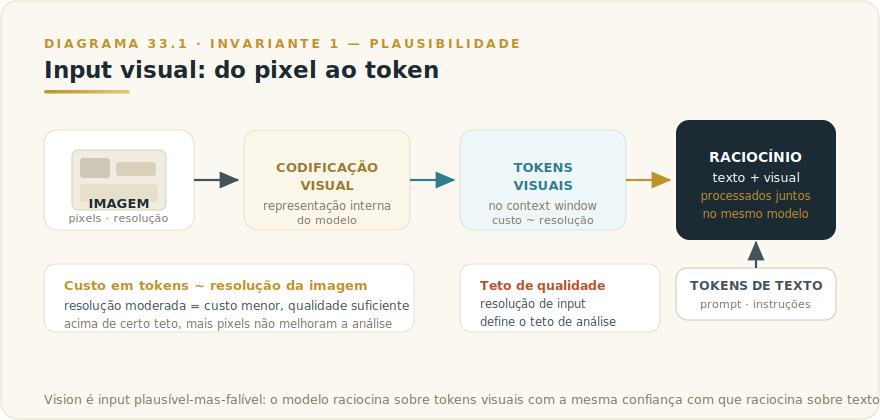
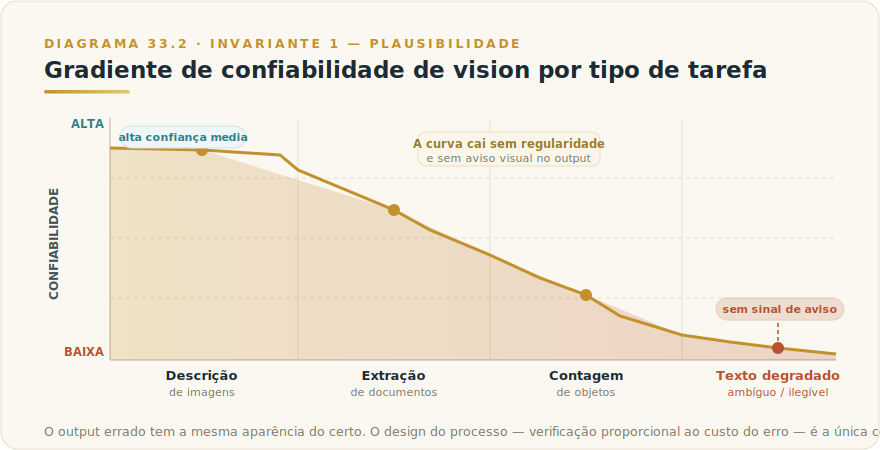

# CAPÍTULO 34
## VISION

---

> *"A imagem nunca mente — o modelo que a descreve é que nem sempre diz a verdade."*

---

> 🧭 **Por que este capítulo é a aplicação do Invariante 1 — Plausibilidade**
>
> *"O modelo entrega o plausível, não o verdadeiro — e os dois coincidem, até a hora em que não."*
>
> Vision é o Invariante 1 em sua forma mais traiçoeira. Um modelo que alucina texto num chat produz uma frase que parece errada quando lida com atenção. Um modelo que alucina um número numa tabela de imagem produz um dígito que parece correto — está no formato certo, na casa decimal certa, e nenhum elemento visual entrega a mentira. O plausível e o verdadeiro se parecem tanto que a divergência não tem sinal de aviso.
>
> Vision não é ferramenta de extração de verdade — é ferramenta de extração de plausibilidade visual. A diferença, em contextos de decisão, pode custar caro. Este capítulo ensina a usar a capacidade de forma que o custo da divergência, quando ocorre, recaia onde pode ser absorvido.

---

## 34.1 — O CONCEITO INTUITIVO

Até recentemente, um modelo de linguagem só entendia texto. Para trabalhar com uma imagem, era preciso descrevê-la em palavras — e a qualidade da análise dependia inteiramente da qualidade da descrição. Isso criava um gargalo óbvio: quem não sabia descrever o que via em termos precisos não aproveitava a capacidade do modelo.

Vision elimina esse gargalo. O modelo aceita a imagem diretamente como input e raciocina sobre ela da mesma forma que raciocina sobre texto: lê, interpreta, compara, extrai, responde. Uma foto de um contrato, uma tela de sistema, um gráfico de barras, uma nota fiscal manuscrita — tudo isso pode ser enviado ao modelo, que devolve análise, transcrição, interpretação ou extração estruturada.

Workflows que antes exigiam digitalização manual, OCR dedicado, ou um humano transcrevendo dados visuais podem ser automatizados ou acelerados por vision.

O detalhe que transforma vision em armadilha: o modelo descreve o que não consegue ler com a mesma fluência com que descreve o que lê corretamente. Um número ilegível numa imagem de baixa resolução não produz "não consigo ler" — produz um número que parece certo. Uma palavra apagada num manuscrito não produz "texto ilegível" — produz uma palavra plausível. Uma célula de tabela ambígua não produz incerteza — produz um valor.

**Vision é input plausível-mas-falível.** Essa frase é o núcleo do capítulo inteiro.

---

## 34.2 — ANALOGIA: O PERITO GRAFOTÉCNICO RÁPIDO DEMAIS

Imagine que você contratou um perito grafotécnico excepcionalmente rápido. Em segundos, ele analisa qualquer documento, transcreve manuscritos, lê tabelas, descreve diagramas e devolve um relatório estruturado. A velocidade é impressionante. A maioria dos laudos está correta.

O problema aparece quando ele encontra uma página manchada, uma assinatura sobreposta, um número mal impresso. Um perito humano diria: "esta parte está ilegível, preciso de uma cópia melhor". O seu perito rápido não faz isso — completa o laudo sem pausa, com o mesmo tom seguro, preenchendo a parte obscura com o que parecia mais provável. O laudo fica completo, bem formatado e plausível — e errado em exatamente o trecho que você mais precisava de acerto.

Você só descobre o erro se conferir o original. A maioria não confere porque o laudo parece perfeito.

Vision funciona assim. O modelo é o perito rápido. A pergunta de governança não é "o perito é bom?" — na média, é muito bom. A pergunta é: **"para esta tarefa específica, o custo de um erro plausível que parece certo é aceitável sem verificação?"**

---

## 34.3 — TÉCNICA: COMO VISION FUNCIONA E ONDE FALHA

### 34.3.1 — Input visual e tokenização

Quando você envia uma imagem ao modelo, ela não chega como pixels brutos. O modelo converte a imagem em tokens visuais e raciocina sobre essa representação da mesma forma que raciocina sobre texto.

**Imagens têm custo em tokens proporcional à resolução.** Para aplicações que processam centenas de imagens por dia, a escolha de resolução importa tanto no custo de API quanto no consumo de janela de contexto. Valores concretos ficam no [Apêndice J — Apêndice Vivo](../04-apendices/L2-APX-J-apendice-vivo.md), porque mudam com frequência.

A resolução afeta a qualidade de análise, mas não linearmente. Em muitas tarefas de extração, resolução moderada é suficiente — e mais econômica. Redimensionar imagens antes de enviar ao modelo é uma otimização válida e frequentemente esquecida.

### 34.3.2 — Casos de uso: onde vision entrega valor

Vision cobre uma gama ampla de tarefas. Algumas são mais confiáveis que outras — esse gradiente importa no design do fluxo.

**Extração de documentos estruturados.** Formulários, faturas, contratos escaneados, notas fiscais — vision identifica campos, extrai valores e devolve JSON estruturado. Funciona bem para documentos limpos e de boa resolução. Maior retorno operacional.

**Leitura de tabelas.** Razoável quando as células são bem delimitadas e o texto é legível. Problemas aparecem em tabelas densas, com células mescladas, texto diminuto ou baixo contraste — erros de leitura surgem sem sinal visível.

**Análise de gráficos e visualizações.** Vision descreve gráficos de barras, linhas, pizza, scatter plots; identifica tendências, compara categorias, lê rótulos visíveis. Valores exatos em gráficos sem rótulos numéricos explícitos são estimados, não medidos — trate como tal.

**OCR de manuscritos.** Vision supera o OCR clássico porque entende contexto: um manuscrito médico com abreviações e termos técnicos é mais bem lido do que por OCR simples. Mas manuscritos ambíguos geram transcrições plausíveis que podem estar erradas.

**Descrição de imagens.** Fotos, ilustrações, capturas de tela — vision faz isso com alta qualidade para acessibilidade, catalogação ou documentação.

**Diagramas e esquemas técnicos.** Diagramas de fluxo, arquiteturas de sistema, plantas baixas, esquemas elétricos simples. Detalhes finos (valores em componentes, números de identificação) devem ser verificados.

**Interpretação de telas (screenshots).** Vision lê interfaces gráficas, identifica botões, menus e estados. É o input visual que alimenta Computer Use — tema tratado no capítulo que cobre essa capacidade.

### 34.3.3 — As limitações reais e perigosas

Estas não são limitações menores: são falhas com perfil de risco específico que precisam de contramedida deliberada no design do workflow.

**Alucinação de texto em imagens.** A limitação mais perigosa. Quando o modelo encontra texto degradado, sobreposto, muito pequeno ou em fonte incomum, completa o que parece plausível — não o que está legível. O resultado é texto transcrito com aparência de fidelidade que pode diferir do original. Em contextos onde o texto importa (valores, nomes, CPFs, datas), este é o ponto de falha crítico.

**Erros em números de tabelas.** Tabelas densas são ambiente fértil para erro de leitura. O modelo pode transpor dígitos, ler um 6 como 8, misturar a linha de uma célula com a adjacente. O erro é difícil de detectar porque a célula errada tem o mesmo formato das corretas.

**Contagem imprecisa.** Contar objetos — pessoas, itens, unidades — é confiável até quantidades pequenas. Para contagens maiores ou objetos sobrepostos, a precisão cai e a estimativa parecerá tão segura quanto a contagem exata. Não há sinal de aviso.

**Sensibilidade a resolução e qualidade.** Imagens de baixa resolução, com ruído ou compressão excessiva degradam a análise — mas o modelo nem sempre informa isso. A saída de uma imagem ruim pode ter a mesma estrutura de uma imagem boa. O operador precisa inspecionar a qualidade do input antes de confiar no output.

**Leitura de texto muito pequeno.** Rodapés, notas de contrato, texto de aviso — se couber em poucos pixels, vision pode errar na transcrição mesmo com imagem de boa qualidade.

**Texto espelhado ou rotacionado.** Vision lida razoavelmente com pequenas rotações, mas texto espelhado ou invertido pode produzir leitura errada.

---

## 34.4 — DECISÃO: VISION VS FERRAMENTA ESPECIALIZADA E PROTOCOLO DE VERIFICAÇÃO

A pergunta não é "vision consegue fazer X?" — na maioria dos casos, consegue. A pergunta é: **"para este caso de uso, com este custo de erro, a confiabilidade de vision é suficiente — ou preciso de verificação, ferramenta dedicada, ou as duas?"**

### Quando vision é suficiente sem verificação especial

- **Descrição e resumo de imagens** onde um erro de detalhe tem baixo custo (catalogação exploratória, acessibilidade não-crítica, triagem inicial).
- **Extração de documentos com estrutura clara, boa resolução e onde o resultado passa por revisão humana antes de agir**.
- **Leitura de gráficos para tendências gerais**, sem dependência de valores exatos.
- **Análise de diagramas de arquitetura** para documentação, não para execução de infra.

### Quando vision precisa de verificação humana explícita

- Qualquer extração onde um número, nome ou código vai alimentar uma decisão — financeira, jurídica, clínica, operacional de alto impacto.
- Transcrição de manuscritos quando o texto transcrito vai ser assinado, arquivado ou usado como fonte primária.
- Leitura de tabelas densas com mais de uma dezena de colunas ou com células mescladas.
- Qualquer extração de imagem de baixa resolução ou qualidade duvidosa.
- Contagens onde o valor exato importa.

### Quando OCR dedicado ou ferramenta especializada é a escolha certa

- **Alto volume com precisão obrigatória sem revisão humana por item.** OCR dedicado pode ser auditado com métricas de acurácia contra ground truth. Vision não tem esse SLA por padrão.
- **Fluxo de produção onde o custo de erro por item é irreversível.** Um sistema de processamento de notas fiscais em lote que alimenta contabilidade não pode ter erro plausível-silencioso. Precisa de acurácia mensurável, com gate de confiança por extração.
- **Documentos com padrão fixo em escala industrial.** Formulários com layout padronizado (boletos, DANFE, documentos oficiais) têm ferramentas verticais calibradas para aquele layout exato, com taxas de acurácia documentadas.

| Situação | Abordagem recomendada |
|----------|----------------------|
| Triagem visual, descrição, análise exploratória | Vision direta — baixo risco de erro consequente |
| Extração de documentos com revisão humana pós-extração | Vision + protocolo de verificação |
| Transcrição de valores críticos em lote sem revisão por item | OCR dedicado / ferramenta especializada |
| Extração de campo específico em formulário padronizado e em escala | Ferramenta vertical com SLA de acurácia documentado |
| Screenshots para leitura de interface (Computer Use) | Vision integrada ao loop agêntico — verificar ação antes de confirmar |
| Extração para indexação RAG | Vision com citação de posição + revisão amostral (ver Capítulo 28) |

### Como desenhar o prompt de extração para ser auditável

Este é o ponto onde o design do prompt muda o perfil de risco da extração. Três práticas estruturais:

**1. Peça citação de posição.** Em vez de "extraia os valores desta tabela", use: "extraia os valores e, para cada um, cite a linha e coluna de origem". Isso cria trilha de auditabilidade — o revisor pode ir ao campo específico da imagem original para conferir.

**2. Exija marcação de incerteza.** Instrua o modelo: "se algum campo estiver ilegível, parcialmente visível ou ambíguo, marque como `[VERIFICAR]` em vez de inferir". Isso não elimina a alucinação, mas reduz a frequência ao tornar a incerteza um resultado legítimo.

**3. Separe extração de interpretação.** Dois passes distintos: o primeiro extrai literalmente o que está na imagem; o segundo interpreta o que foi extraído. Misturar os dois transfere a responsabilidade de interpretação para uma camada que não deveria tê-la.

> 💡 **Exemplo de prompt de extração auditável**
>
> *"Analise a imagem desta nota fiscal e extraia os seguintes campos: número da nota, data de emissão, CNPJ do emitente, CNPJ do destinatário, e valor total. Para cada campo, cite a localização na imagem (ex.: 'campo no canto superior direito'). Se qualquer campo estiver ilegível, parcialmente visível, ou se houver mais de uma interpretação possível, marque o campo como `[VERIFICAR]` e descreva a ambiguidade. Não infira valores que não estejam visíveis."*

---

## 34.5 — EXEMPLO MEMORÁVEL: A AUDITORIA DE BOLETOS QUE NÃO FECHAVA

*Cenário ilustrativo brasileiro.* Uma empresa de médio porte em Belo Horizonte comparava dezenas de boletos digitalizados por semana contra o sistema de contas a pagar. O analista extraía manualmente valor, data de vencimento e código de barras de cada boleto, conferia e arquivava.

A empresa implementou vision para automatizar a extração. Os resultados iniciais pareceram excelentes: a maioria dos campos extraída corretamente, o tempo do analista caiu drasticamente.

Três semanas depois, a conciliação começou a não fechar. O time encontrou o padrão: em boletos com qualidade de scanner abaixo do padrão — inclinação, contraste inconsistente, resolução reduzida — o modelo transpunha dígitos no valor. Um boleto de R$ 12.847,60 virava R$ 12.874,60. A diferença era pequena, o formato estava perfeito, nenhuma flag levantada.

O problema não era que vision funcionava mal — era que o design assumia confiabilidade sem medir. A correção: (a) o prompt passou a exigir `[VERIFICAR]` em campos com baixo contraste detectável; (b) uma regra de validação cruzou o dígito verificador do código de barras contra o valor extraído; (c) imagens abaixo de um limiar de contraste foram roteadas para reescaneamento.

Resultado: revisão humana subiu de zero para 8% dos boletos — exatamente os com scan deficiente. Os 92% restantes saíam com confiança documentada. A conciliação voltou a fechar.

A lição é o Invariante 1 num único episódio: vision entrega o plausível; o plausível e o verdadeiro coincidem na maioria dos casos; o design do fluxo precisa isolar os casos onde não coincidem antes que o custo seja pago.

---

## 34.6 — NA PRÁTICA: TRÊS APLICAÇÕES REPLICÁVEIS

Três aplicações ordenadas pelo nível de risco do erro. A forma é *situação → o que fazer → o ponto de julgamento*.

**Aplicação 1 — Triagem e catalogação visual de baixo risco.**
*Situação:* o time precisa classificar um conjunto grande de imagens — fotos de produtos, screenshots de interface, documentos digitalizados — para indexação ou triagem inicial. Erros individuais têm baixo custo. *O que fazer:* use vision com um prompt de descrição estruturada; peça classificação em categorias predefinidas e extração de metadados visíveis; processe em lote. Marcação de incerteza não é necessária para triagem exploratória. *O ponto de julgamento:* revise uma amostra de 5% dos resultados para estimar a taxa de erro real. Se for superior ao que o processo downstream tolera, vá para a aplicação 2.

**Aplicação 2 — Extração de documentos com protocolo de verificação.**
*Situação:* o processo de contas a pagar exige extrair CNPJ, valor e data de vencimento de boletos digitalizados. Um erro impacta conciliação financeira. *O que fazer:* construa o prompt com os três elementos auditáveis da seção 34.4: (a) citação de posição para cada campo extraído; (b) marcação `[VERIFICAR]` em campos de baixo contraste ou resolução insuficiente; (c) regra de validação cruzada independente do modelo — no caso de boleto, cruze o dígito verificador do código de barras contra o valor extraído. Itens marcados ou que falham na validação cruzada vão para fila de revisão humana. *O ponto de julgamento:* que percentual de itens vai para revisão? Se zero, o limiar de incerteza está frouxo demais. Se acima de 30%, a qualidade de scan está abaixo do mínimo operável.

**Aplicação 3 — Extração crítica com OCR dedicado em paralelo.**
*Situação:* o fluxo processa centenas de documentos por dia com valores que alimentam sistemas contábeis ou jurídicos. Custo de erro alto; revisão humana por item inviável em escala. *O que fazer:* use vision para extração semântica e contexto (tipo de documento, campos de linguagem natural, estrutura); use OCR dedicado com SLA de acurácia documentado para os campos críticos (valores, CPF/CNPJ, datas). Compare os dois outputs — quando divergirem, o item vai para revisão humana. Vision para entender; OCR para medir acurácia. *O ponto de julgamento:* a taxa de divergência entre vision e OCR é o indicador de saúde do pipeline. Se sobe, algo mudou — qualidade do scan, tipo de documento, ou comportamento do modelo.

> 🔧 **EXERCÍCIO**
> Pegue um conjunto de dez documentos reais que você ou o time processa hoje (boletos, notas fiscais, contratos, formulários). Use vision com um prompt de extração simples nos dez. Depois, compare os resultados com os valores reais. Registre: quantos campos foram extraídos corretamente, quantos foram transpostos ou errados, e em quais documentos os erros se concentraram (imagens de baixa qualidade? campos pequenos? tabelas densas?). Esse teste revela o perfil de falha específico do seu conjunto — e é a informação que determina qual das três aplicações acima é a certa para o seu caso.

---

## 34.7 — CAMADA VIVA: O QUE PERTENCE AO APÊNDICE J

Informações que mudam com frequência e que não estão no corpo deste capítulo deliberadamente:

- Número exato de tokens por imagem por resolução para cada modelo corrente
- Custo por imagem por tier de modelo
- Limites máximos de imagens por mensagem e por request de API
- Formatos de imagem suportados (JPEG, PNG, GIF, WEBP e seus limites de tamanho)
- Dimensões máximas suportadas por modelo
- Limites de tamanho de arquivo por imagem e por request

Consulte o [Apêndice J — Apêndice Vivo](../04-apendices/L2-APX-J-apendice-vivo.md) para todos esses valores. A fonte primária para confirmação direta é [platform.claude.com/docs/en/build-with-claude/vision](https://platform.claude.com/docs/en/build-with-claude/vision).

O que está no corpo deste capítulo — e que sobrevive a mudanças de versão — é o padrão: **imagem é input plausível-mas-falível, extrair sob verificação, com protocolo de auditabilidade proporcional ao custo do erro**.

---

## 34.8 — LIMITAÇÕES E CUIDADOS

**A alucinação visual não tem sinal de aviso.** Numa resposta de texto, um erro factual frequentemente destoa do contexto ou pode ser verificado rapidamente. Um número errado numa célula de tabela extraída de imagem tem o mesmo formato de um número certo. A única contramedida é o design do processo, não a inspeção visual do output.

**Qualidade de input é variável não controlável pelo prompt.** Você pode instruir o modelo a marcar incertezas e citar posições — mas se a imagem for de baixa qualidade, a instrução tem limite. O controle de qualidade de input (resolução mínima, contraste, inclinação) é responsabilidade do pipeline, não do prompt.

**Vision não é OCR determinístico.** OCR clássico é determinístico e auditável: dado o mesmo input, devolve o mesmo output. Vision é probabilístico: o mesmo input pode, em execuções diferentes, produzir outputs ligeiramente diferentes. Para fluxos em lote, essa variabilidade precisa ser considerada na arquitetura de validação.

**Tabelas densas exigem atenção especial.** O risco de erro é desproporcional em tabelas com muitas linhas, células mescladas ou texto pequeno. Vision como extrator direto sem verificação é uma aposta alta nesses casos.

**Imagem grande ≠ melhor análise.** Acima de uma resolução efetiva, mais pixels não melhoram a extração — apenas aumentam o custo em tokens. Encontrar a resolução efetiva para a tarefa é otimização de engenharia válida.

**Confidencialidade de imagens.** Imagens enviadas via API são processadas pelos servidores da Anthropic sob a política de privacidade vigente. Documentos com dados pessoais sensíveis (saúde, financeiros, jurídicos) ou material sob NDA precisam passar por avaliação de compliance antes de entrar num pipeline de vision em produção.

---

## 34.9 — CONEXÕES COM OUTROS CAPÍTULOS

- 🔗 **O Invariante que rege este capítulo** → [Manifesto — Invariante 1 — Plausibilidade](../../Livro-1-Os-Invariantes/01-manifesto/L1-C00M-manifesto-invariantes.md)
- 🔗 **RAG: extração para indexar — o output de vision alimenta o pipeline de ingestão** → [Capítulo 28 — RAG](L2-C28-rag.md)
- 🔗 **Computer Use: vision lendo telas para ação agêntica** → Capítulo Computer Use
- 🔗 **MCP e arquiteturas corporativas: vision como fonte de dados em pipelines integrados** → [Capítulo 29 — Claude + MCP](L2-C29-claude-mcp.md)
- 🔗 **Modelos e suas capacidades multimodais** → [Capítulo 4 — Todos os Modelos Claude](L2-C04-modelos-claude.md)
- 🔗 **Números voláteis (custo por imagem, limites de resolução, formatos suportados)** → [Apêndice J — Apêndice Vivo](../04-apendices/L2-APX-J-apendice-vivo.md)

---

## 34.10 — RESUMO EXECUTIVO

| Conceito | Síntese |
|----------|---------|
| **O que é vision** | Capacidade de aceitar imagens como input e raciocinar sobre elas — extração, descrição, análise, interpretação |
| **Invariante regente** | 1 — Plausibilidade: o modelo descreve o que parece plausível, não necessariamente o que está na imagem |
| **Casos de uso principais** | Extração de documentos, leitura de tabelas, análise de gráficos, OCR de manuscritos, interpretação de telas, diagramas |
| **Custo em tokens** | Proporcional à resolução — valores correntes no Apêndice J |
| **A falha mais perigosa** | Alucinação de texto e números sem sinal de aviso — o output errado tem a mesma aparência do certo |
| **Quando usar sem verificação especial** | Descrição, análise exploratória, extração com revisão humana pré-ação |
| **Quando usar com verificação** | Qualquer extração que alimenta decisão consequente — financeira, jurídica, clínica, operacional |
| **Quando preferir ferramenta especializada** | Alto volume, sem revisão humana por item, custo de erro irreversível — OCR dedicado com SLA de acurácia |
| **Protocolo de extração auditável** | Citar posição, exigir marcação de incerteza (`[VERIFICAR]`), separar extração de interpretação |
| **O padrão durável** | Imagem é input plausível-mas-falível; extrair sob verificação proporcional ao custo do erro |

---

## 34.11 — VALIDAÇÃO UAU

| # | Critério | Você consegue? |
|---|----------|----------------|
| 1 | **Clareza** — Explicar em 60 segundos por que vision alucina sem aviso, usando a analogia do perito grafotécnico | ☐ |
| 2 | **Profundidade** — Nomear as quatro falhas mais perigosas de vision e dizer por que nenhuma delas produz sinal visual de erro | ☐ |
| 3 | **Decisão** — Escolher corretamente entre vision direta, vision com verificação, e OCR dedicado para três casos de uso do seu contexto | ☐ |
| 4 | **Aplicação** — Escrever um prompt de extração auditável com citação de posição e marcação de incerteza para um documento que você usa | ☐ |
| 5 | **Governança** — Definir, para um fluxo de produção com vision, qual o threshold de revisão humana e qual a regra de validação cruzada | ☐ |

🔗 **Próximo capítulo:** [Capítulo 35 — Evaluations](L2-C35-evaluations.md)

---

> *"A imagem nunca mente — o modelo que a descreve é que nem sempre diz a verdade. O design do processo é o único lugar onde você pode interceptar a diferença antes que ela vire decisão."*
