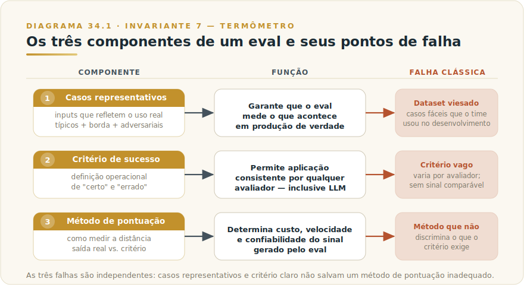
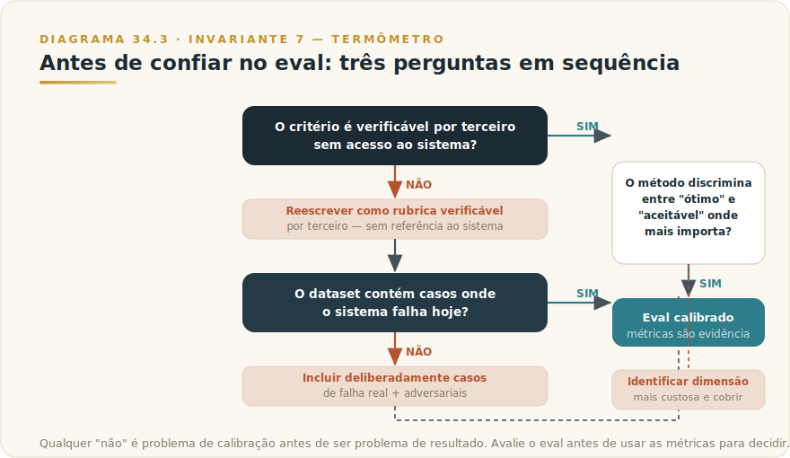

# CAPÍTULO 35
## EVALUATIONS

---

> *"Sem medição, toda mudança de prompt é fé. Sem critério, toda avaliação é gosto. Sem regressão, toda melhoria é sorte. Eval é o que separa engenharia de adivinhação sofisticada."*

---

> 🧭 **Por que este capítulo é a aplicação do Invariante 7 — Termômetro**
>
> O Invariante 7 afirma que sem medição você não opera: adivinha. Modelos de linguagem não têm comportamento fixo — a mesma entrada em condições ligeiramente diferentes pode produzir saídas distintas, e qualquer mudança de prompt, modelo ou pipeline pode degradar silenciosamente algo que funcionava hoje. Eval é o termômetro que converte "parece que melhorou" em "melhorou 12 pontos em precisão e não regrediu em cobertura". Sem ele, qualquer afirmação sobre desempenho é anedota, não evidência.
>
> O framework estrutural de hierarquias de eval está em **[L1-F8 — Pirâmide da Avaliação](../../Livro-1-Os-Invariantes/03-frameworks/L1-F8-eval-piramide.md)** (Livro 1). Este capítulo é a aplicação concreta desse framework no contexto de sistemas Claude: os tipos de critério, o método de construir golden sets honestos, a decisão sobre quando confiar no LLM-as-judge, e os sinais de que seu eval está medindo o que é fácil em vez do que importa.

---

## 35.1 — O CONCEITO INTUITIVO

Toda organização que coloca um sistema de IA em produção enfrenta, cedo ou tarde, a mesma questão: como saber se está funcionando? A resposta óbvia — "testamos antes de subir" — esconde um problema estrutural. Testar uma vez, antes do deploy, diz como o sistema se comportou em uma janela de tempo com um conjunto de casos. Não diz nada sobre o que vai acontecer quando o prompt mudar, quando o modelo for atualizado pelo fornecedor, quando o volume de dados reais começar a divergir dos casos de teste, ou quando uma regressão silenciosa aparecer três semanas depois de uma mudança aparentemente inócua.

O problema é que sistemas probabilísticos não têm contrato fixo. Um software determinístico — um compilador, uma função matemática, um parser — se você rodar a mesma entrada amanhã, recebe a mesma saída. Modelos de linguagem não têm essa garantia. Temperatura, versão de modelo, formulação ligeiramente diferente do prompt, contexto diferente na janela — tudo isso pode mudar o resultado. Isso não é um defeito: é a natureza de um sistema que generaliza. Mas significa que qualidade, nesse contexto, não é uma propriedade que você estabelece uma vez — é uma propriedade que você mede continuamente.

Eval torna possível essa medição contínua. Um eval bem construído responde a perguntas específicas: meu sistema classifica sentimento corretamente em pelo menos X% dos casos? A resposta gerada por RAG é fiel ao documento recuperado? Quando o usuário fornece um número incorreto, o sistema aponta o erro em vez de calcular sobre ele? Cada pergunta tem resposta verificável — e verificar sistematicamente é o que distingue operação de esperança.

A Anthropic é direta: construir uma aplicação bem-sucedida baseada em LLM começa por definir critérios de sucesso claros e depois desenhar avaliações para medir desempenho contra eles. Esse ciclo — critério, medição, iteração — é o núcleo da engenharia de prompt. O que a maioria das equipes faz é o inverso: iteração sem critério explícito, avaliação por sensação, e surpresa quando o sistema regride num caso que "sempre funcionou".

---

## 35.2 — ANALOGIA: O TERMÔMETRO DO PROCESSO INDUSTRIAL

Uma refinaria processa temperatura, pressão e composição química em centenas de pontos. Os operadores não decidem se o processo está "bom" pela fumaça ou pelo cheiro do produto. Cada ponto crítico tem um sensor, e o painel mostra em tempo real o que está dentro do envelope e o que está saindo.

O termômetro não torna o processo mais inteligente — o operador continua decidindo o que fazer quando a temperatura sobe. Mas sem o termômetro, ele não sabe que a temperatura subiu até o produto estar fora da especificação ou a planta em situação de risco. A intervenção que teria custado uma hora de ajuste vira uma parada completa.

Eval funciona assim. O eval é o painel que diz, antes que o problema chegue ao usuário final: isso saiu do envelope. A diferença entre uma equipe que descobre regressões por reclamação de usuário e uma que as descobre no CI antes do merge é a existência de termômetros confiáveis.

A propriedade mais importante de um termômetro não é precisão absoluta: é consistência. Um que sempre mede dois graus acima é utilizável — você aprende o offset e opera. Um que ora mede certo, ora mede aleatoriamente, é inútil e perigoso. O mesmo vale para evals: consistência do método importa mais do que perfeição do critério.

---

## 35.3 — A TÉCNICA: CONSTRUINDO EVALS QUE MEDEM O QUE IMPORTA

### 35.3.1 — Anatomia de um eval

Todo eval tem três componentes que precisam estar explícitos antes de escrever uma linha de código:

**Conjunto de casos representativos.** Uma coleção de inputs que reflete a distribuição real de uso do sistema — não os casos fáceis usados durante o desenvolvimento, não casos hipotéticos construídos a partir do que você esperava que o usuário enviaria, mas casos que capturam o que de fato chega ao sistema. Inclui casos típicos (alta frequência, relativamente fáceis), de borda (baixa frequência, mas onde falha é custosa) e adversariais (inputs que testam comportamentos que o sistema nunca deve ter). Não é estático: precisa ser revisado periodicamente à medida que o perfil de uso real evolui.

**Critério de sucesso explícito.** A definição operacional de "certo" e "errado" para aquele conjunto. Critérios vagos — "a resposta deve ser boa", "o tom deve ser adequado" — produzem avaliações inconsistentes que não geram sinal comparável. Critérios operacionais — "o campo de CNPJ deve ser validado antes do cálculo", "a resposta não deve conter o nome do cliente no terceiro parágrafo", "o score de satisfação atribuído deve coincidir com o score humano em pelo menos 80% dos casos" — podem ser aplicados consistentemente por diferentes avaliadores, incluindo LLMs.

**Método de pontuação.** Como medir a distância entre a saída real do sistema e o critério de sucesso. Separável do critério: o mesmo critério pode ser verificado por exact match em campos estruturados ou por LLM-as-judge em texto livre. A escolha tem consequências diretas em custo, velocidade, cobertura e confiabilidade do eval.

A Anthropic estabelece três princípios de design de eval: ser específico para a tarefa (refletir distribuição real de uso, incluindo edge cases), automatizar quando possível (estruturar questões para pontuação automática), e priorizar volume sobre qualidade individual de cada caso. Esse terceiro princípio é contraintuitivo mas robusto: a variância de avaliação humana é alta o suficiente para que cinquenta casos com LLM-judge calibrado geralmente oferecem melhor discriminação estatística do que dez casos revisados por especialista.

### 35.3.2 — Tipos de critério: da determinística ao julgamento

Existem três grandes famílias de método de pontuação, e a decisão sobre qual usar não é de gosto — é de adequação ao critério de sucesso.

**Exact match e regras programáticas.** Para saídas com resposta correta verificável — campo estruturado com valor esperado, formato que deve seguir um schema, trecho que deve ou não aparecer na saída — comparação determinística é o método correto. É o mais barato, o mais rápido, o mais confiável e o mais escalável. A Anthropic recomenda essa camada como a primeira a implementar: `output == golden_answer` para exact match, `key_phrase in output` para string match, schema validation para campos estruturados. Cobre regressões grosseiras — formato quebrado, campo faltante, número ausente — com custo próximo de zero por execução.

O limite do método determinístico é claro: para texto livre onde há múltiplas formulações corretas, ou para dimensões de qualidade que não são redutíveis a regras, exact match não discrimina.

**LLM-as-judge.** Para dimensões de qualidade semântica — coerência, relevância, fidelidade ao documento fonte, tom adequado, completude da análise — o método prático em escala é usar um modelo de linguagem como avaliador. O princípio é o mesmo que uma rubrica de prova discursiva: você define critérios explícitos e o avaliador os aplica com consistência.

A Anthropic estabelece três diretrizes para LLM-as-judge eficaz. Primeiro, rubricas detalhadas e claras: em vez de "avalie se a resposta é boa", "a resposta deve sempre mencionar o nome do produto no primeiro parágrafo — se não mencionar, classifique como 'incorreto'". Segundo, output empírico ou específico: instruir o modelo a produzir 'correto' ou 'incorreto', ou uma escala de 1 a 5, não uma avaliação qualitativa aberta difícil de agregar. Terceiro, encorajar raciocínio antes do veredito: pedir que o judge pense passo a passo melhora a qualidade em tarefas de julgamento complexo — o raciocínio pode ser descartado após o veredito.

**Humano no loop.** A camada mais cara e mais precisa. Necessária onde LLM-as-judge não captura nuances do domínio — casos clínicos que exigem raciocínio médico, textos jurídicos com implicações de interpretação, análises financeiras com contexto de mercado local. Conforme o L1-F8, cobre tipicamente 5% a 15% da carga, por amostra, e serve como calibração periódica do judge: se a correlação com o especialista humano cair abaixo de um limiar acordado, o judge precisa ser recalibrado.

### 35.3.3 — Eval offline vs. eval online

Esses dois modos medem coisas diferentes e são complementares — não substitutos.

**Eval offline** (dataset golden, eval de bancada) opera em conjunto fixo de casos controlados, fora do fluxo de produção. Você roda o sistema contra o dataset, computa as métricas e compara com o baseline da versão anterior. Esse é o gate que protege a produção — antes de qualquer mudança de prompt, modelo ou pipeline ser promovida, ela passa pelo eval offline. É também o único modo que permite testar casos adversariais de forma sistemática: você não espera que um usuário tente injetar prompts no sistema de produção para testar se ele resiste.

A propriedade fundamental é a reprodutibilidade: o mesmo dataset, o mesmo critério, execuções diferentes do sistema devem produzir métricas comparáveis. Isso requer dataset golden versionado como código, método de pontuação determinístico ou com variância controlada, e política de bloqueio definida antes de precisar dela.

**Eval online** opera sobre o tráfego real de produção — amostragem de interações para avaliação humana, LLM-as-judge aplicado ao fluxo ao vivo, ou métricas de negócio como proxies de qualidade (taxa de escalação para suporte humano, taxa de rejeição de resposta pelo usuário, tempo para conclusão de tarefa). Captura o que eval offline sistematicamente perde: a distribuição real de inputs que difere do dataset golden, sazonalidades, mudanças de comportamento do usuário, efeitos de longo prazo que só aparecem em escala.

A tensão é inevitável: offline é controlado mas não reflete produção perfeitamente; online é real mas ruidoso e difícil de isolar causalidade. A resposta não é escolher um — é instrumentar os dois. Offline para gate de release; online para detecção de drift e alimentação de novos casos ao dataset golden.

### 35.3.4 — A pirâmide de evals e a hierarquia de cobertura

O L1-F8 define a hierarquia completa — a decisão de como montar a pirâmide de cobertura por camada está lá, com os anti-padrões e o exemplo completo. O que este capítulo acrescenta é a aplicação prática ao contexto de sistemas Claude:

A **base determinística** é a primeira camada a implementar, sempre. Schema validation, exact match em campos críticos, verificação de presença de elementos obrigatórios. Cobertura de 100% das chamadas, custo próximo de zero, implementação em dias. Detecta regressões grosseiras antes que cheguem ao usuário. Qualquer sistema Claude em produção sem essa camada está operando sem termômetro de emergência.

A **camada de golden set com LLM-as-judge** é onde a maioria dos times precisa investir mais e investe menos. Requer dataset golden honesto (seção 35.3.5), rubrica calibrada contra humano, e judge em cobertura parcial da carga. Captura regressão de qualidade semântica que a base determinística não vê.

O **topo com revisão humana especialista** fecha o ciclo de calibração. Sem ele, o LLM-as-judge pode derivar sistematicamente sem que você perceba — continua pontuando consistentemente, mas contra um critério que divergiu do critério humano real.

A **faixa transversal adversarial** mede comportamentos que as camadas verticais não cobrem por design: resistência a jailbreak, ausência de sycophancy em análise de risco, honestidade de citação, calibração de incerteza. A política de bloqueio aqui é a mais rígida: qualquer falha em adversarial de segurança bloqueia merge.

### 35.3.5 — Como construir um golden set honesto

Um golden set desonesto — e a maioria é, mesmo sem intenção — é o anti-padrão mais caro. Ele dá sensação de rigor sem o rigor: as métricas ficam altas, e o sistema falha em produção em casos que "nunca apareceram nos testes".

Quatro fontes de desonestidade que valem nomear:

**Viés de seleção otimista.** O dataset foi construído com casos que o sistema resolve bem — os mesmos usados para iterar o prompt. O eval mede quão bem o sistema aprendeu esses casos específicos, não quão bem generaliza para uso real.

**Gabarito fabricado.** A resposta esperada foi escrita por quem tinha em mente o que o sistema deveria produzir, não o que seria correto para um usuário real. O eval mede proximidade ao gabarito; o gabarito mede proximidade à intuição de quem construiu o sistema.

**Falta de casos de borda e adversariais.** O dataset cobre o fluxo feliz — inputs bem formados, contexto claro. Os casos onde o sistema mais provavelmente vai falhar — inputs malformados, contexto conflitante, tentativas de contornar restrições — não estão representados.

**Staleness sem revisão.** O dataset foi construído há seis meses e a distribuição de uso real mudou, mas não foi atualizado. As métricas continuam altas; a qualidade em produção caiu.

A receita para um golden set honesto tem quatro passos: (1) construir o dataset a partir de logs de produção reais, não de casos hipotéticos — se o sistema ainda não está em produção, use casos coletados com usuários, não inventados pelo time; (2) incluir explicitamente casos de borda e adversariais de incidentes anteriores ou de literatura de segurança; (3) escrever o gabarito com critério explícito e, sempre que possível, ter revisão de alguém que não construiu o sistema; (4) versionar o dataset e definir cadência de revisão trimestral, alimentada por casos de produção.

O L1-F8 recomenda como baseline inicial: 30 a 50 casos com gabarito, cobrindo os tipos de tarefa com maior volume, os subgrupos onde regressão é mais custosa, edge cases de incidentes anteriores, e casos onde o modelo falha hoje. Esse último ponto é contraintuitivo: incluir deliberadamente casos de falha garante que o eval detecte melhoras reais, não apenas mantém o nível em casos já resolvidos.

### 35.3.6 — Regressão e CI de prompts

Eval offline conecta com o processo de desenvolvimento através do CI de prompts — integração contínua aplicada a mudanças de prompt, modelo e pipeline. O princípio é o mesmo do CI de código: antes de qualquer mudança ser promovida para produção, ela passa por um gate automatizado que verifica se as métricas de qualidade mantiveram ou melhoraram o baseline.

A implementação prática requer três componentes decididos antes do primeiro merge: o dataset golden versionado, as métricas e seus baselines correntes, e a política de bloqueio — qual delta de regressão bloqueia merge, qual gera alerta mas deixa passar, qual é irrelevante. A política não pode ser decidida no momento do incidente; precisa estar documentada antes de ser necessária.

Detalhe operacional que muitas equipes aprendem da forma difícil: a temperatura do modelo afeta a variância do eval. Evals com temperatura zero são reprodutíveis; evals com temperatura alta têm variância que pode fazer uma mudança inócua parecer regressão. Para gates de CI, temperatura zero ou ensemble de múltiplas rodadas é o padrão.

---

## 35.4 — CRITÉRIO DE DECISÃO: TRÊS PERGUNTAS ANTES DE CONFIAR NO EVAL

A questão mais importante deste capítulo não é como construir evals — é como evitar confiar em evals que medem o que é fácil em vez do que importa.

| Pergunta | O que indica | Ação se "não" |
|----------|-------------|----------------|
| O critério de sucesso pode ser verificado por alguém que não construiu o sistema? | Critério objetivo vs. critério dependente de contexto interno | Reescrever o critério como rubrica verificável por terceiro |
| O dataset golden contém casos onde o sistema falha hoje? | Dataset honesto vs. dataset otimista | Incluir deliberadamente casos de falha real e adversariais |
| O método de pontuação discrimina entre "ótimo" e "aceitável" na dimensão que mais importa para o negócio? | Eval que mede o que importa vs. eval que mede o que é fácil | Identificar a dimensão de qualidade mais custosa quando falha e checar se ela tem cobertura |
| O LLM-judge foi calibrado contra humano especialista em pelo menos 30 casos? | Judge confiável vs. judge com viés não mapeado | Calibrar antes de confiar nas métricas para decisão |
| As métricas têm tendência estável ao longo do tempo, sem drift inexplicável? | Eval estável vs. eval com problema de implementação | Investigar variância antes de interpretar mudança de métricas como sinal de qualidade |

**Quando LLM-as-judge é confiável.** O judge é confiável quando a rubrica é suficientemente explícita para que o próprio judge possa explicar por que deu aquela nota; quando a correlação com avaliadores humanos foi verificada em pelo menos 30 casos do domínio específico (não de domínio genérico); quando o judge é um modelo diferente do modelo gerador (evita viés de auto-confirmação); e quando o output é categórico ou ordinal — não uma narrativa aberta.

**Quando LLM-as-judge é perigoso.** O judge é perigoso quando a rubrica é vaga o suficiente para que ele preencha com critérios próprios não declarados; quando não foi calibrado no domínio específico (um judge calibrado em textos de marketing pode ter comportamento completamente diferente em análises técnicas); quando o judge é o mesmo modelo que gerou a saída avaliada (auto-validação inflada); e quando é usado para avaliar dimensões que o próprio judge modela mal — como raciocínio matemático formal, nuances jurídicas locais, ou precisão de citação de fontes que não tem acesso para verificar.

**Sinais de eval enganoso (Goodhart).** A Lei de Goodhart afirma que quando uma medida se torna um alvo, ela deixa de ser uma boa medida. Aplicada a evals de IA, os sintomas são reconhecíveis: o time itera o prompt especificamente nos casos do eval, as métricas sobem consistentemente mas o comportamento em produção não melhora, os casos do eval começam a vazar para o processo de desenvolvimento, e o eval passou a ser visto como obstáculo a vencer, não como termômetro a consultar. A solução estrutural: separar o conjunto de desenvolvimento do conjunto de eval — o time não deve ter acesso aos casos exatos do dataset golden durante a iteração de prompt.

---

## 35.5 — EXEMPLO MEMORÁVEL: TRIAGEM DE LAUDOS MÉDICOS EM HOSPITAL DE MÉDIO PORTE

*Cenário ilustrativo brasileiro.* Um hospital de médio porte no interior de São Paulo implantou um sistema Claude para triagem preliminar de laudos de imagem — lia o laudo textual, classificava urgência (emergência, prioritário, eletivo) e extraía os achados principais para o plantonista. Meta: reduzir em 60% o tempo de revisão.

**O problema com o primeiro eval.** A equipe de TI construiu o eval com 40 casos: laudos que eles mesmos escreveram durante o desenvolvimento, todos bem formatados, achados claros, sem ambiguidade. O sistema atingiu 94% de acurácia. Em produção, a acurácia observada pelos plantonistas estava próxima de 70% — os erros concentrados nos laudos atípicos: estilo telegráfico, abreviações locais não padrão, múltiplas condições com urgências diferentes.

**O redesenho.** A equipe reconstruiu o dataset a partir de laudos reais anonimizados dos últimos seis meses, com três critérios: maior volume por tipo de exame, maior custo quando a triagem errava (AVC e IAM), e casos onde o plantonista havia discordado do sistema. O novo dataset tinha 120 casos com distribuição real e gabarito validado por três plantonistas independentes (correlação: 0,88).

O método de pontuação foi redesenhado com critério binário para a dimensão mais crítica — "a classificação de urgência é igual ou mais conservadora que o gabarito humano?" — mais LLM-as-judge para a extração de achados. O judge foi calibrado contra os plantonistas em 30 casos, atingindo correlação de 0,81. Política de bloqueio: qualquer regressão na dimensão binária bloqueia deploy, independentemente de melhora em outras métricas.

**Resultado.** Dois ciclos de iteração guiados pelo novo eval: 91% na dimensão de urgência, 85% na extração de achados, tempo de revisão do plantonista caiu 55%. Mais importante: o eval passou a detectar regressões em 48 horas sempre que uma atualização de modelo introduzia desvio — semanas antes de qualquer plantonista reclamar.

---

## 35.6 — NA PRÁTICA: TRÊS APLICAÇÕES REPLICÁVEIS

Três aplicações progressivas em complexidade. A forma é *situação → o que fazer → o ponto de julgamento*.

**Aplicação 1 — Base determinística para qualquer sistema em produção.**
*Situação:* o time colocou um sistema Claude em produção sem eval formal. Mudanças de prompt são testadas "na sensação". *O que fazer:* identifique os três comportamentos obrigatórios — o que o sistema sempre deve fazer e nunca deve fazer. Codifique como verificações determinísticas: presença de elemento obrigatório no output (`campo_cnpj` em análise de contrato), ausência de padrão proibido (nome do cliente no terceiro parágrafo), conformidade de formato (JSON válido). Rode em 100% das chamadas em produção. *O ponto de julgamento:* se qualquer verificação falha mais de 1% das vezes, o problema é do sistema, não do eval. Corrija o sistema antes de adicionar camadas mais sofisticadas.

**Aplicação 2 — Golden set honesto com LLM-as-judge calibrado.**
*Situação:* a base determinística está rodando, mas o time quer saber se a qualidade semântica está estável após mudanças de prompt. *O que fazer:* (a) colete 30 a 50 casos de logs de produção reais — não hipotéticos; (b) inclua deliberadamente os casos onde o sistema falhou (incidentes, feedbacks negativos, edge cases); (c) escreva o gabarito com critério verificável por terceiro. Para o judge: rubrica com dois a três critérios objetivos, instruir a raciocinar antes do veredito, usar modelo diferente do gerador, calibrar contra avaliador humano em pelo menos 20 casos. *O ponto de julgamento:* correlação do judge com o humano acima de 0,75 no domínio específico. Se não atingir, a rubrica está vaga — reescreva até o judge conseguir explicar por que deu aquela nota.

**Aplicação 3 — CI de prompt com política de bloqueio.**
*Situação:* o time itera prompts com frequência e quer um gate automático que bloqueie mudanças que regridem qualidade. *O que fazer:* versione o golden set como código. Configure o CI para rodar a base determinística e o LLM-as-judge a cada mudança de prompt candidato. Defina a política de bloqueio antes de precisar dela: qualquer regressão na dimensão mais crítica bloqueia; regressões de 3 a 5 pontos em dimensões secundárias geram alerta mas não bloqueiam. Documente quem pode aprovar exceções. *O ponto de julgamento:* a política deve estar documentada e acordada antes da primeira vez que precisar bloquear um merge. Política decidida no momento do incidente não é política — é discussão sob pressão.

> 🔧 **EXERCÍCIO**
> Escolha o sistema Claude que você opera ou planeja operar. Escreva em uma frase o critério de sucesso mais importante: o que o sistema deve sempre fazer ou nunca fazer? Agora codifique esse critério como uma verificação programática — uma função que recebe o output e retorna verdadeiro ou falso. Rode essa função em dez casos reais. Se a função retorna falso em mais de um dos dez, o problema está no sistema, não no eval. Se retorna verdadeiro em todos os dez, você tem o embrião da base determinística do seu eval. O passo seguinte é expandir para 50 casos e adicionar as dimensões semânticas que a verificação programática não cobre.

---

## 35.7 — CAMADA VIVA

Nomes de ferramentas de eval, versões de SDKs, preços de APIs de LLM-as-judge e benchmarks correntes de correlação juiz-humano ficam no [Apêndice J — Apêndice Vivo](../04-apendices/L2-APX-J-apendice-vivo.md). O método — anatomia do eval, hierarquia de métodos, golden set honesto, política de bloqueio — é estrutural e sobrevive a atualizações de ferramentas. O que muda são as ferramentas, não o método.

---

## 35.8 — LIMITAÇÕES E CONEXÕES

**Limitação 1: Goodhart institucionalizado.** Quando o eval é visível para o time que itera o prompt, a pressão legítima para melhorar as métricas pode produzir overfitting ao eval. A solução estrutural é separar o dataset de desenvolvimento do dataset de gate — o que exige disciplina organizacional que vai além da técnica.

**Limitação 2: Viés do judge não mapeado.** LLM-as-judge tem vieses sistemáticos conhecidos: preferência por respostas mais longas, preferência por linguagem assertiva, sycophancy quando o input contém a resposta esperada, e viés de posição em comparações lado a lado. Nenhuma calibração elimina esses vieses inteiramente — ela os mapeia e os controla. Um judge não calibrado os amplifica sem que o time perceba.

**Limitação 3: O eval mede o sistema em uma janela de tempo.** Um golden set construído em março pode não representar bem a distribuição de uso de setembro. Sem revisão periódica do dataset e alimentação de casos novos vindos de produção, o eval envelhece enquanto o sistema continua sendo medido contra ele.

**Conexões.**

- **Capítulo 25 — Engenharia de Prompt Avançada:** eval é o que fecha o ciclo de iteração de prompt. Sem eval, você itera por intuição; com eval, por evidência. O critério de aceitação que o Capítulo 25 exige que você defina antes de escrever o prompt é a especificação do eval — os dois capítulos são o mesmo processo visto de lados opostos.

- **Capítulo 28 — RAG:** sistemas RAG têm dois pontos de falha distintos — a recuperação e a geração — e eles precisam ser avaliados separadamente. Confundi-los é o erro de calibração mais caro: um pipeline de RAG com recuperação ruim e geração boa produz respostas confiantes baseadas no documento errado. O eval de RAG precisa de métricas de recuperação (precision, recall de chunks) e de geração (faithfulness ao documento recuperado) operando em paralelo.

- **LLMOps (capítulo seguinte — Observabilidade e Operações):** eval offline é o gate antes do deploy; monitoramento de produção é o termômetro depois. Os dois formam o ciclo completo de qualidade: CI de prompt bloqueia regressões antes de chegar ao usuário; monitoramento detecta drift depois que chegou. Sem o capítulo de LLMOps, o eval offline é condição necessária mas não suficiente para operar um sistema de IA com confiança.

---

## 35.9 — RESUMO DO CAPÍTULO 35

Eval não é uma fase de projeto — é uma disciplina contínua que torna possível operar um sistema probabilístico com evidência em vez de fé. Os elementos centrais:

- Todo eval tem três componentes que precisam ser explícitos: casos representativos, critério de sucesso verificável, e método de pontuação adequado ao critério.
- Os métodos de pontuação formam uma hierarquia por custo e cobertura: determinístico (rápido, limitado), LLM-as-judge (escalável, dependente de calibração), humano especialista (preciso, caro). A escolha certa não é a mais sofisticada — é a mais adequada ao critério.
- Eval offline protege a produção com um gate de regressão antes do deploy. Eval online detecta drift depois que o sistema está em produção. Os dois são complementares, não substitutos.
- Um golden set honesto é construído a partir de casos reais — não hipotéticos — e inclui deliberadamente casos onde o sistema falha hoje.
- LLM-as-judge é confiável quando a rubrica é explícita, o judge é diferente do gerador, e a calibração contra humano foi verificada no domínio específico. É perigoso quando qualquer dessas condições não é atendida.
- Sinais de Goodhart: métricas sobem mas produção não melhora, o time itera nos casos do eval, o eval virou obstáculo a vencer. A solução é separar o dataset de desenvolvimento do dataset de gate.
- A pirâmide completa de eval — base determinística, golden set com LLM-judge, topo humano, faixa adversarial — está detalhada no **L1-F8 — Pirâmide da Avaliação** (Livro 1). Este capítulo é a aplicação concreta ao contexto Claude; o framework estrutural fica lá.

---

☐ **UAU do capítulo:** você consegue articular, em uma frase, o critério de sucesso do sistema Claude que você opera ou planeja operar — e dizer como verificaria se uma mudança de prompt melhorou ou piorou esse critério? Se não consegue responder essa pergunta sem hesitar, o eval ainda não existe.

---

> *"A diferença entre um sistema de IA que aprende com o tempo e um que apenas acumula histórico de uso é, invariavelmente, a presença de um eval honesto no loop. Sem termômetro, não há aprendizado — há apenas mudança."*
