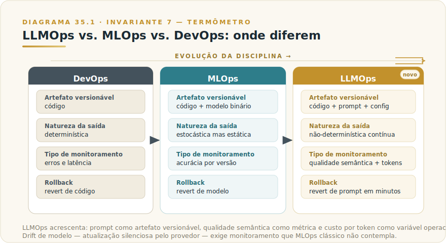
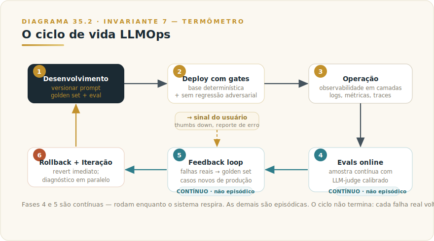
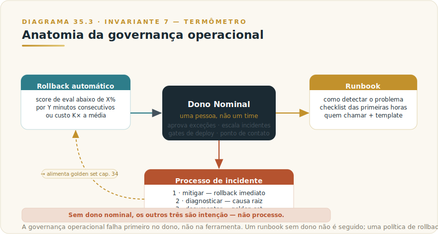

# CAPÍTULO 36
## LLMOPS

---

> *"Operar um sistema probabilístico sem observabilidade não é coragem — é fé. E fé não tem SLA."*

---

> 🧭 **Por que este capítulo é a aplicação do Invariante 7 — Termômetro**
>
> O Invariante 7 é direto: IA sem eval é fé, não engenharia. Em produção, esse princípio se desdobra em operação contínua: não basta ter evals antes do deploy — é preciso instrumentar, observar e iterar enquanto o sistema estiver rodando. LLMOps é a disciplina que transforma um sistema probabilístico num serviço operado com rigor. Sem observabilidade, você não opera — você espera. Sem ciclo de feedback, você não itera — você torce. Sem critério de rollback, você não controla — você reage. Este capítulo fecha a Parte 3 com a pergunta que qualquer sistema construído nos capítulos anteriores precisa responder: *como você o opera depois que vai ao ar?*
>
> Invariante secundário: **Inv. 5 — Custo Composto** (cada token em produção multiplica; instrumentar custo por feature é pré-requisito para operar com consciência).

---

## 36.1 — O CONCEITO: POR QUE LLMOPS É UMA DISCIPLINA DIFERENTE

Existe uma tentação razoável de tratar LLMOps como MLOps com novos nomes, ou como DevOps com um provedor de API a mais. Ambas as analogias falham — e a diferença tem consequências práticas.

Em sistemas de software tradicionais, a mesma entrada produz sempre a mesma saída. Um bug é determinístico: você reproduz, você corrige, você verifica. Em sistemas de ML clássico, o comportamento muda com os dados de treino, mas o modelo em produção é estático — um artefato binário com versão fixa. A regra é: treinar, avaliar, deployar.

Sistemas LLM introduzem três diferenças que quebram esse modelo.

**Não-determinismo estrutural.** A mesma entrada pode produzir saídas diferentes. Isso não é bug — é propriedade do sistema. Monitorar se "a saída está certa" exige avaliação semântica, não comparação binária. Você não pode testar igualdade; precisa testar qualidade.

**Prompt como artefato versionável.** Em DevOps, o que você versiona é código. Em LLMOps, o que você versiona é *também* o prompt — o system prompt, os exemplos de few-shot, as instruções de formatação. Uma mudança de três palavras num system prompt pode regredir a qualidade de um sistema inteiro, silenciosamente, sem nenhuma linha de código alterada. Isso exige versionamento de prompt com a mesma disciplina que versionamento de código.

**Custo por token como variável operacional.** Em DevOps, você monitora CPU e memória. Em LLMOps, você monitora tokens. Cada chamada tem custo variável que depende do tamanho do contexto, do tier do modelo e da estratégia de caching. Sem instrumentação de custo por feature, você descobre o problema na fatura do mês.

**Drift sem retraining.** Modelos LLM são atualizados pelo provedor sem aviso de breaking change. O mesmo endpoint pode ter comportamento diferente amanhã do que tem hoje. Esse risco — que o Capítulo 4 chama de risco de drift de modelo — exige monitoramento contínuo de qualidade em produção, não apenas em release.

Essas quatro diferenças somadas definem o escopo de LLMOps: é a disciplina de operar sistema probabilístico com observabilidade contínua, custo instrumentado e ciclo de feedback que detecta degradação antes que o usuário detecte.

---

## 36.2 — ANALOGIA: O TERMÔMETRO DA UTI

Imagine um hospital que inaugura uma UTI. Os médicos são excelentes, os equipamentos são de primeira linha, os protocolos foram desenhados com rigor. No primeiro dia, tudo funciona.

A UTI sem monitoramento contínuo de pacientes é impensável. Não porque os médicos não saibam o que fazem — mas porque o estado do paciente muda. A temperatura sobe. A pressão cai. O ritmo cardíaco oscila. Sem o termômetro, sem o monitor de pressão, sem o oxímetro, o médico mais competente do mundo fica reduzido a observação visual e palpação. É diagnóstico, não operação.

Um sistema LLM em produção é a UTI. O modelo é o equipamento. O sistema de observabilidade é o conjunto de monitores à cabeceira. Sem ele, você sabe como o sistema funcionou no dia do deploy — não como está funcionando agora. E "agora" muda: o volume de chamadas cresce, os prompts dos usuários mudam de padrão, o provedor atualiza o modelo, um caso-limite novo emerge de um segmento que você não havia previsto.

LLMOps é a disciplina de instalar — e manter — os monitores. O Invariante 7 diz que IA sem eval é fé. Em produção, eval não é só o que acontece antes do deploy: é o que acontece continuamente, enquanto o sistema respira.

---

## 36.3 — A ENGENHARIA DE OPERAR EM PRODUÇÃO

### 36.3.1 — O ciclo de vida: da primeira chamada ao sistema operado

Todo sistema LLM percorre um ciclo que começa antes do primeiro usuário e nunca termina enquanto o sistema estiver no ar.

**Fase 1 — Desenvolvimento e versionamento de prompt.** O prompt é redigido, testado em golden set (Capítulo 35 detalha a construção desse set) e registrado com identificador de versão, autor e score de avaliação associado. O repositório de prompts não é um arquivo de texto com comentários: é um artefato com histórico, comparável a uma branch de código. Nenhuma mudança de prompt vai ao ar sem ter passado pelo mesmo pipeline de eval que o prompt anterior. A disciplina de *prompt registry* — seja num repositório git, seja numa ferramenta dedicada (nomes de ferramentas correntes no Apêndice J) — é o mínimo para não operar no escuro.

**Fase 2 — Deploy com gates.** A transição de staging para produção exige que o prompt candidato passe pelos gates definidos no Capítulo 35: base determinística (100%), meio com LLM-as-judge (cobertura proporcional à criticidade), e sem regressão adversarial. Se algum gate falha, o deploy não ocorre. Não há exceção implícita — exceção explícita requer aprovação documentada do dono nominal do sistema.

**Fase 3 — Operação com observabilidade.** O sistema no ar gera dados continuamente. Logs de chamada, traces de latência, contagem de tokens, sinais de custo, distribuição de stop reasons. Esses dados precisam estar acessíveis em tempo próximo ao real — não só na fatura mensal. A seção 35.3.2 detalha o que instrumentar.

**Fase 4 — Evals online e monitoramento de qualidade.** Uma fração das respostas em produção é avaliada continuamente pelo mesmo pipeline de LLM-as-judge calibrado. Não todas as chamadas — isso seria custo proibitivo. Uma amostra estatisticamente significativa, definida pelo risco da tarefa. O score de qualidade online é o termômetro: se cai abaixo do baseline, é sinal de drift.

**Fase 5 — Feedback loop.** Usuários que marcam respostas como inadequadas, incidentes identificados por revisão humana, casos-limite que emergem em produção — todos alimentam o golden set do Capítulo 35. Cada falha real vira caso de regressão. O sistema aprende com o que quebra, e o golden set cresce com dados reais, não só sintéticos.

**Fase 6 — Rollback e iteração.** Quando o termômetro apita, a primeira ação é rollback para a versão anterior do prompt — não investigação demorada. O sistema reverte em minutos; a investigação acontece em paralelo, fora do ar. Depois que o diagnóstico é feito, a iteração começa: novo prompt candidato, novo ciclo de eval, novo deploy.

### 36.3.2 — Observabilidade: o que instrumentar e em que ordem

A observabilidade de um sistema LLM não é um monolito que você instala de uma vez. É uma pilha que se constrói em camadas, da mais barata à mais cara, da mais urgente à mais refinada.

**Camada 1 — Log estruturado de toda chamada.** O mínimo absoluto. Cada chamada à API registra: timestamp, identificador da chamada (o `request-id` retornado pela Anthropic, como o Capítulo 22 documenta), modelo usado, versão do prompt, tokens de input, tokens de output, latência de ponta a ponta, stop reason, e identificador do usuário ou feature que gerou a chamada. Sem esse log, você não tem como correlacionar sintoma com causa.

**Camada 2 — Métricas agregadas em tempo próximo ao real.** Sobre o log da camada 1, agregue: p50/p95/p99 de latência por endpoint, taxa de erro por tipo (429, 529, 500), distribuição de stop reasons, tokens médios por chamada, custo acumulado por feature. Essas métricas são o dashboard operacional — o que o time de plantão olha quando algo parece errado.

**Camada 3 — Rastreamento distribuído (traces).** Em sistemas com múltiplas chamadas encadeadas — agentes, pipelines com RAG, workflows de subagentes — o trace conecta as chamadas individuais numa cadeia causal. Sem trace, você vê que a resposta final ficou ruim; com trace, você identifica em qual etapa da cadeia a qualidade degradou. Em sistemas simples (única chamada por request do usuário), a camada 1 e 2 são suficientes. Em sistemas agênticos, trace é obrigatório.

**Camada 4 — Evals online (amostra de qualidade).** Uma fração das respostas — típico entre 5% e 20%, dependendo da criticidade — é avaliada pelo mesmo LLM-as-judge calibrado que roda em staging. O score de qualidade resultante é o termômetro que detecta drift semântico antes que o usuário perceba. Nomes de ferramentas que implementam essa camada ficam no Apêndice J.

**Camada 5 — Sinal de feedback do usuário.** Thumbs down, report de erro, marcação de resposta inadequada — qualquer sinal de feedback do usuário deve ser capturado, associado ao trace da chamada correspondente, e encaminhado para revisão. Esse sinal é o mais valioso: é o caso real que a instrumentação automática não cobriu.

O princípio de prioridade: instale a camada 1 antes de qualquer outra coisa. Instale a camada 2 antes de ter usuários reais. Instale a camada 4 antes de considerar o sistema operacionalmente maduro. As camadas 3 e 5 são investimento de maturidade — importantes, mas podem esperar a segunda semana de operação.

### 36.3.3 — Gestão de custo em produção

Custo em produção não é problema de infraestrutura — é problema de instrumentação. Um sistema que não rastreia custo por feature não tem como otimizar, porque não sabe o que otimizar.

O princípio do Invariante 5 (Custo Composto) aplica aqui com força total: o custo de um sistema LLM não é o custo de uma chamada — é o custo de milhares de chamadas multiplicadas por tokens médios multiplicados pelo tier do modelo. Uma mudança de prompt que aumenta os tokens médios em 15% parece marginal por chamada e é significativa em escala de mês.

**Instrumentar custo por feature.** Cada chamada sabe de qual feature veio — autocomplete de e-mail, análise de contrato, geração de relatório. Essa dimensão de custo por feature é o que permite identificar qual funcionalidade está consumindo desproporcionalmente e onde a otimização tem maior retorno. Sem essa dimensão, o dashboard de custo total cresce e você não sabe onde cortar.

**Roteamento de modelo por tarefa.** Nem toda chamada exige o mesmo tier de modelo. O Capítulo 4 documenta o critério de encaixe: Haiku para classificação e extração estruturada em volume, Sonnet como default de produção, Opus para raciocínio premium que justifica o custo diferencial. Um sistema LLMOps maduro tem roteador que, em função da feature e da complexidade inferida da tarefa, escolhe o modelo adequado. Esse roteador é uma linha de código com alto retorno sobre custo.

**Caching como alavanca estrutural.** O Capítulo 26 detalhou o mecanismo técnico do prompt caching. Em produção, o sinal operacional é a taxa de cache hit por feature: se uma feature com system prompt estável tem taxa de cache hit abaixo de 70%, há oportunidade de revisão da estratégia de cache. A taxa de cache hit deve ser monitorada como métrica operacional, não como curiosidade técnica.

**Alertas de custo proativos.** Defina limites de gasto por workspace (como a documentação da Anthropic permite via Console) e configure alertas antes de atingi-los. O alerta de custo aciona investigação; o estouro de limite aciona rollback. A governança de custo não começa na fatura — começa nos alertas.

### 36.3.4 — Confiabilidade: o sistema que não cai

Um sistema LLM em produção enfrenta falhas que sistemas de software tradicionais não têm. O provedor fica sobrecarregado (529). O rate limit é atingido (429). A resposta chega tarde demais para o timeout do cliente. O modelo é atualizado e uma feature crítica regride.

**Timeouts calibrados.** Cada endpoint de sistema tem um SLA de latência. O timeout de chamada à API precisa ser definido abaixo desse SLA para que o sistema possa ativar o fallback antes de estourar o contrato com o cliente. Uma regra prática: timeout = SLA do endpoint menos 500ms de overhead de processamento local. Sem timeout explícito, a chamada fica pendurada indefinidamente enquanto o sistema aguarda.

**Retry com backoff exponencial.** Erros 429 e 529 são transientes por natureza. A resposta padrão, já documentada no Capítulo 22, é backoff exponencial com jitter: aguarda o valor do header `retry-after` quando presente, ou inicia com 1 segundo e dobra a cada tentativa, com variação aleatória de ±20% para evitar thundering herd. Máximo de 5 a 7 tentativas; além disso, o erro provavelmente não é transiente.

**Fallback de modelo.** Quando o modelo primário falha repetidamente, o sistema ativa o fallback: normalmente um tier inferior do mesmo provedor, ou — em sistemas mais avançados — um modelo de provedor alternativo. O fallback precisa ser declarado explicitamente no runbook do sistema, com critério claro de quando ativar (X falhas consecutivas em Y segundos) e como desativar (retornar ao primário quando a taxa de erro voltar ao baseline).

**Ramp-up gradual em novos deploys.** Um deploy de nova versão de prompt não vai a 100% do tráfego imediatamente. Começa em 5% a 10%, monitora as métricas da camada 2 por período definido (30 minutos a 2 horas, dependendo do volume), e sobe progressivamente. Se alguma métrica regride — latência, taxa de erro, score de eval — o deploy é revertido antes de afetar o grosso dos usuários. Esse padrão (blue-green ou canary deploy adaptado para LLM) é o que separa operação madura de deploy na fé.

### 36.3.5 — Governança operacional: quem é dono, o que fazer quando quebra

LLMOps sem governança é instrumentação sem responsável. Você tem os dados; ninguém age sobre eles.

**Dono nominal.** Todo sistema LLM em produção tem um dono nominal — uma pessoa, não um time genérico. Esse dono responde pelos gates de deploy, aprova exceções à política de bloqueio adversarial (como o Framework F8 estabelece), e é o ponto de contato em incidentes. Em organizações menores, é o desenvolvedor principal. Em organizações maiores, é um papel formal com critério de escalada documentado.

**Runbook.** O runbook é o documento que qualquer pessoa de plantão consegue seguir quando algo dá errado. Ele responde a quatro perguntas: como detectar que o sistema está com problema (quais métricas, quais alertas), o que fazer nas primeiras horas (checklist sequencial, não intuição), quem chamar se o checklist não resolver (escalada com critério claro), e o que comunicar aos usuários afetados (template de comunicação, não texto improvisado). Um sistema sem runbook é um sistema cujo operador é o criador — e criadores não ficam de plantão para sempre.

**Resposta a incidentes com três perguntas.** Quando um incidente ocorre, o processo tem três etapas em sequência: (1) mitigar — rollback ou fallback imediato para parar o sangramento; (2) diagnosticar — com o sistema estabilizado, identificar a causa raiz usando os logs e traces da observabilidade; (3) documentar — registrar o incidente com causa, impacto, ação tomada e aprendizado. O caso documentado vai para o golden set. A causa raiz, se for prompt, vai para o ciclo de iteração. A aprendizagem fica na memória operacional do time.

**Política de rollback automático.** Defina as condições que disparam rollback automático, sem deliberação manual: score de eval online cai abaixo de X% do baseline por Y minutos consecutivos; taxa de erro 5xx ultrapassa Z% por W minutos; custo por feature dispara acima de K× a média dos últimos N dias. Automação de rollback é o que transforma o sistema de "reagimos quando o usuário reclamou" para "revertemos antes que o usuário percebesse".

---

## 36.4 — DECISÃO: O QUE INSTRUMENTAR PRIMEIRO, QUANDO ESTÁ PRONTO PARA PRODUÇÃO, SINAIS DE OPERAÇÃO IMATURA

Esta é a seção de critério. Os critérios abaixo não dependem de ferramenta — dependem de prática.

### O que instrumentar primeiro

| Prioridade | O que instrumentar | Por quê agora |
|---|---|---|
| 1 | Log estruturado de toda chamada (request-id, tokens, stop_reason, feature, modelo, custo) | Sem isso, nenhum diagnóstico é possível. Custo zero de instalação, custo alto de não ter |
| 2 | Alertas de custo por workspace | Evita surpresa na fatura. Configura em minutos no Console |
| 3 | Distribuição de stop reasons e taxa de erro por tipo | Detecta problemas estruturais (max_tokens frequente, 529 repetido) antes de virarem incidente |
| 4 | Versão de prompt registrada por deploy | Permite rollback e atribuição de causa quando qualidade regride |
| 5 | Eval online (amostra de 5-10% das chamadas) | O termômetro de qualidade. Instalar antes de considerar o sistema maduro |
| 6 | Trace distribuído (para sistemas agênticos) | Obrigatório quando há múltiplas chamadas encadeadas; pode esperar em sistemas simples |
| 7 | Sinal de feedback do usuário associado ao trace | Investimento de maturidade — alto valor, pode ser fase 2 |

### Quando um sistema está pronto para produção

Um sistema LLM está operacionalmente pronto para produção quando atende a seis critérios mínimos:

1. **Golden set estabelecido e gate de CI rodando.** Nenhum deploy de prompt vai ao ar sem passar pelo pipeline de eval do Capítulo 35. O score de baseline está documentado.
2. **Log estruturado instalado e acessível.** Qualquer chamada dos últimos 30 dias pode ser consultada em menos de 5 minutos.
3. **Dono nominal identificado.** Uma pessoa — não um time — responde pelo sistema.
4. **Runbook existente e testado.** A última simulação de incidente foi feita nos últimos 90 dias.
5. **Política de rollback definida.** Sabe-se o que dispara rollback e como executá-lo em menos de 10 minutos.
6. **Custo por feature instrumentado.** O gasto mensal projetado foi calculado, aprovado e tem alerta configurado.

### Sinais de operação imatura

| Sinal | O que indica |
|---|---|
| "Trocamos o prompt e ficou melhor" sem score de eval antes e depois | Violação direta do Invariante 7 — melhoria percebida sem prova |
| O dono do sistema é "o time de AI" (sem nome individual) | Responsabilidade difusa; incidente sem escalada |
| Custo descoberto na fatura mensal, não no dashboard semanal | Instrumentação de custo ausente ou ignorada |
| Rollback leva mais de 1 hora | Processo manual, não documentado |
| Nenhuma eval em produção, só em staging | Drift de modelo não detectado até o usuário reclamar |
| Logs existem mas ninguém olha | Observabilidade instalada, operação ausente |
| Versão do prompt não é rastreada | Impossível atribuir regressão a mudança de prompt |

> ⚠️ **POSTMORTEM — O eval que media o fácil**
>
> *O que tentaram:* Um time de produto de uma plataforma jurídica implantou um sistema de geração de minutas contratuais com Claude e construiu um pipeline de evals que media três coisas: (1) se a minuta tinha as seções obrigatórias; (2) se o formato de saída estava correto (JSON com campos definidos); (3) se o comprimento estava dentro do intervalo esperado. O pipeline rodava em CI a cada deploy. O score ficou acima de 95% por três meses consecutivos — e ninguém questionou o resultado.
>
> *O que deu errado:* O time estava medindo o que era simples de medir, não o que importava. Seções presentes, formato correto e comprimento adequado são propriedades superficiais. O que a plataforma precisava garantir — fidelidade jurídica das cláusulas, coerência entre obrigações e penalidades, ausência de contradição interna entre seções — não estava no pipeline de eval. Quando um cliente identificou uma minuta com cláusula de rescisão contraditória com a cláusula de vigência, o time foi verificar o histórico: a regressão semântica havia sido introduzida seis semanas antes, por uma mudança de três linhas no system prompt, e havia passado sem alerta porque o eval não cobria coerência jurídica. O score de 97% era real e irrelevante.
>
> *O Invariante violado:* Inv. 7 — Termômetro. O eval que mede o fácil em vez do que importa não é termômetro — é decoração de painel. O Livro 1 é direto: IA sem eval é fé; mas eval que mede o proxy errado é fé com dashboard. O instrumento estava instalado; o que estava errado era o que ele media.
>
> *O que teria evitado:* Definir critérios de qualidade substantivos antes de construir o pipeline de eval — com pelo menos uma rubrica de LLM-as-judge medindo coerência jurídica interna, não apenas presença de campos. Incluir no golden set casos onde o texto é estruturalmente correto mas juridicamente inconsistente. Perguntar, a cada ciclo de eval, "se esse score caísse 10 pontos, o que mudou no comportamento real do sistema?" — se a resposta for vaga, o critério de pontuação está incompleto. (Ver `[Apêndice K — Os 9 Modos de Falha](../04-apendices/L2-APX-K-modos-de-falha.md)` para o padrão de falha por métricas de proxy sem cobertura semântica.)

---

## 36.5 — EXEMPLO MEMORÁVEL: ATLAS STRATEGY EM PRODUÇÃO

*Cenário ilustrativo brasileiro.* A Atlas Strategy — consultoria estratégica de São Paulo que aparece em outros capítulos deste livro — teve o incidente dos números trocados no relatório (documentado no contexto do Framework F8 e do Capítulo 22). O pós-incidente obrigou a construir, pela primeira vez, uma operação madura em torno do sistema de geração de relatórios.

O primeiro passo foi instalar o log estruturado retroativamente: cada chamada passou a registrar request-id, versão do prompt (um hash curto do conteúdo), feature (`relatorio-estrategico`, `analise-financeira`, `sintese-pesquisa`), tokens de input e output, e stop reason. Em duas semanas de operação monitorada, o time descobriu que a feature `relatorio-estrategico` tinha custo médio por chamada 2,3× maior que as outras duas — não por volume, mas por tokens de output sistematicamente mais longos que o esperado.

A causa: o prompt dessa feature não tinha instrução explícita de limite de tamanho. Adicionada a instrução, o custo caiu 40% sem regressão de qualidade — porque o gate de CI bloqueou a primeira versão que regredia a rubrica de completude.

O dono nominal foi nomeado formalmente: uma sócia com foco em operações. O runbook foi escrito em dois dias. A primeira simulação de incidente revelou que o processo de rollback levava 47 minutos — muito acima do objetivo de 10. Automatizaram o rollback para troca de variável de ambiente no sistema de deploy, e o tempo caiu para 3 minutos.

Seis meses depois, o score de eval online detectou uma regressão de 8 pontos percentuais na rubrica de faithfulness numérico — sem nenhuma mudança de prompt da equipe. A investigação revelou que o modelo havia sido atualizado pelo provedor. O rollback automático não foi ativado (o threshold estava configurado para 15 pontos, não 8), mas o sinal chegou antes de qualquer usuário reclamar. O prompt foi ajustado, testado contra o golden set, e o score voltou ao baseline em menos de uma semana.

Esse é o ciclo em operação: detectar, diagnosticar, iterar, medir. Não porque a Atlas passou a ser uma empresa de tecnologia — mas por ter aprendido que operar um sistema probabilístico sem termômetro é operar no escuro, independentemente da qualidade do modelo.

---

## 36.6 — NA PRÁTICA: TRÊS APLICAÇÕES REPLICÁVEIS

O exemplo anterior mostra o ciclo em operação real; esta seção entrega o roteiro de como chegar lá. Três aplicações em ordem crescente de maturidade. A forma é *situação → o que fazer → o ponto de julgamento*.

**Aplicação 1 — Instalar o mínimo de observabilidade antes dos primeiros usuários reais.**
*Situação:* o sistema está pronto para produção mas não tem nenhuma instrumentação. O time opera "no escuro" — quando algo der errado, não haverá dado para diagnosticar. *O que fazer:* instale as camadas 1 e 2 da seção 36.3.2 antes de qualquer usuário real: log estruturado de toda chamada com request-id, modelo, versão do prompt, tokens de input e output, stop reason e feature; e alertas de custo configurados no Console da Anthropic. Escreva o runbook mínimo: o que monitorar, quem chamar, como reverter. Nomeie um dono nominal — uma pessoa, não "o time de AI". *O ponto de julgamento:* o primeiro incidente real revelará se a observabilidade está funcionando. Se o diagnóstico levar mais de uma hora porque os dados não estão acessíveis ou organizados, a camada 1 não está completa — está instalada mas não operacional.

**Aplicação 2 — Primeiro ciclo de feedback loop em sistema existente.**
*Situação:* o sistema está em produção há algumas semanas com log estruturado, mas ainda não existe eval online e o golden set foi construído com casos hipotéticos durante o desenvolvimento. *O que fazer:* puxe os últimos 30 dias de logs de produção e identifique os 50 casos mais representativos por volume e os 10 casos com feedback negativo de usuários ou com stop reason `max_tokens` (sinal de output truncado). Use esses 60 casos como base para reconstruir o golden set com dados reais. Configure o eval online em amostra de 5% a 10% das chamadas usando o mesmo judge já calibrado. Documente o score de baseline — é o ponto de partida de toda comparação futura. *O ponto de julgamento:* o score de baseline só é útil se você souber o que ele mede. Antes de publicar o número, responda: "se o score cair 10 pontos, o que mudou no comportamento do sistema?" Se não souber responder, o critério de pontuação ainda não está suficientemente operacional.

**Aplicação 3 — Política de rollback automático e teste de incidente simulado.**
*Situação:* o sistema tem log, eval online e golden set, mas a política de rollback não foi formalizada. O time sabe que "deveria reverter quando algo der errado", mas não sabe em que condições exatas, quem decide, ou quanto tempo leva. *O que fazer:* defina as três condições de rollback automático (ex.: score de eval online cai mais de 10 pontos do baseline por 30 minutos; taxa de erro 5xx ultrapassa 5% por 10 minutos; custo por feature sobe mais de 2× a média dos últimos 7 dias). Implemente o rollback como troca de variável de ambiente — não como processo manual. Depois, simule um incidente: degrade artificialmente o sistema e meça quanto tempo leva para detectar, diagnosticar e reverter. *O ponto de julgamento:* o objetivo é rollback em menos de 10 minutos. Se a simulação revelar que leva mais, o processo ainda é manual em algum ponto. Identifique exatamente onde e automatize.

> 🔧 **EXERCÍCIO**
> Para o sistema Claude que você opera hoje (ou planeja operar): preencha a tabela de seis critérios de prontidão para produção da seção 36.4 ("Quando um sistema está pronto para produção"). Para cada critério que ainda não é atendido, escreva o que falta e uma estimativa de quanto tempo levaria para implementar. A soma do que falta é o seu backlog de LLMOps. Priorize o item que, se ausente, causaria mais dano no próximo incidente — esse é o primeiro da fila, não o mais fácil.

---

## 36.7 — CAMADA VIVA

A operação de sistemas LLM é um campo em rápida evolução. O que dura é o método — observabilidade, versionamento de prompt, ciclo de feedback, critério de rollback. O que muda são as ferramentas.

Plataformas de observabilidade para LLM, registros de prompt, sistemas de eval online, ferramentas de rastreamento distribuído: nomes de produtos correntes ficam no [Apêndice J — Apêndice Vivo](../04-apendices/L2-APX-J-apendice-vivo.md). O apêndice é atualizado com periodicidade declarada; o corpo deste capítulo não é.

O critério para avaliar uma ferramenta de LLMOps não muda com a versão: ela instrumenta custo por feature? Permite versionamento de prompt com score de eval associado? Suporta evals online com LLM-as-judge? Tem integração com o pipeline de CI? Responda sim às quatro perguntas e você tem uma ferramenta que serve. Responda não e você tem um dashboard bonito sem operação por baixo.

---

## 36.8 — LIMITAÇÕES E O QUE ESTE CAPÍTULO NÃO COBRE

LLMOps é extenso. Este capítulo cobre o ciclo de operação de sistemas de inferência — o caso mais comum. Três áreas ficam de fora por escopo:

**Fine-tuning e operação de modelos próprios.** Quando a organização treina ou faz fine-tuning de modelos proprietários, o ciclo inclui gerenciamento de dados de treino, versionamento de modelo binário e pipelines de treinamento contínuo — complexidade adicional que aproxima LLMOps do MLOps clássico e está além do escopo desta série.

**Multimodal e vídeo.** Observabilidade para sistemas que processam imagem, áudio e vídeo tem especificidades de instrumentação (tamanho de mídia em vez de tokens, latência de transcrição, qualidade de OCR) não cobertas aqui.

**Compliance e auditoria regulatória.** Setores com requisitos regulatórios específicos — financeiro, saúde, governo — têm camadas adicionais de auditoria, retenção de log e documentação de decisão automatizada. A Parte 4 deste livro aborda governança nesse nível.

---

## 36.9 — CONEXÕES

Este capítulo é o ponto de convergência da Parte 3 com a prática operacional:

- **Capítulo 4 (Modelos Claude)** — a decisão de qual tier usar por feature é o roteador de modelo; o critério está lá.
- **Capítulo 22 (API + SDKs)** — a observabilidade começa nos campos da resposta da API: request-id, stop_reason, usage. O tratamento de erros documentado lá é o fundamento do retry e fallback aqui.
- **Capítulo 26 (Prompt Caching)** — a taxa de cache hit é métrica operacional; o mecanismo técnico está lá.
- **Capítulo 29 (Claude + MCP)** — em sistemas agênticos com MCP, o trace distribuído precisa cobrir chamadas a servidores MCP além das chamadas à API.
- **Capítulo 35 (Evals)** — a base de medição que torna LLMOps possível. Sem o golden set e o pipeline de eval do capítulo anterior, os gates de deploy aqui são ornamento. Os dois capítulos são sequenciais por necessidade: evals primeiro, operação depois.
- **Parte 4 (Governança)** — o dono nominal, o runbook e a política de incidentes são a intersecção entre operação técnica e governança organizacional. A Parte 4 expande o que aqui foi introduzido: quem é responsável, como a organização decide, o que comunicar quando algo falha em escala.

---

## 36.10 — RESUMO

LLMOps é a disciplina de operar sistema probabilístico com observabilidade contínua, custo instrumentado e ciclo de feedback que detecta degradação antes que o usuário detecte. Difere de MLOps e DevOps em três eixos fundamentais: não-determinismo que exige avaliação semântica (não comparação binária), prompt como artefato versionável com o mesmo rigor que código, e custo por token como variável operacional que multiplica silenciosamente.

O ciclo de vida opera em seis fases contínuas: desenvolvimento e versionamento de prompt, deploy com gates de eval, operação com observabilidade em camadas, evals online em amostra, feedback loop que alimenta o golden set, e rollback imediato quando o termômetro apita.

O que instrumentar primeiro, em ordem: log estruturado de toda chamada, alertas de custo, distribuição de stop reasons, versão de prompt por deploy, eval online em amostra. O sistema está pronto para produção quando tem golden set com gate de CI, log acessível, dono nominal, runbook testado, política de rollback e custo instrumentado.

O método sobrevive às ferramentas. Plataformas de observabilidade vêm e vão; o princípio do Invariante 7 não muda: sem termômetro, você não opera — você espera. Um eval que mede o fácil em vez do que importa não é observabilidade: é ilusão de controle com custo de infraestrutura.

---

> ☐ **UAU** — *O seu sistema em produção tem um score de qualidade acessível agora, em tempo próximo ao real? Se não, você tem um sistema no ar sem termômetro.*

---

> *"O modelo muda. O provedor atualiza. O volume cresce. O único invariante da operação é o seguinte: quem não mede, não opera — torce."*

---

*Este capítulo encerra a Parte 3 — Engenharia. Os capítulos anteriores construíram o sistema: tokens e contexto, API e SDKs, tool use, extended thinking, prompt avançado, caching, embeddings, RAG, MCP, subagentes, skills e evals. Este capítulo fechou com a pergunta que todos os outros pressupõem: como você opera o que construiu? A Parte 4 — Governança continua com a pergunta seguinte: como a organização decide, responsabiliza e escala o que a engenharia entregou.*

---

**Fontes pesquisadas para este capítulo:**
- [Anthropic — Rate limits (platform.claude.com)](https://platform.claude.com/docs/en/api/rate-limits)
- [LLMOps vs MLOps — Atlan](https://atlan.com/know/llmops-vs-mlops/)
- [LLMOps Guide 2026 — Redis](https://redis.io/blog/large-language-model-operations-guide/)
- [LLMOps for AI Agents — OneReach](https://onereach.ai/blog/llmops-for-ai-agents-in-production/)
- [What 1,200 Production Deployments Reveal — ZenML](https://www.zenml.io/blog/what-1200-production-deployments-reveal-about-llmops-in-2025)
- [LLMOps vs DevOps — Cloudsmith](https://cloudsmith.com/blog/llmops-vs-devops-what-llmops-means-for-artifact-management)
- [MLOps vs LLMOps — iamraghuveer.com](https://www.iamraghuveer.com/posts/mlops-vs-llmops-what-changes/)
