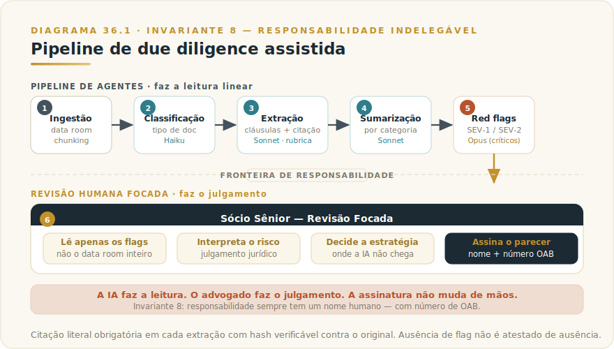

# CAPÍTULO 37
## CASOS — SETOR JURÍDICO

---

> *"No direito, a IA não assina. Quem assina responde — e responde com a carteira da OAB, com a reputação da banca e com o patrimônio do cliente."*

---

> 🧭 **Invariante 8 — Responsabilidade Indelegável**
>
> *"A IA executa; a responsabilidade tem sempre um nome humano."*
>
> No setor jurídico, o Invariante 8 assume sua forma mais concreta: a responsabilidade profissional do advogado é pessoal, intransferível e regulada pelo Estatuto da OAB. Nenhuma arquitetura de IA — por mais sofisticada que seja — pode figurar como parte em um parecer, como assinante de uma peça ou como responsável por uma due diligence. A IA prepara. O advogado responde. Essa assimetria não é uma limitação técnica a superar; é o fundamento ético que torna a IA utilizável com segurança no direito.

---

## 37.1 — Por que o jurídico é ao mesmo tempo o setor mais fértil e o mais perigoso para IA

O setor jurídico reúne características que o tornam candidato natural à augmentação por IA — e riscos que tornam essa augmentação altamente exigente.

### 37.1.1 — Por que é fértil

**Volume documental previsível.** O trabalho jurídico de alta complexidade — due diligence em M&A, contencioso massificado, revisão contratual — é dominado por leitura linear de documentos com estrutura repetitiva. Contratos societários, trabalhistas, fiscais e comerciais seguem padrões de cláusulas, e um modelo treinado para extração estruturada opera nesse território com precisão mensurável.

**Custo de atenção humana é o gargalo real.** Um sócio sênior em banca de M&A pode custar R$ 3.000–6.000 por hora faturável. Gastar 60% desse tempo em leitura linear de cláusulas padrão é usar bisturi para abrir envelope. A IA não substitui o julgamento jurídico; libera-o para operar onde é insubstituível.

**Estrutura de output é verificável.** Em medicina ou jornalismo investigativo, a qualidade do output depende de julgamento subjetivo. Em jurídico, a maioria das extrações tem resposta certa: a cláusula de *change of control* ou está na página 87 com aquele texto exato, ou não está. Isso torna a construção de evals objetivos — um dos pilares da produção segura com IA — consideravelmente mais direta.

### 37.1.2 — Por que é perigoso

**Alucinação de jurisprudência é falha de carreira.** Um modelo de linguagem pode citar com aparente precisão um acórdão do STJ que nunca existiu — número de processo, data e ementa plausíveis. Em outras áreas, uma alucinação gera retrabalho. Em peça processual, gera impugnação, sanção disciplinar e eventual responsabilização civil. A tolerância a alucinação em jurídico é, na prática, zero.

**Sigilo profissional e LGPD criam fronteiras rígidas.** O dever de confidencialidade do advogado (art. 34, VII, do Estatuto da OAB) não é negociável. Enviar dados de cliente a uma API sem contrato de processamento adequado, sem *data zoning* e sem cláusula de não-retenção pode constituir violação disciplinar independentemente do resultado técnico. O risco não é hipotético: escritórios brasileiros já enfrentaram questionamentos da OAB por uso de ferramentas de IA sem política formal.

**Responsabilidade profissional não distribui.** No direito, esse princípio é explícito: o parecer tem nome, sobrenome e número da OAB. "O modelo disse" não é argumento defensável em processo disciplinar, em ação de responsabilidade civil ou em impugnação por parte adversa.

### 37.1.3 — O que está em jogo

A adoção descuidada expõe três ativos simultaneamente: a carteira da OAB, a reputação da banca e — o mais grave — os interesses do cliente. A adoção cuidadosa reorienta tempo caro de profissional para o que só ele pode fazer: interpretar, aconselhar, decidir estratégia. A diferença entre os dois caminhos não é tecnológica; é de governança.

---

## 37.2 — O caso: due diligence assistida em M&A

> ⚠️ **Cenário ilustrativo** — composto a partir de padrões observados em escritórios brasileiros de M&A entre 2025 e 2026; números são realistas mas não identificam banca específica.

### 37.2.1 — Contexto

A banca descrita — aqui chamada Vianna, Castro e Almeida Advogados — opera no segmento de M&A com aproximadamente 180 advogados e 22 sócios. Tickets típicos variam de R$ 800 mil a R$ 4 milhões. O tempo médio de due diligence (DD) era de 6 a 12 semanas, com seniores dedicando cerca de 60% do esforço à leitura linear de documentos no *data room*.

A maturidade de IA era inicial: uso individual e informal por alguns advogados, sem política, sem governança e sem controle de confidencialidade.

### 37.2.2 — O problema

Due diligence em M&A concentra o risco de uma cláusula crítica enterrada na página 87 de um contrato de 150 páginas. Cláusulas de *change of control*, *material adverse change* (MAC), *indemnification cap*, *non-compete*, *drag-along* e *tag-along* determinam se uma operação é viável — e se a banca responde por falha de leitura.

Quando um sócio sênior lê 150 páginas linearmente às 23h da véspera do *closing*, o risco não é incompetência; é volume incompatível com atenção humana sustentada. A banca sabia disso. O que não sabia era como resolver sem comprometer sigilo ou transferir responsabilidade.

### 37.2.3 — A tese inicial errada — e por que viola o Invariante 8

A primeira proposta interna foi direta: "vamos fazer o modelo ler tudo e produzir o parecer." Tecnicamente possível. Profissionalmente indefensável.

Essa arquitetura viola o Invariante 8 de duas maneiras:

1. **Responsabilidade sem nome:** o parecer teria como agente real um sistema de IA sem registro na OAB e sem capacidade de ser questionado em processo disciplinar.
2. **Alucinação sem freio:** sem revisão humana antes do parecer, uma citação inventada de jurisprudência passaria diretamente para o cliente — falha de carreira com consequências mensuráveis.

A tese correta — que o Invariante 8 impõe — é a inversão: a IA substitui a *leitura linear* que o sócio fazia para chegar ao parágrafo que importa. O sócio ainda chega, interpreta e assina. O que muda é quanto tempo ele gasta chegando lá.

### 37.2.4 — Desenho da solução com Claude

A arquitetura construída opera em pipeline de seis etapas:

1. **Ingestão e chunking** — o *data room* é ingerido e segmentado por documento.
2. **Classificação** — cada documento é classificado por tipo (contrato comercial, societário, trabalhista, fiscal) por um agente classificador leve.
3. **Extração estruturada** — um agente extrator por cláusula recupera 30+ cláusulas-alvo por contrato, com citação literal obrigatória (página, parágrafo, *hash* do trecho).
4. **Sumarização executiva** — sumário por categoria de cláusula, consolidando padrões e desvios.
5. **Sinalização de *red flags*** — flags categorizados por severidade (SEV-1 crítico / SEV-2 relevante) com referência ao trecho exato.
6. **Revisão humana focada** — o sócio sênior revisa apenas os flags, não o *data room* inteiro. A leitura linear desaparece do fluxo; o julgamento jurídico permanece.

A frota de agentes opera com clara divisão de responsabilidades:

| Agente | Modelo | Função |
|--------|--------|--------|
| Classificador | Claude Haiku | Classifica documento por tipo |
| Extrator por cláusula | Claude Sonnet (rubrica em system prompt) | Extrai cláusula com citação literal obrigatória |
| Sumarizador | Claude Sonnet | Produz sumário executivo por categoria |
| Avaliador de flag | Claude Opus (casos críticos) | Determina SEV-1 ou SEV-2 |
| Sócio sênior | Humano | Interpreta, decide, assina o parecer |

O ponto mais importante da tabela não é tecnológico: o sócio sênior é o fim do pipeline — onde a responsabilidade se materializa com nome e número de OAB.

As ferramentas MCP privadas criadas para o pipeline seguem o princípio do menor privilégio:

| Tool | Permissão | Auditoria |
|------|-----------|-----------|
| `lista_documentos_data_room` | Read | Span por consulta |
| `extrai_clausula` | Read | Span + cláusula extraída |
| `cita_pagina_paragrafo` | Read | Hash do trecho + verificação contra original |
| `compara_clausula_padrao` | Read | Span + padrão da banca aplicado |
| `gera_sumario_categoria` | Read | Span + revisão por seniores |
| `marca_red_flag` | Write (registro) | Span + SEV + dono |

Nenhuma tool tem permissão de escrita em documentos do cliente. A única escrita permitida é o registro de flags — e mesmo esse registro é auditado e associado a um dono humano.

O system prompt do extrator inclui princípio constitucional explícito: *"Nunca afirme que uma cláusula existe sem citar o texto literal. Se a cláusula não for encontrada, declare ausência explícita."* É o antídoto técnico para o *over-extraction* — inventar uma cláusula que não existe é tão danoso quanto perder uma que existe.

### 37.2.5 — Governança e controles

A estrutura de governança segue três camadas do framework F6 — Governança Indelegável:

**Camada técnica**

- Modelo Claude Enterprise com *data zoning* por cliente: o *data room* da operação A nunca contamina o contexto da operação B.
- Tracing por documento e por cláusula extraída: cada extração tem rastreabilidade completa para auditoria interna e eventual contestação.
- Retenção por operação conforme contrato com o cliente: dados não persistem além do escopo acordado.
- Sem retenção de dados de treinamento pelo provedor: pré-requisito contratual.

**Camada operacional**

- AUP (Acceptable Use Policy) por operação: cada DD tem uma política de uso específica assinada pelo sócio responsável antes do início.
- RACI claro: sócio responsável pelo parecer final; advogado sênior pela validação da extração; Comitê de IA pela auditoria do sistema.
- Política de tolerância zero para alucinação de citação: se o hash do trecho não conferir com o original, o flag é bloqueado até revisão humana.

**Camada executiva**

- Comitê de qualidade jurídica + Comitê de IA operam em cadência mensal.
- Conselho de sócios recebe relatório trimestral com métricas de qualidade do sistema.

### 37.2.6 — Evals: a pirâmide de verificação

O sistema de avaliação opera em três níveis:

**Base — validação estrutural.** Toda citação extraída passa por verificação automática: o hash do trecho na extração confere com o hash no documento original? Esse check ocorre em 100% das extrações, em tempo real.

**Meio — golden set.** Um conjunto de 40 DDs reais anonimizadas serve como gabarito permanente. Seniores produziram o gabarito de cláusulas-alvo manualmente. Um LLM-as-judge calibrado para detecção de alucinação avalia o sistema mensalmente. O *adversarial set* inclui contratos com cláusulas em rodapés, redação ambígua, idioma misto e defesas por extensão — os casos de maior probabilidade de erro.

**Topo — revisão de sócio sênior.** Em cada operação, uma amostra é revisada por sócio independente do responsável pela operação, sem saber quais trechos foram extraídos por IA e quais foram selecionados manualmente — teste cego.

**Política de bloqueio:** taxa de alucinação de citação ≥ 0,5% bloqueia o release. O Invariante 1 — plausibilidade não é verdade — não admite tolerância em ambiente jurídico: um modelo que alucina 1 em cada 200 citações não é utilizável em produção.

### 37.2.7 — Resultados

| Métrica | Pré-projeto | Resultado |
|---------|-------------|-----------|
| Tempo médio de DD | 8 semanas | 3 semanas (operações típicas) |
| Cobertura de cláusulas (recall) | baseline | +27% |
| Flags relevantes capturados vs baseline humano | baseline | +14% |
| Taxa de alucinação de citação | n/a | < 0,5% |
| Capacidade por sócio | baseline | 2,5× |
| Margem por operação | baseline | +22 pontos percentuais |

O +27% de recall não é surpresa: o modelo lê com atenção homogênea às 3h do décimo documento do dia, o que um advogado cansado não faz. O modelo não é mais inteligente; é mais consistente em tarefas repetitivas.

O resultado mais estratégico é o deslocamento do tempo do sócio: de leitura linear para interpretação e decisão. Sócios que processavam duas operações simultâneas passaram a operar com cinco — sem ampliar o time de seniores e sem degradar a qualidade do parecer.

---

## 37.3 — Transferência: o que leva para o seu escritório

### 37.3.1 — O critério transferível

O padrão deste caso se reduz a uma fórmula:

**IA faz a leitura; advogado faz o julgamento. A assinatura nunca muda de mãos.**

Esse critério se aplica a qualquer escritório, porte ou área do direito. O que varia é o volume que justifica o investimento em pipeline estruturado versus ferramentas mais simples.

### 37.3.2 — O que é específico do caso vs. o padrão geral

| Elemento | Específico deste caso | Padrão geral transferível |
|----------|----------------------|--------------------------|
| RAG com MCP privado | M&A de alto volume com *data room* | Qualquer pesquisa documental com sigilo |
| Agente extrator por cláusula | Contratos societários/comerciais | Qualquer documento com estrutura repetitiva |
| Hash de verificação de citação | DD com consequência jurídica | Qualquer saída de IA que cita fonte verificável |
| AUP por operação | Operações M&A com cliente diferente | Qualquer engajamento com dados de terceiros |
| Revisão cega por sócio independente | Operações > R$ 1M | Qualquer processo com decisão de alta consequência |
| *Data zoning* Enterprise | Múltiplos clientes simultâneos | Qualquer ambiente multi-cliente |

### 37.3.3 — Armadilhas específicas do setor jurídico

**Armadilha 1 — Citar jurisprudência inexistente**

Modelos de linguagem constroem referências plausíveis que não existem. Em contratos comerciais, esse risco é menor (o texto está no *data room*). Em peças processuais, pesquisa jurídica e pareceres doutrinários, o risco é máximo.

*Mitigação:* nunca usar IA para citar jurisprudência sem verificação em base oficial (STJ, STF, TRFs, TJs). O modelo pode sugerir a busca; a citação só entra no documento depois de confirmada na fonte primária com data e número de processo.

> ⚠️ **POSTMORTEM — A ementa que nunca existiu**
> *O que tentaram:* em uma banca de médio porte especializada em direito do consumidor, um associado usou um modelo de linguagem para pesquisar jurisprudência do STJ sobre inversão do ônus da prova em contratos de adesão. O modelo retornou três acórdãos com numeração, data e ementa de aparência impecável. Os três foram inseridos diretamente na peça processual sem verificação em base oficial. *O que quase deu errado:* o advogado da parte adversa citou a ausência dos processos no sistema do STJ na réplica. Nenhum dos três números existia. A banca enfrentou impugnação, pedido de sanção processual e comunicado ao núcleo disciplinar da OAB local — tudo antes do mérito ser discutido. *O Invariante violado:* Inv. 8 — Responsabilidade Indelegável. A peça tem nome de OAB; a verificação é insubstituível. *O que evitou (ou teria evitado):* a regra de que o modelo sugere a busca e o advogado confirma na fonte primária com número e data antes de qualquer uso em documento externo. Um hash de verificação contra base oficial, implementado no pipeline, teria bloqueado a citação antes de chegar à peça. (cenário composto ilustrativo; ver [Apêndice K — Os 9 Modos de Falha](../04-apendices/L2-APX-K-modos-de-falha.md))

> 🎯 **DA CADEIRA DO CTO**
> Antes de autorizar qualquer uso de IA em produção de peças ou pareceres, exigiria um controle não-negociável: toda citação de jurisprudência gerada por IA passa por verificação automática contra API da base oficial antes de chegar ao advogado. Sem retorno positivo da base, a citação é bloqueada — não sinalizável, não contornável. O time jurídico pode decidir buscar depois; o sistema não pode entregar uma referência que não verificou. Esse controle é o mínimo para que o modelo seja útil sem ser um passivo de carreira.

**Armadilha 2 — Vazamento de sigilo profissional**

Enviar documentos de clientes a APIs sem contrato de processamento adequado é, potencialmente, violação do art. 34, VII, do Estatuto da OAB — independentemente do resultado técnico.

*Mitigação:* antes de qualquer piloto, verificar: (a) o contrato com o provedor inclui não-retenção para treinamento? (b) há *data zoning* por cliente? (c) existe cláusula de processamento de dados nos contratos de honorários com os clientes afetados?

**Armadilha 3 — Over-extraction: afirmar o que não está**

O oposto da alucinação de citação: o modelo "inventa" que a cláusula não existe quando ela existe em redação não canônica. Igualmente grave em due diligence.

*Mitigação:* adversarial set com contratos deliberadamente redigidos de forma incomum; princípio constitucional no system prompt ("declare ausência explícita quando não encontrar, com nível de confiança").

**Armadilha 4 — Ilusão de completude**

O modelo processou 340 documentos e não levantou flags. Conclusão intuitiva: o *data room* está limpo. Conclusão correta: o sistema não encontrou flags nos padrões que foi treinado a buscar, nos documentos que processou, com a configuração vigente.

*Mitigação:* toda saída deve incluir cobertura explícita (quantos documentos foram processados, quais foram excluídos por formato ou tamanho, quais cláusulas-alvo foram buscadas). Ausência de flag não é atestado de ausência.

### 37.3.4 — Tabela de decisão: quando estruturar o pipeline

| Condição | Decisão |
|----------|---------|
| Volume < 20 documentos por operação | Prompt estruturado direto, sem pipeline dedicado |
| Volume 20–100 documentos | Pipeline leve com extração + revisão humana |
| Volume > 100 documentos ou múltiplos clientes simultâneos | Pipeline com RAG, MCP privado, *data zoning*, evals contínuos |
| Dados sensíveis de cliente | Contrato de processamento com provedor obrigatório antes de qualquer teste |
| Saída vai para peça processual ou parecer assinado | Verificação humana mandatória em 100% das citações de jurisprudência |
| Decisão tem consequência financeira > X (defina X por banca) | Revisão cega por sócio independente |

---

## 37.4 — NA PRÁTICA: APLIQUE NA SUA ORGANIZAÇÃO

Esta seção traduz o padrão do caso em aplicações que você pode iniciar com os recursos que já tem — independentemente do porte do escritório ou da área de atuação.

**Aplicação 1 — Revisão contratual com extração de cláusulas-alvo.**
*Situação:* seu escritório revisa contratos comerciais em volume suficiente para a leitura linear consumir tempo desproporcional de seniores — em M&A, renovações massificadas ou revisão de portfólio. *O que fazer:* defina as cláusulas-alvo que importam (rescisão, multas, limitação de responsabilidade, *change of control*, non-compete). Instrua o modelo com princípio constitucional: citar o trecho literal com página e parágrafo, ou declarar ausência explícita. Entregue o resultado ao advogado como material de revisão, não como output final. Verifique toda citação contra o original antes de uso externo. *O ponto de julgamento:* o julgamento jurídico — o que aquela cláusula implica para esta operação, com este cliente, neste contexto regulatório — é intransferível e está vinculado ao número de OAB. Ausência de flag não é atestado de ausência (Invariante 8).

**Aplicação 2 — Pesquisa jurídica com organização de fontes para revisão do advogado.**
*Situação:* um advogado precisa consolidar a orientação doutrinária e jurisprudencial sobre um tema antes de redigir parecer ou peça. A pesquisa manual consome horas pagas a preço de sênior. *O que fazer:* use o modelo para organizar fontes disponíveis publicamente — doutrina, acórdãos de base oficial, artigos de periódicos. O modelo apresenta a fonte com referência verificável; o advogado lê a primária antes de citar. Nunca use o modelo para gerar referências de jurisprudência no documento final sem verificação em base oficial. *O ponto de julgamento:* qualquer citação em peça, parecer ou contrato foi verificada pelo advogado na fonte primária com data, número e texto exatos. A conveniência de uma referência plausível que não existe não vale a carreira que ela pode custar (Invariante 8; Invariante 1).

**Aplicação 3 — Minutas de contratos padronizados com revisão nominal.**
*Situação:* seu escritório produz em volume minutas com estrutura repetitiva — NDA, prestação de serviços, locação, cessão de direitos. A demanda supera a capacidade de rascunho manual sem degradar o prazo. *O que fazer:* use o modelo para produzir o rascunho a partir do template do escritório e dos parâmetros do caso (partes, objeto, prazo, valores). O advogado responsável revisa, ajusta e assina. Nenhum contrato sai do escritório sem revisão nominal documentada. Formalize o RACI antes de qualquer piloto: quem é o responsável pela versão final de cada tipo de contrato. *O ponto de julgamento:* a velocidade que a IA entrega não justifica um contrato que o advogado não revisou com atenção suficiente para colocar o nome. Se o prazo não permite a revisão, o prazo precisa ser renegociado — não a responsabilidade (Invariante 8).

> 🔧 **EXERCÍCIO**
> Selecione o tipo de documento mais frequente no seu escritório — o contrato, a peça ou o parecer que consome mais horas de leitura linear por mês. Escreva em uma página: (1) quais são as cláusulas ou pontos críticos que o advogado sênior *precisa julgar* versus os que ele poderia receber já extraídos; (2) qual seria o critério de aceitação da extração — como você saberia que o modelo errou; (3) qual é o nome do advogado que assina o output final em cada tipo de documento. Se não conseguir preencher os três itens, você ainda não tem o critério para iniciar com segurança — o exercício é o critério, não o piloto.

---

## 37.5 — Camada Viva

Os números deste capítulo (tempo médio de DD, recall, margem) são ilustrativos e foram rotulados como tais. Os valores de referência de mercado para benchmarks em ambientes jurídicos reais estão no **Apêndice J**, com fontes e datas de atualização — o ponto de atualização contínua desta série.

---

## 37.6 — Conexões

- **Cap. 8 — Cowork** (`L2-C08-cowork.md`): ponto de entrada para advogados sem stack técnica própria — pesquisa assistida, minutas e sumarização podem começar ali antes de qualquer investimento em pipeline.

- **Cap. 28 — RAG** (`L2-C28-rag.md`): a arquitetura de extração é RAG sobre *data room* privado. A diferença em relação ao RAG genérico é o requisito de citação literal verificável — que RAG padrão não garante sem engenharia específica.

- **Cap. 34 — Vision** (`L2-C34-vision.md`): contratos digitalizados em PDF de baixa qualidade (escaneados, assinalados, com marcações manuscritas) exigem a camada de visão computacional antes da extração de texto. Em DDs com documentos históricos, Vision não é opcional.

- **Cap. 42 — Governança Executiva** (`L2-C42-governanca-executiva.md`): Comitê de IA, AUP por operação e RACI com nome humano deste caso é a aplicação do F6 ao jurídico. Cap. 42 oferece o template genérico; este capítulo mostra a implementação setorial.

- **Cap. 45 — Segurança, Compliance e LGPD** (`L2-C45-seguranca-compliance-lgpd.md`): confidencialidade da OAB e LGPD se superpõem no jurídico. *Data zoning*, não-retenção e contratos de processamento são requisitos simultâneos de ambos os regimes. Cap. 45 trata o tema sistematicamente; aqui está a aplicação setorial.

- **Caps. 38–40 — Demais casos setoriais** (Saúde, Finanças, Educação, Indústria): responsabilidade indelegável reaparece em todos com variações. No jurídico, tem número de OAB. Na saúde, CRM. Nas finanças, CPF do responsável perante o Banco Central. O princípio é o mesmo; o regime regulatório muda.

- **Framework F6 — Governança Indelegável** (`../../Livro-1-Os-Invariantes/03-frameworks/L1-F6-gov-indelegavel.md`): a estrutura de três camadas (técnica, operacional, executiva) deste caso é a aplicação direta do F6. Leitores que quiserem o template estruturado de governança antes de implementar encontram lá o ponto de partida.

---

## Resumo do capítulo

O direito concentra o caso mais limpo do Invariante 8: a responsabilidade do advogado é pessoal, nominada e regulada. Não há como delegá-la a IA — nem a OAB permite, nem o cliente autoriza, nem a banca absorve.

O que a IA pode fazer no jurídico é preciso e valioso: substituir a leitura linear de documentos previsíveis, liberando o profissional para o que só ele pode fazer. O caso da due diligence mostra que essa substituição, com governança adequada — citação literal verificável, *data zoning*, AUP por operação, revisão humana dos flags críticos —, produz resultados mensuráveis sem comprometer a responsabilidade.

As armadilhas não são técnicas; são de governança: citar jurisprudência sem verificar na fonte primária, enviar dados sem contrato de processamento, tratar ausência de flag como atestado de ausência. Cada uma é evitável. Nenhuma é evitada automaticamente pelo modelo.

**Critério transferível:** use IA para chegar ao parágrafo que importa. Use o advogado para decidir o que fazer com ele. A assinatura não muda de mãos.

---

> ☐ **Validação UAU** — *"Isso eu implemento segunda-feira"*: o leitor consegue ver, neste capítulo, uma aplicação concreta que poderia adaptar ao seu escritório com os recursos que já tem?

---

> *"A frase 'foi a IA que decidiu' não é justificativa juridicamente sustentável. No jurídico, isso sempre foi óbvio — o que mudou é que agora temos ferramentas que tornam a IA genuinamente útil sem precisar delegar o que não pode ser delegado."*
