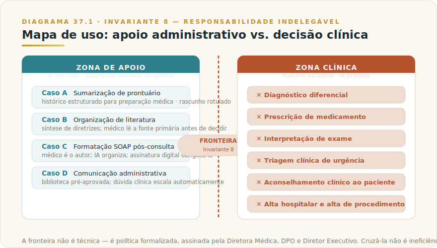
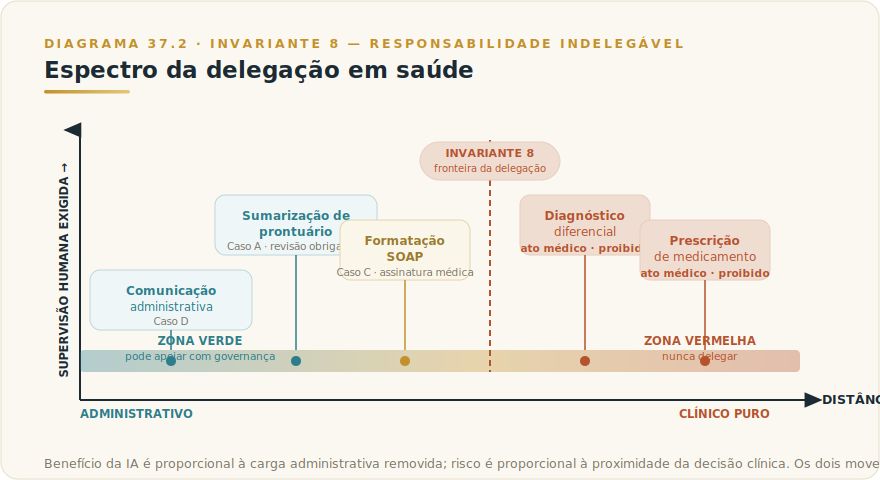

# CAPÍTULO 38
## CASOS — SETOR SAÚDE

---

> *"O médico que delega a decisão clínica à máquina não ganhou um assistente. Perdeu a consciência profissional — e, com ela, a proteção do paciente."*

---

> 🧭 **Por que este capítulo é a aplicação do Invariante 8 — Responsabilidade Indelegável**
>
> Em nenhum setor o Invariante 8 é mais literal e mais urgente do que em saúde. A regra "a IA executa; a responsabilidade tem sempre um nome humano" não é apenas uma questão de compliance ou de governança corporativa — é uma questão de vida. Decisão clínica envolve julgamento sobre corpos humanos, histórico singular de cada paciente, ética médica acumulada em décadas de regulação, e responsabilidade civil e criminal que o Conselho Federal de Medicina (CFM) atribui nominalmente ao profissional de saúde registrado. Nenhum contrato, nenhuma cláusula de sistema, nenhum log de IA substitui esse nome na certidão de responsabilidade. O setor de saúde não é apenas o caso mais sensível: é o caso onde a violação do Invariante 8 pode custar uma vida.
>
> **Invariante secundário relevante:** Invariante 1 — Plausibilidade. Em contexto clínico, a alucinação não é erro de formatação — é risco direto. Um modelo que inventa uma contraindicação farmacológica com a mesma fluência com que cita uma real não é apenas impreciso; é perigoso. A supervisão humana não é camada opcional de qualidade: é condição estrutural de segurança.
>
> Framework de referência: **F6 — Governança Indelegável** (3 camadas × 10 controles canônicos, com dono nominal por camada).

---

> ⚠️ **Este capítulo não constitui orientação médica, clínica, jurídica ou regulatória.** Os cenários apresentados são ilustrativos e compostos a partir de padrões gerais de adoção em saúde; não identificam nem recomendam qualquer instituição, produto ou protocolo específico. Decisões de adoção de IA em ambiente clínico devem ser tomadas em conjunto com o corpo clínico, o DPO da instituição, assessoria jurídica especializada em saúde, e em conformidade com as resoluções vigentes do CFM, da ANVISA e da LGPD. O capítulo descreve o que é tecnicamente possível e o que é eticamente necessário — não o que é suficiente para cada contexto regulatório específico.

---

## 38.1 — Panorama: por que saúde é o setor de maior sensibilidade

Em saúde, a tensão entre ganho de eficiência e responsabilidade sobre as consequências da IA não é apenas mais aguda — opera em dimensão diferente. O custo de um erro não é financeiro em primeira instância; é humano. E o conjunto regulatório que governa esse custo é o mais denso e o que atribui responsabilidade com mais clareza do que qualquer outro setor da economia brasileira.

### 38.1.1 — O que está em jogo

Três dimensões tornam saúde o setor de máxima sensibilidade para adoção de IA.

**Vida e integridade física.** Uma decisão clínica incorreta — seja de diagnóstico, prescrição, triagem, dosagem ou indicação de procedimento — pode causar dano irreversível. O padrão de cuidado exigido ao profissional de saúde é precisamente o que o Invariante 1 torna improvável de ser entregue por um modelo sem supervisão: exige verdade verificada, não plausibilidade estatística. O modelo erra com a mesma fluência com que acerta — e em saúde, a diferença pode não ser detectável antes de se tornar um evento adverso.

**Dados de categoria especial sob a LGPD.** A Lei Geral de Proteção de Dados (Lei 13.709/2018) classifica dados de saúde como **dados pessoais sensíveis** — categoria especial que exige base legal específica, medidas de segurança reforçadas e Relatório de Impacto à Proteção de Dados (RIPD) para tratamentos de risco. Prontuários, laudos, diagnósticos, prescrições e qualquer dado que permita inferir condição de saúde estão nessa categoria. A responsabilidade não se transfere ao fornecedor por força de nenhum contrato.

**Regulação setorial acumulada.** O setor de saúde brasileiro opera sob um conjunto normativo sem equivalente em outros setores: Código de Ética Médica, Resolução CFM 1.821/2007 sobre prontuário eletrônico, normas da ANVISA sobre softwares como dispositivo médico (SaMD), e jurisprudência que atribui responsabilidade civil ao médico e à instituição em caso de dano. A IA que participa de um fluxo clínico pode ser classificada como dispositivo médico se influenciar uma decisão diagnóstica ou terapêutica — ativando obrigações adicionais que a maioria das equipes de TI de saúde ainda subestima.

### 38.1.2 — O princípio estrutural da adoção responsável

A fronteira que governa todo uso responsável de IA em saúde é simples de enunciar e disciplinada de manter: **IA apoia tarefas que não afetam diretamente a decisão clínica, e cria material que o profissional de saúde revisa, avalia e assina antes que qualquer consequência ocorra.**

Isso não é conservadorismo tecnológico. É o que os próprios Invariantes prescrevem: Invariante 8 diz que a responsabilidade tem nome humano; Invariante 1 diz que o modelo entrega o plausível, não o verdadeiro. Em saúde, a distância entre plausível e verdadeiro pode ser a distância entre recuperação e óbito.

---

## 38.2 — O caso ilustrativo: Rede Esperança de Saúde

> ⚠️ **Cenário ilustrativo** — composto a partir de padrões observados em redes de clínicas e hospitais de médio porte no Brasil entre 2024 e 2026; todos os números são ficcionais e rotulados como tal; nenhum dado identifica instituição, profissional ou paciente específico.

### 38.2.1 — Contexto

| Dimensão | Detalhe (fictício, ilustrativo) |
|----------|---------------------------------|
| **Organização** | Rede Esperança de Saúde — 4 unidades ambulatoriais + 1 hospital de médio porte no interior de São Paulo |
| **Porte** | ~320 colaboradores, ~180 profissionais de saúde ativos (médicos, enfermeiros, técnicos) |
| **Especialidades principais** | Clínica geral, pediatria, ginecologia, ortopedia, cardiologia |
| **Sistema de prontuário** | Prontuário eletrônico do paciente (PEP) próprio; integração parcial com SADT |
| **Maturidade IA pré-projeto** | Zero — sem programa estruturado; uso informal de LLM por alguns médicos via apps pessoais sem políticas |
| **Gargalo principal** | Carga administrativa sobre médicos: documentação, sumarização, pesquisa de literatura, comunicação ao paciente |
| **Invariante ilustrado** | 8 — Responsabilidade Indelegável (primário) · 1 — Plausibilidade (secundário) |
| **Frameworks aplicados** | F6 GOV-INDELEGÁVEL, F8 EVAL-PIRÂMIDE, F1 DECID-IA |

### 38.2.2 — O problema

A Diretora Médica identificou, em auditoria interna, que os médicos da rede gastavam em média **42 minutos por turno** em tarefas documentais que não exigiam julgamento clínico: revisar e reorganizar anotações de consulta para o PEP, pesquisar literatura para dúvidas de conduta, redigir cartas de encaminhamento, formatar relatórios de alta, e preparar comunicados de orientação ao paciente.

Ao mesmo tempo, o setor de atendimento recebia reclamações sobre **demora no retorno de dúvidas administrativas**: tempo de preparo de exame, instruções pós-consulta, agendamento, explicação de coberturas de convênio. Essas dúvidas chegavam por WhatsApp e telefone, eram respondidas manualmente pela equipe administrativa, e acumulavam fila.

O problema não era falta de competência — era alocação errada de esforço. Médicos documentando quando deveriam estar no contato clínico; administrativos respondendo dúvidas técnicas de saúde que não eram de sua alçada.

### 38.2.3 — A tese inicial errada

O primeiro projeto proposto por um fornecedor externo era um "assistente clínico inteligente" que, a partir da gravação da consulta, geraria automaticamente o diagnóstico sugerido e o rascunho de prescrição para o médico "apenas assinar". A proposta violava os Invariantes de maneira estrutural:

- **Viola Inv. 8 (Responsabilidade Indelegável):** o ato de "apenas assinar" um diagnóstico e uma prescrição gerados autonomamente inverte a lógica da responsabilidade clínica. O CFM atribui ao médico a responsabilidade pelo ato médico — diagnóstico, conduta e prescrição. Um sistema que gera esses elementos e coloca o médico na posição de revisor de output cria ambiguidade jurídica e ética inaceitável.

- **Viola Inv. 1 (Plausibilidade):** o modelo que transcreve e sintetiza uma consulta pode produzir um diagnóstico diferencial plausível — não correto. Uma contraindicação farmacológica não mencionada, uma comorbidade relatada brevemente, um dado de exame anterior fora da janela de contexto: esses são os casos onde a diferença entre plausível e verdadeiro é clinicamente relevante e invisível para quem "apenas assina".

- **Risco regulatório:** a proposta poderia enquadrar o software como dispositivo médico de Classe II ou III sob critérios da ANVISA, ativando requisitos de registro que o fornecedor não possuía.

A Diretora Médica, com apoio do DPO da rede, rejeitou a proposta. A reformulação partiu de uma pergunta diferente: **onde a IA pode poupar esforço sem nunca tocar na decisão clínica?**

---

## 38.3 — Arquitetura de apoio: o que foi construído

A decisão foi estruturar o uso de IA estritamente no lado **administrativo e de suporte à documentação** — jamais no lado clínico. A fronteira foi traçada como política, não como preferência, e formalizada em documento assinado pela Diretora Médica, pelo DPO e pelo Diretor Executivo.

### 38.3.1 — Os quatro casos de uso aprovados

**Caso A — Sumarização de prontuário para revisão médica**

Antes de cada consulta de retorno, o sistema gera um sumário estruturado do histórico do paciente no PEP: últimas consultas, exames recentes, medicamentos em uso, alergias registradas, pendências de acompanhamento. O sumário é entregue ao médico como material de preparação — **nunca como diagnóstico, nunca como conduta**. O médico lê, verifica os pontos que julgar necessário contra o prontuário completo, e conduz a consulta com seu próprio julgamento. O sumário é marcado visualmente como "material de apoio — sujeito a revisão médica" e não é incorporado ao prontuário até que o médico o revise e edite.

Critério de fronteira: o sumário descreve o passado (o que foi registrado). Não sugere diagnóstico, não recomenda conduta, não propõe prescrição.

**Caso B — Organização de literatura para suporte a dúvidas de conduta**

Quando um médico tem dúvida sobre conduta em caso específico, pode solicitar ao sistema uma síntese de diretrizes clínicas de fontes autorizadas (protocolos do Ministério da Saúde, diretrizes de AMB, SBC, SBP, disponíveis publicamente). O sistema organiza e apresenta os documentos com citação da fonte original. **O médico lê as fontes primárias antes de qualquer decisão.** O sistema nunca afirma "a conduta correta é X"; apresenta "a diretriz Y da sociedade Z, publicada em [data], recomenda..." com referência para o documento original.

Critério de fronteira: o sistema organiza informação de fonte autoritativa verificável; não gera recomendação clínica própria.

**Caso C — Apoio à documentação clínica pós-consulta**

Após a consulta, o médico usa o sistema para transformar suas anotações em rascunho estruturado de evolução clínica para o PEP. O fluxo é: médico dita ou digita anotações livres → sistema organiza em estrutura SOAP (Subjetivo, Objetivo, Avaliação, Plano) → médico revisa, edita, corrige, e **assina digitalmente o documento final**. O documento que vai ao prontuário é o que o médico assinou — o rascunho do sistema é apenas andaime de formatação.

Critério de fronteira: o conteúdo clínico (diagnóstico, conduta, plano terapêutico) é integralmente do médico. O sistema formata; o médico é o autor.

**Caso D — Comunicação administrativa ao paciente**

O sistema apoia a equipe administrativa na redação de comunicados padronizados: instruções de preparo de exame (conforme protocolo da instituição), orientações pós-consulta genéricas, confirmações de agendamento, respostas a dúvidas sobre convênio e cobertura. **Nenhuma orientação clínica individualizada** (dosagem, substituição de medicamento, manejo de sintoma específico) é gerada sem revisão de enfermagem ou médico. O sistema usa biblioteca de respostas pré-aprovadas pela equipe clínica para as categorias padronizadas.

Critério de fronteira: comunicação de protocolo institucional aprovado, não aconselhamento clínico. Qualquer dúvida com componente clínico individualizado é escalada automaticamente para profissional de saúde.

### 38.3.2 — O que foi explicitamente proibido

A política formalizada lista proibições nominais, treinadas com todos os usuários do sistema:

| Proibido | Justificativa |
|----------|---------------|
| IA sugerindo diagnóstico diferencial | Ato médico sob CFM; Inv. 1 (alucinação com aparência clínica) |
| IA recomendando medicamento, dose ou via | Prescrição é ato médico; risco direto ao paciente |
| IA avaliando resultado de exame | Interpretação diagnóstica é ato médico |
| IA respondendo dúvida clínica diretamente ao paciente | Aconselhamento médico sem registro, sem CRM, sem responsabilização |
| Prontuário gerado por IA sem revisão e assinatura médica | Viola regulamentação CFM sobre prontuário eletrônico |
| Dados de paciente em prompt sem anonimização fora do ambiente seguro | Dado sensível LGPD; proibido fora de ambiente controlado com DPA |
| Uso de conta pessoal de LLM com dados de paciente | Dados fora do perímetro do DPA; violação de LGPD e política interna |

---

## 38.4 — Governança e supervisão clínica

### 38.4.1 — Estrutura de responsabilidade (F6 GOV-INDELEGÁVEL)

| Camada | Item | Dono nominal |
|--------|------|--------------|
| **Técnica** | Ambiente isolado com DPA; auditoria de todos os prompts que envolvem dado de paciente; controle de acesso por papel (médico, enfermeiro, administrativo, TI); anonimização antes de qualquer log; kill switch por caso de uso em 30 min | Diretor de TI + DPO |
| **Operacional** | Política de uso aceitável (AUP) em linguagem clínica; treinamento obrigatório de todos os usuários antes do acesso; RACI assinado; runbook de incidente para vazamento de dado de saúde; revisão mensal de casos de borda | Diretora Médica + DPO |
| **Executiva** | Comitê de ética em IA — reunião bimestral com representação médica, jurídica e de gestão; política pública de uso de IA disponível aos pacientes; declaração de responsabilidade nominal por caso de uso | Diretora Executiva |

### 38.4.2 — Dados de saúde e LGPD: o perímetro inegociável

Dados de pacientes são dados sensíveis sob LGPD art. 11, com base legal restrita. Antes do projeto, a rede mapeou:

1. **Controlador e operador:** a rede é controladora; o fornecedor de IA é operador. DPA formalizado com cláusulas de sub-operador, proibição de uso dos dados para treinamento de modelos, e deleção ao fim do contrato.

2. **RIPD:** elaborado para cada caso de uso que envolve dado de saúde. O Caso A (sumarização) e o Caso C (documentação) foram os mais rigorosos.

3. **Anonimização para desenvolvimento e teste:** qualquer prompt de teste usa dados sintéticos ou anonimizados irreversivelmente. Nenhum dado real de paciente entra em ambiente de desenvolvimento.

4. **Consentimento informado ao paciente:** a rede incluiu cláusula específica no termo de consentimento informando o uso de sistemas de IA para suporte administrativo e de documentação, com o direito de optar por atendimento sem IA.

### 38.4.3 — O Invariante 1 em contexto clínico: por que a alucinação é problema diferente aqui

Em outros setores, uma alucinação gera um dado incorreto que o operador humano identifica e corrige antes que cause impacto. Em saúde, três características tornam o risco do Invariante 1 qualitativamente diferente:

**Confiança assimétrica.** Um profissional sob carga cognitiva alta — plantão, múltiplos pacientes, pressão de tempo — pode não ter capacidade para questionar um sumário que "parece correto". A plausibilidade do modelo imita a estrutura de um dado real; a detecção exige atenção ativa que o contexto de trabalho frequentemente não proporciona.

**Consequência não linear.** Em atendimento ao cliente, um erro gera insatisfação. Em saúde, um dado incorreto sobre alergia, dosagem ou histórico de evento adverso pode gerar dano físico antes que qualquer revisão posterior o corrija.

**Irreversibilidade de ações clínicas.** Um medicamento administrado, um procedimento iniciado, uma informação incorreta comunicada ao paciente — esses eventos não têm rollback clínico equivalente ao rollback de um sistema de TI.

A resposta da rede foi estrutural: **o sistema nunca apresenta seu output como fato clínico estabelecido.** Todo output é rotulado como rascunho ou síntese de fonte — e o fluxo exige etapa explícita de revisão antes de qualquer consequência clínica.

---

## 38.5 — Resultados do cenário ilustrativo

> ⚠️ Os números abaixo são fictícios, construídos para ilustrar ordem de grandeza plausível. Não representam métricas de nenhuma instituição real.

| Métrica | Pré-projeto (fictício) | 12 meses (fictício) |
|---------|------------------------|---------------------|
| Tempo médio de documentação por turno médico | 42 min | 18 min |
| Satisfação médica com carga administrativa (escala 1–5) | 2,8 | 4,1 |
| Tempo médio de resposta a dúvidas administrativas | 4h | 45 min |
| Incidentes de dado de saúde fora do perímetro seguro | — | 0 |
| Casos escalados por dúvida clínica indevida (Caso D) | n/a | 100% (política funcionou) |
| Retorno de paciente em consulta de acompanhamento | 61% | 68% |

O ganho mais significativo não foi operacional — foi de alocação. Médicos com menos carga de documentação passaram mais tempo em contato clínico real com o paciente. A melhora no retorno de consulta de acompanhamento foi atribuída pela Diretora Médica, ao menos parcialmente, a esse resultado.

A política de escalação do Caso D funcionou sem exceção: em todos os casos em que um paciente fez pergunta com componente clínico individualizado pelo canal administrativo, o sistema sinalizou e não respondeu.

---

## 38.6 — A linha que não se cruza: transferência de critério

O ganho real de um caso como este não está na lista de funcionalidades ativas — está no entendimento estrutural de **por que a fronteira existe**, de forma que ela sobreviva à rotatividade de gestores, à pressão por eficiência, e à próxima geração de modelos.

O critério transferível é este: **em saúde, o benefício da IA é proporcional à carga administrativa que ela remove do profissional; o risco da IA é proporcional ao quanto ela se aproxima da decisão clínica.** Os dois movem em direções opostas. O objetivo da governança é maximizar o primeiro sem tocar o segundo.

### 38.6.1 — O que pode ser apoiado por IA em saúde

| Categoria | Descrição | Condição obrigatória |
|-----------|-----------|----------------------|
| Sumarização de histórico | Organizar e estruturar dados já registrados no PEP | Revisão médica obrigatória antes de uso; rotulado como rascunho |
| Formatação de documentação | Transformar anotações médicas em estrutura formal (SOAP, relatório de alta) | Médico é autor; IA é formatador; assinatura digital do médico |
| Organização de literatura | Apontar diretrizes e protocolos relevantes de fontes autoritativas | Médico lê fonte primária; IA não afirma a conduta correta |
| Comunicação administrativa padronizada | Respostas a dúvidas não clínicas: preparo de exame, agendamento, convênio | Biblioteca aprovada pela equipe clínica; escalação automática para o clínico |
| Apoio à pesquisa clínica | Síntese de literatura científica para revisão de pesquisador | Pesquisador verifica fontes primárias; não se aplica a decisão clínica direta |
| Transcrição e organização de anamnese | Apoio à estruturação de texto ditado pelo médico | Médico revisa e assina; nunca geração autônoma de anamnese |

### 38.6.2 — O que NUNCA pode ser delegado à IA em saúde

| Categoria | Por que a fronteira é absoluta |
|-----------|-------------------------------|
| **Diagnóstico** | Ato médico; responsabilidade civil e criminal nominal ao CRM; Inv. 1 (alucinação clínica plausível) |
| **Prescrição de medicamento** | Ato médico; risco farmacológico direto; impossível auditoria de responsabilidade se gerado por IA |
| **Indicação de procedimento** | Julgamento clínico individualizado; o histórico completo raramente está integralmente disponível ao modelo |
| **Interpretação de exame** | Ato médico ou de biomédico; requer formação e licença específica |
| **Aconselhamento clínico individualizado ao paciente** | Requer CRM/COREN; sem registro formal; responsabilidade indefinível |
| **Triagem clínica de urgência** | Risco de classificação de risco incorreta com consequência de morte; nenhum sistema de IA está homologado para triagem de Manchester autônoma no Brasil |
| **Alta hospitalar e liberação de paciente** | Decisão clínica de alta complexidade com responsabilidade formal do médico assistente |
| **Qualquer decisão com dado de paciente sem DPA e sem base legal LGPD** | Ilegal sob LGPD art. 11; dado de saúde é categoria especial |

---

## 38.7 — A armadilha da normalização gradual

> ⚠️ **POSTMORTEM — O sumário que cruzou a linha clínica**
> *O que tentaram:* em uma clínica de médio porte com copiloto de sumarização de prontuário já em operação estável, a equipe de TI expandiu o escopo — sem aprovação da Diretora Médica — para incluir uma sugestão de "próximos passos" ao final de cada sumário pré-consulta. A intenção era poupar tempo ao médico. *O que quase deu errado:* em três semanas de operação silenciosa, o sistema gerou sugestões de conduta que médicos, sob pressão de tempo, começaram a aceitar sem questionar. Em um caso, o modelo sugeriu "considerar ajuste de anti-hipertensivo" com base em leituras de PA registradas no PEP — sem ter acesso ao histórico completo de medicamentos. O médico ajustou a dose. O evento adverso foi identificado na consulta seguinte. *O Invariante violado:* Inv. 8 — Responsabilidade Indelegável. A fronteira entre sumarização administrativa e sugestão clínica foi cruzada sem decisão consciente de ninguém. *O que evitou (ou teria evitado):* a política formal de proibição listada pela Diretora Médica — que foi contornada por uma atualização de funcionalidade não auditada. Um processo de change management que exigisse aprovação clínica e atualização do AUP antes de qualquer mudança de escopo. (cenário composto ilustrativo; ver [Apêndice K — Os 9 Modos de Falha](../04-apendices/L2-APX-K-modos-de-falha.md))

Um risco específico de adoção em saúde que não aparece nos checklists técnicos: a **normalização gradual do desvio**. Um sistema implantado com a fronteira correta hoje pode, ao longo de meses, ter sua fronteira deslocada por pressão de eficiência, por confiança crescente no modelo, por rotatividade de profissionais que não passaram pelo treinamento original.

O padrão observado: no primeiro mês, todos revisam tudo. No sexto, alguns passam rápido pelo sumário. No décimo segundo, o sumário é aceito como prontuário sem revisão minuciosa. No décimo oitavo, um médico novo usa o output como se fosse laudo.

A governança que protege contra esse padrão não é técnica — é cultural e processual:

1. **Treinamento obrigatório de integração** antes de qualquer acesso, com renovação anual.
2. **Auditoria periódica de uso**, verificando se os fluxos de revisão obrigatória estão sendo cumpridos.
3. **Incidente-teste semestral**: o DPO e a Diretora Médica introduzem deliberadamente um caso de borda e verificam se o protocolo de escalação funciona como projetado.
4. **Feedback do corpo clínico** como canal permanente: médicos que encontram outputs problemáticos têm caminho direto para reportar, sem burocracia.

A fronteira não é uma configuração. É uma disciplina.

---

## 38.8 — NA PRÁTICA: APLIQUE NA SUA ORGANIZAÇÃO

O caso da Rede Esperança ilustrou como uma rede de clínicas traçou a fronteira entre IA administrativa e ato médico. Esta seção traduz esse padrão em aplicações que qualquer organização de saúde — hospital, clínica, operadora, laboratório — pode adaptar ao próprio contexto.

**Aplicação 1 — Sumarização de histórico para consultas de retorno.**
*Situação:* médicos de sua rede gastam tempo de consulta relendo o histórico do paciente no PEP antes de iniciar o atendimento, especialmente em retornos com histórico longo. Isso comprime o tempo de contato clínico real. *O que fazer:* configure o sistema para gerar, antes de cada consulta de retorno agendada, um sumário estruturado do histórico relevante — últimas consultas, medicamentos em uso, alergias, exames recentes, pendências de acompanhamento. Entregue o sumário ao médico como material de preparação, rotulado como "rascunho para revisão". O médico lê, verifica os pontos críticos contra o prontuário completo, e conduz a consulta com seu julgamento. O sumário não vai ao prontuário sem revisão e edição médica. *O ponto de julgamento:* o médico é o único autor de qualquer registro clínico. Se o sumário contém uma imprecisão e o médico não detecta porque não revisou com atenção, a responsabilidade clínica e jurídica continua sendo do médico. A revisão não é formalidade: é o momento onde o profissional exerce o julgamento que a sua formação e o seu CRM autorizam (Invariante 8).

**Aplicação 2 — Comunicação administrativa padronizada ao paciente com escalação automática.**
*Situação:* sua equipe administrativa recebe volume alto de mensagens de pacientes com dúvidas misturadas — algumas puramente administrativas (horário, preparo de exame, agendamento), outras com componente clínico que exigem profissional de saúde. *O que fazer:* construa uma biblioteca de respostas padronizadas aprovadas pela equipe clínica para as categorias puramente administrativas. Configure o sistema para usar essa biblioteca nas categorias autorizadas e sinalizar automaticamente — sem responder — qualquer mensagem com componente clínico individualizado, encaminhando para o profissional adequado. Audite mensalmente uma amostra das sinalizações para verificar se a fronteira está funcionando conforme projetado. *O ponto de julgamento:* a linha entre "preparo padrão para colonoscopia" (protocolo institucional, pode ser automatizado) e "minha pressão está alta, posso tomar o laxante mesmo assim?" (componente clínico individualizado, precisa de profissional) é onde o sistema demonstra se foi configurado por quem entende a diferença. Se você não tem clareza sobre onde essa linha está no seu contexto, o piloto precisa começar com supervisão clínica próxima, não com automação plena (Invariante 8; Invariante 1).

**Aplicação 3 — Apoio à documentação clínica pós-consulta com médico como autor.**
*Situação:* médicos de sua organização gastam minutos preciosos pós-consulta formatando anotações livres na estrutura exigida pelo PEP. O conteúdo é deles; a formatação é trabalho mecânico. *O que fazer:* permita que o médico dite ou insira suas anotações e use o modelo para estruturá-las no formato institucional (SOAP, relatório de alta, encaminhamento). O médico revisa o rascunho, edita o que for necessário — especialmente diagnóstico, conduta e plano terapêutico — e assina digitalmente. Registre explicitamente na política que o conteúdo clínico é integralmente do médico e que a IA apenas formatou. Monitore se os médicos estão de fato editando antes de assinar — esse drift é o sinal de normalização gradual descrito no Cap. 38.7. *O ponto de julgamento:* um diagnóstico que o modelo "formatou" de forma diferente do que o médico ditou e que o médico assinou sem reler passou a ser responsabilidade do médico. Se o fluxo de trabalho não cria espaço real para revisão, o fluxo precisa ser redesenhado — não a política (Invariante 8).

> 🔧 **EXERCÍCIO**
> Mapeie em sua organização de saúde uma tarefa que profissionais de saúde realizam atualmente e que você considera candidata a apoio de IA. Escreva três itens: (1) qual é o output gerado pela IA e quem o revisa antes de qualquer consequência clínica ou registro; (2) qual é o critério explícito que o revisor usa para aceitar ou rejeitar o output — se o critério não existe por escrito, ele não é consistente; (3) em dezoito meses, com rotatividade de profissionais e pressão de eficiência, o que poderia fazer com que a revisão se tornasse superficial ou desapareça? Para cada risco identificado no item 3, escreva o controle estrutural correspondente. Se você não consegue responder os três itens, a fronteira ainda não está suficientemente clara para ir a produção com segurança.

---

## 38.9 — Camada Viva

> 🔄 **Camada Viva — [Apêndice J, Seção Saúde](../04-apendices/L2-APX-J-apendice-vivo.md)**
>
> Os seguintes elementos deste capítulo são tratados como Camada Viva e devem ser verificados no Apêndice J antes de qualquer decisão concreta de adoção:
> - Status regulatório atualizado do CFM sobre IA em prontuário e ato médico
> - Classificação de IA como SaMD (Software as Medical Device) pela ANVISA e critérios vigentes de registro
> - Orientações atualizadas da ANPD sobre RIPD para sistemas de saúde
> - Status de projetos de lei sobre uso de IA em saúde no Congresso Nacional
> - Versões e cláusulas vigentes dos DPAs dos principais fornecedores de IA para saúde
> - Desenvolvimentos do CFM sobre telemedicina e IA no ato médico

---

## 38.10 — Conexões

- 🔗 **Invariante 8 (Responsabilidade Indelegável)** → [Manifesto — Os Nove Invariantes](../../Livro-1-Os-Invariantes/01-manifesto/L1-C00M-manifesto-invariantes.md) · [Framework F6 — Governança Indelegável](../../Livro-1-Os-Invariantes/03-frameworks/L1-F6-gov-indelegavel.md)
- 🔗 **Invariante 1 (Plausibilidade)** → [Manifesto — Os Nove Invariantes](../../Livro-1-Os-Invariantes/01-manifesto/L1-C00M-manifesto-invariantes.md)
- 🔗 **Governança executiva de IA** → [Capítulo 42 — Governança Executiva](L2-C42-governanca-executiva.md)
- 🔗 **LGPD, dados sensíveis e compliance** → [Capítulo 45 — Segurança, Compliance e LGPD](L2-C45-seguranca-compliance-lgpd.md)
- 🔗 **Processamento de documentos e imagens médicas** → [Capítulo 34 — Vision](L2-C34-vision.md)
- 🔗 **Avaliação e evals em sistemas de saúde** → [Capítulo 35 — Evaluations](L2-C35-evaluations.md)
- 🔗 **Apêndice Vivo (dados regulatórios voláteis)** → [Apêndice J](../04-apendices/L2-APX-J-apendice-vivo.md)

---

## 38.11 — Resumo executivo

| Conceito | Síntese |
|----------|---------|
| **O invariante regente** | 8 — Responsabilidade Indelegável: em saúde, o profissional de saúde decide e responde — sempre, sem exceção |
| **Invariante secundário crítico** | 1 — Plausibilidade: alucinação em contexto clínico é risco de dano físico, não apenas imprecisão |
| **Dados de paciente** | Categoria especial LGPD; exigem DPA, RIPD, base legal específica, e consentimento informado |
| **O que a IA pode fazer** | Sumarizar histórico para revisão médica; organizar literatura; apoiar documentação; comunicação administrativa padronizada |
| **O que a IA nunca faz** | Diagnóstico, prescrição, interpretação de exame, triagem clínica autônoma, aconselhamento clínico individualizado |
| **A fronteira estrutural** | IA apoia tarefas sem consequência clínica direta; médico revisa, edita, e assina tudo que vai ao prontuário ou ao paciente |
| **Armadilha principal** | Normalização gradual do desvio: a fronteira erode com o tempo sem treinamento, auditoria e cultura |
| **Ganho real** | Devolução de tempo ao cuidado: médico com menos carga administrativa tem mais capacidade clínica — esse é o ROI correto do Invariante 8 |

---

## 38.12 — Validação UAU

| # | Critério | Você consegue? |
|---|----------|----------------|
| 1 | **Clareza** — Explicar em 60 segundos por que diagnóstico por IA, mesmo que tecnicamente plausível, viola o Invariante 8 em saúde | ☐ |
| 2 | **Distinção** — Dar três exemplos concretos de tarefa que IA pode apoiar em saúde e três que são absolutamente proibidas, com a justificativa de cada | ☐ |
| 3 | **Dado sensível** — Explicar o que é necessário fazer antes de colocar qualquer dado de paciente num prompt de IA (base legal, DPA, RIPD) | ☐ |
| 4 | **Alucinação clínica** — Descrever por que Invariante 1 é qualitativamente mais perigoso em saúde do que em outros setores | ☐ |
| 5 | **Governança** — Identificar três mecanismos que evitam a normalização gradual do desvio ao longo de 18 meses de operação | ☐ |

---

> *"Devolver ao médico o tempo que a máquina pode salvar não é uma promessa de eficiência. É o cumprimento do que o Invariante 8 exige: que o nome na responsabilidade clínica seja humano, consciente, e presente no momento que importa. A IA que libera o médico para cuidar mais é a IA que entende seu lugar."*
