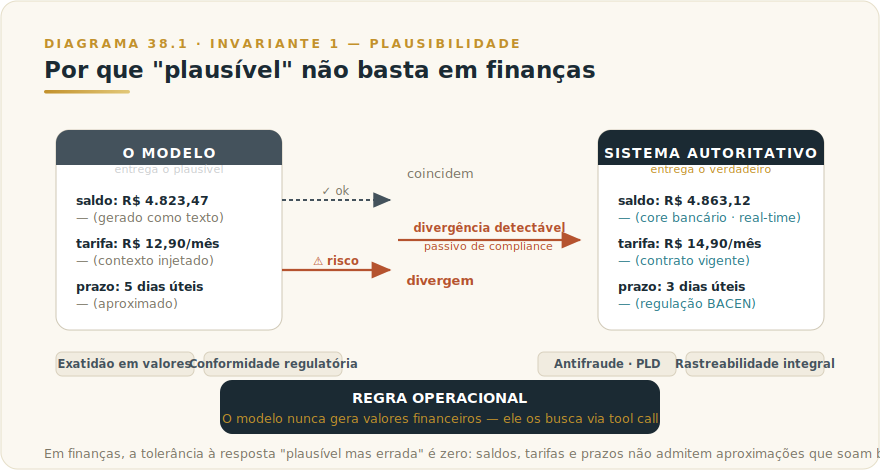
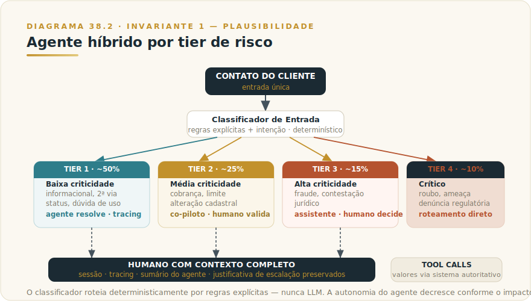

# CAPÍTULO 39
## CASOS — SETOR FINANCEIRO

---

> *"Em finanças, o modelo não precisa mentir para causar dano — basta soar certo sobre o número errado."*

---

> 🧭 **Invariante 1 — Plausibilidade**
>
> *"O modelo entrega o plausível, não o verdadeiro — e os dois coincidem, até a hora em que não."*
>
> Em qualquer setor, uma saída plausível e incorreta é inconveniente. Em finanças e banking, é incidente de compliance, passivo regulatório ou perda material. O setor eleva o custo de violação do Invariante 1 a um nível em que a tolerância a zero é a única política racional: saldos, tarifas, elegibilidades, limites de crédito e prazos legais não admitem "aproximações que soam bem". O capítulo demonstra como esse critério se traduz em arquitetura concreta — e entrega o que transfere para a sua instituição.
>
> O framework teórico do Invariante 1 está em **[L1 — Manifesto dos Invariantes](../../Livro-1-Os-Invariantes/01-manifesto/L1-C00M-manifesto-invariantes.md)** (Livro 1). Este capítulo é a aplicação setorial, não a repetição da teoria.

---

## 39.1 — Panorama: por que finanças exige mais do que plausível

O setor financeiro tem uma particularidade que nenhuma outra vertical replica com a mesma intensidade: a precisão de uma saída de IA é auditável. Um valor de saldo, uma tarifa, uma elegibilidade ou um prazo de contestação não é opinião — é um dado que existe no core bancário, na regulação publicada pelo BACEN, no contrato assinado. Quando o modelo diverge desse dado, o desvio é detectável, documentável e pode ter consequência jurídica.

Isso cria quatro exigências que distinguem o setor financeiro de verticais com menor custo de erro:

**Exatidão em valores e datas.** Uma alucinação de R$ 50 em tarifa ou de dois dias em prazo regulatório não é imprecisão aceitável. É, dependendo do contexto, motivo de reclamação no BACEN, ação no Procon e dano de imagem mensurável. O Invariante 1 se manifesta aqui na forma mais literal: o modelo não pode gerar números financeiros. Deve buscá-los.

**Conformidade regulatória.** A Resolução CMN 4.949/2021, a Circular BACEN 3.978/2020 (prevenção à lavagem de dinheiro) e a LGPD (Art. 20 — decisões automatizadas) criam obrigações não negociáveis. Um sistema de IA que opera em atendimento ou análise de crédito precisa ser auditável: qual dado usou, quando, com qual decisão. "O modelo decidiu" não é resposta para um auditor regulatório.

**Antifraude e prevenção à lavagem.** Modelos de linguagem são maleáveis por design — é o que os torna úteis. Essa maleabilidade, sem controles adequados, é um vetor de manipulação: um cliente bem articulado pode tentar extrair informações de outros titulares, forjar contexto de urgência para operações não autorizadas, ou usar o agente como canal para prompt injection.

**Rastreabilidade integral.** Qualquer decisão que afete saldo, crédito, contestação ou conformidade precisa ter trilha de auditoria imutável. O BACEN exige que instituições financeiras conservem logs de operações por prazo mínimo. Um agente que resolve ticket sem deixar rastro auditável não é uma solução incompleta: é um problema de compliance.

Em termos práticos: uma fintech de médio porte com dois milhões de clientes ativos recebe dezenas de milhares de contatos por mês envolvendo valores, tarifas ou contestações. Se o agente gerar respostas com margem de erro de 1% nesses casos, o custo anualizado — em ressarcimentos, reclamações regulatórias e erosão de NPS — excede em larga margem qualquer economia operacional que o agente poderia proporcionar.

---

## 39.2 — O Caso: Banco Solar — de atendimento humano a agente híbrido com governança

> ⚠️ **Cenário ilustrativo** — composto a partir de padrões observados em fintechs brasileiras com produto de cartão de crédito e conta de pagamento entre 2024 e 2026; números são realistas mas não identificam empresa específica.

### 39.2.1 — Contexto

| Dimensão | Detalhe |
|----------|---------|
| **Setor** | Fintech BR (cartão + conta de pagamento) |
| **Tamanho** | ~450 colaboradores, 2,1 milhões de clientes ativos |
| **Maturidade IA** | Início — sem programa estruturado de IA antes do projeto |
| **NPS pré-projeto** | 58 |
| **Custo de atendimento pré-projeto** | R$ 18,40 por contato (ilustrativo) |
| **Volume de tickets** | Crescimento de 40% a/a |
| **Backlog médio** | 14h horário comercial · 36h fora do horário |
| **Turnover Nível 1** | >70%/ano |

O Banco Solar enfrentava uma combinação clássica de escala e atrito: volume crescendo acima da capacidade de contratar e treinar atendentes, CSAT em declínio (4,1 → 3,8 em 18 meses) e backlog suficientemente alto para transformar qualquer dúvida simples em experiência ruim. A diretoria recebeu três propostas: duas de chatbot baseado em regras, uma de "agente full autônomo com LLM de última geração".

### 39.2.2 — A tese inicial errada — e por que violava o Invariante 1

A proposta de agente full autônomo prometia resolver 80% dos contatos sem humano, com tempo médio de resposta de segundos. O CTO aplicou o **F1 DECID-IA** (Livro 1) e identificou três violações fundamentais antes de assinar qualquer contrato.

A primeira era diretamente o Invariante 1. A proposta assumia que o modelo geraria respostas sobre saldos, tarifas e limites a partir de contexto injetado na conversa. O CTO perguntou: "E se o contexto injetado estiver desatualizado em dois minutos?" A resposta do fornecedor foi: "O modelo usa o que você injeta." Exatamente o problema. Em finanças, a diferença entre o saldo às 14h e o saldo às 14h02 pode ser uma transação liquidada. Um modelo que gera texto plausível com base em contexto potencialmente desatualizado não está resolvendo o problema — está criando um passivo de compliance com interface conversacional.

A segunda violação era de **Invariante 8 — Responsabilidade Indelegável**: o agente full autônomo não tinha RACI, dono nominal nem runbook de incidente. "O modelo decide" não é estrutura de governança; é ausência dela.

A terceira era de **Invariante 7 — Termômetro**: a proposta não incluía golden set, critério de aceitação nem política de rollback. "Vamos monitorar no piloto" é fé operacional, não engenharia.

O CTO parou a iniciativa nesse formato e reformulou.

### 39.2.3 — Arquitetura escolhida: agente híbrido por tier de risco

A reformulação partiu de um princípio simples que o Invariante 1 impõe no setor financeiro: **o modelo nunca gera valores financeiros — ele os busca**. Toda informação de saldo, tarifa, limite, contestação ou prazo legal é obtida via tool call a sistemas autoritativos. O agente pode raciocinar sobre esses valores, formatar uma resposta, escalar ou orientar. Não pode inventar.

Com esse princípio estabelecido, a arquitetura foi construída em quatro tiers de risco, com autonomia calibrada ao impacto de um erro em cada categoria:

| Tier de risco | Volume estimado | Tipo de ticket | Nível de autonomia |
|---------------|-----------------|----------------|--------------------|
| **Tier 1 — Baixa criticidade** | ~50% | Informacional, segunda via, status, dúvida de uso | Agente supervisionado resolve ou escala; tracing online |
| **Tier 2 — Média criticidade** | ~25% | Dúvida sobre cobrança, pedido de limite, alteração cadastral | Co-piloto assíncrono: agente prepara, humano valida em até 4h |
| **Tier 3 — Alta criticidade** | ~15% | Fraude, contestação, jurídico, vulnerabilidade financeira | Assistente apenas: humano decide; agente gera sumário pré-atendimento |
| **Tier 4 — Crítica** | ~10% | Cancelamento por roubo, ameaça à pessoa, denúncia regulatória | Roteamento direto ao humano; sem agente na decisão |

A classificação por tier é feita por um classificador de entrada com regras explícitas (regex + classificação de intenção), instrumentado com tracing e golden set próprio para detectar regressão. A coordenação entre tiers é determinística — código, não LLM. O orquestrador roteia conforme o tier classificado, reduzindo o risco de comportamento emergente no caminho crítico.

Em qualquer tier, a escalação para humano preserva contexto completo: sessão com tracing, sumário do agente e justificativa de escalação. O humano que assume um Tier 3 não começa do zero — recebe o estado completo da interação.

### 39.2.4 — Tools: o mecanismo que operacionaliza o Invariante 1

A regra "modelo nunca gera valores financeiros" se implementa via tools com permissões explícitas por tier. Cada tool tem dono nominal, auditoria por chamada e retenção de log definida. Nenhum valor financeiro que chega ao cliente é texto gerado pelo modelo: é retorno literal de uma tool call a sistemas autoritativos.

| Tool | Tiers autorizados | Permissão | Auditoria |
|------|-------------------|-----------|-----------|
| `consulta_conta` | 1, 2, 3 | Read | Span por chamada, retenção mínima 5 anos |
| `gera_segunda_via` | 1, 2 | Write (idempotente) | Span + assinatura no sistema bancário |
| `consulta_limite` | 1, 2, 3 | Read | Span por chamada |
| `solicita_revisao_limite` | 2 | Write (compensável) | Span + aprovação humana obrigatória |
| `abre_contestacao_minor` | 2, 3 | Write (compensável) | Span + revisão humana antes de execução |
| `escala_para_humano` | Todos | Sinal | Span |
| `consulta_historico` | 1, 2, 3 | Read | Span + classificação de PII |

As tools internas do core bancário ficam no quadrante de maior controle: MCP próprio com auditoria completa, dono nominal (Diretor de Tecnologia + DPO + Compliance), retenção de log por no mínimo 5 anos para qualquer chamada com efeito sobre saldo, transação ou contestação — alinhado à LGPD Art. 20 e às exigências regulatórias do BACEN.

Para o mecanismo de tool use, consulte o [Capítulo 23 — Tool Use](../02-capitulos/L2-C23-tool-use.md).

### 39.2.5 — Controles: a camada que garante rastreabilidade

A arquitetura de tools não basta se o que acontece entre as chamadas não for auditável. O Banco Solar implementou três camadas de controle correspondentes ao que o setor financeiro exige:

**Camada técnica.** Tracing OpenTelemetry GenAI com cobertura de 100% das chamadas. Rollback testado mensalmente. Kill switch por tool em 30 segundos. Política de bloqueio em CI com threshold de faithfulness em dados financeiros ≥ 0,98 — delta máximo de 0,5 pontos contra baseline antes de barrar deploy. Adversarial mensal com casos de: jailbreak via campo livre do cliente, sycophancy diante de cliente agressivo, indução a fraude (cliente fingindo ser titular), pedido de quebra de sigilo, over-refusal frustrando cliente legítimo, e vazamento de PII em sumário.

**Camada operacional.** RACI assinado pela diretoria antes do piloto. Política de uso aceitável em quatro páginas. Runbook de incidente SEV-1 com SLA de 15 minutos. Treinamento de atendentes nos novos fluxos de escalação.

**Camada executiva.** AI Council mensal. Comitê de revisão semanal de incidentes. Comunicação trimestral com Conselho sobre indicadores operacionais do sistema.

O ponto crítico do Invariante 1 aparece no adversarial: o caso de sycophancy bancário — em que o modelo concorda com uma contestação incorreta do cliente para evitar conflito — está no golden set com peso elevado. Um modelo que cede à pressão emocional e confirma um valor que não existe no sistema não está sendo empático: está cometendo fraude por conveniência.

Para evals em detalhe, consulte o [Capítulo 35 — Evaluations](../02-capitulos/L2-C35-evaluations.md). Para LLMOps em produção, consulte o [Capítulo 36 — LLMOps](../02-capitulos/L2-C36-llmops.md).

### 39.2.6 — Resultados projetados (12 meses)

| Métrica | Pré-projeto | Meta 12 meses |
|---------|-------------|----------------|
| Custo por contato | R$ 18,40 (ilustrativo) | R$ 6,80 (ilustrativo) |
| CSAT | 3,8 | 4,4 |
| Backlog horário comercial | 14h | 1h |
| Escalação para humano | 100% | 22% dos contatos |
| Tempo médio de resposta T1 | 14h | <2 min |
| SEV-1 críticos | — | ≤2/ano |
| Turnover de atendentes N1 | 70% | 40% |

Os números são ilustrativos e rotulados. Representam faixas de referência compatíveis com projetos similares documentados no período 2024–2026. Para números atualizados, consulte o [Apêndice J — Apêndice Vivo](../04-apendices/L2-APX-J-apendice-vivo.md).

---

## 39.3 — Transferência: o que leva para a sua instituição financeira

O caso do Banco Solar tem uma lição estrutural que transcende fintech de cartão. O critério central — **o modelo nunca gera valores financeiros; ele os busca** — é transferível para qualquer operação financeira: banco de varejo, seguradora, gestora, cooperativa de crédito, sistema de pagamentos.

### 39.3.1 — Onde exigir humano no loop

A tabela abaixo formaliza a regra de decisão. Não é lista de itens opcionais: é o critério mínimo derivado da interação entre o Invariante 1 e o contexto regulatório financeiro.

| Decisão / ação | Pode ser agente autônomo? | Condição | Consequência de erro |
|----------------|--------------------------|----------|----------------------|
| Responder dúvida informacional (horário, produto) | Sim | Fonte autoritativa disponível via tool | Baixa: cliente mal informado |
| Informar saldo, tarifa, limite | Apenas via tool; modelo não gera o número | Tool a sistema autoritativo, retorno literal | Alta: dado errado = passivo de compliance |
| Solicitar documento / segunda via | Sim, com idempotência | Tool write com auditoria | Média: reversível com custo |
| Analisar elegibilidade de crédito | Co-piloto (humano decide) | Modelo prepara; humano valida | Alta: decisão com efeito jurídico |
| Abrir contestação | Write compensável; revisão humana antes | Tool + span + revisão | Alta: efeito financeiro direto |
| Suspeita de fraude | Roteamento direto ao humano | Sem agente na decisão; sumário de contexto | Crítica: irreversível se mal tratado |
| Denúncia regulatória / BACEN | Roteamento direto ao humano | Sem agente na decisão | Crítica: regulatória |
| Decisão automatizada com efeito jurídico | Não (LGPD Art. 20) | Humano decide; agente como assistente | Crítica: obrigação legal |

A regra geral: quanto maior a irreversibilidade e o efeito jurídico ou financeiro, menor a autonomia do agente. O agente é mais valioso na preparação — classificação, sumário, busca de dados — do que na decisão.

### 39.3.2 — Como garantir rastreabilidade

Rastreabilidade em finanças não é opcional. É requisito regulatório que qualquer sistema em produção precisa satisfazer antes do primeiro atendimento real.

Quatro controles mínimos para qualquer instituição financeira que opere agentes:

1. **Tracing por chamada de tool.** Toda tool call com efeito sobre dado do cliente gera span auditável com: timestamp, identificador da sessão, identificador do cliente, parâmetros da chamada e retorno literal. Sem exceção.

2. **Retenção definida e documentada.** O período mínimo de retenção para logs com efeito financeiro ou jurídico precisa estar definido antes do piloto, alinhado à regulação aplicável. O DPO e o Compliance precisam assinar antes que o sistema vá ao ar.

3. **Dono nominal por camada.** Quem responde por um incidente às 23h de uma sexta-feira? Essa pergunta precisa ter resposta nominal — não "o time de IA". O RACI não é burocracia: é a estrutura que determina se o incidente é tratado em 15 minutos ou descoberto na segunda-feira pelo auditor externo. Para a estrutura de RACI e governança, consulte o [Capítulo 42 — Governança Executiva](../02-capitulos/L2-C42-governanca-executiva.md).

4. **Separação entre dado gerado e dado buscado.** O log precisa distinguir o que o modelo produziu como texto e o que foi retornado por um sistema autoritativo. Essa distinção é o que permite ao auditor determinar, retroativamente, se um erro foi do modelo ou do sistema de origem.

### 39.3.3 — As armadilhas que custam caro

**Armadilha 1: contexto injetado como fonte de verdade.** A arquitetura mais comum nos primeiros projetos de agente financeiro injeta dados do cliente no prompt (saldo, limite, histórico) e pede ao modelo que responda a partir desse contexto. O problema: contexto injetado pode estar desatualizado em milissegundos. Um cliente que fez uma transação em tempo real pode receber uma resposta baseada em snapshot anterior. A solução é tool call em tempo real — não contexto enriquecido no início da conversa.

> ⚠️ **POSTMORTEM — O limite que o modelo "confirmou"**
> *O que tentaram:* uma fintech de crédito pessoal implantou um agente de atendimento que injetava os dados do cliente no contexto inicial da conversa — saldo disponível, limite aprovado, histórico de pagamentos. A arquitetura era funcional: os dados chegavam de um snapshot do core bancário atualizado no início da sessão. *O que quase deu errado:* um cliente perguntou sobre o limite de crédito disponível. Entre o início da sessão e a resposta do agente, uma operação de crédito foi liquidada e o limite real mudou. O agente respondeu com o valor do snapshot — R$ 4.200 — com total confiança. O cliente tomou uma decisão financeira com base nesse número. Quando o débito foi executado, o limite real era R$ 1.800. A contestação custou à fintech ressarcimento, reclamação no BACEN e seis semanas de investigação de compliance. *O Invariante violado:* Inv. 1 — Plausibilidade não é verdade. O modelo não alucinou: reproduziu um dado real que tinha deixado de ser verdadeiro em milissegundos. A diferença entre dado gerado e dado buscado em tempo real não é detalhe técnico — é a diferença entre passivo de compliance e operação segura. *O que evitou (ou teria evitado):* tool call em tempo real para consulta de limite antes de qualquer resposta com valor financeiro. Contexto injetado no início da sessão não substitui consulta ao sistema autoritativo no momento da resposta. (cenário composto ilustrativo; ver [Apêndice K — Os 9 Modos de Falha](../04-apendices/L2-APX-K-modos-de-falha.md))

**Armadilha 2: sycophancy como vetor de erro financeiro.** Modelos de linguagem tendem a reduzir tensão conversacional. Um cliente que insiste — "eu tenho certeza que meu limite era R$ 10 mil, não R$ 8 mil" — pode fazer o modelo concordar ou gerar resposta ambígua que o cliente interpreta como confirmação. Esse padrão precisa estar no golden set adversarial com peso específico. O modelo certo em finanças mantém o dado autoritativo mesmo diante de pressão conversacional.

**Armadilha 3: generalização prematura de tier.** A tentação de mover tickets do Tier 2 para o Tier 1 quando os primeiros resultados são bons é compreensível — reduz custo. O critério de promoção de tier precisa ser baseado em evidência de desempenho sustentado, não em otimismo operacional. A regra: o critério de promoção é definido antes do piloto e exige aprovação do Compliance antes de execução.

**Armadilha 4: over-refusal que frustra o cliente legítimo.** Um sistema excessivamente cauteloso — que escala para humano qualquer pergunta com a palavra "fraude" no texto — não é mais seguro: é inútil, e cria fila para o humano que poderia estar tratando casos genuinamente críticos. O eval de over-refusal precisa estar no CI com a mesma seriedade que o eval de faithfulness.

---

## 39.4 — NA PRÁTICA: APLIQUE NA SUA ORGANIZAÇÃO

O caso do Banco Solar traduz o Invariante 1 em princípio operacional: o modelo nunca gera valores financeiros — ele os busca. Esta seção aplica esse princípio a contextos financeiros além da fintech de cartão.

**Aplicação 1 — Redesenho de atendimento automatizado com distinção entre dado gerado e dado buscado.**
*Situação:* sua instituição opera alguma forma de atendimento automatizado — chatbot, URA, portal de self-service — e recebe reclamações sobre informações incorretas sobre saldo, tarifa, prazo ou limite. A causa raiz, na maioria dos casos, não é o canal: é a arquitetura que permite ao sistema responder com base em contexto potencialmente desatualizado em vez de buscar o dado em tempo real. *O que fazer:* audite seu fluxo atual e mapeie cada categoria de resposta que contém dado financeiro. Para cada uma, identifique se o dado vem de contexto injetado no início da sessão ou de consulta em tempo real ao sistema autoritativo. Toda resposta com dado financeiro deve vir de tool call, não de contexto. Redesenhe o fluxo onde essa distinção não está garantida. *O ponto de julgamento:* a diferença entre "o contexto injeta o saldo correto 99% das vezes" e "a tool busca o saldo correto 100% das vezes" não é de qualidade — é de responsabilidade. Um erro em 1% das respostas sobre saldo em uma carteira de dois milhões de clientes é vinte mil incidentes por ciclo. Em finanças, plausível mas errado tem custo mensurável e passivo regulatório (Invariante 1).

**Aplicação 2 — Copiloto de atendimento para suporte a decisões de Tier 2 e Tier 3.**
*Situação:* atendentes humanos gastam tempo significativo preparando o contexto de cada atendimento — buscando histórico, sintetizando interações anteriores, verificando dados cadastrais — antes de poder resolver o problema do cliente. *O que fazer:* configure um copiloto que, no momento em que o atendente recebe o ticket, entrega o sumário de contexto relevante: histórico recente, status de solicitações abertas, classificação de risco do caso, interações anteriores sobre o mesmo tema. O atendente lê o sumário, verifica os pontos críticos nos sistemas originais, e inicia o atendimento com mais contexto e menos tempo de preparação. O copiloto nunca decide: prepara para que o humano decida melhor. *O ponto de julgamento:* o atendente que aceita o sumário sem verificação toma decisões com base no que o modelo sintetizou, não nos dados reais. Em atendimento de Tier 3 — fraude, contestação, vulnerabilidade financeira —, um sumário impreciso pode levar à decisão errada. A regra de uso do copiloto precisa especificar quais categorias de dado devem ser verificadas diretamente nos sistemas antes da decisão (Invariante 1; Invariante 8).

**Aplicação 3 — Estruturação de governança para agente financeiro com dono nominal por camada.**
*Situação:* sua instituição está planejando ou já opera algum agente com acesso a dados e sistemas financeiros do cliente — e ainda não tem estrutura formal de governança que especifique quem responde por um incidente às 23h de uma sexta. *O que fazer:* antes de qualquer expansão de escopo do agente, formalize três itens: (a) o RACI com nome humano por tipo de tool e por tier de risco — não "o time de IA", mas uma pessoa específica; (b) o runbook de incidente com SLA explícito para cada nível de severidade, incluindo o protocolo de comunicação com o Compliance e com o BACEN se aplicável; (c) o critério de promoção de tier — o que precisa acontecer e quem precisa aprovar antes de o agente ganhar autonomia em uma nova categoria de ação. Esses três documentos precisam existir e estar assinados antes do piloto, não depois do primeiro incidente. *O ponto de julgamento:* governança não é burocracia que retarda a inovação. É a estrutura que determina se um erro de madrugada é tratado em quinze minutos ou descoberto na segunda-feira pelo auditor. A ausência de dono nominal não distribui a responsabilidade — apenas a torna difusa até que um incidente a concentre no lugar errado (Invariante 8).

> 🔧 **EXERCÍCIO**
> Escolha um produto ou processo da sua instituição financeira que já usa ou está considerando usar IA para responder clientes ou suportar decisões. Mapeie em uma página: (1) quais dados financeiros específicos esse sistema responde ou usa — e para cada um, identifique se vêm de contexto injetado ou de tool call em tempo real; (2) se houver dado gerado por contexto injetado, calcule o intervalo máximo entre a injeção e o uso — e o custo de um erro nesse intervalo para o cliente e para a instituição; (3) quem é o dono nominal da camada técnica, da camada operacional e da camada executiva desse sistema — com nome, não com título de cargo genérico. Se algum dos três campos ficar em branco, você encontrou o risco prioritário a resolver antes de escalar o sistema.

---

## 39.5 — Camada Viva

Os fundamentos deste capítulo — arquitetura de tiers, tool design, rastreabilidade regulatória — são estáveis. O que muda: regulação BACEN, capacidades dos classificadores de entrada, disponibilidade de tracing nativo nas plataformas de orquestração, e benchmarks de faithfulness de modelos específicos em tarefas financeiras.

Consulte o [Apêndice J — Apêndice Vivo](../04-apendices/L2-APX-J-apendice-vivo.md) para:
- Versões atuais de modelos e capacidades relevantes para o setor financeiro.
- Snapshots de benchmarks de raciocínio numérico e faithfulness.
- Atualizações regulatórias que impactem o design de agentes em banking.

---

## 39.6 — Conexões

Este capítulo se conecta ao corpo técnico do Livro 2 em quatro pontos principais:

**Tool Use** — o mecanismo que implementa "modelo busca, não gera" em código. O [Capítulo 23 — Tool Use](../02-capitulos/L2-C23-tool-use.md) detalha o ciclo de tool call, permissões, idempotência e o design de tools reversíveis versus compensáveis versus irreversíveis. A taxonomia de reversibilidade do Cap. 23 é a mesma que governa a tabela de tiers deste capítulo.

**Evaluations** — o critério de faithfulness ≥ 0,98 em dados financeiros precisa ser construído com golden set, rubrica e juiz calibrado. O [Capítulo 35 — Evaluations](../02-capitulos/L2-C35-evaluations.md) entrega o método. O threshold é decisão do time financeiro; a estrutura de eval é engenharia.

**LLMOps** — rastreabilidade em produção, rollback, custo por feature e adversarial contínuo são operações, não projetos. O [Capítulo 36 — LLMOps](../02-capitulos/L2-C36-llmops.md) detalha os sete pilares que sustentam a operação depois do deploy.

**Governança** — RACI, AI Council, runbook de incidente SEV-1, dono nominal por camada e comunicação com Conselho são o que garante que o sistema funciona às 23h de uma sexta. O [Capítulo 42 — Governança Executiva](../02-capitulos/L2-C42-governanca-executiva.md) entrega a estrutura. O [Capítulo 20 — Team](../02-capitulos/L2-C20-team.md) e o [Capítulo 20b — Enterprise](../02-capitulos/L2-C20b-enterprise.md) tratam das camadas de controle organizacional — identidade, auditoria, confinamento de dados — que o setor financeiro exige antes de qualquer deploy em escala.

O caso do Banco Solar ilustra os Invariantes 1 (plausibilidade), 6 (autonomia proporcional), 7 (termômetro) e 8 (responsabilidade indelegável) em operação simultânea. Nenhum dos quatro substitui os outros — todos são necessários para que a operação não degrade silenciosamente.

---

## Resumo do capítulo

O setor financeiro eleva o custo de violação do Invariante 1 a um nível que elimina a tolerância a "plausível mas errado". A regra operacional que decorre disso é simples: em qualquer arquitetura de agente financeiro, valores numéricos são obtidos via tool call a sistemas autoritativos — nunca gerados como texto pelo modelo.

O caso do Banco Solar demonstra como essa regra se traduz em arquitetura concreta: classificação de tier por risco, autonomia calibrada ao impacto de erro por categoria, tools com permissões explícitas e auditoria por chamada, golden set adversarial com casos de sycophancy bancário, e governança com dono nominal por camada. A lição estrutural não é sobre fintech: é sobre qualquer operação financeira em que uma resposta plausível e errada tem custo mensurável.

O critério transferível é este: antes de definir o que o agente pode fazer, defina o que ele nunca pode gerar por conta própria. Em finanças, essa lista começa com qualquer número que viva num sistema autoritativo e termina com qualquer decisão com efeito jurídico direto.

---

☐ **UAU** — *"Eu nunca tinha pensado que o problema de sycophancy bancário é estruturalmente diferente do sycophancy geral — um modelo que cede a pressão emocional em finanças não está sendo empático; está sendo um vetor de fraude por conveniência."*

---

> *"O modelo não precisa alucinar para causar dano financeiro. Basta concordar no momento errado."*
