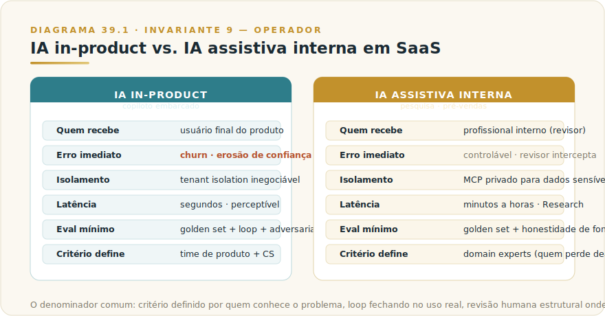
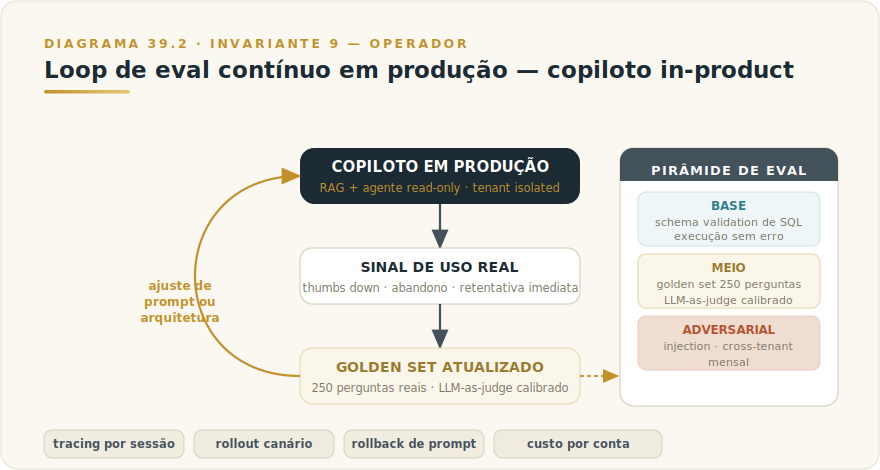
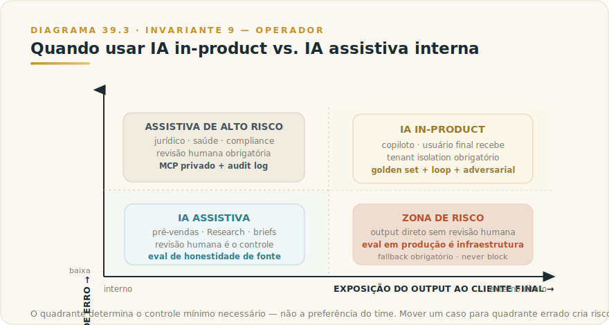

# CAPÍTULO 40
## CASOS — SAAS E SUPORTE

> *"Em produto SaaS, a IA não vende por si mesma — ela é operada por um time que decidiu para onde apontar a alavanca."*

---

> 🧭 **Invariante 9 — Operador** (L1): *"A IA multiplica competência e incompetência pelo mesmo fator."*
>
> Em produto SaaS, "operador" não é apenas o desenvolvedor que escreve o system prompt: é o time inteiro — produto, engenharia, CS, revenue — que decide o que medir, o que aceitar como qualidade, e o que jogar de volta para o modelo quando a saída não serve. Sem esse time operando com método, a capacidade de IA vira custo fixo disfarçado de feature.

---

## 40.1 — Panorama: IA dentro de produto SaaS e em suporte comercial

### O que diferencia IA in-product de IA assistiva interna

Há dois lugares em que IA aparece com frequência em empresas de software B2B: dentro do produto — servindo o usuário final — e dentro das operações comerciais, servindo o time que vende ou suporta o produto. São contextos com arquiteturas, loops de feedback e critérios de sucesso distintos.

**IA in-product (copiloto embarcado)** opera com isolamento de tenant obrigatório, latência perceptível pelo usuário, e sem margem para alucinação numérica — qualquer resposta incorreta sobre os dados da conta do cliente vira churner. O eval não é atividade de QA eventual; é infraestrutura de produção. O time de produto responde pelo comportamento da IA como responderia por qualquer bug de release.

**IA assistiva em suporte e pré-vendas** opera com um passo humano explícito entre o output da IA e o mundo externo. O profissional de CS ou de pré-vendas é o revisor; a IA comprime o tempo de pesquisa e estrutura a entrega, mas a responsabilidade de usar o resultado é do humano. Isso não reduz a necessidade de eval — reduz a consequência imediata de um erro individual, mas amplifica o risco sistêmico se o time parar de revisar criticamente.

### O que está em jogo nos dois casos

Em SaaS de mid-market, as alavancas de NRR são adoção de features avançadas e redução de churn por desorientação. Um copiloto mal operado — respostas imprecisas sobre dados do cliente, sem fallback gracioso, sem loop de melhoria — agrava exatamente o problema que foi contratado para resolver: o usuário que já não entende o produto passa a não confiar nem na IA que deveria explicá-lo.

Em pré-vendas de software enterprise, a alavanca é chegar à reunião sabendo mais que o concorrente. Um brief gerado por IA mal operado — fonte não citada, dado de stakeholder impreciso, fit técnico incorretamente avaliado — não apenas desperdiça o tempo de preparação; compromete a credibilidade do vendedor no momento em que ela importa.

Os dois casos a seguir exploram como times com métodos diferentes operaram a mesma capacidade de IA e obtiveram resultados distintos em função da qualidade da operação.



---

## 40.2 — Caso A: Métrica.io — copiloto in-product com eval contínuo

> ⚠️ *Cenário ilustrativo — composto a partir de padrões observados em SaaS B2B brasileiros de BI durante adoção de copilotos in-product entre 2024 e 2026; números são realistas mas não identificam empresa específica.*

### O problema

A Métrica.io é uma plataforma de BI para mid-market com ~480 contas pagantes e ARR na casa dos R$ 30 milhões. O time de produto identificou um padrão persistente: apenas 32% das contas utilizavam mais de três features da plataforma. O CS gastava horas semanais respondendo variações da mesma pergunta — "como faço X?" — e o NRR estagnara em torno de 108%, bem abaixo da meta de 120%+.

O diagnóstico era de desorientação produtiva: os usuários pagavam pelo produto, mas não conseguiam tirar valor das capabilities mais avançadas sem suporte. CAC alto, expansão lenta, churn silencioso em contas que simplesmente deixavam de usar.

### A tese

O time optou por um copiloto in-product com três capacidades: responder dúvidas baseadas na documentação oficial, gerar queries SQL e dashboards a partir de linguagem natural, e sugerir insights com base nos dados da própria conta do usuário. A premissa do Invariante 9 estava implícita na decisão de arquitetura: sem método de operação e sem loop de eval, o copiloto seria mais um botão que o usuário tentaria duas vezes antes de ignorar.

### Arquitetura e operação

A arquitetura combina RAG sobre documentação (chunking por seção semântica) com um agente read-only com acesso a ferramentas privadas da conta. O isolamento de tenant foi tratado como requisito inegociável — zero cross-tenant — e o modelo de permissão default é leitura; escrita apenas com confirmação humana explícita.

| Tool | Permissão padrão | O que é auditado |
|------|-----------------|-----------------|
| Busca em documentação | Leitura | Span de rastreamento |
| Query read-only | Leitura (sandbox por conta) | Span + query gerada |
| Geração de visualização | Escrita (efêmera) | Span |
| Explicação de resultado | Leitura | Span |
| Salvar dashboard proposto | Escrita (com confirmação humana) | Span + usuário confirmador |

A coordenação entre agentes (triagem → RAG docs → query writer → explicador) é determinística, não LLM — a rota de decisão é predefinida e auditável, independente de o modelo entender o contexto correto.

O eval estruturado em três camadas — base (schema validation de SQL), meio (golden set de 250 perguntas reais com LLM-as-judge calibrado) e adversarial (injection via nome de tabela/coluna, tentativas de cross-tenant) — é infraestrutura de produção, não checklist de pré-lançamento. Casos com sinal negativo de uso real (thumbs down explícito, abandono de query, retentativa imediata) entram no próximo ciclo do golden set, fechando o loop.



### LLMOps como viabilizador

O que tornou o eval contínuo sustentável foi a instrumentação de LLMOps desde o primeiro release: tracing por sessão e por conta, rollout canário (free → paid → enterprise), rollback de prompt em segundos, e — criticamente — custo de IA atribuído por conta. Esse último item transformou um custo operacional opaco em sinal de adoção: contas com alto consumo de copiloto têm correlação positiva com retenção e expansão, e esse dado alimenta tanto a precificação de add-on premium em planos enterprise quanto a decisão de onde investir em melhoria do golden set.

### O que o Invariante 9 explica aqui

O copiloto da Métrica.io é tecnicamente simples — RAG + agente read-only é arquitetura padrão documentada. O diferencial não foi a escolha de modelo nem a engenharia de prompt; foi a decisão organizacional de tratar eval contínuo como produto, não como checklist. O time de produto detinha o critério de aceitação (o golden set), o time de CS contribuía com casos reais que viravam ground truth, e o time de engenharia mantinha a infraestrutura de tracing que tornava o loop executável.

Três papéis distintos, método único: quem define o que conta como boa resposta, quem alimenta o que conta como falha real, e quem mantém a máquina de medição rodando. Isso é operador como multiplicador — o time operando sistematicamente a qualidade do modelo como parte do produto.

### Resultado (referencial ilustrativo)

| Métrica | Pré-copiloto | Pós-copiloto |
|---------|-------------|-------------|
| Adoção de features avançadas | 32% das contas | 71% das contas (+39 pp) |
| Tempo até primeiro insight | 14 dias | 4 dias |
| Volume de tickets "como faço X" | baseline | –57% |
| NRR projetado | 108% | 124% (meta atingida) |
| Payback do investimento | — | 7 meses |

### Riscos e como foram tratados

| Risco | Mitigação operacional |
|-------|----------------------|
| Injection via dado da conta | Sanitização + schema validation antes de execução |
| Vazamento cross-tenant | Isolamento a nível de tool; teste mensal |
| Alucinação numérica | Eval específico de faithfulness; resultado vem de query, não do modelo |
| Dependência operacional | Fallback gracioso para UI normal; o copiloto nunca bloqueia a tarefa |

---

## 40.3 — Caso B: EnterTech BR — pré-vendas com Claude Research

> ⚠️ *Cenário ilustrativo — composto a partir de padrões observados em vendors brasileiros de software enterprise durante adoção de IA em pré-vendas entre 2024 e 2026; números são realistas mas não identificam empresa específica.*

### O problema

A EnterTech é um vendor brasileiro de software enterprise com ~120 colaboradores, ciclo de venda médio de 9 meses e ticket entre R$ 800 mil e R$ 4 milhões. A pré-vendas técnica gastava 18 a 24 horas por proposta só na fase de pesquisa do prospect — levantamento de estrutura societária, headcount, tech stack visível, mapeamento de stakeholders, sinais de compra.

Esse custo de pesquisa tinha dois problemas além do volume: qualidade desigual entre profissionais (o sênior produzia briefs substancialmente melhores que o júnior, sem tempo para revisar tudo) e perdas tardias de ciclo — a empresa chegava à reunião de discovery e descobria, naquele momento, um desalinhamento técnico identificável na pesquisa inicial. A perda de um deal de R$ 2 milhões após seis meses de ciclo é cara de formas que o tempo de pesquisa, por si, não captura.

### A tese

Usar Claude Research como ferramenta de pesquisa profunda multi-fonte, estruturada em torno de Skills proprietárias da EnterTech — padrões reutilizáveis que definem exatamente o que capturar sobre cada tipo de prospect. O output seria um brief de quatro páginas, revisado por pré-vendas sênior antes de qualquer uso externo, ingerido no CRM como campo estruturado por categoria.

A tese do Invariante 9 aparece na decisão sobre o que não automatizar: a revisão humana antes de uso externo foi mantida como controle explícito porque o sênior que lê o brief com ceticismo é o operador que garante que o multiplicador funcione no sentido correto.

### Arquitetura e operação

Claude Research como ferramenta central de pesquisa multi-fonte, Skills para padrões reutilizáveis, Projects para histórico por conta, e integração com Salesforce via MCP (leitura para pesquisa; escrita controlada apenas para o campo de sumário dedicado no CRM).

| Skill proprietária | O que estrutura |
|--------------------|----------------|
| Perfil de empresa B2B BR | Estrutura societária, faturamento estimado, headcount, tech stack visível, movimentos recentes |
| Mapa de stakeholders | Perfis públicos, mídia, atribuições, decisores prováveis |
| Sinais de compra | Vagas abertas, RFPs publicados, anúncios, mudanças de liderança |
| Fit com produto EnterTech | Rubrica de adequação por eixo — escala, integração, regulação |

O workflow é sequencial com controle humano explícito em dois pontos: após a geração do brief (revisão de pré-vendas sênior) e antes de qualquer comunicação externa (o brief nunca vai para o prospect; é material interno de preparação).

```
Lead qualificado entra no CRM
   ↓
Research bundle: 5-9 perguntas estruturadas pelas Skills
   ↓
Brief de 4 páginas gerado por Research
   ↓
Revisão humana — pré-vendas sênior
   ↓
Ingestão em CRM — campo estruturado por categoria
   ↓
SDR + executivo de conta leem antes da primeira reunião
```

### Governança e LGPD

A pesquisa de prospect envolve dados pessoais de stakeholders (decisores, líderes de TI, diretores de área). A EnterTech documentou a base legal de legítimo interesse para esse uso, com avaliação documentada, AUP sobre extração e armazenamento, e treinamento explícito do time sobre o que é coletável versus o que é sensível demais para estar no brief. O comitê comercial e jurídico mensal mantém a política atualizada conforme o ambiente regulatório evolui.

Essa governança não foi adicionada depois de um incidente; foi construída junto com a arquitetura porque o custo de uma afirmação imprecisa sobre um executivo em conversa de venda — ou de um vazamento de dado de prospect — é assimétrico ao ganho de eficiência que o Research oferece.

### Eval e LLMOps

O eval usa um golden set de 50 prospect briefs com gabarito produzido por pré-vendas sêniores — avaliando honestidade (nenhuma afirmação sem fonte verificável) e cobertura (capturou os sinais que os sêniores consideram relevantes?). Tracing de fontes citadas em cada brief, versionamento das Skills, e quota por SDR para controle de custo operacional.

O volume menor de casos no golden set (50 vs. 250 da Métrica.io) reflete o contexto: cada brief é artefato de alto valor, lido por humano treinado antes de qualquer uso. A prioridade do eval é honestidade, não completude numérica.

### O que o Invariante 9 explica aqui

A EnterTech não implementou Research para substituir o pré-vendas sênior. Implementou para que o sênior chegasse à reunião com uma base de pesquisa que antes levaria 22 horas para produzir e agora está disponível em 4 horas de revisão e ajuste. O multiplicador funciona porque o sênior tem critério para rejeitar o que está errado — e porque as Skills foram construídas pelo time de pré-vendas, não por engenheiros de prompt que nunca fizeram uma proposta.

Quem definiu o que é um "sinal de compra" relevante foram os profissionais que perderam deals tardios por não ter visto esses sinais antes. Esse conhecimento operacional codificado nas Skills é o que torna o Research valioso; sem ele, o output seria pesquisa genérica de boa qualidade, não diferencial competitivo.

### Resultado (referencial ilustrativo)

| Métrica | Pré-projeto | Pós-projeto |
|---------|------------|------------|
| Tempo de prep por prospect | 22 horas | 4 horas (revisão + ajuste) |
| Conversão SQL → Oportunidade | baseline | +14 pp |
| Win rate | baseline | +6 pp |
| Ticket médio | baseline | +9% (melhor matching de fit) |
| Volume de propostas qualificadas | baseline | 2,1× |

### Riscos e como foram tratados

| Risco | Mitigação operacional |
|-------|----------------------|
| Afirmação imprecisa em conversa de venda | Toda afirmação no brief cita fonte verificável; eval de honestidade mensal |
| Uso indevido de dados pessoais (LGPD) | Política rígida; treinamento; auditoria; base legal documentada |
| Dependência acrítica da qualidade do brief | SDR treinado para ler com ceticismo; revisão sênior não é opcional |

---

## 40.4 — Transferência e decisão: o que os dois casos ensinam

### O denominador comum: operador com método, não ferramenta com prompt

A Métrica.io e a EnterTech usaram capacidades diferentes — copiloto in-product com eval contínuo de um lado, Claude Research com Skills proprietárias do outro — mas o padrão de sucesso é o mesmo.

Em ambos os casos:

1. **O critério de aceitação foi definido pelo time que conhece o problema**, não pela IA. O golden set da Métrica.io foi construído a partir de perguntas reais de usuários. As Skills da EnterTech foram escritas pelos profissionais que sabiam o que uma pesquisa ruim custava.

2. **O loop de feedback fecha no uso real**. A Métrica.io transforma sinal negativo de produção em novo caso do golden set. A EnterTech transforma revisão sênior em refinamento de Skills. Em nenhum dos dois casos o sistema foi lançado e considerado pronto.

3. **A revisão humana é estrutural, não opcional**. No copiloto, o write de dashboard requer confirmação explícita. No brief de pré-vendas, a revisão sênior precede qualquer uso externo. O Invariante 9 opera na contramão da fantasia de "lança e esquece".

### Quando usar IA in-product versus IA assistiva interna



| Dimensão | IA in-product | IA assistiva interna |
|----------|--------------|---------------------|
| Quem recebe o output diretamente | Usuário final do produto | Profissional interno (revisor) |
| Consequência imediata de erro | Erosão de confiança do cliente; churn | Perda de eficiência; constrangimento controlável |
| Isolamento de dados obrigatório | Sim — tenant isolation é inegociável | Depende — CRM/dados sensíveis exigem MCP privado |
| Latência tolerada | Segundos | Minutos a horas (Research profundo) |
| Eval mínimo para produção | Golden set + loop de produção + adversarial | Golden set + honestidade de fonte |
| Quem define o critério | Time de produto + CS Ops | Profissionais domain experts |
| Risco de dependência excessiva | Fallback para UI normal é obrigatório | Revisão humana é o controle; nunca eliminar |

### O papel não-negociável do eval contínuo em produto

O ponto mais contraintuitivo desses dois casos: eval em produção não é atividade de maturidade avançada — é condição de sustentabilidade básica de qualquer IA in-product.

A razão é simples: o produto muda, os dados dos clientes mudam, o comportamento do modelo muda com atualizações de versão. Um golden set construído no pré-lançamento e nunca atualizado mede o produto de seis meses atrás. O loop que fecha sinal de produção → golden set → re-eval → ajuste de prompt ou arquitetura garante que a IA sirva os usuários atuais, não os usuários de quando foi lançada.

A EnterTech tem esse loop em cadência mensal (golden set menor, ciclo de revisão de Skills). A Métrica.io tem um loop mais frequente, alimentado por sinal de uso em tempo real. A frequência certa depende do contexto — o princípio não depende.

> ⚠️ **POSTMORTEM — O copiloto que regrediu em silêncio**
> *O que tentaram:* um SaaS de gestão financeira para PMEs lançou um copiloto in-product com eval robusto na fase de piloto — golden set de 200 perguntas, LLM-as-judge calibrado, adversarial com casos de injection via nome de campo. O lançamento foi bem-sucedido. Três meses depois, o time atualizou o system prompt para cobrir uma nova feature de conciliação bancária. A atualização foi feita diretamente em produção, sem re-executar o eval. *O que quase deu errado:* a nova instrução introduziu um conflito de prioridade com a rubrica original de resposta sobre saldos. O copiloto passou a gerar respostas numericamente inconsistentes em queries que combinavam saldo atual com projeção de fluxo — exatamente o caso mais frequente dos usuários de PME. O sinal foi sutil: taxa de abandono de sessão subiu 9 pontos percentuais em duas semanas. A causa raiz foi identificada apenas quando um usuário mandou um screenshot do valor projetado incorreto para o suporte. O sistema estava em regressão há 18 dias antes de alguém perceber. *O Invariante violado:* Inv. 9 — Operador. O multiplicador estava apontando para o lado errado: o time que operava bem o produto no lançamento parou de operar o eval como infraestrutura e o tratou como checklist de pré-lançamento. *O que evitou (ou teria evitado):* política de bloqueio de CI que barra qualquer mudança de system prompt sem re-execução do eval completo. O golden set existia; não estava conectado ao pipeline de deploy. (cenário composto ilustrativo; ver [Apêndice K — Os 9 Modos de Falha](../04-apendices/L2-APX-K-modos-de-falha.md))

> 🎯 **DA CADEIRA DO CTO**
> O controle que exigiria antes de ir a produção com qualquer copiloto in-product: nenhuma mudança de system prompt, de modelo ou de tool entra em produção sem passar pelo eval completo — golden set, adversarial e threshold de bloqueio. Isso é gate de CI, não revisão opcional. A conveniência de atualizar o prompt diretamente em produção é exatamente o vetor pelo qual a regressão silenciosa acontece. Em produto SaaS, o eval não é atividade de lançamento; é infraestrutura permanente.

### Armadilhas recorrentes

**Armadilha 1 — "A IA vai aprender sozinha."** Modelos de linguagem não refinam pelo uso. Sem atualização intencional de golden set e prompt, a qualidade não sobe — ela deriva conforme o produto e o contexto mudam.

**Armadilha 2 — "Eval é trabalho de QA, não de produto."** O golden set da Métrica.io é um artefato de produto. Quem define o que conta como resposta correta sobre dados de BI é quem conhece BI — o product manager e o CS lead, não o QA engineer.

**Armadilha 3 — "Remover a revisão humana vai escalar melhor."** Pode — e vai escalar os erros na mesma proporção. A revisão humana no fluxo de pré-vendas da EnterTech não é gargalo de escala; é o mecanismo que mantém o multiplicador no sentido correto.

**Armadilha 4 — "Tenant isolation é detalhe de infraestrutura."** É requisito de produto. Uma resposta do copiloto que vaza dado de outra conta — mesmo que tecnicamente impossível pelo design — precisa de demonstração contínua (auditoria mensal, tracing), porque o cliente confia em evidências, não em afirmações.

### Tabela de decisão: critério transferível

| Pergunta | Se "sim" → implicação |
|----------|----------------------|
| O output chega ao cliente sem revisão humana? | Eval em produção é infraestrutura, não opcional |
| Há dados de múltiplos tenants no mesmo sistema? | Tenant isolation a nível de tool é pré-requisito |
| O profissional que revisa tem critério para rejeitar? | Skills/golden set devem ser definidos por esse profissional |
| O volume de uso é alto o suficiente para coletar sinal negativo? | Loop de produção → golden set é executável; implemente |
| O loop fecha em menos de um ciclo de produto? | Está dentro do aceitável; se não fecha, o eval está desconectado do produto |

---

## 40.5 — NA PRÁTICA: APLIQUE NA SUA ORGANIZAÇÃO

Os casos da Métrica.io e da EnterTech demonstraram o Invariante 9 em dois contextos: IA embutida no produto e IA assistiva interna. Esta seção traduz os padrões para aplicações que você pode iniciar na sua organização SaaS ou equipe de suporte comercial.

**Aplicação 1 — Construção do golden set antes do lançamento de qualquer feature de IA em produto.**
*Situação:* seu time está construindo ou já tem uma feature de IA no produto — sugestão de ação, resposta automática, geração de conteúdo, análise de dados — e o critério de qualidade ainda não está formalizado. O time valida informalmente: "parece bom", "os PMs aprovaram", "o founder curtiu a demo". *O que fazer:* antes de qualquer release para clientes reais, defina o golden set com pelo menos três participantes: o product manager que conhece o caso de uso, o CS lead que conhece as reclamações mais frequentes, e um cliente ou usuário avançado. O golden set deve incluir casos normais, casos de borda e casos adversariais — perguntas que o sistema deveria recusar ou escalar. Defina o threshold de aceitação antes de ver os resultados, não depois. *O ponto de julgamento:* um golden set construído após o lançamento mede o produto que o time aceitou como bom, não o produto que o cliente precisa. A diferença entre "aprovar no golden set" e "o cliente não reclamou na primeira semana" é exatamente onde a degradação silenciosa começa. Quem define o que conta como resposta correta é quem conhece o domínio — esse julgamento não pode ser delegado ao modelo nem ao engenheiro que o implementou (Invariante 9).

**Aplicação 2 — Loop de produção: transformar sinal negativo em melhoria do sistema.**
*Situação:* seu produto já tem IA em produção e você coleta feedback — thumbs down, tickets de suporte sobre a feature, taxa de rejeição de sugestões. O problema é que esse sinal fica no dashboard e ninguém fecha o loop: não virou caso novo no golden set, não ajustou o prompt, não gerou re-eval. O sistema de seis meses atrás ainda está em produção servindo os clientes de hoje. *O que fazer:* defina uma cadência — semanal ou quinzenal — onde o responsável pela feature de IA revisa os casos de feedback negativo, seleciona os que representam padrão recorrente ou caso de borda novo, e os incorpora ao golden set. Execute o eval atualizado antes do próximo release. Essa cadência é infraestrutura, não reunião de revisão. *O ponto de julgamento:* o sinal de produção é a informação mais valiosa que você tem sobre o que o seu produto não sabe fazer. Ignorá-lo é a forma mais cara de operar IA em produto: você paga pelo modelo, paga pelo time, e o sistema degrada silenciosamente enquanto o NRR erosiona. A decisão de o que entra no golden set — quais casos representam falha real versus reclamação de usuário com expectativa incompatível com o escopo — é julgamento editorial que precisa de um humano com contexto de produto (Invariante 9).

**Aplicação 3 — Revisão humana estrutural em IA assistiva de pré-vendas ou suporte complexo.**
*Situação:* sua equipe de pré-vendas, account management ou suporte complexo usa IA para preparar materiais — proposta, briefing, análise de conta, sumário de reunião — e o output vai para o cliente sem revisão do profissional sênior ou com revisão superficial sob pressão de prazo. *O que fazer:* formalize a política de revisão: todo material gerado com suporte de IA que chega ao cliente ou influencia uma decisão de contrato passa pelo profissional sênior responsável pelo relacionamento antes de sair. Essa revisão não é opcional nem contornável. Crie um artefato de registro simples — uma linha no CRM, uma assinatura no documento — que identifica quem revisou e quando. O profissional que revisa tem autoridade e responsabilidade para rejeitar. *O ponto de julgamento:* a proposta que vai ao cliente com o seu nome carrega a reputação que você construiu no relacionamento. A IA que preparou o rascunho não tem relacionamento com o cliente; você tem. Se a proposta contém um número errado ou uma afirmação não validada, o custo — em credibilidade, em deal, em relacionamento — é seu. A revisão sênior não é gargalo de escala: é o mecanismo que mantém a qualidade que justifica a margem (Invariante 9).

> 🔧 **EXERCÍCIO**
> Selecione uma feature de IA ou um processo assistido por IA que sua organização opera ou está construindo. Responda três perguntas: (1) qual é o golden set atual — quantos casos, quem os definiu, quando foi atualizado pela última vez? Se não existe ou não foi atualizado nos últimos três meses, escreva "inexistente"; (2) o sinal negativo de produção — feedback, rejeições, reclamações — fecha em algum lugar concreto que resulta em mudança no sistema? Descreva o mecanismo ou escreva "não fecha"; (3) quando o output dessa IA chega ao cliente ou influencia uma decisão consequente, quem é o profissional nomeado que revisou e assumiu responsabilidade pelo resultado? Se os três campos tiverem resposta concreta, você tem as bases do Invariante 9 em operação. Se algum estiver em branco, você encontrou o gap prioritário.

---

## Camada Viva

Os itens abaixo são voláteis por natureza e residem no Apêndice J:

- Limites de contexto e throughput de Claude Research para uso em pré-vendas de alto volume
- Modelos recomendados por camada de agente em copilotos in-product (Haiku para triagem, Sonnet para RAG/query — válido ao momento desta edição)
- Custos por token por modelo e implicações para precificação de add-on de copiloto
- SDKs e versões de MCP para integração com Salesforce e CRMs equivalentes

→ [Apêndice J — Apêndice Vivo](../04-apendices/L2-APX-J-apendice-vivo.md)

---

## Conexões

**Fundamento conceitual**
- Invariante 9 — Operador: [Manifesto dos Invariantes](../../Livro-1-Os-Invariantes/01-manifesto/L1-C00M-manifesto-invariantes.md)

**Capítulos de capacidade — Livro 2**
- [Cap 15 — Claude Research](L2-C16-research.md): arquitetura de pesquisa multi-fonte usada no Caso B
- [Cap 21 — API + SDKs](L2-C22-api-sdks.md): integração programática subjacente ao copiloto do Caso A
- [Cap 22 — Tool Use](L2-C23-tool-use.md): ferramentas do agente read-only e suas permissões
- [Cap 34 — Evaluations](L2-C35-evaluations.md): pirâmide de eval (base/meio/adversarial) e LLM-as-judge
- [Cap 35 — LLMOps](L2-C36-llmops.md): tracing, canário, rollback de prompt, custo por conta

**Casos setoriais relacionados (Parte 4)**
- [Cap 36 — Casos Jurídico e Compliance](L2-C37-casos-juridicos.md): leitura comparada — IA assistiva com revisão humana obrigatória por razão regulatória
- Cap 37 — Casos Saúde e Ciências da Vida (leitura comparada: tenant isolation e eval em contexto regulado)
- [Cap 38 — Casos Financeiro e Bancário](L2-C39-casos-financeiros.md): leitura comparada — eval adversarial e auditabilidade em produção
- Cap 40 — Casos Educação e Capacitação (leitura comparada: copiloto in-product com loop de aprendizagem)

---

## Resumo

- **Caso A (Métrica.io):** copiloto in-product com eval contínuo; tenant isolation como requisito de produto; loop sinal de produção → golden set como infraestrutura; resultado: adoção de features avançadas de 32% para 71%, NRR de 108% para 124%.
- **Caso B (EnterTech):** pré-vendas com Claude Research e Skills proprietárias; revisão humana estrutural antes de uso externo; eval de honestidade de fonte; resultado: tempo de prep de 22h para 4h, win rate +6 pp, propostas qualificadas 2,1×.
- **Denominador comum:** em ambos os casos, o diferencial não foi a capacidade de IA — foi a qualidade da operação: critério definido por domain experts, loop de feedback fechando no uso real, revisão humana onde a consequência do erro é assimétrica.
- **Critério transferível:** o que torna IA in-product sustentável é o mesmo que torna IA assistiva eficaz — o operador com método mantém o multiplicador apontando para o lado certo.

---

☐ **UAU** — *Este capítulo entregou critério transferível, não apenas relato de caso?*

> *"Copiloto sem eval em produção é gadget. Brief sem revisão humana é risco. Em ambos os casos, o que transforma ferramenta em alavanca é o operador que sabe para onde apontar."*
