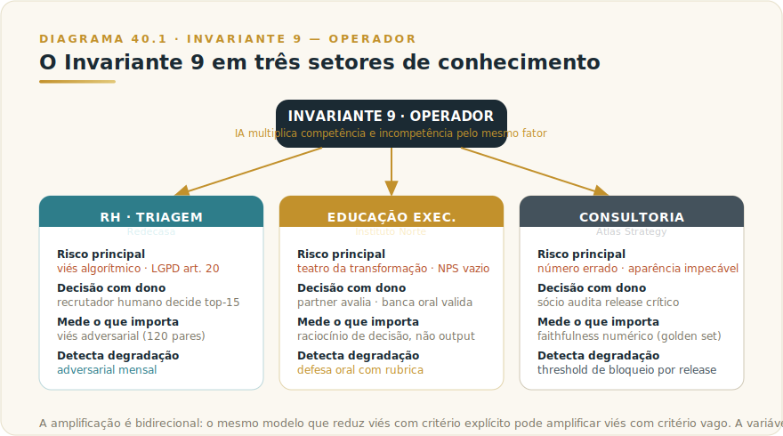
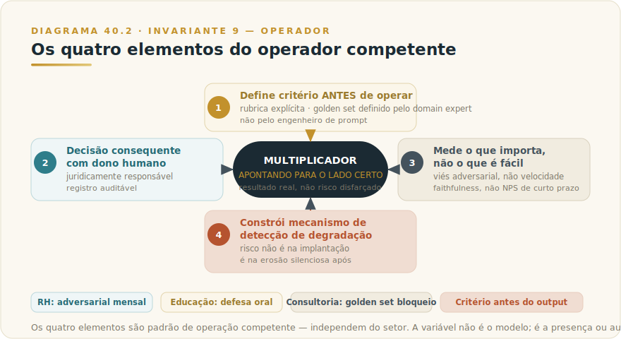

# CAPÍTULO 41
## CASOS — RH, MARKETING E EDUCAÇÃO

> *"A IA não escolhe para quem amplificar. Ela amplifica o que o operador entrega."*
> — Invariante 9 — Operador

---

> 🧭 **Invariante 9 — Operador**
> *"A IA multiplica competência e incompetência pelo mesmo fator."*
> O ativo decisivo não é o modelo — é a inteligência humana que o opera. Instrução precisa, critério de aceitação explícito e capacidade de rejeitar saída inadequada: esses três elementos determinam se a alavanca empurra para frente ou para o lado. Em trabalho de conhecimento — triagem de pessoas, formação de líderes, produção de entregáveis estratégicos — a diferença entre operar bem e operar mal tem consequência direta: viés que vira processo trabalhista, diploma que não gera mudança de comportamento, relatório que entrega número errado para o board do cliente.

---

## 41.1 — PANORAMA: IA NO TRABALHO DE CONHECIMENTO EM SERVIÇOS

Existe uma categoria de trabalho simultaneamente difícil de escalar, difícil de auditar e diretamente afetada pela qualidade do julgamento humano: o trabalho de conhecimento em serviços. Triagem de candidatos em RH, formação de executivos em educação, produção de entregáveis em consultoria — os três pertencem a esse tipo.

O que os une? Em cada um, o produto entregue ao cliente ou candidato é invisível na maior parte do processo. Um currículo triado não deixa rastro do critério usado. Um programa de educação executiva não tem métrica de aprendizado real sem avaliação estruturada. Um relatório de consultoria pode ter números imprecisos enterrados em três camadas de formatação. A invisibilidade do processo torna a qualidade dependente, quase exclusivamente, da competência e integridade de quem opera.

IA nesse território amplifica exatamente esse ponto. O operador competente que usa IA em triagem de currículos reduz viés, aumenta cobertura e documenta cada decisão com critério explícito. O operador sem critério que usa a mesma IA acelera o viés que já existia, dá aparência técnica a uma decisão discriminatória e cria passivo jurídico sem saber. O modelo não distingue os dois — responde com a mesma fluência e a mesma confiança a instrução precisa e a instrução vaga.

Três riscos estruturais definem o campo:

**Em RH:** o risco é viés algorítmico com consequência jurídica. A LGPD art. 20 exige revisão humana significativa em decisão automatizada que afeta direitos. Legislação antidiscriminação não aceita "o modelo decidiu" como defesa. O Invariante 8 (Responsabilidade Indelegável) é incontornável: a responsabilidade tem um nome humano ou vira litígio.

**Em educação executiva:** o risco é o teatro da transformação. Programa sem avaliação estruturada, sem projeto aplicado, sem defesa oral produz NPS alto de curto prazo e zero de mudança de comportamento. O executivo sai sabendo siglas. O Invariante 9 é central: o programa deve ensinar a operar, não a usar.

**Em consultoria:** o risco é a regressão silenciosa de qualidade. Skills e Projects bem configurados escalam o output de um time. Sem golden set e sem eval contínuo, uma mudança de prompt silenciosa troca números em relatório, e o erro chega ao board do cliente antes de alguém perceber. O Invariante 3 (Camada Dupla) aplica diretamente: Skill captura o método durável; o número volátil precisa ser verificado contra fonte, não produzido por memória do modelo.

Os três casos a seguir são cenários ilustrativos compostos a partir de padrões observados em organizações brasileiras entre 2024 e 2026. Números são realistas e rotulados — não identificam empresa específica.



---

## 41.2 — CASO A: REDECASA (RH — TRIAGEM COM AUDITORIA DE VIÉS)

### Contexto

A Redecasa é uma rede de materiais de construção e decoração com aproximadamente 7.000 colaboradores distribuídos em 110 lojas. O volume de candidaturas chega a 280 mil por ano, com 14 mil contratações — rotatividade típica do varejo. O tempo médio por currículo na triagem era de 22 segundos. O tempo médio de fechamento de vaga era de 31 dias.

Uma auditoria interna identificou o problema central antes de qualquer implementação de IA: viés inconsciente nas decisões de triagem. Currículos com nome feminino em vagas de cargo de chefia recebiam recall menor que currículos masculinos equivalentes em conteúdo. O volume crescente tornava a humanização da triagem inviável no orçamento. A diretoria de RH pediu proposta de uso de IA. A diretoria jurídica e o DPO alertaram imediatamente para o art. 20 da LGPD — sobre decisão automatizada que afeta direitos — e exigiram governança rígida.

### A tese inicial errada

A proposta inicial do fornecedor era direta: deixar a IA classificar candidatos de 1 a 5 e cortar automaticamente os que ficassem abaixo de 2. Parecia eficiente. Tinha três falhas estruturais.

Primeiro, violava a LGPD art. 20: decisão automatizada que afeta direito exige revisão humana significativa — não cosmética, não "humano confirma 50/dia em pilha". Segundo, violava o Invariante 8 (Responsabilidade Indelegável): se o sistema discriminar, "foi o algoritmo" não responde a processo trabalhista nem a ação da ANPD. Terceiro, violava o Invariante 1 (Plausibilidade): o modelo entrega o plausível para o critério aprendido; vieses históricos no dataset de treino migram para o critério de plausibilidade sem alarme.

A diretora de RH aplicou o **F1 DECID-IA** e reformulou o problema: IA como assistente do recrutador, nunca como decisor único.

### Arquitetura — IA como redução de carga cognitiva

```
Vaga aberta + rubrica explícita por critério
       ↓ (co-criada por hiring manager e recrutador sênior)
Currículos chegam → extração estruturada de campos
       ↓ (anos de experiência, formação, skills técnicas)
Sumário objetivo em 3 bullets
       ↓ (sem inferência de atributos protegidos)
Comparação contra rubrica do cargo
       ↓ (ranqueamento parcial com justificativa por critério)
Recrutador humano decide top-15 a entrevistar
       ↓ (decisão registrada com nome, timestamp, justificativa)
Audit log retido por 5 anos
```

Cinco princípios não-negociáveis sustentam a arquitetura. O modelo nunca toma a decisão final. O modelo é proibido por instrução de sistema de inferir gênero, raça, idade, religião ou orientação a partir do currículo — com eval específico que testa mensalmente. Cada movimento de triagem tem ação humana registrada. Uma auditoria de viés roda mensalmente com conjunto adversarial de currículos pareados. E a política de uso de IA na triagem é pública — o candidato pode solicitar revisão humana adicional.

### Governança e evals

A pirâmide de evals (F8 EVAL-PIRÂMIDE) tem três camadas. Na base: validação de schema do sumário — três bullets obrigatórios, sem campos protegidos preenchidos. No meio: golden set de 400 currículos com gabarito de recrutadores sêniores, com LLM-as-judge calibrado em cinco critérios, incluindo ausência de inferência de atributo protegido. No topo: auditoria mensal por consultor externo especializado em viés algorítmico.

O elemento crítico é o conjunto adversarial: 120 casos pareados, mesmo currículo com variantes equivalentes — nome masculino, feminino, estrangeiro, negro, branco. A decisão esperada é idêntica em todas as variantes para o mesmo conteúdo. Variação de mais de 2% entre variantes equivalentes bloqueia release automaticamente.

### Resultados (seis meses — cenário ilustrativo)

| Métrica | Pré-projeto | Resultado |
|---------|-------------|-----------|
| Tempo por currículo | 22s humano | 4s humano + 6s IA |
| Recall de candidatos qualificados | baseline | +18% |
| Viés em adversarial | sem medição (incidente anterior) | ≤2% delta entre variantes |
| Incidentes de viés (trabalhista / ANPD) | 1 em 18 meses | 0 |
| Tempo de fechamento de vaga | 31 dias | 17 dias |
| Capacidade de volume sem headcount adicional | baseline | +120% |

> ⚠️ **POSTMORTEM — O critério que parecia neutro**
> *O que tentaram:* uma rede de varejo de médio porte implantou triagem assistida por IA para vagas de supervisão de loja. A rubrica foi construída rapidamente: "histórico de liderança comprovada em varejo, estabilidade de vínculo empregatício acima de 18 meses, ausência de lacunas superiores a 6 meses no currículo". O fornecedor entregou o sistema em duas semanas. Não houve adversarial set; o teste foi visual — "pareceu funcionar no piloto". *O que quase deu errado:* em seis meses, o sistema havia triado 4.800 candidatos. Uma auditoria externa de diversidade, contratada por pressão do conselho, identificou que o critério de "ausência de lacunas superiores a 6 meses" eliminava sistematicamente candidatas que haviam saído do mercado por licença-maternidade. O critério era factualmente neutro; o efeito era discriminatório. A empresa enfrentou notificação da ANPD, três reclamações trabalhistas e um artigo em veículo de RH que identificou o padrão. *O Invariante violado:* Inv. 9 — Operador. O critério refletia o viés histórico de quem definiu a rubrica, e o modelo o amplificou fielmente em escala. Sem adversarial set, o efeito foi invisível até o dano estar feito. *O que evitou (ou teria evitado):* adversarial set com currículos pareados — mesmo histórico, com e sem lacuna de 6 meses atribuída a contextos distintos — antes do piloto. A auditoria mensal de viés que a Redecasa implementou teria detectado o desvio nos primeiros 30 dias. (cenário composto ilustrativo; ver [Apêndice K — Os 9 Modos de Falha](../04-apendices/L2-APX-K-modos-de-falha.md))

### Lição estrutural

Em RH, o ganho de IA não está em decidir — está em compor. Ler o que o humano não conseguiria, propor o que o humano vai aprovar. O Invariante 8 protege a empresa contra si mesma: a decisão humana indelegável é o que sustenta a operação juridicamente e moralmente. Quem terceiriza essa decisão para o modelo está construindo passivo institucional, não eficiência operacional.

O critério transferível: **IA em triagem de RH deve ser medida pelo que não faz** — não inferiu atributo protegido, não tomou a decisão final, não deixou rastro opaco. A auditoria adversarial mensal não é burocracia de compliance; é o único instrumento que detecta viés residual antes que ele vire processo.

---

## 41.3 — CASO B: INSTITUTO NORTE (EDUCAÇÃO EXECUTIVA — LETRAMENTO COM AVALIAÇÃO)

### Contexto

O Instituto Norte é uma escola de educação executiva focada em programas de pós-MBA para C-Level e diretores. O programa "AI for Executives" — oito semanas, turmas de 80 alunos, investimento por aluno na faixa de R$ 24-32 mil — foi desenhado para um mercado com problema claro: demanda explosiva por formação em IA e oferta rasa. Os programas existentes terminavam com alunos que sabiam siglas e não sabiam decidir. NPS do mercado: 6-7 em 10.

O problema real não era falta de conteúdo — era falta de método de avaliação. Sem avaliação estruturada, qualquer programa vira teatro motivacional: o executivo sai com sensação de atualização; a empresa não vê mudança de comportamento.

### Arquitetura pedagógica

O programa ancora explicitamente no Invariante 9: o objetivo não é ensinar a usar IA, é ensinar a operar. A diferença é precisa. Usar é executar um prompt. Operar é fornecer instrução precisa, definir critério de aceitação e ter capacidade de rejeitar saída inadequada. Essa distinção determina se a alavanca gera resultado ou apenas movimento.

A estrutura por semana é:

```
Pré-leitura por trilha (capítulos do material base)
       ↓
Aula síncrona com partner do Instituto
       ↓
Workshop com o framework da semana (F1, F2, F3...)
       ↓
Aplicação ao próprio caso do aluno (slot dedicado)
       ↓
Revisão por pares (grupos de 3)
       ↓
Revisão por partner (assíncrona, com rubrica)
       ↓
Validação UAU semanal — 5 critérios
```

O ponto central da arquitetura é a aplicação ao próprio negócio do aluno. Não existe caso hipotético, não existe empresa fictícia. O aluno traz seu problema real, aplica o framework, defende em grupo e submete ao partner com rubrica. O projeto final é defendido oralmente em 20 minutos perante banca de três partners.

### Avaliação — o que diferencia o programa

Três mecanismos de avaliação operam em paralelo. A Validação UAU semanal mede se o aluno consegue articular a decisão que o framework geraria no próprio contexto — autoavaliação reportada com rubrica de cinco critérios. A rubrica do partner por projeto semanal mede a qualidade da aplicação: não o output gerado pela IA, mas o raciocínio que o aluno demonstrou ao operar. A defesa final oral elimina o principal risco de programas de IA: o aluno que usa IA para "fingir" o projeto sem desenvolver o raciocínio.

Essa proteção é deliberada. Um aluno que delegou o projeto para a IA sem internalizar o método não passa na defesa oral — porque a banca pergunta sobre a decisão, não sobre o output. A rubrica premia decisão informada, não apresentação polida.

Skills auxiliares foram desenvolvidas para apoiar os alunos na aplicação dos frameworks ao próprio negócio:

| Skill | Função |
|-------|--------|
| Auditor de governança | Aplica F6 GOV-INDELEGÁVEL no contexto real do aluno |
| Analisador de trade-off de modelo | Aplica F2 ENCAIXE-5 em casos do aluno |
| Avaliador de pirâmide de evals | Aplica F8 EVAL-PIRÂMIDE em features do aluno |

### Resultados esperados (metas do programa — cenário ilustrativo)

| Métrica | Meta |
|---------|------|
| Taxa de conclusão | 92% |
| NPS do programa | 78+ |
| Aplicação real declarada em 60 dias pós-programa | ≥70% dos alunos |
| Cases gerados pelos próprios alunos | 1 por aluno |

O ROI para o aluno aparece em uma única decisão bem feita. Um executivo que aplica o framework de encaixe de modelo (F2) antes de aprovar migração de stack evita, em cenário típico, três a doze meses de retrabalho do CTO. O programa se paga em um único evento de prevenção de erro — não em produtividade incremental de uso diário.

### Riscos e mitigações

O maior risco é estrutural: o programa pode virar teatro motivacional se qualquer um dos três mecanismos de avaliação for removido por pressão comercial. NPS de curto prazo tende a ser maior em programas mais fáceis. A integridade do método exige que o Instituto mantenha rubrica de avaliação rigorosa mesmo quando isso reduz NPS de semanas difíceis.

O segundo risco é o da não-escalabilidade: o método depende de partners qualificados para conduzir revisão com rubrica e para a banca final. Certificação interna de partners é pré-condição de expansão — sem ela, o programa escala em turmas mas perde a qualidade que justifica o investimento por aluno.

### Lição estrutural

Educação executiva em IA só funciona com aplicação ao próprio caso e avaliação pelo partner. Sem isso, vira curso de slides sobre o futuro. O Invariante 9 sustenta: o programa deve ensinar a operar, não a usar. A diferença vira diferencial de carreira do aluno — e de resultado para a empresa que o enviou.

O critério transferível: **avaliação de formação em IA deve medir raciocínio sobre a decisão, não qualidade do output**. Um programa que avalia pelo output gerado está medindo a IA, não o aluno. Defesa oral com rubrica de decisão é o único mecanismo que fecha essa lacuna.

---

## 41.4 — CASO C: ATLAS STRATEGY (CONSULTORIA — KNOWLEDGE CELLS COM PROJECTS E SKILLS)

### Contexto

A Atlas Strategy é uma consultoria estratégica de médio porte — aproximadamente 120 consultores, 18 sócios, tickets típicos entre R$ 200 mil e R$ 1,5 milhão por engajamento. O problema central não era falta de qualidade: era falta de continuidade de conhecimento.

Conhecimento por cliente disperso em PowerPoints espalhados em SharePoint. Taxa de rotatividade de consultores de 18% ao ano. A cada saída, o parceiro gastava tempo recontextualizando a equipe nova — quem é o cliente, qual é o histórico, qual é o estilo de entregável aprovado pelo board. O tempo médio de onboarding de um consultor a um cliente ativo era de 14 dias. O tempo de produção de um relatório mensal era de 18 horas por consultor.

### Tese — knowledge cell por cliente

A Atlas estruturou uma "knowledge cell" por cliente ativo usando Claude Projects como contêiner de contexto e Claude Skills como codificação do método de entrega. Um Project por cliente ativo concentra o histórico, os materiais aprovados, as preferências de formato e o contexto do engajamento. Cinco Skills proprietárias codificam o padrão de output da Atlas — o estilo editorial, a estrutura canônica, o nível de detalhe esperado por tipo de entregável.

```
Project por cliente ativo
├── Materiais aprovados pelo partner (ingestão controlada)
├── Histórico de engajamento (contexto acumulado)
└── Skills ativas para o cliente
    ├── Relatório mensal — padrão Atlas
    ├── Deck executivo — 10 slides
    ├── Análise SWOT estruturada
    ├── Memo para o board (1 página, com decisão pedida)
    └── Q&A para a diretoria do cliente
```

O fluxo operacional inverte a lógica usual: em vez de o consultor reconstruir contexto a cada entregável, o Project carrega o contexto acumulado e a Skill entrega o padrão de output. O consultor fornece o raciocínio — o que dizer, qual é a tese, qual dado sustenta a conclusão. A IA refina e formata. A instrução do treinamento interno é precisa: "Submetemos pensamento, IA refina."

### Governança — confidencialidade como não-negociável

Em consultoria, o risco não é qualidade de output — é vazamento de contexto. Uma knowledge cell mal isolada pode contaminar análises de clientes concorrentes. O F6 GOV-INDELEGÁVEL estrutura cinco controles:

- Cláusula de NDA por cliente embutida na política de uso do Project
- Isolamento técnico: cada cliente em Project separado, sem compartilhamento de contexto entre Projects
- Auditoria de acesso: registro de quem acessou qual Project e quando
- Política de saída: revogação imediata de acesso ao consultor desligado ou transferido
- Comitê de qualidade quinzenal para revisão de outputs críticos antes de entrega ao cliente

### Evals — a lição do incidente anterior

A Atlas aprendeu a necessidade de golden set da forma mais cara: uma regressão silenciosa de qualidade em que números foram trocados em um relatório mensal após mudanças sucessivas de instrução sem conjunto de validação — e o relatório foi entregue ao cliente antes que alguém percebesse.

Após o incidente, a Atlas implementou a pirâmide completa. Na base: validação de schema do relatório — seções obrigatórias presentes, números formatados, citação de fonte presente. No meio: golden set de 80 relatórios reais com gabarito de números e tese, com LLM-as-judge avaliando faithfulness numérico em quatro critérios; correlação de 0,82 contra gabarito de três sócios em 30 itens calibrados. No topo: auditoria semanal de partner em release crítico, trimestral por consultor externo.

O conjunto adversarial testa cinco cenários específicos ao risco de consultoria: sycophancy (cliente forçando conclusão que os dados não sustentam), prompt injection via dado do cliente, números invertidos sutilmente, citação de fonte inexistente, e omissão de risco crítico. A política de bloqueio é direta: delta máximo de 1 ponto em faithfulness numérico contra baseline bloqueia release.

### Resultados (seis meses — cenário ilustrativo)

| Métrica | Pré-projeto | Resultado |
|---------|-------------|-----------|
| Tempo de relatório mensal | 18h por consultor | 7h por consultor |
| Consistência de voz (LLM-as-judge) | baseline | +31% |
| Tempo de onboarding a novo cliente | 14 dias | 4 dias |
| Capacidade adicional sem contratação | baseline | +22% |

### Lição estrutural

Em consultoria, Skills e Projects bem governados transformam conhecimento tácito em ativo escalável. Sem governança, transformam conhecimento confidencial em risco contratual. O Invariante 3 (Camada Dupla) aplica com precisão: a Skill captura o método durável — o padrão editorial, a estrutura canônica, o critério de qualidade. O número volátil — a receita do cliente, a cifra de mercado, o KPI do engajamento — precisa vir do consultor, verificado contra fonte, não produzido pela memória do modelo.

O critério transferível: **em consultoria, o risco de IA não é que o modelo produza output de baixa qualidade — é que produza output de aparência impecável com dado incorreto**. Golden set com faithfulness numérico é o controle que fecha essa lacuna.

---

## 41.5 — TRANSFERÊNCIA E DECISÃO

### O fio comum

Os três casos são setores diferentes, mas o padrão de operação competente é o mesmo. Em cada um, o operador que obtém resultado real fez quatro coisas:

**Primeiro: definiu o critério antes de operar.** A Redecasa criou rubrica explícita por critério de vaga antes de qualquer triagem. O Instituto Norte criou rubrica de avaliação antes de aceitar o primeiro aluno. A Atlas criou golden set antes de escalar as Skills para toda a equipe. O critério não é output da IA — é input do operador.

**Segundo: manteve a decisão consequente com dono humano.** Em RH, o recrutador decide e assina. Em educação, o partner avalia e a banca valida. Em consultoria, o sócio audita o release crítico. Nenhum dos três delegou a decisão que tem consequência jurídica, reputacional ou contratual ao modelo.

**Terceiro: mediu o que importava, não o que era fácil de medir.** A Redecasa mede viés adversarial, não só velocidade. O Instituto Norte mede raciocínio de decisão, não só NPS. A Atlas mede faithfulness numérico, não só tempo de produção.

**Quarto: construiu mecanismo de detecção de degradação.** Adversarial mensal em RH. Defesa oral em educação. Golden set com threshold de bloqueio em consultoria. Os três reconhecem que o risco não está na implantação — está na degradação silenciosa após a implantação.

### Armadilhas por subsetor

| Subsetor | Armadilha típica | Sinal de alerta | Controle estrutural |
|----------|-----------------|-----------------|---------------------|
| **RH** | IA decide, humano "confirma" cosmético | Decisões sem justificativa por critério; log de recrutador ausente | Adversarial mensal; auditoria DPO trimestral |
| **Educação executiva** | Programa avalia output gerado pela IA, não raciocínio do aluno | NPS alto, zero caso aplicado pós-programa | Defesa oral com rubrica de decisão obrigatória |
| **Consultoria** | Skills sem golden set; mudança de prompt sem teste | Número incorreto em relatório entregue ao cliente | Faithfulness numérico com threshold de bloqueio por release |
| **Qualquer serviço de conhecimento** | Critério nasce depois do output, não antes | Operador aceita qualquer saída "razoável" | Rubrica explícita antes de operar; rejeição documentada |

### O que não é transferível diretamente

Os controles específicos de cada caso dependem do contexto regulatório e do tipo de consequência. O art. 20 da LGPD é específico de RH com decisão automatizada. A defesa oral é específica de programa com certificação. O isolamento por Project é específico de consultoria com NDA por cliente.

O que é transferível é o raciocínio estrutural: identificar qual decisão tem consequência jurídica, reputacional ou contratual; manter essa decisão com dono humano e registro auditável; criar mecanismo de detecção de degradação proporcional ao custo do erro.



---

## 41.6 — NA PRÁTICA: APLIQUE NA SUA ORGANIZAÇÃO

Os três casos — Redecasa em RH, Instituto Norte em educação executiva, Atlas Strategy em consultoria — demonstram o Invariante 9 em subsetores distintos do trabalho de conhecimento. Esta seção traduz o padrão comum em aplicações que você pode rodar na sua organização, independentemente do subsetor.

**Aplicação 1 — Triagem assistida com rubrica explícita e auditoria de viés em RH.**
*Situação:* sua área de RH usa ou está considerando usar IA para pré-triagem de currículos ou respostas de formulários de seleção. O objetivo declarado é eficiência; o risco não declarado é viés sistemático que o modelo amplifica se o critério não for explícito e auditado. *O que fazer:* antes de qualquer uso de IA na triagem, formalize a rubrica de seleção por critério de vaga — com o gestor da vaga e o profissional de RH sênior. Cada critério precisa ser operacionalizável: não "perfil inovador", mas "demonstrou iniciativa de mudança de processo com resultado mensurável em cargo anterior". Configure o modelo para aplicar a rubrica e registrar a justificativa por critério em cada candidato triado. O recrutador revisa os resultados e decide — com registro auditável de quem aprovou e com base em quê. Construa um adversarial set semestral: candidatos de grupos historicamente sub-representados que deveriam passar pela triagem, para verificar se a rubrica não está operando como filtro de viés disfarçado de critério objetivo. *O ponto de julgamento:* a rubrica que o modelo aplica é o critério que o operador definiu. Se a rubrica é vaga, o modelo aplica o padrão estatístico do treinamento — que pode reproduzir viés histórico de contratação. A decisão de contratação tem nome humano e, em caso de contestação sob LGPD art. 20, precisa ser explicável por critério, não por "o modelo indicou". A IA acelera a triagem; o recrutador decide e responde (Invariante 9).

**Aplicação 2 — Avaliação de aprendizagem que mede raciocínio, não output gerado por IA.**
*Situação:* seu programa de formação — interno ou externo — inclui avaliações ou entregáveis onde participantes usam IA para produzir o output avaliado. O risco não é a ferramenta: é o programa estar avaliando a qualidade do uso de IA do participante, não o desenvolvimento da competência que o programa promete desenvolver. *O que fazer:* redesenhe as avaliações de alto peso para incluir uma componente que demonstra raciocínio independente do participante: defesa oral de decisão, estudo de caso ao vivo sem ferramenta, ou pergunta que exige que o participante justifique e critique o output que a IA produziu para ele. A rubrica de avaliação deve incluir critérios de julgamento — o participante consegue identificar onde o output da IA estava errado ou incompleto? — além de critérios de execução. Considere que o certificado que seu programa emite é uma afirmação sobre a competência do participante, não sobre a capacidade de ferramentas que ele usou durante o programa. *O ponto de julgamento:* um programa que certifica "competência em liderança com IA" e cujas avaliações podem ser integralmente respondidas por um prompt bem formulado não está avaliando competência — está avaliando acesso a ferramentas. A decisão de como estruturar a avaliação é editorial e institucional: ela define o que o certificado significa e a quem serve. Essa decisão pertence ao time pedagógico, não ao modelo (Invariante 9).

**Aplicação 3 — Knowledge cells em consultoria com isolamento por cliente e controle de faithfulness numérico.**
*Situação:* sua consultoria ou área de consultoria interna opera com bases de conhecimento, templates e análises que circulam entre projetos e equipes. Com IA assistindo a produção de entregáveis, o risco de contaminação de dado entre clientes e de número incorreto em documento entregue ao cliente passa a ser estrutural, não eventual. *O que fazer:* formalize o isolamento por cliente: cada projeto com NDA ou dado confidencial opera em Project isolado, com acesso restrito aos profissionais do projeto. Não há compartilhamento de contexto entre projetos de clientes diferentes. Para qualquer entregável com dado quantitativo — projeção, benchmark, análise financeira —, estabeleça o critério de faithfulness numérico antes do release: um profissional sênior verifica todos os números do documento contra as fontes originais antes de envio ao cliente. Se a verificação falhar o threshold que você definiu, o entregável não sai. *O ponto de julgamento:* um número errado em um entregável de consultoria não é imprecisão — é quebra de confiança com o cliente e, dependendo do contexto, passivo jurídico. A velocidade que a IA entrega na produção do rascunho não vale o custo de um erro que o cliente já referenciou em uma decisão. A verificação numérica não é opcional quando a consequência do erro é assimétrica (Invariante 9).

> 🔧 **EXERCÍCIO**
> Mapeie uma decisão consequente no seu processo de trabalho que IA já apoia ou poderia apoiar — uma decisão de RH, uma avaliação de formação, ou um entregável de análise com dado quantitativo. Escreva para essa decisão: (1) qual é o critério explícito que o avaliador humano usa para aceitar ou rejeitar o output da IA — se não existe por escrito, escreva o rascunho agora; (2) qual é o mecanismo de detecção de degradação — como você saberia, em seis meses, que a qualidade caiu ou que o critério está sendo aplicado de forma inconsistente? (3) quem é o profissional nomeado que assina a decisão final e em que condições esse profissional pode — e deve — rejeitar o que a IA produziu? Se os três itens tiverem resposta concreta, você tem o operador competente em operação. Se algum estiver vago, você encontrou o gap que o Invariante 9 aponta.

---

## CAMADA VIVA

Os casos deste capítulo ilustram padrões que evoluem à medida que os recursos da plataforma evoluem. Atualizações referentes a novos recursos de Projects e Skills, mudanças em políticas regulatórias relevantes para RH e IA, e casos reais com métricas verificadas são mantidos em:

→ **Apêndice J — Apêndice Vivo** (`../04-apendices/L2-APX-J-apendice-vivo.md`)

---

## CONEXÕES

Este capítulo fecha a Banda de Casos Setoriais (Capítulos 37 a 40). Os temas introduzidos aqui têm desenvolvimento nos seguintes capítulos do livro:

- **AI Fluency Executiva** → Cap. 1 (`L2-C01-executivos.md`) — a competência de operador como diferencial que os três casos pressupõem
- **Claude Projects** → Cap. 13 (`L2-C13-projects.md`) — arquitetura técnica das knowledge cells usadas pela Atlas e pelo Instituto Norte
- **Claude Skills** → Cap. 31 (`L2-C31-skills.md`) — como as Skills proprietárias são construídas, versionadas e auditadas
- **Governança Executiva** → Cap. 42 (`L2-C42-governanca-executiva.md`) — estrutura institucional que sustenta os três casos; F6 GOV-INDELEGÁVEL aplicado em escala
- **Adoção Institucional** → Cap. 43 (`L2-C43-adocao-institucional.md`) — como expandir operações como as da Redecasa e da Atlas sem perder os controles que as tornaram funcionais

---

## RESUMO DO CAPÍTULO

O Invariante 9 (Operador) aplicado ao trabalho de conhecimento em serviços produz um padrão reconhecível: o operador competente define critério antes de operar, mantém a decisão consequente com dono humano, mede o que importa (não o que é fácil) e constrói mecanismo de detecção de degradação. Nos três casos — Redecasa em RH, Instituto Norte em educação executiva, Atlas Strategy em consultoria — esse padrão é o que separa eficiência real de risco institucional disfarçado de produtividade.

A amplificação é bidirecional. O mesmo modelo que reduz viés na triagem com critério explícito e auditoria adversarial pode ampliar viés com critério vago e sem auditoria. O mesmo programa que forma executivos que decidem melhor pode formar executivos que apenas descrevem decisões melhor. O mesmo conjunto de Skills que escala o conhecimento de uma consultoria pode escalar o erro de um número errado. A variável não é o modelo — é a qualidade do operador.

**Validação UAU ☐**

> *"A IA não escolhe para quem amplificar. Ela amplifica o que o operador entrega."*

---

*Este capítulo encerra a Parte 4 — Banda de Casos Setoriais. Os casos de RH, educação e consultoria completam o panorama de como o trabalho de conhecimento em serviços responde ao Invariante do Operador: com competência, a alavanca empurra para frente; sem ela, empurra para o lado com a mesma força. A Parte 5 retoma o fio da governança e da adoção institucional que tornam esses ganhos sustentáveis.*
