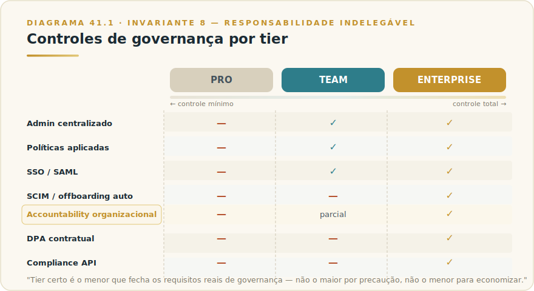
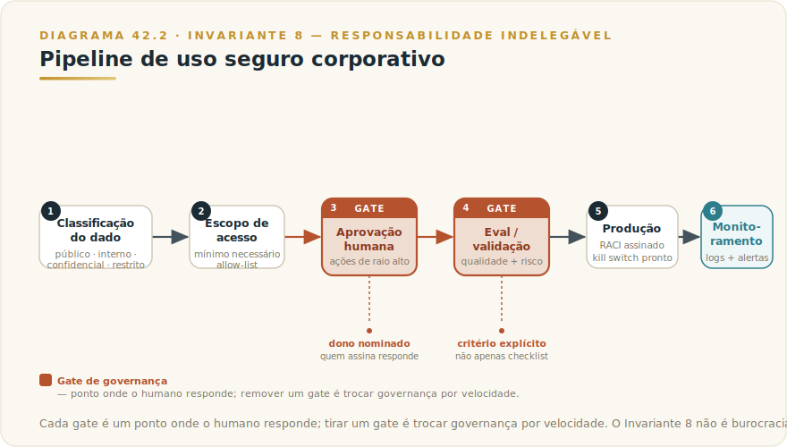

# CAPÍTULO 42
## GOVERNANÇA EXECUTIVA

---

> *"Governança não é o que você declara na política. É o que acontece quando a política encontra um incidente às 23h de uma sexta-feira."*

---

> 🧭 **Invariante 8 — Responsabilidade Indelegável**
>
> Toda saída de IA em produção tem dono identificável. Governança é o sistema que garante isso em escala.
>
> O framework teórico vive no **L1-F6 — Governança Indelegável**: três camadas (técnica, operacional, executiva), dez controles canônicos, 12 decisões mínimas do RACI. Este capítulo não repete essa teoria. Parte dela para construir a aplicação concreta no ecossistema Claude: quem pode usar o quê, como cada conector e Skill entram em produção, o que pode ser federado sem perder accountability, e o que acontece quando a governança está imatura — incluindo o sinal mais caro: shadow AI.

---

## 42.1 — O CONCEITO: GOVERNANÇA COMO SISTEMA DE ACCOUNTABILITY

Governança de IA não é a política publicada na intranet que ninguém lê, nem o comitê que se reúne uma vez por ano para registrar que "analisamos os riscos". Governança é o sistema que responde, em escala, a uma pergunta simples: **quando uma saída de Claude causar um problema — um relatório errado, uma decisão equivocada, um dado sensível que não deveria ter entrado no modelo — quem responde?**

Se a resposta for "o time de IA", governança falhou. Se a resposta for "Rafael Lima, diretor de operações, como dono do sistema de análise de contratos, com o processo de incidente documentado no runbook e ativado em menos de uma hora", governança funciona.

O Invariante 8 é essa exigência: dono identificável, em cada saída, em escala. Este capítulo aplica a estrutura do L1-F6 ao ecossistema Claude: quem pode usar qual plano e feature, como conectores e Skills entram em produção com governança, o que o Admin controla, e como calibrar centralização sem matar adoção.

Em 2026, o ecossistema Claude vai além do chat simples: colaboradores usando Claude.ai, engenharia com Claude Code no pipeline de CI/CD, Skills organizacionais em Cowork, Connectors para Google Workspace e Slack, servidores MCP acessando o data warehouse. Cada superfície tem perfil de risco diferente. Governar todas com a mesma política genérica é excesso em algumas e insuficiente em outras.

A pergunta executiva não é "temos política de IA?" — é "nossa política distingue entre o risco de um colaborador redigindo um e-mail e o risco de um agente autônomo executando transações no sistema financeiro?" Se não distingue, não é governança: é um documento.

---

## 42.2 — ANALOGIA: A REDE BANCÁRIA E SEUS CIRCUITOS

Uma instituição financeira não opera com uma única política de acesso. O caixa não chega ao sistema de crédito. O gerente aprova até certo limite; acima, vai para a central. Cada circuito foi desenhado a partir de duas variáveis: **o risco do que aquela pessoa pode fazer** e **a velocidade com que o erro pode ser detectado e corrigido**.

Governança de Claude funciona pelo mesmo princípio. Colaborador redigindo apresentação: circuito de baixo risco, responsável é o próprio usuário, reversibilidade total. Skill que automatiza análise de crédito e gera recomendação para o comitê: circuito de alto risco, aprovação formal, dono nominal, trilha de auditoria, revisão humana antes de qualquer decisão. Agente Claude Code com acesso ao repositório de produção: circuito crítico, RACI completo, kill switch testado, revisão no CI.

O erro de governança mais comum não é criar regras demais. É criar uma única regra para todos os circuitos — inviabilizando os de baixo risco enquanto deixa os de alto risco sem controle proporcional.

---

## 42.3 — A ESTRUTURA: GOVERNANÇA APLICADA AO ECOSSISTEMA CLAUDE

### 42.3.1 — Modelo de Acesso e Tiers

Três tiers com implicações de governança distintas — o que cada um habilita ou impede em termos de controle:

**Pro individual** não tem administração organizacional. Dados sensíveis podem entrar em contas pessoais sem visibilidade corporativa. Governança depende inteiramente de política publicada e treinada — sem mecanismo técnico de enforcement.

**Team** introduz o Admin com controle real: gerenciar membros, definir allow-list de Connectors e Skills, acessar logs agregados, revogar acesso imediatamente, configurar SSO via SAML. É o mínimo para qualquer organização com mais de cinco usuários regulares. A lacuna do Team — sem SCIM, sem offboarding automático, sem DPA formal — define quando Enterprise é obrigatório.

**Enterprise** fecha essas lacunas: SCIM, offboarding automático, hierarquia de workspaces por departamento, DPA contratual, data residency configurável, VPC isolado, Compliance API com acesso programático a dados de uso para auditoria contínua.

A decisão de tier não é de preço. É de qual nível de controle técnico a organização precisa para operar com accountability. Regra prática: **o tier certo é o menor que atende os requisitos reais de governança — não o maior por precaução, não o menor para economizar quando os requisitos não fecham.**

### 42.3.2 — Governança de Connectors

Connectors são integrações nativas pré-aprovadas pela Anthropic — Google Workspace, Slack, GitHub e outros. O Capítulo 21 detalhou o funcionamento técnico. A pergunta de governança é: **quem decide o que pode estar conectado, com quais dados?**

Em Team e Enterprise, o Admin controla quais Connectors os usuários podem ativar. A allow-list garante que Connectors não revisados não aparecem como opção — eliminando shadow integrations antes que aconteçam.

A aprovação de um Connector novo deve responder a três perguntas:

**1. Qual é o escopo real de dados acessado?** Connectors usam OAuth e o escopo varia por implementação. "Acesso ao Google Drive" pode significar todo o Drive ou apenas pastas específicas. Revisar o que o Connector solicita é a primeira linha de defesa contra superfície de acesso maior que o necessário.

**2. Quais dados podem transitar por esse Connector?** Um Connector de e-mail pode expor dados de clientes, contratos confidenciais, informação financeira. A aprovação deve considerar a classificação dos dados que circulam no serviço conectado.

**3. A Compliance API ou log de auditoria cobre esse Connector?** Para organizações com obrigações de auditoria, o uso do Connector precisa deixar trilha auditável. Em Enterprise, a Compliance API permite monitoramento contínuo de quais conversas envolveram quais Connectors.

O fluxo tem três momentos: **aprovação** (revisão de escopo e dados antes da allow-list), **operação** (auditoria via Compliance API ou logs do Admin), e **revisão periódica** (Connectors não usados ou com escopo atualizado pelo serviço externo). A revisão periódica é o passo que mais frequentemente fica fora da rotina — e é onde shadow integrations reaparecem.

### 42.3.3 — Governança de Skills e Agentes

Skills compartilhadas no workspace Team ou Enterprise tornam-se ativos organizacionais acessíveis a todos os membros. A questão de governança é: **quem aprova o que entra no inventário de Skills, e como Skills com maior autonomia são controladas?**

Skills puramente conversacionais — formatação, análise de texto, geração de rascunho — têm perfil de risco comparável ao uso direto de Claude. Governança aqui é curadoria de qualidade: quem mantém, quem atualiza, como versionar.

Skills com scripts executáveis ou acesso a sistemas externos têm perfil diferente. Uma Skill que consulta o CRM, executa análise e distribui relatório automaticamente é, na prática, um agente. Essas Skills exigem governança de agente: dono nominal, revisão antes de produção, escopo de permissões mínimo, trilha de auditoria de execuções.

O critério prático é a pergunta do Capítulo 8: **esta Skill produz uma resposta para revisão humana, ou executa uma ação com efeito no mundo?** Se a saída é texto para o usuário decidir, curadoria é suficiente. Se a saída é uma ação — arquivo modificado, sistema chamado, mensagem enviada — governança de agente aplica.

Para agentes Claude Code (Cap 9) e subagentes (Cap 31): quanto maior a autonomia, mais rigorosos os controles. Agentes com acesso a sistemas de produção requerem RACI assinado, kill switch testado, e gate de revisão no pipeline antes de qualquer promoção de autonomia.

### 42.3.4 — Política de Uso Aceitável e Classificação de Dados

A AUP define o que pode e não pode entrar no Claude — e precisa responder quatro perguntas com clareza:

**O que pode entrar no Claude?** Dados públicos e internos não-sensíveis: sim. Dados pessoais de clientes cobertos por LGPD: depende do plano (Enterprise com DPA habilita; Pro individual, não). Dados sob sigilo profissional (processo judicial, M&A não-pública): requer avaliação com jurídico.

**Quem pode usar Claude para qual classe de tarefa?** Redação e análise: todos os colaboradores com licença. Automação de decisões com efeito em sistemas externos: apenas quem tem papel aprovado no RACI. Conteúdo confidencial com clientes ou parceiros: requer aprovação do dono da política.

**Quem é o dono de cada saída?** Quando Claude gera contrato rascunho, quem revisa antes da assinatura? Quando gera análise financeira, quem assina o número? Quando gera código para produção, quem fez o code review? A AUP precisa nomear papéis, não declarar princípios.

**O que fazer quando algo der errado?** Canal de reporte, critério de escalonamento para SEV-1, quem contatar primeiro. Sem essa seção, a AUP é incompleta.

A classificação de dados segue quatro níveis: **público** (entra livremente), **interno** (entra sem dados de identificação de terceiros), **confidencial** (requer plano com DPA e revisão do caso de uso), **restrito** (requer aprovação explícita do DPO e dono do sistema). A classificação se aplica ao input — não apenas ao output que o Claude produz.

> ⚡ **Apêndice J:** A Anthropic mantém uma Usage Policy pública em [anthropic.com/legal/aup](https://www.anthropic.com/legal/aup) que define o que é e não é permitido na plataforma. A política organizacional interna é construída dentro desses limites, não em substituição a eles. A AUP da Anthropic é a base; a AUP organizacional é a especialização para o contexto da empresa.

### 42.3.5 — Papéis e Responsabilidades (RACI aplicado ao Claude)

O L1-F6 define o RACI com 8 papéis e 12 decisões mínimas — template no Apêndice O do L1. Decisões que precisam de RACI explícito no contexto Claude:

| Decisão | Quem Responsável (R) | Quem Aprova (A) |
|---------|---------------------|-----------------|
| Ativar novo Connector no workspace | Admin do workspace | Responsável de SI e dono da política |
| Publicar nova Skill organizacional com scripts | Dono técnico da Skill | Tech lead ou CTO para Skills com acesso a sistemas |
| Promover agente de staging para produção | Engenheiro responsável | Dono nominal do sistema + responsável de SI |
| Responder a incidente envolvendo dado sensível | DPO / CISO | CEO para incidentes SEV-1 com risco regulatório |
| Aprovar acesso de agente autônomo a sistema financeiro | Arquiteto de soluções | CFO e CISO |
| Atualizar AUP organizacional | Responsável de política de IA | Diretor jurídico e CEO |
| Definir allow-list de Connectors | Admin de TI | CISO |

Cada linha precisa responder: se essa decisão gerar um incidente, quem tem o telefone que vai tocar? Se a resposta for "o time de IA", o RACI não está pronto.

### 42.3.6 — Auditoria e Trilha

Em Enterprise, a Compliance API dá acesso programático a dados de uso e conteúdo de conversas. Compliance teams integram esses dados em dashboards, sinalizam violações automaticamente e gerenciam retenção com exclusão seletiva — auditoria proativa, não apenas reativa.

A decisão de retenção é parte da governança. Para setores regulados, reter conversas que geraram decisões com efeito jurídico pode ser obrigatório; para produtividade geral, retenção estendida aumenta risco de exposição. A organização decide com base em obrigações legais, não em conveniência operacional.

Em Team sem Compliance API, a auditoria se baseia em logs de uso agregados no Admin — suficiente para visibilidade de adoção e custo, insuficiente para auditoria de conteúdo.

### 42.3.7 — O Comitê de IA

O Controle 10 do L1-F6 é explícito: AI Council com mandato e cadência fixa. O comitê não é reunião sobre se IA é boa ideia — é o órgão que aprova mudanças de governança, revisa incidentes, delibera sobre novas superfícies de autonomia e mantém a matriz de maturidade atualizada. Mandato escrito, com cadência mensal nos primeiros 12 meses, trimestral após revisão de maturidade.

Pauta tipo: revisão de Connectors ou Skills aguardando aprovação, análise de incidentes com aprendizados, atualização da allow-list, decisões sobre expansão de autonomia de agentes, atualização da AUP para novos casos de uso.

Sinal de comitê disfuncional: aprovar tudo sem análise (governança de papel) ou nunca aprovar nada (governança que mata adoção).

> 🎯 **DA CADEIRA DO CTO**
>
> Accountability de IA em escala só funciona se for desconfortável para alguém. Quando monto a governança de IA numa organização, a primeira pergunta que faço não é "temos política?" — é "tem nome de pessoa no RACI que vai perder o sono se algo der errado?" Se a resposta for "o time de dados", acabei: governança de fachada confirmada. O erro que evito a todo custo é o RACI que nomeia cargos genéricos. Cargo não atende telefone às 23h — pessoa atende. Cada decisão da tabela 42.3.5 tem que ter um nome de alguém que pode ser demitido se errar. Esse desconforto é o que torna o controle real.
>
> O aparte de M&A: quando faço due diligence de uma empresa-alvo, IA virou linha obrigatória da avaliação. O que eu olho não é o roadmap de produto — é se há RACI assinado, se o comitê tem ata, se os incidentes estão registrados, e se a AUP foi treinada ou apenas publicada. Uma empresa com IA em produção sem governança documentada é passivo oculto. O preço da aquisição precisa refletir o custo de regularizar o que está exposto — ou o negócio não fecha. Maturidade de governança de IA de uma empresa-alvo hoje equivale ao que era a maturidade de segurança de TI há dez anos: quem ignorou, pagou caro depois.

> ⚠️ **POSTMORTEM — GOVERNANÇA NO POWERPOINT, NÃO NA OPERAÇÃO**
>
> *O que tentaram:* Uma empresa de serviços financeiros publicou uma política de IA de 12 páginas, criou um comitê com reunião trimestral e apresentou o framework ao conselho como evidência de maturidade. Três Connectors foram ativados em paralelo por times distintos sem passar pelo comitê. O RACI existia em documento, mas nenhum dos "responsáveis" listados sabia que o papel era deles.
>
> *O que deu errado:* Quando um incidente envolvendo dado de cliente em prompt ocorreu, ninguém acionou o runbook porque ninguém sabia que havia um. O DPO foi notificado 11 dias depois do evento. A auditoria interna encontrou quatro Connectors com escopo de acesso não revisado rodando há meses.
>
> *O Invariante violado:* Inv. 8 — Responsabilidade Indelegável. A governança foi declarada, nunca operacionalizada. O Livro 1 é explícito: governança indelegável exige dono nominado com processo ativável — não documento aprovado em reunião.
>
> *O que teria evitado:* Simulado de incidente no primeiro mês. Qualquer simulado de 30 minutos teria revelado que ninguém sabia o que fazer — e o custo de ajustar o runbook antes do incidente real é zero comparado ao custo de regularizar depois.

---

## 42.4 — DECISÃO: CENTRALIZAR VS FEDERAR / CONTROLE SEM MATAR ADOÇÃO / SINAIS DE GOVERNANÇA IMATURA

### O que centralizar vs. o que federar

A tensão mais frequente é entre controle e adoção. Centralizar tudo cria gargalo que força uso de contas pessoais não gerenciadas — o risco não some, fica invisível. O critério de decisão combina dois eixos: **reversibilidade** (o erro pode ser desfeito com um clique?) e **alcance** (o erro afeta apenas quem fez o prompt, ou também terceiros — clientes, sistemas, dados regulados?).

**Tabela 41.1 — Matriz de Centralização vs. Federação**

| Superfície | Reversibilidade | Alcance do erro | Governança adequada |
|-----------|----------------|----------------|---------------------|
| Uso conversacional individual (redigir, analisar) | Alta — usuário não adota o output sem revisar | Apenas usuário | Federado: política + treinamento; sem aprovação prévia |
| Connector de SaaS público (Google Workspace, Slack) | Alta na leitura; média na escrita | Usuário + dados de terceiros potenciais | Semi-centralizado: allow-list pelo Admin; usuário ativa dentro da lista |
| Connector a dados sensíveis de clientes | Baixa para dados enviados ao modelo | Terceiros (clientes, reguladores) | Centralizado: aprovação explícita, DPA, classificação de dado |
| Skill conversacional (sem scripts, sem integração) | Alta | Apenas usuário ou time | Federado: curadoria de qualidade pelo time; sem aprovação formal |
| Skill com scripts executáveis ou integração externa | Variável — depende do efeito do script | Sistemas externos, potencialmente irreversível | Centralizado: revisão técnica + aprovação do dono do sistema |
| Agente autônomo em produção | Baixa — ações podem ser irreversíveis | Sistemas, dados, terceiros | Centralizado: RACI completo, kill switch testado, gate de CI |

A regra de ouro: **centralizar pelo alcance e pela irreversibilidade do risco, não pelo medo genérico de IA.** Redigir uma proposta comercial tem o mesmo perfil de risco que usar um processador de texto. Executar aprovações de crédito em nome da empresa tem o perfil de sistema financeiro crítico. As duas coisas são "uso de Claude" — e merecem governanças dramaticamente diferentes.

### Como calibrar controle sem matar adoção

Governança que estrangula vira shadow AI: a organização perde visibilidade ao mesmo tempo que perde controle. O antídoto não é relaxar a governança — é calibrá-la onde necessária e remover atrito onde não é. Três princípios operacionais:

**1. Aprovar categorias, não casos individuais.** O comitê define allow-list de Connectors aprovados, tipologia de Skills que seguem fluxo simplificado vs. revisão completa, e casos de uso de baixo risco automaticamente permitidos pela AUP. Colaboradores operam dentro dessas categorias sem aprovação caso a caso.

**2. Tempo de ciclo de aprovação tem custo.** Se aprovar um Connector leva seis semanas, o colaborador ativa por conta própria. O processo deve ter SLA declarado (Connector padrão: 5 dias úteis; com dados sensíveis: 10 dias com DPO), responsável nominado, e critério claro do que exige revisão aprofundada vs. aprovação expedita.

**3. Visibilidade preferível a bloqueio.** Para uso de baixo risco, logs no Admin valem mais que bloqueio — visibilidade permite detectar anomalias; bloqueio sem explicação não elimina o comportamento, apenas o esconde.

### Sinais de governança imatura

| Sinal | O que indica | Consequência típica |
|-------|-------------|---------------------|
| "A política de IA vale para tudo" (sem distinção de risco) | Calibração zero — controle excessivo no low-risk, insuficiente no high-risk | Shadow AI no low-risk; incidente sem dono no high-risk |
| RACI implícito ("o time de dados cuida") | Sem nome, sem accountability | Incidente sem escalada, postmortem sem aprendizado |
| Comitê de IA sem mandato formal | Reunião de tom sem decisão | Aprovações que não são aprovações; ninguém responsável pelo "não" |
| Connectors sem revisão periódica | Escopo de dados sem auditoria periódica | Dados sensíveis fluindo por integrações esquecidas |
| AUP publicada sem treinamento | Política de papel | Colaboradores que infringem a política sem saber que infringiram |
| Nenhum incidente registrado em 6 meses | Ausência de cultura de reporte, não ausência de problemas | Incidentes acumulando sem aprendizado; próximo será maior |
| Skills organizacionais sem dono nominado | Ninguém mantém; ninguém responde | Skill desatualizada que continua sendo usada porque ninguém a desativou |
| Aprovação de novos agentes autônomos sem kill switch testado | Governança incompleta na dimensão técnica | Incidente sem mecanismo de parada rápida |

O sinal mais importante não está na tabela: **quando alguém pergunta "quem é o dono desse sistema de IA" e a resposta demorar mais de 10 segundos, governança está imatura.** Não importa quantos documentos foram publicados.

---

## 42.5 — CENÁRIO ILUSTRATIVO BRASILEIRO

*Cenário ilustrativo brasileiro.*

Uma empresa de serviços financeiros de médio porte — 800 funcionários, financiamento de veículos, carteira de R$ 3 bilhões — implanta Claude Enterprise em setembro de 2025 após três meses de piloto com Team em back-office.

A área de compliance identificou três problemas no piloto: dados de CPF colados em conversas sem orientação, dois Connectors ativados sem revisão de SI (um com acesso amplo ao OneDrive corporativo), e ausência de RACI quando o modelo gerou análise de risco usada numa decisão de crédito sem revisão humana.

A transição para Enterprise resolveu a visibilidade técnica. O problema de governança exigiu trabalho separado, seguindo o L1-F6 adaptado:

**Mês 1:** RACI com 8 papéis e 14 decisões (duas adicionadas: "acesso de agente a sistema de crédito" e "uso de Claude em proposta regulatória"). Allow-list: 7 Connectors aprovados, 3 em avaliação, 1 bloqueado (e-mail pessoal corporativo por segregação de dados). AUP de 5 páginas com classificação de quatro níveis de dado e canal de reporte.

**Mês 2:** Treinamento de 100% dos usuários em duas horas. Das 12 Skills do piloto, 9 aprovadas com curadoria, 3 desativadas por ausência de dono identificável.

**Mês 3:** Primeiro simulado de incidente. Escalada levou 3,5 horas; objetivo era 1 hora. Gargalo: DPO fora do fluxo de notificação. Corrigido na semana seguinte.

**Mês 4:** Comitê de IA com mandato formal e reunião mensal. Primeira pauta: 3 Connectors aguardando aprovação, análise do simulado, aprovação de Skill de análise de financiamento com scripts de crédito (aprovada com revisão humana obrigatória antes de qualquer saída ao comitê de crédito).

Dois meses depois, um analista reportou que Claude gerou análise de risco com dados de outro cliente misturados no contexto — erro de gerenciamento de histórico. Incidente escalado em 47 minutos, registrado como SEV-2, investigado em 24 horas, gerou atualização na política de uso de contexto longo. Nenhum dado saiu da organização. O processo funcionou porque havia dono, havia trilha, e havia processo de resposta.

Três meses depois, o CFO apresentou a governança de IA ao conselho como elemento de gestão de risco para reguladores — não como overhead, mas como maturidade operacional reconhecida.

---

## 42.6 — NA PRÁTICA: TRÊS APLICAÇÕES REPLICÁVEIS

Três aplicações que podem ser iniciadas esta semana. Cada uma segue a forma *situação → o que fazer → o ponto de julgamento*, porque o passo a passo é replicável, mas é o ponto de julgamento que separa governança real de governança de papel.

**Aplicação 1 — Aprovar o primeiro Connector com dados de clientes.**
*Situação:* o time quer conectar o Google Workspace ao Claude Enterprise para análise de contratos com clientes. *O que fazer:* mapeie o escopo OAuth real do Connector (não o que o nome sugere — o que ele efetivamente solicita); classifique os dados que podem transitar; identifique a base legal LGPD aplicável; registre a decisão no RACI com nomes, não times, nos papéis "quem aprova" e "quem responde". *O ponto de julgamento:* a visibilidade via Compliance API cobre o que será processado, ou é preciso habilitá-la antes de colocar o Connector em uso? Connector aprovado sem trilha de auditoria é o Invariante 8 suspenso no ar: uso acontece, dono desaparece.

**Aplicação 2 — Criar o RACI mínimo para uma Skill com script executável.**
*Situação:* um analista construiu uma Skill que consulta o CRM, gera análise de pipeline e distribui relatório automaticamente por e-mail. A equipe quer publicar para o workspace inteiro. *O que fazer:* identifique o dono nominal (nome, não cargo); documente o escopo de dados acessados; defina critério de revisão humana antes da distribuição; estabeleça o kill switch (desativar em menos de dez minutos); registre a decisão com assinatura do tech lead. *O ponto de julgamento:* classificar esta Skill como agente e aplicar os controles correspondentes — o fato de ser chamada de "Skill" não muda a mecânica de accountability (Invariante 8).

**Aplicação 3 — Conduzir o primeiro simulado de incidente.**
*Situação:* a organização tem Claude em produção, AUP publicada e RACI assinado — mas ninguém testou o que acontece quando algo dá errado. *O que fazer:* escolha um cenário plausível (ex.: dado pessoal de cliente copiado em prompt por analista); ative o fluxo de reporte; meça o tempo até a primeira notificação do DPO; identifique o gargalo; corrija e re-teste. *O ponto de julgamento:* o que o simulado revela sobre quem *realmente* está no fluxo de resposta versus quem *deveria* estar. Governança que nunca foi testada é intenção, não capacidade (Invariante 8: dono identificável, processo ativável).

> 🔧 **EXERCÍCIO**
> Abra o RACI de IA da sua organização — ou admita que ele não existe. Escolha uma decisão da tabela 42.3.5 que tem "Quem Aprova (A)" preenchido com um time em vez de um nome. Substitua pelo nome da pessoa. Se não conseguir identificar o nome em menos de cinco minutos, você encontrou o gargalo de governança mais caro da operação: a decisão sem dono. Documente, confirme com a pessoa, e valide que ela tem o processo de resposta na ponta dos dedos.

---

## 42.7 — CAMADA VIVA

Controles específicos de plataforma, certificações, detalhes da Compliance API, funcionalidades do Admin, escopo de Connectors — tudo isso evolui. Os princípios de accountability, RACI, allow-list, classificação de dados e comitê com mandato: esses não mudam.

Para os detalhes operacionais correntes:
- **Compliance API e Admin Controls:** [Apêndice J](../04-apendices/L2-APX-J-apendice-vivo.md), com ponteiro para [anthropic.com/news/claude-code-on-team-and-enterprise](https://www.anthropic.com/news/claude-code-on-team-and-enterprise)
- **Trust Center e certificações:** [trust.anthropic.com](https://trust.anthropic.com)
- **Usage Policy da Anthropic:** [anthropic.com/legal/aup](https://www.anthropic.com/legal/aup)
- **Template completo de RACI e Caderno de Governança v1:** Apêndice O do L1 (adaptável para o contexto Claude diretamente)

---

## 42.8 — LIMITAÇÕES E O QUE ESTE CAPÍTULO NÃO COBRE

Este capítulo trata de governança do ecossistema Claude como plataforma. Não substitui:

- **Teoria de governança de IA em geral:** vive no L1-F6.
- **Governança técnica de LLM em produção** (observabilidade, rollback, evals em CI): Capítulo 36 — LLMOps.
- **Governança de agentes de alta autonomia:** Framework F3 do L1 e Capítulo 32 (Subagentes e Workflows).
- **Compliance LGPD/GDPR em detalhe:** Capítulo de Adoção e ROI (Parte 4) e jurídico especializado.

---

## 42.9 — CONEXÕES

🔗 **Âncora teórica:** [L1-F6 — Governança Indelegável](../../Livro-1-Os-Invariantes/03-frameworks/L1-F6-gov-indelegavel.md) — estrutura completa de 3 camadas × 10 controles × RACI de 12 decisões.

🔗 **Plataforma e planos:** [Team (Cap 19)](L2-C20-team.md) · [Enterprise (Cap 19b)](L2-C20b-enterprise.md) — controles por tier, SCIM, DPA, hierarquia de workspaces.

🔗 **Conectores e automação:** [Connectors, Dispatch e Routines (Cap 20)](L2-C21-connectors-dispatch-routines.md) — quando NÃO ativar um Connector; governança de Dispatch em dados sensíveis.

🔗 **MCP corporativo:** [Claude + MCP (Cap 28)](L2-C29-claude-mcp.md) · [MCP Avançado (Cap 29)](L2-C30-mcp-avancado.md) — catálogo aprovado, checklist de revisão, log de chamadas por servidor MCP.

🔗 **Skills organizacionais:** [Skills (Cap 30)](L2-C31-skills.md) — Skills com scripts executáveis como superfície de governança de agente.

🔗 **Operação em produção:** [LLMOps (Cap 35)](L2-C36-llmops.md) — kill switch, rollback automatizado, dono nominal de sistema.

🔗 **Autonomia de agentes:** Capítulo de Subagentes e Workflows (Cap 31) — níveis de autonomia e controles proporcionais.

🔗 **Adoção e LGPD:** Capítulo de Adoção e ROI (Parte 4) · Capítulo de LGPD aplicada (Parte 4).

🔗 **Referência de números correntes:** [Apêndice J](../04-apendices/L2-APX-J-apendice-vivo.md) — preços, controles, certificações correntes.

---

## RESUMO EXECUTIVO

| Conceito | Síntese |
|---------|---------|
| **Governança de Claude** | Sistema de accountability em escala: dono identificável em toda saída em produção |
| **Diferença de tier** | Pro = sem controle organizacional; Team = Admin com allow-list e logs; Enterprise = Compliance API, SCIM, DPA, data residency |
| **Connectors** | Allow-list gerenciada pelo Admin; aprovação responde a: escopo OAuth, classificação do dado, cobertura de auditoria |
| **Skills de alto risco** | Skills com scripts ou integração externa = governança de agente: dono nominal, revisão técnica, kill switch |
| **AUP funcional** | Classifica dados em 4 níveis, nomeia donos de saída por tipo de tarefa, define canal de incidente |
| **RACI** | Template do L1-F6; adaptar ao Claude: decisões sobre Connectors, Skills com scripts, agentes autônomos, dados sensíveis |
| **Centralizar vs federar** | Centralizar pela irreversibilidade e alcance do erro; federar onde o risco é do próprio usuário e o erro é reversível |
| **Shadow AI** | Governança que estrangula produz shadow AI — o risco não some, fica invisível |
| **Comitê de IA** | Mandato formal + cadência fixa (mensal nos 12 primeiros meses) + pauta de aprovação de novas superfícies |

---

☐ **Validação UAU:** O critério de decisão que o executivo não encontra em documentos genéricos — a distinção operacional entre o que centralizar e o que federar, calibrada ao perfil de risco real de cada superfície do ecossistema Claude, ancorada no Invariante 8 sem duplicar a teoria do L1-F6.

---

> *"Governança não é o grande cadeado na entrada. É a rede de disjuntores calibrada para cada circuito — com nome do responsável em cada um."*
