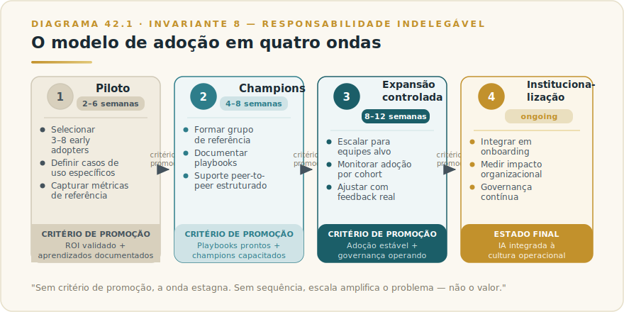
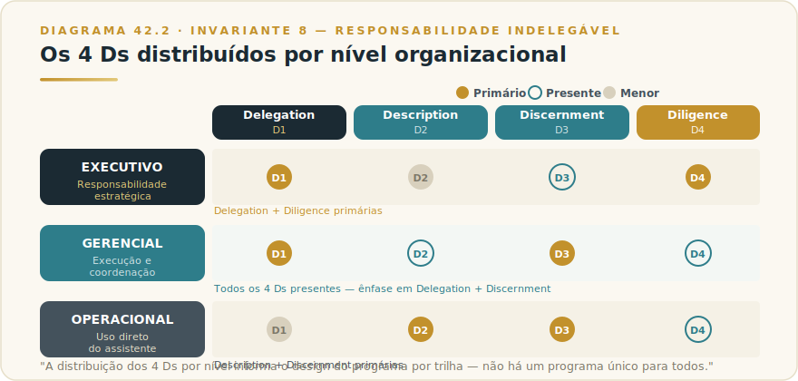
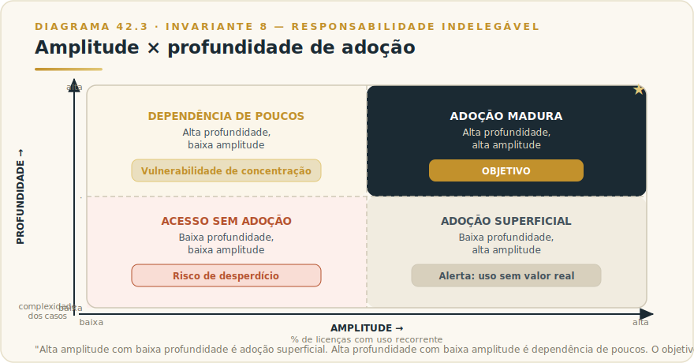

# CAPÍTULO 43
## ADOÇÃO INSTITUCIONAL

---

> *"Licença comprada não é adoção. Reunião de lançamento não é mudança. O verdadeiro rollout começa no dia em que a segunda pessoa da organização usa com proficiência — e termina no dia em que parar de usar vira a exceção que exige justificativa."*

---

> 🧭 **Por que este capítulo é a aplicação do Invariante 8 — Responsabilidade Indelegável**
>
> Adoção institucional é o momento em que o risco do Invariante 8 se multiplica pelo tamanho da organização. Quando uma única pessoa usa IA sem fluência, o dano é local. Quando uma organização inteira usa IA sem fluência — sem saber o que delegar, sem critério para julgar o que recebe, sem clareza de quem responde pelo que a ferramenta faz — o dano escala por cada conversa, cada decisão, cada entregável que flui da IA para o mundo exterior sem supervisão adequada.
>
> A adoção em escala distribui o uso da IA por muitas pessoas com níveis de maturidade, incentivos e contextos diferentes. Se a responsabilidade não for articulada com a mesma clareza com que a licença foi adquirida, a adoção amplifica risco em vez de valor. Este capítulo trata rollout institucional como problema de governança da responsabilidade — e o programa de fluência como o mecanismo que torna essa responsabilidade exercível por quem está na ponta.

---

## 43.1 — O CONCEITO INTUITIVO

O padrão se repete. O início é promissor: liderança anuncia a iniciativa, TI configura o ambiente, workshop de lançamento, licenças distribuídas. Três meses depois, a ferramenta está disponível para todos — e usada ativamente por uma minoria. Seis meses depois, o impacto reportado é difuso e a pergunta "quanto valor estamos gerando?" não tem resposta.

O diagnóstico costuma ser o errado. Não é o modelo. É que a organização comprou acesso e chamou isso de adoção.

Acesso e adoção são categorias distintas. Acesso é condição necessária; adoção é a condição suficiente: capacidade distribuída de usar com propósito, fluência e responsabilidade. A maioria das iniciativas de IA institucional vive nessa distância, estagnada.

O Invariante 8 revela por que isso importa além da eficiência. Em adoção real, cada pessoa que usa Claude opera um sistema que produz outputs com consequências — análises que informam decisões, comunicações que chegam a clientes, documentos com efeito jurídico ou operacional. Responsabilidade pelo que esse sistema faz precisa de nome, critério e capacidade — e é justamente a capacidade que a maioria dos programas de rollout não entrega.

---

## 43.2 — ANALOGIA: A DIFERENÇA ENTRE INAUGURAR O GINÁSIO E TREINAR O TIME

Uma empresa construiu uma academia corporativa: equipamentos de ponta, professores disponíveis, cerimônia com o CEO, carteirinhas para todos. Seis meses depois: 12% frequentam regularmente. Os poucos que usam bem são os que já tinham experiência anterior.

A empresa resolveu o problema de infraestrutura. O problema de saúde corporativa continua intacto.

Adoção de IA é o ginásio. O programa de fluência é o treino. Sem o segundo, o primeiro é custo sem retorno. E há uma diferença que a analogia revela: no ginásio, quem usa errado se machuca a si mesmo. Na IA institucional, quem usa sem discernimento produz outputs que saem da organização — para clientes, para reguladores, para o mercado.

---

## 43.3 — O MÉTODO DE ADOÇÃO INSTITUCIONAL

### 43.3.1 — Por que a maioria das adoções falha

Os padrões de falha não são aleatórios — são previsíveis e reconhecíveis.

**Ferramenta sem método.** A organização configura o acesso e comunica "agora temos IA disponível". Sem framework de como usar, sem critério do que delegar, sem distinção entre o que a IA executa bem e o que é perigoso sem supervisão. O resultado é uso disperso, dependente do perfil individual.

**Treinamento de botão sem fluência.** O workshop ensina "como escrever um prompt" — e para aí. Prompt engineering é uma fração de uma das quatro competências do AI Fluency Framework (Description — Cap. 1). Quem sai com dez templates sem critério de Delegation não sabe o que deveria estar delegando. Quem não desenvolveu Discernment aceita outputs plausíveis com erros graves. Quem não internalizou Diligence não sabe que responde pelos outputs que usa.

**Caso de uso sem ancoragem.** IA lançada "para tudo" não demonstra valor em nada. Sem caso de uso com critério de sucesso definido, o rollout dispersa energia em usos marginais e produz zero casos âncora com ROI verificável.

**Adoção top-down sem infraestrutura bottom.** A pressão vem da liderança; a fluência não chega na ponta. "Adoção de fachada" é o resultado clássico — uso superficial suficiente para reportar atividade, insuficiente para gerar valor.

**Ausência de responsabilidade articulada.** Em rollouts mal executados, ninguém é nominalmente responsável pelos outputs de IA que saem da organização. O RACI não foi feito. A política não foi treinada. O Invariante 8 é violado sistematicamente — até que um incidente torne a violação visível.

---

### 43.3.2 — O modelo de adoção em ondas

O antídoto não é velocidade — é sequência. Cada onda constrói capacidade que sustenta a próxima.

**Onda 1 — Piloto.** O objetivo não é provar que IA funciona em geral — é provar que gera valor mensurável em um caso de uso específico, com grupo pequeno e controlado, em tempo delimitado. O caso de uso deve ter alto volume (impacto visível), estrutura para medição antes/depois, e baixo risco de dano. A Anthropic recomenda pilotos que demonstrem valor em 30–60 dias.

O piloto produz três saídas além do resultado de negócio: (a) dados de uso real que fundamentam o business case; (b) Champions com fluência genuína; (c) biblioteca embrionária de padrões validados para aquele contexto.

**Onda 2 — Champions.** Champions não são entusiastas voluntários — são profissionais selecionados por área, com mandato explícito para desenvolver fluência profunda, criar casos validados e servir como referência para o time imediato. Escala de fluência não ocorre em cascata top-down sem nós de amplificação na rede — os Champions são esses nós.

O programa tem estrutura: reuniões regulares com o time de habilitação, tempo protegido para experimentação, canal de casos validados, e critério de quando um padrão está maduro para virar referência de time.

**Onda 3 — Expansão controlada.** Expansão não é "dar acesso a todos" — é estender acesso com infraestrutura de fluência: onboarding com os 4 Ds (Cap. 1), biblioteca de casos por área, Projects com Custom Instructions relevantes (Cap. 13), Skills prontas para os fluxos mais comuns (Cap. 31). Expansão sem essa infraestrutura repete o padrão de falha em escala maior.

Critério de entrada: pelo menos dois casos de uso com ROI demonstrado; um Champion por área; política de uso publicada e treinada; RACI com donos nominais. Sem esses quatro, a expansão amplifica o problema.

**Onda 4 — Institucionalização.** O uso de IA deixa de ser iniciativa e vira infraestrutura cognitiva. Sinais: novos funcionários onboardados com fluência no processo padrão; casos documentados e reutilizados sistematicamente; Skills e Projects mantidos como ativos organizacionais; a métrica deixa de ser "licenças usadas esta semana" e passa a ser "impacto mensurável por área".

É quando o Invariante 8 se manifesta com maior força: responsabilidade pelo uso de IA articulada não como burocracia, mas como clareza de quem responde pelo quê. Não é evento: é disciplina mantida.

---

### 43.3.3 — Programa de fluência executiva e de times

Fluência não é treinamento. Treinamento é evento; fluência é capacidade instalada. Um workshop pode criar consciência — não competência. Fluência requer prática, feedback e casos de uso reais.

O AI Fluency Framework da Anthropic (desenvolvido com Prof. Joseph Feller, University College Cork, e Prof. Rick Dakan, Ringling College) define quatro competências — Delegation, Description, Discernment, Diligence — detalhadas no Capítulo 1. O programa institucional precisa desenvolver as quatro, não apenas Description (onde a maioria dos workshops para).

**Trilha executiva.** O programa prioriza Delegation (o que deve e não deve ser delegado) e Diligence (accountability pelo que a IA produz). O formato mais eficaz não é workshop — é acompanhamento em casos reais: o executivo usa, o Champion observa, o feedback é específico ao caso. Sessões curtas, alta recorrência.

**Trilha gerencial.** Gestores precisam dos quatro Ds com profundidade — são o elo entre diretriz executiva e operação do time. Seu papel crítico é Discernment: aprovam ou rejeitam outputs de IA que chegam ao nível de decisão. Um gestor que aceita outputs sem verificação envia um sinal claro: qualidade não importa aqui.

**Trilha operacional.** Description e Discernment são as alavancas primárias. O programa é mais longo em tempo de prática, usa a biblioteca de casos validados pelos Champions como referência, e opera em ambientes psicologicamente seguros para experimentação — onde errar com IA é aprendizado, não falha.

---

### 43.3.4 — Biblioteca de casos de uso e padrões reutilizáveis

A biblioteca de casos é uma das saídas mais subestimadas de um rollout bem executado. Casos validados têm três funções:

**Reduzem a curva de adoção** — em vez de reinventar a roda, novos usuários partem de padrões testados que mostram quando um uso faz sentido, qual o critério de aceitação do output, quais riscos monitorar.

**Criam linguagem comum** sobre o que é uso de qualidade. A biblioteca não é lista de prompts — é documentação de contexto, critério e risco.

**Alimentam as Skills** (Cap. 31) com os padrões mais maduros. A progressão natural: caso de uso identificado no piloto → validado pelos Champions → documentado na biblioteca → formalizado como Skill. Quando esse ciclo funciona, a organização constrói capital intelectual reaplicável.

Projects bem configurados (Cap. 13) são a memória de contexto organizacional. Um Project com Custom Instructions calibradas para o jurídico, Knowledge Base com contratos e políticas relevantes, e conversas organizadas por matéria — isso é infraestrutura cognitiva, não apenas acesso à IA.

---

### 43.3.5 — Gestão de mudança e resistência

Resistência à adoção de IA não é irracional. É a resposta racional de quem vê uma tecnologia chegar sem clareza sobre o que significa para seu papel, sem fluência para usá-la bem, e sem garantia de que o erro de aprendizado não terá custo para a carreira.

> 🎯 **DA CADEIRA DO CTO**
>
> Liderar adoção sem teatro significa ter uma resposta honesta para a pergunta "o que mudou para você esta semana por causa da IA?" — e a resposta não pode ser "implantamos a ferramenta". Toda adoção que já acompanhei que virou teatro tinha o mesmo DNA: liderança comunicando métricas de licença como se fossem métricas de resultado, piloto eterno sem critério de promoção, e Champions que apresentam em reunião mas não conseguem nomear o que o time mudou de verdade. O que funciona: eu escolho uma área, defino uma métrica de processo específica — tempo de ciclo de um contrato, número de rodadas de revisão de um relatório — meço antes, e exijo o número depois de 60 dias. Se o número não moveu, o caso de uso está errado, não a tecnologia. Adoção de verdade não precisa de apresentação — aparece na métrica.
>
> O aparte de turnaround: quando preciso virar uma área travada, a primeira coisa que faço com Claude não é pedir ao time para "usar IA". Eu mesmo mapejo onde o gargalo está — onde o tempo some, onde o retrabalho se acumula — e conecto Claude diretamente a esse ponto. Se o gargalo é revisão de documentos antes de aprovação, monto um fluxo com Claude, meço o antes, e apresento o depois em duas semanas. Vitória concreta, visível, sem encenação. O time de turnaround adota o que resolve o problema real — não o que a liderança mandou adotar.

Dados do contexto brasileiro apontam para o fator humano como gargalo principal: mais da metade das empresas cita falta de expertise interna; cerca de 22% relatam resistência de funcionários, frequentemente resultado de iniciativas mal comunicadas (Falconi/TI Inside, jul. 2025). Números específicos ficam no Apêndice J.

Resistência é gerenciável quando comunicação precede ação, a narrativa é de augmentação — não substituição — e o ambiente é seguro para experimentar. Torna-se obstáculo estrutural quando a ferramenta chega antes da narrativa e o erro de aprendizado tem custo visível.

Três princípios âncora para gestão de mudança:

**Liderança articula o porquê antes de implementar o como.** Comunicação vaga ("vamos usar IA para melhorar a produtividade") aumenta ansiedade; comunicação específica ("vamos eliminar X horas por semana em análise de Y para o time focar em Z") cria direção.

**Mentalidade de crescimento como cultura operacional.** Erro com IA é dado de aprendizado, não falha. Organizações que registram o que tentaram, o que funcionou e o que ajustaram transformam aprendizado individual em conhecimento coletivo.

**Vitórias visíveis e específicas.** Vitórias não comunicadas não fazem momentum. Quando um Champion de jurídico demonstra três horas economizadas por contrato analisado, isso move mais do que qualquer benchmark global. Casos reais, pessoas reais, números verificáveis.

---

### 43.3.6 — Medir adoção de verdade

"Licenças ativas" ou "usuários no mês" medem acesso, não adoção. Uma pessoa que abre Claude uma vez por mês para uma pergunta que poderia ir ao Google é "licença ativa" sem ser adoção.

Adoção real tem duas dimensões: **amplitude** (quantas pessoas usam de forma recorrente) e **profundidade** (nível de complexidade e impacto do uso).

**Métricas de amplitude.** Taxa de uso ativo semanal por departamento; percentual de licenças com pelo menos três usos por semana; retenção aos 30, 60 e 90 dias. A taxa de 90 dias é particularmente reveladora: usuários que chegaram com uso recorrente raramente abandonam; os que não chegaram raramente voltam sem intervenção.

**Métricas de profundidade.** Percentual de usos com contexto organizacional específico; percentual com múltiplos turnos de iteração; presença de Projects e Skills configurados por área; casos documentados na biblioteca.

**Métricas de impacto.** Horas recuperadas por função (antes/depois em tarefas específicas); ROI verificável em casos âncora; redução de ciclo de tempo em processos ancorados.

Alta amplitude com baixa profundidade é adoção superficial. Alta profundidade com baixa amplitude é dependência de poucos — vulnerabilidade de concentração. O objetivo é amplitude crescente com profundidade crescente.

---

## 43.4 — CRITÉRIO DE DECISÃO

### Top-down vs. bottom-up: não é uma escolha

A pergunta mais comum é "devemos começar top-down ou bottom-up?". A resposta: você precisa dos dois, com papéis não intercambiáveis.

**Top-down entrega** mandato (sem sinal claro da liderança, resistência passiva de gestores médios enterra a iniciativa), recurso (tempo protegido para Champions, budget para fluência) e accountability (o RACI só emerge com clareza quando a liderança o define).

**Bottom-up entrega** casos de uso reais com especificidade suficiente para gerar valor, credibilidade de adoção (pessoas adotam quando veem pares com resultado) e aprendizado real (o que funciona emerge na prática, não no planejamento).

A receita: mandato e recurso top-down, casos de uso e momentum bottom-up. Programas que tentam uma fonte só falham de formas previsíveis.

---

### Quando escalar uma onda

Avançar de onda tem critério — não é questão de momentum ou de ansiedade da liderança.

| Onda | Critério de promoção |
|------|---------------------|
| Piloto → Champions | Pelo menos 1 caso de uso com ROI mensurável documentado; pelo menos 5 usuários com uso profundo (>3 sessões/semana, usos de análise ou fluxo multiestágio); lições aprendidas registradas |
| Champions → Expansão | Pelo menos 2 casos de uso por área de expansão; pelo menos 1 Champion por área; política de uso publicada; RACI com donos nominais assinado |
| Expansão → Institucionalização | Onboarding de novos funcionários inclui fluência; pelo menos 3 Skills ativas mantidas por time; métricas de profundidade crescente por trimestre; AI Council com cadência regular (ver governança) |

O que faz pilotos estagnarem não é falta de entusiasmo — é ausência de critério de promoção. Sem saber o que precisa acontecer para avançar, o piloto fica em beta indefinido e é descontinuado quando a atenção da liderança migra para outra prioridade.

---

### Sinais de adoção de fachada

Adoção de fachada é quando os indicadores mostram progresso mas o uso real não está instalado — o estado mais perigoso: produz falsa confiança enquanto o risco não gerenciado acumula.

> ⚠️ **POSTMORTEM — TEATRO DE IA**
>
> *O que tentaram:* Uma empresa de médio porte lançou sua "iniciativa de IA" com evento interno, vídeo do CEO, metas de adoção medidas por licenças ativas. Três meses depois: 78% de licenças "ativas" (pelo menos um login no mês), zero casos de uso com métrica de resultado documentada. O dashboard mostrava crescimento de 340% em prompts enviados. A pergunta "qual processo melhorou?" não tinha resposta.
>
> *O que deu errado:* Os três sinais clássicos de teatro de IA em sequência — vaidade de métrica (prompts como proxy de valor), prompt-theater (demonstrações em apresentações, sem uso no trabalho real), e piloto eterno (o piloto durou oito meses sem critério de promoção porque ninguém queria ser responsável por um resultado negativo). Os Champions existiam no organograma; nenhum conseguia nomear o principal padrão de uso do seu time.
>
> *O Invariante violado:* Inv. 8 — Responsabilidade Indelegável. Quando ninguém é nominalmente responsável pelo resultado da adoção — apenas pelo processo de lançamento — o teatro é o resultado natural. O Livro 1 é direto: método sem dono identificável não é método, é declaração de intenção. Adoção com método exige que alguém responda pelo número, não pela iniciativa.
>
> *O que teria evitado:* Definir, antes do lançamento, uma única métrica de resultado por área — com nome da pessoa responsável por reportá-la em 60 dias. Não "taxa de adoção": tempo de ciclo de processo X ou número de rodadas de revisão de entregável Y. Métrica que pode decepcionar é a única métrica que prova que a adoção foi real.

| Sinal | O que indica |
|-------|-------------|
| Alto número de licenças, baixo uso recorrente (>50% das licenças com menos de 1 uso/semana) | Acesso sem adoção |
| Usos concentrados em tipos triviais (perguntas de pesquisa simples, reformatação) | Amplitude sem profundidade |
| Ausência de Projects ou Skills configurados após 90 dias | Sem infraestrutura de memória organizacional |
| Casos de uso relatados não são específicos ("usamos IA para produtividade em geral") | Sem ancoragem em valor mensurável |
| Champions não conseguem nomear os três principais padrões de uso do seu time | Champions de nome, não de função |
| Saída de IA nunca é questionada ou rejeitada pelo time | Ausência de Discernment; adoção de fachada com risco real |
| ROI de IA não é medido por função — é reportado como "satisfação geral" | Métrica de processo, não de resultado |

O último sinal conecta ao Invariante 8. Uma organização cujo time nunca questiona output de IA não demonstra fluência — demonstra que o Discernment não foi desenvolvido. Qualquer output plausível, incluindo com erros factuais ou viés invisível, sai da organização sem supervisão. Adoção de fachada não é apenas ineficiência — é passivo de governança.

---

## 43.5 — EXEMPLO BRASILEIRO: FINTECH DE MÉDIO PORTE EM SÃO PAULO

*(Cenário ilustrativo construído a partir de padrões recorrentes em empresas brasileiras de serviços financeiros — não representa uma empresa específica.)*

Uma fintech com 400 funcionários, regulada pelo Banco Central, adotou Claude para acelerar análise de crédito, contratos e comunicação com clientes. O time de tecnologia configurou o ambiente em duas semanas. O CEO enviou um e-mail anunciando a disponibilidade. Nada mais foi feito.

Noventa dias depois: 18% das licenças com uso recorrente. Uso concentrado em comunicação e marketing. Times de análise de crédito e jurídico — as áreas de maior valor potencial — com menos de 5% de uso ativo. O feedback revelou dois padrões: "não sei o que posso usar para meu trabalho" e "tenho medo de usar para análise regulatória sem mais orientação".

O segundo padrão era preciso: ausência de política e RACI em empresa regulada é risco real. O medo era informado.

A correção seguiu o modelo de ondas. **Fase 1:** piloto em análise de contratos comerciais (fora do escopo de crédito regulado) com quatro analistas jurídicos por oito semanas. Resultado: redução de 40% no tempo de revisão de primeira análise. **Fase 2:** programa de Champions com dois analistas jurídicos, dois de crédito não-regulado e um de comunicação. RACI assinado pela diretoria com cinco papéis e oito decisões. Política de uso com seção específica para contexto regulatório (o que pode, o que exige revisão humana, o que não pode). **Fase 3:** expansão com onboarding nos 4 Ds, dois Projects configurados (jurídico e crédito), uma Skill para análise de contrato comercial.

Resultado em doze meses: uso recorrente em 61% das licenças; dois casos com ROI documentado; zero incidentes regulatórios; RACI com revisão trimestral estabelecida.

O que fez a diferença não foi tecnologia adicional: foi sequência, responsabilidade articulada e infraestrutura de fluência antes da expansão.

---

## 43.6 — NA PRÁTICA: TRÊS APLICAÇÕES REPLICÁVEIS

Três aplicações que qualquer organização pode iniciar esta semana. Cada uma segue a forma *situação → o que fazer → o ponto de julgamento*, porque o passo a passo é replicável, mas é o ponto de julgamento que separa adoção real de adoção de fachada.

**Aplicação 1 — Definir o critério de promoção do piloto.**
*Situação:* a organização tem um piloto em andamento — um grupo pequeno usando Claude há seis a dez semanas. A pressão para expandir chegou antes de qualquer resultado documentado. *O que fazer:* defina os três critérios de promoção da Onda 1 → Onda 2: (a) pelo menos um caso de uso com dado de tempo de ciclo antes/depois; (b) pelo menos cinco usuários com uso recorrente profundo documentado; (c) lições aprendidas registradas em documento compartilhado. *O ponto de julgamento:* se os três critérios não forem cumpridos, a expansão não é promoção de onda — é presunção. Expandir antes de ter Champions identificados é o caminho mais direto para adoção de fachada. Sem critério documentado, a responsabilidade pelo resultado da expansão fica sem dono (Invariante 8).

**Aplicação 2 — Estruturar o programa de Champions de uma área.**
*Situação:* você escolheu uma área-piloto e quer transformar dois ou três usuários avançados em Champions formais. *O que fazer:* nomeie com mandato explícito por escrito; proteja tempo semanal para experimentação; crie canal de casos validados com formato padronizado (contexto + o que funcionou + ponto de atenção); defina com eles os três padrões de uso que o time imediato deve adotar nas próximas quatro semanas. *O ponto de julgamento:* os Champions conseguem nomear, sem hesitação, os três principais padrões do seu time — e esses padrões chegam a outros colegas? Champion que não transfere conhecimento é usuário avançado com título: não resolve o problema de difusão de fluência (Invariante 8 em escala).

**Aplicação 3 — Montar a métrica-âncora de adoção real para uma área.**
*Situação:* o dashboard mostra "licenças ativas" e "prompts por mês". A liderança pede evidência de valor antes de renovar. *O que fazer:* escolha um processo específico da área (ex.: revisão de contrato, análise de crédito de pequena empresa, briefing de campanha); meça o tempo de ciclo atual sem IA; rode a mesma tarefa com Claude por quatro semanas; meça com IA; documente a diferença com amostra de pelo menos dez tarefas comparáveis. *O ponto de julgamento:* se a diferença não for discernível — ou se o tempo economizado não for realocado para trabalho de valor superior — o caso de uso não gera ROI real. Adoção sem métrica honesta é o ROI de slide do Capítulo 44: convincente na apresentação, indefensável na revisão.

> 🔧 **EXERCÍCIO**
> Pegue a lista de usuários com licença ativa na sua organização. Filtre os que fizeram pelo menos três sessões na última semana. Calcule a porcentagem. Se for abaixo de 30%, você está pagando por acesso, não por adoção. Para os 70% restantes: escolha cinco ao acaso e pergunte o que fizeram com Claude na última semana. Se não conseguirem descrever um caso concreto com resultado específico, a adoção de fachada já chegou — e a próxima reunião com o CFO vai cobrar o que você ainda não tem como responder.

---

## 43.7 — CAMADA VIVA

Os padrões neste capítulo são duráveis — ondas de adoção, distinção entre acesso e adoção, papel dos Champions, métricas de amplitude versus profundidade, sinais de adoção de fachada. Descrevem a mecânica de difusão de capacidade nova numa organização: um problema humano antes de ser tecnológico.

O que envelhece rapidamente: dados de mercado, benchmarks de ROI por setor, funcionalidades de Projects e Skills, limites de janela de contexto, preços de licença. Esses números ficam no Apêndice J com data de referência.

→ [Apêndice J — Apêndice Vivo](../04-apendices/L2-APX-J-apendice-vivo.md)

---

## 43.8 — LIMITAÇÕES E O QUE ESTE CAPÍTULO NÃO RESOLVE

**Integração técnica não está aqui.** SSO, retenção de dados, conectores com sistemas legados, compliance com LGPD — pertencem ao escopo de TI e governança técnica. O capítulo assume que esses bloqueadores foram ou serão resolvidos.

**O modelo de ondas não é universal.** Organizações com menos de 30 pessoas podem colapsar piloto e institucionalização em semanas. Com mais de 5.000, a gestão política entre divisões exige adaptação. O framework é ponto de partida, não receita única.

**Fluência não é estado final.** O que um Champion precisa saber sobre Claude em 2026 é diferente do que precisará em 2028. O programa de fluência é infraestrutura de aprendizado contínuo, não evento de certificação.

---

## 43.9 — CONEXÕES

- **[Cap. 1 — AI Fluency Executiva](L2-C01-executivos.md):** os 4 Ds são o framework de fluência que o programa de adoção precisa instalar. O capítulo atual trata como distribuir essa capacidade na organização; o Cap. 1 detalha cada competência.
- **[Cap. 13 — Projects](L2-C13-projects.md):** a infraestrutura de memória organizacional que sustenta adoção profunda. Projects bem configurados são o que distingue uso recorrente com valor de uso superficial.
- **[Cap. 30 — Skills](L2-C31-skills.md):** a formalização de casos de uso em ativos reaplicáveis. Skills são o destino natural dos padrões descobertos no piloto e validados pelos Champions.
- **[Cap. 41 — Governança Executiva](L2-C42-governanca-executiva.md):** o RACI de IA, a política de uso aceitável e o AI Council são pré-requisitos para a onda de expansão. Adoção sem governança é o padrão de falha mais perigoso.
- **[Cap. 43 — ROI e Impacto](L2-C44-roi-metricas.md):** as métricas mencionadas aqui são detalhadas no Cap. 44. A conexão é bidirecional: adoção produz dados de impacto; impacto demonstrável sustenta o business case para a próxima onda.
- **[L1-F6 — Governança Indelegável](../../Livro-1-Os-Invariantes/03-frameworks/L1-F6-gov-indelegavel.md):** o framework dos 10 controles canônicos e do RACI de 12 decisões que sustenta o Invariante 8 em forma operacional.

---

## RESUMO DO CAPÍTULO 42

A maioria das adoções institucionais de IA falha não por problema de produto, mas por problema de método: ferramenta sem framework, treinamento de botão sem fluência, e responsabilidade não articulada que transforma escala em amplificação de risco.

O antídoto é um modelo de ondas com critério: piloto para provar valor específico e identificar Champions; programa de Champions para criar nós de fluência na rede; expansão acompanhada de infraestrutura (Projects, Skills, política de uso, RACI); e institucionalização como estado em que fluência é parte do onboarding padrão.

A decisão top-down vs. bottom-up é falsa — os dois vetores têm papéis não-intercambiáveis. O critério de quando escalar uma onda é concreto e verificável. Os sinais de adoção de fachada são reconhecíveis antes de se tornarem incidentes.

O Invariante 8 não é apenas governança — é design organizacional. Quando a responsabilidade pelo que a IA produz está clara, articulada e exercível por quem está na ponta, adoção vira vantagem competitiva sustentável. Quando não está, vira passivo distribuído por toda a organização.

---

☐ **UAU** — *O momento em que você percebe que o real gargalo do rollout nunca foi tecnologia — foi responsabilidade sem nome. E que nomear quem responde pelo quê não é burocracia: é o que transforma adoção de fachada em transformação real.*

---

> *"A organização que instala fluência em escala não está comprando uma ferramenta melhor. Está construindo uma capacidade nova — e capacidade, ao contrário de ferramenta, não fica obsoleta quando o modelo muda."*

---

**Fontes consultadas para este capítulo:**
- Anthropic. *Enterprise AI Transformation Guide*. resources.anthropic.com/enterprise-ai-transformation-guide (2026)
- Anthropic. *Driving Enterprise Adoption of Claude* (curso). anthropic.skilljar.com/driving-enterprise-adoption-of-claude (2025)
- Feller, J.; Dakan, R.; Anthropic. *The AI Fluency Framework* (4D Framework). www-cdn.anthropic.com/b383cf6baddbfc72fdf8b0ed533a518e2872d531.pdf (2025)
- Mineti, L. (Falconi). "Os maiores entraves para a adoção de IA nas empresas brasileiras". TI Inside, 2 jul. 2025. tiinside.com.br/02/07/2025/os-maiores-entraves-para-a-adocao-de-ia-nas-empresas-brasileiras/
- McKinsey Global Institute. *Superagency in the Workplace*. mckinsey.com (citado em Anthropic Enterprise Guide, 2026) — número de referência (92% das empresas planejam investir em IA nos próximos 3 anos) → Apêndice J
- Dados do contexto brasileiro (SAS, Cisco AI Readiness Index, IBGE) — citados como referência de padrão; números específicos com data → Apêndice J
