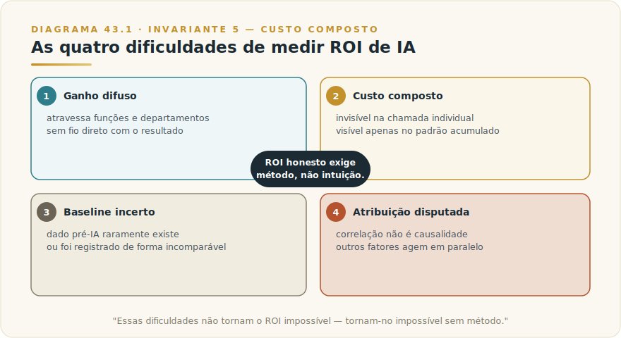
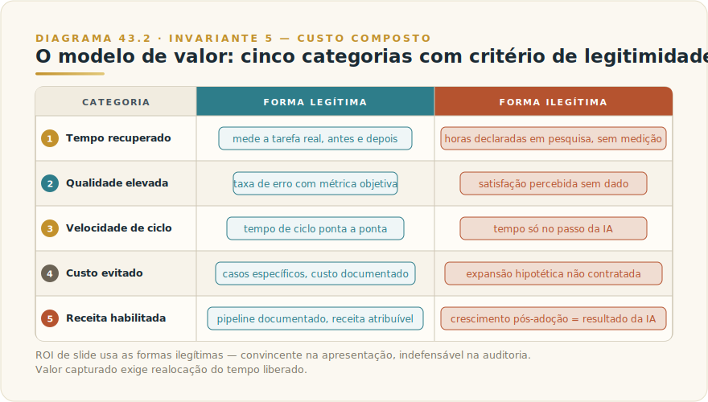
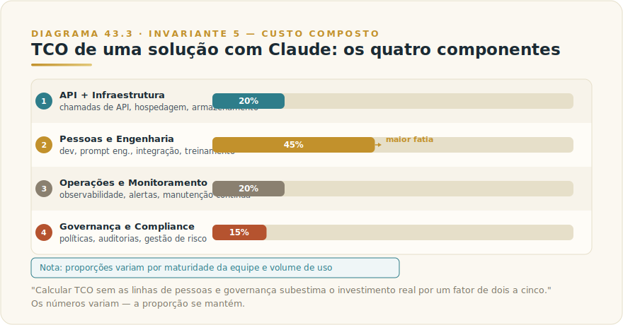
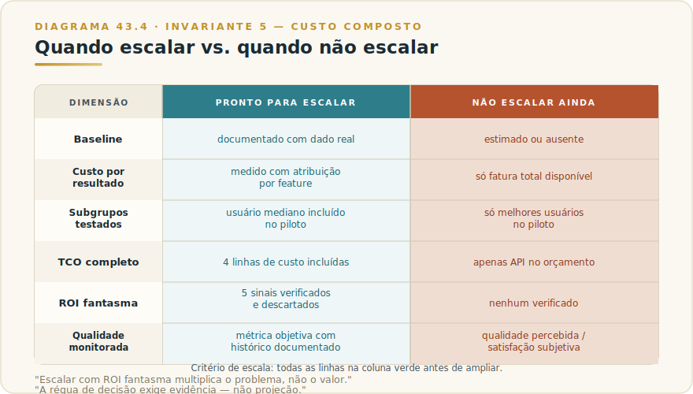

# CAPÍTULO 44
## ROI, MÉTRICAS E ORÇAMENTO

---

> *"O custo de IA que você vê na fatura é o menor custo que você paga. O custo que você não está medindo é o que decide se vale a pena."*

---

> 🧭 **Por que este capítulo é a aplicação do Invariante 5 — Custo Composto**
>
> O Invariante 5 enuncia que o custo e o valor da IA se acumulam por uso. Cada chamada ao modelo não é um evento isolado: ela se multiplica pelo volume, pelo tier escolhido, pela redundância arquitetural, pelo tamanho do contexto — e por todos os trimestres futuros em que esse padrão se repetir. ROI de IA exige medir o composto, não a chamada. Quem mede a chamada toma decisões de orçamento com uma régua curta demais para o problema.
>
> O Framework 7 — Custo Composto em Três Tempos (F7) do Livro 1 formaliza essa mecânica: o custo total é a função de chamadas × tier × redundância × tamanho de contexto. Este capítulo é a aterrissagem executiva desse framework: como transformar a fórmula em método de avaliação, em orçamento defensável e em critério de escala que sobrevive à pergunta do CFO.

---

## 44.1 — POR QUE ROI DE IA É DIFERENTE — E MAIS DIFÍCIL

Toda tecnologia nova enfrenta o problema da justificativa financeira. A diferença com IA generativa é que as dificuldades clássicas de medição aparecem amplificadas, em novas formas, ao mesmo tempo.

### O ganho é difuso

O software tradicional resolve um problema específico e o efeito é direto: um CRM que automatiza qualquer follow-up economiza exatamente o tempo gasto naquele follow-up. IA generativa melhora processos que atravessam funções, reduz fricção em pontos raramente medidos, e eleva a qualidade de saídas sem baseline formal. Um jurídico que usa Claude para revisar contratos fica mais rápido e produz menos erros — mas raramente havia régua para medir velocidade e qualidade antes. O ganho existe, é real, e é difuso demais para enxergar sem método.

### O custo é composto e invisível

O custo de uma chamada à API é minúsculo. O custo de dez mil chamadas por dia, multiplicado por um system prompt de 8 mil tokens reprocessado em cada uma, multiplicado por um tier premium usado onde Sonnet bastaria, multiplicado por doze meses, é outra ordem de grandeza. Esse é o princípio central do Invariante 5: o custo não é por chamada — é o padrão arquitetural acumulado ao longo do tempo. Organizações que olham só a fatura mensal nunca enxergam o composto.

### O baseline é incerto

Para calcular ganho, você precisa saber de onde partiu. Quanto tempo um analista gastava numa tarefa antes? Quantos erros eram cometidos? Qual era o custo de um ciclo de revisão? Na maioria das empresas, esse dado não existe — e quando existe, está em planilhas que ninguém confia completamente. Sem baseline confiável, o ROI calculado é ficção com aparência de análise.

### A atribuição é disputada

Quando a produtividade de uma equipe sobe depois que ela adota IA, quanto disso é Claude? Quanto é o novo processo que veio junto? Quanto é o treinamento que aconteceu ao mesmo tempo? Atribuição limpa é rara, e sem ela, ROI vira narrativa que qualquer pessoa consegue contestar.

Essas dificuldades não tornam o ROI impossível — tornam-no impossível *sem método*. E a ausência de método produz dois comportamentos igualmente problemáticos: o ROI de slide — inflado, incontestável, sem operacionalização — e a paralisia de medição — tão preocupados em medir certo que nunca medem nada.

---

## 44.2 — ANALOGIA: O GERENTE DE FROTA

Uma empresa de logística decide substituir os veículos diesel de sua frota por elétricos. O gerente de frota recebe a missão de calcular o ROI.

O gerente ruim soma o custo de carregamento elétrico, compara com o custo do diesel, divide pelo número de viagens, e apresenta uma economia anualizada com três casas decimais. Resultado: planilha impecável, análise errada. Ele não mediu o composto — não incluiu manutenção diferencial, vida útil de bateria, custo de infraestrutura de carregamento, impacto na roteirização por limitação de autonomia, treinamento de motoristas, custo de inatividade durante recarga.

O gerente bom começa pelo uso real. Mapeia quais rotas têm perfil adequado para elétrico, quais não têm, e o que muda em cada uma. Mede baseline de custo operacional por rota, não por veículo em abstrato. Define métricas honestas: custo por km rodado, disponibilidade operacional, custo de manutenção por ano — não "economia teórica de combustível".

ROI de IA segue o mesmo princípio. A pergunta correta não é "quanto esse modelo custa por chamada?" — é "qual é o custo por resultado entregue, medido desde o baseline real, ao longo do tempo de uso?" O gerente de frota que mede custo por km rodado é o arquiteto de IA que mede custo por feature por usuário. O que varia é o veículo, não o método.

---

## 44.3 — O MÉTODO: DO CUSTO À DECISÃO DE ESCALA

### 44.3.1 — O modelo de valor: cinco categorias honestas

Valor de IA para uma organização se manifesta em cinco categorias. Cada uma tem formas legítimas e ilegítimas de ser medida.

**Tempo recuperado.** O mais direto: quanto tempo humano qualificado é deslocado de tarefas de menor valor? A forma legítima: meça a tarefa antes e depois, com amostra representativa, com o mesmo operador. A forma ilegítima: estimar "horas economizadas" multiplicando adoção pelo tempo médio declarado em pesquisa — sem medir a tarefa real, sem controle. Tempo recuperado só vale se o tempo liberado for realocado para trabalho de valor superior; se o operador simplesmente faz mais pausa, o valor não foi capturado.

**Qualidade elevada.** Menos erros, melhor saída, redução de retrabalho. A forma legítima: defina uma métrica de qualidade antes (taxa de erro em revisão, número de rodadas de edição, taxa de aprovação em primeira submissão), meça por período comparável. A forma ilegítima: citar que "a equipe está mais satisfeita com os resultados" sem dado objetivo.

**Velocidade de ciclo.** Um processo que levava sete dias leva três. A forma legítima: medir o tempo de ciclo de ponta a ponta, não só do passo onde a IA opera. A forma ilegítima: medir só o passo da IA e extrapolar para o processo inteiro.

**Custo evitado.** Terceirização que não acontece, contratação que não é necessária, erro que não gera penalidade. A forma legítima: casos específicos com custo documentado. A forma ilegítima: projetar uma "expansão que não contratamos" sem evidência de que a contratação seria necessária sem a IA.

**Receita habilitada.** Novos produtos, novas capacidades, velocidade de go-to-market. A forma legítima: pipeline de projetos que não eram viáveis antes da IA, com receita atribuível documentada. A forma ilegítima: qualquer crescimento de receita no período pós-adoção tratado como resultado da IA.

### 44.3.2 — Instrumentar custo de verdade

O Cap. 36 — LLMOps define a observabilidade de um sistema LLM em produção. A camada de custo é o Pilar 5 desse framework: atribuição de custo por feature. Sem ela, você não tem ROI — tem relato.

A instrumentação mínima: cada chamada à API registra o identificador da feature que a originou, o tier do modelo, os tokens de input e output, e o identificador de sessão ou usuário. Com esse log, você passa de "nossa fatura foi R$ X este mês" para "o agente de cotação do produto A consumiu 73% da fatura, a maior parte em chamadas Opus para classificação que Haiku faria igual".

Essa granularidade muda a conversa com o CFO. Em vez de defender um número total, você defende investimento por caso de uso, com dado de uso real. E quando um caso de uso passa a escala, você decide por evidência — não por intuição.

O Framework F7 — Custo Composto em Três Tempos (→ [L1-F7-composto-3t.md](../../Livro-1-Os-Invariantes/03-frameworks/L1-F7-composto-3t.md)) oferece o mapa estrutural: as três alavancas que determinam onde o custo composto cresce — T1 (tier de modelo), T2 (topologia de chamada, onde mora o prompt caching do Cap. 25), T3 (tamanho de contexto). A atribuição por feature revela qual alavanca está fora de controle.

A ordem de intervenção importa: T1 primeiro (roteamento de modelo — Cap. 5), T2 segundo (redundância e caching), T3 por último. A tentação de otimizar tamanho de prompt antes de roteamento de tier é o erro mais comum: marginal e visível, em vez de substancial e arquitetural.

### 44.3.3 — TCO de uma solução com Claude

API é a linha mais visível do orçamento de IA. Raramente é a maior.

O Custo Total de Propriedade (TCO) de uma solução com Claude tem quatro componentes que merecem linha própria:

**API e infraestrutura de chamada.** Tokens de input e output, por modelo, por volume. Inclui custos de gateway, logging, rate limiting. Os números exatos pertencem ao Apêndice J — por serem voláteis, não cabem no corpo do capítulo. O que é estrutural: o custo por milhão de tokens varia por ordem de magnitude entre tiers, e o composto ao longo do ano é dominado pela arquitetura, não pelo preço unitário.

**Pessoas e engenharia.** Quem desenha o sistema, quem o mantém, quem faz as evals (Cap. 36), quem atualiza os prompts quando o modelo evolui. Para soluções em produção, esse custo supera frequentemente o custo de API. Organizações que calculam TCO sem incluir custo de engenharia de manutenção subestimam o investimento real por um fator de dois a cinco.

**Operações e monitoramento.** Infraestrutura de observabilidade, alertas de custo, ferramentas de tracing. Não é gratuito e não é opcional — é o pré-requisito para saber se o sistema está operando dentro do envelope esperado.

**Governança e compliance.** Política de uso, revisão de saídas em fluxos de alto risco, tratamento de dados sensíveis, auditoria. No contexto regulatório brasileiro — LGPD, regulação setorial de bancos e saúde — esse componente tem peso próprio e não pode ser tratado como overhead de implantação.

### 44.3.4 — FinOps de IA: roteamento de modelo como alavanca primária

FinOps é a disciplina de visibilidade, atribuição e otimização de custo em infraestrutura de nuvem. Aplicada a LLMs, o princípio central é o mesmo: custo não gerenciado cresce até ser notado — e quando é notado na fatura, o padrão arquitetural já está estabelecido e é caro de mudar.

A alavanca de maior impacto é o roteamento de modelo (Cap. 5): rotear 70-80% das chamadas para o tier adequado — não o premium por padrão — é a intervenção de maior retorno antes de qualquer outra otimização. Um classificador leve na entrada da pipeline (T1 do Framework F7) decide a rota com base em sinais de complexidade da tarefa. Esse classificador custa muito menos do que as chamadas que ele desvia do tier premium.

Práticas complementares de FinOps para LLM:

- **Orçamento por feature, não por conta.** Definir limites de gasto por caso de uso, não apenas por total mensal. Quando o agente de cotação estoura o orçamento, você sabe antes do agente de suporte.
- **Alertas de custo por sessão.** Circuit breakers que interrompem sessões que excedem o envelope esperado de tokens — o mecanismo de T2 do Framework F7.
- **Batch API para workloads assíncronos.** Processamento em lote para tarefas que não exigem resposta em tempo real, disponível nos principais provedores com desconto substancial em relação à API síncrona.
- **Revisão periódica de tier.** O que exigia o modelo premium há seis meses pode não exigir mais — modelos menores evoluem. Revisão trimestral de qual tier cada feature realmente precisa é parte da higiene de FinOps.

---

> 🎯 **DA CADEIRA DO CTO**
>
> Nunca apresentei ROI de IA em slide sem ter o denominador documentado. Não porque seja mais honesto que os outros — mas porque aprendi que o slide que não sobrevive à pergunta do CFO na reunião seguinte custa mais do que o projeto inteiro. O que eu meço de verdade: custo por resultado entregue, com baseline documentado antes do deploy. Não "horas estimadas economizadas" — horas medidas em processo específico, com amostra real, antes e depois. O que eu nunca faço: somar "economia estimada" de dez times sem medir nenhuma. Esse número só serve para a apresentação ao board — não serve para decidir se vale escalar. A regra que uso: se o denominador do ROI não existe antes do piloto, o ROI calculado depois é ficção com aparência de análise. Defendo investimento em IA sem problema — mas só com denominador em mãos.

## 44.4 — MÉTRICAS HONESTAS VERSUS MÉTRICAS DE VAIDADE

Toda plataforma nova produz o mesmo fenômeno: métricas abundantes, fáceis de medir, fáceis de apresentar, e sem correlação com valor criado.

**Métricas de vaidade em IA:**
- Número de usuários que fizeram login na ferramenta de IA
- Total de prompts enviados por mês
- Número de tokens processados
- "Horas economizadas" de pesquisa de satisfação sem medição da tarefa
- Adoção declarada em pesquisa interna
- Número de casos de uso identificados

O problema dessas métricas não é que sejam falsas — é que são não-discriminantes. Crescem com qualquer adoção, independentemente de valor. Um sistema que faz usuários enviarem mais prompts sem melhorar resultados produz bons números nessas métricas.

**Métricas honestas** têm uma propriedade: elas podem desapontar. Se uma métrica nunca mostra que a IA não ajudou, é vaidade. As melhores métricas são aquelas que você se comprometeria a reportar mesmo se o resultado fosse negativo.

Exemplos de métricas honestas por categoria de valor:
- Tempo de ciclo de ponta a ponta de um processo específico, antes e depois (não o passo da IA, o processo inteiro)
- Taxa de aprovação na primeira rodada de revisão em documentos produzidos com IA vs. sem
- Custo por caso resolvido no suporte, com e sem assistência de IA
- Número de rodadas de edição até aprovação de contrato, com e sem Claude
- Tempo de onboarding de novo cliente para features que usam IA de geração de conteúdo
- NPS de segmento de clientes que usa produto habilitado por IA, vs. segmento sem acesso

A distinção do Cap. 36 — LLMOps — entre eval de qualidade e log de uso aplica-se aqui: log de uso são métricas de vaidade; evals que medem resultado real são métricas honestas.

---

> ⚠️ **POSTMORTEM — O ROI QUE SÓ EXISTIA NO SLIDE**
>
> *O que tentaram:* Uma empresa de serviços profissionais apresentou ao board um ROI projetado de R$ 4,2 milhões em produtividade recuperada no primeiro ano de adoção de IA. O número veio de pesquisa interna com 120 colaboradores perguntando "quantas horas por semana você acha que economiza com IA?" — multiplicado pelo custo-hora médio, multiplicado por 52 semanas. Aprovação unânime. Budget de expansão liberado.
>
> *O que deu errado:* Doze meses depois, a diretora financeira pediu o número real. Nenhum processo tinha baseline documentado. Nenhuma métrica de resultado havia sido configurada. Os logs de API mostravam volume crescente de uso — mas nenhuma feature tinha atribuição de custo. O TCO não incluía engenharia de manutenção nem o programa de treinamento que o rollout demandou. O ROI real, quando calculado com denominadores reais, era positivo — mas 60% menor que o slide. A diferença entre os dois números custou a credibilidade da liderança do projeto no ciclo de orçamento seguinte.
>
> *O Invariante violado:* Inv. 5 — Custo Composto. ROI de IA calculado sem denominator real e sem TCO completo ignora o composto — exatamente o que o Invariante 5 e o Framework F7 do Livro 1 alertam: o custo se acumula por padrão arquitetural, não por chamada; o valor se materializa em resultado medido, não em estimativa declarada.
>
> *O que teria evitado:* Antes de apresentar qualquer projeção ao board, definir três processos com baseline de tempo de ciclo documentado, instrumentar atribuição de custo por feature na API, e incluir todas as quatro linhas do TCO. O número menor, defensável, vale infinitamente mais do que o número grande que não sobrevive à primeira revisão.

## 44.5 — CRITÉRIO DE DECISÃO: O QUE MEDIR ANTES DE ESCALAR

Este é o coração do capítulo. Antes de escalar um caso de uso de IA — mais usuários, mais volume, mais integração, mais dependência operacional — três perguntas precisam ter resposta concreta, não projetada.

### Pergunta 1: O caso de uso se paga?

Um caso de uso se paga quando o valor criado (nas cinco categorias da seção 43.3.1) excede o TCO (nas quatro linhas da seção 43.3.3), com margem para custo de escala.

Critério operacional: calcule o custo total por resultado entregue — por contrato revisado, por ticket resolvido, por documento produzido, por lead qualificado. Compare com o custo do mesmo resultado antes da IA, com baseline documentado. Se o custo por resultado com IA é menor e a qualidade é equivalente ou superior, o caso de uso se paga. Se o custo é menor mas a qualidade caiu em subgrupos não-óbvios, o ROI é parcial — e a regressão escondida vai aparecer quando você escalar.

**Sinais de que o caso ainda não se paga:**
- Baseline pré-IA não documentado (o ROI não é calculável, é assumido)
- Custo por resultado com IA mais alto que sem IA (frequente em implantações iniciais com tier premium para tudo)
- Ganho de tempo sem realocação comprovada do tempo liberado
- TCO calculado sem linha de pessoas e governança

### Pergunta 2: O que medir antes de escalar

Antes de escalar, você precisa de evidência em amostra representativa — não em caso piloto com os melhores usuários, os processos mais adequados, e o suporte mais intensivo. As métricas que importam antes da escala:

| O que medir | Por que importa para escala |
|-------------|----------------------------|
| Custo por resultado com atribuição por feature | Escala multiplica custo — padrão ruim vira fatura ruim |
| Taxa de qualidade em subgrupos de usuário | Usuário avançado performa; usuário mediano vai revelar o caso real |
| Latência de ponta a ponta em carga real | Protótipo em carga baixa não prediz produção |
| Taxa de adoção ativa vs. adoção de registro | Login ≠ uso que gera valor |
| Custo de suporte e treinamento por usuário onboardado | Escala multiplica custo de adoção |
| Incidentes de qualidade por volume de uso | O que falha em pequena escala falha mais em grande |

### Pergunta 3: Sinais de ROI fantasma

ROI fantasma é o ROI que aparece no slide de justificativa mas não se materializa no resultado operacional. São cinco sinais:

**1. Tempo economizado sem destino.** O relatório de ROI mostra "X horas economizadas por semana" mas não mostra para onde foram. Se o tempo liberado foi absorvido por mais reuniões, mais e-mails, mais tarefas de baixo valor, o ganho real é próximo de zero.

**2. Ganho em tarefa, perda no processo.** A IA acelerou um passo, mas o gargalo mudou para o próximo passo sem IA, e o tempo de ciclo total não melhorou. O ROI da etapa é real; o ROI do processo é ilusório.

**3. Qualidade degradada não detectada.** Produtividade subiu, mas a taxa de erro também. O custo do erro só aparece downstream — na revisão do cliente, na penalidade contratual, no retrabalho meses depois. Métricas de produtividade sem métricas de qualidade são incompletas por construção.

**4. Adoção de fachada.** A ferramenta está implantada, a licença está paga, os usuários reportam usar — mas o uso real é marginal. Acontece quando a implantação foi top-down sem criação de hábito operacional real. Log de uso real discrimina isso; pesquisa de satisfação não.

**5. Custo oculto de governança.** O sistema funciona em produção, mas exige revisão humana em uma fração das saídas que não estava no plano original. Esse custo de revisão corrói a margem do ROI — e se não estava no TCO, o cálculo original estava errado.

---

## 44.6 — EXEMPLO BRASILEIRO: ATLAS CONSULTORIA

*(Baseado no Estudo de Caso 6 — Atlas Consultoria.)*

A Atlas é uma consultoria de estratégia com quarenta e dois consultores seniores. Após um piloto bem-sucedido de uso de Claude para pesquisa e síntese de mercado, a liderança recebeu uma proposta de escala: ampliar o uso para toda a equipe de análise, integrando Claude diretamente no workflow de produção de decks e relatórios.

A proposta incluía um ROI calculado a partir de pesquisa de satisfação interna: "consultores estimaram economizar em média quatro horas por semana". Multiplicado pelos quarenta e dois consultores, pelo custo-hora médio sênior, o número era convincente.

A diretora de operações pediu uma análise com métricas honestas antes de assinar a expansão.

**O que a análise revelou:**

Primeiro: o baseline era impreciso. A estimativa de "quatro horas por semana" veio de auto-relato no período pós-piloto, quando o entusiasmo com a ferramenta era maior. A revisão de projetos entregues no período mostrou que o tempo de ciclo médio dos relatórios caiu de oito dias para seis — não de oito para quatro, como o ROI de slide implicava.

Segundo: o ganho estava concentrado. Seis dos quarenta e dois consultores capturavam a maior parte do benefício — os mais habilidosos em prompting e com os tipos de projeto mais adequados para IA. O restante mostrava ganho marginal ou neutro.

Terceiro: o TCO estava subestimado. A proposta incluía apenas custo de API. A análise completa adicionou: custo de licença de ferramentas de integração, tempo de engenharia para manutenção do workflow, programa de treinamento necessário para a base mais ampla de usuários, e custo de revisão de qualidade que o piloto exigia mas não havia sido formalizado.

Com TCO correto e ganho real, o ROI era positivo — mas menor. A decisão de escala aconteceu, em versão revisada: expansão para os quinze consultores com maior fit de tarefa, com programa de treinamento antes de ampliar para todos, e com meta de custo por relatório como métrica-âncora de acompanhamento.

Dezoito meses depois, o custo por relatório caiu e o prazo de entrega caiu — com base medida, não estimada. O ROI que se materializou foi menor que o slide original, e real.

---

## 44.7 — NA PRÁTICA: TRÊS APLICAÇÕES REPLICÁVEIS

Três aplicações que qualquer equipe pode iniciar esta semana. Cada uma segue a forma *situação → o que fazer → o ponto de julgamento*, porque o passo a passo é replicável, mas é o ponto de julgamento que separa FinOps de IA de fatura surpresa.

**Aplicação 1 — Instrumentar atribuição de custo por feature em 48 horas.**
*Situação:* a organização usa Claude via API em dois ou mais casos de uso — suporte, análise, geração de conteúdo — mas o log de uso mostra apenas o total da conta. O CFO perguntou qual caso de uso consome mais. *O que fazer:* adicione um campo de metadado (`feature_id`) em cada chamada à API identificando o caso de uso que a originou; configure um dashboard simples que agrupa custo por `feature_id`; rode por duas semanas para ter amostra representativa. *O ponto de julgamento:* quando o dado chegar, verifique se o caso de uso mais caro é o de maior valor documentado — ou se é um feature periférico consumindo recursos de forma desproporcional. Custo sem atribuição é convicção; custo com atribuição é evidência. O Invariante 5 não é sobre o total da fatura — é sobre o composto por decisão arquitetural.

**Aplicação 2 — Calcular o custo por resultado em um processo específico.**
*Situação:* o time de análise usa Claude para revisar propostas comerciais. Há percepção de que "economiza tempo", mas sem dado concreto. A renovação da licença está próxima. *O que fazer:* selecione dez propostas recentes revisadas com Claude e dez revisadas sem; meça o tempo de ciclo de ponta a ponta (não só o tempo no Claude — o processo inteiro, incluindo rodadas de revisão); estime o custo de API das propostas com IA; calcule o custo por proposta revisada com e sem IA. *O ponto de julgamento:* se o custo por resultado com IA for menor e a qualidade for equivalente ou superior — com critério objetivo de qualidade definido antes da medição, não depois — o caso se paga e a renovação tem justificativa defensável. Se não for, você encontrou o ROI fantasma antes que ele aparecesse na reunião de orçamento (Invariante 5: o composto revela o que a chamada individual esconde).

**Aplicação 3 — Fazer a revisão trimestral de roteamento de tier.**
*Situação:* a arquitetura foi configurada há seis meses com o modelo premium para todas as chamadas de classificação de entrada, porque "era o mais seguro na época". O ecossistema mudou; modelos balanceados evoluíram. *O que fazer:* liste as cinco features com maior volume de chamadas; para cada uma, rode um eval simples comparando a qualidade de output do tier atual com o tier imediatamente inferior em uma amostra de cinquenta casos representativos; calcule a diferença de custo anualizada. *O ponto de julgamento:* se o modelo inferior produz output equivalente em quatro das cinco features, o custo de manter o tier premium nessas features é um imposto arquitetural pago por inércia, não por necessidade. Revisar tier não é sacrificar qualidade — é verificar se a qualidade que justificava o tier na decisão original ainda exige aquele tier agora (Invariante 5: o composto cresce silenciosamente enquanto o tier não é revisto).

> 🔧 **EXERCÍCIO**
> Pegue a última fatura de API da sua organização. Divida o total pelo número de resultados entregues no período (contratos revisados, tickets resolvidos, documentos gerados — escolha um). Se não conseguir fazer essa divisão porque não tem o denominador, você ainda não tem ROI: tem custo. O exercício não é calcular o número — é descobrir por que o denominador não existe. Esse gap é o que precisa ser resolvido antes de qualquer decisão de escala.

---

## 44.8 — CAMADA VIVA: O QUE NÃO ESTÁ NESTE CAPÍTULO

Este capítulo deliberadamente não contém:

- Preços por modelo ou por milhão de tokens
- Benchmarks de economia média por setor
- Nomes de ferramentas específicas de monitoramento de custo LLM
- Comparativos de custo entre provedores

Esses dados existem, são relevantes para decisão operacional, e envelhecem mais rápido que qualquer ciclo de revisão editorial. Eles pertencem ao **Apêndice J — Apêndice Vivo** (→ [L2-APX-J-apendice-vivo.md](../04-apendices/L2-APX-J-apendice-vivo.md)), que mantém snapshot com fonte e data de cada número.

O que está neste capítulo é o método de avaliar valor de IA. O método sobrevive a qualquer mudança de preço. Quando o custo por token cair à metade — e cairá — a disciplina de medir ROI pelo composto, de separar métricas honestas de vaidade, de calcular TCO com todas as linhas, e de decidir escala por evidência continua valendo. Preço por token é o termo trivial da fórmula do Invariante 5. A fórmula inteira é o que importa.

---

## 44.9 — LIMITAÇÕES DESTE CAPÍTULO

Este capítulo não substitui análise financeira especializada para decisões de investimento de grande porte. Em casos onde o investimento em IA excede limites que exigem aprovação de board, envolve terceirização de processo crítico, ou tem implicações regulatórias materiais, o método aqui descrito é ponto de partida — não análise completa.

O modelo de valor com cinco categorias é simplificado. Casos com efeitos de rede, com impacto em ativos intangíveis (marca, reputação, propriedade intelectual gerada), ou com externalidades que cruzam unidades de negócio exigem análise de valor mais sofisticada.

O framework de TCO com quatro linhas é estrutural, não exaustivo. Cada organização tem especificidades — arquitetura de sistemas existente, custo de integração legado, requisitos regulatórios setoriais — que adicionam linhas ao TCO real.

---

## 44.10 — CONEXÕES

- **Cap. 5 — Quando Usar Opus, Sonnet, Haiku** (→ [L2-C05-quando-usar-modelos.md](L2-C05-quando-usar-modelos.md)): o roteamento de modelo como alavanca primária de custo. T1 do Framework F7 em detalhe operacional.
- **Cap. 26 — Prompt Caching** (→ [L2-C26-prompt-caching.md](L2-C26-prompt-caching.md)): T2 do Framework F7 — a alavanca de redundância. Prompt caching é o ROI mais alto de topologia de chamada.
- **Cap. 36 — LLMOps** (→ [L2-C36-llmops.md](L2-C36-llmops.md)): a instrumentação de custo por feature (Pilar 5) que torna o ROI calculável. Sem LLMOps, ROI de IA é estimativa, não medição.
- **Cap. 43 — Adoção Institucional** ([L2-C43](L2-C43-adocao-institucional.md)): o contexto organizacional de como ROI se conecta à gestão de mudança e à curva de adoção real.
- **Framework F7 — Custo Composto em Três Tempos** (→ [L1-F7-composto-3t.md](../../Livro-1-Os-Invariantes/03-frameworks/L1-F7-composto-3t.md)): a fórmula estrutural do Invariante 5, com os três vetores arquiteturais de custo composto e o exemplo da Pólice.io.
- **Apêndice J — Apêndice Vivo** (→ [L2-APX-J-apendice-vivo.md](../04-apendices/L2-APX-J-apendice-vivo.md)): todos os números voláteis — preços, benchmarks, ferramentas de mercado.

---

## 44.11 — RESUMO DO CAPÍTULO

ROI de IA é difícil por quatro razões estruturais: ganho difuso, custo composto invisível, baseline incerto, e atribuição disputada. Nenhuma delas torna o ROI impossível — todas exigem método.

O modelo de valor tem cinco categorias honestas: tempo recuperado, qualidade elevada, velocidade de ciclo, custo evitado, receita habilitada. Cada uma tem forma legítima e ilegítima de ser medida. ROI de slide usa as formas ilegítimas.

Instrumentar custo de verdade exige atribuição por feature — não por fatura total. O Framework F7 — Custo Composto em Três Tempos mapeia onde o custo cresce: T1 (tier de modelo), T2 (topologia de chamada), T3 (tamanho de contexto). A intervenção começa por T1 — roteamento — não por T3.

TCO tem quatro linhas: API + infraestrutura, pessoas e engenharia, operações e monitoramento, governança e compliance. API raramente é a maior. Calcular TCO sem as outras três subestima o investimento real.

Métricas honestas podem desapontar. Se uma métrica nunca mostra que a IA não ajudou, é vaidade. Métricas de vaidade fazem impressão; métricas honestas sustentam decisão.

O critério de escala tem três perguntas: o caso se paga? (custo por resultado com baseline documentado); o que medir antes de escalar? (seis dimensões com critério concreto); quais são os sinais de ROI fantasma? (cinco padrões que aparecem antes do problema real).

O método sobrevive a qualquer mudança de preço. Os números pertencem ao Apêndice J.

---

## ☐ UAU

> *"O custo mais caro de IA não é o que você paga por token. É o custo de escalar uma solução cujo ROI você nunca mediu de verdade."*

---

> *"Modelos passam. O método de avaliar se valem a pena, fica."*
