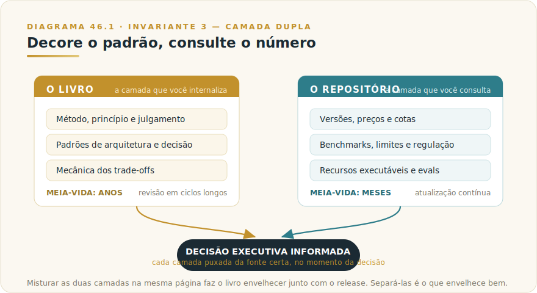

# CAPÍTULO 47
## REPOSITÓRIO ACOMPANHANTE

---

> *"Este livro foi escrito para durar. O repositório foi escrito para mudar. A obra completa é a soma dos dois — e essa soma é a única forma honesta de escrever sobre um ecossistema vivo sem mentir sobre o tempo."*

---

> 🧭 **Por que este capítulo é a aplicação do Invariante 3 — Camada Dupla**
>
> Toda obra técnica sobre IA mistura, sem perceber, dois conteúdos de meia-vida radicalmente diferente: o padrão, que dura anos, e o número, que muda em meses. Misturá-los na mesma página garante que o livro envelheça junto com o release, ainda que o método continue impecável. Este volume fez a separação de forma deliberada do primeiro ao último capítulo — cada seção de Camada Viva empurrou o perecível para fora do corpo. Este capítulo final é onde essa disciplina se materializa num artefato: o **repositório acompanhante**, a metade viva da obra. O livro é a camada que você internaliza; o repositório é a camada que você consulta. Decore o padrão, consulte o número.

---

## 47.1 — O CONCEITO INTUITIVO

Você chegou ao fim de um livro que, deliberadamente, recusou-se a te dar os números. Em quarenta e poucos capítulos, toda vez que a explicação chegou perto de um preço por milhão de tokens, de uma posição em benchmark, de um tamanho de janela de contexto ou de um nome de versão de modelo, o texto parou, nomeou o que estava em jogo e apontou para outro lugar. Esse "outro lugar" tem nome e endereço: o repositório acompanhante, em **github.com/falercia/deep-claude**.

A recusa não foi omissão. Foi arquitetura. Um livro impresso é uma fotografia: carimba o estado do mundo no instante em que foi para a gráfica. Um ecossistema de IA é um filme: muda de quadro a cada poucas semanas. Imprimir o número do filme dentro da fotografia é a forma mais garantida de produzir uma obra que nasce desatualizada — não porque o autor errou, mas porque o mundo andou à frente dele. A Camada Dupla é a resposta a esse descompasso estrutural: o que dura entra no livro, na sua cabeça, com cadência de revisão medida em anos; o que muda entra no repositório, na documentação datada, com cadência medida em semanas.

O repositório acompanhante não é um apêndice opcional nem um brinde de marketing. É a outra metade desta obra. Quem terminar o livro sem visitar o repositório aproveitou o método e ignorou a sua atualização — ficou com o mapa e dispensou a bússola que diz onde o terreno mudou desde que o mapa foi desenhado.

---

## 47.2 — ANALOGIA: O ATLAS E O BOLETIM

Pense em como um navegador sério trabalha. Ele tem duas fontes de informação que jamais confunde. A primeira é a carta náutica — o atlas dos contornos do litoral, das profundidades, dos padrões de corrente. A carta muda pouco; um bom atlas serve por anos, e o navegador o estuda até conhecer de cor a forma da costa. A segunda é o boletim meteorológico e a tábua de marés — informação que ele consulta toda manhã, porque muda todo dia, e que seria suicida tentar decorar.

O navegador competente não imprime a previsão do tempo dentro da carta náutica. Seria absurdo: a carta duraria uma manhã. Ele mantém os dois separados, cada um na sua cadência, e cruza os dois no momento da decisão — a carta diz onde estão os recifes, o boletim diz se hoje dá para passar perto deles.

Este livro é a carta náutica do ecossistema Claude: os contornos duráveis, os padrões de arquitetura, a mecânica dos trade-offs, a forma da costa que não muda com o release. O repositório acompanhante é o boletim: versões correntes, preços, benchmarks, regulação vigente, recursos executáveis atualizados. Decisão executiva boa cruza os dois — o padrão internalizado do livro, o número fresco do repositório. Decisão ruim decora o boletim de ontem e navega com ele amanhã.

---

## 47.3 — O QUE VIVE NO REPOSITÓRIO

O repositório acompanhante carrega quatro classes de conteúdo, todas unidas por uma característica: mudam rápido demais para o papel.

### 47.3.1 — Os números do Apêndice Vivo

O Apêndice Vivo (Capítulo 46) é a face impressa da camada datada; o repositório é onde esses números efetivamente vivem e se atualizam. Versões correntes de cada tier da família Claude, preços por milhão de tokens, posições em benchmark público, tamanhos de janela, limites de uso por plano — tudo com **fonte por linha e data do snapshot**. A edição impressa do apêndice carimba a data em que foi fechada; a edição viva, no repositório, é atualizada conforme o ecossistema se move. Quando a operação precisa do número da semana, é ao repositório que se vai — nunca à memória de um número lido meses atrás.

### 47.3.2 — Os recursos executáveis

O livro recusou, por princípio, virar catálogo de prompts ou tutorial de produto. Mas o profissional que quer implementar precisa de matéria-prima concreta, e ela mora no repositório: prompts setoriais executáveis, Skills prontas, MCPs de referência, exemplos de código de integração, templates de governança já aterrissados ao contexto brasileiro. A separação é a mesma de sempre — o **porquê e o quando** ficam no livro, duráveis; o **como concreto e datado** fica no repositório, atualizável. Um template de política de uso aceitável envelhece quando a regulação muda; o critério que decide o que a política precisa cobrir, não.

### 47.3.3 — Os evals e golden sets

Vimos no Capítulo 35 que sistema de IA sem avaliação é fé, não engenharia. Mas um conjunto de avaliação concreto é, por natureza, um artefato vivo — calibra-se com casos reais, ajusta-se quando o modelo muda, regride-se a cada nova versão. O repositório hospeda golden sets de referência e harnesses de eval que o leitor pode adaptar, em vez de construir do zero. O método de avaliar está no livro; os casos de teste, que mudam, estão no repositório.

### 47.3.4 — As correções e o registro de mudança

Nenhuma obra técnica está livre de erro, e nenhuma sobre IA está livre de envelhecimento. O repositório carrega a errata e o registro de versão: o que mudou no ecossistema desde a última edição, o que no livro precisa ser lido com a ressalva de uma capacidade nova, onde um padrão descrito ganhou exceção. É o mecanismo que permite à obra continuar honesta depois de impressa — porque admite, publicamente e com data, o que o tempo alterou.

---

## 47.4 — COMO OPERAR COM AS DUAS CAMADAS

A regra de ouro do Invariante 3 cabe em quatro palavras: **decore o padrão, consulte o número.** Operacionalizá-la é uma disciplina, não um slogan.

| Situação | De onde puxar | Por quê |
|----------|---------------|---------|
| Entender por que uma capacidade existe e quando usá-la | **Livro** (padrão durável) | A mecânica e o critério sobrevivem ao release |
| Decidir qual modelo/tier/preço usar agora | **Repositório** (número corrente) | Versão e custo mudam em meses |
| Defender uma arquitetura numa reunião | **Livro** internalizado | Autoridade vem do padrão, não do número decorado |
| Montar um orçamento ou um business case | **Repositório** + método do livro (Cap. 44) | O número é datado; o método de avaliar, não |
| Implementar um caso concreto | Critério no **livro**, recurso no **repositório** | Porquê durável + como atualizável |
| Conferir se a regulação ainda vale | **Repositório** (Apêndice Vivo, seção BR) | Status legislativo muda; o princípio de compliance, não |

O sinal de que você internalizou a Camada Dupla é simples: você para de sentir a necessidade de decorar números, e passa a sentir desconforto quando alguém apresenta uma decisão importante apoiada num número que não foi puxado da fonte naquele dia. O capital que você leva deste livro é o padrão — portável, sobrevive à troca de empresa, de fornecedor e de roadmap. O número é específico ao release; tratá-lo como permanente é transformar conhecimento em passivo.

> 🎯 **PARA EXECUTIVOS**
> Institua na sua operação a mesma separação que este livro instituiu. Decisões arquiteturais e de método revisadas em cadência longa, ancoradas no padrão; números de modelo, preço e benchmark puxados de uma fonte única e datada — o seu próprio "Apêndice Vivo" interno, alimentado pelo repositório — antes de cada decisão relevante. Equipe que decora número de release toma decisão de moda; equipe que opera com camada dupla toma decisão informada. A diferença não aparece hoje; aparece na primeira vez que o fornecedor muda o preço e metade do mercado continua citando o número antigo.

---

## 47.5 — EXEMPLO MEMORÁVEL: A DECISÃO QUE SOBREVIVEU A TRÊS VERSÕES

*Cenário ilustrativo brasileiro.* Uma líder de engenharia de uma empresa de software em Florianópolis desenhou, no início de um ano, a arquitetura de roteamento de modelos do produto da empresa: classificar a complexidade da requisição na entrada e dirigir cada chamada ao tier adequado, conforme o padrão do Capítulo 5. Ela documentou a **decisão** — a lógica de roteamento, os critérios de complexidade, os pontos de verificação humana — separada dos **números** — quais modelos, a que preço, com qual janela — que deixou numa planilha viva alimentada pelo repositório acompanhante.

Ao longo dos dezoito meses seguintes, o ecossistema se moveu três vezes: novas versões de modelo, mudança de preço relativo entre tiers, uma capacidade nova que antes exigia um modelo premium e passou a caber no balanceado. A cada movimento, a equipe atualizou a planilha — o número — e a arquitetura de roteamento — o padrão — permaneceu intacta. A lógica "classifique na entrada, roteie por complexidade, verifique no ponto consequente" não envelheceu uma única vez, porque era padrão, não release.

A lição estrutural é o livro inteiro num episódio. Se ela tivesse cravado os nomes de modelo e os preços dentro do documento de arquitetura, teria reescrito a arquitetura três vezes em dezoito meses — e provavelmente errado em alguma das pressas. Porque separou as camadas, atualizou só o que muda e preservou o que dura. **O documento de decisão dela tem exatamente a mesma estrutura deste livro: método no corpo, número na camada viva. É por isso que continua válido enquanto os releases passam.**

---

## 47.6 — NA PRÁTICA: TRÊS APLICAÇÕES REPLICÁVEIS

O exemplo da líder de engenharia em Florianópolis mostra a Camada Dupla funcionando em decisão de arquitetura de produto; esta seção entrega o roteiro para replicar a disciplina em três contextos distintos. Cada aplicação segue a forma *situação → o que fazer → o ponto de julgamento*, porque a separação entre padrão e número é um hábito operacional — não um evento de configuração.

**Aplicação 1 — Criar o "Apêndice Vivo" interno da sua organização.**
*Situação:* a equipe toma decisões de modelo, tier e custo citando números lidos há semanas ou meses — em artigos, neste livro, em reuniões passadas. Quando o fornecedor muda preços ou lança nova versão, ninguém sabe ao certo se o raciocínio da última decisão ainda vale. *O que fazer:* crie um documento interno datado — uma planilha, uma página de Notion, um arquivo no repositório da equipe — com as seguintes linhas: modelo em uso por caso de uso, custo por milhão de tokens (input/output), tamanho de janela de contexto, data do snapshot, e fonte verificável. Atualize a cada mudança relevante no ecossistema, com data e link para o anúncio original. *O ponto de julgamento:* se alguém citar um número numa reunião de orçamento ou arquitetura, a pergunta-padrão deve ser "de quando é esse número e está no Apêndice Vivo?" — não "parece certo". O Invariante 3 é uma disciplina de time: o padrão está na cabeça de quem leu o livro; o número precisa estar num lugar que qualquer membro da equipe possa verificar hoje (Invariante 3 — Camada Dupla: decore o padrão, consulte o número).

**Aplicação 2 — Separar padrão de número num documento de arquitetura existente.**
*Situação:* a organização tem um documento de arquitetura — ADR, RFC, decision log — que mistura princípios de design com nomes de modelos e preços específicos. Toda vez que o ecossistema muda, o documento "envelhece" e ninguém sabe o que ainda vale. *O que fazer:* identifique, nesse documento, cada sentença que contém um nome de versão de modelo, um preço, um benchmark ou um limite de tokens; mova esses elementos para uma seção "Referências Voláteis" com data de snapshot; substitua no corpo do documento por referência à seção ("ver Referências Voláteis — snapshot de DD/MM/AAAA"). O princípio de decisão — "rotear por complexidade usando modelo balanceado para requisições simples e premium para análise multiestágio" — fica no corpo durável. "Claude Sonnet 4.5 a R$ X por milhão de tokens" vai para a seção datada. *O ponto de julgamento:* ao fim da separação, o corpo do documento deve fazer sentido e ser defensável mesmo que todos os números mudem amanhã. Se não fizer, o padrão ainda está acoplado ao release — e o documento vai precisar ser reescrito, não apenas atualizado (Invariante 3: o que o livro inteiro fez pela sua obra, você faz pelo seu documento de arquitetura).

**Aplicação 3 — Estabelecer o ritual de verificação antes de decisão relevante.**
*Situação:* a equipe vai tomar uma decisão de orçamento anual para IA ou apresentar um business case ao CFO. O slide tem números — custo por token, comparativo entre provedores, estimativa de TCO. Alguém precisa verificar se esses números são correntes antes que o slide saia da sala. *O que fazer:* estabeleça um ritual formal: antes de qualquer decisão ou apresentação com números de modelo/custo, um membro da equipe verifica cada número no repositório acompanhante e nas fontes primárias (documentação do fornecedor, pricing page oficial) e assina a data de verificação. Se o número mudou desde o último documento, atualiza e registra a mudança. *O ponto de julgamento:* a resistência a esse ritual vai vir da percepção de que "provavelmente não mudou". Essa percepção é exatamente o que o Invariante 3 combate — o número que "provavelmente não mudou" e mudou é o passivo que aparece na reunião de revisão de orçamento, não na de planejamento. O ritual existe para tornar o erro visível antes da decisão, não depois (Invariante 3 — Camada Dupla: o número fresco é o que distingue decisão informada de decisão de moda).

> 🔧 **EXERCÍCIO**
> Abra o último documento de arquitetura, business case ou apresentação executiva que sua equipe produziu envolvendo Claude ou IA em geral. Sublínhe cada número — preço, versão de modelo, benchmark, tamanho de janela, percentual de adoção, dado de mercado. Para cada número sublinhado, verifique: (a) qual é a fonte? (b) de quando é? (c) está no seu Apêndice Vivo interno? Se algum número não tiver fonte verificável com data de menos de noventa dias, você encontrou o passivo. O exercício não é corrigir o documento — é decidir conscientemente se a decisão que aquele documento sustenta seria diferente com o número corrente.

---

## 47.7 — CAMADA VIVA

Coerente com tudo o que defendeu, este capítulo não contém:

- O endereço de cada recurso específico dentro do repositório (a estrutura de pastas evolui)
- A lista corrente de Skills, MCPs e templates disponíveis
- As versões, preços e benchmarks que motivam a própria existência da camada viva

Tudo isso vive no **[Apêndice Vivo (Capítulo 46)](../04-apendices/L2-APX-J-apendice-vivo.md)** e no repositório acompanhante, com fonte e data. O único endereço estável que este capítulo crava é o do próprio repositório — porque o ponteiro para a camada viva é, ele mesmo, parte da camada durável.

---

## 47.8 — LIMITAÇÕES E CUIDADOS

A primeira é a **disciplina de manutenção**. Uma camada viva só cumpre sua função se for efetivamente atualizada; um repositório abandonado é pior que número nenhum, porque carrega a aparência de atual sem a substância. A cadência declarada do Apêndice Vivo — revisão periódica, com fonte e data por linha — é um compromisso que precisa ser honrado para que a Camada Dupla funcione.

A segunda é a **tentação de migrar de volta**. Sob pressão, é tentador "só colocar o número no slide" em vez de puxá-lo da fonte. Toda vez que isso acontece, um pedaço de conteúdo perecível volta a se misturar ao durável, e o envelhecimento recomeça. A disciplina é permanente, não um ato único.

A terceira é que **o repositório não substitui o julgamento**. Ele entrega número fresco e recurso pronto, não decisão. O padrão que decide se aquele número importa para a sua operação continua sendo seu, e mora no livro e na sua cabeça — não num arquivo que se baixa.

---

## 47.9 — CONEXÕES COM OUTROS CAPÍTULOS

- 🔗 **O Invariante que rege este capítulo** → [Framework 9 — Rota Dupla](../../Livro-1-Os-Invariantes/03-frameworks/L1-F9-rota-dupla.md)
- 🔗 **A face impressa da camada viva** → [Capítulo 45 — Apêndice Vivo](../04-apendices/L2-APX-J-apendice-vivo.md)
- 🔗 **Onde os números são consultados antes de decidir** → [Capítulo 5 — Quando Usar Opus, Sonnet, Haiku](L2-C05-quando-usar-modelos.md) · [Capítulo 44 — ROI, Métricas e Orçamento](L2-C44-roi-metricas.md)
- 🔗 **Evals e golden sets como artefato vivo** → [Capítulo 35 — Evaluations](L2-C35-evaluations.md)
- 🔗 **A operação contínua que consome a camada viva** → [Capítulo 36 — LLMOps](L2-C36-llmops.md)
- 🔗 **A literacia que torna a camada dupla um hábito** → [Capítulo 1 — AI Fluency Executiva](L2-C01-executivos.md)

---

## 47.10 — RESUMO EXECUTIVO

| Conceito | Síntese |
|----------|---------|
| **O que é o repositório** | A metade viva da obra — `github.com/falercia/deep-claude` — onde mora o que muda rápido demais para o papel |
| **Invariante regente** | 3 — Camada Dupla: decore o padrão, consulte o número |
| **O que vive lá** | Números do Apêndice Vivo (com fonte/data), recursos executáveis, evals/golden sets, errata e registro de mudança |
| **Como operar** | Padrão internalizado do livro + número fresco do repositório, cruzados no momento da decisão |
| **A disciplina** | Nada de perecível no corpo durável; manutenção honrada na cadência declarada |
| **A armadilha** | Decorar o número de release e tratá-lo como permanente — conhecimento que vira passivo |

---

## 47.11 — VALIDAÇÃO UAU

| # | Critério | Você consegue? |
|---|----------|----------------|
| 1 | **Clareza** — Explicar a Camada Dupla e por que este livro recusou dar números, em 60 segundos | ☐ |
| 2 | **Profundidade** — Distinguir, num documento técnico seu, o que é padrão durável do que é número datado | ☐ |
| 3 | **Aplicação** — Montar a sua própria camada viva interna, alimentada pelo repositório, para decisões de modelo/custo | ☐ |
| 4 | **Disciplina** — Reconhecer e recusar a tentação de cravar número de release no documento durável | ☐ |
| 5 | **Transformação** — Operar, daqui para frente, decorando o padrão e consultando o número — não o contrário | ☐ |

---

> *"Você terminou o livro. Não terminou a obra — porque a obra, por desenho, nunca termina: o repositório continua se movendo com o ecossistema, e o método que você internalizou continua decidindo o que daquele movimento importa. Modelos passam. Método fica. E o método, agora, é seu."*
